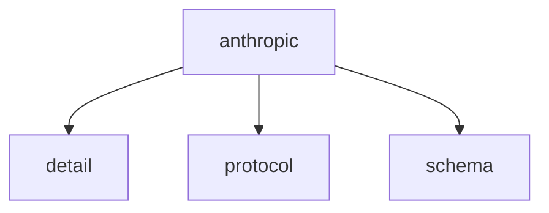

# Namespace `clore::net::anthropic`

## Summary

The `clore::net::anthropic` namespace provides a set of asynchronous interfaces for interacting with Anthropic’s language model and completion `APIs`. Its primary functions include overloads of `call_llm_async`, which accept model identifiers, prompts, system prompts, and configuration parameters; `call_completion_async`, which takes an integer handle and an event loop to finalize a prior request; and the template function `call_structured_async<T>`, designed to return a typed, structured response from the API. All asynchronous operations are scheduled on a `kota::event_loop` and return an integer handle that callers must retain for later completion polling. The namespace abstracts the details of HTTP communication and event‑loop integration, letting higher‑level code initiate non‑blocking Anthropic calls without managing network or concurrency primitives directly. Its architectural role is to serve as a low‑level network client that bridges the Anthropic service with the library’s event‑driven runtime, ensuring that string arguments remain valid until an operation completes and that the event loop remains active throughout the async invocation.

## Diagram

## Subnamespaces

- [`clore::net::anthropic::detail`](detail/index.md)
- [`clore::net::anthropic::protocol`](protocol/index.md)
- [`clore::net::anthropic::schema`](schema/index.md)

## Functions

### `clore::net::anthropic::call_completion_async`

Declaration: `network/anthropic.cppm:722`

Definition: `network/anthropic.cppm:764`

Implementation: [`Module anthropic`](../../../../modules/anthropic/index.md)

The function `clore::net::anthropic::call_completion_async` initiates an asynchronous call to the Anthropic completion API. It accepts an integer parameter that identifies the request or configures the call, and a reference to a `kota::event_loop` on which the asynchronous operation is scheduled. The function returns an integer value that represents the status of the operation or a handle to the pending request. Callers must ensure the provided event loop remains live for the duration of the asynchronous work; the meaning of the integer argument and the exact contract for the returned value are defined by the component's public interface.

#### Usage Patterns

- Used to start an async completion call and obtain a task that can be awaited.
- Typically called from event-loop-driven code that needs to query an AI model.

### `clore::net::anthropic::call_llm_async`

Declaration: `network/anthropic.cppm:732`

Definition: `network/anthropic.cppm:782`

Implementation: [`Module anthropic`](../../../../modules/anthropic/index.md)

Initiates an asynchronous request to the Anthropic language model service, scheduling the operation on the provided `kota::event_loop`. The caller supplies three `std::string_view` parameters—typically a model identifier, a user message, and an API credential—and a reference to an event loop that will drive the asynchronous completion. The function returns an `int` handle that uniquely identifies this request.

The caller should retain the returned `int` to later retrieve the outcome via `call_completion_async`. All string arguments must remain valid until the operation completes, as the asynchronous mechanism may refer to them without copying. The `kota::event_loop` must be active and running for the request to progress.

#### Usage Patterns

- Await the returned task to obtain the LLM response.
- Call from an async context with an active `kota::event_loop`.

### `clore::net::anthropic::call_llm_async`

Declaration: `network/anthropic.cppm:726`

Definition: `network/anthropic.cppm:771`

Implementation: [`Module anthropic`](../../../../modules/anthropic/index.md)

The function `clore::net::anthropic::call_llm_async` initiates an asynchronous request to the Anthropic large language model API. The caller provides two `std::string_view` arguments (likely identifying the model and the system prompt or a message), an `int` argument (typically a timeout, retry count, or a configuration identifier), and a reference to a `kota::event_loop` that will drive the asynchronous operation. The returned `int` value is an opaque handle that the caller must retain for subsequent use with functions such as `clore::net::anthropic::call_completion_async` to poll or finalise the result. The caller is responsible for ensuring the `kota::event_loop` remains active for the duration of the asynchronous call; otherwise the operation may never complete.

#### Usage Patterns

- Called by other async functions to obtain an LLM response.
- Used with `kota::event_loop` for asynchronous execution.

### `clore::net::anthropic::call_structured_async`

Declaration: `network/anthropic.cppm:739`

Definition: `network/anthropic.cppm:794`

Implementation: [`Module anthropic`](../../../../modules/anthropic/index.md)

The template function `clore::net::anthropic::call_structured_async<T>` initiates an asynchronous request to the Anthropic API to obtain a structured (typed) response. It accepts three `std::string_view` arguments — likely a system prompt, user prompt, and a schema or model identifier — and a `kota::event_loop &` on which the asynchronous completion will be dispatched. The function returns an `int` that serves as a handle for the pending operation; the caller can use this handle to later retrieve the parsed result of type `T` once the operation completes. The caller is responsible for ensuring the event loop is running and that the provided strings remain valid for the duration of the asynchronous call.

#### Usage Patterns

- Called to perform structured async LLM interactions with Anthropic
- Acts as a type-safe wrapper binding `detail::Protocol`
- Used in coroutine contexts where `co_await` is applied

## Related Pages

- [Namespace clore::net](../index.md)
- [Namespace clore::net::anthropic::detail](detail/index.md)
- [Namespace clore::net::anthropic::protocol](protocol/index.md)
- [Namespace clore::net::anthropic::schema](schema/index.md)

