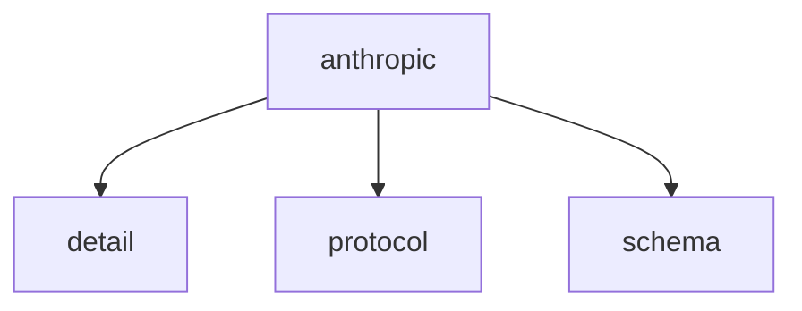

# Namespace `clore::net::anthropic`

## Summary

The `clore::net::anthropic` namespace provides an asynchronous client interface for interacting with Anthropic language models. Its core responsibility is to manage the lifecycle of non‑blocking API requests through a set of overloaded functions that accept string‑view parameters for model identifiers, prompts, and system messages, along with a `kota::event_loop` reference to drive asynchronous operations.

Notable declarations include `call_llm_async`, `call_completion_async`, and `call_structured_async`, all returning an `int` handle that uniquely identifies a pending request. The namespace acts as a dedicated layer within the `clore` networking subsystem, separating Anthropic‑specific protocol handling from generic event‑loop management. It is designed to be used with companion functions to retrieve results or track completion, and requires the caller to keep input string views and the event loop active for the duration of each operation.

## Diagram

## Subnamespaces

- [`clore::net::anthropic::detail`](detail/index.md)
- [`clore::net::anthropic::protocol`](protocol/index.md)
- [`clore::net::anthropic::schema`](schema/index.md)

## Functions

### `clore::net::anthropic::call_completion_async`

Declaration: `network/anthropic.cppm:729`

Definition: `network/anthropic.cppm:771`

Implementation: [`Module anthropic`](../../../../modules/anthropic/index.md)

The function `clore::net::anthropic::call_completion_async` initiates an asynchronous request to obtain a completion for a previously started LLM interaction. The caller must provide an integer identifier (typically returned from an earlier call such as `call_llm_async`) and a reference to a `kota::event_loop` that will manage the asynchronous lifecycle. The function returns an integer that may represent a new request handle or a status code; the caller should use this value to track or verify the initiation of the request. This overload is part of the Anthropic client’s public async API, distinguished from related functions by its parameter types and purpose.

#### Usage Patterns

- Calling this function to initiate an asynchronous LLM completion request to the Anthropic API
- Awaiting the returned `kota::task` to obtain a `CompletionResponse` or handle an `LLMError`

### `clore::net::anthropic::call_llm_async`

Declaration: `network/anthropic.cppm:739`

Definition: `network/anthropic.cppm:789`

Implementation: [`Module anthropic`](../../../../modules/anthropic/index.md)

The `clore::net::anthropic::call_llm_async` function initiates an asynchronous request to an Anthropic language model. It accepts three `std::string_view` parameters representing the model identifier, the input prompt, and an additional context (such as a system message or configuration), along with a reference to a `kota::event_loop` that will manage the asynchronous operation. The return value is an `int` handle that identifies the pending operation and can be used with `call_completion_async` to retrieve the result. The caller is responsible for ensuring that the provided string views remain valid until the operation completes, and that the event loop remains active for the duration of the request.

#### Usage Patterns

- Called as a coroutine within an event-loop-driven context
- Used to obtain an LLM-generated string response asynchronously
- Serves as a high-level entry point for Anthropic API interactions, alongside `call_completion_async` and `call_structured_async`

### `clore::net::anthropic::call_llm_async`

Declaration: `network/anthropic.cppm:733`

Definition: `network/anthropic.cppm:778`

Implementation: [`Module anthropic`](../../../../modules/anthropic/index.md)

`clore::net::anthropic::call_llm_async` initiates an asynchronous request to an Anthropic language model. The caller supplies two string views (typically an API key and a prompt or model identifier), an integer parameter (e.g., specifying generation configuration), and a `kota::event_loop &` to drive the asynchronous operation. The function returns an `int` handle that can be used with companion functions such as `call_completion_async` to retrieve the result or manage the pending call. The event loop must remain active for the duration of the operation; the contract guarantees that the returned handle uniquely identifies the pending request until completion or cancellation.

#### Usage Patterns

- asynchronous LLM call with error propagation
- high-level wrapper over the core networking layer

### `clore::net::anthropic::call_structured_async`

Declaration: `network/anthropic.cppm:746`

Definition: `network/anthropic.cppm:801`

Implementation: [`Module anthropic`](../../../../modules/anthropic/index.md)

The function `clore::net::anthropic::call_structured_async` is a template function that initiates an asynchronous request to the Anthropic API for a structured (typed) response. It expects a model identifier, system prompt, and user message as string views, along with a reference to a `kota::event_loop`. The template parameter `T` designates the expected structured output type. The function returns an `int` handle that identifies the pending operation; the caller can later combine this handle with `call_completion_async` to await the completed result.

#### Usage Patterns

- Called with a concrete type `T` for structured response deserialization
- Used in asynchronous contexts where a coroutine handles the result
- Typically chained with other `kota::task` combinators or awaited directly

## Related Pages

- [Namespace clore::net](../index.md)
- [Namespace clore::net::anthropic::detail](detail/index.md)
- [Namespace clore::net::anthropic::protocol](protocol/index.md)
- [Namespace clore::net::anthropic::schema](schema/index.md)

