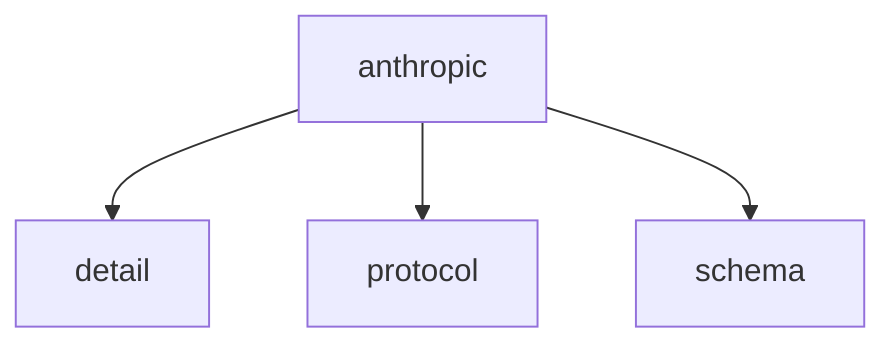

# Namespace `clore::net::anthropic`

## Summary

The `clore::net::anthropic` namespace provides an asynchronous abstraction for interacting with the Anthropic language model API. It defines three core entry points: `call_llm_async` for general text generation, `call_structured_async` for requests returning a structured type, and `call_completion_async` for retrieving results of a previously issued request. Each function accepts parameters such as model identifier, prompt, system instructions, and a `kota::event_loop` reference, and returns an opaque integer handle that identifies the ongoing operation.

Architecturally, this namespace forms the networking layer for Anthropic-specific LLM calls, decoupling the client code from the underlying API details and threading model. The returned handles enable deferred result retrieval via `call_completion_async`, and the event loop parameter ensures the caller can integrate the asynchronous operations into their own concurrency framework. The design emphasizes asynchronous, non‑blocking invocation with explicit lifecycle management of the event loop and request handles.

## Diagram

```mermaid
graph TD
    NS["anthropic"]
    NSC0["detail"]
    NS --> NSC0
    NSC1["protocol"]
    NS --> NSC1
    NSC2["schema"]
    NS --> NSC2
```

## Subnamespaces

- [`clore::net::anthropic::detail`](detail/index.md)
- [`clore::net::anthropic::protocol`](protocol/index.md)
- [`clore::net::anthropic::schema`](schema/index.md)

## Functions

### `clore::net::anthropic::call_completion_async`

Declaration: `src/network/anthropic.cppm:738`

Definition: `src/network/anthropic.cppm:780`

Implementation: [`Module anthropic`](../../../../modules/anthropic/index.md)

The function `clore::net::anthropic::call_completion_async` initiates an asynchronous request to the Anthropic completion API. It accepts an `int` parameter (representing the context or identifier for the completion operation) and a reference to a `kota::event_loop` that will dispatch the callback upon completion. The function returns an `int` value that indicates the status of the operation or provides a handle for the asynchronous task. Callers are responsible for ensuring the provided event loop remains active until the operation completes.

#### Usage Patterns

- Called to perform an Anthropic completion request asynchronously
- Part of the coroutine-based API for LLM calls

### `clore::net::anthropic::call_llm_async`

Declaration: `src/network/anthropic.cppm:742`

Definition: `src/network/anthropic.cppm:787`

Implementation: [`Module anthropic`](../../../../modules/anthropic/index.md)

Initiates an asynchronous call to the Anthropic language model API. The caller provides a system instruction (first `std::string_view`), a user message (second `std::string_view`), a maximum token limit (`int`), and a `kota::event_loop&` on which the operation will be scheduled. The function returns an `int` that serves as an opaque request identifier, which can later be used with related completion facilities (such as `clore::net::anthropic::call_completion_async`) to retrieve the response or monitor progress.

The contract requires that the given `kota::event_loop` remains alive until the asynchronous operation completes. The returned integer is valid only within the lifetime of the same event loop and should not be reused after the associated request is finished. This overload is intended for simple text generation where the caller directly controls the maximum number of output tokens.

#### Usage Patterns

- called as part of the `clore::net::anthropic` LLM API
- may be used to initiate an asynchronous LLM call with a given request ID

### `clore::net::anthropic::call_llm_async`

Declaration: `src/network/anthropic.cppm:748`

Definition: `src/network/anthropic.cppm:798`

Implementation: [`Module anthropic`](../../../../modules/anthropic/index.md)

The function `clore::net::anthropic::call_llm_async` initiates an asynchronous request to the Anthropic language model. The caller provides three mandatory `std::string_view` parameters—likely representing the model identifier, a system context or prompt, and the user input—along with a reference to a `kota::event_loop` that will drive the asynchronous operation. The function returns an `int` token that identifies this specific request. The caller can later pass this token to `call_completion_async` to retrieve the model’s response. It is the caller’s responsibility to ensure that the event loop remains active until the operation completes.

#### Usage Patterns

- Called from asynchronous contexts to obtain LLM completions
- Used as a wrapper around the generic `call_llm_async` with the Anthropic protocol

### `clore::net::anthropic::call_structured_async`

Declaration: `src/network/anthropic.cppm:755`

Definition: `src/network/anthropic.cppm:810`

Implementation: [`Module anthropic`](../../../../modules/anthropic/index.md)

The template function `clore::net::anthropic::call_structured_async` initiates an asynchronous call to the Anthropic API and returns a structured result of type `T`. The caller supplies three `std::string_view` arguments representing the model identifier, the prompt, and additional configuration, along with a `kota::event_loop &` to which the completion will be posted. The function returns an `int` handle that can be passed to `clore::net::anthropic::call_completion_async` to await the result. The caller is responsible for ensuring that the event loop remains active until the asynchronous operation completes and that the resource identified by the returned handle is eventually consumed.

#### Usage Patterns

- Public entry point for structured async LLM calls
- Used to obtain a task that resolves to type T or `LLMError`

## Related Pages

- [Namespace clore::net](../index.md)
- [Namespace clore::net::anthropic::detail](detail/index.md)
- [Namespace clore::net::anthropic::protocol](protocol/index.md)
- [Namespace clore::net::anthropic::schema](schema/index.md)

