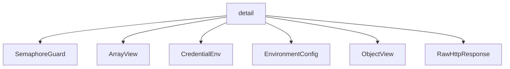

# Namespace `clore::net::detail`

## Summary

The `clore::net::detail` namespace contains the internal implementation details for the network layer, primarily focused on HTTPS communication with LLM endpoints. It provides low‑level building blocks such as JSON parsing and validation utilities (e.g., `expect_array`, `expect_object`, `parse_json_value`), view‑type wrappers for safe JSON traversal (`ArrayView`, `ObjectView`), and functions for constructing and serializing request payloads (`serialize_value_to_string`, `insert_string_field`). Asynchronous HTTP operations are managed through `perform_http_request_async` and `request_text_once_async`, while concurrency is controlled via shared semaphores (`g_llm_semaphore`) and mutexes (`g_llm_semaphore_mutex`). The namespace also defines environment‑reading helpers (`read_environment`, `read_required_env`), credential handling (`CredentialEnv`, `read_credentials`), and a set of compile‑time constants for timeouts, keep‑alive intervals, and cache durations. Together, these components form a reusable infrastructure that supports the higher‑level `clore::net` API, isolating complexity and ensuring consistent error handling and configuration across HTTP‑based LLM interactions.

## Diagram



## Types

### `clore::net::detail::ArrayView`

Declaration: `network/protocol.cppm:178`

Definition: `network/protocol.cppm:178`

Implementation: [`Module protocol`](../../../../modules/protocol/index.md)

Insufficient evidence to summarize; provide more EVIDENCE.

#### Member Functions

##### `clore::net::detail::ArrayView::begin`

Declaration: `network/protocol.cppm:189`

Definition: `network/protocol.cppm:189`

Implementation: [`Module protocol`](../../../../modules/protocol/index.md)

###### Declaration

```cpp
const_iterator () const noexcept;
```

##### `clore::net::detail::ArrayView::empty`

Declaration: `network/protocol.cppm:181`

Definition: `network/protocol.cppm:181`

Implementation: [`Module protocol`](../../../../modules/protocol/index.md)

###### Declaration

```cpp
auto () const noexcept -> bool;
```

##### `clore::net::detail::ArrayView::end`

Declaration: `network/protocol.cppm:193`

Definition: `network/protocol.cppm:193`

Implementation: [`Module protocol`](../../../../modules/protocol/index.md)

###### Declaration

```cpp
const_iterator () const noexcept;
```

##### `clore::net::detail::ArrayView::operator*`

Declaration: `network/protocol.cppm:205`

Definition: `network/protocol.cppm:205`

Implementation: [`Module protocol`](../../../../modules/protocol/index.md)

###### Declaration

```cpp
auto () const noexcept -> const kota::codec::json::Array &;
```

##### `clore::net::detail::ArrayView::operator->`

Declaration: `network/protocol.cppm:201`

Definition: `network/protocol.cppm:201`

Implementation: [`Module protocol`](../../../../modules/protocol/index.md)

###### Declaration

```cpp
auto () const noexcept -> const kota::codec::json::Array *;
```

##### `clore::net::detail::ArrayView::operator[]`

Declaration: `network/protocol.cppm:197`

Definition: `network/protocol.cppm:197`

Implementation: [`Module protocol`](../../../../modules/protocol/index.md)

###### Declaration

```cpp
auto (std::size_t) const -> const kota::codec::json::Value &;
```

##### `clore::net::detail::ArrayView::size`

Declaration: `network/protocol.cppm:185`

Definition: `network/protocol.cppm:185`

Implementation: [`Module protocol`](../../../../modules/protocol/index.md)

###### Declaration

```cpp
auto () const noexcept -> std::size_t;
```

### `clore::net::detail::CredentialEnv`

Declaration: `network/provider.cppm:14`

Definition: `network/provider.cppm:14`

Implementation: [`Module provider`](../../../../modules/provider/index.md)

Insufficient evidence to summarize; provide more EVIDENCE.

#### Invariants

- Members are valid `std::string_view` objects; no further guarantees are provided

#### Key Members

- `base_url_env`: environment variable name for the base URL
- `api_key_env`: environment variable name for the API key

#### Usage Patterns

- No usage patterns are explicitly documented in the evidence

### `clore::net::detail::EnvironmentConfig`

Declaration: `network/http.cppm:37`

Definition: `network/http.cppm:37`

Implementation: [`Module http`](../../../../modules/http/index.md)

Insufficient evidence to summarize; provide more EVIDENCE.

#### Invariants

- Both members are always of type `std::string`
- No guarantee of non-empty or valid content

#### Key Members

- `api_base`
- `api_key`

#### Usage Patterns

- Constructed with environment-specific values before initializing higher-level network objects
- Passed by value or const reference to setup HTTP clients or service wrappers

### `clore::net::detail::ObjectView`

Declaration: `network/protocol.cppm:156`

Definition: `network/protocol.cppm:156`

Implementation: [`Module protocol`](../../../../modules/protocol/index.md)

Insufficient evidence to summarize; provide more EVIDENCE.

#### Invariants

- The `value` pointer may be null by default.
- When `value` is non‑null, the pointed‑to object must outlive the view.
- No lifetime management is performed by the view.

#### Key Members

- `value` – pointer to the underlying JSON object.
- `get(std::string_view)` – retrieves an optional cursor for a given key.
- `begin()` / `end()` – iterator access to the object’s key‑value pairs.
- `operator->()` / `operator*()` – dereference to the underlying object.

#### Usage Patterns

- Returned from functions that provide read‑only access to a JSON object without transferring ownership.
- Used in protocol‑level parsing to read structured message fields.
- Often passed by value or const reference to functions that need a temporary, non‑owning handle.

#### Member Functions

##### `clore::net::detail::ObjectView::begin`

Declaration: `network/protocol.cppm:161`

Definition: `network/protocol.cppm:161`

Implementation: [`Module protocol`](../../../../modules/protocol/index.md)

###### Declaration

```cpp
const_iterator () const noexcept;
```

##### `clore::net::detail::ObjectView::end`

Declaration: `network/protocol.cppm:165`

Definition: `network/protocol.cppm:165`

Implementation: [`Module protocol`](../../../../modules/protocol/index.md)

###### Declaration

```cpp
const_iterator () const noexcept;
```

##### `clore::net::detail::ObjectView::get`

Declaration: `network/protocol.cppm:159`

Definition: `network/protocol.cppm:280`

Implementation: [`Module protocol`](../../../../modules/protocol/index.md)

###### Declaration

```cpp
auto (std::string_view) const -> std::optional<json::Cursor>;
```

##### `clore::net::detail::ObjectView::operator*`

Declaration: `network/protocol.cppm:173`

Definition: `network/protocol.cppm:173`

Implementation: [`Module protocol`](../../../../modules/protocol/index.md)

###### Declaration

```cpp
auto () const noexcept -> const kota::codec::json::Object &;
```

##### `clore::net::detail::ObjectView::operator->`

Declaration: `network/protocol.cppm:169`

Definition: `network/protocol.cppm:169`

Implementation: [`Module protocol`](../../../../modules/protocol/index.md)

###### Declaration

```cpp
auto () const noexcept -> const kota::codec::json::Object *;
```

### `clore::net::detail::RawHttpResponse`

Declaration: `network/http.cppm:42`

Definition: `network/http.cppm:42`

Implementation: [`Module http`](../../../../modules/http/index.md)

Insufficient evidence to summarize; provide more EVIDENCE.

#### Invariants

- `http_status` may be zero or any valid HTTP status code
- `body` may be empty or contain response content

#### Key Members

- `http_status`
- `body`

#### Usage Patterns

- Used as a return type or intermediate data holder for HTTP responses
- Likely populated by HTTP parsing or networking code

## Variables

### `clore::net::detail::g_llm_request_counter`

Declaration: `network/http.cppm:97`

Implementation: [`Module http`](../../../../modules/http/index.md)

A global atomic counter of type `std::atomic<std::uint64_t>` initialized to `0`, used to uniquely identify LLM network requests.

#### Usage Patterns

- read to produce a unique request number
- used in HTTP request lifecycle of `perform_http_request_async`

### `clore::net::detail::g_llm_semaphore`

Declaration: `network/http.cppm:48`

Implementation: [`Module http`](../../../../modules/http/index.md)

The variable `clore::net::detail::g_llm_semaphore` is an `extern std::shared_ptr<kota::semaphore>` declared at `network/http.cppm:48`. It serves as a rate-limiting semaphore to control concurrency of LLM requests within the networking layer.

#### Usage Patterns

- referenced in rate‑limiting setup and teardown functions
- used to enforce a maximum concurrency of LLM requests

### `clore::net::detail::g_llm_semaphore_mutex`

Declaration: `network/http.cppm:47`

Implementation: [`Module http`](../../../../modules/http/index.md)

`clore::net::detail::g_llm_semaphore_mutex` is an `extern std::mutex` variable declared in the `clore::net::detail` namespace. It provides mutual exclusion for operations involving the LLM rate-limiting semaphore.

#### Usage Patterns

- locked/unlocked in `clore::net::initialize_llm_rate_limit`
- locked/unlocked in `clore::net::detail::(anonymous namespace)::current_llm_semaphore`
- locked/unlocked in `clore::net::shutdown_llm_rate_limit`

### `clore::net::detail::kConnMaxAgeSec`

Declaration: `network/http.cppm:102`

Implementation: [`Module http`](../../../../modules/http/index.md)

`clore::net::detail::kConnMaxAgeSec` is a compile-time constant of type `long` with value 300, declared in the `clore::net::detail` namespace.

#### Usage Patterns

- Read by `clore::net::detail::configure_request` to set connection max age

### `clore::net::detail::kDnsCacheTimeoutSec`

Declaration: `network/http.cppm:101`

Implementation: [`Module http`](../../../../modules/http/index.md)

The constant `clore::net::detail::kDnsCacheTimeoutSec` is declared as `constexpr long` with a value of 300 in the file `network/http.cppm`. It is a compile-time constant representing the DNS cache timeout in seconds.

#### Usage Patterns

- Used in `clore::net::detail::configure_request` to set DNS cache timeout

### `clore::net::detail::kHttpConnectTimeoutMs`

Declaration: `network/http.cppm:99`

Implementation: [`Module http`](../../../../modules/http/index.md)

`clore::net::detail::kHttpConnectTimeoutMs` is a `constexpr long` constant defined at `network/http.cppm:99` with a value of `5'000`. It represents the default connection timeout duration in milliseconds for HTTP requests within the networking layer.

#### Usage Patterns

- passed to `configure_request` to set connection timeout

### `clore::net::detail::kHttpRequestTimeout`

Declaration: `network/http.cppm:100`

Implementation: [`Module http`](../../../../modules/http/index.md)

A constant defining the timeout duration for HTTP requests as 120 seconds (`std::chrono::milliseconds(120'000)`), declared `constexpr` and publicly accessible in the `clore::net::detail` namespace.

#### Usage Patterns

- Referenced as a constant timeout value in HTTP request logic (inferred from name and module context).

### `clore::net::detail::kTcpKeepIdleSec`

Declaration: `network/http.cppm:103`

Implementation: [`Module http`](../../../../modules/http/index.md)

The variable `clore::net::detail::kTcpKeepIdleSec` is a compile-time constant of type `long` initialized to `60`, declared at `network/http.cppm:103`. It represents the idle time in seconds before the system starts sending TCP keep-alive probes.

#### Usage Patterns

- reads in `clore::net::detail::configure_request` to set socket keep-alive idle timeout

### `clore::net::detail::kTcpKeepIntvlSec`

Declaration: `network/http.cppm:104`

Implementation: [`Module http`](../../../../modules/http/index.md)

`clore::net::detail::kTcpKeepIntvlSec` is a `constexpr long` constant declared at `network/http.cppm:104` with a value of `10`. It resides in the `clore::net::detail` namespace and provides a default TCP keepalive interval in seconds.

#### Usage Patterns

- consumed as a constant in `clore::net::detail::configure_request` to set the TCP keepalive interval

## Functions

### `clore::net::detail::append_url_path`

Declaration: `network/provider.cppm:21`

Definition: `network/provider.cppm:43`

Implementation: [`Module provider`](../../../../modules/provider/index.md)

The function `clore::net::detail::append_url_path` takes two `std::string_view` arguments that represent URL path segments and returns a `std::string` containing the combined path. It is responsible for correctly concatenating the provided path parts, typically ensuring exactly one slash separator between them regardless of trailing or leading slashes in the individual inputs. The caller must supply the two segments in order from base to appended portion; the returned string is the complete, normalized URL path suitable for use in constructing HTTP requests.

#### Usage Patterns

- constructing a full URL by combining a base URL and a relative path
- ensuring a single slash separator between URL components

### `clore::net::detail::clone_array`

Declaration: `network/protocol.cppm:268`

Definition: `network/protocol.cppm:442`

Implementation: [`Module protocol`](../../../../modules/protocol/index.md)

`clore::net::detail::clone_array` accepts an `ArrayView` and a `std::string_view` context identifier. It performs a deep copy of the array structure represented by the `ArrayView`, returning an `int` status code. The function expects the `ArrayView` to reference a valid, non‑empty JSON array; upon successful cloning, it returns a success status. If the input cannot be cloned—for instance, if the underlying array is malformed or the operation fails for any reason—it returns an error status. The caller must supply a meaningful `std::string_view` label, typically used for diagnostic messages in case of failure. This function does not modify the original array and is safe to call from concurrent code provided the `ArrayView` points to immutable data.

#### Usage Patterns

- Used to clone JSON array data structures
- Likely called during deep‑copy operations on parsed JSON objects

### `clore::net::detail::clone_object`

Declaration: `network/protocol.cppm:265`

Definition: `network/protocol.cppm:451`

Implementation: [`Module protocol`](../../../../modules/protocol/index.md)

The function `clore::net::detail::clone_object` creates an independent copy of a JSON object from either an `ObjectView` or a direct reference to a `kota::codec::json::Object`. The caller provides the source object and a `std::string_view` context string that identifies the cloning operation for error reporting. The function returns an integer code indicating success (typically zero) or failure. This utility is intended for internal use when a duplicate of the object structure is needed, such as when serializing tool arguments or preparing response data, and assumes the input object is well-formed.

#### Usage Patterns

- Copying a JSON object view for further processing
- Cloning an object when deep copy is required in protocol serialization or validation

### `clore::net::detail::clone_object`

Declaration: `network/protocol.cppm:262`

Definition: `network/protocol.cppm:446`

Implementation: [`Module protocol`](../../../../modules/protocol/index.md)

The function `clore::net::detail::clone_object` accepts an `ObjectView` (a view over a JSON object) and a `std::string_view` providing caller context—typically the name of the source operation or location for error reporting. It creates an independent copy of the object and returns an `int` status code: zero indicates success, a non‑zero value indicates a failure (for example, when the view is invalid or memory allocation fails). The caller is responsible for passing a valid `ObjectView` and may use the returned status to detect and handle errors, using the context string to enrich diagnostic messages if needed.

#### Usage Patterns

- deep copy of a JSON object
- cloning before mutation
- preserving original in serialization pipelines

### `clore::net::detail::clone_value`

Declaration: `network/protocol.cppm:271`

Definition: `network/protocol.cppm:455`

Implementation: [`Module protocol`](../../../../modules/protocol/index.md)

Creates a deep copy of the provided `const json::Value &` value. The operation recursively clones all nested objects and arrays, yielding an independent copy that does not share ownership with the original.

Returns an `int` indicating success (zero) or failure (non-zero). The `std::string_view` argument serves as a context label for error reporting, typically the calling location. The caller should check the return value to verify the clone succeeded.

#### Usage Patterns

- Creates an independent copy of a JSON value
- Used when a deep, mutable clone of a JSON value is required

### `clore::net::detail::configure_request`

Declaration: `network/http.cppm:150`

Definition: `network/http.cppm:150`

Implementation: [`Module http`](../../../../modules/http/index.md)

The function `clore::net::detail::configure_request` is a utility that modifies a given `kota::http::request` object to apply the configuration specified by its caller. The caller provides an `int` and a `std::string` as additional parameters (representing a numeric setting and a string value, such as a token count or a model identifier), and the function updates the request object accordingly, thereby ensuring the request is correctly set up for subsequent operations. The caller is responsible for supplying a valid reference to a request and the appropriate configuration values; the function performs the configuration and returns `void`.

#### Usage Patterns

- Called during HTTP request preparation to apply standard configuration before sending the request
- Used in the HTTP client flow to centralize setup of headers, body, and performance-related options

### `clore::net::detail::excerpt_for_error`

Declaration: `network/protocol.cppm:223`

Definition: `network/protocol.cppm:316`

Implementation: [`Module protocol`](../../../../modules/protocol/index.md)

The function `clore::net::detail::excerpt_for_error` accepts a `std::string_view` and returns a `std::string`. Its responsibility is to produce a short, human-readable excerpt of the input string suitable for embedding in error messages or diagnostic output.  

The caller provides the full text (typically a JSON payload or network response). The returned string is a reduced representation—often truncated or focused on a relevant segment—so that error logs remain concise while still conveying the problematic content. No transformation of the input is guaranteed beyond condensation; the exact truncation strategy is implementation-defined.

#### Usage Patterns

- Creating a safe excerpt of a response body for inclusion in error messages

### `clore::net::detail::expect_array`

Declaration: `network/protocol.cppm:250`

Definition: `network/protocol.cppm:406`

Implementation: [`Module protocol`](../../../../modules/protocol/index.md)

The `clore::net::detail::expect_array` function validates that a given JSON value represents an array. It accepts either a `const json::Value &` or a `json::Cursor` as the first argument, and a `std::string_view` context string (typically the name of the field or the operation being validated). If the value is a JSON array, the function returns an integer indicating success (exact value is unspecified but non‑error). Otherwise, it returns an error code, using the context string to describe the location of the mismatch in any diagnostics. Callers must supply a valid JSON value and a non‑empty context string; the function does not modify the input.

#### Usage Patterns

- Checking if a JSON value is an array
- Validating JSON type and returning an `ArrayView`
- Error reporting with a descriptive context string

### `clore::net::detail::expect_array`

Declaration: `network/protocol.cppm:253`

Definition: `network/protocol.cppm:415`

Implementation: [`Module protocol`](../../../../modules/protocol/index.md)

The function `clore::net::detail::expect_array` validates that the provided JSON entity represents an array. It accepts either a `json::Cursor` or a `const json::Value &` together with a `std::string_view` that serves as a contextual description for error reporting. The caller must supply a valid JSON reference; the function returns an `int` indicating success or failure (presumably zero for success and a non‑zero error code otherwise). If the value is not a JSON array, the function generates an appropriate error using the supplied context string. This function is intended as a building block for safely extracting array data from parsed JSON during network protocol handling.

#### Usage Patterns

- Converting a JSON cursor to an `ArrayView` for array traversal
- Validating that a JSON value is an array before further processing
- Used in conjunction with `clone_array` and other array operations

### `clore::net::detail::expect_object`

Declaration: `network/protocol.cppm:244`

Definition: `network/protocol.cppm:388`

Implementation: [`Module protocol`](../../../../modules/protocol/index.md)

`clore::net::detail::expect_object` validates that the provided JSON node is a JSON object. It accepts either a `const json::Value &` or a `json::Cursor` along with a `std::string_view` context string that identifies the source location or purpose for error reporting. If the value is not an object, the function produces an appropriate error (typically by returning a non‑zero `int` status or invoking the module’s error‑handling mechanism). This function is intended for internal validation within the networking layer, ensuring that a JSON element has the expected type before further processing.

#### Usage Patterns

- validating JSON object type
- converting JSON value to `ObjectView`
- reporting error for non-object values

### `clore::net::detail::expect_object`

Declaration: `network/protocol.cppm:247`

Definition: `network/protocol.cppm:397`

Implementation: [`Module protocol`](../../../../modules/protocol/index.md)

`clore::net::detail::expect_object` validates that the JSON value currently pointed to by the given `json::Cursor` is a JSON object. It returns an integer that indicates success or failure; a non‑zero result signals an error. The `std::string_view` parameter provides contextual information (such as a field name or location) for constructing diagnostic messages when the validation fails. Callers must supply a valid `json::Cursor`; the function does not advance the cursor.

#### Usage Patterns

- validating that a JSON cursor is an object before further processing
- obtaining an `ObjectView` from a cursor

### `clore::net::detail::expect_string`

Declaration: `network/protocol.cppm:259`

Definition: `network/protocol.cppm:433`

Implementation: [`Module protocol`](../../../../modules/protocol/index.md)

The function `clore::net::detail::expect_string` validates that a JSON value is of string type. It accepts either a `json::Cursor` or a `const json::Value &` representing the value to inspect, along with a `std::string_view` that provides contextual information for error messages (such as a field name or location in the JSON structure). The caller should interpret the returned integer as indicating success (typically zero) or a specific error condition if the value is not a string. This utility enforces expected JSON schema during network protocol handling, allowing callers to assert a required string property before further processing.

#### Usage Patterns

- Extract a required string field from a JSON cursor
- Generate descriptive error when value is not a string

### `clore::net::detail::expect_string`

Declaration: `network/protocol.cppm:256`

Definition: `network/protocol.cppm:424`

Implementation: [`Module protocol`](../../../../modules/protocol/index.md)

The caller supplies a `const json::Value &` and a `std::string_view` context label. `expect_string` verifies that the JSON value is a string; if the value is not of string type, it returns a non‑zero error code and may produce diagnostic output that includes the context label. On success it returns zero. This function is used internally to validate that a parsed JSON element matches the expected string type before further processing.

#### Usage Patterns

- validate that a JSON value is a string
- extract string content from a JSON node
- produce informative error messages for non-string JSON values

### `clore::net::detail::infer_output_contract`

Declaration: `network/protocol.cppm:631`

Definition: `network/protocol.cppm:648`

Implementation: [`Module protocol`](../../../../modules/protocol/index.md)

Given a `PromptRequest`, this function infers the appropriate output contract that the model’s response should adhere to. The result is an integer representing the inferred contract type, which callers can subsequently use to validate the response structure against the expected output format.

The function is intended for internal use within the networking layer to determine, from the request configuration, what constraints—such as JSON object or array expectations—the model’s output must satisfy. The returned integer value can be consumed by validation functions like `validate_prompt_output` to ensure the model’s reply meets the inferred contract.

#### Usage Patterns

- called to validate or infer the output contract before serializing a prompt
- used in request processing to ensure a consistent `PromptOutputContract`
- invoked during `PromptRequest` validation pipelines

### `clore::net::detail::insert_string_field`

Declaration: `network/protocol.cppm:215`

Definition: `network/protocol.cppm:303`

Implementation: [`Module protocol`](../../../../modules/protocol/index.md)

The function `clore::net::detail::insert_string_field` inserts a string field into a given `json::Object`. It accepts the target object by reference, followed by three `std::string_view` arguments: the field key, the field value, and a context string that is typically used for error reporting. The function returns an `int`—a zero value indicates success, while a non‑zero value signals an error, often carrying a diagnostic that references the provided context. The caller is responsible for ensuring the object is mutable and that the key and value are valid. This operation modifies the object in‑place and may fail silently or forcefully depending on the internal invariants of the JSON library. It is intended for internal use within the network layer to reliably populate JSON objects before serialization or transmission.

#### Usage Patterns

- Building JSON objects for LLM requests or responses
- Inserting string values into structured data

### `clore::net::detail::make_empty_array`

Declaration: `network/protocol.cppm:231`

Definition: `network/protocol.cppm:348`

Implementation: [`Module protocol`](../../../../modules/protocol/index.md)

The function `clore::net::detail::make_empty_array` constructs a new, empty JSON array value. It accepts a `std::string_view` context parameter that is used to annotate error messages if the operation fails. The function returns an `int` status code: zero indicates success, while a non-zero value signals an error that can be examined for details. This utility is intended for use when a placeholder or default array is required in network protocol construction, particularly within error-handling or template-filling scenarios.

#### Usage Patterns

- Creating an empty JSON array for constructing API request bodies
- Providing a default array value in data structures
- Building placeholder arrays in validation or serialization routines

### `clore::net::detail::make_empty_object`

Declaration: `network/protocol.cppm:228`

Definition: `network/protocol.cppm:340`

Implementation: [`Module protocol`](../../../../modules/protocol/index.md)

The function `clore::net::detail::make_empty_object` constructs a new empty JSON object and returns an `int` status code. The caller provides a `std::string_view` label that may be used for error reporting. A zero return indicates successful creation; a non‑zero value signals failure. This function is intended for internal use within the network layer and should not be called directly by user code.

#### Usage Patterns

- Used to obtain an empty JSON object for initialization or default values
- Typically called when no JSON object is provided but a placeholder is needed

### `clore::net::detail::normalize_utf8`

Declaration: `network/protocol.cppm:213`

Definition: `network/protocol.cppm:293`

Implementation: [`Module protocol`](../../../../modules/protocol/index.md)

The function `clore::net::detail::normalize_utf8` accepts a UTF-8 encoded string view as its first argument and a context label as its second argument. It returns a `std::string` that is the normalized form of the input, ensuring the result is valid and consistent UTF-8. The context label is used for diagnostic reporting in case of encoding errors, following the same contract as other validation functions in the `detail` namespace. The caller is responsible for providing a well-formed UTF-8 input; the function guarantees a stable, normalized output suitable for further processing.

#### Usage Patterns

- Sanitizing LLM output or user input before JSON serialization
- Ensuring UTF-8 validity for strings in network protocol handling

### `clore::net::detail::parse_json_object`

Declaration: `network/provider.cppm:27`

Definition: `network/provider.cppm:148`

Implementation: [`Module provider`](../../../../modules/provider/index.md)

The function `clore::net::detail::parse_json_object` parses a JSON object from a string. It accepts two `std::string_view` arguments: the first is the JSON text to parse, and the second is a label or context used for diagnostic messages in case of failure. The function returns an `int` that indicates success or error, following the project’s convention for error codes. Callers must provide valid, well-formed JSON; if the parsed value is not an object, the function will report an error. It is intended for internal use within the networking layer, where parsing structured JSON arguments is required.

#### Usage Patterns

- parsing JSON objects from raw string input
- deserializing with error context for diagnostics
- used as a utility in higher-level parsing or validation functions

### `clore::net::detail::parse_json_value`

Declaration: `network/protocol.cppm:238`

Definition: `network/protocol.cppm:368`

Implementation: [`Module protocol`](../../../../modules/protocol/index.md)

The template function `clore::net::detail::parse_json_value` is responsible for parsing and validating a given JSON value, converting or interpreting it as an instance of the template parameter type `T`. It takes two arguments: a `json::Value` to be parsed and a `std::string_view` that serves as a context label (typically the name of the field or the location of the value) used for generating descriptive error messages on failure. The function returns an integer status code: zero indicates successful parsing, while a non-zero value signals an error condition that prevented interpretation as the expected type `T`.

Callers must supply a valid JSON value and a meaningful context string to aid diagnostics. The function does not modify the input value and is intended to be invoked from other parsing or validation routines within the `detail` namespace. By providing the expected type via the template parameter, the caller defines the interpretation contract; if the JSON value cannot be matched to that type, the function will report the failure with the provided context.

#### Usage Patterns

- Used when a `json::Value` is already available and needs to be parsed into a specific type `T`
- Called by code that has a parsed JSON tree and requires a deserialized result with error handling

### `clore::net::detail::parse_json_value`

Declaration: `network/protocol.cppm:235`

Definition: `network/protocol.cppm:357`

Implementation: [`Module protocol`](../../../../modules/protocol/index.md)

Parses a JSON value from the provided string view. The function `clore::net::detail::parse_json_value` interprets the first `std::string_view` as a JSON document and attempts to parse it into a value of the template parameter type `T`. The second `std::string_view` acts as a context label for error messages, aiding in diagnosing parsing failures. Returns an integer status code; a zero value typically indicates successful parsing, while a non-zero value signals an error. This function is intended for internal use within the networking layer.

#### Usage Patterns

- used to safely parse JSON strings into domain types with descriptive error messages
- called with raw response body and a context label for error reporting

### `clore::net::detail::perform_http_request`

Declaration: `network/http.cppm:53`

Definition: `network/http.cppm:167`

Implementation: [`Module http`](../../../../modules/http/index.md)

The function `clore::net::detail::perform_http_request` carries out a synchronous HTTP request using the provided parameters. The caller supplies a target identifier as a `const std::string &`, an `int` value (likely a timeout or port), and a `std::string_view` (typically a request body or additional context). It returns a `std::expected<RawHttpResponse, LLMError>`: on success the expected value contains the raw HTTP response; on failure it holds an `LLMError` describing the error. The caller is responsible for supplying valid inputs in accordance with the intended protocol and for handling the possible error case.

#### Usage Patterns

- Wraps asynchronous HTTP request into synchronous call
- Used when a blocking HTTP request is needed

### `clore::net::detail::perform_http_request_async`

Declaration: `network/http.cppm:58`

Definition: `network/http.cppm:195`

Implementation: [`Module http`](../../../../modules/http/index.md)

The `clore::net::detail::perform_http_request_async` function initiates an asynchronous HTTP request to the specified endpoint. The caller provides a `std::string` containing the target URL, an `int` designating the port, a `std::string` with the request body, and a reference to an `async::event_loop` that will process the request’s completion. The return value is an `int` indicating success (typically zero) or a non‑zero error code on failure. The caller must ensure that the referenced `async::event_loop` remains alive for the duration of the asynchronous operation; the request is not guaranteed to complete before the function returns.

#### Usage Patterns

- called within an asynchronous coroutine context using `co_await`
- used to send LLM HTTP requests with concurrency limiting via semaphore
- paired with an `async::event_loop` for non-blocking I/O
- handles cancellation and error propagation for robust callers

### `clore::net::detail::read_credentials`

Declaration: `network/provider.cppm:19`

Definition: `network/provider.cppm:39`

Implementation: [`Module provider`](../../../../modules/provider/index.md)

The function `clore::net::detail::read_credentials` accepts a `CredentialEnv` object and returns an `int` result. It is responsible for extracting authentication credentials from the provided environment configuration. The caller must supply a correctly populated `CredentialEnv` instance; the function interprets its contents to determine the required credential values. A return value of zero typically indicates success, while a non-zero value signals an error condition—the caller should check the result and handle failures appropriately.

#### Usage Patterns

- Obtaining configuration from environment variables for network requests
- Retrieving base URL and API key to build a complete environment configuration

### `clore::net::detail::read_environment`

Declaration: `network/http.cppm:50`

Definition: `network/http.cppm:132`

Implementation: [`Module http`](../../../../modules/http/index.md)

The function `clore::net::detail::read_environment` reads and parses environment configuration for a network operation. It accepts two `std::string_view` arguments, which conventionally identify the names or paths of environment variables or configuration sources to be consulted. On success, it returns a `std::expected<EnvironmentConfig, LLMError>` containing the fully resolved configuration; on failure, it returns an `LLMError` describing the reason for failure (e.g., missing variable, parse error, or invalid format). Callers must supply meaningful identifiers and are responsible for handling the returned expected value.

#### Usage Patterns

- reading API configuration from environment variables at startup
- initializing an `EnvironmentConfig` from two named environment variables

### `clore::net::detail::read_required_env`

Declaration: `network/http.cppm:123`

Definition: `network/http.cppm:123`

Implementation: [`Module http`](../../../../modules/http/index.md)

The function `clore::net::detail::read_required_env` accepts a `std::string_view` representing the name of an environment variable and returns a `std::expected<std::string, LLMError>`. It is the caller’s responsibility to ensure that the named variable is defined in the process environment; if the variable is missing or cannot be read, the function returns an unexpected `LLMError` indicating the failure. On success, the returned string holds the raw value of the environment variable.

#### Usage Patterns

- required configuration variable retrieval
- validate existence and non-emptiness of an environment variable

### `clore::net::detail::request_text_once_async`

Declaration: `network/protocol.cppm:638`

Definition: `network/protocol.cppm:680`

Implementation: [`Module protocol`](../../../../modules/protocol/index.md)

The template function `clore::net::detail::request_text_once_async` initiates an asynchronous HTTP request to an LLM endpoint, expecting a plain-text response. It accepts a `CompletionRequester` callable that will be invoked with the result when the operation completes, two `std::string_view` parameters (typically the URL path and request body or context), a `PromptRequest` describing the input prompt, and a reference to a `kota::event_loop` on which the asynchronous work is scheduled. The function returns an integer identifier (such as a request ID or error code) that can be used to correlate the ongoing operation. The caller retains ownership of all parameters and must ensure the provided event loop is active for the duration of the request; the completion requester will be called from the event loop’s context once a response is received or an error occurs.

#### Usage Patterns

- Used to perform an asynchronous text completion request with automatic output contract inference and validation

### `clore::net::detail::run_task_sync`

Declaration: `network/protocol.cppm:226`

Definition: `network/protocol.cppm:322`

Implementation: [`Module protocol`](../../../../modules/protocol/index.md)

The function `clore::net::detail::run_task_sync` is a template parameterized by `T` and `make_task:auto`. It accepts a callable (the task factory) via a forwarding reference and executes the resulting task synchronously, returning an `int` status code. The caller must supply a task that can be run to completion in the calling thread; the function blocks until the task finishes. This utility is used internally to wrap asynchronous operations into a synchronous calling convention, ensuring a predictable, single-threaded execution flow.

#### Usage Patterns

- Wrapping an asynchronous task for synchronous execution in a blocking manner
- Running a task on a short-lived event loop for testing or simple call sites
- Converting a `make_task` pattern into a synchronous interface

### `clore::net::detail::select_event_loop`

Declaration: `network/client.cppm:45`

Definition: `network/client.cppm:45`

Implementation: [`Module client`](../../../../modules/client/index.md)

Declaration: [Declaration](functions/select-event-loop.md)

The function `clore::net::detail::select_event_loop` accepts a pointer to a `kota::event_loop` and returns a reference to a `kota::event_loop`. Its responsibility is to resolve an event loop for use in asynchronous operations: if the provided pointer is non‑null, the function returns a reference to that same loop; if the pointer is null, it selects and returns a default or fallback event loop. The caller can rely on the returned reference being valid for the duration of the asynchronous operation. No other pre‑conditions are imposed beyond providing a pointer that, when not null, points to a valid `kota::event_loop`.

#### Usage Patterns

- Resolves an optional event loop pointer into a guaranteed-valid reference for downstream async operations
- Allows callers to pass `nullptr` to request the current thread's event loop

### `clore::net::detail::serialize_tool_arguments`

Declaration: `network/provider.cppm:30`

Definition: `network/provider.cppm:158`

Implementation: [`Module provider`](../../../../modules/provider/index.md)

The function `clore::net::detail::serialize_tool_arguments` serializes a JSON representation of tool arguments into a string format suitable for inclusion in a request payload. It accepts a `json::Value` containing the arguments and a `std::string_view` that serves as a diagnostic label for error reporting. The caller is responsible for providing a valid JSON value that structurally matches the expected tool argument schema. The function returns an `int` result indicating success or failure; a non‑zero value signals an error that occurred during serialization, and the caller should handle it appropriately.

#### Usage Patterns

- normalizing tool arguments JSON representation
- validating tool arguments by round-trip encoding/decoding

### `clore::net::detail::serialize_value_to_string`

Declaration: `network/protocol.cppm:241`

Definition: `network/protocol.cppm:378`

Implementation: [`Module protocol`](../../../../modules/protocol/index.md)

The function `clore::net::detail::serialize_value_to_string` serializes a given `json::Value` into its string representation, returning an integer status code: zero on success, or a non‑zero error code on failure. The caller must supply a `std::string_view` context label that is used solely for generating meaningful diagnostic messages in case of an error; it does not affect the serialization logic. The serialized string is written to an internal buffer (not directly returned), and the caller is expected to check the return value to determine whether the operation succeeded.

#### Usage Patterns

- serializing a JSON value to a string with contextual error handling
- used internally whenever a JSON value must be converted to a string for further processing or reporting

### `clore::net::detail::to_llm_unexpected`

Declaration: `network/protocol.cppm:221`

Definition: `network/protocol.cppm:312`

Implementation: [`Module protocol`](../../../../modules/protocol/index.md)

The template function `to_llm_unexpected` adapts a typed `Status` value and a descriptive `std::string_view` message into an integer error code for the LLM subsystem. The `Status` argument represents a specific outcome (typically an unexpected result from an expected‑or‑unexpected idiom), while the string provides human‑readable context for logging or diagnostics. The return value is an integer identifier that callers can use to signal or record an unexpected condition in a uniform, integer‑based error channel.

#### Usage Patterns

- Converting a domain-specific error and a descriptive context into an `LLMError` embedded in a `std::unexpected` for use with `std::expected` return types

### `clore::net::detail::unexpected_json_error`

Declaration: `network/protocol.cppm:210`

Definition: `network/protocol.cppm:288`

Implementation: [`Module protocol`](../../../../modules/protocol/index.md)

This function logs or reports an unexpected JSON error encountered during validation or parsing. The caller provides a human-readable *context* as a `std::string_view` and the specific `const json::error &` that was produced by the JSON library. It returns an `int` that represents a non‑zero error code (or zero on success, if applicable). Callers should treat this as a failure path when a JSON value does not match the expected schema or format, and the error cannot be handled locally.

#### Usage Patterns

- Wrapping a JSON error into an `LLMError` unexpected result
- Creating an error response for JSON parsing or validation failures

### `clore::net::detail::unwrap_caught_result`

Declaration: `network/http.cppm:64`

Definition: `network/http.cppm:64`

Implementation: [`Module http`](../../../../modules/http/index.md)

The function template `clore::net::detail::unwrap_caught_result` is a utility for converting a result object that has already been caught (e.g., from an exception or error handling path) into a plain integer error code. It accepts a result value of type `R` and a `std::string_view` providing contextual information (such as a description of the operation that failed). The caller is expected to have obtained an `R` that may represent either a successful outcome or an error condition; `unwrap_caught_result` extracts the contained value or, if the result indicates failure, returns an appropriate nonzero integer code that can be propagated upward. The exact mapping from failure state to error code is determined by the type `R` and the context string, but the function always returns an `int` suitable for further checking or forwarding in a control flow that uses integer error codes.

#### Usage Patterns

- Used in asynchronous result handling to unwrap a `R` type that may indicate cancellation or error into a `kota::task`.
- Typically called at the end of an async operation to convert a caught result from `perform_http_request_async` or similar into a task result.

### `clore::net::detail::validate_completion_request`

Declaration: `network/provider.cppm:23`

Definition: `network/provider.cppm:61`

Implementation: [`Module provider`](../../../../modules/provider/index.md)

The function `clore::net::detail::validate_completion_request` checks whether a completion request meets required constraints. The caller supplies a `const int &` representing the request configuration, a `bool` and another `bool` that likely control validation options or the expected contract. The return value is an `int` code that indicates the validation outcome; a zero or positive value typically signals success, while a negative value may represent a specific validation failure. Callers should treat the returned integer as a status that determines whether the request can proceed to the next stage of the completion pipeline.

#### Usage Patterns

- Called before processing a completion request to ensure validity
- Used with optional schema validation flags to conditionally validate response format and tool schemas

### `clore::net::detail::validate_prompt_output`

Declaration: `network/protocol.cppm:634`

Definition: `network/protocol.cppm:666`

Implementation: [`Module protocol`](../../../../modules/protocol/index.md)

`clore::net::detail::validate_prompt_output` validates a prompt output, provided as a `std::string_view`, against the expected behavior defined by a `PromptOutputContract`. It returns an `int` representing the validation result, typically zero on success or a non‑zero error code on failure. This function is a caller‑facing check that ensures the output from a prompt adheres to the contract before further processing.

#### Usage Patterns

- used to check that a prompt response matches the expected format
- called after receiving a prompt output to validate against the contract
- returns an error if the contract is not set to `Json` or `Markdown`

### `clore::net::detail::validate_response_format`

Declaration: `network/schema.cppm:527`

Definition: `network/schema.cppm:535`

Implementation: [`Module schema`](../../../../modules/schema/index.md)

The function `clore::net::detail::validate_response_format` verifies that a provided response meets the expected format requirements. The caller supplies a reference to an integer representing the response (e.g., a status code or a parsed value). The function returns an integer indicating success or failure – zero typically denotes a valid format. This validation is a precondition for subsequent processing of the response.

#### Usage Patterns

- Called during completion request processing to validate the `response_format` part of a request.
- Used in conjunction with `validate_completion_request` to ensure the response format specification is correct.

### `clore::net::detail::validate_tool_definition`

Declaration: `network/schema.cppm:529`

Definition: `network/schema.cppm:545`

Implementation: [`Module schema`](../../../../modules/schema/index.md)

The function `clore::net::detail::validate_tool_definition` validates a tool definition identified by the provided `const int &` reference, returning an `int` that signals success (typically zero) or an error code on failure. It is an internal utility within the validation infrastructure, called by higher‑level routines such as `clore::net::detail::validate_completion_request` or `clore::net::detail::validate_response_format` to ensure that a tool specification meets expected structural and semantic constraints before further processing. Callers should treat the returned value as a status indicator and handle non‑zero results as validation failures.

#### Usage Patterns

- Validating tool definitions before registration or use
- Ensuring required fields are present in `FunctionToolDefinition`

## Related Pages

- [Namespace clore::net](../index.md)

