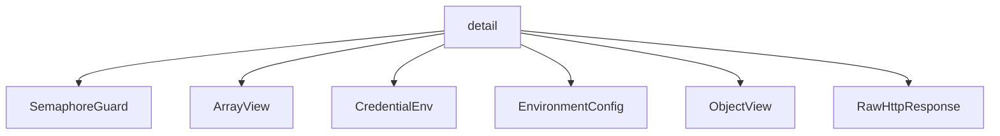

# Namespace `clore::net::detail`

## Summary

The `clore::net::detail` namespace encapsulates the internal implementation details of the `clore::net` networking library. It provides low‑level utility types and functions that are not intended for direct use by external consumers. Its primary responsibilities include JSON value validation and cloning (e.g., `expect_array`, `clone_object`), HTTP request construction and execution (both synchronous and asynchronous via `perform_http_request` and `perform_http_request_async`), environment configuration reading (`read_environment`, `read_credentials`), and supporting concurrency control via a global semaphore (`g_llm_semaphore`) and a request counter (`g_llm_request_counter`). Utility types such as `ArrayView`, `ObjectView`, `RawHttpResponse`, `CredentialEnv`, and `EnvironmentConfig` provide lightweight handles or structured representations for JSON data and network responses.

Architecturally, this namespace serves as a private foundation beneath the public `clore::net` API. The functions and types defined here are reused across multiple higher‑level operations—such as constructing API requests, validating response schemas, and handling LLM completions—without exposing these mechanics to library users. Global constants like `kHttpRequestTimeout` and `kHttpConnectTimeoutMs` define default timeouts, while string‑processing helpers (`normalize_utf8`, `excerpt_for_error`, `append_url_path`) ensure consistent formatting and error reporting. By centralizing these details, `clore::net::detail` promotes code reuse and maintains a clean separation between the public interface and the underlying networking and JSON‑handling machinery.

## Diagram



## Types

### `clore::net::detail::ArrayView`

Declaration: `network/protocol.cppm:174`

Definition: `network/protocol.cppm:174`

Implementation: [`Module protocol`](../../../../modules/protocol/index.md)

Insufficient evidence to summarize; provide more EVIDENCE.

#### Invariants

- `value` must not be null for any method call.
- The lifetime of the pointed-to array must outlive the `ArrayView`.

#### Key Members

- `value` field
- `operator[]`
- `operator*`
- `begin()` / `end()`
- `size()` / `empty()`

#### Usage Patterns

- Used to pass read-only access to a JSON array without copying.
- Provides a standard container-like interface for range-based for loops.
- Access elements by index via `operator[]`.

#### Member Functions

##### `clore::net::detail::ArrayView::begin`

Declaration: `network/protocol.cppm:185`

Definition: `network/protocol.cppm:185`

Implementation: [`Module protocol`](../../../../modules/protocol/index.md)

###### Declaration

```cpp
const_iterator () const noexcept;
```

##### `clore::net::detail::ArrayView::empty`

Declaration: `network/protocol.cppm:177`

Definition: `network/protocol.cppm:177`

Implementation: [`Module protocol`](../../../../modules/protocol/index.md)

###### Declaration

```cpp
auto () const noexcept -> bool;
```

##### `clore::net::detail::ArrayView::end`

Declaration: `network/protocol.cppm:189`

Definition: `network/protocol.cppm:189`

Implementation: [`Module protocol`](../../../../modules/protocol/index.md)

###### Declaration

```cpp
const_iterator () const noexcept;
```

##### `clore::net::detail::ArrayView::operator*`

Declaration: `network/protocol.cppm:201`

Definition: `network/protocol.cppm:201`

Implementation: [`Module protocol`](../../../../modules/protocol/index.md)

###### Declaration

```cpp
auto () const noexcept -> const kota::codec::json::Array &;
```

##### `clore::net::detail::ArrayView::operator->`

Declaration: `network/protocol.cppm:197`

Definition: `network/protocol.cppm:197`

Implementation: [`Module protocol`](../../../../modules/protocol/index.md)

###### Declaration

```cpp
auto () const noexcept -> const kota::codec::json::Array *;
```

##### `clore::net::detail::ArrayView::operator[]`

Declaration: `network/protocol.cppm:193`

Definition: `network/protocol.cppm:193`

Implementation: [`Module protocol`](../../../../modules/protocol/index.md)

###### Declaration

```cpp
auto (std::size_t) const -> const kota::codec::json::Value &;
```

##### `clore::net::detail::ArrayView::size`

Declaration: `network/protocol.cppm:181`

Definition: `network/protocol.cppm:181`

Implementation: [`Module protocol`](../../../../modules/protocol/index.md)

###### Declaration

```cpp
auto () const noexcept -> std::size_t;
```

### `clore::net::detail::CredentialEnv`

Declaration: `network/provider.cppm:14`

Definition: `network/provider.cppm:14`

Implementation: [`Module provider`](../../../../modules/provider/index.md)

Insufficient evidence to summarize; provide more EVIDENCE.

#### Invariants

- Members are set to valid `std::string_view` objects.
- No other invariants implied by the evidence.

#### Key Members

- `base_url_env`
- `api_key_env`

#### Usage Patterns

- Likely passed as a parameter to functions that read environment variables.
- Used in the implementation of credential retrieval or connection setup.

### `clore::net::detail::EnvironmentConfig`

Declaration: `network/http.cppm:37`

Definition: `network/http.cppm:37`

Implementation: [`Module http`](../../../../modules/http/index.md)

Insufficient evidence to summarize; provide more EVIDENCE.

#### Invariants

- `api_base` and `api_key` may be empty or contain configuration values

#### Key Members

- `api_base`
- `api_key`

#### Usage Patterns

- Passed to network client constructors or initialization functions
- Populated from environment variables or configuration files

### `clore::net::detail::ObjectView`

Declaration: `network/protocol.cppm:152`

Definition: `network/protocol.cppm:152`

Implementation: [`Module protocol`](../../../../modules/protocol/index.md)

Insufficient evidence to summarize; provide more EVIDENCE.

#### Invariants

- `value` must point to a valid `kota::codec::json::Object` before any member function is called that dereferences it

#### Key Members

- `value`
- `get(std::string_view)`
- `begin()`
- `end()`
- `operator->`
- `operator*`

#### Usage Patterns

- Iterating over key-value pairs of a JSON object.
- Looking up a specific key using `get()`.
- Passing the object view to functions expecting a `const kota::codec::json::Object&` via dereference `operator`s.

#### Member Functions

##### `clore::net::detail::ObjectView::begin`

Declaration: `network/protocol.cppm:157`

Definition: `network/protocol.cppm:157`

Implementation: [`Module protocol`](../../../../modules/protocol/index.md)

###### Declaration

```cpp
const_iterator () const noexcept;
```

##### `clore::net::detail::ObjectView::end`

Declaration: `network/protocol.cppm:161`

Definition: `network/protocol.cppm:161`

Implementation: [`Module protocol`](../../../../modules/protocol/index.md)

###### Declaration

```cpp
const_iterator () const noexcept;
```

##### `clore::net::detail::ObjectView::get`

Declaration: `network/protocol.cppm:155`

Definition: `network/protocol.cppm:276`

Implementation: [`Module protocol`](../../../../modules/protocol/index.md)

###### Declaration

```cpp
auto (std::string_view) const -> std::optional<json::Cursor>;
```

##### `clore::net::detail::ObjectView::operator*`

Declaration: `network/protocol.cppm:169`

Definition: `network/protocol.cppm:169`

Implementation: [`Module protocol`](../../../../modules/protocol/index.md)

###### Declaration

```cpp
auto () const noexcept -> const kota::codec::json::Object &;
```

##### `clore::net::detail::ObjectView::operator->`

Declaration: `network/protocol.cppm:165`

Definition: `network/protocol.cppm:165`

Implementation: [`Module protocol`](../../../../modules/protocol/index.md)

###### Declaration

```cpp
auto () const noexcept -> const kota::codec::json::Object *;
```

### `clore::net::detail::RawHttpResponse`

Declaration: `network/http.cppm:42`

Definition: `network/http.cppm:42`

Implementation: [`Module http`](../../../../modules/http/index.md)

Insufficient evidence to summarize; provide more EVIDENCE.

#### Invariants

- `http_status` is expected to hold a valid HTTP status code, though no validation is performed.
- `body` may be empty, representing an absent response body.

#### Key Members

- `http_status`
- `body`

#### Usage Patterns

- Constructed after parsing an HTTP response to hold the raw status and body.
- Used internally within the `clore::net` library, likely passed to higher-level response wrappers.

## Variables

### `clore::net::detail::g_llm_request_counter`

Declaration: `network/http.cppm:94`

Implementation: [`Module http`](../../../../modules/http/index.md)

A global atomic counter of type `std::atomic<std::uint64_t>` initialized to `0`, declared in the `clore::net::detail` namespace.

#### Usage Patterns

- Referenced in `clore::net::detail::perform_http_request_async`

### `clore::net::detail::g_llm_semaphore`

Declaration: `network/http.cppm:47`

Implementation: [`Module http`](../../../../modules/http/index.md)

A global semaphore, declared as `extern std::unique_ptr<kota::semaphore> g_llm_semaphore` in `network/http.cppm:47`, used to rate-limit concurrent LLM API requests.

#### Usage Patterns

- Acquired before performing an LLM HTTP request in `perform_http_request_async`
- Released after the request completes

### `clore::net::detail::kHttpConnectTimeoutMs`

Declaration: `network/http.cppm:96`

Implementation: [`Module http`](../../../../modules/http/index.md)

A constant defining the HTTP connect timeout in milliseconds, declared as `constexpr long` and initialized to `5'000`.

#### Usage Patterns

- Referenced in `configure_request` to set connect timeout on HTTP requests

### `clore::net::detail::kHttpRequestTimeout`

Declaration: `network/http.cppm:97`

Implementation: [`Module http`](../../../../modules/http/index.md)

Public constexpr variable of type `std::chrono::milliseconds` initialized to 120 seconds. Defines the default timeout duration for HTTP requests.

#### Usage Patterns

- HTTP request timeout configuration
- passed to HTTP client functions

## Functions

### `clore::net::detail::append_url_path`

Declaration: `network/provider.cppm:21`

Definition: `network/provider.cppm:43`

Implementation: [`Module provider`](../../../../modules/provider/index.md)

`clore::net::detail::append_url_path` accepts two `std::string_view` arguments: a base path and a path segment to append. It returns a `std::string` representing the combined URL path, ensuring proper slash handling at the boundary. The caller must provide a valid base path; the function does not modify either input and produces a clean, well‑formed path usable in an HTTP request URL.

#### Usage Patterns

- URL path normalization before HTTP requests

### `clore::net::detail::clone_array`

Declaration: `network/protocol.cppm:264`

Definition: `network/protocol.cppm:438`

Implementation: [`Module protocol`](../../../../modules/protocol/index.md)

`clore::net::detail::clone_array` accepts an `ArrayView` and a `std::string_view` context string. It clones the JSON array represented by the view, duplicating all its elements into a suitable internal representation. The context string is used to annotate diagnostic messages if the operation fails. The function returns an `int` status code: zero indicates success, and a non‑zero value signals an error condition (typically propagated from a lower‑level clone or validation routine). Callers should treat this function as a building block for deep‑copying JSON arrays while preserving error‑handling context.

#### Usage Patterns

- Cloning array data for further manipulation
- Creating an independent copy of a JSON array
- Used in serialization and validation pipelines

### `clore::net::detail::clone_object`

Declaration: `network/protocol.cppm:261`

Definition: `network/protocol.cppm:447`

Implementation: [`Module protocol`](../../../../modules/protocol/index.md)

The `clore::net::detail::clone_object` function creates a deep copy of a JSON object provided as an `ObjectView`. It accepts a second `std::string_view` parameter that identifies the calling context, typically used for error reporting or logging. The caller is responsible for supplying a valid `ObjectView` referencing the source object; the function returns an `int` value that signals success or failure according to the module’s error‑handling convention. This utility is intended to safely duplicate object data without modifying the original view, enabling independent manipulation or storage of the cloned JSON structure.

#### Usage Patterns

- duplicating a JSON object for independent mutation or serialization

### `clore::net::detail::clone_object`

Declaration: `network/protocol.cppm:258`

Definition: `network/protocol.cppm:442`

Implementation: [`Module protocol`](../../../../modules/protocol/index.md)

The function `clore::net::detail::clone_object` accepts an `ObjectView` (a lightweight reference to a JSON object) and a `std::string_view` context string. It deep‑copies the content of the object into the internal data structures of the library, returning an integer status (typically zero on success or a non‑zero error code). The context string supplies contextual information for error messages if the clone fails. Callers must ensure that the `ObjectView` refers to a valid JSON object at the time of the call. This function is a building block used by higher‑level cloning operations.

#### Usage Patterns

- Copy-construct a `json::Object` from an existing one

### `clore::net::detail::clone_value`

Declaration: `network/protocol.cppm:267`

Definition: `network/protocol.cppm:451`

Implementation: [`Module protocol`](../../../../modules/protocol/index.md)

The function `clore::net::detail::clone_value` creates a deep copy of a `json::Value` object. The caller supplies the source value and a `std::string_view` that provides a context label for diagnostic messages. It returns an integer code that indicates success (typically zero) or an error condition. This function is a building block for higher‑level clone operations such as `clone_array` and `clone_object`, and it is called during processing that requires duplication of arbitrary JSON substructures.

#### Usage Patterns

- Used to duplicate a JSON value while ignoring the context string.

### `clore::net::detail::configure_request`

Declaration: `network/http.cppm:126`

Definition: `network/http.cppm:126`

Implementation: [`Module http`](../../../../modules/http/index.md)

This function accepts a mutable `kota::http::request` reference and two configuration arguments—an integer and a string—and modifies the request accordingly. It is intended to be called by higher-level request routines to prepare the request before it is dispatched. The caller is responsible for providing valid inputs that conform to the format expected by the underlying API endpoint.

#### Usage Patterns

- called as part of HTTP request construction pipeline
- used in `perform_http_request` or similar functions to finalize request setup

### `clore::net::detail::excerpt_for_error`

Declaration: `network/protocol.cppm:219`

Definition: `network/protocol.cppm:312`

Implementation: [`Module protocol`](../../../../modules/protocol/index.md)

The function `clore::net::detail::excerpt_for_error` accepts a `std::string_view` and returns a `std::string`. Its responsibility is to produce a human‑readable excerpt from the input string suitable for inclusion in error messages or diagnostic output. The caller provides the raw text (typically a JSON payload, request body, or other textual data that caused an error), and the function returns a concise, safely‑formatted substring that can be displayed to users or logged without exposing excessive or untrusted content. The contract guarantees that the return value is a non‑empty string unless the input is empty, and that the excerpt will not exceed a reasonable length, ensuring error messages remain clear and manageable.

#### Usage Patterns

- truncating long strings for error messages
- excerpting response bodies for logging or diagnostics

### `clore::net::detail::expect_array`

Declaration: `network/protocol.cppm:246`

Definition: `network/protocol.cppm:402`

Implementation: [`Module protocol`](../../../../modules/protocol/index.md)

The function `clore::net::detail::expect_array` validates that a given JSON value is an array. It accepts either a `const json::Value &` or a `json::Cursor` representing the value to inspect, along with a `std::string_view` that describes the validation context (e.g., the field name or location for error reporting). The caller must provide a valid JSON value and a non-empty context string. The function returns an `int` indicating success (zero) or failure (nonzero) according to the module’s error convention, typically signaling that the value was not an array or that another validation error occurred. This helper is used internally when the expected type at a specific position in a JSON structure must be an array.

#### Usage Patterns

- Used in JSON validation and parsing contexts
- Called by overload `expect_array(json::Cursor, std::string_view)`
- Often paired with `expect_object`, `expect_string`, and `clone_array`

### `clore::net::detail::expect_array`

Declaration: `network/protocol.cppm:249`

Definition: `network/protocol.cppm:411`

Implementation: [`Module protocol`](../../../../modules/protocol/index.md)

The `clore::net::detail::expect_array` function validates that a given JSON value represents an array. It accepts either a `json::Cursor` or a `const json::Value &` as the first argument, along with a `std::string_view` that serves as a contextual label for error reporting. The function returns an `int` (typically zero on success, non-zero on failure) and ensures the caller can safely dereference the value as an array without encountering a type mismatch. The caller is responsible for providing a valid JSON reference and a meaningful context string that aids in diagnosing failures.

#### Usage Patterns

- Validating that a JSON value is an array before further operations
- Extracting an `ArrayView` from a `json::Cursor`

### `clore::net::detail::expect_object`

Declaration: `network/protocol.cppm:240`

Definition: `network/protocol.cppm:384`

Implementation: [`Module protocol`](../../../../modules/protocol/index.md)

`clore::net::detail::expect_object` validates that a given JSON value is a JSON object. It accepts a `const json::Value &` representing the value to check and a `std::string_view` providing a human‑readable context description (such as a parameter name or location) for error messages. The function returns an `int` status code: zero indicates the value is an object, and a non‑zero value signals a validation failure. The caller is responsible for supplying the JSON value and a meaningful context string; if the value is not an object, an appropriate error is reported using that context.

#### Usage Patterns

- Validate that a JSON value is an object before accessing its fields
- Provide an `ObjectView` to functions that require an object reference

### `clore::net::detail::expect_object`

Declaration: `network/protocol.cppm:243`

Definition: `network/protocol.cppm:393`

Implementation: [`Module protocol`](../../../../modules/protocol/index.md)

The function `clore::net::detail::expect_object` verifies that the current position of the provided `json::Cursor` corresponds to a valid JSON object. The second argument, a `std::string_view`, serves as a description or error context used when the value is not an object. The function returns an integer status code, typically zero on success and a non‑zero error code (often an `LLMError`) if the cursors value is not a JSON object or if the cursor is invalid. Callers must ensure the cursor is positioned on a value before invoking this function; the contract guarantees that upon success, the cursor has been consumed over a complete JSON object, otherwise an appropriate error is raised.

#### Usage Patterns

- Validating that a JSON cursor represents an object during parsing or deserialization
- Extracting an `ObjectView` for subsequent field access or iteration
- Used internally by functions that require a JSON object input

### `clore::net::detail::expect_string`

Declaration: `network/protocol.cppm:255`

Definition: `network/protocol.cppm:429`

Implementation: [`Module protocol`](../../../../modules/protocol/index.md)

`clore::net::detail::expect_string` validates that a given JSON value is of type string. The caller supplies a `const json::Value &` to inspect and a `std::string_view` context label that is used in any diagnostic messages if the value is not a string. The function returns an `int`; a zero value indicates success, while a non‑zero value signals that the value was not a string, allowing the caller to propagate the error. This function is one of a family of type‑expectation helpers (alongside `expect_array` and `expect_object`) used to enforce expected JSON structure during network protocol processing.

#### Usage Patterns

- Used to validate and extract a JSON string value, returning an error on failure

### `clore::net::detail::expect_string`

Declaration: `network/protocol.cppm:252`

Definition: `network/protocol.cppm:420`

Implementation: [`Module protocol`](../../../../modules/protocol/index.md)

The function `clore::net::detail::expect_string` validates that the JSON entity referred to by the given value or cursor is a string. It accepts either a `const json::Value &` or a `json::Cursor` together with a `std::string_view` serving as a descriptive context for error messages. If the JSON element is not a string, the function returns a non‑zero error code; otherwise it returns zero. Callers use this routine to assert the expected type of a JSON node before proceeding with further string‑specific operations.

#### Usage Patterns

- Used to validate and extract a string from a JSON value during JSON parsing
- Called when processing JSON fields that are expected to be strings

### `clore::net::detail::infer_output_contract`

Declaration: `network/protocol.cppm:627`

Definition: `network/protocol.cppm:644`

Implementation: [`Module protocol`](../../../../modules/protocol/index.md)

The function `clore::net::detail::infer_output_contract` accepts a `const PromptRequest&` and returns an `int`. It determines the expected output contract for the given request, translating the request’s structure into a numeric contract identifier that dictates how the LLM response should be validated. The caller must supply a valid `PromptRequest`; the return value is an opaque `int` that can be passed to other validation functions (e.g., `validate_prompt_output`) to enforce the inferred contract.

#### Usage Patterns

- resolve output contract from a `PromptRequest`
- validate consistency between `response_format` and `output_contract`

### `clore::net::detail::insert_string_field`

Declaration: `network/protocol.cppm:211`

Definition: `network/protocol.cppm:299`

Implementation: [`Module protocol`](../../../../modules/protocol/index.md)

Inserts a string field into a mutable `json::Object`. The caller supplies the target object, the field name as a `std::string_view`, the field value as a `std::string_view`, and a diagnostic context string (also `std::string_view`) used for error reporting. Returns an `int` that indicates success or failure; a non‑zero value signals an error. The caller must ensure the object is writable, the field name is not empty, and the context string provides meaningful location or operation information when an error occurs. The function does not throw exceptions.

#### Usage Patterns

- Insert a string field into a JSON object
- Used in JSON construction utilities

### `clore::net::detail::make_empty_array`

Declaration: `network/protocol.cppm:227`

Definition: `network/protocol.cppm:344`

Implementation: [`Module protocol`](../../../../modules/protocol/index.md)

The function `clore::net::detail::make_empty_array` constructs and returns a representation of an empty JSON array. It accepts a `std::string_view` argument, typically providing a context or label (e.g., a field name or error location) for diagnostic messages. On success, it returns an integer indicating a valid empty array was produced; on failure, it returns a non‑zero error code. Callers must supply a meaningful context string to assist in error reporting.

#### Usage Patterns

- create an empty JSON array value
- obtain a default empty array
- initialize array fields with no elements

### `clore::net::detail::make_empty_object`

Declaration: `network/protocol.cppm:224`

Definition: `network/protocol.cppm:336`

Implementation: [`Module protocol`](../../../../modules/protocol/index.md)

Create an empty JSON `Object` value. The caller supplies a `std::string_view` context string used for error reporting; the function returns an `int` result indicating success or failure. This utility is responsible for producing a valid, empty object that can be used as a starting point for further JSON construction or for filling required object fields.

#### Usage Patterns

- Creating an empty object for default or placeholder values
- Used to represent an empty JSON object in LLM-related code

### `clore::net::detail::normalize_utf8`

Declaration: `network/protocol.cppm:209`

Definition: `network/protocol.cppm:289`

Implementation: [`Module protocol`](../../../../modules/protocol/index.md)

The function `clore::net::detail::normalize_utf8` returns a new `std::string` containing the UTF‑8 encoded input string after applying a normalization process. The first argument is the source string; the second argument specifies the desired normalization scheme (for example, a Unicode Normalization Form such as NFC or NFD). The caller is responsible for providing valid UTF‑8 input and a recognized normalization identifier. The function does not modify the input; it produces a normalized copy, which may be used to ensure consistent byte sequences for subsequent processing, comparison, or storage.

#### Usage Patterns

- Normalizing input text before JSON serialization
- Ensuring valid UTF-8 for LLM responses or prompts

### `clore::net::detail::parse_json_object`

Declaration: `network/provider.cppm:27`

Definition: `network/provider.cppm:148`

Implementation: [`Module provider`](../../../../modules/provider/index.md)

The function `clore::net::detail::parse_json_object` attempts to parse a string as a JSON object, using the first argument as the raw JSON input and the second as a contextual label (e.g., a file or function name) for error reporting. The caller must supply a well-formed UTF-8 string whose top-level value is a JSON object. The function returns an `int` — zero indicates success, and a non‑zero value signals a parse failure or structural error, with details usually logged via the provided label. This function is designed for use within the network layer to validate and extract object‑shaped payloads before further processing.

#### Usage Patterns

- parsing a JSON object from a raw response string
- wrapping parse errors with contextual information

### `clore::net::detail::parse_json_value`

Declaration: `network/protocol.cppm:234`

Definition: `network/protocol.cppm:364`

Implementation: [`Module protocol`](../../../../modules/protocol/index.md)

The template function `clore::net::detail::parse_json_value` attempts to extract a value of type `T` from the provided `json::Value`. The caller supplies a context string, typically describing the expected location, which is used in error reporting if parsing fails. Returns an integer indicating success (zero) or an error code. If the conversion is not possible for the given type `T`, the function fails with a descriptive error.

#### Usage Patterns

- used to parse a `json::Value` into a typed result
- bridge between `json::Value` and the string-based parsing path

### `clore::net::detail::parse_json_value`

Declaration: `network/protocol.cppm:231`

Definition: `network/protocol.cppm:353`

Implementation: [`Module protocol`](../../../../modules/protocol/index.md)

Parses a JSON value from the supplied raw string view, using the second string view as a contextual label for error reporting. The function is a template that deduces the expected JSON type T and attempts to fully consume the input as a valid instance of that type. On success it returns zero; on failure it returns a non‑zero error code derived from the internal validation routines. Callers must ensure the first argument is a syntactically correct JSON document and that the second argument provides a meaningful name (such as a file path or origin) for diagnostic messages.

#### Usage Patterns

- Used to deserialize JSON responses into strongly-typed objects
- Provides contextual error messages on parse failure

### `clore::net::detail::perform_http_request`

Declaration: `network/http.cppm:52`

Definition: `network/http.cppm:139`

Implementation: [`Module http`](../../../../modules/http/index.md)

The function `clore::net::detail::perform_http_request` performs a synchronous HTTP request. It accepts a URL as `std::string`, a timeout or configuration value as `int`, and a request body as `std::string_view`. On success, it returns a `RawHttpResponse`; on failure, it returns an `LLMError`. This function is intended for internal use within the networking layer, providing a synchronous path for HTTP communication.

#### Usage Patterns

- synchronous wrapper over async HTTP request
- used to perform HTTP requests with async internal implementation

### `clore::net::detail::perform_http_request_async`

Declaration: `network/http.cppm:57`

Definition: `network/http.cppm:165`

Implementation: [`Module http`](../../../../modules/http/index.md)

Initiates an asynchronous HTTP request. The caller provides a host string, a port number, a request path, and a reference to an `async::event_loop` that will drive the request to completion. Returns an integer value acting as a request identifier—the caller can use this value to correlate later events or to cancel the request if the interface supports it. The function does not block; the result is eventually delivered via the event loop. The caller must ensure that the event loop remains active for the duration of the request.

#### Usage Patterns

- Called as part of an `async::task` coroutine in the LLM request pipeline
- Used by higher-level async LLM functions to perform the actual HTTP call

### `clore::net::detail::read_credentials`

Declaration: `network/provider.cppm:19`

Definition: `network/provider.cppm:39`

Implementation: [`Module provider`](../../../../modules/provider/index.md)

The function `clore::net::detail::read_credentials` reads authentication credentials from the environment. It accepts a single argument of type `CredentialEnv` that specifies which set of credentials or environment configuration to retrieve. The function returns an `int` status code: a value of `0` indicates success, while a non-zero value signals an error condition that the caller may propagate or handle. Callers should ensure that the required environment variables are set before invoking this function; otherwise, the function may fail and return an appropriate error code.

#### Usage Patterns

- Used to load credentials from environment variables
- Called during initialization of network connections

### `clore::net::detail::read_environment`

Declaration: `network/http.cppm:49`

Definition: `network/http.cppm:108`

Implementation: [`Module http`](../../../../modules/http/index.md)

The caller-provided `clore::net::detail::read_environment` function accepts two `std::string_view` arguments, typically representing environment variable names or paths, and returns a `std::expected<EnvironmentConfig, LLMError>`. On success, the returned `EnvironmentConfig` contains the parsed configuration derived from the environment source. On failure, an `LLMError` is provided that describes the reason for the failure (for example, missing required variables or an invalid format). The caller is responsible for supplying valid environment identifiers as defined by the hosting platform; the function does not modify the environment and assumes read-only access.

#### Usage Patterns

- Called during network stack initialization to retrieve API credentials from environment

### `clore::net::detail::read_required_env`

Declaration: `network/http.cppm:99`

Definition: `network/http.cppm:99`

Implementation: [`Module http`](../../../../modules/http/index.md)

The function `clore::net::detail::read_required_env` attempts to read the value of a mandatory environment variable identified by the given `std::string_view` name. If the environment variable is not set or cannot be read, the function returns an error of type `LLMError`; it does not fall back to a default or optional value. On success, it yields the variable’s value as a `std::string` via a `std::expected<std::string, LLMError>`. Callers must ensure the provided name is a valid environment variable key; the contract does not permit missing variables.

#### Usage Patterns

- reading required configuration from environment variables
- validating presence of mandatory environment variables

### `clore::net::detail::request_text_once_async`

Declaration: `network/protocol.cppm:634`

Definition: `network/protocol.cppm:676`

Implementation: [`Module protocol`](../../../../modules/protocol/index.md)

The function `clore::net::detail::request_text_once_async` initiates an asynchronous HTTP request for a single text completion. It accepts a `CompletionRequester` callback, two `std::string_view` parameters (likely a URL endpoint and a request body or additional path), a `PromptRequest` describing the input, and a reference to a `kota::event_loop` on which the asynchronous work is scheduled. The function returns an `int` that signals success or an error code. Callers must ensure that the event loop is active and will process the scheduled operations; the completion handler will eventually be invoked with the result.

#### Usage Patterns

- used to asynchronously obtain a single text completion from an LLM
- called from higher-level async functions that need a textual response

### `clore::net::detail::run_task_sync`

Declaration: `network/protocol.cppm:222`

Definition: `network/protocol.cppm:318`

Implementation: [`Module protocol`](../../../../modules/protocol/index.md)

The function template `clore::net::detail::run_task_sync` provides a synchronous execution path for a caller-supplied task. It accepts a single argument (an arbitrary callable or factory) with template parameters `T` and `make_task` dedicated to that argument’s type. The function returns an `int` status code indicating success or failure of the task. The caller is responsible for providing a valid task specification; the function blocks until the task completes.

#### Usage Patterns

- Synchronously execute an async task defined by a factory callable
- Bridge async operations to a blocking interface
- Obtain the result of a task that runs on a temporary event loop

### `clore::net::detail::select_event_loop`

Declaration: `network/client.cppm:45`

Definition: `network/client.cppm:45`

Implementation: [`Module client`](../../../../modules/client/index.md)

Declaration: [Declaration](functions/select-event-loop.md)

The function `clore::net::detail::select_event_loop` accepts a pointer to a `kota::event_loop` and returns a reference to a `kota::event_loop`. If the provided pointer is non-null, the function dereferences it and returns that same loop. If the pointer is null, the function selects an internal default event loop and returns a reference to it. The caller must ensure that any non-null pointer passed to the function points to a valid, running `kota::event_loop` that remains alive for the duration of the operation. The return value is guaranteed to be a valid reference.

#### Usage Patterns

- Used by async functions like `call_completion_async` and `call_llm_async` to resolve an optional event loop pointer to a valid reference before passing it to internal logic.

### `clore::net::detail::serialize_tool_arguments`

Declaration: `network/provider.cppm:30`

Definition: `network/provider.cppm:158`

Implementation: [`Module provider`](../../../../modules/provider/index.md)

The function `clore::net::detail::serialize_tool_arguments` accepts a `json::Value` containing the arguments to a tool call and a `std::string_view` used as a contextual label for error messages. It converts the arguments into a serialized string form suitable for inclusion in a tool-use request. The caller is responsible for providing a valid JSON value that represents the tool’s expected parameters; the function returns an integer status code to indicate success (typically zero) or a non‑zero error value on failure. Use the context label to trace and report issues during serialization.

#### Usage Patterns

- Used to re-serialize and validate tool arguments
- Called when tool arguments need to be normalized or error-checked

### `clore::net::detail::serialize_value_to_string`

Declaration: `network/protocol.cppm:237`

Definition: `network/protocol.cppm:374`

Implementation: [`Module protocol`](../../../../modules/protocol/index.md)

The function `clore::net::detail::serialize_value_to_string` accepts a `const json::Value &` to be serialized and a `std::string_view` that identifies the calling context (e.g., a location or error label). It produces a string representation of the JSON value, intended for logging, error messages, or diagnostic output. The return `int` indicates success or failure: a successful result is typically zero, while non-zero values signify an error condition that callers should handle or propagate.

#### Usage Patterns

- serializing JSON values for HTTP request body
- converting JSON to string for logging or error messages

### `clore::net::detail::to_llm_unexpected`

Declaration: `network/protocol.cppm:217`

Definition: `network/protocol.cppm:308`

Implementation: [`Module protocol`](../../../../modules/protocol/index.md)

The function `clore::net::detail::to_llm_unexpected` constructs an unexpected-LLM-error representation from a caller-supplied status value and a descriptive string view. It accepts any type `Status` along with a `std::string_view` providing context about the unexpected situation, and returns an `int` that the library uses to propagate or identify the error. Callers are responsible for providing a valid status object and a non‑null string; the returned integer is meaningful only within the framework’s error‑handling machinery and should not be inspected directly by external code.

#### Usage Patterns

- Propagate `Status` errors as `LLMError` in `std::unexpected` return

### `clore::net::detail::unexpected_json_error`

Declaration: `network/protocol.cppm:206`

Definition: `network/protocol.cppm:284`

Implementation: [`Module protocol`](../../../../modules/protocol/index.md)

Callers invoke `clore::net::detail::unexpected_json_error` to convert a `json::error` into an integer error code that can be propagated upward, typically when JSON parsing or validation encounters an unexpected format or an error condition not covered by more specific handlers. The function expects a descriptive `std::string_view` providing context (such as the name of the field or operation being processed) and a `const json::error &` representing the original JSON error. The return value is an opaque `int` that the caller should forward as a failure indicator; callers must not rely on the specific numeric value beyond treating non‑zero as an error.

#### Usage Patterns

- converting `json::error` to `LLMError` for unexpected results
- used in JSON validation and parsing error handling

### `clore::net::detail::unwrap_caught_result`

Declaration: `network/http.cppm:63`

Definition: `network/http.cppm:63`

Implementation: [`Module http`](../../../../modules/http/index.md)

The function template `unwrap_caught_result` accepts a value of type `R` (the "caught result") and a `std::string_view` context string, and returns an `int` status code. Its caller‑facing responsibility is to consume a result that was previously extracted or "caught" from an exceptional or error path and translate it into a uniform integer error code. The contract requires that the caller supply a meaningful context string for diagnostic purposes; the function internally maps the supplied `R` value to an appropriate integer code that can be used for further error propagation or logging.

#### Usage Patterns

- Used to convert a caught result into a coroutine task that either yields the value or fails
- Called in async contexts where a result may be cancelled or erroneous

### `clore::net::detail::validate_completion_request`

Declaration: `network/provider.cppm:23`

Definition: `network/provider.cppm:61`

Implementation: [`Module provider`](../../../../modules/provider/index.md)

The function `clore::net::detail::validate_completion_request` validates a completion request based on the given integer reference and two boolean flags. It returns an integral status code indicating the result of the validation.

Callers must supply a valid reference and flags that reflect the desired validation behavior. The function performs its checks synchronously and communicates the outcome solely through the return value.

#### Usage Patterns

- called before initiating a completion request to validate the request structure
- part of request validation pipeline

### `clore::net::detail::validate_prompt_output`

Declaration: `network/protocol.cppm:630`

Definition: `network/protocol.cppm:662`

Implementation: [`Module protocol`](../../../../modules/protocol/index.md)

`clore::net::detail::validate_prompt_output` accepts a `std::string_view` representing the raw output from a prompt and a `PromptOutputContract` that specifies the expected structure or constraints. It returns an `int` indicating whether the output conforms to the contract. A zero return typically signals success, while a non‑zero value signals validation failure (the exact error interpretation is determined by the calling layer).

The caller must supply both a complete output string and a contract definition. The function expects the output to be parseable and to satisfy all requirements encoded in the contract; if validation fails, the caller should treat the output as unusable for downstream steps. This function does not modify its inputs and is intended for use in pipeline validation before the output is consumed by higher‑level logic.

#### Usage Patterns

- validating prompt output content according to a contract
- ensuring output matches expected format (JSON or Markdown)

### `clore::net::detail::validate_response_format`

Declaration: `network/schema.cppm:527`

Definition: `network/schema.cppm:535`

Implementation: [`Module schema`](../../../../modules/schema/index.md)

The function `clore::net::detail::validate_response_format` checks whether the response associated with a given identifier conforms to the expected structural format. The caller passes a `const int &` representing the response to validate and receives an `int` return value that indicates the outcome of the validation. A successful validation is signaled by a return value of zero; any non‑zero value denotes a format violation. This function is part of the response‑handling validation pipeline and should be called before further processing of the response to ensure its shape matches the contract established by the calling code.

#### Usage Patterns

- Called to validate response format parameters
- Used before constructing a completion request

### `clore::net::detail::validate_tool_definition`

Declaration: `network/schema.cppm:529`

Definition: `network/schema.cppm:545`

Implementation: [`Module schema`](../../../../modules/schema/index.md)

The function `clore::net::detail::validate_tool_definition` performs validation of a tool definition provided as a `const int &` reference. It returns an `int` status that indicates whether the definition is well‑formed according to the caller’s contract. This function is a building block for higher‑level validation routines and is intended for use within the `clore::net::detail` namespace.

#### Usage Patterns

- Called during tool registration or schema validation to ensure tool definitions are well-formed.

## Related Pages

- [Namespace clore::net](../index.md)

