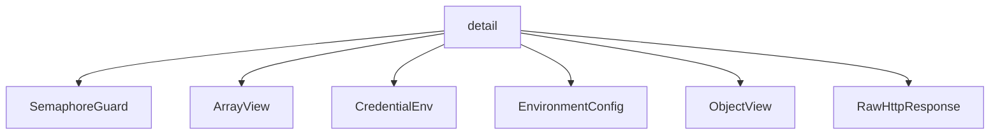

# Namespace `clore::net::detail`

## Summary

The `clore::net::detail` namespace contains the internal implementation layer for the networking subsystem, providing low‑level HTTP operations, JSON parsing and validation utilities, environment‑based configuration, and rate‑limiting infrastructure for LLM requests. Key declarations include functions for synchronous and asynchronous HTTP requests (`perform_http_request`, `perform_http_request_async`), JSON type‑checking helpers (`expect_string`, `expect_object`, `expect_array`), cloning and serialization routines (`clone_object`, `clone_value`, `serialize_tool_arguments`), environment readers (`read_environment`, `read_required_env`, `read_credentials`), and constants for connection timeouts and TCP keep‑alive intervals. The namespace also defines helper types such as `ArrayView` and `ObjectView` for traversing JSON data, `RawHttpResponse` for structuring HTTP responses, and global synchronization primitives (`g_llm_semaphore`, `g_llm_semaphore_mutex`) that control concurrent access to LLM endpoints. Architecturally, this namespace serves as the opaque engine behind the public `clore::net` API, isolating platform‑specific networking details, JSON manipulation, and credential management from higher‑level callers.

## Diagram


```mermaid
graph TD
    NS["detail"]
    T0["SemaphoreGuard"]
    NS --> T0
    T1["ArrayView"]
    NS --> T1
    T2["CredentialEnv"]
    NS --> T2
    T3["EnvironmentConfig"]
    NS --> T3
    T4["ObjectView"]
    NS --> T4
    T5["RawHttpResponse"]
    NS --> T5
```

## Types

### `clore::net::detail::ArrayView`

Declaration: `src/network/protocol.cppm:190`

Definition: `src/network/protocol.cppm:190`

Implementation: [`Module protocol`](../../../../modules/protocol/index.md)

Insufficient evidence to summarize; provide more EVIDENCE.

#### Invariants

- The `value` pointer must remain valid for the lifetime of the view.
- All member functions assume `value` is non-null and point to a valid `Array`.

#### Key Members

- `value` pointer
- `begin` / `end` for iteration
- `operator[]` for indexed access
- `operator*` and `operator->` for direct array access

#### Usage Patterns

- Used to pass read-only references to JSON arrays without copying.
- Frequently employed in network protocol handling where constant array data is accessed.

#### Member Functions

##### `clore::net::detail::ArrayView::begin`

Declaration: `src/network/protocol.cppm:201`

Definition: `src/network/protocol.cppm:201`

Implementation: [`Module protocol`](../../../../modules/protocol/index.md)

###### Declaration

```cpp
const_iterator () const noexcept;
```

##### `clore::net::detail::ArrayView::empty`

Declaration: `src/network/protocol.cppm:193`

Definition: `src/network/protocol.cppm:193`

Implementation: [`Module protocol`](../../../../modules/protocol/index.md)

###### Declaration

```cpp
auto () const noexcept -> bool;
```

##### `clore::net::detail::ArrayView::end`

Declaration: `src/network/protocol.cppm:205`

Definition: `src/network/protocol.cppm:205`

Implementation: [`Module protocol`](../../../../modules/protocol/index.md)

###### Declaration

```cpp
const_iterator () const noexcept;
```

##### `clore::net::detail::ArrayView::operator*`

Declaration: `src/network/protocol.cppm:217`

Definition: `src/network/protocol.cppm:217`

Implementation: [`Module protocol`](../../../../modules/protocol/index.md)

###### Declaration

```cpp
auto () const noexcept -> const kota::codec::json::Array &;
```

##### `clore::net::detail::ArrayView::operator->`

Declaration: `src/network/protocol.cppm:213`

Definition: `src/network/protocol.cppm:213`

Implementation: [`Module protocol`](../../../../modules/protocol/index.md)

###### Declaration

```cpp
auto () const noexcept -> const kota::codec::json::Array *;
```

##### `clore::net::detail::ArrayView::operator[]`

Declaration: `src/network/protocol.cppm:209`

Definition: `src/network/protocol.cppm:209`

Implementation: [`Module protocol`](../../../../modules/protocol/index.md)

###### Declaration

```cpp
auto (std::size_t) const -> const kota::codec::json::Value &;
```

##### `clore::net::detail::ArrayView::size`

Declaration: `src/network/protocol.cppm:197`

Definition: `src/network/protocol.cppm:197`

Implementation: [`Module protocol`](../../../../modules/protocol/index.md)

###### Declaration

```cpp
auto () const noexcept -> std::size_t;
```

### `clore::net::detail::CredentialEnv`

Declaration: `src/network/provider.cppm:21`

Definition: `src/network/provider.cppm:21`

Implementation: [`Module provider`](../../../../modules/provider/index.md)

Insufficient evidence to summarize; provide more EVIDENCE.

#### Invariants

- No explicit invariants; both fields are accessible and modifiable.
- No requirement that the string views point to valid environment variables.

#### Key Members

- `base_url_env` – holds the name of the environment variable for the base URL.
- `api_key_env` – holds the name of the environment variable for the API key.

#### Usage Patterns

- Used to pass environment variable names to credential lookup functions.
- Likely consumed internally within the networking layer to read credentials from the environment.
- Stored as a simple value object; may be copied or passed by reference.

### `clore::net::detail::EnvironmentConfig`

Declaration: `src/network/http.cppm:51`

Definition: `src/network/http.cppm:51`

Implementation: [`Module http`](../../../../modules/http/index.md)

Insufficient evidence to summarize; provide more EVIDENCE.

#### Invariants

- No invariants enforced; callers must ensure `api_base` is a valid URL and `api_key` is non-empty if required.

#### Key Members

- `api_base`
- `api_key`

#### Usage Patterns

- Passed to constructors or initialization functions of network-related classes.

### `clore::net::detail::ObjectView`

Declaration: `src/network/protocol.cppm:168`

Definition: `src/network/protocol.cppm:168`

Implementation: [`Module protocol`](../../../../modules/protocol/index.md)

Insufficient evidence to summarize; provide more EVIDENCE.

#### Invariants

- `value` may be `nullptr` if default-constructed or not properly initialized
- `begin()` and `end()` assume `value` is non-null (undefined behavior otherwise)
- `get` performs a lookup in the underlying object; result is empty if key not found

#### Key Members

- `value`
- `get`
- `begin`
- `end`
- `operator->`
- `operator*`

#### Usage Patterns

- Callers iterate over key-value pairs using range-based for loops via `begin`/`end`
- Callers retrieve a specific value by key with `get`, handling the optional return
- Used as a parameter or return type in `clore::net::detail` to avoid copying JSON objects

#### Member Functions

##### `clore::net::detail::ObjectView::begin`

Declaration: `src/network/protocol.cppm:173`

Definition: `src/network/protocol.cppm:173`

Implementation: [`Module protocol`](../../../../modules/protocol/index.md)

###### Declaration

```cpp
const_iterator () const noexcept;
```

##### `clore::net::detail::ObjectView::end`

Declaration: `src/network/protocol.cppm:177`

Definition: `src/network/protocol.cppm:177`

Implementation: [`Module protocol`](../../../../modules/protocol/index.md)

###### Declaration

```cpp
const_iterator () const noexcept;
```

##### `clore::net::detail::ObjectView::get`

Declaration: `src/network/protocol.cppm:171`

Definition: `src/network/protocol.cppm:292`

Implementation: [`Module protocol`](../../../../modules/protocol/index.md)

###### Declaration

```cpp
auto (std::string_view) const -> std::optional<json::Cursor>;
```

##### `clore::net::detail::ObjectView::operator*`

Declaration: `src/network/protocol.cppm:185`

Definition: `src/network/protocol.cppm:185`

Implementation: [`Module protocol`](../../../../modules/protocol/index.md)

###### Declaration

```cpp
auto () const noexcept -> const kota::codec::json::Object &;
```

##### `clore::net::detail::ObjectView::operator->`

Declaration: `src/network/protocol.cppm:181`

Definition: `src/network/protocol.cppm:181`

Implementation: [`Module protocol`](../../../../modules/protocol/index.md)

###### Declaration

```cpp
auto () const noexcept -> const kota::codec::json::Object *;
```

### `clore::net::detail::RawHttpResponse`

Declaration: `src/network/http.cppm:56`

Definition: `src/network/http.cppm:56`

Implementation: [`Module http`](../../../../modules/http/index.md)

Insufficient evidence to summarize; provide more EVIDENCE.

#### Invariants

- `http_status` defaults to 0, which may represent an uninitialized or error state
- `body` is an empty string by default

#### Key Members

- `http_status` (the HTTP status code)
- `body` (the response body)

#### Usage Patterns

- Used as a return type for functions that fetch raw HTTP responses
- Consumed by code within the `clore::net` namespace

## Variables

### `clore::net::detail::g_llm_request_counter`

Declaration: `src/network/http.cppm:111`

Implementation: [`Module http`](../../../../modules/http/index.md)

An atomic counter for tracking LLM requests, declared as `std::atomic<std::uint64_t>` in namespace `clore::net::detail`.

#### Usage Patterns

- read to assign request number

### `clore::net::detail::g_llm_semaphore`

Declaration: `src/network/http.cppm:62`

Implementation: [`Module http`](../../../../modules/http/index.md)

`clore::net::detail::g_llm_semaphore` is a global `std::shared_ptr<kota::semaphore>` declared as `extern` in `src/network/http.cppm:62`. It serves as a rate-limiting semaphore for LLM requests within the networking layer.

#### Usage Patterns

- rate limiting LLM requests
- semaphore acquire/release via guard
- synchronized with mutex

### `clore::net::detail::g_llm_semaphore_mutex`

Declaration: `src/network/http.cppm:61`

Implementation: [`Module http`](../../../../modules/http/index.md)

`clore::net::detail::g_llm_semaphore_mutex` is a global `std::mutex` declared at `src/network/http.cppm:61` used to synchronize access to the LLM rate-limiting semaphore.

#### Usage Patterns

- locked and unlocked to protect access to `g_llm_semaphore`

### `clore::net::detail::kConnMaxAgeSec`

Declaration: `src/network/http.cppm:116`

Implementation: [`Module http`](../../../../modules/http/index.md)

Constant defining the maximum age of a connection in seconds, set to 300 (5 minutes).

#### Usage Patterns

- used in `configure_request` to set connection lifetime

### `clore::net::detail::kDnsCacheTimeoutSec`

Declaration: `src/network/http.cppm:115`

Implementation: [`Module http`](../../../../modules/http/index.md)

A compile-time constant of type `long` set to `300`, representing the DNS cache timeout duration in seconds. Declared in the `clore::net::detail` namespace within `src/network/http.cppm`.

#### Usage Patterns

- referenced in `clore::net::detail::configure_request`

### `clore::net::detail::kHttpConnectTimeoutMs`

Declaration: `src/network/http.cppm:113`

Implementation: [`Module http`](../../../../modules/http/index.md)

Variable `clore::net::detail::kHttpConnectTimeoutMs` is a `constexpr long` constant defined at `src/network/http.cppm:113` with an initial value of 5'000 milliseconds.

#### Usage Patterns

- passed as timeout argument in `configure_request`

### `clore::net::detail::kHttpRequestTimeout`

Declaration: `src/network/http.cppm:114`

Implementation: [`Module http`](../../../../modules/http/index.md)

`kHttpRequestTimeout` is a `constexpr` variable of type `std::chrono::milliseconds` initialized to 120,000 milliseconds (2 minutes). It is defined in the `clore::net::detail` namespace and represents the default timeout duration for HTTP requests.

#### Usage Patterns

- Read as the default timeout for HTTP requests
- Used in network request configuration

### `clore::net::detail::kTcpKeepIdleSec`

Declaration: `src/network/http.cppm:117`

Implementation: [`Module http`](../../../../modules/http/index.md)

`clore::net::detail::kTcpKeepIdleSec` is a compile-time constant of type `long` with value `60`, defined at `src/network/http.cppm:117`.

#### Usage Patterns

- Referenced as `kTcpKeepIdleSec` in `configure_request` to set TCP keep-alive idle seconds.

### `clore::net::detail::kTcpKeepIntvlSec`

Declaration: `src/network/http.cppm:118`

Implementation: [`Module http`](../../../../modules/http/index.md)

`clore::net::detail::kTcpKeepIntvlSec` is a `constexpr long` constant defined with value `10`. It is declared in the `src/network/http.cppm` module at line 118.

#### Usage Patterns

- used as a timeout parameter in `clore::net::detail::configure_request`

## Functions

### `clore::net::detail::append_url_path`

Declaration: `src/network/provider.cppm:28`

Definition: `src/network/provider.cppm:50`

Implementation: [`Module provider`](../../../../modules/provider/index.md)

The function `clore::net::detail::append_url_path` accepts two `std::string_view` arguments — typically a base URL and a relative path — and returns a `std::string` that represents the combined URL. Its caller-facing contract is to handle the insertion of a separator (usually a slash) between the two parts when necessary, ensuring a syntactically correct URL is produced. The caller supplies the raw path segment without worrying about trailing or leading slashes; the function normalizes the result. This utility is intended for internal use within the network detail layer when constructing HTTP request `URLs`.

#### Usage Patterns

- URL path concatenation
- joining base URL with relative path
- normalizing URL segments

### `clore::net::detail::clone_array`

Declaration: `src/network/protocol.cppm:280`

Definition: `src/network/protocol.cppm:454`

Implementation: [`Module protocol`](../../../../modules/protocol/index.md)

The function `clore::net::detail::clone_array` creates a deep copy of the array referenced by the given `ArrayView`. The `std::string_view` parameter provides a human‑readable context (such as the source location or field name) for any error messages that may arise during the cloning process. It returns an `int` indicating success (zero) or a non‑zero error code if the operation fails, for example when the input `ArrayView` is invalid or memory allocation fails. Callers must ensure that the `ArrayView` refers to a valid JSON array and that the provided context string remains valid for the duration of the call.

#### Usage Patterns

- Create a deep copy of a JSON array for independent use
- Duplicate an array when ownership transfer is needed

### `clore::net::detail::clone_object`

Declaration: `src/network/protocol.cppm:277`

Definition: `src/network/protocol.cppm:463`

Implementation: [`Module protocol`](../../../../modules/protocol/index.md)

The function `clore::net::detail::clone_object` creates an independent, deep copy of a JSON object, providing the caller with a snapshot of the object’s current state. It accepts either an `ObjectView` or a `const json::Object &` to specify the source object, along with a `std::string_view` that typically serves as a context label (for example, a field name or diagnostic tag). The function returns an `int` value that indicates the outcome of the cloning operation.

From the caller’s perspective, this function is used when a durable, isolated copy of a JSON object is needed—for example, to preserve a value before mutation, to transfer ownership across boundaries, or to attach a meaningful label to the cloned data for debugging or error reporting. The caller must supply a valid source object and a non-empty context string; the contract guarantees that the returned copy does not share any mutable state with the original object. A successful call returns a non‑negative integer; a negative return value signals an error, and the context string can be used to identify the source of the failure in subsequent diagnostic messages.

#### Usage Patterns

- creating independent copies of JSON objects from views

### `clore::net::detail::clone_object`

Declaration: `src/network/protocol.cppm:274`

Definition: `src/network/protocol.cppm:458`

Implementation: [`Module protocol`](../../../../modules/protocol/index.md)

The function `clore::net::detail::clone_object` accepts an `ObjectView` representing a JSON object and a `std::string_view` diagnostic context. It performs a deep copy of the object and returns an integer result indicating success or failure. The caller is responsible for ensuring the `ObjectView` is valid; the `int` return value allows the caller to check for errors, with zero typically meaning success. The context string is used only for error reporting and does not affect the cloning logic.

#### Usage Patterns

- Called from `clone_value` when the encountered value is an object.
- Used to obtain a mutable copy of an immutable object view.

### `clore::net::detail::clone_value`

Declaration: `src/network/protocol.cppm:283`

Definition: `src/network/protocol.cppm:467`

Implementation: [`Module protocol`](../../../../modules/protocol/index.md)

The function `clore::net::detail::clone_value` creates a copy of the provided `json::Value`. The caller supplies a context string (`std::string_view`) that is used for diagnostic messages in the event of a failure. The return value is an `int` that indicates success or failure; a non‑zero value signals an error. This function serves as a basic building block for duplicating JSON values within the network layer’s utility set, allowing callers to obtain an independent copy while preserving error‑reporting context.

#### Usage Patterns

- Cloning a JSON value for local mutation without affecting the original
- Defensive copying before validation or transformation
- Used in JSON processing pipelines to preserve the input

### `clore::net::detail::configure_request`

Declaration: `src/network/http.cppm:164`

Definition: `src/network/http.cppm:164`

Implementation: [`Module http`](../../../../modules/http/index.md)

Configures a provided `kota::http::request` object with the given integer and string parameters, modifying it in place to prepare it for subsequent HTTP operations. The caller must supply a valid mutable reference to the request; the function does not return a value, assuming successful configuration within the intended usage context.

#### Usage Patterns

- Called when preparing an HTTP request before transmission
- Used to uniformly apply headers and `cURL` options to a request

### `clore::net::detail::excerpt_for_error`

Declaration: `src/network/protocol.cppm:235`

Definition: `src/network/protocol.cppm:328`

Implementation: [`Module protocol`](../../../../modules/protocol/index.md)

`clore::net::detail::excerpt_for_error` takes a `std::string_view` and returns a `std::string` containing a short, human‑readable excerpt of the original text. The caller should use this function when constructing error messages that need to include a portion of an untrusted or potentially large string. The returned excerpt is guaranteed to be of limited length, making it safe to embed in logs, exception messages, or diagnostic output without risking excessively long output. The function does not throw; it always produces a valid, truncated representation of the input.

#### Usage Patterns

- used to produce a short excerpt of an error response body for display or logging

### `clore::net::detail::expect_array`

Declaration: `src/network/protocol.cppm:262`

Definition: `src/network/protocol.cppm:418`

Implementation: [`Module protocol`](../../../../modules/protocol/index.md)

Checks that the given `json::Value` is a JSON array, returning a status code (typically zero on success, non‑zero on failure). The `std::string_view` argument provides a descriptive context (e.g., the name of the expected field) for any error messages generated by the call. This function is used as a building block in higher‑level JSON parsing and validation, allowing the caller to assert that a value has the expected array type before further processing.

#### Usage Patterns

- Used in JSON parsing helpers to extract arrays from parsed values
- Called by higher-level validation functions when an array is expected

### `clore::net::detail::expect_array`

Declaration: `src/network/protocol.cppm:265`

Definition: `src/network/protocol.cppm:427`

Implementation: [`Module protocol`](../../../../modules/protocol/index.md)

`clore::net::detail::expect_array` expects the current JSON value (provided as either a `json::Cursor` or a `const json::Value &`) to be a JSON array. If the value is not an array, the function fails with an error; the caller can rely on the return value being zero on success and non-zero on failure. The second argument, a `std::string_view`, serves as a human‑readable context identifier, typically the name of the field or logical location in the JSON structure, and is used to produce meaningful diagnostic messages when validation fails. This function is part of a family of JSON type‑checking utilities and is invoked during deserialization and response validation to enforce the expected structural contract.

#### Usage Patterns

- validating JSON array in context
- extracting `ArrayView` from cursor
- error reporting for non-array values

### `clore::net::detail::expect_object`

Declaration: `src/network/protocol.cppm:256`

Definition: `src/network/protocol.cppm:400`

Implementation: [`Module protocol`](../../../../modules/protocol/index.md)

The function `clore::net::detail::expect_object` validates that a given JSON value is a JSON object. It accepts either a `const json::Value &` or a `json::Cursor` along with a `std::string_view` context label (typically used for error reporting). The caller provides the value to inspect and a descriptive label; the function returns an `int` indicating success or failure according to the module’s convention. If the value is not a JSON object, the function is expected to report an error using the provided label, making it suitable for use in JSON schema validation or parsing routines where an object type is required.

#### Usage Patterns

- Used to validate and extract an object view from a JSON value
- Called in parsing or validation contexts where a JSON object is expected

### `clore::net::detail::expect_object`

Declaration: `src/network/protocol.cppm:259`

Definition: `src/network/protocol.cppm:409`

Implementation: [`Module protocol`](../../../../modules/protocol/index.md)

Expects that the JSON value referenced by the provided cursor is a JSON object. It takes a `json::Cursor` and a `std::string_view` context label, which is typically used to identify the field or location in error messages. If the cursor does not point to an object, a non-zero error code is returned; otherwise zero is returned. The caller must provide a valid cursor before calling; the cursor is not modified by this function.

#### Usage Patterns

- validate that a JSON cursor points to an object
- convert a JSON cursor to an `ObjectView` for structured access
- used in JSON parsing and validation pipelines

### `clore::net::detail::expect_string`

Declaration: `src/network/protocol.cppm:271`

Definition: `src/network/protocol.cppm:445`

Implementation: [`Module protocol`](../../../../modules/protocol/index.md)

The function `clore::net::detail::expect_string` validates that the JSON element at the given position is a string. Two overloads are provided: one accepts a `json::Cursor` (for traversing a JSON tree from a specific point), and the other accepts a `const json::Value &` directly. The second argument is a `std::string_view` that typically names the field or location being validated, used to generate meaningful error messages if validation fails. The function returns an integer status code; the caller should interpret zero as success and a non‑zero value as a specific error condition (commonly an `LLMError` code or an indicator that the JSON structure does not match expectations). This function is used by higher‑level JSON schema validation routines to enforce that expected fields are present and of the correct type.

#### Usage Patterns

- Extracting a required string from a JSON value in parsing routines
- Validating that a JSON value is a string before further processing
- Providing context-aware error messages when validation fails

### `clore::net::detail::expect_string`

Declaration: `src/network/protocol.cppm:268`

Definition: `src/network/protocol.cppm:436`

Implementation: [`Module protocol`](../../../../modules/protocol/index.md)

The function `clore::net::detail::expect_string` asserts that the given JSON node is a string value. It is used during protocol message validation to enforce that a required field contains a string rather than another JSON type. The caller must provide a `std::string_view` context string for error reporting. The function returns an integer status indicating whether the expectation is satisfied (typically zero for success, non-zero for a mismatch). There are two overloads: one accepting a `const json::Value &` and another accepting a `json::Cursor`, both with the same contract.

#### Usage Patterns

- Extract string from parsed JSON
- Validate JSON field type

### `clore::net::detail::infer_output_contract`

Declaration: `src/network/protocol.cppm:643`

Definition: `src/network/protocol.cppm:660`

Implementation: [`Module protocol`](../../../../modules/protocol/index.md)

The function `clore::net::detail::infer_output_contract` accepts a `PromptRequest` and returns an `int` that identifies the output contract variant expected for that request. Callers use this result to decide how the network layer should validate or interpret the prompt’s response, without needing to know the internal mapping between request properties and contract types.

#### Usage Patterns

- Infer output contract before processing a `PromptRequest`
- Validate consistency between `output_contract` and `response_format`

### `clore::net::detail::insert_string_field`

Declaration: `src/network/protocol.cppm:227`

Definition: `src/network/protocol.cppm:315`

Implementation: [`Module protocol`](../../../../modules/protocol/index.md)

The function `clore::net::detail::insert_string_field` inserts a string value into a provided `json::Object` under a given field name. It accepts a reference to the target `json::Object`, a `std::string_view` naming the field, a `std::string_view` for the value to insert, and a `std::string_view` that identifies the calling context (typically used for error messages). The function returns an `int` that indicates success or failure, with a value of `0` meaning success and any non‑zero value representing an error code. The caller is responsible for ensuring the object remains valid for the duration of the call and that the field name and value are not empty unless explicitly intended; the context string must not be empty if error reporting is desired.

#### Usage Patterns

- used to set string fields in JSON objects during request construction
- called by higher-level serialization functions

### `clore::net::detail::make_empty_array`

Declaration: `src/network/protocol.cppm:243`

Definition: `src/network/protocol.cppm:360`

Implementation: [`Module protocol`](../../../../modules/protocol/index.md)

Constructs an empty JSON array and returns an integer status code. A return value of zero indicates success; a non-zero value signals an error. The `std::string_view` parameter supplies a contextual name or label used for diagnostic messages when the operation fails.

#### Usage Patterns

- Create an empty JSON array in a given context
- Handle JSON parse errors with context
- Used where an empty array is needed with error reporting

### `clore::net::detail::make_empty_object`

Declaration: `src/network/protocol.cppm:240`

Definition: `src/network/protocol.cppm:352`

Implementation: [`Module protocol`](../../../../modules/protocol/index.md)

The function `clore::net::detail::make_empty_object` constructs a new, empty JSON object and communicates the result through an integer return value. The caller supplies a `std::string_view` argument, typically a field name or context string that may be used for error reporting or diagnostic labels. A return value of zero indicates successful creation; any non‑zero value represents an error condition according to the module’s internal error convention. This function is part of the internal detail layer and is not intended for direct use outside of the `clore::net` implementation.

#### Usage Patterns

- Creating a base empty object for incremental construction
- Serving as a default or placeholder JSON object

### `clore::net::detail::normalize_utf8`

Declaration: `src/network/protocol.cppm:225`

Definition: `src/network/protocol.cppm:305`

Implementation: [`Module protocol`](../../../../modules/protocol/index.md)

Normalizes a UTF-8 encoded string to a canonical form suitable for reliable processing within the networking layer. The first argument is the source string to be normalized; the second argument acts as a context or configuration label that determines normalization rules (e.g., replacement of ill‑formed sequences, removal of a BOM). Returns a new `std::string` containing the normalized result, which is guaranteed to contain only valid UTF-8 code points and is safe for use with other detail functions such as `append_url_path` or JSON parsing.

#### Usage Patterns

- Used before JSON serialization to ensure UTF-8 validity of LLM responses or inputs

### `clore::net::detail::parse_json_object`

Declaration: `src/network/provider.cppm:34`

Definition: `src/network/provider.cppm:155`

Implementation: [`Module provider`](../../../../modules/provider/index.md)

`clore::net::detail::parse_json_object` is a function that takes two `std::string_view` arguments and returns an `int`. It is responsible for parsing a JSON object from the first input string and communicating the outcome via the return value—typically a success indicator or an error code. The second parameter provides contextual information (such as a label or source location) used in error reporting. Callers must supply a well-formed JSON object representation as the first argument; the function does not modify the input. The contract guarantees that any parsing failure is signalled through the return value rather than exceptions, and the returned integer can be compared against expected success constants or handled through error‑checking routines in the caller.

#### Usage Patterns

- Parsing JSON object from raw HTTP response
- Validating JSON structure with context for error reporting

### `clore::net::detail::parse_json_value`

Declaration: `src/network/protocol.cppm:247`

Definition: `src/network/protocol.cppm:369`

Implementation: [`Module protocol`](../../../../modules/protocol/index.md)

The function template `clore::net::detail::parse_json_value<T>` parses a JSON value from the provided input and converts it into the target type `T`. The first argument is either a `std::string_view` containing the JSON text or a `const json::Value &` to be parsed from an already‑parsed value. The second `std::string_view` supplies a descriptive context label used in error messages to indicate where the parsing occurred.

The caller is responsible for supplying valid JSON input and a meaningful context string. The return value is an `int` result: zero indicates success, and a non‑zero value represents a specific error code. The function is part of the internal utility layer for network protocol handling and is not intended for direct use outside of the `clore::net::detail` namespace.

#### Usage Patterns

- parse JSON into expected type
- handle JSON parsing errors with context

### `clore::net::detail::parse_json_value`

Declaration: `src/network/protocol.cppm:250`

Definition: `src/network/protocol.cppm:380`

Implementation: [`Module protocol`](../../../../modules/protocol/index.md)

`clore::net::detail::parse_json_value` is a function template that interprets a JSON value as an instance of the template type `T`. It returns an `int` status code, typically zero on success and a non‑zero value on failure. The second argument is a `std::string_view` that supplies human‑readable context for any error messages generated during parsing. Callers are responsible for passing a well‑formed `json::Value` and a descriptive label that identifies the origin of the data. The function does not modify the input value; it extracts or validates the representation of `T` from the JSON structure and communicates the outcome through the return code.

#### Usage Patterns

- Converting a `json::Value` to a string then parsing it into a given type
- Error handling during JSON serialization
- Delegating to string-based parsing

### `clore::net::detail::perform_http_request`

Declaration: `src/network/http.cppm:67`

Definition: `src/network/http.cppm:181`

Implementation: [`Module http`](../../../../modules/http/index.md)

The function `clore::net::detail::perform_http_request` performs a synchronous HTTP request and returns the result as a `std::expected<RawHttpResponse, LLMError>`. The caller provides a URL as a `const std::string &`, an `int` (likely a port or a timeout value), and a `std::string_view` that carries the request body or additional parameters. On success, the function yields a `RawHttpResponse`; on failure, it returns an `LLMError` describing the reason. The caller is responsible for ensuring that the supplied arguments are valid and that any required environment or credentials have been configured before invocation.

#### Usage Patterns

- Used to perform a synchronous HTTP request where the caller does not want to manage an event loop
- Likely called by higher-level synchronous wrappers or in contexts where async is not required
- Serves as a bridge between async internals and synchronous interfaces

### `clore::net::detail::perform_http_request_async`

Declaration: `src/network/http.cppm:72`

Definition: `src/network/http.cppm:209`

Implementation: [`Module http`](../../../../modules/http/index.md)

The caller provides a host name (`std::string`), a port number (`int`), a request path (`std::string`), and a reference to an `async::event_loop`. The function `clore::net::detail::perform_http_request_async` initiates an asynchronous HTTP request to the specified endpoint and returns an integer status code representing success or failure. The contract requires that the event loop is active and capable of processing the request. This function is intended for internal use within the `clore::net::detail` networking layer and should not be called directly by external code.

#### Usage Patterns

- Called to perform an LLM HTTP request with concurrency control
- Used in async workflows expecting a task with `RawHttpResponse`
- Usually invoked from other coroutines that handle the response or error

### `clore::net::detail::read_credentials`

Declaration: `src/network/provider.cppm:26`

Definition: `src/network/provider.cppm:46`

Implementation: [`Module provider`](../../../../modules/provider/index.md)

The function `clore::net::detail::read_credentials` reads credential information from the provided `CredentialEnv` and returns an `int` indicating the result of the operation. Callers supply a `CredentialEnv` object that encapsulates the environment from which credentials should be extracted. The return value signals success or the nature of any failure, forming the contract via which callers can determine whether credentials were obtained correctly.

#### Usage Patterns

- Called to obtain environment-based configuration for network operations

### `clore::net::detail::read_environment`

Declaration: `src/network/http.cppm:64`

Definition: `src/network/http.cppm:146`

Implementation: [`Module http`](../../../../modules/http/index.md)

The function `clore::net::detail::read_environment` accepts two `std::string_view` arguments and returns a `std::expected<EnvironmentConfig, LLMError>`. It is responsible for reading the caller-specified environment configuration, combining the two input strings (for example, as key prefixes or names for environment variables) to locate and parse the relevant settings. The return type indicates that successful invocation yields an `EnvironmentConfig` value, while failure is communicated via an `LLMError` with a description of what went wrong.

Callers must provide both string parameters; the contract does not guarantee that the strings refer to existing or valid environment entries, so the caller should always handle the error case. No side effects other than reading environment state are implied.

#### Usage Patterns

- obtain API base URL and API key from environment variables

### `clore::net::detail::read_required_env`

Declaration: `src/network/http.cppm:137`

Definition: `src/network/http.cppm:137`

Implementation: [`Module http`](../../../../modules/http/index.md)

The function `clore::net::detail::read_required_env` accepts a `std::string_view` representing the name of an environment variable. It attempts to read that variable from the process environment and, if present, returns the value as a `std::string` wrapped in a `std::expected` success result. If the environment variable is not set, the function returns an `LLMError` indicating a missing required configuration. The caller is responsible for providing a valid, non‑empty variable name; the function ensures that the necessary runtime setting is available before any dependent network or API operation proceeds.

#### Usage Patterns

- Used to retrieve mandatory environment variables for configuration
- Called by `read_environment` and other setup functions to obtain required settings

### `clore::net::detail::request_text_once_async`

Declaration: `src/network/protocol.cppm:650`

Definition: `src/network/protocol.cppm:692`

Implementation: [`Module protocol`](../../../../modules/protocol/index.md)

The function `clore::net::detail::request_text_once_async` initiates an asynchronous text-completion request.  The caller provides a `CompletionRequester` (the type is deduced from the template parameter), two `std::string_view` arguments (typically a URL path and a payload or identifier), a `PromptRequest` describing the prompt parameters, and a `kota::event_loop &` on which the operation will proceed.  The function returns an `int` that acts as a handle for the pending operation, which the caller can use to track or cancel it later.  The exact semantics of the returned value and the error handling contract are defined by the internal protocol layer.

#### Usage Patterns

- called to asynchronously obtain validated LLM text
- used in the request pipeline for LLM interactions
- typically invoked with a lambda wrapping `perform_http_request_async`

### `clore::net::detail::run_task_sync`

Declaration: `src/network/protocol.cppm:238`

Definition: `src/network/protocol.cppm:334`

Implementation: [`Module protocol`](../../../../modules/protocol/index.md)

The function template `clore::net::detail::run_task_sync` accepts a task object (forwarded via universal reference) and executes it synchronously. It returns an `int` code indicating the outcome of the task execution. The caller is responsible for providing a task that conforms to the required interface, as defined by the template parameters `typename T` and `class make_task:auto`. This function serves as a synchronous wrapper around potentially asynchronous operations within the `clore::net::detail` layer.

#### Usage Patterns

- used to run an asynchronous task synchronously within a caller's scope
- wraps an async operation that returns `std::expected<T, LLMError>`

### `clore::net::detail::select_event_loop`

Declaration: `src/network/client.cppm:53`

Definition: `src/network/client.cppm:53`

Implementation: [`Module client`](../../../../modules/client/index.md)

Declaration: [Declaration](functions/select-event-loop.md)

The function `clore::net::detail::select_event_loop` accepts an optional pointer to a `kota::event_loop` and returns a reference to a valid `kota::event_loop`. When the pointer is non-null, it returns the referenced loop; when null, it returns a default event loop suitable for the calling context. This function is used by higher-level async operations to ensure they always operate on a live event loop without requiring callers to provide one explicitly.

#### Usage Patterns

- used by `clore::net::call_llm_async` to resolve an event loop reference
- used by `clore::net::call_completion_async` to resolve an event loop reference
- provides fallback to current loop when caller passes null

### `clore::net::detail::serialize_tool_arguments`

Declaration: `src/network/provider.cppm:37`

Definition: `src/network/provider.cppm:165`

Implementation: [`Module provider`](../../../../modules/provider/index.md)

`clore::net::detail::serialize_tool_arguments` accepts a `json::Value` representing the tool’s arguments and a `std::string_view` identifying the tool. It serializes the provided arguments into a format suitable for inclusion in a request. The caller is responsible for supplying a valid JSON value and a non‑empty tool identifier. The function returns an integral status code that signals success or an error condition.

#### Usage Patterns

- tool argument serialization before HTTP request
- normalization of JSON value

### `clore::net::detail::serialize_value_to_string`

Declaration: `src/network/protocol.cppm:253`

Definition: `src/network/protocol.cppm:390`

Implementation: [`Module protocol`](../../../../modules/protocol/index.md)

`clore::net::detail::serialize_value_to_string` accepts a `json::Value` reference and a `std::string_view` (typically an error‑context label) and returns an `int` indicating success or failure. It is the caller’s responsibility to provide a valid value and a meaningful context string; the function handles conversion of the value to its textual JSON form. The integer return allows the caller to propagate or handle serialization errors without exceptions.

#### Usage Patterns

- Serialize JSON for network transmission or error reporting

### `clore::net::detail::to_llm_unexpected`

Declaration: `src/network/protocol.cppm:233`

Definition: `src/network/protocol.cppm:324`

Implementation: [`Module protocol`](../../../../modules/protocol/index.md)

The template function `clore::net::detail::to_llm_unexpected` converts a caller-supplied status value and a human-readable message into an integer representing an unexpected LLM error. Its primary responsibility is to normalize disparate error reporting from lower-level operations into a uniform error code for the LLM subsystem. The caller passes a `Status` object and a `std::string_view` description; the function returns an `int` that conveys the unexpected condition in a form suitable for propagation through the library’s error-handling machinery.

#### Usage Patterns

- Used to return an unexpected `LLMError` from functions returning `std::expected<T, LLMError>`
- Called in error paths of other detail functions like `perform_http_request`, `read_environment`, etc.

### `clore::net::detail::unexpected_json_error`

Declaration: `src/network/protocol.cppm:222`

Definition: `src/network/protocol.cppm:300`

Implementation: [`Module protocol`](../../../../modules/protocol/index.md)

The function `clore::net::detail::unexpected_json_error` accepts a `std::string_view` providing contextual information about the location or purpose of the error, and a `const json::error &` describing the JSON‑related failure. It returns an `int` that indicates the resulting error status or error code, typically to be propagated up the call stack. Callers use this function when a JSON operation fails in a context that demands a structured, reportable error – the returned value serves as the error outcome for the surrounding operation.

#### Usage Patterns

- used to convert JSON parsing errors into `std::unexpected<LLMError>` for error propagation
- likely called from other JSON-handling functions like `parse_json_value`, `expect_string`, etc.

### `clore::net::detail::unwrap_caught_result`

Declaration: `src/network/http.cppm:78`

Definition: `src/network/http.cppm:78`

Implementation: [`Module http`](../../../../modules/http/index.md)

`clore::net::detail::unwrap_caught_result` is a template function that extracts a value of type `R` from a caught exception or error state, returning an `int` status code. It accepts an arbitrary result object (`R`) and a `std::string_view` context message, and is designed to be used in error‑handling chains where an operation may have failed. The caller provides the caught result and a human‑readable description; the function either recovers a normal path (returning a success indicator) or transforms the error into a non‑zero `int` that signals failure to the upper layers. This function is internal to the network detail module and its precise contract depends on the underlying error‑handling convention (e.g., it might return `0` on success and an error code otherwise).

#### Usage Patterns

- Propagate cancellation or error from a cancellable async result
- Used internally in async HTTP request functions like `perform_http_request_async`

### `clore::net::detail::validate_completion_request`

Declaration: `src/network/provider.cppm:30`

Definition: `src/network/provider.cppm:68`

Implementation: [`Module provider`](../../../../modules/provider/index.md)

The function `clore::net::detail::validate_completion_request` performs validation of a completion request’s parameters, ensuring that the supplied arguments satisfy the preconditions required before the request can be processed. It accepts a reference to an integer identifier, along with two boolean flags that likely control request behaviour (for example, whether the request is asynchronous or streaming). The return value is an integer status code, with a non‑zero result indicating a validation error; the caller should check this code and treat the request as invalid if it is non‑zero.

#### Usage Patterns

- validation before making a completion API call
- used to ensure request integrity and consistency

### `clore::net::detail::validate_prompt_output`

Declaration: `src/network/protocol.cppm:646`

Definition: `src/network/protocol.cppm:678`

Implementation: [`Module protocol`](../../../../modules/protocol/index.md)

A caller provides a `std::string_view` representing the prompt output to validate, along with a `PromptOutputContract` that specifies the expected structure or constraints. The function returns an `int` indicating whether the output conforms to the contract; a non‑zero value typically signals a validation failure. This check is performed during the processing of a prompt response to ensure the generated output meets the required format before further handling.

#### Usage Patterns

- Called to verify that LLM output matches the expected format before further processing

### `clore::net::detail::validate_response_format`

Declaration: `src/network/schema.cppm:537`

Definition: `src/network/schema.cppm:545`

Implementation: [`Module schema`](../../../../modules/schema/index.md)

`clore::net::detail::validate_response_format` checks whether the response designated by the given integer meets the expected structural and semantic contract. The caller supplies a reference to an integer that identifies or indicates the response to inspect. The function returns an integer representing the outcome of the validation. A successful validation is indicated by a return value that the caller can treat as truthy or zero depending on convention, while a failure signals that the response does not conform to the required format and should not be processed further.

This function is part of the internal validation layer; it is invoked after a response has been received to ensure it adheres to the interface contract before any data extraction or deserialization occurs. The caller must handle both success and failure outcomes appropriately, typically by aborting or logging when the validation fails.

#### Usage Patterns

- Validates response format before constructing a request
- Called during request validation

### `clore::net::detail::validate_tool_definition`

Declaration: `src/network/schema.cppm:539`

Definition: `src/network/schema.cppm:555`

Implementation: [`Module schema`](../../../../modules/schema/index.md)

The function `clore::net::detail::validate_tool_definition` validates a tool definition against internal schema and consistency rules. It accepts a reference to an integer that identifies the tool definition, and returns an integer status code where zero indicates success and a non-zero value indicates a specific validation failure. Callers should invoke this function before using a tool definition in downstream operations to ensure it meets the required contract.

#### Usage Patterns

- Called before using a tool definition in LLM requests
- Used to ensure tool definitions meet validity constraints

## Related Pages

- [Namespace clore::net](../index.md)

