# Namespace `clore::net`

## Summary

The `clore::net` namespace provides the networking and protocol layer for interactions with large language model (LLM) providers. It defines core data structures for constructing and parsing LLM requests and responses—including `CompletionRequest`, `CompletionResponse`, and `PromptRequest`—along with a unified message type system (`Message`) that supports system, user, assistant, tool-call, and tool-result messages. The namespace also includes types for tool support (`FunctionToolDefinition`, `ToolCall`, `ToolOutput`, and several tool-choice variants), output formatting (`ResponseFormat`, `PromptOutputContract`), and capability probing (`ProbedCapabilities`, `ProbedCapabilities` accessors). Functions such as `call_completion_async`, `call_llm_async`, and `call_structured_async` initiate asynchronous LLM requests over a configurable event loop, while helpers like `sanitize_request_for_capabilities` and `parse_rejected_feature_from_error` handle request adaptation and error analysis. Rate-limiting infrastructure (`initialize_llm_rate_limit`, `shutdown_llm_rate_limit`) and environment validation (`validate_llm_provider_environment`) support robust production use. Architecturally, `clore::net` serves as the central interface between application code and remote LLM endpoints, abstracting provider-specific protocol details and enabling tool-augmented, capability-aware, and structured-output completions.

## Diagram

```mermaid
graph TD
    NS["net"]
    T0["AssistantMessage"]
    NS --> T0
    T1["AssistantOutput"]
    NS --> T1
    T2["AssistantToolCallMessage"]
    NS --> T2
    T3["CompletionRequest"]
    NS --> T3
    T4["CompletionResponse"]
    NS --> T4
    T5["ForcedFunctionToolChoice"]
    NS --> T5
    T6["FunctionToolDefinition"]
    NS --> T6
    T7["LLMError"]
    NS --> T7
    T8["Message"]
    NS --> T8
    T9["ProbedCapabilities"]
    NS --> T9
    T10["PromptOutputContract"]
    NS --> T10
    T11["PromptRequest"]
    NS --> T11
    T12["ResponseFormat"]
    NS --> T12
    T13["SystemMessage"]
    NS --> T13
    T14["ToolCall"]
    NS --> T14
    T15["ToolChoice"]
    NS --> T15
    T16["ToolChoiceAuto"]
    NS --> T16
    T17["ToolChoiceNone"]
    NS --> T17
    T18["ToolChoiceRequired"]
    NS --> T18
    T19["ToolOutput"]
    NS --> T19
    T20["ToolResultMessage"]
    NS --> T20
    T21["UserMessage"]
    NS --> T21
    NSC0["anthropic"]
    NS --> NSC0
    NSC1["detail"]
    NS --> NSC1
    NSC2["openai"]
    NS --> NSC2
    NSC3["protocol"]
    NS --> NSC3
    NSC4["schema"]
    NS --> NSC4
```



## Subnamespaces

- [`clore::net::anthropic`](anthropic/index.md)
- [`clore::net::detail`](detail/index.md)
- [`clore::net::openai`](openai/index.md)
- [`clore::net::protocol`](protocol/index.md)
- [`clore::net::schema`](schema/index.md)

## Types

### `clore::net::AssistantMessage`

Declaration: `network/protocol.cppm:31`

Definition: `network/protocol.cppm:31`

Implementation: [`Module protocol`](../../../modules/protocol/index.md)

The `clore::net::AssistantMessage` struct represents a message emitted by the AI assistant within a chat conversation. It is one of the several message types that constitute the dialogue history, and it is typically used when constructing a sequence of messages for a completion or prompt request.  

This type is expected to hold the assistant’s textual reply and is a variant in the `Message` type alias, alongside `UserMessage`, `SystemMessage`, `ToolResultMessage`, and `AssistantToolCallMessage`. By including an `AssistantMessage` in a request, the caller provides the assistant’s prior response as context for the next turn of the conversation.

#### Invariants

- `content` holds a textual message from an assistant
- No explicit invariants are declared or implied by the evidence

#### Key Members

- `content`

#### Usage Patterns

- No usage patterns are documented in the evidence

### `clore::net::AssistantOutput`

Declaration: `network/protocol.cppm:101`

Definition: `network/protocol.cppm:101`

Implementation: [`Module protocol`](../../../modules/protocol/index.md)

Insufficient evidence to summarize; provide more EVIDENCE.

#### Invariants

- text is optional and may be nullopt
- refusal is optional and may be nullopt
- `tool_calls` may be an empty vector

#### Key Members

- text
- refusal
- `tool_calls`

#### Usage Patterns

- Used to capture the result of an assistant interaction
- May be serialized or deserialized in network communication
- Consumed by code expecting either text, refusal, or a list of tool calls

### `clore::net::AssistantToolCallMessage`

Declaration: `network/protocol.cppm:35`

Definition: `network/protocol.cppm:35`

Implementation: [`Module protocol`](../../../modules/protocol/index.md)

The `clore::net::AssistantToolCallMessage` struct represents a message generated by an assistant (LLM) that includes one or more tool calls. It is used within the library's networking protocol to capture the assistant's decision to invoke external functions, as part of a multi-turn conversation or tool‑augmented completion flow. This struct distinguishes assistant messages that request tool execution from plain text or other message types, enabling the system to route tool call results back to the conversation.

#### Invariants

- `content` is optional and may be `std::nullopt`.
- `tool_calls` is default-constructible to an empty vector.
- The struct has no user-defined constructors or special member functions, so it is an aggregate.

#### Key Members

- `content`
- `tool_calls`

#### Usage Patterns

- Used as a message format in the `clore::net` protocol to represent assistant responses with optional text and tool invocations.
- Aggregate initialization is likely used to construct instances.
- Consumed by serialization or network functions that process assistant messages.

### `clore::net::CompletionRequest`

Declaration: `network/protocol.cppm:77`

Definition: `network/protocol.cppm:77`

Implementation: [`Module protocol`](../../../modules/protocol/index.md)

The struct `clore::net::CompletionRequest` represents a request sent to an LLM inference endpoint, encapsulating the full set of parameters needed to generate a completion. It typically includes the conversation history as a collection of `Message` values, along with optional configuration such as `ResponseFormat`, `FunctionToolDefinition` entries, and a `ToolChoice` that controls how the model may invoke tools.

This struct is used as input to the networking layer when initiating a completion operation. It is the counterpart to `clore::net::CompletionResponse`, which carries the resulting output. By grouping all request parameters—system prompts, user queries, tool definitions, and response format constraints—into a single object, `CompletionRequest` ensures a consistent and complete specification for every LLM call made through the `clore` networking protocol.

#### Invariants

- All fields have default initializers
- `model` is an empty `std::string` by default
- `messages` and `tools` are empty vectors by default
- Optional fields (`response_format`, `tool_choice`, `parallel_tool_calls`) are `std::nullopt` by default

#### Key Members

- `model`
- `messages`
- `response_format`
- `tools`
- `tool_choice`
- `parallel_tool_calls`

#### Usage Patterns

- Constructed with aggregate initialization for each request
- Likely serialized to JSON for network transmission to a completion endpoint
- Populated programmatically from user input or higher‑level abstractions before sending

### `clore::net::CompletionResponse`

Declaration: `network/protocol.cppm:107`

Definition: `network/protocol.cppm:107`

Implementation: [`Module protocol`](../../../modules/protocol/index.md)

The struct `clore::net::CompletionResponse` represents the response returned from a language model completion request. It is a core data type in the networking protocol, encapsulating the result of a completion operation—such as the generated assistant message and any associated metadata. This type is typically paired with `clore::net::CompletionRequest` in a request-response flow, where the response is deserialised from the API reply and then processed by the application.

#### Invariants

- Each field is populated after construction as a complete representation of a completion response.
- `raw_json` holds the original JSON response string.

#### Key Members

- `id`
- `model`
- `message`
- `raw_json`

#### Usage Patterns

- Used as the return type of completion API calls, allowing callers to access structured response data.
- Fields are read directly after a request completes.

### `clore::net::ForcedFunctionToolChoice`

Declaration: `network/protocol.cppm:70`

Definition: `network/protocol.cppm:70`

Implementation: [`Module protocol`](../../../modules/protocol/index.md)

The `clore::net::ForcedFunctionToolChoice` struct represents a specific tool‑choice mode that forces the model to call a particular function. It is one of the alternative tool‑choice types, alongside `clore::net::ToolChoiceAuto`, `clore::net::ToolChoiceNone`, and `clore::net::ToolChoiceRequired`, and is commonly used as a variant in the `clore::net::ToolChoice` type alias.

This struct is intended for scenarios where the application requires the model to invoke a designated function, overriding its ability to choose freely. Instances of `clore::net::ForcedFunctionToolChoice` are typically embedded in a `clore::net::CompletionRequest` to direct the model’s behavior toward a predetermined tool.

#### Invariants

- The struct imposes no constraints on the content of `name` beyond those of `std::string`.

#### Key Members

- name

#### Usage Patterns

- Used to represent a forced tool choice by specifying the tool's name.

### `clore::net::FunctionToolDefinition`

Declaration: `network/protocol.cppm:57`

Definition: `network/protocol.cppm:57`

Implementation: [`Module protocol`](../../../modules/protocol/index.md)

`clore::net::FunctionToolDefinition` is a struct that represents the definition of a callable function tool within the `clore::net` protocol. It is part of the tool‑enabled messaging system, where the model can request to call external functions by specifying a `FunctionToolDefinition` in a `ToolCall`. You use this type to describe a tool’s name, description, and expected parameters, enabling the model to generate structured function‑call requests.

The struct is typically included in a `CompletionRequest` or `PromptRequest` to advertise available tools, and its instances appear inside `ToolChoice` variants such as `ForcedFunctionToolChoice` or `ToolChoiceRequired`. When the model responds with a `ToolCall`, that call refers back to a `FunctionToolDefinition` by matching the function name, allowing the client to invoke the defined function and return results via `ToolOutput`.

#### Invariants

- `strict` defaults to `true`
- `name` and `description` are `std::string`
- `parameters` is a `kota::codec::json::Object`

#### Key Members

- `name`
- `description`
- `strict`
- `parameters`

#### Usage Patterns

- Used to specify a function tool definition in network protocol contexts
- `strict` flag controls enforcement of parameter validation

### `clore::net::LLMError`

Declaration: `network/http.cppm:23`

Definition: `network/http.cppm:23`

Implementation: [`Module http`](../../../modules/http/index.md)

Insufficient evidence to summarize; provide more EVIDENCE.

#### Invariants

- `message` always holds the error description as a `std::string`
- constructors taking arguments are `explicit` to prevent implicit conversions
- default-constructed instances have an empty `message`

#### Key Members

- `message` field of type `std::string`
- default constructor `LLMError()`
- `explicit LLMError(std::string msg)` constructor
- `explicit LLMError(kota::error err)` constructor adapting from `kota::error`

#### Usage Patterns

- constructed from a raw message string
- constructed by adapting a `kota::error` into an LLM-specific error
- used as an error representation within `clore::net` HTTP/LLM code paths

#### Member Functions

##### `clore::net::LLMError::LLMError`

Declaration: `network/http.cppm:30`

Definition: `network/http.cppm:30`

Implementation: [`Module http`](../../../modules/http/index.md)

###### Declaration

```cpp
clore::net::LLMError::LLMError(kota::error err);
```

##### `clore::net::LLMError::LLMError`

Declaration: `network/http.cppm:28`

Definition: `network/http.cppm:28`

Implementation: [`Module http`](../../../modules/http/index.md)

###### Declaration

```cpp
clore::net::LLMError::LLMError(std::string msg);
```

##### `clore::net::LLMError::LLMError`

Declaration: `network/http.cppm:26`

Definition: `network/http.cppm:26`

Implementation: [`Module http`](../../../modules/http/index.md)

###### Declaration

```cpp
clore::net::LLMError::LLMError();
```

### `clore::net::Message`

Declaration: `network/protocol.cppm:45`

Implementation: [`Module protocol`](../../../modules/protocol/index.md)

The `clore::net::Message` type alias represents any message that can be exchanged in the clore network protocol. It is used as a polymorphic wrapper, typically defined as a variant over the concrete message structures such as `SystemMessage`, `UserMessage`, `AssistantMessage`, `ToolResultMessage`, and others. Code that sends, receives, or processes network messages uses `Message` to handle any possible message type uniformly, typically via visitation or pattern matching.

#### Invariants

- holds exactly one of the listed alternative types
- alternative set is fixed to the five message classes
- value-semantic via `std::variant`

#### Key Members

- alternative `SystemMessage`
- alternative `UserMessage`
- alternative `AssistantMessage`
- alternative `AssistantToolCallMessage`
- alternative `ToolResultMessage`
- underlying `std::variant`

#### Usage Patterns

- dispatched via `std::visit` or alternative inspection
- used as a unified message type in protocol handling
- passed across the `clore::net` networking layer

### `clore::net::ProbedCapabilities`

Declaration: `network/protocol.cppm:119`

Definition: `network/protocol.cppm:119`

Implementation: [`Module protocol`](../../../modules/protocol/index.md)

Insufficient evidence to summarize; provide more EVIDENCE.

#### Invariants

- All members are `std::atomic<bool>` and safe for concurrent reads and writes.
- All members start with a value of `true` by default, implying assumed support until explicitly changed.

#### Key Members

- `clore::net::ProbedCapabilities::supports_json_schema`
- `clore::net::ProbedCapabilities::supports_tool_choice`
- `clore::net::ProbedCapabilities::supports_parallel_tool_calls`
- `clore::net::ProbedCapabilities::supports_tools`

### `clore::net::PromptOutputContract`

Declaration: `network/protocol.cppm:86`

Definition: `network/protocol.cppm:86`

Implementation: [`Module protocol`](../../../modules/protocol/index.md)

Insufficient evidence to summarize; provide more EVIDENCE.

#### Member Variables

##### `clore::net::PromptOutputContract::Json`

Declaration: `network/protocol.cppm:88`

Implementation: [`Module protocol`](../../../modules/protocol/index.md)

###### Declaration

```cpp
Json
```

##### `clore::net::PromptOutputContract::Markdown`

Declaration: `network/protocol.cppm:89`

Implementation: [`Module protocol`](../../../modules/protocol/index.md)

###### Declaration

```cpp
Markdown
```

##### `clore::net::PromptOutputContract::Unspecified`

Declaration: `network/protocol.cppm:87`

Implementation: [`Module protocol`](../../../modules/protocol/index.md)

###### Declaration

```cpp
Unspecified
```

### `clore::net::PromptRequest`

Declaration: `network/protocol.cppm:92`

Definition: `network/protocol.cppm:92`

Implementation: [`Module protocol`](../../../modules/protocol/index.md)

The `clore::net::PromptRequest` struct represents a request to a language model that is centred on a prompt, along with optional configuration parameters. It is typically used in conjunction with related types such as `clore::net::Message`, `clore::net::ResponseFormat`, `clore::net::FunctionToolDefinition`, and `clore::net::ToolChoice` to specify the content, structure, and behaviour of the interaction. The struct serves as an input to a completion endpoint and may include system, user, assistant, and tool‑result messages, as well as control over the output format and function‑calling options. Its design centralises all parameters required for a single model invocation, making it the fundamental unit of interaction in the `clore::net` protocol layer.

#### Invariants

- `prompt` may be empty
- `output_contract` always has a value
- `response_format` and `tool_choice` are optional and may be absent

#### Key Members

- `prompt`
- `response_format`
- `tool_choice`
- `output_contract`

#### Usage Patterns

- Used as a request payload in network communication for submitting a prompt to a service
- Default values simplify creation when optional fields are not needed

### `clore::net::ResponseFormat`

Declaration: `network/protocol.cppm:51`

Definition: `network/protocol.cppm:51`

Implementation: [`Module protocol`](../../../modules/protocol/index.md)

Insufficient evidence to summarize; provide more EVIDENCE.

#### Invariants

- `strict` defaults to `true`
- `schema` is optional and may be `std::nullopt`
- All fields are public and freely assignable

#### Key Members

- `name`
- `schema`
- `strict`

#### Usage Patterns

- Used to configure response format expectations in network protocol definitions
- Typically initialized with a name, optional schema, and strictness setting before being passed to request functions

### `clore::net::SystemMessage`

Declaration: `network/protocol.cppm:16`

Definition: `network/protocol.cppm:16`

Implementation: [`Module protocol`](../../../modules/protocol/index.md)

`clore::net::SystemMessage` represents a system-level message within a chat or prompt interaction, typically used to set the behavior or context of the assistant. It is one of the message types that can be used via the `clore::net::Message` type alias, alongside user, assistant, and tool messages. System messages are often employed to provide instructions or high-level guidance to the language model.

#### Invariants

- The `content` member always holds a valid `std::string` (default-constructible or assigned).
- No additional invariants or constraints are enforced by the struct definition.

#### Key Members

- `content` (`std::string`): the message payload

#### Usage Patterns

- Used to encapsulate a string payload for system-level messages within the networking protocol.
- Likely instantiated and passed through network send/receive functions or protocol handlers.

### `clore::net::ToolCall`

Declaration: `network/protocol.cppm:24`

Definition: `network/protocol.cppm:24`

Implementation: [`Module protocol`](../../../modules/protocol/index.md)

The `clore::net::ToolCall` struct represents a request to invoke a tool function during an LLM completion. It is typically included in `clore::net::AssistantToolCallMessage` or `clore::net::CompletionResponse` when the model decides to call a tool. Each `ToolCall` instance carries an identifier and information describing which tool to call, enabling the caller to execute the corresponding tool and send back the result via a `clore::net::ToolOutput` message.

#### Invariants

- `id` is a unique identifier for the tool call
- `name` identifies the tool to be invoked
- `arguments_json` is a JSON-encoded string of the arguments
- `arguments` is a parsed JSON value corresponding to `arguments_json`

#### Key Members

- `id`
- `name`
- `arguments_json`
- `arguments`

#### Usage Patterns

- Used in network protocol messages to convey tool invocation requests
- The `arguments_json` field may be used for serialization, while `arguments` provides structured access

### `clore::net::ToolChoice`

Declaration: `network/protocol.cppm:74`

Implementation: [`Module protocol`](../../../modules/protocol/index.md)

The type alias `clore::net::ToolChoice` represents the different modes a language model can use when selecting a tool (function) to invoke during a completion request. It is typically a variant or union of the options defined by the structs `ToolChoiceAuto`, `ToolChoiceNone`, `ToolChoiceRequired`, and `ForcedFunctionToolChoice`, allowing callers to specify whether the model should automatically decide, call a specific function, call any function, or avoid calling any tool.

#### Invariants

- holds exactly one of the four alternative types
- alternatives limited to `ToolChoiceAuto`, `ToolChoiceRequired`, `ToolChoiceNone`, `ForcedFunctionToolChoice`

#### Key Members

- alternative `ToolChoiceAuto`
- alternative `ToolChoiceRequired`
- alternative `ToolChoiceNone`
- alternative `ForcedFunctionToolChoice`
- underlying `std::variant`

#### Usage Patterns

- used to express a tool selection mode in protocol messages
- inspected via `std::variant` visitation or alternative access

### `clore::net::ToolChoiceAuto`

Declaration: `network/protocol.cppm:64`

Definition: `network/protocol.cppm:64`

Implementation: [`Module protocol`](../../../modules/protocol/index.md)

The `clore::net::ToolChoiceAuto` struct represents the default or automatic tool selection behavior when invoking a language model. Using this choice allows the model to decide on its own whether to call one or more defined tools, based on the input and context. It is typically the starting option in a `clore::net::ToolChoice` variant, providing a no‑intervention mode for tool invocation.

#### Invariants

- The struct has no invariants because it contains no data.

#### Usage Patterns

- No usage patterns are evident from the provided source snippets.

### `clore::net::ToolChoiceNone`

Declaration: `network/protocol.cppm:68`

Definition: `network/protocol.cppm:68`

Implementation: [`Module protocol`](../../../modules/protocol/index.md)

The `clore::net::ToolChoiceNone` struct represents the explicit choice to disallow any tool invocations within a completion request. It is one of the possible tool‑selection options and is commonly used as a discriminator in a variant along with `clore::net::ToolChoiceAuto`, `clore::net::ToolChoiceRequired`, and `clore::net::ForcedFunctionToolChoice`. When a `clore::net::ToolChoice` alias (typically a `std::variant` of these types) is set to `ToolChoiceNone`, the model is instructed to respond without calling any tools, making it the appropriate value for scenarios where only a direct text or structured output is desired.

#### Invariants

- Empty struct with no state.
- Trivially default constructible and destructible.
- No runtime overhead.

#### Key Members

- None (no members or nested types).

#### Usage Patterns

- Used as a tag or discriminator in variants or type‑dispatching.
- Likely passed as a template argument to indicate a disabled or absent tool choice.
- Comparison or default construction of `clore::net::ToolChoiceNone` is used to represent the 'none' case.

### `clore::net::ToolChoiceRequired`

Declaration: `network/protocol.cppm:66`

Definition: `network/protocol.cppm:66`

Implementation: [`Module protocol`](../../../modules/protocol/index.md)

The `clore::net::ToolChoiceRequired` struct represents a tool choice policy that mandates the model to always invoke a tool during generation. When used as a variant of the `clore::net::ToolChoice` type alias, it instructs the API to require a tool call without specifying a particular function, allowing the model to select an appropriate tool from the available definitions. This contrasts with `clore::net::ToolChoiceAuto`, which lets the model decide whether to call a tool, and `clore::net::ToolChoiceNone`, which prohibits tool calls.

#### Invariants

- Empty struct, no state
- Trivially copyable
- Default-constructible

#### Usage Patterns

- Used as a tag type for overloading or template specialization
- Passed as a parameter to indicate a required tool choice
- May appear as a default template argument or function parameter type

### `clore::net::ToolOutput`

Declaration: `network/protocol.cppm:114`

Definition: `network/protocol.cppm:114`

Implementation: [`Module protocol`](../../../modules/protocol/index.md)

The `ToolOutput` struct represents the result produced by executing a tool call. It is typically paired with a corresponding `ToolCall` identifier and contains the output data (for example, a string) that the tool generated. `ToolOutput` instances are embedded in `ToolResultMessage` objects and sent back to the language model to satisfy a pending tool invocation, enabling the model to continue the completion with the tool’s result.

#### Invariants

- aggregate of two `std::string` members
- resides in the `clore::net` namespace
- both members are publicly accessible

#### Key Members

- `tool_call_id` identifying the originating tool call
- `output` holding the tool's textual result

#### Usage Patterns

- used as a payload in network protocol communication
- constructed and passed by value as a simple data record

### `clore::net::ToolResultMessage`

Declaration: `network/protocol.cppm:40`

Definition: `network/protocol.cppm:40`

Implementation: [`Module protocol`](../../../modules/protocol/index.md)

`clore::net::ToolResultMessage` is a struct that represents the result of a tool or function execution within a conversational or LLM interaction. It typically carries the identifier of the tool call and the output produced by that tool, enabling the model to receive feedback from external operations. This message type is used alongside other message variants such as `clore::net::SystemMessage`, `clore::net::UserMessage`, `clore::net::AssistantMessage`, and `clore::net::AssistantToolCallMessage` as part of a unified `clore::net::Message` type, allowing the system to model multi-turn tool‑use workflows. The `clore::net::ToolResultMessage` is essential when the assistant has issued a tool call and the runtime must supply the corresponding result to continue the conversation.

#### Invariants

- No documented invariants beyond the standard behavior of `std::string`.
- Members are independent; no constraints between `tool_call_id` and `content` are specified.

#### Key Members

- `tool_call_id`
- content

#### Usage Patterns

- No usage patterns are documented in the provided evidence; the struct is defined but its specific usage in the codebase is not shown.

### `clore::net::UserMessage`

Declaration: `network/protocol.cppm:20`

Definition: `network/protocol.cppm:20`

Implementation: [`Module protocol`](../../../modules/protocol/index.md)

The `clore::net::UserMessage` struct represents a user-provided input message within a conversational LLM protocol. It is one of several distinct message types (including `SystemMessage`, `AssistantMessage`, and `ToolResultMessage`) that are typically combined under the `clore::net::Message` type alias to form a conversation history. This struct is used when constructing a `CompletionRequest` or `PromptRequest` to supply the user’s utterance to the model.

#### Invariants

- `content` is a valid `std::string`
- No implicit constraints on length or content

#### Key Members

- `std::string content`

#### Usage Patterns

- Instances are constructed with a string to represent a user message
- Likely serialized or transmitted over the network
- May be parsed from incoming network data

## Functions

### `clore::net::call_completion_async`

Declaration: `network/client.cppm:16`

Definition: `network/client.cppm:57`

Implementation: [`Module client`](../../../modules/client/index.md)

The template function `clore::net::call_completion_async` initiates an asynchronous completion call using the protocol specified by the template argument `Protocol`. It accepts an integer handle (e.g., a file descriptor or connection identifier) and a pointer to a `kota::event_loop`. If the event loop pointer is null, a default event loop is selected internally. The function returns an `int` indicating the result of scheduling the operation. The caller is responsible for providing a valid handle and ensuring the event loop remains active for the duration of the asynchronous operation.

#### Usage Patterns

- called to perform async LLM completion with automatic capability probing
- used in coroutine contexts where `kota::task` is awaited
- parameterized with different protocol types to support multiple LLM providers

### `clore::net::call_completion_async`

Declaration: `network/network.cppm:24`

Definition: `network/network.cppm:150`

Implementation: [`Module network`](../../../modules/network/index.md)

The function `clore::net::call_completion_async` initiates an asynchronous completion operation. It accepts an `int` argument and a `kota::event_loop` reference (or pointer) that drives the asynchronous callback. The caller is responsible for providing a valid event loop; the function returns an `int` result that typically indicates success or failure of the submission, not the outcome of the operation itself. The completion logic is executed within the given event loop, and any results or errors are communicated through that loop’s asynchronous mechanism.

#### Usage Patterns

- Called to asynchronously perform an LLM completion
- Used in coroutine contexts with `co_await`
- Typically invoked when a user issues a completion request

### `clore::net::call_llm_async`

Declaration: `network/network.cppm:18`

Definition: `network/network.cppm:126`

Implementation: [`Module network`](../../../modules/network/index.md)

The `call_llm_async` function initiates an asynchronous language model (LLM) request. The caller provides input text(s) and an integer parameter (typically a request identifier or configuration value), along with a reference to a `kota::event_loop` that will handle completion callbacks. The function returns an `int` representing the pending operation, which can be used to track or cancel the request. Overloaded variants accept additional arguments such as a structured output schema for specialized LLM interactions.

#### Usage Patterns

- initiate an asynchronous LLM completion from a coroutine context
- call with a `PromptRequest`, model name, system prompt, and an event loop
- use as part of a higher-level async pipeline that consumes `kota::task<std::string, LLMError>`

### `clore::net::call_llm_async`

Declaration: `network/client.cppm:20`

Definition: `network/client.cppm:138`

Implementation: [`Module client`](../../../modules/client/index.md)

The template function `clore::net::call_llm_async` initiates an asynchronous request to a large language model (LLM) using the communication protocol specified by the template parameter `Protocol`. It accepts a model identifier (`model`), a prompt string (`prompt`), an integer argument (likely a connection or session identifier), and a pointer to a `kota::event_loop` to schedule the asynchronous operation. The caller must provide a valid event loop pointer; passing `nullptr` results in undefined behavior or a fallback to a default loop (per the internal helper `detail::select_event_loop`). The function returns an `int` representing a unique request handle that can be used to track or cancel the operation. The caller is responsible for ensuring the event loop remains active until the asynchronous operation completes.

#### Usage Patterns

- Called from coroutine context to obtain an LLM text response asynchronously
- Passed an explicit event loop when a specific loop is required
- Used by higher-level LLM interaction layers that build or wrap completion requests

### `clore::net::call_llm_async`

Declaration: `network/client.cppm:27`

Definition: `network/client.cppm:157`

Implementation: [`Module client`](../../../modules/client/index.md)

`call_llm_async` is a public template function that initiates an asynchronous request to a language model. The template parameter `Protocol` selects the underlying transport protocol for the call. The function accepts three `std::string_view` arguments: the provider identifier, the model name, and the prompt text. It also takes an optional pointer to a `kota::event_loop`; if a null pointer is passed, the implementation selects a default event loop. The return value is an `int` — a positive identifier for the in‑flight request or a negative error code on failure. The caller must ensure that the provider and model names are valid for the configured environment; no other pre‑conditions apply. The request is dispatched asynchronously; completion is delivered through the provided event loop.

#### Usage Patterns

- Used to perform asynchronous LLM completions with a generic protocol
- Invoked by higher-level functions like `call_structed_async`
- Supports different model and prompt configurations

### `clore::net::call_structured_async`

Declaration: `network/client.cppm:34`

Definition: `network/client.cppm:178`

Implementation: [`Module client`](../../../modules/client/index.md)

`call_structured_async` is a public template function that initiates an asynchronous structured API call. It accepts three `std::string_view` parameters (likely specifying provider, endpoint, and payload), along with a non‑null `kota::event_loop *` for scheduling the asynchronous operation. The function returns an `int`, typically a request identifier or a status code indicating submission success. The caller is responsible for ensuring the string arguments are valid and that the event loop pointer remains valid for the duration of the asynchronous call.

#### Usage Patterns

- Send a structured LLM completion request with system and user prompts and expect a typed response
- Typically invoked with a specific `Protocol` and response type `T`
- Used in async contexts where response format validation is required

### `clore::net::get_probed_capabilities`

Declaration: `network/protocol.cppm:126`

Definition: `network/protocol.cppm:729`

Implementation: [`Module protocol`](../../../modules/protocol/index.md)

The function `clore::net::get_probed_capabilities` accepts a `std::string_view` key and returns a reference to a `ProbedCapabilities` object. It is the primary access point for retrieving or creating the probed capability record associated with that key, typically representing an LLM provider or model identifier. The returned reference can be used to inspect or update the set of capabilities that have been discovered through probing. The caller must ensure that the key is consistent with the one used during capability probing. The returned reference is valid until the underlying capability cache is destroyed.

#### Usage Patterns

- Retrieving or initializing probed capabilities for a given key
- Caching probe results to avoid redundant probing

### `clore::net::icontains`

Declaration: `network/protocol.cppm:768`

Definition: `network/protocol.cppm:768`

Implementation: [`Module protocol`](../../../modules/protocol/index.md)

Declaration: [Declaration](functions/icontains.md)

The function `clore::net::icontains` determines whether the first `std::string_view` argument contains the second `std::string_view` argument as a substring, performing a case‑insensitive comparison. It returns `true` if the second string is found within the first, and `false` otherwise. Callers can rely on this function for matching patterns in text without regard to letter case.

#### Usage Patterns

- invoked by `clore::net::is_feature_rejection_error` to detect feature-rejection keywords inside error message text
- general case-insensitive substring matching within the `clore::net` module

### `clore::net::initialize_llm_rate_limit`

Declaration: `network/http.cppm:19`

Definition: `network/http.cppm:79`

Implementation: [`Module http`](../../../modules/http/index.md)

The function `clore::net::initialize_llm_rate_limit` prepares the internal rate‑limiting infrastructure for LLM network calls. It accepts a single `std::uint32_t` parameter that represents the maximum allowed request rate or token capacity. The caller must invoke this function before any rate‑limited LLM operations and must pair it with a subsequent `clore::net::shutdown_llm_rate_limit` call to properly release the rate limiter’s resources. The exact unit of the parameter (e.g., requests per second, tokens per minute) is part of the module’s contract and should be documented elsewhere. After this function returns successfully, the rate limiter is active and will enforce limits on all subsequent blocking or asynchronous LLM requests (`call_llm_async`, `call_completion_async`, etc.). Failure to call `shutdown_llm_rate_limit` may result in leaked resources or undefined behavior at program exit.

#### Usage Patterns

- called during startup to set LLM rate limit
- called with 0 to disable rate limiting

### `clore::net::is_feature_rejection_error`

Declaration: `network/protocol.cppm:135`

Definition: `network/protocol.cppm:788`

Implementation: [`Module protocol`](../../../modules/protocol/index.md)

The function `clore::net::is_feature_rejection_error` checks whether a given error message string indicates a feature rejection from an LLM provider. It accepts a `std::string_view` containing the error text and returns `true` if the error is recognizable as a feature rejection (for example, a model rejecting an unsupported capability). This is a pure predicate that callers can use to decide whether to treat an error as a feature-rejection scenario, typically before attempting to parse the rejected feature name with `clore::net::parse_rejected_feature_from_error`.

#### Usage Patterns

- Checking if an LLM error response indicates rejection due to unsupported features
- Filtering error messages for capability probing

### `clore::net::make_capability_probe_key`

Declaration: `network/protocol.cppm:128`

Definition: `network/protocol.cppm:743`

Implementation: [`Module protocol`](../../../modules/protocol/index.md)

The function `clore::net::make_capability_probe_key` composes a unique string key from three caller-supplied string views. This key is intended to identify a specific capability probe configuration, typically representing components such as a provider, model, and endpoint. The returned key can be used to store or retrieve cached capability probe results, ensuring that probes for the same combination are not repeated unnecessarily. The caller is responsible for providing the three components in the expected order and ensuring they are non-empty to produce a meaningful key.

#### Usage Patterns

- Used to generate a unique lookup key for capability probes based on provider, API base, and model.

### `clore::net::make_markdown_fragment_request`

Declaration: `network/protocol.cppm:99`

Definition: `network/protocol.cppm:144`

Implementation: [`Module protocol`](../../../modules/protocol/index.md)

Constructs a `PromptRequest` from the provided markdown fragment. This is the primary caller-facing entry point for creating a request that encapsulates a markdown-formatted text block. The caller supplies a `std::string` containing the markdown content; the returned `PromptRequest` can be used directly in subsequent API functions that expect a request object. The function does not parse or validate the markdown syntax—it simply packages the provided string into the request structure, leaving interpretation to downstream processing.

#### Usage Patterns

- used to create a markdown-fragment request from a plain prompt string
- callers rely on it to avoid manually setting `response_format` and `output_contract`

### `clore::net::parse_rejected_feature_from_error`

Declaration: `network/protocol.cppm:137`

Definition: `network/protocol.cppm:807`

Implementation: [`Module protocol`](../../../modules/protocol/index.md)

The function `clore::net::parse_rejected_feature_from_error` accepts a `std::string_view` representing an error string — typically from an LLM provider — and returns `std::optional<std::string>`. If the error indicates that a specific feature (such as a particular capability or request parameter) was rejected, the returned optional contains the name of that feature; otherwise, the optional is empty. This allows callers to programmatically determine which feature caused a rejection and react accordingly, for example by falling back to a different request configuration or disabling the feature for future calls.

#### Usage Patterns

- Called during error parsing to determine which LLM feature was rejected based on the error message returned by the provider.
- Used in conjunction with `clore::net::is_feature_rejection_error` to categorize errors.

### `clore::net::sanitize_request_for_capabilities`

Declaration: `network/protocol.cppm:132`

Definition: `network/protocol.cppm:749`

Implementation: [`Module protocol`](../../../modules/protocol/index.md)

The function `clore::net::sanitize_request_for_capabilities` accepts an original `CompletionRequest` and a reference to a `ProbedCapabilities` object, and returns a new `CompletionRequest` that has been adjusted to comply with the features the target endpoint has been found to support. It is the caller’s responsibility to provide a valid `ProbedCapabilities` obtained from an earlier capability probe; the returned request is safe to send to the endpoint without causing a capability‑related rejection.

The caller should treat the returned `CompletionRequest` as the authoritative request to use for the network call. The original request is not modified; the function produces a separate sanitized copy. Any deficiency in the provided capabilities, or a mismatch between the probed capabilities and the actual endpoint, is outside the contract of this function.

#### Usage Patterns

- preprocess completion request before API call based on probed capabilities
- apply capability constraints to request to avoid rejected features

### `clore::net::shutdown_llm_rate_limit`

Declaration: `network/http.cppm:21`

Definition: `network/http.cppm:263`

Implementation: [`Module http`](../../../modules/http/index.md)

The function `clore::net::shutdown_llm_rate_limit()` performs a graceful shutdown of the LLM rate-limiting subsystem that was previously initialized via `clore::net::initialize_llm_rate_limit`. It releases any resources held by the rate limiter and ensures no further rate-limited requests are accepted.

Callers must ensure that the rate limiter has been initialized before calling this function. The function is `noexcept`, guaranteeing it will not throw exceptions. After `shutdown_llm_rate_limit` returns, any subsequent calls to rate-limited LLM operations may behave as if the rate limiter is inactive; the function itself does not cancel in-flight requests.

#### Usage Patterns

- Called to disable or reinitialize the LLM rate limiter during shutdown
- Complement to `initialize_llm_rate_limit` for lifecycle management

### `clore::net::validate_llm_provider_environment`

Declaration: `network/network.cppm:28`

Definition: `network/network.cppm:118`

Implementation: [`Module network`](../../../modules/network/index.md)

The function `clore::net::validate_llm_provider_environment` checks that the runtime environment has the necessary configuration (such as API credentials, network connectivity, or resource availability) required to interact with an LLM provider. It returns an `int` where a value of `0` indicates a valid and ready environment, while any non-zero value signals a specific configuration or connectivity issue that the caller should resolve before attempting any LLM network operations. Ideally, this function is invoked early in the program lifecycle, and its return value should be inspected to ensure subsequent provider-dependent calls do not fail due to missing or misconfigured environment settings.

#### Usage Patterns

- early validation before LLM operations
- ensuring provider configuration exists

## Related Pages

- [Namespace clore](../index.md)
- [Namespace clore::net::anthropic](anthropic/index.md)
- [Namespace clore::net::detail](detail/index.md)
- [Namespace clore::net::openai](openai/index.md)
- [Namespace clore::net::protocol](protocol/index.md)
- [Namespace clore::net::schema](schema/index.md)

