# Namespace `clore::net`

## Summary

The `clore::net` namespace provides a complete networking layer for interacting with large language model (LLM) providers. Its primary responsibility is to abstract away the details of constructing, sending, and processing asynchronous HTTP requests to LLM endpoints. The namespace defines a rich set of data structures for modeling the entire conversation lifecycle, including message variants (e.g., `SystemMessage`, `UserMessage`, `AssistantMessage`), request types (`CompletionRequest`, `PromptRequest`), response types (`CompletionResponse`, `LLMError`), and tool integration primitives (`ToolCall`, `ToolOutput`, `FunctionToolDefinition`, `ToolChoice`). Supporting components like `ResponseFormat`, `ProbedCapabilities`, and `PromptOutputContract` enable fine-grained control over output structure and feature negotiation.

Architecturally, `clore::net` serves as a high-level, protocol-aware abstraction that sanitizes and validates requests against provider capabilities via functions such as `sanitize_request_for_capabilities` and `validate_llm_provider_environment`. It manages asynchronous execution through functions like `call_llm_async`, `call_completion_async`, and `call_structured_async`, which are templated to support different network protocols and integrate with the event loop system. The namespace also includes utility functions for feature rejection parsing, case-insensitive string matching, and rate limiting (`initialize_llm_rate_limit`, `shutdown_llm_rate_limit`). Overall, it acts as the single entry point for all LLM communication within the codebase, enabling tool-augmented, multi-turn conversations while isolating callers from the underlying network and protocol details.

## Diagram

```mermaid
graph TD
    NS["net"]
    T0["AssistantMessage"]
    NS --> T0
    T1["AssistantOutput"]
    NS --> T1
    T2["AssistantToolCallMessage"]
    NS --> T2
    T3["CompletionRequest"]
    NS --> T3
    T4["CompletionResponse"]
    NS --> T4
    T5["ForcedFunctionToolChoice"]
    NS --> T5
    T6["FunctionToolDefinition"]
    NS --> T6
    T7["LLMError"]
    NS --> T7
    T8["Message"]
    NS --> T8
    T9["ProbedCapabilities"]
    NS --> T9
    T10["PromptOutputContract"]
    NS --> T10
    T11["PromptRequest"]
    NS --> T11
    T12["ResponseFormat"]
    NS --> T12
    T13["SystemMessage"]
    NS --> T13
    T14["ToolCall"]
    NS --> T14
    T15["ToolChoice"]
    NS --> T15
    T16["ToolChoiceAuto"]
    NS --> T16
    T17["ToolChoiceNone"]
    NS --> T17
    T18["ToolChoiceRequired"]
    NS --> T18
    T19["ToolOutput"]
    NS --> T19
    T20["ToolResultMessage"]
    NS --> T20
    T21["UserMessage"]
    NS --> T21
    NSC0["anthropic"]
    NS --> NSC0
    NSC1["detail"]
    NS --> NSC1
    NSC2["openai"]
    NS --> NSC2
    NSC3["protocol"]
    NS --> NSC3
    NSC4["schema"]
    NS --> NSC4
```



## Subnamespaces

- [`clore::net::anthropic`](anthropic/index.md)
- [`clore::net::detail`](detail/index.md)
- [`clore::net::openai`](openai/index.md)
- [`clore::net::protocol`](protocol/index.md)
- [`clore::net::schema`](schema/index.md)

## Types

### `clore::net::AssistantMessage`

Declaration: `network/protocol.cppm:31`

Definition: `network/protocol.cppm:31`

Implementation: [`Module protocol`](../../../modules/protocol/index.md)

The `clore::net::AssistantMessage` struct represents a message generated by an AI assistant in a chat or completion protocol. It is one of several message types—such as `clore::net::SystemMessage`, `clore::net::UserMessage`, and `clore::net::ToolResultMessage`—that together form a conversation history, often used as input to a `clore::net::CompletionRequest` or `clore::net::PromptRequest`. The type is a variant in the `clore::net::Message` alias, which serves as a common interface for all message kinds.

In typical usage, an `AssistantMessage` holds the textual content produced by the model, and optionally includes tool calls when the assistant requests the execution of a tool. Its role is to convey the assistant's response back to the caller, enabling multi-turn interactions or tool-augmented workflows within the `clore` networking layer.

#### Invariants

- A simple aggregate type with no invariants beyond standard struct initialization
- The `content` member is freely assignable and modifiable
- No constraints are implied by the definition

#### Key Members

- `content`

#### Usage Patterns

- Used as a message type in the `clore::net` namespace for network communication
- Likely serialized or passed as part of a protocol message

### `clore::net::AssistantOutput`

Declaration: `network/protocol.cppm:101`

Definition: `network/protocol.cppm:101`

Implementation: [`Module protocol`](../../../modules/protocol/index.md)

Insufficient evidence to summarize; provide more EVIDENCE.

#### Invariants

- No explicit invariants are provided in the evidence; any combination of member values is possible.

#### Key Members

- text
- refusal
- `tool_calls`

#### Usage Patterns

- No specific usage patterns are indicated in the evidence; the struct is expected to be used to capture assistant responses.

### `clore::net::AssistantToolCallMessage`

Declaration: `network/protocol.cppm:35`

Definition: `network/protocol.cppm:35`

Implementation: [`Module protocol`](../../../modules/protocol/index.md)

The `clore::net::AssistantToolCallMessage` struct represents a message from an assistant that contains one or more tool invocations. It is part of the set of message types (likely a variant in the `clore::net::Message` alias) used to model an AI assistant’s output when it decides to call external functions rather than produce a textual response.

In the protocol, this message is produced as part of a `clore::net::CompletionResponse` or `clore::net::PromptRequest` flow. It carries the assistant’s tool call requests, which the client should execute and later return results via a `clore::net::ToolResultMessage`. This struct enables clear separation between a plain textual assistant message (`clore::net::AssistantMessage`) and one that triggers tool use.

### `clore::net::CompletionRequest`

Declaration: `network/protocol.cppm:77`

Definition: `network/protocol.cppm:77`

Implementation: [`Module protocol`](../../../modules/protocol/index.md)

`clore::net::CompletionRequest` is a struct that represents a request to an LLM completion endpoint. It encapsulates the parameters required to generate a completion, such as the conversation history (a list of `Message` objects), model identifier, tool definitions (`FunctionToolDefinition`), response format (`ResponseFormat`), and other configuration options. This type is typically constructed and then passed to a function that sends it to an LLM API, with the result returned as a `CompletionResponse`. It serves as the primary input structure for initiating a chat or text generation operation within the `clore::net` namespace.

#### Invariants

- `model` should typically be non-empty for a valid request
- `messages` is expected to contain at least one message for a valid request
- optional fields may be omitted or set to `std::nullopt`
- `tools` can be empty if no function calling is used

#### Key Members

- `model`
- `messages`
- `response_format`
- `tools`
- `tool_choice`
- `parallel_tool_calls`

#### Usage Patterns

- Constructed with all necessary fields before sending to an API endpoint
- Passed to request serialization or network functions
- Used to configure the behavior of a completion call

### `clore::net::CompletionResponse`

Declaration: `network/protocol.cppm:107`

Definition: `network/protocol.cppm:107`

Implementation: [`Module protocol`](../../../modules/protocol/index.md)

The `clore::net::CompletionResponse` struct represents the result returned by an LLM provider after processing a `clore::net::CompletionRequest`. It encapsulates the model's generated output along with any associated metadata, such as finish reasons, usage statistics, or error information. This type is the primary response object used in the completion flow, allowing callers to extract the assistant's message content, tool calls, or error details produced by the model.

#### Invariants

- All members are default-constructible and copyable.
- `raw_json` is expected to contain the original server response as a JSON string.
- `message` is of type `AssistantOutput`, which encapsulates the assistant's reply.

#### Key Members

- `id`
- `model`
- `message`
- `raw_json`

#### Usage Patterns

- Returned by completion client methods after a successful API call.
- Consumed by callers to extract the assistant's message or inspect the raw response.
- Stored or serialized for logging or audit purposes.

### `clore::net::ForcedFunctionToolChoice`

Declaration: `network/protocol.cppm:70`

Definition: `network/protocol.cppm:70`

Implementation: [`Module protocol`](../../../modules/protocol/index.md)

The `clore::net::ForcedFunctionToolChoice` struct represents a tool selection mode that requires the model to call a specific function tool during a completion or prompt request. Unlike the automatic or required choices, this type forces the model to invoke a particular function identified by its name, allowing the caller to dictate which tool must be used.

This struct is a variant in the `clore::net::ToolChoice` type alias, alongside `clore::net::ToolChoiceAuto`, `clore::net::ToolChoiceNone`, and `clore::net::ToolChoiceRequired`. It is typically constructed with a function name and passed in a `clore::net::CompletionRequest` or `clore::net::PromptRequest` to enforce single‑tool execution.

#### Invariants

- No invariants imposed by the struct.

#### Key Members

- name

#### Usage Patterns

- Used as part of an API where a specific function tool must be forced.

### `clore::net::FunctionToolDefinition`

Declaration: `network/protocol.cppm:57`

Definition: `network/protocol.cppm:57`

Implementation: [`Module protocol`](../../../modules/protocol/index.md)

Insufficient evidence to summarize; provide more EVIDENCE.

#### Invariants

- `name` and `description` should be non-empty for a valid definition.
- `strict` defaults to `true` when not explicitly set.
- `parameters` must be a valid JSON object representing the tool's parameter schema.

#### Key Members

- `std::string name`
- `std::string description`
- `kota::codec::json::Object parameters`
- `bool strict = true`

#### Usage Patterns

- Populated by client code to describe a tool function.
- Serialized or transmitted as part of a tool definition in network messages.
- Read by remote peers to understand available functions and their expected input.

### `clore::net::LLMError`

Declaration: `network/http.cppm:23`

Definition: `network/http.cppm:23`

Implementation: [`Module http`](../../../modules/http/index.md)

Insufficient evidence to summarize; provide more EVIDENCE.

#### Invariants

- `message` holds a human-readable error description
- Default-constructed `LLMError` has an empty `message`
- Construction from `kota::error` copies the error's message

#### Key Members

- `std::string message`
- `LLMError()` default constructor
- `explicit LLMError(std::string msg)`
- `explicit LLMError(kota::error err)`

#### Usage Patterns

- Returned or thrown as an error type for LLM-related failures
- Constructed from a `kota::error` or an explicit message string

#### Member Functions

##### `clore::net::LLMError::LLMError`

Declaration: `network/http.cppm:30`

Definition: `network/http.cppm:30`

Implementation: [`Module http`](../../../modules/http/index.md)

###### Declaration

```cpp
clore::net::LLMError::LLMError(kota::error err);
```

##### `clore::net::LLMError::LLMError`

Declaration: `network/http.cppm:28`

Definition: `network/http.cppm:28`

Implementation: [`Module http`](../../../modules/http/index.md)

###### Declaration

```cpp
clore::net::LLMError::LLMError(std::string msg);
```

##### `clore::net::LLMError::LLMError`

Declaration: `network/http.cppm:26`

Definition: `network/http.cppm:26`

Implementation: [`Module http`](../../../modules/http/index.md)

###### Declaration

```cpp
clore::net::LLMError::LLMError();
```

### `clore::net::Message`

Declaration: `network/protocol.cppm:45`

Implementation: [`Module protocol`](../../../modules/protocol/index.md)

The type alias `clore::net::Message` provides a unified representation for the variety of messages exchanged over the network in the Clore library. It acts as a common type that can hold any of the specific message kinds defined in the `clore::net` namespace, such as `SystemMessage`, `UserMessage`, `AssistantMessage`, `ToolCall`, `ToolResultMessage`, and others. This abstraction simplifies handling of different message payloads within the networking layer, allowing functions and components to operate on a single `Message` type while supporting the full range of communication patterns in the protocol.

### `clore::net::ProbedCapabilities`

Declaration: `network/protocol.cppm:119`

Definition: `network/protocol.cppm:119`

Implementation: [`Module protocol`](../../../modules/protocol/index.md)

Insufficient evidence to summarize; provide more EVIDENCE.

#### Invariants

- Each capability flag defaults to `true`
- Flags can only transition from `true` to `false` as probing reveals lack of support

#### Key Members

- `supports_tools`
- `supports_tool_choice`
- `supports_parallel_tool_calls`
- `supports_json_schema`

#### Usage Patterns

- Initialized with optimistic defaults before probing
- Updated to `false` after discovering the API does not support a feature
- Read by request construction code to decide which parameters to include

### `clore::net::PromptOutputContract`

Declaration: `network/protocol.cppm:86`

Definition: `network/protocol.cppm:86`

Implementation: [`Module protocol`](../../../modules/protocol/index.md)

Insufficient evidence to summarize; provide more EVIDENCE.

#### Invariants

- Each enumerator corresponds to a distinct output contract.
- Values are limited to the three explicitly defined enumerators.

#### Key Members

- `clore::net::PromptOutputContract::Unspecified`
- `clore::net::PromptOutputContract::Json`
- `clore::net::PromptOutputContract::Markdown`

#### Usage Patterns

- Used to specify the expected output format when requesting a prompt response.

#### Member Variables

##### `clore::net::PromptOutputContract::Json`

Declaration: `network/protocol.cppm:88`

Implementation: [`Module protocol`](../../../modules/protocol/index.md)

###### Declaration

```cpp
Json
```

##### `clore::net::PromptOutputContract::Markdown`

Declaration: `network/protocol.cppm:89`

Implementation: [`Module protocol`](../../../modules/protocol/index.md)

###### Declaration

```cpp
Markdown
```

##### `clore::net::PromptOutputContract::Unspecified`

Declaration: `network/protocol.cppm:87`

Implementation: [`Module protocol`](../../../modules/protocol/index.md)

###### Declaration

```cpp
Unspecified
```

### `clore::net::PromptRequest`

Declaration: `network/protocol.cppm:92`

Definition: `network/protocol.cppm:92`

Implementation: [`Module protocol`](../../../modules/protocol/index.md)

The `clore::net::PromptRequest` struct is a type that represents a request to prompt a language model for a response. It is part of the `clore::net` network protocol layer, which defines data structures for interacting with LLM endpoints. Alongside other request types such as `clore::net::CompletionRequest`, this struct is used to encapsulate the input data needed to obtain a model‑generated reply, typically including messages, system instructions, and configuration options like `clore::net::ResponseFormat` or `clore::net::ToolChoice`.

#### Invariants

- `prompt` is always initialized, even if empty
- `output_contract` defaults to `PromptOutputContract::Unspecified`
- `response_format` and `tool_choice` are optional and can be absent

#### Key Members

- `prompt`
- `response_format`
- `tool_choice`
- `output_contract`

#### Usage Patterns

- used to pass prompt text along with optional formatting options to a network service
- constructed and filled before being sent over the network

### `clore::net::ResponseFormat`

Declaration: `network/protocol.cppm:51`

Definition: `network/protocol.cppm:51`

Implementation: [`Module protocol`](../../../modules/protocol/index.md)

`clore::net::ResponseFormat` is a public struct that specifies the expected format of a response from the language model. It is typically used within a `clore::net::CompletionRequest` or `clore::net::PromptRequest` to indicate whether the model should produce plain text, a structured object, or another supported format. By setting this format, the caller controls how the model’s output is serialized and parsed, making it a key parameter for integrating structured data generation into the client.

#### Invariants

- `strict` defaults to `true`
- `schema` is optional and may be empty
- `name` is a non-empty string (implied by typical usage)

#### Key Members

- `name`
- `schema`
- `strict`

#### Usage Patterns

- Used as a parameter to specify response format in network requests
- Constructed directly as an aggregate

### `clore::net::SystemMessage`

Declaration: `network/protocol.cppm:16`

Definition: `network/protocol.cppm:16`

Implementation: [`Module protocol`](../../../modules/protocol/index.md)

`clore::net::SystemMessage` is a struct type that represents a system-level message within the LLM interaction protocol. It is one of several message variants used to construct a conversation history, typically employed to provide high-level instructions, context, or behavioral guidelines to the model before user or assistant exchanges. As part of the `clore::net` message hierarchy, it is designed to be used through the `clore::net::Message` type alias, which unifies `SystemMessage`, `UserMessage`, `AssistantMessage`, and other message types into a single variant-friendly representation for constructing prompts and processing completions.

#### Invariants

- `content` is a valid `std::string` and may be empty.

#### Key Members

- `content` (`std::string`)

#### Usage Patterns

- Direct access to the `content` field for reading or setting the system message text.
- Used as a data carrier in networking protocols for system-level messages.

### `clore::net::ToolCall`

Declaration: `network/protocol.cppm:24`

Definition: `network/protocol.cppm:24`

Implementation: [`Module protocol`](../../../modules/protocol/index.md)

`clore::net::ToolCall` represents a request from the language model to invoke a tool during a conversation. It is embedded within assistant messages when the model decides to call a defined function tool, carrying the necessary information to identify the tool and its arguments. This struct is a key part of the tool‑use protocol, enabling dynamic interaction between the model and external functions. The caller executes the tool and provides the result back through a `ToolOutput` or `ToolResultMessage`.

#### Invariants

- No explicit invariants provided in evidence; members are independent strings and a JSON value.

#### Key Members

- `id`
- `name`
- `arguments_json`
- `arguments`

#### Usage Patterns

- Used in network protocol messages to encode tool call requests with a unique ID, tool name, and arguments in both serialized and deserialized forms.

### `clore::net::ToolChoice`

Declaration: `network/protocol.cppm:74`

Implementation: [`Module protocol`](../../../modules/protocol/index.md)

`clore::net::ToolChoice` is a type alias representing the possible modes for tool selection in an LLM request. It is used in the protocol layer to specify how the model should handle tool invocations, such as allowing automatic choice, requiring a tool call, forcing a specific function, or disabling tool use entirely. `ToolChoice` serves as a variant over the distinct option types defined in the same module, enabling straightforward configuration of tool calling behavior in completion and prompt requests.

#### Invariants

- The variant always holds exactly one of the four defined alternatives.
- The alternatives are mutually exclusive tool choice modes.

#### Key Members

- `ToolChoiceAuto`
- `ToolChoiceRequired`
- `ToolChoiceNone`
- `ForcedFunctionToolChoice`

#### Usage Patterns

- Used as a parameter type in function signatures to specify tool selection behavior.
- Consumed by visitor patterns or `std::visit` to dispatch based on tool choice mode.

### `clore::net::ToolChoiceAuto`

Declaration: `network/protocol.cppm:64`

Definition: `network/protocol.cppm:64`

Implementation: [`Module protocol`](../../../modules/protocol/index.md)

The struct `clore::net::ToolChoiceAuto` represents a tool selection policy where the language model autonomously decides whether to call a tool and which tool to invoke, based on the current conversation context. It serves as one of the possible values for the `ToolChoice` type alias, which is used in request types such as `CompletionRequest` to control the model’s tool usage behavior. When set to `ToolChoiceAuto`, the model may choose to generate a response without any tool calls, or select an appropriate function from the available tool definitions.

#### Invariants

- The struct is always empty and trivially constructible.
- No state or data members exist.

#### Usage Patterns

- Used as an argument type for function overloading.
- Likely employed as a tag in template metaprogramming or policy-based design.
- May appear in variant or optional type parameters.

### `clore::net::ToolChoiceNone`

Declaration: `network/protocol.cppm:68`

Definition: `network/protocol.cppm:68`

Implementation: [`Module protocol`](../../../modules/protocol/index.md)

The `clore::net::ToolChoiceNone` struct represents the tool‑choice option that explicitly forbids the model from using any function tools. It is one of the possible variants for the `ToolChoice` type alias, alongside `ToolChoiceAuto`, `ToolChoiceRequired`, and `ForcedFunctionToolChoice`. When a `CompletionRequest` or similar message carries a tool choice value of `ToolChoiceNone`, the model will not call any tools and will produce only a plain text or structured output without tool invocations.

#### Usage Patterns

- Used as a type tag in template or variant contexts to represent the absence of a tool choice.

### `clore::net::ToolChoiceRequired`

Declaration: `network/protocol.cppm:66`

Definition: `network/protocol.cppm:66`

Implementation: [`Module protocol`](../../../modules/protocol/index.md)

The struct `clore::net::ToolChoiceRequired` represents a tool-choice configuration that forces the model to always use at least one tool during a completion or prompt request. It is one of the variant types used in the `clore::net::ToolChoice` type alias, alongside `clore::net::ToolChoiceAuto`, `clore::net::ToolChoiceNone`, and `clore::net::ForcedFunctionToolChoice`. When a `ToolChoiceRequired` is specified, the model is required to produce a tool call in its response, regardless of whether a function is necessary for the user’s query. This is useful for workflows that depend on tool execution for every interaction.

#### Invariants

- Trivially default constructible
- Trivially destructible
- No members or base classes

#### Usage Patterns

- Used as a type tag for function overloading or template specialization
- May serve as a sentinel or enum alternative in network protocol handling

### `clore::net::ToolOutput`

Declaration: `network/protocol.cppm:114`

Definition: `network/protocol.cppm:114`

Implementation: [`Module protocol`](../../../modules/protocol/index.md)

The `clore::net::ToolOutput` struct models the result produced by a tool function invoked during a chat completion or prompt interaction. It captures the outcome of a tool execution, typically including an identifier matching the originating `clore::net::ToolCall` and the tool’s response payload. This type is consumed by the system when constructing a `clore::net::ToolResultMessage` to feed back into the conversation context, enabling multi-turn tool-using workflows.

### `clore::net::ToolResultMessage`

Declaration: `network/protocol.cppm:40`

Definition: `network/protocol.cppm:40`

Implementation: [`Module protocol`](../../../modules/protocol/index.md)

`clore::net::ToolResultMessage` represents a message carrying the result of a previously invoked tool call within a multi‑turn conversation. It is typically produced after a tool has been executed by the application, returning the tool’s output back to the model. This message type is part of the message‑exchange protocol used alongside `clore::net::AssistantToolCallMessage` and other message variants to model complete tool‑use cycles between the client and the language model.

#### Invariants

- No invariants beyond the default string state.

#### Key Members

- `tool_call_id`: identifier of the tool call.
- `content`: result content.

#### Usage Patterns

- Used to pass tool execution results through the network layer.
- Constructed with `{tool_call_id, content}` syntax.

### `clore::net::UserMessage`

Declaration: `network/protocol.cppm:20`

Definition: `network/protocol.cppm:20`

Implementation: [`Module protocol`](../../../modules/protocol/index.md)

The `clore::net::UserMessage` struct represents a message originating from a user within a conversation or interaction with a large language model. It is one of several typed message structures—alongside `clore::net::SystemMessage`, `clore::net::AssistantMessage`, and `clore::net::ToolResultMessage`—that are commonly grouped via the `clore::net::Message` type alias. This struct is typically used when constructing a `clore::net::CompletionRequest` or a `clore::net::PromptRequest` to supply the user’s input to the model.

## Functions

### `clore::net::call_completion_async`

Declaration: `network/client.cppm:16`

Definition: `network/client.cppm:57`

Implementation: [`Module client`](../../../modules/client/index.md)

The function `clore::net::call_completion_async` schedules an asynchronous completion call for a specified operation. It accepts an integer identifier for the operation to complete and an optional `kota::event_loop *` (or `kota::event_loop &`) under which the asynchronous work will execute. The function returns an integer status indicating whether the scheduling succeeded. The caller must ensure that the provided event loop (if any) remains valid for the duration of the asynchronous operation; when a pointer is passed, a `nullptr` value causes the default event loop to be used. The template parameter `Protocol` allows the caller to specify the protocol type for the underlying network call.

#### Usage Patterns

- retry loop with capability probing
- used by higher-level completion functions
- handles feature rejection errors

### `clore::net::call_completion_async`

Declaration: `network/network.cppm:24`

Definition: `network/network.cppm:150`

Implementation: [`Module network`](../../../modules/network/index.md)

The function `clore::net::call_completion_async` initiates an asynchronous completion operation. The caller provides an integer identifier for the request and a reference to a `kota::event_loop` that will handle the operation’s completion events. The function returns an integer — typically a status code or a handle that can be used to track or cancel the pending asynchronous call.

The caller is responsible for ensuring that the provided `kota::event_loop` remains active for the duration of the asynchronous operation. The exact semantics of the returned integer and the completion mechanism are defined by the library contract; the function does not block and the result is delivered through the event loop.

#### Usage Patterns

- Used to start an async LLM completion request.
- Called within a coroutine context where `co_await` is available.

### `clore::net::call_llm_async`

Declaration: `network/network.cppm:18`

Definition: `network/network.cppm:126`

Implementation: [`Module network`](../../../modules/network/index.md)

The `clore::net::call_llm_async` function initiates an asynchronous large language model (LLM) request. It takes two `std::string_view` parameters (likely representing the model identifier and the prompt or configuration), an `int` parameter (possibly a request identifier or timeout), and a reference to a `kota::event_loop` on which the asynchronous operations will be scheduled. The function returns an `int` that represents a handle or status code for the request. The caller is responsible for ensuring the event loop is active and that the LLM networking environment has been properly configured before invoking this function. The function does not block; the result is delivered through the event loop.

#### Usage Patterns

- Used for async text completion requests to LLM providers
- Called within event loop coroutines

### `clore::net::call_llm_async`

Declaration: `network/client.cppm:20`

Definition: `network/client.cppm:137`

Implementation: [`Module client`](../../../modules/client/index.md)

The template function `clore::net::call_llm_async` initiates an asynchronous large language model request. It accepts a model identifier and a prompt as `std::string_view` arguments, an opaque `int` parameter (typically a request identifier), and an optional pointer to a `kota::event_loop`. If the pointer is non‑null, the request is scheduled on the provided loop; otherwise, the function selects a default loop via `clore::net::detail::select_event_loop`. The return value is an `int` that represents either a handle to the pending operation or an error code. The caller must ensure that the target event loop is running and that the model and prompt strings remain valid until the request completes.

#### Usage Patterns

- called to initiate an asynchronous LLM request with cancellation support
- used with an explicit event loop pointer or nullptr for default loop
- invoked as part of a coroutine chain for LLM completion

### `clore::net::call_llm_async`

Declaration: `network/client.cppm:27`

Definition: `network/client.cppm:156`

Implementation: [`Module client`](../../../modules/client/index.md)

Call `clore::net::call_llm_async` to initiate an asynchronous Large Language Model (LLM) request. The function is templated on a `Protocol` type and accepts the model identifier, endpoint URI, request body, and an optional pointer to a `kota::event_loop`. It returns an `int` representing a handle or identifier for the pending operation. The caller is responsible for ensuring the provided event loop remains alive until the operation completes; if a `nullptr` is passed, a default event loop is selected internally.

#### Usage Patterns

- Called by `clore::net::call_structured_async`
- Used in high-level async LLM request flows for text generation
- Invoked with template parameter `Protocol` to select the LLM protocol (e.g., `OpenAI`, Anthropic)

### `clore::net::call_structured_async`

Declaration: `network/client.cppm:34`

Definition: `network/client.cppm:177`

Implementation: [`Module client`](../../../modules/client/index.md)

The function `clore::net::call_structured_async` initiates an asynchronous request to a language model and expects a structured response conforming to the template parameters `Protocol` and `T`. It accepts three `std::string_view` arguments (typically representing the provider, model, and a prompt or configuration string) and a pointer to a `kota::event_loop` that will dispatch the asynchronous callback. The return value is an `int` that signals the immediate success or failure of the call's launch. The caller must guarantee that the provided `kota::event_loop *` remains valid for the entire lifetime of the asynchronous operation.

#### Usage Patterns

- invoked to obtain a structured typed response from an LLM
- used in coroutine contexts requiring a `kota::task` for T
- relies on schema registration for type T

### `clore::net::get_probed_capabilities`

Declaration: `network/protocol.cppm:126`

Definition: `network/protocol.cppm:725`

Implementation: [`Module protocol`](../../../modules/protocol/index.md)

Returns a reference to the `ProbedCapabilities` associated with the given provider identifier. The `std::string_view` argument names the provider or endpoint whose capabilities are to be retrieved. The returned `ProbedCapabilities &` is valid for the lifetime of the program and may be inspected or modified to adjust request processing, such as sanitization performed by `sanitize_request_for_capabilities`.

#### Usage Patterns

- called to obtain a cached `ProbedCapabilities` reference for a given provider
- used to initialize or retrieve probed capabilities without repeating probes

### `clore::net::icontains`

Declaration: `network/protocol.cppm:758`

Definition: `network/protocol.cppm:758`

Implementation: [`Module protocol`](../../../modules/protocol/index.md)

Declaration: [Declaration](functions/icontains.md)

`clore::net::icontains` is a free function that performs a case‑insensitive substring search. It accepts a `std::string_view` `haystack` and a `std::string_view` `needle`, and returns `true` if `needle` is found within `haystack` when case is ignored. The caller can rely on this function to decide whether a given substring appears anywhere in the larger text, without any restriction on position or surrounding characters. The function is intended for text‑matching tasks where upper/lowercase differences should not affect the result.

#### Usage Patterns

- Used by `is_feature_rejection_error` to check for substring patterns in error messages.

### `clore::net::initialize_llm_rate_limit`

Declaration: `network/http.cppm:19`

Definition: `network/http.cppm:78`

Implementation: [`Module http`](../../../modules/http/index.md)

Callers must invoke `clore::net::initialize_llm_rate_limit` before making any rate‑limited LLM requests. The function accepts a single `std::uint32_t` argument that specifies the maximum request rate (the precise unit is implementation‑defined but typically requests per second). After this function is called, subsequent calls to the LLM API will be throttled according to the supplied limit. The caller must ensure that `clore::net::shutdown_llm_rate_limit` is called later to release internal resources; failure to do so may cause resource leaks.

#### Usage Patterns

- Called during initialization to set the LLM rate limit.
- Can be called with zero to disable rate limiting.

### `clore::net::is_feature_rejection_error`

Declaration: `network/protocol.cppm:131`

Definition: `network/protocol.cppm:778`

Implementation: [`Module protocol`](../../../modules/protocol/index.md)

This function determines whether a given error string, typically received from an LLM provider, represents a feature rejection error. It returns `true` if the error indicates that a requested feature was rejected (for example, because the provider does not support it), and `false` otherwise. The caller can use this result to decide whether to interpret the error as a feature unavailability rather than a transient or generic failure.

The function accepts a `std::string_view` containing the error message and performs a case‑insensitive check (via `clore::net::icontains`) to detect characteristic rejection patterns. It does not parse or extract the rejected feature name; use `clore::net::parse_rejected_feature_from_error` for that purpose.

#### Usage Patterns

- Called to classify LLM provider errors as feature rejections during capability probing
- Used in error handling logic to decide whether to retry without certain features

### `clore::net::make_markdown_fragment_request`

Declaration: `network/protocol.cppm:99`

Definition: `network/protocol.cppm:140`

Implementation: [`Module protocol`](../../../modules/protocol/index.md)

The function `clore::net::make_markdown_fragment_request` accepts a `std::string` and returns a `PromptRequest`. It is the caller’s responsibility to provide the content that constitutes the markdown fragment; the function encapsulates that content into a `PromptRequest` object suitable for submission to downstream `APIs`, such as LLM completion calls. The returned `PromptRequest` carries the supplied data in a form that may be further processed or sent over the network.

#### Usage Patterns

- constructing a request for markdown fragment responses from an LLM

### `clore::net::parse_rejected_feature_from_error`

Declaration: `network/protocol.cppm:133`

Definition: `network/protocol.cppm:797`

Implementation: [`Module protocol`](../../../modules/protocol/index.md)

The function `clore::net::parse_rejected_feature_from_error` accepts a `std::string_view` representing an error message and returns a `std::optional<std::string>`. Its caller-facing responsibility is to extract the name of a feature that was rejected by a remote service, if such a feature can be identified from the error text. The function returns `std::nullopt` when the error does not contain a recognized rejected feature indication, and returns the feature name as a `std::string` otherwise. Callers should call this function on error strings that are suspected to originate from a feature rejection (for example, after a positive result from `clore::net::is_feature_rejection_error`) to obtain the specific feature identifier for further handling or reporting.

#### Usage Patterns

- parsing LLM error responses to detect rejected feature
- extracting canonical feature name from error message

### `clore::net::sanitize_request_for_capabilities`

Declaration: `network/protocol.cppm:128`

Definition: `network/protocol.cppm:739`

Implementation: [`Module protocol`](../../../modules/protocol/index.md)

The function `clore::net::sanitize_request_for_capabilities` accepts a `CompletionRequest` and a reference to `ProbedCapabilities` and returns a new `CompletionRequest` that is tailored to the probed capabilities. This ensures that the request does not include features or parameters that the underlying service does not support, allowing callers to forward the sanitized request without risk of rejection due to unsupported options.

Callers are responsible for providing a valid `ProbedCapabilities` object—typically obtained from `clore::net::get_probed_capabilities`—that accurately reflects the target LLM provider’s support. The returned `CompletionRequest` is safe to submit in a subsequent completion call, as it strips or adjusts any elements incompatible with the given capabilities.

#### Usage Patterns

- called before making a completion request to ensure requested features match provider capabilities

### `clore::net::shutdown_llm_rate_limit`

Declaration: `network/http.cppm:21`

Definition: `network/http.cppm:223`

Implementation: [`Module http`](../../../modules/http/index.md)

The function `clore::net::shutdown_llm_rate_limit` is a noexcept function that terminates the LLM rate-limiting subsystem initialized by `clore::net::initialize_llm_rate_limit`. After calling this function, the rate limiter is deactivated and any associated resources are released. Callers should invoke this function during the shutdown phase of the application, after all asynchronous LLM calls have completed, to ensure proper cleanup. No further rate-limited operations should be initiated after calling this function.

#### Usage Patterns

- Called during shutdown or reinitialization of LLM rate limiting

### `clore::net::validate_llm_provider_environment`

Declaration: `network/network.cppm:28`

Definition: `network/network.cppm:118`

Implementation: [`Module network`](../../../modules/network/index.md)

The function `clore::net::validate_llm_provider_environment` returns an `int`. It verifies that the runtime environment for the configured LLM provider is correctly initialized and available for use. The caller must invoke this function before any LLM API calls; a return value of zero indicates success, while a non-zero value signals a configuration error or missing prerequisite.

#### Usage Patterns

- Called to check whether the LLM provider environment is properly configured before making API calls

## Related Pages

- [Namespace clore](../index.md)
- [Namespace clore::net::anthropic](anthropic/index.md)
- [Namespace clore::net::detail](detail/index.md)
- [Namespace clore::net::openai](openai/index.md)
- [Namespace clore::net::protocol](protocol/index.md)
- [Namespace clore::net::schema](schema/index.md)

