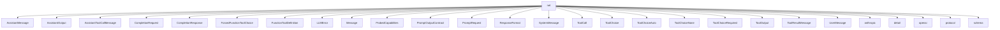

# Namespace `clore::net`

## Summary

The `clore::net` namespace provides the networking and protocol layer for interacting with large language model (LLM) providers. It defines the core data types for constructing completion requests and processing responses, including message types (`SystemMessage`, `UserMessage`, `AssistantMessage`, `ToolResultMessage`, `AssistantToolCallMessage`), tool-‑related structures (`FunctionToolDefinition`, `ToolCall`, `ToolOutput`, `ToolChoice` variants), output contracts (`PromptOutputContract`), and error handling (`LLMError`). The namespace also supplies asynchronous entry points such as `call_llm_async`, `call_completion_async`, and `call_structured_async`, which coordinate request submission, rate‑limiting (via `initialize_llm_rate_limit` and `shutdown_llm_rate_limit`), and capability‑aware request adaptation.

Architecturally, `clore::net` hides the details of provider‑specific communication and offers a unified interface for managing LLM interactions. It includes utilities for probing and caching provider capabilities (`get_probed_capabilities`, `sanitize_request_for_capabilities`), for recognizing and extracting feature‑rejection errors (`is_feature_rejection_error`, `parse_rejected_feature_from_error`), and for validating the runtime environment (`validate_llm_provider_environment`). Together, these components form a robust foundation that higher‑level application code uses to send prompts, handle structured tool calls, and process completions without needing to manage raw network protocols or provider idiosyncrasies.

## Diagram


```mermaid
graph TD
    NS["net"]
    T0["AssistantMessage"]
    NS --> T0
    T1["AssistantOutput"]
    NS --> T1
    T2["AssistantToolCallMessage"]
    NS --> T2
    T3["CompletionRequest"]
    NS --> T3
    T4["CompletionResponse"]
    NS --> T4
    T5["ForcedFunctionToolChoice"]
    NS --> T5
    T6["FunctionToolDefinition"]
    NS --> T6
    T7["LLMError"]
    NS --> T7
    T8["Message"]
    NS --> T8
    T9["ProbedCapabilities"]
    NS --> T9
    T10["PromptOutputContract"]
    NS --> T10
    T11["PromptRequest"]
    NS --> T11
    T12["ResponseFormat"]
    NS --> T12
    T13["SystemMessage"]
    NS --> T13
    T14["ToolCall"]
    NS --> T14
    T15["ToolChoice"]
    NS --> T15
    T16["ToolChoiceAuto"]
    NS --> T16
    T17["ToolChoiceNone"]
    NS --> T17
    T18["ToolChoiceRequired"]
    NS --> T18
    T19["ToolOutput"]
    NS --> T19
    T20["ToolResultMessage"]
    NS --> T20
    T21["UserMessage"]
    NS --> T21
    NSC0["anthropic"]
    NS --> NSC0
    NSC1["detail"]
    NS --> NSC1
    NSC2["openai"]
    NS --> NSC2
    NSC3["protocol"]
    NS --> NSC3
    NSC4["schema"]
    NS --> NSC4
```

## Subnamespaces

- [`clore::net::anthropic`](anthropic/index.md)
- [`clore::net::detail`](detail/index.md)
- [`clore::net::openai`](openai/index.md)
- [`clore::net::protocol`](protocol/index.md)
- [`clore::net::schema`](schema/index.md)

## Types

### `clore::net::AssistantMessage`

Declaration: `src/network/protocol.cppm:43`

Definition: `src/network/protocol.cppm:43`

Implementation: [`Module protocol`](../../../modules/protocol/index.md)

The struct `clore::net::AssistantMessage` represents a message generated by the AI assistant in a conversational context. It is one of several message types used within the `clore::net` protocol to model multi-turn interactions, alongside `SystemMessage`, `UserMessage`, and `ToolResultMessage`. This type is typically employed in constructs such as `CompletionRequest` and `CompletionResponse` to convey the assistant’s textual output and, optionally, associated tool call requests.

As part of the `Message` type alias, `AssistantMessage` enables type‑safe handling of heterogeneous conversation turns. Its role is to encapsulate the assistant’s contribution to a prompt or completion flow, serving as the counterpart to user‑initiated inputs and system‑level directives.

#### Invariants

- content can be any valid `std::string`

#### Key Members

- content

#### Usage Patterns

- Used to transmit assistant message content in network protocol

### `clore::net::AssistantOutput`

Declaration: `src/network/protocol.cppm:113`

Definition: `src/network/protocol.cppm:113`

Implementation: [`Module protocol`](../../../modules/protocol/index.md)

`clore::net::AssistantOutput` is a struct that represents the output produced by an assistant in a conversational or completion context. It is primarily used to encapsulate the response generated by an LLM or AI model, which may include text content, tool calls, or other structured results. This type plays a central role in the networking protocol layer, facilitating the exchange of assistant responses between the application and external services. It is typically used alongside related types such as `clore::net::AssistantMessage` and `clore::net::ToolCall` to model the full set of data associated with an assistant's turn in a dialogue.

#### Invariants

- At most one of `text` and `refusal` may be engaged (implied by optional semantics)
- `tool_calls` can be empty indicating no tool calls

#### Key Members

- `text`
- `refusal`
- `tool_calls`

#### Usage Patterns

- Returned by assistant processing functions
- Consumed by handling code to extract text, refusal, or tool calls

### `clore::net::AssistantToolCallMessage`

Declaration: `src/network/protocol.cppm:47`

Definition: `src/network/protocol.cppm:47`

Implementation: [`Module protocol`](../../../modules/protocol/index.md)

The `clore::net::AssistantToolCallMessage` struct represents a message from an AI assistant that includes one or more tool call requests. It is used within the chat completion protocol to convey the assistant's decision to invoke external functions, typically as part of a multi‑turn interaction where the assistant delegates computation or data retrieval to a tool. This message type is distinct from a plain `AssistantMessage` because it carries structured tool invocation data rather than a text response.

#### Invariants

- `content` is optional; it may be `std::nullopt`
- `tool_calls` may be empty
- No other invariants are documented

#### Key Members

- `content`
- `tool_calls`

#### Usage Patterns

- Used as part of assistant messages in network protocol
- Objects are likely constructed from parsed AI responses
- May be stored in conversation histories

### `clore::net::CompletionRequest`

Declaration: `src/network/protocol.cppm:89`

Definition: `src/network/protocol.cppm:89`

Implementation: [`Module protocol`](../../../modules/protocol/index.md)

`clore::net::CompletionRequest` is a struct that represents a request to a language model completion endpoint. It encapsulates all parameters required to generate a completion, such as model selection, messages (in various roles like `UserMessage`, `AssistantMessage`, `SystemMessage`), tool definitions (`FunctionToolDefinition`), and response formatting (`ResponseFormat`). Associated types like `PromptRequest`, `ToolChoice`, and `CompletionResponse` indicate that this struct is part of a protocol for sending a completion invocation and receiving a structured reply, supporting advanced features like tool calling and output contracts.

#### Invariants

- `model` is a non-empty string identifying the AI model
- `messages` contains at least one message to prompt the model
- `tools` list may be empty when no function definitions are provided
- `tool_choice` and `response_format` are absent unless explicitly set
- `parallel_tool_calls` is absent unless explicitly set

#### Key Members

- `model`
- `messages`
- `response_format`
- `tools`
- `tool_choice`
- `parallel_tool_calls`

#### Usage Patterns

- Aggregate-initialized with request parameters
- Passed to networking client to perform API call
- Serialized to JSON for transmission to a completion endpoint

### `clore::net::CompletionResponse`

Declaration: `src/network/protocol.cppm:119`

Definition: `src/network/protocol.cppm:119`

Implementation: [`Module protocol`](../../../modules/protocol/index.md)

The `clore::net::CompletionResponse` struct represents the data returned by a language model completion API call. It encapsulates the full result of generating a response from a `clore::net::CompletionRequest`, including the model’s output, any tool calls made, and potential error information. This struct is the primary unit of return from network operations in the `clore::net` protocol layer, designed to be deserialized from server responses and forwarded to application‑level processing logic.

In typical usage, a `clore::net::CompletionResponse` is received asynchronously after issuing a completion request. It may contain an `clore::net::AssistantMessage` with the generated text, a list of `clore::net::ToolCall` objects if the model invoked tools, or an `clore::net::LLMError` in case of failure. The struct therefore serves as a unified container that allows callers to inspect the completed interaction without needing to handle multiple separate response types.

#### Invariants

- All fields are populated after a successful response
- `raw_json` contains the original serialized response

#### Key Members

- id
- model
- message
- `raw_json`

#### Usage Patterns

- Returned by completion endpoints
- Consumed by callers to extract response details

### `clore::net::ForcedFunctionToolChoice`

Declaration: `src/network/protocol.cppm:82`

Definition: `src/network/protocol.cppm:82`

Implementation: [`Module protocol`](../../../modules/protocol/index.md)

The `clore::net::ForcedFunctionToolChoice` struct is a tool‑choice configuration that directs the language model to call a specific function. It is one of several tool‑choice options alongside `clore::net::ToolChoiceAuto`, `clore::net::ToolChoiceNone`, and `clore::net::ToolChoiceRequired`, which together form the `clore::net::ToolChoice` type alias. Use `ForcedFunctionToolChoice` when you require the model to invoke a particular tool (named by its function definition) and ignore all other candidates. This struct is typically assigned to the `tool_choice` field of a `clore::net::CompletionRequest` or `clore::net::PromptRequest` to override the default selection logic.

#### Key Members

- name

#### Usage Patterns

- Likely passed as an argument to configure tool choice in network protocols

### `clore::net::FunctionToolDefinition`

Declaration: `src/network/protocol.cppm:69`

Definition: `src/network/protocol.cppm:69`

Implementation: [`Module protocol`](../../../modules/protocol/index.md)

The struct `clore::net::FunctionToolDefinition` represents the definition of a callable function tool that can be invoked by a language model during a completion. It typically includes metadata such as the function's name, description, and parameter schema, and is supplied as part of tool configuration in requests like `CompletionRequest` or `PromptRequest`. This type enables structured interaction where the model can request execution of a predefined function, with results returned via `ToolOutput`.

#### Invariants

- `strict` has a default value of `true`.
- `parameters` is a `kota::codec::json::Object`.
- The struct is a simple aggregate with no custom constructors, destructors, or assignment `operator`s.

#### Key Members

- `name`
- `description`
- `strict`
- `parameters`

#### Usage Patterns

- Used within the `clore::net` namespace, likely in the context of network protocols or function tool definitions.
- Filled with appropriate values when defining tools for function calling in a network-based system.

### `clore::net::LLMError`

Declaration: `src/network/http.cppm:37`

Definition: `src/network/http.cppm:37`

Implementation: [`Module http`](../../../modules/http/index.md)

Insufficient evidence to summarize; provide more EVIDENCE.

#### Invariants

- `message` always contains a valid string (default-constructed to empty).
- Constructing from `kota::error` extracts the error message without losing information.

#### Key Members

- `std::string message`
- `LLMError(std::string msg)`
- `LLMError(kota::error err)`

#### Usage Patterns

- Returned from functions to indicate an LLM-related error.
- Captures errors from the `kota` library for uniform error handling.
- Instantiated with a descriptive string for custom error cases.

#### Member Functions

##### `clore::net::LLMError::LLMError`

Declaration: `src/network/http.cppm:42`

Definition: `src/network/http.cppm:42`

Implementation: [`Module http`](../../../modules/http/index.md)

###### Declaration

```cpp
clore::net::LLMError::LLMError(std::string msg);
```

##### `clore::net::LLMError::LLMError`

Declaration: `src/network/http.cppm:44`

Definition: `src/network/http.cppm:44`

Implementation: [`Module http`](../../../modules/http/index.md)

###### Declaration

```cpp
clore::net::LLMError::LLMError(kota::error err);
```

##### `clore::net::LLMError::LLMError`

Declaration: `src/network/http.cppm:40`

Definition: `src/network/http.cppm:40`

Implementation: [`Module http`](../../../modules/http/index.md)

###### Declaration

```cpp
clore::net::LLMError::LLMError();
```

### `clore::net::Message`

Declaration: `src/network/protocol.cppm:57`

Implementation: [`Module protocol`](../../../modules/protocol/index.md)

Insufficient evidence to summarize; provide more EVIDENCE.

#### Invariants

- Holds exactly one alternative type at a time
- Each alternative is a distinct message type in the protocol

#### Key Members

- `SystemMessage`
- `UserMessage`
- `AssistantMessage`
- `AssistantToolCallMessage`
- `ToolResultMessage`

#### Usage Patterns

- Used as the common message type for communication across the network layer
- Typically accessed via `std::visit` or pattern matching to handle specific message types

### `clore::net::ProbedCapabilities`

Declaration: `src/network/protocol.cppm:131`

Definition: `src/network/protocol.cppm:131`

Implementation: [`Module protocol`](../../../modules/protocol/index.md)

Insufficient evidence to summarize; provide more EVIDENCE.

#### Invariants

- All members are initialized to `true`.
- Members are atomic and can be safely modified from multiple threads.

#### Key Members

- `supports_json_schema`
- `supports_tool_choice`
- `supports_parallel_tool_calls`
- `supports_tools`

#### Usage Patterns

- Read after probing to determine enabled features.
- Set to `false` when a capability is found unsupported.

### `clore::net::PromptOutputContract`

Declaration: `src/network/protocol.cppm:98`

Definition: `src/network/protocol.cppm:98`

Implementation: [`Module protocol`](../../../modules/protocol/index.md)

The `clore::net::PromptOutputContract` enumeration specifies the expected output format or contract for prompt responses in the communication protocol. It is typically used in conjunction with types like `clore::net::PromptRequest` and `clore::net::AssistantOutput` to indicate the structure or serialization scheme the server must follow when returning results, enabling clients to request a specific output shape (e.g., JSON or structured data) for consistent parsing and handling.

#### Member Variables

##### `clore::net::PromptOutputContract::Json`

Declaration: `src/network/protocol.cppm:100`

Implementation: [`Module protocol`](../../../modules/protocol/index.md)

###### Declaration

```cpp
Json
```

##### `clore::net::PromptOutputContract::Markdown`

Declaration: `src/network/protocol.cppm:101`

Implementation: [`Module protocol`](../../../modules/protocol/index.md)

###### Declaration

```cpp
Markdown
```

##### `clore::net::PromptOutputContract::Unspecified`

Declaration: `src/network/protocol.cppm:99`

Implementation: [`Module protocol`](../../../modules/protocol/index.md)

###### Declaration

```cpp
Unspecified
```

### `clore::net::PromptRequest`

Declaration: `src/network/protocol.cppm:104`

Definition: `src/network/protocol.cppm:104`

Implementation: [`Module protocol`](../../../modules/protocol/index.md)

Insufficient evidence to summarize; provide more EVIDENCE.

#### Invariants

- `output_contract` always has a value (default `PromptOutputContract::Unspecified`)
- `prompt` is default-constructed as empty string

#### Key Members

- `prompt`
- `response_format`
- `tool_choice`
- `output_contract`

#### Usage Patterns

- Used as input for LLM inference, carrying the prompt and optional response constraints
- Default `output_contract` allows unspecified contract behavior

### `clore::net::ResponseFormat`

Declaration: `src/network/protocol.cppm:63`

Definition: `src/network/protocol.cppm:63`

Implementation: [`Module protocol`](../../../modules/protocol/index.md)

Insufficient evidence to summarize; provide more EVIDENCE.

#### Invariants

- `strict` is always initialized, defaulting to `true`
- `schema` may be empty (`std::nullopt`)

#### Key Members

- `name`
- `schema`
- `strict`

#### Usage Patterns

- Used to specify response format when calling `APIs`
- The `schema` can be provided to constrain output
- The `strict` flag controls schema enforcement

### `clore::net::SystemMessage`

Declaration: `src/network/protocol.cppm:28`

Definition: `src/network/protocol.cppm:28`

Implementation: [`Module protocol`](../../../modules/protocol/index.md)

`clore::net::SystemMessage` is a struct that represents a system-provided message in a chat completion conversation. It is used to define instructions, context, or behavioral guidelines for the language model, typically appearing at the beginning of a message sequence. This type is one of the variants in the `clore::net::Message` type alias, which together with other message types such as `clore::net::UserMessage`, `clore::net::AssistantMessage`, and `clore::net::ToolResultMessage` enables constructing multi-turn chat requests via `clore::net::CompletionRequest` or `clore::net::PromptRequest`.

#### Invariants

- No invariants specified; the struct is a plain aggregate.

#### Key Members

- `content` (`std::string`)

#### Usage Patterns

- Used as a lightweight container for a system message string in network-related code.

### `clore::net::ToolCall`

Declaration: `src/network/protocol.cppm:36`

Definition: `src/network/protocol.cppm:36`

Implementation: [`Module protocol`](../../../modules/protocol/index.md)

The `clore::net::ToolCall` struct represents a single invocation of a tool by the assistant, as part of a `clore::net::AssistantToolCallMessage`. It identifies which tool was called (typically by a tool name or identifier) and provides the arguments generated by the model. This type is used in chat completion responses to convey that the assistant requests execution of a tool, and the caller should then supply the result via a `clore::net::ToolResultMessage`.

### `clore::net::ToolChoice`

Declaration: `src/network/protocol.cppm:86`

Implementation: [`Module protocol`](../../../modules/protocol/index.md)

`clore::net::ToolChoice` is a type alias that represents the selection strategy for which tools the language model is permitted to invoke during a request completion. It serves as a discriminated union of the possible modes defined by the structs `clore::net::ToolChoiceAuto`, `clore::net::ToolChoiceNone`, `clore::net::ToolChoiceRequired`, and `clore::net::ForcedFunctionToolChoice`. This alias is used in `clore::net::CompletionRequest` and related components to control whether the model automatically chooses tools, is required to call a tool, uses no tools, or is forced to call a specific function.

#### Invariants

- holds exactly one of the four variant alternatives
- each alternative is a distinct type for a specific tool choice mode

#### Key Members

- `ToolChoiceAuto`
- `ToolChoiceRequired`
- `ToolChoiceNone`
- `ForcedFunctionToolChoice`

#### Usage Patterns

- constructed from one of the four tool choice types
- inspected via `std::visit` to dispatch on the active alternative
- passed as parameter to specify tool selection behavior

### `clore::net::ToolChoiceAuto`

Declaration: `src/network/protocol.cppm:76`

Definition: `src/network/protocol.cppm:76`

Implementation: [`Module protocol`](../../../modules/protocol/index.md)

Insufficient evidence to summarize; provide more EVIDENCE.

#### Invariants

- It is a trivially constructible and destructible type.
- It provides no runtime state.

#### Key Members

- None; the struct has no members.

#### Usage Patterns

- Other code might use `clore::net::ToolChoiceAuto` as a template parameter or overload resolution tag.
- Its emptiness ensures no overhead when used as a discriminator.

### `clore::net::ToolChoiceNone`

Declaration: `src/network/protocol.cppm:80`

Definition: `src/network/protocol.cppm:80`

Implementation: [`Module protocol`](../../../modules/protocol/index.md)

The `clore::net::ToolChoiceNone` struct is one of the alternatives for the `ToolChoice` type alias. It represents an explicit instruction that no tools should be invoked during a completion request, overriding any default tool behavior. This type is used to signal the language model that tool calls are not allowed, even when tool definitions are present in the request.

#### Invariants

- Empty struct, no state
- Trivially copyable
- Trivially destructible

#### Usage Patterns

- Used as a type tag to indicate absence of tool selection
- Likely used in variant or template contexts to disambiguate tool choices

### `clore::net::ToolChoiceRequired`

Declaration: `src/network/protocol.cppm:78`

Definition: `src/network/protocol.cppm:78`

Implementation: [`Module protocol`](../../../modules/protocol/index.md)

`clore::net::ToolChoiceRequired` is a struct that represents the requirement for the language model to call a tool during a completion or prompt request. It is one of the tool choice variants alongside `clore::net::ToolChoiceAuto`, `clore::net::ToolChoiceNone`, and `clore::net::ForcedFunctionToolChoice`. When a `ToolChoiceRequired` value is provided as the `ToolChoice` in a request, the model is forced to select and invoke a tool rather than producing a direct text response. This type ensures that the interaction with the model follows a strict tool-use workflow, typically in scenarios where the application must capture structured function calls from the model.

### `clore::net::ToolOutput`

Declaration: `src/network/protocol.cppm:126`

Definition: `src/network/protocol.cppm:126`

Implementation: [`Module protocol`](../../../modules/protocol/index.md)

The `clore::net::ToolOutput` struct represents the result or output data produced by a tool invocation within a conversational AI network protocol. It is typically paired with a `clore::net::ToolCall` to capture the outcome of executing a tool function, and can be used in messages such as `clore::net::ToolResultMessage` to convey the tool's response back to the assistant or system. This struct provides a structured way to communicate the output of a tool call, ensuring that downstream processing or message assembly can reliably interpret the tool's results.

#### Invariants

- No explicit invariants; fields are independent strings.

#### Key Members

- `tool_call_id`
- `output`

#### Usage Patterns

- Used to communicate tool execution results back to the caller.
- Likely serialized or stored as a pair associating an identifier with its output.

### `clore::net::ToolResultMessage`

Declaration: `src/network/protocol.cppm:52`

Definition: `src/network/protocol.cppm:52`

Implementation: [`Module protocol`](../../../modules/protocol/index.md)

Insufficient evidence to summarize; provide more EVIDENCE.

#### Invariants

- Both `tool_call_id` and `content` are default-constructible and copyable strings.
- No special invariants beyond standard string validity.

#### Key Members

- `tool_call_id`: identifier for the corresponding tool invocation.
- `content`: payload of the tool result.

#### Usage Patterns

- Constructed and sent by the tool execution backend.
- Parsed by the protocol handler to match results with pending calls.
- Serialized and deserialized as part of a larger network message.

### `clore::net::UserMessage`

Declaration: `src/network/protocol.cppm:32`

Definition: `src/network/protocol.cppm:32`

Implementation: [`Module protocol`](../../../modules/protocol/index.md)

The `clore::net::UserMessage` struct represents a message originating from a human user in a conversational interaction with a large language model (LLM). It is part of the core message‑type hierarchy used to form a `clore::net::Message`, alongside `clore::net::SystemMessage`, `clore::net::AssistantMessage`, and others. Typically, a `UserMessage` carries the text or structured content that the user submits, and it is included in the sequence of messages sent via `clore::net::CompletionRequest` or `clore::net::PromptRequest` to drive the model’s response.

#### Invariants

- content is a valid `std::string`

#### Key Members

- content

#### Usage Patterns

- used as a simple data carrier in network communication

## Functions

### `clore::net::call_completion_async`

Declaration: `src/network/client.cppm:24`

Definition: `src/network/client.cppm:65`

Implementation: [`Module client`](../../../modules/client/index.md)

The function `clore::net::call_completion_async` is a template, parameterized by a `Protocol` type, that initiates an asynchronous request to obtain a completion from the network endpoint. The caller provides an integer identifier (likely representing a specific request or context) and a pointer to a `kota::event_loop` (or a reference to one) on which the asynchronous operation will be scheduled. The function returns an integer status code: a value of zero typically indicates success, while a non‑zero value signals an error condition. The caller is responsible for ensuring that the associated `kota::event_loop` remains valid until the operation completes; the operation’s outcome is delivered through the event loop’s callback mechanism.

#### Usage Patterns

- Called after environment validation via `validate_llm_provider_environment`
- Used in higher-level async flows that need completion responses with tool support detection
- Cooperates with `make_markdown_fragment_request` and `call_structured_async` as part of a module

### `clore::net::call_completion_async`

Declaration: `src/network/network.cppm:31`

Definition: `src/network/network.cppm:157`

Implementation: [`Module network`](../../../modules/network/index.md)

The function `clore::net::call_completion_async` initiates an asynchronous LLM completion operation. It accepts an `int` (interpreted as a request handle or identifier) and a reference to a `kota::event_loop`, which must be active to process the completion. The function returns an `int` that signals the immediate outcome of the call (e.g., success or error code). The caller is responsible for ensuring the event loop remains live until the operation finishes; the returned value does not convey the final completion result, which is delivered separately through the event loop's callback mechanism.

#### Usage Patterns

- Await the returned task to obtain a `CompletionResponse` or `LLMError`
- Used with an event loop to schedule asynchronous LLM calls

### `clore::net::call_llm_async`

Declaration: `src/network/client.cppm:35`

Definition: `src/network/client.cppm:165`

Implementation: [`Module client`](../../../modules/client/index.md)

The function template `clore::net::call_llm_async`, parameterized by `Protocol`, initiates an asynchronous request to a language model. It accepts three `std::string_view` arguments representing the prompt, system message, and model identifier, along with a pointer to a `kota::event_loop`. The caller must ensure that the event loop remains valid for the duration of the asynchronous operation, or may pass `nullptr` to use a default event loop. The function returns an `int` indicating the outcome of the call, typically zero on success or a non‑zero error code on failure.

#### Usage Patterns

- called with model, `system_prompt`, prompt, and `event_loop` pointer
- invoked by higher-level async LLM functions
- used to perform asynchronous text completion with markdown output

### `clore::net::call_llm_async`

Declaration: `src/network/client.cppm:28`

Definition: `src/network/client.cppm:146`

Implementation: [`Module client`](../../../modules/client/index.md)

The template function `clore::net::call_llm_async` initiates an asynchronous request to a language model. It accepts a provider identifier, a model name or endpoint, and an integer configuration parameter, along with an optional pointer to a `kota::event_loop`. If the pointer is null, the function uses a default global event loop. The function returns an integer handle that identifies the pending operation; completion is delivered through the event loop’s mechanism. The `Protocol` template parameter selects the underlying communication transport, enabling support for different backends. This function is non‑blocking and respects the rate‑limiting policy configured via `clore::net::initialize_llm_rate_limit`. Errors are signaled asynchronously and can be inspected using utilities such as `clore::net::is_feature_rejection_error`.

#### Usage Patterns

- called with a `PromptRequest` and optional event loop to perform LLM text generation
- used as the primary entry point for asynchronous LLM calls in the library
- `co_awaited` by callers to obtain either a string result or an `LLMError`

### `clore::net::call_llm_async`

Declaration: `src/network/network.cppm:25`

Definition: `src/network/network.cppm:133`

Implementation: [`Module network`](../../../modules/network/index.md)

The function `clore::net::call_llm_async` schedules an asynchronous language model call, accepting two string views (typically a system prompt and user prompt or model identifier), an integer request identifier, and a reference to a `kota::event_loop` that drives the asynchronous completion. It returns an `int` representing either a success indicator or a handle for the ongoing request. Callers are responsible for ensuring the supplied event loop remains active and properly configured to dispatch the resulting callback or continuation.

#### Usage Patterns

- called by other coroutine functions to obtain LLM text responses
- used with `kota::event_loop` for non-blocking execution
- integrated into async completion pipelines that expect `kota::task` with `LLMError`

### `clore::net::call_structured_async`

Declaration: `src/network/client.cppm:42`

Definition: `src/network/client.cppm:186`

Implementation: [`Module client`](../../../modules/client/index.md)

The function template `clore::net::call_structured_async` initiates an asynchronous call to an LLM service, requesting a response conforming to a structured schema. It is parameterized by `Protocol` and `T`, where `Protocol` selects the network protocol and `T` specifies the target structured response type. The caller provides three `std::string_view` arguments (typically identifying the provider, the model, and the request payload) and a pointer to a `kota::event_loop` that will handle the asynchronous completion. The function returns an `int` that represents either an operation handle or a status code for the initiated call. The caller must ensure the event loop is active and correctly configured, and is responsible for processing any errors returned through the operation.

#### Usage Patterns

- Used by callers that need structured, type-safe responses from an LLM; typically invoked on an event loop with appropriate protocol and response type template parameters.

### `clore::net::get_probed_capabilities`

Declaration: `src/network/protocol.cppm:138`

Definition: `src/network/protocol.cppm:741`

Implementation: [`Module protocol`](../../../modules/protocol/index.md)

The function `clore::net::get_probed_capabilities` accepts a `std::string_view` that identifies a target LLM provider or model configuration. It returns a reference to a `ProbedCapabilities` object that contains the set of capabilities (such as supported features or rate limits) that have been determined for that target. The caller can use the returned reference to inspect whether certain features are available, or to pass to functions like `sanitize_request_for_capabilities` that adapt requests accordingly. This function ensures that the capabilities are probed lazily or retrieved from a cache, so the first call for a given identifier may initiate the probing process. The returned reference remains valid for the lifetime of the program or until a reset.

#### Usage Patterns

- used to lazily obtain or create cached capability probing results
- called during capability probing to ensure one probe per key

### `clore::net::icontains`

Declaration: `src/network/protocol.cppm:780`

Definition: `src/network/protocol.cppm:780`

Implementation: [`Module protocol`](../../../modules/protocol/index.md)

Declaration: [Declaration](functions/icontains.md)

`clore::net::icontains` returns `true` if the first `std::string_view` contains the second `std::string_view` as a substring, ignoring case. The function accepts two views and performs a case‑insensitive substring search.

It is designed as a utility for pattern‑matching within diagnostic or error strings, such as determining whether an error message indicates a known condition. The caller supplies a full string (typically an error message) and a needle to search for, and `icontains` reports whether the needle appears anywhere in the input, disregarding character casing.

#### Usage Patterns

- Used in `is_feature_rejection_error` to perform case-insensitive substring checks on error messages.

### `clore::net::initialize_llm_rate_limit`

Declaration: `src/network/http.cppm:33`

Definition: `src/network/http.cppm:93`

Implementation: [`Module http`](../../../modules/http/index.md)

The function `clore::net::initialize_llm_rate_limit` configures the global rate‑limiting mechanism used by asynchronous LLM call paths within the `clore::net` module. The caller must provide a single `std::uint32_t` argument representing the maximum number of requests permitted in the rate‑limiting window. After this function returns, the rate limiter is active for all subsequent LLM operations; it is the caller’s responsibility to eventually call `clore::net::shutdown_llm_rate_limit` to release any allocated resources. Calling this function multiple times or without an accompanying shutdown is undefined behavior.

#### Usage Patterns

- Called to set or update the LLM rate limit
- Used during initialization or runtime reconfiguration
- Called before making LLM requests to control concurrency

### `clore::net::is_feature_rejection_error`

Declaration: `src/network/protocol.cppm:147`

Definition: `src/network/protocol.cppm:800`

Implementation: [`Module protocol`](../../../modules/protocol/index.md)

Returns `true` if the provided error message, passed as a `std::string_view`, is recognized as indicating a feature rejection from the LLM provider. This allows callers to distinguish between general failures and errors caused by requesting a capability that the target model does not support. When this function returns `true`, the caller may use `clore::net::parse_rejected_feature_from_error` to extract the specific rejected feature and adjust subsequent requests accordingly.

#### Usage Patterns

- detecting feature rejection in LLM API errors
- determining whether to retry without specific parameters

### `clore::net::make_capability_probe_key`

Declaration: `src/network/protocol.cppm:140`

Definition: `src/network/protocol.cppm:755`

Implementation: [`Module protocol`](../../../modules/protocol/index.md)

The function `clore::net::make_capability_probe_key` accepts three `std::string_view` arguments and returns a `std::string`. It is used to generate a composite key that uniquely identifies a capability probe request, typically formed from components such as service identifier, model name, and endpoint or version. The returned string is suitable for use in maps or caches to store and retrieve probed capability metadata for a given combination of inputs.

#### Usage Patterns

- building probe key for capability cache
- creating unique identifier for provider+model combination

### `clore::net::make_markdown_fragment_request`

Declaration: `src/network/protocol.cppm:111`

Definition: `src/network/protocol.cppm:156`

Implementation: [`Module protocol`](../../../modules/protocol/index.md)

The function `clore::net::make_markdown_fragment_request` constructs a `PromptRequest` from a given markdown fragment represented as a `std::string`. The caller provides the content of the markdown fragment, and the function returns a `PromptRequest` object suitable for submission to LLM networking functions such as `clore::net::call_llm_async`. The function does not perform validation of the markdown content; it simply creates the request structure as a convenience for callers who need to submit a markdown fragment in a request.

#### Usage Patterns

- Construct a `PromptRequest` for markdown fragment generation

### `clore::net::parse_rejected_feature_from_error`

Declaration: `src/network/protocol.cppm:149`

Definition: `src/network/protocol.cppm:819`

Implementation: [`Module protocol`](../../../modules/protocol/index.md)

The function `clore::net::parse_rejected_feature_from_error` accepts a `std::string_view` representing an error message and returns a `std::optional<std::string>`. Its purpose is to extract the identifier of a specific LLM feature that has been rejected by the remote provider, based on the content of the error string. If the error matches a known pattern indicating feature rejection, the function yields the feature name; otherwise it returns `std::nullopt`.

Callers should use this function after confirming that the error is a feature‑rejection error (for example, via `clore::net::is_feature_rejection_error`). The returned value can then be used to adapt subsequent LLM requests or to inform higher‑level retry logic. The function makes no guarantees about the exact format of the returned string beyond being a non‑empty feature identifier when a match is found.

#### Usage Patterns

- Used to parse error responses from LLM `APIs` to identify which feature was rejected
- Likely called in error handling paths after calling LLM functions

### `clore::net::sanitize_request_for_capabilities`

Declaration: `src/network/protocol.cppm:144`

Definition: `src/network/protocol.cppm:761`

Implementation: [`Module protocol`](../../../modules/protocol/index.md)

The function `clore::net::sanitize_request_for_capabilities` accepts a `CompletionRequest` and a reference to `const ProbedCapabilities` and returns a `CompletionRequest`. Its responsibility is to adjust the incoming request so that it conforms to the capabilities advertised by the target inference service. The caller should provide the most recently probed capabilities to ensure the returned request is compatible and will not be rejected due to unsupported features or parameters. The function does not validate the freshness or correctness of the capabilities data; that is the caller's responsibility.

#### Usage Patterns

- called before sending a request to match known provider capabilities
- used in request preprocessing pipelines

### `clore::net::shutdown_llm_rate_limit`

Declaration: `src/network/http.cppm:35`

Definition: `src/network/http.cppm:277`

Implementation: [`Module http`](../../../modules/http/index.md)

`clore::net::shutdown_llm_rate_limit` is the counterpart to `clore::net::initialize_llm_rate_limit`. It releases any internal state or resources that were allocated for rate‑limiting LLM requests. Callers must invoke this function during cleanup or shutdown to gracefully stop the rate limiter. The function is `noexcept` and takes no arguments; it does not return a value.

#### Usage Patterns

- called during system shutdown to clean up rate limiter
- called before reinitializing rate limit parameters

### `clore::net::validate_llm_provider_environment`

Declaration: `src/network/network.cppm:35`

Definition: `src/network/network.cppm:125`

Implementation: [`Module network`](../../../modules/network/index.md)

The `clore::net::validate_llm_provider_environment` function performs an environment validation check for the configured LLM provider. It returns an `int` code: zero indicates a valid environment, while a non‑zero value signals that one or more required environment variables or configuration items are missing or malformed. Callers are expected to invoke this function early in the application lifecycle, before any `clore::net::call_llm_async` or related request, to guarantee that the provider can be used without runtime failures.

#### Usage Patterns

- Called as a precondition before making LLM API calls to ensure the environment is properly set up.

## Related Pages

- [Namespace clore](../index.md)
- [Namespace clore::net::anthropic](anthropic/index.md)
- [Namespace clore::net::detail](detail/index.md)
- [Namespace clore::net::openai](openai/index.md)
- [Namespace clore::net::protocol](protocol/index.md)
- [Namespace clore::net::schema](schema/index.md)

