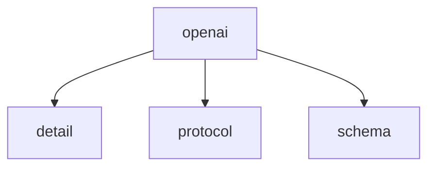

# Namespace `clore::net::openai`

## Summary

The `clore::net::openai` namespace provides an asynchronous client for interacting with `OpenAI`-compatible language model `APIs`. It defines a set of non-blocking functions—`call_completion_async`, `call_llm_async`, and `call_structured_async`—that each accept a `kota::event_loop` reference and return an integer handle for tracking or cancelling the pending request. These functions abstract the details of HTTP communication and JSON serialization, allowing callers to submit prompts, system messages, model identifiers, and optional schema descriptors while offloading the asynchronous lifecycle management to the event loop.

Architecturally, this namespace forms the `OpenAI` integration layer within the `clore::net` networking module. By centralizing the async request patterns and returning opaque handles, it decouples the application logic from the specifics of the `OpenAI` API, enabling consistent error handling, cancellation, and result dispatch through the event loop’s callback mechanism.

## Diagram

## Subnamespaces

- [`clore::net::openai::detail`](detail/index.md)
- [`clore::net::openai::protocol`](protocol/index.md)
- [`clore::net::openai::schema`](schema/index.md)

## Functions

### `clore::net::openai::call_completion_async`

Declaration: `network/openai.cppm:748`

Definition: `network/openai.cppm:775`

Implementation: [`Module openai`](../../../../modules/openai/index.md)

Submits an asynchronous completion request to the `OpenAI` API, using an integer argument to identify a predefined prompt or configuration. The function accepts a reference to a `kota::event_loop` for managing the asynchronous lifecycle; the caller must ensure the loop remains active until the request completes.

Returns an integer handle that uniquely identifies the pending request. This handle can later be used to monitor or cancel the operation. The caller is responsible for providing a valid event loop and for handling the result through the loop's event dispatch mechanism.

#### Usage Patterns

- called with a `CompletionRequest` and an event loop reference
- typically `co_await`ed within another coroutine

### `clore::net::openai::call_llm_async`

Declaration: `network/openai.cppm:752`

Definition: `network/openai.cppm:782`

Implementation: [`Module openai`](../../../../modules/openai/index.md)

Initiates an asynchronous request to a large language model, sending the provided prompt and system message as parameters along with an integer argument (such as a token limit or temperature). The function returns an integer identifier that can be used to track or cancel the pending request. The caller must supply an active `kota::event_loop` reference; the asynchronous result is delivered through the event loop's callback mechanism.

#### Usage Patterns

- Called with a model name, system prompt, integer parameter, and event loop to start an async LLM call
- Used to submit a request to an LLM endpoint asynchronously

### `clore::net::openai::call_llm_async`

Declaration: `network/openai.cppm:758`

Definition: `network/openai.cppm:793`

Implementation: [`Module openai`](../../../../modules/openai/index.md)

The function `clore::net::openai::call_llm_async` initiates an asynchronous request to an `OpenAI`-compatible language model. It accepts three `std::string_view` parameters (commonly a model identifier, a user prompt, and a system message) and a reference to a `kota::event_loop`. The caller must ensure that the event loop is running and that the passed string views remain valid for the duration of the operation. The function returns an `int` that serves as a handle for the request (e.g., a request ID or error indicator), allowing the caller to track or cancel the operation.

#### Usage Patterns

- Used to invoke large language models asynchronously in a coroutine context
- Commonly called from other async functions that compose LLM calls

### `clore::net::openai::call_structured_async`

Declaration: `network/openai.cppm:765`

Definition: `network/openai.cppm:805`

Implementation: [`Module openai`](../../../../modules/openai/index.md)

`clore::net::openai::call_structured_async` is a template function that initiates an asynchronous request to the `OpenAI` API to obtain a structured response of the type specified by the template parameter `T`. The caller supplies three `std::string_view` arguments — typically representing a system prompt, a user message, and an output schema or format descriptor — along with a reference to a `kota::event_loop` for driving the async operation. The function returns an `int`, which may serve as a request identifier or status code for subsequent cancellation or completion tracking.

#### Usage Patterns

- Used to obtain structured outputs from an `OpenAI` language model in an asynchronous context
- Called from other coroutines that require structured data from LLM completions

## Related Pages

- [Namespace clore::net](../index.md)
- [Namespace clore::net::openai::detail](detail/index.md)
- [Namespace clore::net::openai::protocol](protocol/index.md)
- [Namespace clore::net::openai::schema](schema/index.md)

