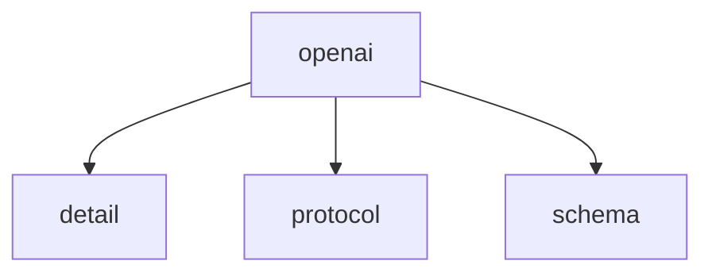

# Namespace `clore::net::openai`

## Summary

The `clore::net::openai` namespace provides an asynchronous interface for interacting with the `OpenAI` API. Its public functions include `call_completion_async`, which initiates a completion request; two overloads of `call_llm_async`, which send prompts to a language model; and `call_structured_async`, which requests a structured response for a specified type. All functions accept a `kota::event_loop` reference for non‑blocking execution and return an integer representing a unique request identifier, allowing callers to monitor or cancel pending operations.

Architecturally, this namespace encapsulates the HTTP communication and request management for `OpenAI` services, enabling the rest of the codebase to make asynchronous API calls without blocking. The return value and parameter conventions (e.g., `int` for request context and token limits) are internal to the module, while the event loop ensures asynchronous completion is processed correctly.

## Diagram

## Subnamespaces

- [`clore::net::openai::detail`](detail/index.md)
- [`clore::net::openai::protocol`](protocol/index.md)
- [`clore::net::openai::schema`](schema/index.md)

## Functions

### `clore::net::openai::call_completion_async`

Declaration: `network/openai.cppm:755`

Definition: `network/openai.cppm:782`

Implementation: [`Module openai`](../../../../modules/openai/index.md)

The function `clore::net::openai::call_completion_async` initiates an asynchronous request to the `OpenAI` completion API. It is one of several public async call functions in the `clore::net::openai` module, alongside `call_llm_async` and `call_structured_async`.

The caller must provide an `int` argument (typically a request context identifier) and a `kota::event_loop` reference for scheduling the asynchronous operation. The function returns an `int` that serves as a unique identifier for the submitted completion request, which can be used to monitor or cancel the operation. The exact semantics of the integer parameter and return value are defined by the module's internal request management.

#### Usage Patterns

- Used to asynchronously request a text completion from an `OpenAI` model
- Called when integrating with an event loop for concurrent or non-blocking LLM inference

### `clore::net::openai::call_llm_async`

Declaration: `network/openai.cppm:759`

Definition: `network/openai.cppm:789`

Implementation: [`Module openai`](../../../../modules/openai/index.md)

The function `clore::net::openai::call_llm_async` provides an asynchronous interface for sending a prompt to an `OpenAI` language model. Callers supply two `std::string_view` arguments (interpreted as the system and user prompts), an `int` value that controls a request-level setting (such as token limit or temperature), and a `kota::event_loop` reference that will manage the asynchronous lifecycle. The function returns an `int` that acts as a unique identifier for the pending request; this identifier may be used later for cancellation or status queries. The operation is non‑blocking: the caller retains ownership of the prompt strings until the event loop signals completion.

#### Usage Patterns

- called with model identifier, system prompt, prompt request, and event loop
- returns a task that resolves to a string or `LLMError`

### `clore::net::openai::call_llm_async`

Declaration: `network/openai.cppm:765`

Definition: `network/openai.cppm:800`

Implementation: [`Module openai`](../../../../modules/openai/index.md)

The function `clore::net::openai::call_llm_async` initiates an asynchronous call to an `OpenAI`‑compatible large language model. The caller provides the model identifier, the user message, an optional system message, and a reference to a `kota::event_loop` for dispatching the asynchronous operation. The function returns an `int` handle that can be used with `clore::net::openai::call_completion_async` to await the completion of the request. The caller is responsible for ensuring the `kota::event_loop` remains active until the call completes.

#### Usage Patterns

- Asynchronously invoke an LLM model with a system prompt and user prompt
- Integrate with `kota::event_loop` for non-blocking operation
- Wrap lower-level LLM call with error handling via `.or_fail()`

### `clore::net::openai::call_structured_async`

Declaration: `network/openai.cppm:772`

Definition: `network/openai.cppm:812`

Implementation: [`Module openai`](../../../../modules/openai/index.md)

The template function `call_structured_async` initiates an asynchronous request to the `OpenAI` API to obtain a structured response of template type `T`. It accepts three `std::string_view` arguments that specify the model, a system message, and a user message, along with a reference to a `kota::event_loop`. The function returns an `int` acting as a unique identifier for the pending operation. The caller must ensure that the event loop is active so that the asynchronous completion can be processed, and is responsible for supplying the correct structured type `T` that matches the expected response format.

#### Usage Patterns

- used to request structured output from an `OpenAI` model asynchronously
- called by higher-level functions when a typed response is required from the language model

## Related Pages

- [Namespace clore::net](../index.md)
- [Namespace clore::net::openai::detail](detail/index.md)
- [Namespace clore::net::openai::protocol](protocol/index.md)
- [Namespace clore::net::openai::schema](schema/index.md)

