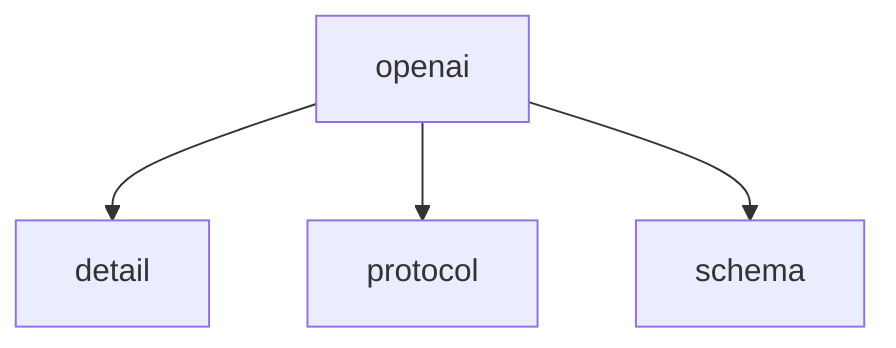

# Namespace `clore::net::openai`

## Summary

The `clore::net::openai` namespace provides a set of asynchronous C++ interfaces for interacting with `OpenAI`-compatible API endpoints. It exposes three core functions—`call_structured_async`, `call_llm_async`, and `call_completion_async`—each of which accepts a `kota::event_loop` reference to drive the operation and returns an integer representing a pending request identifier. These functions abstract the underlying HTTP requests and response parsing, allowing callers to initiate structured data extraction, language model completions, or free-form text completions without managing network details. Architecturally, the namespace serves as a thin, event‑loop‑aware client layer that maps `OpenAI` API concepts (system prompts, user prompts, model names, token limits) to asynchronous C++ workflows, leaving the caller responsible for ensuring the event loop remains active until each request completes.

## Diagram

```mermaid
graph TD
    NS["openai"]
    NSC0["detail"]
    NS --> NSC0
    NSC1["protocol"]
    NS --> NSC1
    NSC2["schema"]
    NS --> NSC2
```

## Subnamespaces

- [`clore::net::openai::detail`](detail/index.md)
- [`clore::net::openai::protocol`](protocol/index.md)
- [`clore::net::openai::schema`](schema/index.md)

## Functions

### `clore::net::openai::call_completion_async`

Declaration: `src/network/openai.cppm:765`

Definition: `src/network/openai.cppm:792`

Implementation: [`Module openai`](../../../../modules/openai/index.md)

`clore::net::openai::call_completion_async` initiates an asynchronous request to the `OpenAI` completion endpoint. The caller provides an integer identifier (typically representing a model or configuration slot) and a reference to a `kota::event_loop` that will drive the asynchronous operation. The function returns an integer that can be used to track or cancel the pending request. This is a core entry point for sending a text completion prompt to the `OpenAI` API without structured output schema enforcement.

#### Usage Patterns

- Used to asynchronously obtain a `CompletionResponse` for `OpenAI` completions
- Called with a constructed `CompletionRequest` and an event loop
- Part of a family of async `OpenAI` call functions (`call_structured_async`, `call_llm_async`)

### `clore::net::openai::call_llm_async`

Declaration: `src/network/openai.cppm:769`

Definition: `src/network/openai.cppm:799`

Implementation: [`Module openai`](../../../../modules/openai/index.md)

The function `clore::net::openai::call_llm_async` initiates an asynchronous request to an `OpenAI`‑compatible language model. It accepts a system prompt, a user prompt, a maximum token count (as an `int`), and a `kota::event_loop` reference, returning an `int` that serves as a request identifier for later completion handling. The caller is responsible for providing valid strings, a non‑negative token limit, and a running event loop that will dispatch the response. Overloads exist that replace the integer token limit with a third string parameter for structured output or additional configuration.

#### Usage Patterns

- Used to asynchronously call an LLM from within an event-loop-based async context.
- Typically awaited to obtain the model's text response.

### `clore::net::openai::call_llm_async`

Declaration: `src/network/openai.cppm:775`

Definition: `src/network/openai.cppm:810`

Implementation: [`Module openai`](../../../../modules/openai/index.md)

Callers use `clore::net::openai::call_llm_async` to initiate an asynchronous request to an `OpenAI`-compatible large language model. The function accepts a system prompt, a user message, and a model identifier, each as `std::string_view`, along with a `kota::event_loop &` that drives the asynchronous completion. It returns an `int` that uniquely identifies the pending request, allowing the caller to track or cancel the operation. The caller is responsible for ensuring the event loop remains alive until the request completes or is cancelled.

#### Usage Patterns

- Entry point for asynchronous LLM calls with default protocol
- Part of overloaded set including `call_structured_async` and `call_completion_async`

### `clore::net::openai::call_structured_async`

Declaration: `src/network/openai.cppm:782`

Definition: `src/network/openai.cppm:822`

Implementation: [`Module openai`](../../../../modules/openai/index.md)

The template function `clore::net::openai::call_structured_async` initiates an asynchronous request to the `OpenAI` API and returns an integer that represents a pending operation handle. The caller must supply three `std::string_view` arguments—typically a system prompt, a user prompt, and a model identifier—along with a `kota::event_loop` that will drive the asynchronous workflow. The template parameter `T` specifies the target structured type into which the response is expected to be parsed, establishing a contract that the API output conforms to that type. The caller is responsible for ensuring that the event loop remains active until the operation completes and for interpreting the returned integer as a contextual identifier for the in-flight request.

#### Usage Patterns

- Used in async contexts requiring structured output from an LLM
- Called with a concrete `T` type for type-safe parsing
- Wraps the more general `clore::net::call_structured_async` for `OpenAI`-specific protocol

## Related Pages

- [Namespace clore::net](../index.md)
- [Namespace clore::net::openai::detail](detail/index.md)
- [Namespace clore::net::openai::protocol](protocol/index.md)
- [Namespace clore::net::openai::schema](schema/index.md)

