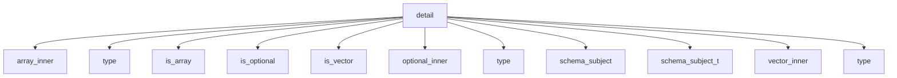

# Namespace `clore::net::openai::schema::detail`

## Summary

The `clore::net::openai::schema::detail` namespace is an internal implementation layer that provides the core type‑level metaprogramming and runtime utilities for constructing and validating `OpenAI`‑compatible JSON schemas from C++ types. Key type traits such as `is_vector`, `is_optional`, `is_array` and their corresponding compile‑time variables (`is_vector_v`, `is_optional_v`, `is_array_v`) are defined here, along with inner‑type extractors (`vector_inner`, `optional_inner`, `array_inner`) and the combined `schema_subject` trait and `schema_subject_t` alias that recursively strips container wrappers to reveal the underlying subject type. The namespace also hosts validation functions (`validate_openai_schema`, `validate_openai_schema_value`, `validate_required_properties`, `validate_schema_array_of_types`), schema construction helpers (`make_schema_object`, `make_any_of_schema`, `make_scalar_type_schema`, `make_schema_value`, `populate_object_schema`), and utilities like `sanitize_schema_name`. Architecturally, this detail namespace encapsulates the intricate type introspection and schema generation logic, offering a stable interface for higher‑level schema facilities while keeping the implementation details hidden from public API consumers.

## Diagram

## Types

### `clore::net::openai::schema::detail::array_inner`

Declaration: `network/schema.cppm:72`

Implementation: [`Module schema`](../../../../../../modules/schema/index.md)

The struct `clore::net::openai::schema::detail::array_inner` is a template trait used to extract the element type from a `std::array` specialization. Its primary specialization is defined for `std::array<T, N>`, exposing a nested alias `type` that resolves to the element type `T`. This trait works alongside related traits such as `vector_inner` and `optional_inner` to recursively deduce the innermost contained type of various standard containers, enabling consistent type handling within schema generation logic.

### `clore::net::openai::schema::detail::is_array`

Declaration: `network/schema.cppm:63`

Definition: `network/schema.cppm:63`

Implementation: [`Module schema`](../../../../../../modules/schema/index.md)

`clore::net::openai::schema::detail::is_array` is a template type trait that determines whether a given type `T` represents an array-like container. It belongs to the internal schema detail utilities, which collectively handle runtime introspection of C++ types for `OpenAI`‑compatible JSON schema generation. This trait is typically used alongside similar traits such as `is_vector` and `is_optional` to dispatch custom handling for array, vector, and optional types during schema construction. Specializations or derived traits may leverage `is_array` to conditionally extract inner element types or to select appropriate serialization logic for array-structured data.

#### Invariants

- The primary template defines `value` as `false`.
- Only specializations can change the boolean value.

#### Key Members

- Base class `std::false_type`
- Inherited member `value` (static constexpr bool)

#### Usage Patterns

- Used in compile-time type checking, e.g., with `std::enable_if`.
- Expected to be specialized for array types to enable or disable template overloads.

### `clore::net::openai::schema::detail::is_optional`

Declaration: `network/schema.cppm:23`

Definition: `network/schema.cppm:23`

Implementation: [`Module schema`](../../../../../../modules/schema/index.md)

The template struct `clore::net::openai::schema::detail::is_optional` is a compile-time type trait used in the `OpenAI` schema generation internals. It determines whether a given type `T` represents an optional (nullable) type, such as `std::optional`. This trait is part of a set of metaprogramming utilities—alongside `is_vector`, `is_array`, `optional_inner`, and `schema_subject`—that inspect and extract type information for accurate JSON Schema generation.

When `is_optional<T>` evaluates to true, the schema generator can treat the type as nullable, producing an `optional` schema property or wrapping the underlying type in an `anyOf` or `oneOf` with a `null` type. It is a detail-level helper, not intended for direct use outside the schema building machinery.

#### Invariants

- Primary template always yields `value == false`
- Specializations must be consistent with the detected optional type
- Inheritance from `std::false_type` implies `value` is a compile-time constant

#### Key Members

- `T` template parameter representing the type to test
- Inherited `value` static constexpr bool member

#### Usage Patterns

- Used in SFINAE or `if constexpr` to conditionally handle optional types
- Specialized for `std::optional` to enable `value == true`
- Consulted by serialization or conversion utilities to determine null handling

### `clore::net::openai::schema::detail::is_vector`

Declaration: `network/schema.cppm:43`

Definition: `network/schema.cppm:43`

Implementation: [`Module schema`](../../../../../../modules/schema/index.md)

The template struct `clore::net::openai::schema::detail::is_vector` is a type trait that detects whether a given type `T` is a specialization of `std::vector`. It is used internally within the `OpenAI` schema generation machinery to distinguish vector types from other container types such as `std::array` and `std::optional`. Its primary role is to guide compile-time branching, enabling the schema builder to handle vector‑like types uniformly—for instance, by extracting the element type via the associated `vector_inner` trait or by selecting appropriate serialisation logic.

#### Invariants

- `is_vector<T>::value` is `false` for all types `T` in the primary template
- The struct is trivially constructible and destructible

#### Key Members

- Inherited `value` from `std::false_type` (static constexpr bool)

#### Usage Patterns

- Used as a type trait to detect vector types via template specialization
- Employed in template metaprogramming for conditional logic

### `clore::net::openai::schema::detail::optional_inner`

Declaration: `network/schema.cppm:32`

Implementation: [`Module schema`](../../../../../../modules/schema/index.md)

The struct template `clore::net::openai::schema::detail::optional_inner` is a type transformation helper used to extract the inner value type from a `std::optional` wrapper. When instantiated with a type that is a `std::optional<U>`, its `::type` alias exposes `U`, allowing downstream schema generation to treat the optional container transparently by operating on the underlying value type directly. This struct works in concert with similar utilities such as `array_inner` and `vector_inner` to uniformly unwrap common standard library wrappers during compile‑time reflection of `OpenAI` API types. It is intended for use through its `::type` member and forms part of the `detail` namespace’s type‑level metaprogramming layer, which supports the higher‑level `schema_subject` and `schema_subject_t` facilities in mapping C++ types to `OpenAI` schema representations.

### `clore::net::openai::schema::detail::schema_subject`

Declaration: `network/schema.cppm:83`

Definition: `network/schema.cppm:83`

Implementation: [`Module schema`](../../../../../../modules/schema/index.md)

`schema_subject` is a template struct that resolves the underlying, non‑container type for a given type `T`. It strips away standard library wrappers such as `std::vector`, `std::optional`, and `std::array` by leveraging related utility traits and inner type aliases (`vector_inner`, `optional_inner`, `array_inner`, `is_vector`, `is_optional`, `is_array`). The resulting subject type is exposed through the alias `schema_subject_t`, and is used internally by the schema generation machinery to identify the core type that a JSON Schema description should represent, regardless of how many levels of container nesting are present.

#### Invariants

- The `type` member always yields the decayed type without cv-ref qualifiers.
- The struct is trivially constructible and empty.

#### Key Members

- `using type = std::remove_cvref_t<T>`

#### Usage Patterns

- Used to obtain a canonical type from possibly qualified types.
- Likely used in type traits or metaprogramming contexts within the namespace.

### `clore::net::openai::schema::detail::schema_subject_t`

Declaration: `network/schema.cppm:95`

Implementation: [`Module schema`](../../../../../../modules/schema/index.md)

The type alias template `clore::net::openai::schema::detail::schema_subject_t` is a type alias defined within the internal `detail` namespace of the `OpenAI` schema module. It is used to resolve the underlying subject type from a given type `T` during schema generation, typically stripping away wrapper containers such as `std::vector`, `std::optional`, or `std::array`. This alias works in conjunction with helper traits like `vector_inner`, `optional_inner`, and `array_inner` to extract the element type that the schema ultimately describes.

The alias is intended for use by the schema‑generation machinery to determine the correct JSON schema representation. It allows the code to work uniformly with types that may be nested inside standard containers, ensuring that the subject of the schema (the value type) is identified before producing the schema definition.

#### Invariants

- The alias is only valid for types `T` for which `schema_subject<T>` has a visible specialization defining a `type` member.
- The resolved type must be a valid type; otherwise, compilation fails.

#### Key Members

- `schema_subject<T>` trait class
- `::type` nested type alias

#### Usage Patterns

- Used to obtain the subject type of a schema type without requiring `typename`.
- Likely used in template metaprogramming to constrain or transform types based on schema definitions.

### `clore::net::openai::schema::detail::vector_inner`

Declaration: `network/schema.cppm:52`

Implementation: [`Module schema`](../../../../../../modules/schema/index.md)

The template struct `clore::net::openai::schema::detail::vector_inner` is a type trait that extracts the value type from a `std::vector` specialization. It defines a member type alias `type` which, for `std::vector<T, Allocator>`, resolves to `T`. This trait is used internally within the schema generation framework to decompose container types and obtain their element types for further type processing or schema generation.

## Variables

### `clore::net::openai::schema::detail::is_array_v`

Declaration: `network/schema.cppm:69`

Implementation: [`Module schema`](../../../../../../modules/schema/index.md)

A template variable `clore::net::openai::schema::detail::is_array_v` declared as `template<typename T> constexpr bool is_array_v` at `network/schema.cppm:69`. It is a compile-time boolean constant that likely indicates whether the type `T` is an array type, used within the schema detail metaprogramming infrastructure.

#### Usage Patterns

- Used as a compile-time type trait to check if a type is an array
- Referenced in template metaprogramming for schema generation logic

### `clore::net::openai::schema::detail::is_optional_v`

Declaration: `network/schema.cppm:29`

Implementation: [`Module schema`](../../../../../../modules/schema/index.md)

Template variable `clore::net::openai::schema::detail::is_optional_v` is a compile-time constant of type `bool`, declared at line 29 in `network/schema.cppm`. It is likely used as a type trait to determine whether a given type `T` represents an optional type (e.g., `std::optional`).

### `clore::net::openai::schema::detail::is_vector_v`

Declaration: `network/schema.cppm:49`

Implementation: [`Module schema`](../../../../../../modules/schema/index.md)

`clore::net::openai::schema::detail::is_vector_v` is a `constexpr` boolean template variable, likely used as a type trait to detect whether a given type is a vector.

#### Usage Patterns

- type trait detection
- compile-time conditional branching

## Functions

### `clore::net::openai::schema::detail::make_any_of_schema`

Declaration: `network/schema.cppm:156`

Definition: `network/schema.cppm:156`

Implementation: [`Module schema`](../../../../../../modules/schema/index.md)

The template function `clore::net::openai::schema::detail::make_any_of_schema` is responsible for constructing a JSON schema fragment that represents an `anyOf` composition. It is a building block within the internal schema‑generation pipeline and is intended to be invoked by other schema‑creation facilities in the `detail` namespace. Callers must supply the necessary integer arguments (likely conveying schema type identifiers or option counts) and will receive an `int` result, presumably indicating success or failure. As a `detail` function, its contract is internal to the library and should not be relied upon directly by user code.

#### Usage Patterns

- Called to wrap multiple schema alternatives into a single `anyOf` schema
- Used in template metaprogramming for generating union type schemas

### `clore::net::openai::schema::detail::make_scalar_type_schema`

Declaration: `network/schema.cppm:146`

Definition: `network/schema.cppm:146`

Implementation: [`Module schema`](../../../../../../modules/schema/index.md)

The template function `clore::net::openai::schema::detail::make_scalar_type_schema` is responsible for generating and registering an `OpenAPI` schema object that represents a scalar data type (such as a string, number, or boolean). The caller supplies a type parameter `T` (which should model a scalar concept in the schema framework) and a `std::string_view` that identifies the schema (typically a name or type string). The function returns an `int` value: a non‑negative identifier for the resulting schema on success, or a negative error code on failure. This function is part of the internal schema construction logic and is intended for use by other schema‑building utilities within the `detail` namespace.

#### Usage Patterns

- used to generate schema entries for scalar types
- called when the element being schematized is a primitive

### `clore::net::openai::schema::detail::make_schema_object`

Declaration: `network/schema.cppm:132`

Definition: `network/schema.cppm:132`

Implementation: [`Module schema`](../../../../../../modules/schema/index.md)

The template function `clore::net::openai::schema::detail::make_schema_object` generates an `OpenAI`‑compatible schema object for the type `T` supplied by the caller. It returns an integer handle that uniquely identifies the constructed schema within the session; the caller can subsequently use this handle when building or validating other schema structures (for example, when populating a JSON object schema via `populate_object_schema` or validating a schema value with `validate_openai_schema`). The exact form of the returned integer is an implementation detail, but the contract guarantees that a valid, non‑negative value corresponds to a successfully created schema for `T`.

#### Usage Patterns

- Called to generate the top-level JSON schema object for a type `T`
- Used in the schema creation pipeline, often after validation

### `clore::net::openai::schema::detail::make_schema_value`

Declaration: `network/schema.cppm:129`

Definition: `network/schema.cppm:225`

Implementation: [`Module schema`](../../../../../../modules/schema/index.md)

The template function `clore::net::openai::schema::detail::make_schema_value` generates or retrieves an integer identifier representing the JSON Schema value for the given type `T`. This identifier can be used as a handle in subsequent schema construction operations, such as assembling object schemas or validating property references. Callers must supply a type `T` that is supported by the schema system; behavior for unsupported types may result in errors or undefined outcomes.

#### Usage Patterns

- main entry for generating JSON schema from a type
- recursively called for nested types inside optional, vector, array
- used in higher-level schema generation functions

### `clore::net::openai::schema::detail::populate_object_schema`

Declaration: `network/schema.cppm:173`

Definition: `network/schema.cppm:173`

Implementation: [`Module schema`](../../../../../../modules/schema/index.md)

The function `populate_object_schema` is responsible for populating a given JSON object with the schema representation of an `OpenAPI` object type. It accepts a mutable reference to a `json::Object` and an integer parameter (likely an initial state or index), and returns an integer that indicates the outcome (such as the number of properties populated). The caller is expected to provide a valid, modifiable `json::Object` and an appropriate integer argument. As a `detail` function, it is intended for internal use within the schema generation pipeline and is not part of the public API.

#### Usage Patterns

- called during automatic `OpenAI` schema generation for structured tool calls
- used with a compile-time `std::index_sequence` from the object's field count

### `clore::net::openai::schema::detail::sanitize_schema_name`

Declaration: `network/schema.cppm:97`

Definition: `network/schema.cppm:97`

Implementation: [`Module schema`](../../../../../../modules/schema/index.md)

The function `clore::net::openai::schema::detail::sanitize_schema_name` accepts a `std::string_view` representing a candidate schema name and returns a `std::string` that is a sanitized version suitable for use in an `OpenAI` schema. Its primary responsibility is to ensure that the resulting name adheres to the naming constraints required by the schema system, typically by removing or replacing invalid characters.

As a detail-level utility, this function is called during schema construction and validation to produce a clean, valid identifier from an arbitrary input string. The caller is expected to provide any string that needs to be conformed, and the returned value is guaranteed to be a safe schema name. No error conditions are raised; the function always returns a valid string.

#### Usage Patterns

- Sanitizing schema names for identifier generation
- Converting arbitrary input strings to valid identifiers

### `clore::net::openai::schema::detail::schema_type_name`

Declaration: `network/schema.cppm:120`

Definition: `network/schema.cppm:120`

Implementation: [`Module schema`](../../../../../../modules/schema/index.md)

The function template `clore::net::openai::schema::detail::schema_type_name` is a caller-facing utility that maps a compile-time C++ type `T` to a corresponding integer identifier representing its `OpenAI` schema type name. It returns a predefined integer constant that uniquely identifies the schema type associated with `T`, enabling consistent type-based dispatch within the schema generation infrastructure. The caller must ensure that `T` is a type for which a schema type name mapping is defined; the function provides no fallback or runtime validation.

#### Usage Patterns

- used by other schema detail functions to derive `OpenAPI` type names from C++ types
- invoked in `make_scalar_type_schema` and similar conversion functions

### `clore::net::openai::schema::detail::validate_openai_schema`

Declaration: `network/schema.cppm:328`

Definition: `network/schema.cppm:373`

Implementation: [`Module schema`](../../../../../../modules/schema/index.md)

Validates the structure and semantics of an `OpenAI` schema provided as a JSON object. The function checks conformance to expected schema patterns, reporting the number of validation errors found (a non‑zero return value indicates at least one issue). The caller supplies a schema name via `std::string_view` for use in error messages, and a `bool` flag that controls whether strictly required properties are enforced. This function is part of the internal validation machinery and is typically called after the schema has been parsed into a `json::Object`.

#### Usage Patterns

- called to validate a schema before registration or API call
- used in schema generation pipeline to ensure compliance

### `clore::net::openai::schema::detail::validate_openai_schema_value`

Declaration: `network/schema.cppm:331`

Definition: `network/schema.cppm:331`

Implementation: [`Module schema`](../../../../../../modules/schema/index.md)

The function `clore::net::openai::schema::detail::validate_openai_schema_value` validates a single JSON value against `OpenAI` schema constraints. The caller supplies a `const json::Value &` representing the value to check, a `std::string_view` serving as a contextual label or path for error reporting, and a `bool` flag that controls validation strictness (for example, whether to enforce optional constraints). It returns an `int` that indicates the validation outcome—typically a count of violations or a zero for a fully compliant value. The function is a building block for higher‑level schema validation routines and focuses on value‑level rules rather than structural schema construction.

#### Usage Patterns

- Called to validate a schema represented as a JSON value
- Used when the input is not already a known object reference
- Part of the validation pipeline for `OpenAI` schema endpoints

### `clore::net::openai::schema::detail::validate_openai_schema_value`

Declaration: `network/schema.cppm:340`

Definition: `network/schema.cppm:340`

Implementation: [`Module schema`](../../../../../../modules/schema/index.md)

The function `clore::net::openai::schema::detail::validate_openai_schema_value` validates a given JSON value—represented as a `json::Cursor`—against an internal `OpenAI` schema definition. The caller supplies a `std::string_view` identifying the schema or context for validation, along with a `bool` flag that controls the validation mode (for example, whether to enforce required properties). The function returns an `int` status code that indicates the result of the validation (such as success or specific error conditions). This is an internal helper used by higher-level schema validation routines, and it assumes that the provided cursor points to a well-formed JSON value that can be interpreted according to the caller-identified schema constraints.

#### Usage Patterns

- Used to validate a JSON value against `OpenAI` schema starting from a cursor
- Called internally during schema validation pipeline

### `clore::net::openai::schema::detail::validate_required_properties`

Declaration: `network/schema.cppm:349`

Definition: `network/schema.cppm:349`

Implementation: [`Module schema`](../../../../../../modules/schema/index.md)

The function `clore::net::openai::schema::detail::validate_required_properties` validates that all properties declared as required by an `OpenAI` schema are present and correctly specified. It accepts three arguments: two `int` values representing the property count and a validation flag or index, and a `std::string_view` identifying the schema or context name. The function returns an `int` indicating the number of validation errors encountered (or a non‑negative success code). Callers must ensure the provided parameters correspond to a valid schema object; the function does not modify the schema and is intended to be invoked during the overall schema validation pipeline.

#### Usage Patterns

- Used in `OpenAI` schema validation pipeline
- Called to enforce required property lists in structured output schemas

### `clore::net::openai::schema::detail::validate_schema_array_of_types`

Declaration: `network/schema.cppm:295`

Definition: `network/schema.cppm:295`

Implementation: [`Module schema`](../../../../../../modules/schema/index.md)

The function `clore::net::openai::schema::detail::validate_schema_array_of_types` validates a JSON array that is expected to contain valid type specifiers for an `OpenAPI` schema. It checks that each element of the array is a recognized type name and meets the schema’s type constraints in the given context. The caller provides the array to validate, a string view for constructing error messages (typically a JSON pointer or path), and a boolean flag that controls validation strictness (e.g., whether to allow extensions or enforce a fixed set of types). The function returns an integer representing the number of validation errors found; a return of zero indicates that the array is valid. This function is called during the internal schema validation pipeline and is not intended for direct use outside of schema validation logic.

#### Usage Patterns

- called from `validate_openai_schema` when handling an array type
- used to validate type union constraints in schema definitions

## Related Pages

- [Namespace clore::net::openai::schema](../index.md)

