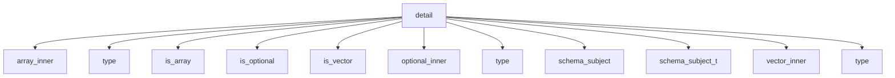

# Namespace `clore::net::openai::schema::detail`

## Summary

This namespace provides the internal implementation details for `OpenAI` schema construction, validation, and type introspection. It is not intended for direct consumption by library users but serves as the backbone for higher-level schema generation routines. Notable declarations include validation functions such as `validate_openai_schema` and `validate_openai_schema_value`, which verify JSON structures against expected schema constraints, and construction functions like `make_schema_object` and `make_schema_value` that map C++ types to JSON Schema objects. The namespace also houses a suite of type traits—including `is_array`, `is_vector`, `is_optional`, and their associated inner-type extractors (`array_inner`, `vector_inner`, `optional_inner`)—and utility functions such as `sanitize_schema_name`. Together, these components form the essential machinery for automatically deriving and validating `OpenAI`‑compatible schemas from C++ type definitions.

## Diagram

## Types

### `clore::net::openai::schema::detail::array_inner`

Declaration: `network/schema.cppm:72`

Implementation: [`Module schema`](../../../../../../modules/schema/index.md)

The template struct `clore::net::openai::schema::detail::array_inner` is a type trait that extracts the element type from an array-like container. It is part of the internal implementation in the `clore::net::openai::schema::detail` namespace, likely used to deduce the inner type for schema generation. A specialization exists for `std::array<U, N>`, where the nested `type` alias corresponds to `U`, the array's element type. This trait complements similar helpers such as `vector_inner` and `optional_inner`, which handle `std::vector` and `std::optional` respectively.

### `clore::net::openai::schema::detail::is_array`

Declaration: `network/schema.cppm:63`

Definition: `network/schema.cppm:63`

Implementation: [`Module schema`](../../../../../../modules/schema/index.md)

The template struct `clore::net::openai::schema::detail::is_array` is a type trait used to determine whether a given type `T` represents an array. It supports both standard library containers such as `std::array` and possibly C-style arrays, integrating with other detail-level traits like `is_vector` and `is_optional` to classify types for schema generation. Its primary role is to enable compile-time introspection of array types within the `OpenAI` schema mapping machinery, guiding how such types are transformed into schema definitions.

#### Invariants

- Primary template always yields `false` for the `value` member
- Inherits from `std::false_type`, not `std::integral_constant` directly
- Template parameter `T` is unconstrained

#### Key Members

- Inherited `static constexpr bool value` from `std::false_type`

#### Usage Patterns

- Used as a type trait in compile-time checks for array types
- Likely specialized for array forms (e.g., `T[]`, `T[N]`) to enable SFINAE or `enable_if` conditions

### `clore::net::openai::schema::detail::is_optional`

Declaration: `network/schema.cppm:23`

Definition: `network/schema.cppm:23`

Implementation: [`Module schema`](../../../../../../modules/schema/index.md)

`clore::net::openai::schema::detail::is_optional` is a template struct that serves as a type trait for detecting whether a given type `T` is a specialization of `std::optional`. It is part of the internal implementation details within the `OpenAI` schema module and is used alongside other traits such as `is_vector` and `is_array` to classify schema‑related types. This trait enables compile‑time decisions about how to handle optional fields during schema generation, serialization, or other type‑based operations. Because it resides in the `detail` namespace, it is not intended for direct use by library consumers.

#### Invariants

- Inherits from `std::false_type`
- Member `value` is always `false` for the primary template
- Member `type` is `std::false_type`

#### Key Members

- Inherited constant `is_optional<T>::value`
- Inherited type `is_optional<T>::type`

#### Usage Patterns

- Used as a default trait in generic code that checks whether a type is optional
- Expected to be specialized for `std::optional` and similar wrapper types

### `clore::net::openai::schema::detail::is_vector`

Declaration: `network/schema.cppm:43`

Definition: `network/schema.cppm:43`

Implementation: [`Module schema`](../../../../../../modules/schema/index.md)

The template struct `clore::net::openai::schema::detail::is_vector` is a compile-time type trait that detects whether a given type is a specialization of `std::vector`. It yields a boolean value (`true` or `false`) and is used internally within the schema generation logic to distinguish vector types from other container types, such as `std::array` or `std::optional`. Like its sibling traits `is_array` and `is_optional`, `is_vector` is part of the `detail` namespace and is not intended for direct use by client code; instead, it supports higher-level schema introspection and serialization mechanisms.

#### Invariants

- Always provides a `value` member constant of type `bool` (inherited from `std::false_type`).
- The primary template unconditionally declares `value == false`.

#### Key Members

- Inherited member `value` (static constexpr bool).
- Inherited member `type` (alias for `std::false_type`).

#### Usage Patterns

- Used within the `clore::net::openai::schema::detail` namespace as a type trait to distinguish vectors from other types.
- Expected to be specialized for `std::vector` to enable compile-time branching on whether a type is a vector.

### `clore::net::openai::schema::detail::optional_inner`

Declaration: `network/schema.cppm:32`

Implementation: [`Module schema`](../../../../../../modules/schema/index.md)

The template struct `clore::net::openai::schema::detail::optional_inner` is a metafunction that extracts the wrapped type from a `std::optional<T>`. It is part of a set of type traits within the schema detail namespace used to decompose complex types (such as `std::optional`, `std::vector`, `std::array`) into their inner element types for the purpose of generating or retrieving an `OpenAPI` schema representation.

This struct is typically instantiated with a specialization for `std::optional<U>`, exposing a nested `type` alias equal to `U`. It is employed by higher-level schema traits like `schema_subject_t` or `is_optional` to determine the underlying type of an optional parameter or to recursively resolve schema descriptions for optional fields.

#### Invariants

- No invariants are evident from the provided source snippets.

#### Key Members

- No key members are evident from the provided source snippets.

#### Usage Patterns

- No usage patterns are evident from the provided source snippets.

### `clore::net::openai::schema::detail::schema_subject`

Declaration: `network/schema.cppm:83`

Definition: `network/schema.cppm:83`

Implementation: [`Module schema`](../../../../../../modules/schema/index.md)

The `clore::net::openai::schema::detail::schema_subject` struct is a template metafunction that extracts the fundamental subject type from a given type `T`. It is used internally to determine the actual schema-relevant type when `T` is a wrapper such as `std::vector`, `std::optional`, or `std::array`. By examining traits like `is_vector`, `is_optional`, and `is_array`, it peels away container or optional layers to reveal the inner element or value type. The result is typically exposed via the alias `schema_subject_t`, which provides the final subject type for schema generation.

#### Invariants

- The `type` alias is always `std::remove_cvref_t<T>`.
- The struct has no other members or methods.
- The template parameter `T` must be a complete type for alias resolution (though this is typical for type traits).

#### Key Members

- `type` alias

#### Usage Patterns

- Used internally to obtain the canonical type of a schema subject.
- Likely employed in template metaprogramming to normalize types before schema generation.

### `clore::net::openai::schema::detail::schema_subject_t`

Declaration: `network/schema.cppm:95`

Implementation: [`Module schema`](../../../../../../modules/schema/index.md)

The `schema_subject_t` type alias is a template alias defined within the `detail` namespace. It is used to extract the underlying subject type from common wrapper types encountered in schema definitions, such as `std::optional`, `std::vector`, and `std::array`. The alias resolves to the inner type contained within these wrappers, effectively unwrapping one level of indirection. It is typically employed in conjunction with type traits like `is_optional`, `is_vector`, and related inner traits (`optional_inner`, `vector_inner`, `array_inner`) to conditionally compute the actual type that a schema field represents. This enables generic code to handle optional and container types uniformly when processing JSON schema structures.

#### Invariants

- The type `schema_subject_t<T>` is well-defined only if `schema_subject<T>` is a complete type with an accessible `type` member.
- The alias does not constrain the set of types `T` for which it is valid; validity is determined by the specialization of `schema_subject`.

#### Key Members

- The nested `type` alias in `schema_subject<T>`
- The alias template `schema_subject_t<T>` itself

#### Usage Patterns

- Used wherever the subject type of a schema for a given type `T` needs to be referenced.
- Often appears in return types or template arguments of other traits and utilities within the `detail` namespace.

### `clore::net::openai::schema::detail::vector_inner`

Declaration: `network/schema.cppm:52`

Implementation: [`Module schema`](../../../../../../modules/schema/index.md)

The `clore::net::openai::schema::detail::vector_inner` struct is a template metafunction that extracts the element type from a `std::vector` specialization. It is defined with a single template parameter `T` and provides a `::type` alias equivalent to the vector’s value type. This trait is part of the schema detail utility set, working alongside similar helpers like `optional_inner` and `array_inner`, to normalize container types during automatic schema generation. By decomposing a vector into its inner type, it enables downstream traits such as `schema_subject` to determine the appropriate schema representation for the contained elements.

#### Usage Patterns

- Used internally by the `clore::net::openai::schema` module as a building block for vector schema types.
- Templated on the inner element type `T`, likely to allow type-safe representation of vector elements in the schema.

## Variables

### `clore::net::openai::schema::detail::is_array_v`

Declaration: `network/schema.cppm:69`

Implementation: [`Module schema`](../../../../../../modules/schema/index.md)

The variable `clore::net::openai::schema::detail::is_array_v` is a `constexpr` `bool` template variable that indicates whether a given type `T` is an array type.

### `clore::net::openai::schema::detail::is_optional_v`

Declaration: `network/schema.cppm:29`

Implementation: [`Module schema`](../../../../../../modules/schema/index.md)

`clore::net::openai::schema::detail::is_optional_v` is a `constexpr bool` variable template declared in the `clore::net::openai::schema::detail` namespace. It serves as a compile-time trait to determine whether a given type `T` should be considered optional, typically mirroring the semantics of `std::optional`. The declaration appears at line 29 in the module `network/schema.cppm`.

### `clore::net::openai::schema::detail::is_vector_v`

Declaration: `network/schema.cppm:49`

Implementation: [`Module schema`](../../../../../../modules/schema/index.md)

The variable `clore::net::openai::schema::detail::is_vector_v` is a compile-time constant template boolean that indicates whether a given type `T` is a vector type. It is declared at `network/schema.cppm:49` and is part of a suite of type traits used for schema introspection.

#### Usage Patterns

- checked in template conditional branches
- used as a type trait in `enable_if` or `if constexpr`
- referenced alongside traits like `is_optional_v` and `is_array_v`

## Functions

### `clore::net::openai::schema::detail::make_any_of_schema`

Declaration: `network/schema.cppm:156`

Definition: `network/schema.cppm:156`

Implementation: [`Module schema`](../../../../../../modules/schema/index.md)

`clore::net::openai::schema::detail::make_any_of_schema` is a function template that constructs an `OpenAPI` schema representing an `anyOf` constraint for a given type. The caller provides a type `T` via the template argument, and the function returns an integer status code indicating success or failure. The exact semantics of the return value are part of the contract: a non‑zero value typically signals an error, while zero indicates the schema was successfully built and added to the internal schema collection. This function is part of the detail‑level schema construction machinery and is intended to be invoked by higher‑level schema‑making functions when the input type requires composition via the `anyOf` keyword.

#### Usage Patterns

- Used to construct `OpenAI`-compatible `anyOf` schema objects
- Called when generating schema definitions for types with multiple alternatives
- Part of the schema construction pipeline in `clore::net::openai::schema`

### `clore::net::openai::schema::detail::make_scalar_type_schema`

Declaration: `network/schema.cppm:146`

Definition: `network/schema.cppm:146`

Implementation: [`Module schema`](../../../../../../modules/schema/index.md)

The template function `clore::net::openai::schema::detail::make_scalar_type_schema` constructs a minimal JSON Schema representation for a scalar type identified by the provided string view. It is intended to be called during schema generation from C++ types when the type is a fundamental scalar (for example, `int`, `double`, `bool`, or an enumeration). The caller passes the name of the type to be represented, and the function returns an integral status code indicating success or failure of schema creation. While the exact semantics of the return value are internal, a zero or non‑negative value typically signals a successfully created schema entry, while a negative value indicates an error condition the caller must handle.

#### Usage Patterns

- used to create JSON schema objects for scalar types like `"string"`, `"integer"`, `"boolean"`, etc.
- likely called by higher-level schema generation functions that map C++ types to `OpenAI` API schema

### `clore::net::openai::schema::detail::make_schema_object`

Declaration: `network/schema.cppm:132`

Definition: `network/schema.cppm:132`

Implementation: [`Module schema`](../../../../../../modules/schema/index.md)

The template function `clore::net::openai::schema::detail::make_schema_object` constructs a JSON schema object for the type `T`. It takes no explicit arguments; the type is specified at the call site. The function returns an `int` that serves as an identifier or handle for the created schema object, which can be used with other schema construction and validation utilities. The caller must ensure that `T` is a type for which a valid `OpenAI` schema can be generated; otherwise, the behavior is unspecified. This function is part of the internal detail layer and is not intended for direct consumption by most API users.

#### Usage Patterns

- used to generate a JSON schema object for type `T`
- called within schema generation pipeline

### `clore::net::openai::schema::detail::make_schema_value`

Declaration: `network/schema.cppm:129`

Definition: `network/schema.cppm:225`

Implementation: [`Module schema`](../../../../../../modules/schema/index.md)

The function template `clore::net::openai::schema::detail::make_schema_value<T>()` constructs a JSON Schema value representing the C++ type `T`. It returns an integer that encodes either a handle to the generated schema element or a status indicator for the construction operation. The caller is responsible for providing a type `T` that is supported by the schema generation framework; the behavior is undefined if `T` does not meet the internal requirements.

This function is intended only for use within the schema detail machinery and should not be called directly by external code. Its result is consumed by sibling functions such as `make_schema_object` and `populate_object_schema` to assemble complete schema definitions.

#### Usage Patterns

- recursively called for inner types of `std::optional`, `std::vector`, `std::array`
- used internally by other schema generation functions in the same namespace

### `clore::net::openai::schema::detail::populate_object_schema`

Declaration: `network/schema.cppm:173`

Definition: `network/schema.cppm:173`

Implementation: [`Module schema`](../../../../../../modules/schema/index.md)

This template function populates a given `json::Object` with schema metadata derived from the template parameters `Object` and `Indices`. It is part of the schema generation pipeline, invoked by higher-level schema functions to fill a JSON object structure that represents an `OpenAI` API object type. The caller must supply a mutable `json::Object` reference into which the schema properties are written, along with an `int` value that controls or tracks the population process. The function returns an `int` that communicates the outcome—typically indicating success, a count of entries, or an error code.

#### Usage Patterns

- invoked during `OpenAI` JSON schema generation for C++ types
- used with `std::index_sequence` to iterate over struct fields
- called from higher-level schema-building functions

### `clore::net::openai::schema::detail::sanitize_schema_name`

Declaration: `network/schema.cppm:97`

Definition: `network/schema.cppm:97`

Implementation: [`Module schema`](../../../../../../modules/schema/index.md)

The function `clore::net::openai::schema::detail::sanitize_schema_name` accepts a schema name as a `std::string_view` and returns a `std::string` containing a sanitized form of that name. Its responsibility is to transform the input into a string that is valid for use as an `OpenAI` schema name, typically by removing or replacing characters that are not permitted in such identifiers. The caller provides the raw name and receives a cleaned version that can be safely used when constructing schema objects.

#### Usage Patterns

- Called to sanitize schema names for use in JSON schema property names
- Replaces invalid characters with underscores before further schema processing

### `clore::net::openai::schema::detail::schema_type_name`

Declaration: `network/schema.cppm:120`

Definition: `network/schema.cppm:120`

Implementation: [`Module schema`](../../../../../../modules/schema/index.md)

The template function `clore::net::openai::schema::detail::schema_type_name` maps an arbitrary C++ type `T` to an integer constant that identifies the corresponding `OpenAI` schema type name. It is used internally by the schema generation machinery to determine the appropriate JSON Schema typing for a given type. The caller must ensure that `T` is a supported type; the returned integer is an opaque identifier whose meaning is defined within the `detail` namespace and is not intended for direct use outside of schema building components.

#### Usage Patterns

- used to generate a valid schema type name
- called by schema construction functions
- provides error handling for empty type names

### `clore::net::openai::schema::detail::validate_openai_schema`

Declaration: `network/schema.cppm:328`

Definition: `network/schema.cppm:373`

Implementation: [`Module schema`](../../../../../../modules/schema/index.md)

This function validates an `OpenAI` schema represented as a JSON object. It is the primary entry point for schema validation within the `detail` namespace, intended for callers constructing or verifying `OpenAI`-compatible schemas. The caller provides a `const json::Object &` containing the schema definition, a `std::string_view` that typically names or locates the schema, and a `bool` flag that controls whether the validation is strict (e.g., rejecting unrecognized fields). The function returns an `int`, which represents either a validated schema handle or a status code indicating success or failure.

The caller must ensure the JSON object conforms to the expected `OpenAI` schema structure. The contract does not specify error reporting details; the return value is the primary indicator of outcome. The function assumes the caller has already structured the JSON correctly and will use the result to reference the validated schema in subsequent operations.

#### Usage Patterns

- called to validate a top-level or nested `OpenAI` schema object
- used during schema construction to ensure compliance
- invoked from `validate_openai_schema_value` for recursive validation

### `clore::net::openai::schema::detail::validate_openai_schema_value`

Declaration: `network/schema.cppm:331`

Definition: `network/schema.cppm:331`

Implementation: [`Module schema`](../../../../../../modules/schema/index.md)

The function `clore::net::openai::schema::detail::validate_openai_schema_value` validates a single JSON value against an `OpenAPI` schema definition. It accepts the value to validate, a string view providing context (such as a property name or path) for error messages, and a boolean flag that controls validation behavior (e.g., strictness). The function returns an integer representing the result of validation, typically an error count or a success indicator. Callers must ensure that the provided `json::Value` is a valid schema fragment; the function does not assume ownership of the value. An overload accepting a `json::Cursor` is also provided, allowing validation from a streaming or current position within a larger JSON document.

#### Usage Patterns

- Validate a raw JSON value as an `OpenAI` schema object
- Used at the root or nested schema validation entry point

### `clore::net::openai::schema::detail::validate_openai_schema_value`

Declaration: `network/schema.cppm:340`

Definition: `network/schema.cppm:340`

Implementation: [`Module schema`](../../../../../../modules/schema/index.md)

This function validates a single JSON value against `OpenAI` schema constraints. The caller supplies the value to validate (as a `json::Cursor` or `const json::Value &`), a diagnostic context string (such as the property name or path), and a boolean flag (likely controlling strictness or optionality). The function returns an `int` result that indicates whether validation succeeded or provides a specific error code. The caller should check this return value and react appropriately, for example by reporting the error with the given context.

#### Usage Patterns

- Validating a schema value from a JSON cursor at a given path
- Used as a convenience wrapper around `validate_openai_schema` for cursor input

### `clore::net::openai::schema::detail::validate_required_properties`

Declaration: `network/schema.cppm:349`

Definition: `network/schema.cppm:349`

Implementation: [`Module schema`](../../../../../../modules/schema/index.md)

The function `clore::net::openai::schema::detail::validate_required_properties` validates that the required properties defined in an `OpenAI` schema object are present and correctly specified. It takes an integer identifier for the schema, an integer representing the count of required properties, and a `std::string_view` containing the property name (or path) being validated. The function returns an integer status indicating success or failure, typically zero for success or a non‑zero error code if validation fails. Callers should provide the correct schema index, expected property count, and property identifier, and then check the returned value to determine whether the required‑properties constraint is satisfied.

#### Usage Patterns

- called during schema validation to enforce that all properties are required
- used when constructing schemas for strict structured output mode in `OpenAI` API

### `clore::net::openai::schema::detail::validate_schema_array_of_types`

Declaration: `network/schema.cppm:295`

Definition: `network/schema.cppm:295`

Implementation: [`Module schema`](../../../../../../modules/schema/index.md)

The function `clore::net::openai::schema::detail::validate_schema_array_of_types` validates that each element in the supplied `json::Array` is a recognized schema type identifier. It is intended for internal use during the construction and validation of `OpenAI`-compatible schema definitions. The caller supplies the array to validate, a `std::string_view` providing a contextual path or name for error reporting, and a `bool` flag that controls whether validation is performed strictly or leniently. The function returns an `int` that conveys the outcome, typically indicating the number of validation errors that were detected. A return value of zero means the array was valid; a non-zero value signals that one or more entries are not acceptable schema types.

#### Usage Patterns

- called during schema validation to enforce type union constraints
- typically invoked when processing a schema's `type` field that is an array

## Related Pages

- [Namespace clore::net::openai::schema](../index.md)

