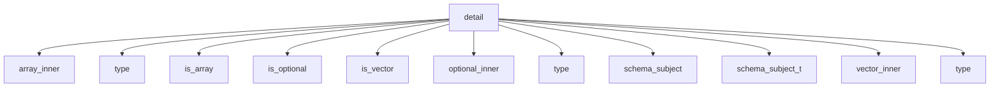

# Namespace `clore::net::openai::schema::detail`

## Summary

The `clore::net::openai::schema::detail` namespace contains the internal implementation machinery for constructing and validating `OpenAI`-compatible JSON schemas from C++ types. It provides compile‑time type traits such as `is_array`, `is_vector`, `is_optional`, and their corresponding inner‑type extractors (`vector_inner`, `array_inner`, `optional_inner`) that enable the schema generation system to inspect and decompose standard library containers and optional wrappers. The namespace also holds a collection of low‑level helper functions—including `make_schema_object`, `make_scalar_type_schema`, `make_any_of_schema`, `populate_object_schema`, `sanitize_schema_name`, and the `validate_*` family—that handle schema object creation, type name normalization, and semantic validation of schema structures. As a `detail` namespace, it is not intended for direct external use; instead, it serves as the foundational layer that higher‑level schema `APIs` rely upon to produce correct and consistent `OpenAI` schema definitions.

## Diagram

```mermaid
graph TD
    NS["detail"]
    T0["array_inner"]
    NS --> T0
    T1["type"]
    NS --> T1
    T2["is_array"]
    NS --> T2
    T3["is_optional"]
    NS --> T3
    T4["is_vector"]
    NS --> T4
    T5["optional_inner"]
    NS --> T5
    T6["type"]
    NS --> T6
    T7["schema_subject"]
    NS --> T7
    T8["schema_subject_t"]
    NS --> T8
    T9["vector_inner"]
    NS --> T9
    T10["type"]
    NS --> T10
```

## Types

### `clore::net::openai::schema::detail::array_inner`

Declaration: `src/network/schema.cppm:82`

Implementation: [`Module schema`](../../../../../../modules/schema/index.md)

The template struct `clore::net::openai::schema::detail::array_inner` is a metafunction that extracts the element type from a `std::array` specialization. It provides a nested type alias `type` that evaluates to the first template parameter of the array (the element type). This trait is part of a family of utility types — including `vector_inner`, `optional_inner`, and `is_array` — used internally during schema generation or type introspection to unwrap common container and optional wrappers and obtain the underlying value type.

#### Invariants

- Template parameter `T` determines the element type of the array
- Instantiations are expected to be valid for types used in array schemas

#### Usage Patterns

- Used internally within the `OpenAI` schema generation to model array element types
- Likely specialized or instantiated for different element types

### `clore::net::openai::schema::detail::is_array`

Declaration: `src/network/schema.cppm:73`

Definition: `src/network/schema.cppm:73`

Implementation: [`Module schema`](../../../../../../modules/schema/index.md)

The template struct `clore::net::openai::schema::detail::is_array` is a type trait that evaluates to a compile-time boolean constant. It is used to determine whether a given type `T` is a specialization of `std::array`. This trait, along with `is_vector` and `is_optional`, enables the schema generation machinery to dispatch differently based on the container category of a type, particularly for extracting element types or array size when constructing schema definitions. Being part of the `detail` namespace, it is an internal implementation helper.

#### Invariants

- The value is `false` for all non-specialized types.
- Template parameter `T` can be any type.
- Specializations for array types provide `true` value.

#### Key Members

- Inherited `value` member constant.
- Inherited `type` definition (`std::false_type`).

#### Usage Patterns

- Used as a type trait to query whether a type is an array.
- Likely specialized for `T[]` and `T[N]` to inherit from `std::true_type`.
- Employed in template metaprogramming within the `clore::net::openai::schema` namespace.

### `clore::net::openai::schema::detail::is_optional`

Declaration: `src/network/schema.cppm:33`

Definition: `src/network/schema.cppm:33`

Implementation: [`Module schema`](../../../../../../modules/schema/index.md)

A type trait that detects whether a given type is a specialization of `std::optional`. It provides a constant `value` that is `true` when `T` matches `std::optional<U>` for some `U`, and `false` otherwise. This trait is used internally by the schema generation machinery to conditionally handle optional fields, typically in conjunction with `optional_inner` to extract the inner type.

#### Invariants

- Default `value` is always `false` unless explicitly specialized.
- Inherits all members from `std::false_type`, including `value`, `type`, and `operator()`.

#### Key Members

- `value` (inherited, compile-time boolean constant)
- `type` (inherited, `std::integral_constant<bool, false>`)

#### Usage Patterns

- Used in `std::enable_if` or `if constexpr` to conditionally handle optional types.
- Expected to be specialized for types like `std::optional` to provide `value = true`.

### `clore::net::openai::schema::detail::is_vector`

Declaration: `src/network/schema.cppm:53`

Definition: `src/network/schema.cppm:53`

Implementation: [`Module schema`](../../../../../../modules/schema/index.md)

The template struct `clore::net::openai::schema::detail::is_vector` is a type trait that detects whether a given type `T` is a specialization of `std::vector`. It is defined in the `detail` namespace and is used internally by the schema generation machinery to conditionally apply vector‑specific processing. When `T` is a vector type, the trait typically derives from `std::true_type`; otherwise it derives from `std::false_type`. This trait works alongside related traits such as `is_optional`, `is_array`, and their corresponding inner‑type extractors to guide the recursive construction of an `OpenAI` schema from a C++ type.

#### Invariants

- The primary template always yields `false`.
- Specializations for actual vector types should inherit from `std::true_type`.

#### Key Members

- Inherited `value` (static constexpr bool) from `std::false_type`

#### Usage Patterns

- Used in SFINAE or `enable_if` to conditionally enable functions for vector types.
- Likely employed within `clore::net::openai::schema` namespace to customize handling of vector types.

### `clore::net::openai::schema::detail::optional_inner`

Declaration: `src/network/schema.cppm:42`

Implementation: [`Module schema`](../../../../../../modules/schema/index.md)

A template metafunction that extracts the value type from an `std::optional` wrapper. Given `std::optional<T>`, the `type` alias member of `optional_inner` yields `T`. It is part of a family of inner‑type traits used by the schema generation machinery to drill into common container and optional wrappers, enabling uniform handling of nested types.

#### Invariants

- No invariants can be inferred from the given evidence.

#### Key Members

- No key members are documented in the evidence.

#### Usage Patterns

- Expected to be used internally within the `clore::net::openai::schema` module, possibly as a type trait or wrapper.

### `clore::net::openai::schema::detail::schema_subject`

Declaration: `src/network/schema.cppm:93`

Definition: `src/network/schema.cppm:93`

Implementation: [`Module schema`](../../../../../../modules/schema/index.md)

The template struct `clore::net::openai::schema::detail::schema_subject` is a metafunction used internally to extract the underlying “subject” type from a potentially wrapped type. For a given type `T`, it resolves the innermost type by stripping away common container or optional wrappers such as `std::vector`, `std::array`, or `std::optional`. The result is provided via the companion alias `schema_subject_t`, which is typically defined as the `::type` member of the appropriate specialization (e.g., `vector_inner`, `array_inner`, `optional_inner`) or as `T` itself when no wrapper is present. This utility is part of the detail machinery that assists in generating `OpenAI` JSON schemas by normalizing user‑defined C++ types into their fundamental schema‑relevant forms.

### `clore::net::openai::schema::detail::schema_subject_t`

Declaration: `src/network/schema.cppm:105`

Implementation: [`Module schema`](../../../../../../modules/schema/index.md)

The type alias `clore::net::openai::schema::detail::schema_subject_t` is a template metafunction that resolves the core schema type from a possibly wrapped type. It is part of the internal machinery used to normalise schema types by stripping away common container and optional wrappers, such as `std::vector`, `std::array`, and `std::optional`, ultimately yielding the inner element type of the original type. This alias is defined in terms of several helper traits (e.g., `vector_inner`, `array_inner`, `optional_inner`) to handle each wrapper case, and it is typically used together with the class template `schema_subject` to achieve the type extraction at compile time.

#### Invariants

- Must be used only where `schema_subject<T>` defines a nested `type`.
- Alias is always well-formed if the primary template or a specialization is valid.

#### Key Members

- `schema_subject_t` (the alias itself)

#### Usage Patterns

- Used as a shorthand for `typename schema_subject<T>::type` in template metaprogramming.
- Expected to be used in contexts where the subject type for a given type `T` is needed.

### `clore::net::openai::schema::detail::vector_inner`

Declaration: `src/network/schema.cppm:62`

Implementation: [`Module schema`](../../../../../../modules/schema/index.md)

`clore::net::openai::schema::detail::vector_inner` is a template struct that serves as a type trait to extract the value type from a `std::vector` specialization. It is part of an internal family of helper types (alongside `optional_inner` and `array_inner`) used by the schema generation machinery to decompose standard container and wrapper types into their contained element types. The primary usage is through an associated `type` alias: for a `std::vector<T, Alloc>`, `vector_inner` defines `type` as `T`, enabling compile-time introspection of the vector’s value type for use in constructing schema descriptions.

## Variables

### `clore::net::openai::schema::detail::is_array_v`

Declaration: `src/network/schema.cppm:79`

Implementation: [`Module schema`](../../../../../../modules/schema/index.md)

A constexpr boolean variable template that indicates whether a given type `T` is an array type.

#### Usage Patterns

- compile-time type trait checks

### `clore::net::openai::schema::detail::is_optional_v`

Declaration: `src/network/schema.cppm:39`

Implementation: [`Module schema`](../../../../../../modules/schema/index.md)

A constexpr bool template variable in the `clore::net::openai::schema::detail` namespace, declared at `src/network/schema.cppm:39`. It is part of a family of type traits used to inspect the properties of template types at compile time.

### `clore::net::openai::schema::detail::is_vector_v`

Declaration: `src/network/schema.cppm:59`

Implementation: [`Module schema`](../../../../../../modules/schema/index.md)

The variable `clore::net::openai::schema::detail::is_vector_v` is a `constexpr bool` template variable declared in `src/network/schema.cppm` at line 59. It is part of the detail namespace and likely serves as a type trait to determine if a given type `T` is a `std::vector`.

## Functions

### `clore::net::openai::schema::detail::make_any_of_schema`

Declaration: `src/network/schema.cppm:166`

Definition: `src/network/schema.cppm:166`

Implementation: [`Module schema`](../../../../../../modules/schema/index.md)

The function template `clore::net::openai::schema::detail::make_any_of_schema` constructs a JSON Schema object that represents an `anyOf` composition for a given type `T`. It returns an identifier (for example, an integer handle) for the newly created schema object that the caller can use to reference the composite schema in further operations. The caller is responsible for providing a schema object identifier—likely a previously constructed schema or a context identifier—though the exact semantics of the integer parameter depend on the internal schema representation. This function is part of the schema builder infrastructure and is intended for use within the `detail` namespace, not by external code.

#### Usage Patterns

- Combines multiple schema choices into an `anyOf` schema for `OpenAI` API
- Called when a type can be one of several alternatives

### `clore::net::openai::schema::detail::make_scalar_type_schema`

Declaration: `src/network/schema.cppm:156`

Definition: `src/network/schema.cppm:156`

Implementation: [`Module schema`](../../../../../../modules/schema/index.md)

The function `clore::net::openai::schema::detail::make_scalar_type_schema` accepts a `std::string_view` that identifies a scalar type and returns an `int` representing the corresponding schema object. The caller is responsible for ensuring that the provided name corresponds to a recognized scalar type within the schema system. The function creates and registers the scalar type schema and returns its handle for use in further schema construction.

#### Usage Patterns

- used to create a scalar schema object
- called from schema generation for scalar types

### `clore::net::openai::schema::detail::make_schema_object`

Declaration: `src/network/schema.cppm:142`

Definition: `src/network/schema.cppm:142`

Implementation: [`Module schema`](../../../../../../modules/schema/index.md)

The template function `clore::net::openai::schema::detail::make_schema_object` generates the `OpenAI` JSON schema object for the type `T`. It is a callable that takes no arguments beyond the template parameter and returns an integer status code or schema identifier. Callers use this function to obtain a schema representation for a specific type within the schema generation pipeline.

#### Usage Patterns

- Used to create a JSON schema object from a C++ type

### `clore::net::openai::schema::detail::make_schema_value`

Declaration: `src/network/schema.cppm:139`

Definition: `src/network/schema.cppm:235`

Implementation: [`Module schema`](../../../../../../modules/schema/index.md)

The template function `clore::net::openai::schema::detail::make_schema_value` accepts a type `T` and returns an `int` that acts as a handle or identifier for a generated schema value. It is a low-level building block within the schema construction pipeline, intended to produce an internal representation of a JSON Schema value for the given type.

Callers must supply a valid type `T` that is supported by the schema system; the function’s behavior is otherwise undefined. The returned integer can be used with other detail-level helpers (such as `populate_object_schema` or `make_any_of_schema`) to assemble complete schema objects.

#### Usage Patterns

- Called by higher-level schema generation functions
- Used to convert a C++ type to an `OpenAI`-compatible JSON Schema

### `clore::net::openai::schema::detail::populate_object_schema`

Declaration: `src/network/schema.cppm:183`

Definition: `src/network/schema.cppm:183`

Implementation: [`Module schema`](../../../../../../modules/schema/index.md)

The function `clore::net::openai::schema::detail::populate_object_schema` is a template that takes a `json::Object` reference and an integer argument, and populates the object with an `OpenAI`-compatible JSON schema representation of the given template type. It is intended for use by the schema generation machinery; callers must supply a modifiable object that will be filled with the schema description. The return value is an integer indicating success or status. The exact contract of the integer parameter and return value is defined by the internal use within the `clore::net::openai::schema::detail` namespace.

#### Usage Patterns

- Called to auto-generate `OpenAI`-compatible JSON schema for a structured type
- Used in conjunction with `make_schema_object` as a building block

### `clore::net::openai::schema::detail::sanitize_schema_name`

Declaration: `src/network/schema.cppm:107`

Definition: `src/network/schema.cppm:107`

Implementation: [`Module schema`](../../../../../../modules/schema/index.md)

The function `clore::net::openai::schema::detail::sanitize_schema_name` takes a schema name provided as a `std::string_view` and returns a `std::string` that has been cleaned or normalized for use in `OpenAI` schema definitions. Its responsibility is to ensure that the returned name meets any necessary formatting or character constraints expected by downstream schema generation logic.  

Callers can rely on this function to produce a safe, consistent string from an arbitrary input, but must provide a non-empty name. The exact transformation (e.g., trimming whitespace, replacing invalid characters) is an internal detail; the contract is that the output is suitable for use as a schema component identifier within the `openai::schema` system.

#### Usage Patterns

- used to produce valid schema identifiers from arbitrary input

### `clore::net::openai::schema::detail::schema_type_name`

Declaration: `src/network/schema.cppm:130`

Definition: `src/network/schema.cppm:130`

Implementation: [`Module schema`](../../../../../../modules/schema/index.md)

The template function `clore::net::openai::schema::detail::schema_type_name` returns an integer that identifies the `OpenAI` schema type corresponding to the given C++ type `T`. It is a building block within the schema generation machinery, providing a compact, machine‑readable representation of the type name that other helper functions—such as `make_scalar_type_schema` and `sanitize_schema_name—use when constructing schema objects.

Callers must ensure that `T` is one of the supported schema‑compatible types; the exact set of supported types is defined by the implementation of this function. The integer result is not intended for direct display or serialization; it serves as an internal type code for routing and validation during schema creation.

#### Usage Patterns

- Called in template metaprogramming to derive a schema name for a type
- Used by schema generation functions like `make_schema_object` to assign a name

### `clore::net::openai::schema::detail::validate_openai_schema`

Declaration: `src/network/schema.cppm:338`

Definition: `src/network/schema.cppm:383`

Implementation: [`Module schema`](../../../../../../modules/schema/index.md)

The function `clore::net::openai::schema::detail::validate_openai_schema` validates an `OpenAI`-compatible schema against internal rules, given as a `json::Object`. It accepts a `std::string_view` used as a descriptive name for error messages and a `bool` that may toggle strictness or behavior modes. The return value is an `int`; zero indicates a valid schema, while any non-zero value denotes a validation error. Callers are responsible for providing a well-formed schema object and checking the returned status.

#### Usage Patterns

- Called during JSON schema validation for `OpenAI` API compatibility
- Used to ensure schema conforms to rules before further processing

### `clore::net::openai::schema::detail::validate_openai_schema_value`

Declaration: `src/network/schema.cppm:350`

Definition: `src/network/schema.cppm:350`

Implementation: [`Module schema`](../../../../../../modules/schema/index.md)

The function `clore::net::openai::schema::detail::validate_openai_schema_value` validates that a given JSON value at a specific location conforms to the expected `OpenAI` schema structure. Its primary responsibility is to check semantic correctness of a JSON value, accepting a `json::Value` representing the data to validate, a `std::string_view` indicating the context or property name for error reporting, and a `bool` flag that likely controls strictness or recursion behavior (e.g., whether to perform deep validation). The function returns an `int`—typically zero on success or a non‑zero error code on failure. Callers should treat this as a predicate: they supply a value to check, a label for diagnostics, and a boolean modifier; the return value signals whether the value satisfies the schema requirements.

#### Usage Patterns

- Used to validate a schema value at a given JSON path
- Called during `OpenAI` schema validation from cursor-based input

### `clore::net::openai::schema::detail::validate_openai_schema_value`

Declaration: `src/network/schema.cppm:341`

Definition: `src/network/schema.cppm:341`

Implementation: [`Module schema`](../../../../../../modules/schema/index.md)

The function `clore::net::openai::schema::detail::validate_openai_schema_value` validates a single JSON value (a `json::Value`) against an `OpenAI` schema definition. The caller supplies the JSON value to validate, a `std::string_view` identifying the schema or context being validated, and a `bool` that typically controls strictness or a mode of validation. The function returns an `int` indicating the outcome, such as a count of validation errors or a status code. The caller must ensure that the provided `json::Value` is a valid representation of an `OpenAI` schema value and that the string view and boolean flag are appropriate for the desired validation semantics. An overload accepting a `json::Cursor` is also available, offering an alternative entry point for validation.

#### Usage Patterns

- Entry point for validating a JSON value as an `OpenAI` schema
- Called from higher-level schema validation functions

### `clore::net::openai::schema::detail::validate_required_properties`

Declaration: `src/network/schema.cppm:359`

Definition: `src/network/schema.cppm:359`

Implementation: [`Module schema`](../../../../../../modules/schema/index.md)

The function `clore::net::openai::schema::detail::validate_required_properties` is responsible for checking that a schema object’s required-property list is valid and consistent with the overall schema definition. Callers supply two integer parameters (likely representing schema object handles or indices) and a `std::string_view` that identifies the current context or error path. The function returns an integer status code: zero indicates that the required properties pass validation, while a non‑zero value signals an error. This is an internal validation helper used during `OpenAI` schema construction and ensures that required property declarations adhere to the documented constraints before the schema is used further.

#### Usage Patterns

- Called during schema validation to enforce that object properties are present in required for strict output

### `clore::net::openai::schema::detail::validate_schema_array_of_types`

Declaration: `src/network/schema.cppm:305`

Definition: `src/network/schema.cppm:305`

Implementation: [`Module schema`](../../../../../../modules/schema/index.md)

The function `clore::net::openai::schema::detail::validate_schema_array_of_types` validates that a given `json::Array` contains only valid schema type identifiers. It accepts a reference to the array, a `std::string_view` providing context for error messages, and a `bool` flag that likely controls strictness or whether errors are reported. The function returns an `int` indicating success (zero) or a non-zero error code. Callers must supply a non-empty array whose elements are all strings; otherwise the behavior is undefined. The array is not modified. This validation is typically invoked when processing schema constructs that allow an array of types, such as in `anyOf` or `oneOf`, or when a `"type"` field is specified as a list.

#### Usage Patterns

- called during schema validation to check type unions
- used when parsing `OpenAI` schema arrays that list allowed types

## Related Pages

- [Namespace clore::net::openai::schema](../index.md)

