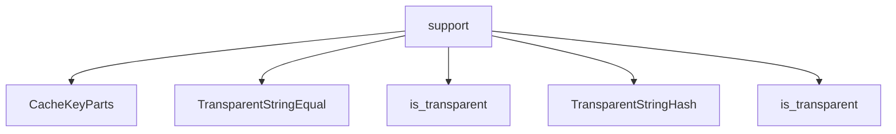

# Namespace `clore::support`

## Summary

The `clore::support` namespace provides a collection of foundational utility functions and types used throughout the `clore` codebase. Its responsibilities include UTF‑8 text file I/O (reading, writing, console enablement), string normalization (line endings, path casing, BOM stripping, encoding validation), transparent hash and equality functors for heterogeneous lookup in unordered containers, and cache key construction and decomposition. The namespace also contains helpers for topological ordering, log level canonicalization, compile signature generation, and first‑paragraph extraction, making it a general‑purpose support layer that other `clore` modules depend on for consistent text and file handling.

## Diagram



## Types

### `clore::support::CacheKeyParts`

Declaration: `support/logging.cppm:57`

Definition: `support/logging.cppm:57`

Implementation: [`Module support`](../../../modules/support/index.md)

`clore::support::CacheKeyParts` is a struct that represents the decomposed components of a cache key, typically used in conjunction with `clore::support::TransparentStringHash` and `clore::support::TransparentStringEqual`. It is designed to enable heterogeneous lookup in associative containers, allowing keys to be constructed and compared without requiring the exact stored type. The struct serves as the logical unit for caching purposes, likely within the logging subsystem, where key parts can be hashed and compared transparently with `std::string` equivalents.

#### Invariants

- `compile_signature` defaults to `0` if not explicitly set.
- `path` is a `std::string` with no additional constraints implied by the evidence.

#### Key Members

- `path`
- `compile_signature`

#### Usage Patterns

- Defined as a fundamental part of cache key representation within the logging module.
- Expected to be aggregated into a larger cache key or used directly to identify compiled artifacts.

### `clore::support::TransparentStringEqual`

Declaration: `support/logging.cppm:33`

Definition: `support/logging.cppm:33`

Implementation: [`Module support`](../../../modules/support/index.md)

`clore::support::TransparentStringEqual` is a function object type that provides equality comparison for strings with transparent lookup support. It is intended for use as the key equality comparator in unordered associative containers, enabling heterogeneous lookup when combined with a transparent hash such as `clore::support::TransparentStringHash`. The presence of the `is_transparent` member type marks this comparator as transparent, allowing containers to perform lookups using string-like types such as `std::string_view` without constructing temporary `std::string` objects.

#### Invariants

- Provides equality comparison for strings
- Supports heterogeneous lookup via `is_transparent`
- All `operator()` overloads are `noexcept`

#### Key Members

- `is_transparent` type alias
- Four `operator()` overloads (each combination of `std::string_view` and `const std::string&`)

#### Usage Patterns

- Used as a comparator in associative containers to enable transparent lookup
- Allows efficient searching with `std::string_view` without constructing temporary `std::string` objects

#### Member Types

##### `clore::support::TransparentStringEqual::is_transparent`

Declaration: `support/logging.cppm:34`

Implementation: [`Module support`](../../../modules/support/index.md)

###### Declaration

```cpp
using is_transparent = void
```

#### Member Functions

##### `clore::support::TransparentStringEqual::operator()`

Declaration: `support/logging.cppm:46`

Definition: `support/logging.cppm:46`

Implementation: [`Module support`](../../../modules/support/index.md)

###### Declaration

```cpp
auto (std::string_view, const std::string &) const noexcept -> bool;
```

##### `clore::support::TransparentStringEqual::operator()`

Declaration: `support/logging.cppm:36`

Definition: `support/logging.cppm:36`

Implementation: [`Module support`](../../../modules/support/index.md)

###### Declaration

```cpp
auto (std::string_view, std::string_view) const noexcept -> bool;
```

##### `clore::support::TransparentStringEqual::operator()`

Declaration: `support/logging.cppm:51`

Definition: `support/logging.cppm:51`

Implementation: [`Module support`](../../../modules/support/index.md)

###### Declaration

```cpp
auto (const std::string &, const std::string &) const noexcept -> bool;
```

##### `clore::support::TransparentStringEqual::operator()`

Declaration: `support/logging.cppm:41`

Definition: `support/logging.cppm:41`

Implementation: [`Module support`](../../../modules/support/index.md)

###### Declaration

```cpp
auto (const std::string &, std::string_view) const noexcept -> bool;
```

### `clore::support::TransparentStringHash`

Declaration: `support/logging.cppm:17`

Definition: `support/logging.cppm:17`

Implementation: [`Module support`](../../../modules/support/index.md)

The struct `clore::support::TransparentStringHash` is a hash functor designed to support heterogeneous lookup in unordered associative containers. It exposes the `is_transparent` type alias, which enables transparent comparison and lookup by keys of different but compatible types, such as `std::string_view`, without requiring conversion to `std::string`. This struct is intended to be used alongside `clore::support::TransparentStringEqual` to form a complete set of transparent hash and equality functors for string-based keys.

#### Invariants

- Hash values are identical to `std::hash<std::string_view>` for equivalent string content
- All three `operator()` overloads produce the same hash for equal string content
- The `is_transparent` type alias enables heterogeneous lookup in unordered containers

#### Key Members

- `is_transparent`
- `operator()(std::string_view)`
- `operator()(const std::string&)`
- `operator()(const char*)`

#### Usage Patterns

- Used as the hash functor in `std::unordered_set` or `std::unordered_map` with transparent key equality
- Enables lookup with `std::string_view` or `const char*` without constructing a `std::string`
- Serves as a building block for string-based associative containers that require heterogeneous access

#### Member Types

##### `clore::support::TransparentStringHash::is_transparent`

Declaration: `support/logging.cppm:18`

Implementation: [`Module support`](../../../modules/support/index.md)

###### Declaration

```cpp
using is_transparent = void
```

#### Member Functions

##### `clore::support::TransparentStringHash::operator()`

Declaration: `support/logging.cppm:24`

Definition: `support/logging.cppm:24`

Implementation: [`Module support`](../../../modules/support/index.md)

###### Declaration

```cpp
auto (const std::string &) const noexcept -> std::size_t;
```

##### `clore::support::TransparentStringHash::operator()`

Declaration: `support/logging.cppm:20`

Definition: `support/logging.cppm:20`

Implementation: [`Module support`](../../../modules/support/index.md)

###### Declaration

```cpp
auto (std::string_view) const noexcept -> std::size_t;
```

##### `clore::support::TransparentStringHash::operator()`

Declaration: `support/logging.cppm:28`

Definition: `support/logging.cppm:28`

Implementation: [`Module support`](../../../modules/support/index.md)

###### Declaration

```cpp
auto (const char *) const noexcept -> std::size_t;
```

## Functions

### `clore::support::build_cache_key`

Declaration: `support/logging.cppm:70`

Definition: `support/logging.cppm:368`

Implementation: [`Module support`](../../../modules/support/index.md)

The function `clore::support::build_cache_key` constructs a deterministic cache key string from a textual identifier and a numeric signature. The caller provides a `std::string_view` representing the key’s base name or context and a `std::uint64_t` that typically encodes a version, content hash, or compile signature. The returned `std::string` is intended for use as a unique, consistent lookup key in caching systems; its format can later be decomposed by the companion function `split_cache_key`.

#### Usage Patterns

- building cache keys for compile results
- combining a file path with a signature

### `clore::support::build_compile_signature`

Declaration: `support/logging.cppm:66`

Definition: `support/logging.cppm:352`

Implementation: [`Module support`](../../../modules/support/index.md)

The function `clore::support::build_compile_signature` accepts two `std::string_view` arguments and a `const int &` argument, and returns a `std::uint64_t`. It constructs a deterministic, compact signature that uniquely identifies a compilation instance based on the provided inputs. The first two string views typically represent the source file path and compiler configuration or command line; the integer reference might encode an additional version or index. The returned 64‑bit value is designed for use as a key in caching or deduplication logic, enabling efficient comparison and storage of compilation variants. Internally, the function relies on `clore::support::normalize_path_string` to ensure consistent representation of file paths before generating the signature.

#### Usage Patterns

- computing a hash key for compile caching from directory, file, and arguments

### `clore::support::canonical_log_level_name`

Declaration: `support/logging.cppm:77`

Definition: `support/logging.cppm:424`

Implementation: [`Module support`](../../../modules/support/index.md)

The function `clore::support::canonical_log_level_name` accepts a log level name as a `std::string_view` and returns a `std::optional<std::string>`. If the input corresponds to a recognized log level, the result is the canonical form of that level (for example, a fixed uppercase string such as `"ERROR"`). If the input is not a recognized log level, the function returns `std::nullopt`. This provides callers with a simple, consistent way to validate and normalize log level identifiers without exposing the internal mapping.

#### Usage Patterns

- Canonicalizing user-provided log level strings before use
- Validating log level configuration entries
- Mapping raw input to a consistent lowercase representation

### `clore::support::enable_utf8_console`

Declaration: `support/logging.cppm:91`

Definition: `support/logging.cppm:534`

Implementation: [`Module support`](../../../modules/support/index.md)

Call `clore::support::enable_utf8_console` to configure the process console for correct UTF‑8 text output. This function performs any necessary platform‑specific setup (such as changing the active console code page on Windows) so that subsequent writes to the standard output streams are interpreted as UTF‑8 by the console. It must be called once, before any output is emitted, and is safe to call even if the console already supports UTF‑8. The function is a void‑returning nullary operation; it does not perform I/O or throw exceptions.

#### Usage Patterns

- Called during program initialization on Windows to enable UTF-8 console support

### `clore::support::ensure_utf8`

Declaration: `support/logging.cppm:75`

Definition: `support/logging.cppm:405`

Implementation: [`Module support`](../../../modules/support/index.md)

Declaration: [Declaration](functions/ensure-utf8.md)

The function `clore::support::ensure_utf8` accepts a `std::string_view` and returns a `std::string`. It is responsible for ensuring that the returned string is a valid UTF-8 encoding of the input. The caller can rely on the result being a correctly encoded UTF-8 string, suitable for further processing or output. This function is used by other utilities such as `clore::support::write_utf8_text_file` and `clore::support::truncate_utf8` to guarantee UTF-8 validity before performing operations that require correct encoding.

#### Usage Patterns

- Used by `write_utf8_text_file` to sanitize input before writing
- Used by `truncate_utf8` to ensure truncated result is valid UTF-8

### `clore::support::extract_first_plain_paragraph`

Declaration: `support/logging.cppm:62`

Definition: `support/logging.cppm:303`

Implementation: [`Module support`](../../../modules/support/index.md)

This function extracts the first paragraph from the provided `std::string_view` input and returns it as a plain, non‑formatted `std::string`. It is designed for use cases where only the first logical paragraph of a message or document is needed, and any inline formatting (such as that used in Markdown) is automatically removed from the result. The caller passes a string view and receives ownership of a new `std::string` containing the first plain paragraph.

#### Usage Patterns

- Extracting plain text from Markdown documentation or log messages

### `clore::support::normalize_line_endings`

Declaration: `support/logging.cppm:79`

Definition: `support/logging.cppm:442`

Implementation: [`Module support`](../../../modules/support/index.md)

`clore::support::normalize_line_endings` accepts a `std::string_view` and returns a `std::string` with line endings converted to a canonical form. This function ensures that any mixture of carriage-return (`\r`), line-feed (`\n`), or carriage-return–line-feed (`\r\n`) sequences present in the input are replaced by a single standard line-ending character. The caller provides the source text and receives a newly allocated string with consistent line breaks, suitable for further text processing or cross-platform interchange.

#### Usage Patterns

- normalizing line endings in input text to Unix LF format
- preprocessing text for consistent newline representation before further processing

### `clore::support::normalize_path_string`

Declaration: `support/logging.cppm:64`

Definition: `support/logging.cppm:348`

Implementation: [`Module support`](../../../modules/support/index.md)

The function `clore::support::normalize_path_string` accepts a `std::string_view` representing a file path and returns a `std::string` with a normalized, canonical form of that path. It is responsible for transforming path strings into a consistent representation, typically used to ensure that logically identical paths produce identical strings for hashing or comparison purposes. The caller can expect that the returned string is suitable for use as a key in operations like building compile signatures, where path normalization is required to avoid duplicate entries due to variations in separators, redundant segments, or other platform‑dependent differences.

#### Usage Patterns

- used by `clore::support::build_compile_signature` to normalize path strings before constructing a hash

### `clore::support::read_utf8_text_file`

Declaration: `support/logging.cppm:85`

Definition: `support/logging.cppm:480`

Implementation: [`Module support`](../../../modules/support/index.md)

`clore::support::read_utf8_text_file` reads the contents of a UTF‑8 text file from an open file descriptor. The caller passes a `const int &` representing the descriptor, and the function returns an `int` that signals the outcome of the read (for example, a success code or an error indicator). The function is expected to validate the file’s encoding as UTF‑8 and to strip any leading byte‑order mark (BOM) before returning. The caller must provide a valid, readable file descriptor and should interpret the return value to determine whether the operation completed successfully.

#### Usage Patterns

- load UTF-8 text files for logging configuration
- read source files for processing or analysis
- implement file-based data loading in support utilities

### `clore::support::split_cache_key`

Declaration: `support/logging.cppm:73`

Definition: `support/logging.cppm:378`

Implementation: [`Module support`](../../../modules/support/index.md)

The function `clore::support::split_cache_key` accepts a cache key as a `std::string_view` and returns an `int`. Its caller-facing responsibility is to decompose or parse the provided key, with the returned integer typically representing either the number of resulting components, a status code, or a derived value. The caller must supply a valid cache key string; the exact interpretation of the returned `int` is defined by the implementation of `split_cache_key`.

#### Usage Patterns

- Used to split a combined cache key into its path and compile signature components for validation or further processing.
- Complementary to `build_cache_key`.

### `clore::support::strip_utf8_bom`

Declaration: `support/logging.cppm:83`

Definition: `support/logging.cppm:470`

Implementation: [`Module support`](../../../modules/support/index.md)

Declaration: [Declaration](functions/strip-utf8-bom.md)

The function `clore::support::strip_utf8_bom` examines the beginning of a `std::string_view` input for the UTF-8 Byte Order Mark (BOM) sequence (`U+FEFF` encoded as `EF BB BF` in UTF-8). If the BOM is present, it returns a new `std::string_view` that points to the input data with the BOM skipped; otherwise, it returns the original view unchanged. The caller can rely on the result being a valid view into the same storage, and no heap allocation or data copying occurs. This function is typically used by file-reading utilities to cleanly expose UTF-8 content without the BOM prefix.

#### Usage Patterns

- Stripping the UTF‑8 BOM from file contents before processing in `clore::support::read_utf8_text_file`

### `clore::support::topological_order`

Declaration: `support/logging.cppm:93`

Definition: `support/logging.cppm:547`

Implementation: [`Module support`](../../../modules/support/index.md)

The function `clore::support::topological_order` computes a topological ordering of elements based on the provided relationships. It accepts two `const int &` parameters representing node identifiers or constraints, and an `int` parameter that likely indicates a count or additional control value, and returns an `int` that represents the computed order position or a result code. The caller is responsible for supplying valid node references and ensuring the input conforms to a directed acyclic graph; the function returns a deterministic ordering under these preconditions.

#### Usage Patterns

- Used for dependency resolution and ordering tasks, such as scheduling build steps or validating `DAGs`.
- Returns the topological order or indicates a cycle via `std::nullopt`.

### `clore::support::truncate_utf8`

Declaration: `support/logging.cppm:81`

Definition: `support/logging.cppm:460`

Implementation: [`Module support`](../../../modules/support/index.md)

The function `clore::support::truncate_utf8` accepts a `std::string_view` containing a UTF‑8 encoded string and a `std::size_t` maximum byte length. It returns a `std::string` holding a prefix of the input that is valid UTF‑8 and whose byte count does not exceed the given limit; the truncation is performed at a UTF‑8 character boundary, guaranteeing that the result is well‑formed. If the input is already within the limit, the entire string is returned unchanged. The caller must supply a valid UTF‑8 input; the function does not itself validate the encoding beyond ensuring safe truncation.

#### Usage Patterns

- Truncating log messages to fit a byte limit
- Limiting user-provided strings to a maximum UTF-8 byte length
- Ensuring strings do not exceed storage constraints while maintaining encoding validity

### `clore::support::write_utf8_text_file`

Declaration: `support/logging.cppm:88`

Definition: `support/logging.cppm:515`

Implementation: [`Module support`](../../../modules/support/index.md)

The function `clore::support::write_utf8_text_file` writes a UTF‑8 encoded text file to an open file descriptor. It accepts a file handle (an `int` reference) and a `std::string_view` containing the text content. The function returns an `int` to indicate success or failure; a return value of `0` typically represents success, while a non‑zero value signals an error. Callers are responsible for providing a valid file handle and may rely on the function to ensure that the output is properly encoded in UTF‑8.

#### Usage Patterns

- callers provide a filesystem path and string content to write a UTF-8 encoded file
- used when a function needs to persist text data to disk with error handling

## Related Pages

- [Namespace clore](../index.md)

