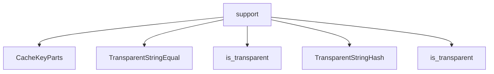

# Namespace `clore::support`

## Summary

The `clore::support` namespace provides a collection of utility functions and types that serve as a foundational layer for the Clore project. Its responsibilities include UTF‑8 text file I/O (`read_utf8_text_file`, `write_utf8_text_file`), text normalization and validation (`strip_utf8_bom`, `ensure_utf8`, `truncate_utf8`, `normalize_line_endings`, `normalize_path_string`), caching infrastructure (`build_cache_key`, `split_cache_key`, `build_compile_signature`), and console configuration (`enable_utf8_console`). Notable declarations also include string‑comparison utilities (`TransparentStringEqual`, `TransparentStringHash`) for heterogeneous associative containers, a `CacheKeyParts` structure, and helper functions such as `extract_first_plain_paragraph`, `canonical_log_level_name`, and `topological_order`. Architecturally, this namespace abstracts platform‑specific and string‑handling details, ensuring that other modules in the codebase can work consistently with UTF‑8 text, file paths, and cache keys without reimplementing low‑level logic.

## Diagram



## Types

### `clore::support::CacheKeyParts`

Declaration: `support/logging.cppm:57`

Definition: `support/logging.cppm:57`

Implementation: [`Module support`](../../../modules/support/index.md)

Insufficient evidence to summarize; provide more EVIDENCE.

#### Invariants

- `compile_signature` is default-initialized to 0 if not explicitly provided.
- The struct is trivially copyable and movable via default compiler-generated operations.

#### Key Members

- `path` – the file path component of the cache key
- `compile_signature` – an integer hash or signature representing compilation inputs

#### Usage Patterns

- Constructed and passed to cache lookup or storage functions within `clore::support`.
- Likely compared or hashed to uniquely identify compiled module signatures.

### `clore::support::TransparentStringEqual`

Declaration: `support/logging.cppm:33`

Definition: `support/logging.cppm:33`

Implementation: [`Module support`](../../../modules/support/index.md)

The type `clore::support::TransparentStringEqual` is a function object that provides transparent equality comparison for string-like types. It is designed for use with heterogeneous associative containers, such as `std::unordered_set`, to enable lookup without constructing temporary `std::string` objects from string literals or other compatible types. The presence of the nested type alias `is_transparent` indicates that the comparison supports transparent lookup, allowing the container to match keys of different but comparable types efficiently.

#### Invariants

- All overloads are `noexcept` and return `bool`.
- Comparison is consistent with `operator==` for `std::string` and `std::string_view`.
- No mutable state is stored; the functor is stateless.
- Equal strings are guaranteed to compare equal regardless of argument types.

#### Key Members

- `using is_transparent = void`
- `operator()(std::string_view, std::string_view) const noexcept`
- `operator()(const std::string&, std::string_view) const noexcept`
- `operator()(std::string_view, const std::string&) const noexcept`
- `operator()(const std::string&, const std::string&) const noexcept`

#### Usage Patterns

- Passed as the comparison key to `std::set`, `std::map`, `std::unordered_set`, or `std::unordered_map` to enable lookup with `std::string_view` without constructing `std::string` temporaries.
- Used in heterogeneous lookup scenarios where keys are stored as `std::string` but lookup is performed with `std::string_view`.

#### Member Types

##### `clore::support::TransparentStringEqual::is_transparent`

Declaration: `support/logging.cppm:34`

Implementation: [`Module support`](../../../modules/support/index.md)

###### Declaration

```cpp
using is_transparent = void
```

#### Member Functions

##### `clore::support::TransparentStringEqual::operator()`

Declaration: `support/logging.cppm:46`

Definition: `support/logging.cppm:46`

Implementation: [`Module support`](../../../modules/support/index.md)

###### Declaration

```cpp
auto (std::string_view, const std::string &) const noexcept -> bool;
```

##### `clore::support::TransparentStringEqual::operator()`

Declaration: `support/logging.cppm:36`

Definition: `support/logging.cppm:36`

Implementation: [`Module support`](../../../modules/support/index.md)

###### Declaration

```cpp
auto (std::string_view, std::string_view) const noexcept -> bool;
```

##### `clore::support::TransparentStringEqual::operator()`

Declaration: `support/logging.cppm:51`

Definition: `support/logging.cppm:51`

Implementation: [`Module support`](../../../modules/support/index.md)

###### Declaration

```cpp
auto (const std::string &, const std::string &) const noexcept -> bool;
```

##### `clore::support::TransparentStringEqual::operator()`

Declaration: `support/logging.cppm:41`

Definition: `support/logging.cppm:41`

Implementation: [`Module support`](../../../modules/support/index.md)

###### Declaration

```cpp
auto (const std::string &, std::string_view) const noexcept -> bool;
```

### `clore::support::TransparentStringHash`

Declaration: `support/logging.cppm:17`

Definition: `support/logging.cppm:17`

Implementation: [`Module support`](../../../modules/support/index.md)

The `clore::support::TransparentStringHash` struct is a hash functor designed for use with unordered associative containers (such as `std::unordered_map` or `std::unordered_set`) that require heterogeneous lookup. It provides an `is_transparent` type alias, which enables the container's `find`, `count`, and similar member functions to accept arguments of types other than the container's key type (e.g., `std::string_view` or `const char*`) without requiring an explicit conversion to `std::string`. This improves efficiency by avoiding temporary key construction. It is intended to be paired with `clore::support::TransparentStringEqual` for transparent equality comparison.

#### Invariants

- All `operator()` overloads are noexcept
- Equal string inputs produce equal hash values
- Delegates exclusively to `std::hash<std::string_view>`

#### Key Members

- `is_transparent`
- `operator()(``std::string_view`)
- `operator()(`const `std::string`&)
- `operator()(`const char*)

#### Usage Patterns

- Used as the Hash template parameter in `std::unordered_set` or `std::unordered_map` for string keys
- Enables lookups with `std::string_view`, `std::string`, or const char* without constructing a key type

#### Member Types

##### `clore::support::TransparentStringHash::is_transparent`

Declaration: `support/logging.cppm:18`

Implementation: [`Module support`](../../../modules/support/index.md)

###### Declaration

```cpp
using is_transparent = void
```

#### Member Functions

##### `clore::support::TransparentStringHash::operator()`

Declaration: `support/logging.cppm:24`

Definition: `support/logging.cppm:24`

Implementation: [`Module support`](../../../modules/support/index.md)

###### Declaration

```cpp
auto (const std::string &) const noexcept -> std::size_t;
```

##### `clore::support::TransparentStringHash::operator()`

Declaration: `support/logging.cppm:20`

Definition: `support/logging.cppm:20`

Implementation: [`Module support`](../../../modules/support/index.md)

###### Declaration

```cpp
auto (std::string_view) const noexcept -> std::size_t;
```

##### `clore::support::TransparentStringHash::operator()`

Declaration: `support/logging.cppm:28`

Definition: `support/logging.cppm:28`

Implementation: [`Module support`](../../../modules/support/index.md)

###### Declaration

```cpp
auto (const char *) const noexcept -> std::size_t;
```

## Functions

### `clore::support::build_cache_key`

Declaration: `support/logging.cppm:70`

Definition: `support/logging.cppm:368`

Implementation: [`Module support`](../../../modules/support/index.md)

The function `clore::support::build_cache_key` constructs a cache key from a string identifier and a numeric value. It accepts a `std::string_view` representing a key prefix or name and a `std::uint64_t` typically used as a hash or signature, and returns a `std::string` that can be used to uniquely identify cached artifacts.

The returned key is deterministic for the same inputs and is designed for use in caching subsystems that require a string-based lookup. The caller is responsible for providing a consistent identifier and a matching numeric value; no side effects are introduced.

#### Usage Patterns

- Used to form keys for caching compiled results
- Called when building a cache entry identifier

### `clore::support::build_compile_signature`

Declaration: `support/logging.cppm:66`

Definition: `support/logging.cppm:352`

Implementation: [`Module support`](../../../modules/support/index.md)

The function `clore::support::build_compile_signature` constructs a 64‑bit signature for a compilation unit from its source path, a secondary identifier, and a compile‑related flag. It is typically used to associate a build artifact with specific inputs, enabling cache lookups or incremental builds. The caller provides a `std::string_view` representing the source file path, another `std::string_view` for a distinguishing key (such as a hash or version), and a `const int &` that conveys an additional compile parameter (e.g., optimization level or a flags index). The returned `std::uint64_t` is a deterministic hash of the normalized inputs; the function internally normalizes the file path to ensure consistent signatures across different path representations. The contract guarantees that identical inputs produce identical output signatures, and that the normalization uses the platform‑appropriate path separator.

#### Usage Patterns

- generating a hash-based signature for compile options
- used in caching or deduplication of compilation results

### `clore::support::canonical_log_level_name`

Declaration: `support/logging.cppm:77`

Definition: `support/logging.cppm:424`

Implementation: [`Module support`](../../../modules/support/index.md)

The function `clore::support::canonical_log_level_name` accepts a `std::string_view` representing a log level name and returns a `std::optional<std::string>`. If the input matches a recognized log level, it returns the canonical form of that level; otherwise it returns `std::nullopt`. The caller is responsible for providing a non‑empty, case‑sensitive (or case‑insensitive, depending on implementation) name; the function’s contract guarantees no exceptions and a determinate canonical mapping for known levels. The returned string is a stable, normalized representation that can be used for comparisons or storage.

#### Usage Patterns

- validate log level name
- normalize log level to lowercase
- used before setting log level

### `clore::support::enable_utf8_console`

Declaration: `support/logging.cppm:91`

Definition: `support/logging.cppm:534`

Implementation: [`Module support`](../../../modules/support/index.md)

`clore::support::enable_utf8_console` configures the console environment to support UTF‑8 input and output. It should be called early in program startup, typically before any console I/O operations that involve non‑ASCII text. The function has no parameters and returns nothing; its effect is system‑wide and persists for the lifetime of the process. Under the hood it may adjust the console code page, set locale facets, or perform similar platform‑specific initialization to ensure that `std::cout`, `std::cin`, and related streams handle UTF‑8 correctly. The caller must ensure that this function is invoked at most once; repeated calls are harmless but unnecessary. On unsupported platforms the function may silently degrade gracefully, but the exact behavior depends on the underlying implementation.

#### Usage Patterns

- Called during program initialization to enable UTF-8 console support on Windows

### `clore::support::ensure_utf8`

Declaration: `support/logging.cppm:75`

Definition: `support/logging.cppm:405`

Implementation: [`Module support`](../../../modules/support/index.md)

Declaration: [Declaration](functions/ensure-utf8.md)

The function `clore::support::ensure_utf8` accepts a `std::string_view` and returns a `std::string` that is guaranteed to be a valid UTF-8 representation of the input. Callers can rely on the result being well-formed UTF-8, suitable for downstream operations that require UTF-8 encoding, such as writing to a file or performing truncation. The caller is responsible for providing the input text; the function handles any necessary normalization or conversion to ensure UTF-8 validity.

#### Usage Patterns

- called by `write_utf8_text_file` to ensure output is valid UTF-8
- called by `truncate_utf8` to sanitize input before truncation

### `clore::support::extract_first_plain_paragraph`

Declaration: `support/logging.cppm:62`

Definition: `support/logging.cppm:303`

Implementation: [`Module support`](../../../modules/support/index.md)

`clore::support::extract_first_plain_paragraph` accepts a `std::string_view` containing text that may include inline markdown formatting and returns a `std::string` holding the first paragraph of that text as plain text, with any markdown syntax removed. The caller is responsible for providing well‑formed input; the function does not modify the original string and returns only the first logical paragraph.

#### Usage Patterns

- extracting the first paragraph from Markdown documentation
- obtaining a plain text summary from Markdown strings

### `clore::support::normalize_line_endings`

Declaration: `support/logging.cppm:79`

Definition: `support/logging.cppm:442`

Implementation: [`Module support`](../../../modules/support/index.md)

The function `clore::support::normalize_line_endings` accepts a `std::string_view` and returns a `std::string`. It transforms the line-ending sequences in the input into a canonical form, ensuring consistent line termination throughout the returned string. The caller can rely on the returned string having all line endings normalized, regardless of the original mix of carriage‑return and newline characters present in the input.

#### Usage Patterns

- normalize line endings for text processing
- prepare strings for hash or comparison ignoring line ending variations

### `clore::support::normalize_path_string`

Declaration: `support/logging.cppm:64`

Definition: `support/logging.cppm:348`

Implementation: [`Module support`](../../../modules/support/index.md)

`clore::support::normalize_path_string` accepts a `std::string_view` representing a filesystem path and returns a `std::string` containing a normalized version of that path. The normalization ensures that paths are represented in a consistent, canonical form, making them suitable for reliable string comparison, hashing, or use as keys in maps and cache signatures.

The caller is responsible for providing a valid path string; the function does not verify that the path exists or is absolute. The returned string is intended to be platform-independent and free of redundant separators, relative components, or trailing separators. This function is primarily used by `clore::support::build_compile_signature` to produce stable identifiers for compilation inputs.

#### Usage Patterns

- used by `clore::support::build_compile_signature` to normalize path arguments before hashing

### `clore::support::read_utf8_text_file`

Declaration: `support/logging.cppm:85`

Definition: `support/logging.cppm:480`

Implementation: [`Module support`](../../../modules/support/index.md)

`clore::support::read_utf8_text_file` reads the entire contents of a UTF‑8 text file identified by the given file descriptor (`const int &`). The function strips any leading UTF‑8 byte order mark (BOM) from the read data, using `clore::support::strip_utf8_bom` to produce clean text. It returns an `int` indicating the outcome—typically zero for success or a non‑zero error code on failure. This function is the counterpart of `clore::support::write_utf8_text_file`.

#### Usage Patterns

- used to load text files for processing
- used where UTF-8 BOM stripping is required
- error handling via `std::expected`

### `clore::support::split_cache_key`

Declaration: `support/logging.cppm:73`

Definition: `support/logging.cppm:378`

Implementation: [`Module support`](../../../modules/support/index.md)

The function `clore::support::split_cache_key` accepts a single `std::string_view` representing a cache key and returns an `int`. It provides a caller-facing interface to decompose a composite cache key into a numeric component, which may be used for comparison, ordering, or lookup purposes. The caller is responsible for passing a properly formatted key string; the exact interpretation of the return value is determined by the cache key encoding scheme.

#### Usage Patterns

- parsing a combined cache key into its path and signature components
- validating cache key format before further processing

### `clore::support::strip_utf8_bom`

Declaration: `support/logging.cppm:83`

Definition: `support/logging.cppm:470`

Implementation: [`Module support`](../../../modules/support/index.md)

Declaration: [Declaration](functions/strip-utf8-bom.md)

`clore::support::strip_utf8_bom` accepts a `std::string_view` and returns a `std::string_view` that points to the same character data, except that a leading UTF‑8 byte order mark (BOM), if present, is skipped. The result is a non‑owning view that does not modify the original input; the caller retains ownership of the underlying storage.

The function is intended to normalize UTF‑8 text before further processing, such as reading a file with `read_utf8_text_file`. The returned view is equivalent to the input when no BOM is found, or advances past the three‑byte sequence `0xEF BB BF` when it is detected. No validity checks are performed beyond the BOM pattern itself.

#### Usage Patterns

- called by `clore::support::read_utf8_text_file` to strip BOM from file contents

### `clore::support::topological_order`

Declaration: `support/logging.cppm:93`

Definition: `support/logging.cppm:547`

Implementation: [`Module support`](../../../modules/support/index.md)

`clore::support::topological_order` computes the topological ordering relation between two elements. The caller provides two integer references as the elements to compare and a third `int` parameter that influences the ordering context (for example, the size of the graph or a domain identifier). The function returns an `int` that indicates the relative order: a negative value, zero, or a positive value to represent that the first element should appear before, at the same position as, or after the second element in the topological order.

#### Usage Patterns

- Topological ordering of dependencies
- Cycle detection in directed graphs
- Build system task scheduling

### `clore::support::truncate_utf8`

Declaration: `support/logging.cppm:81`

Definition: `support/logging.cppm:460`

Implementation: [`Module support`](../../../modules/support/index.md)

The function `clore::support::truncate_utf8` returns a UTF-8–safe substring of the input `std::string_view`. It truncates the string to at most the specified number of code units (bytes), ensuring the result does not split a multi-byte UTF-8 character. The caller provides the source view and a maximum byte length; the returned `std::string` is guaranteed to be valid UTF-8 and no longer than the given length. If the input is already short enough, the result may be a copy; otherwise, trailing incomplete sequences are removed.

#### Usage Patterns

- truncating UTF-8 text to a byte limit without breaking multi-byte characters
- normalizing and truncating input lengths for logging or display

### `clore::support::write_utf8_text_file`

Declaration: `support/logging.cppm:88`

Definition: `support/logging.cppm:515`

Implementation: [`Module support`](../../../modules/support/index.md)

The function `clore::support::write_utf8_text_file` writes the content provided as a `std::string_view` to a file identified by an open file descriptor (passed as `const int &`). It returns an `int` indicating success (zero) or a system error code on failure. The caller is responsible for providing a valid, writable file descriptor. The function ensures that the written byte stream is valid UTF-8; if necessary, it transforms the input using `clore::support::ensure_utf8` before writing. This contract guarantees that the output text file is well-formed UTF-8.

#### Usage Patterns

- Used to write UTF-8 text files after content normalization
- Provides error handling for file write failures

## Related Pages

- [Namespace clore](../index.md)

