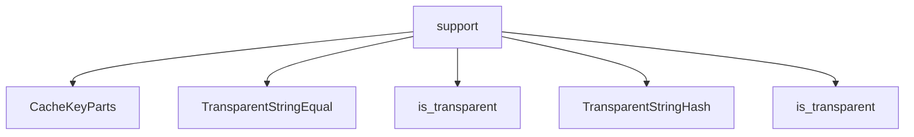

# Namespace `clore::support`

## Summary

The `clore::support` namespace provides a cohesive set of low‑level utility functions and types that serve as a foundation for common operations throughout the Clore codebase. Its responsibilities span file I/O (reading and writing UTF‑8 files with BOM handling), text normalization (line‑ending conversion, UTF‑8 validation, truncation, BOM stripping), caching infrastructure (building and parsing deterministic cache keys, computing compile signatures), graph algorithms (topological ordering), console setup (enabling UTF‑8 output), and transparent string hashing/comparison for heterogeneous lookup in associative containers. By centralizing these operations, the namespace promotes consistency, reduces duplication, and isolates platform‑specific behavior, allowing higher‑level modules to rely on a stable, well‑tested set of primitives.

## Diagram


```mermaid
graph TD
    NS["support"]
    T0["CacheKeyParts"]
    NS --> T0
    T1["TransparentStringEqual"]
    NS --> T1
    T2["is_transparent"]
    NS --> T2
    T3["TransparentStringHash"]
    NS --> T3
    T4["is_transparent"]
    NS --> T4
```

## Types

### `clore::support::CacheKeyParts`

Declaration: `src/support/logging.cppm:80`

Definition: `src/support/logging.cppm:80`

Implementation: [`Module support`](../../../modules/support/index.md)

Insufficient evidence to summarize; provide more EVIDENCE.

#### Invariants

- `compile_signature` is initialized to 0 by default
- Equality of two keys is determined by both fields

#### Key Members

- `path`
- `compile_signature`

#### Usage Patterns

- Used as a key type in caching containers
- Constructed by providing a file path and compilation signature

### `clore::support::TransparentStringEqual`

Declaration: `src/support/logging.cppm:56`

Definition: `src/support/logging.cppm:56`

Implementation: [`Module support`](../../../modules/support/index.md)

The `clore::support::TransparentStringEqual` struct is a string equality comparator designed for use with associative containers such as `std::unordered_set` or `std::unordered_map` that support heterogeneous lookup. It exposes an `is_transparent` type alias to enable transparent comparison, allowing lookups using keys of compatible types (e.g., `std::string_view`, `const char*`) without requiring construction of a temporary `std::string`. This improves efficiency and reduces unnecessary allocations when performing key searches.

#### Invariants

- Equality comparison is symmetric and consistent with `std::string_view` comparison.
- All overloads are `noexcept`.

#### Key Members

- `is_transparent` typedef
- `operator()` overloads for comparing `std::string` and `std::string_view`

#### Usage Patterns

- Used as a transparent comparator for `std::unordered_set` or `std::unordered_map` to allow lookup with `std::string_view` without constructing `std::string`.
- Can also be used as a standalone equality functor.

#### Member Types

##### `clore::support::TransparentStringEqual::is_transparent`

Declaration: `src/support/logging.cppm:57`

Implementation: [`Module support`](../../../modules/support/index.md)

###### Declaration

```cpp
using is_transparent = void
```

#### Member Functions

##### `clore::support::TransparentStringEqual::operator()`

Declaration: `src/support/logging.cppm:64`

Definition: `src/support/logging.cppm:64`

Implementation: [`Module support`](../../../modules/support/index.md)

###### Declaration

```cpp
auto (const std::string &, std::string_view) const noexcept -> bool;
```

##### `clore::support::TransparentStringEqual::operator()`

Declaration: `src/support/logging.cppm:69`

Definition: `src/support/logging.cppm:69`

Implementation: [`Module support`](../../../modules/support/index.md)

###### Declaration

```cpp
auto (std::string_view, const std::string &) const noexcept -> bool;
```

##### `clore::support::TransparentStringEqual::operator()`

Declaration: `src/support/logging.cppm:74`

Definition: `src/support/logging.cppm:74`

Implementation: [`Module support`](../../../modules/support/index.md)

###### Declaration

```cpp
auto (const std::string &, const std::string &) const noexcept -> bool;
```

##### `clore::support::TransparentStringEqual::operator()`

Declaration: `src/support/logging.cppm:59`

Definition: `src/support/logging.cppm:59`

Implementation: [`Module support`](../../../modules/support/index.md)

###### Declaration

```cpp
auto (std::string_view, std::string_view) const noexcept -> bool;
```

### `clore::support::TransparentStringHash`

Declaration: `src/support/logging.cppm:40`

Definition: `src/support/logging.cppm:40`

Implementation: [`Module support`](../../../modules/support/index.md)

`clore::support::TransparentStringHash` is a hash functor designed for use in unordered associative containers. It exposes an `is_transparent` type alias, which enables heterogeneous lookup so that keys of differing but equivalent string types—such as `std::string` and `std::string_view`—can be compared directly without requiring conversion or temporary object construction. This improves both performance and flexibility when hashing string keys in maps or sets.

#### Invariants

- Hash value depends only on the string content, not the type of the argument.
- The functor is transparent, allowing heterogeneous lookup in unordered containers.
- All `operator()` calls are `noexcept`.

#### Key Members

- `is_transparent`
- `operator()(std::string_view)`
- `operator()(const std::string&)`
- `operator()(const char*)`

#### Usage Patterns

- Used as a hash functor for `std::unordered_set` or `std::unordered_map` with transparent lookup.
- Enables hashing keys without constructing temporary `std::string` objects, improving performance.
- Can be passed as the `Hash` template parameter to associative containers.

#### Member Types

##### `clore::support::TransparentStringHash::is_transparent`

Declaration: `src/support/logging.cppm:41`

Implementation: [`Module support`](../../../modules/support/index.md)

###### Declaration

```cpp
using is_transparent = void
```

#### Member Functions

##### `clore::support::TransparentStringHash::operator()`

Declaration: `src/support/logging.cppm:43`

Definition: `src/support/logging.cppm:43`

Implementation: [`Module support`](../../../modules/support/index.md)

###### Declaration

```cpp
auto (std::string_view) const noexcept -> std::size_t;
```

##### `clore::support::TransparentStringHash::operator()`

Declaration: `src/support/logging.cppm:51`

Definition: `src/support/logging.cppm:51`

Implementation: [`Module support`](../../../modules/support/index.md)

###### Declaration

```cpp
auto (const char *) const noexcept -> std::size_t;
```

##### `clore::support::TransparentStringHash::operator()`

Declaration: `src/support/logging.cppm:47`

Definition: `src/support/logging.cppm:47`

Implementation: [`Module support`](../../../modules/support/index.md)

###### Declaration

```cpp
auto (const std::string &) const noexcept -> std::size_t;
```

## Functions

### `clore::support::build_cache_key`

Declaration: `src/support/logging.cppm:93`

Definition: `src/support/logging.cppm:391`

Implementation: [`Module support`](../../../modules/support/index.md)

The caller-facing responsibility of `clore::support::build_cache_key` is to produce a cache key string from a logical prefix and a numeric discriminator. It accepts a `std::string_view` representing the key’s textual portion and a `std::uint64_t` serving as an integral tag, returning a `std::string` that encodes both components in a deterministic, parseable format. The resulting key string is designed for use with the matching inverse operation `clore::support::split_cache_key`, meaning the caller can rely on the key’s structure being decomposable into the original prefix and tag at a later point.

#### Usage Patterns

- Constructs cache keys for compilation artifacts
- Used to key entries in a compilation cache

### `clore::support::build_compile_signature`

Declaration: `src/support/logging.cppm:89`

Definition: `src/support/logging.cppm:375`

Implementation: [`Module support`](../../../modules/support/index.md)

This function computes a 64-bit compile signature derived from the provided arguments. It accepts a compile source path, a compiler arguments string, and a vector of additional arguments (such as include directories or flags). The returned signature is intended to uniquely identify a compilation configuration for caching purposes. The caller ensures the source path and arguments are valid UTF-8 strings; the function normalizes paths internally via `clore::support::normalize_path_string` to produce consistent signatures across equivalent inputs. The result can be consumed by `clore::support::build_cache_key` to generate a cache key string.

#### Usage Patterns

- Used to generate a unique identifier for a compilation unit based on its directory, file, and arguments.

### `clore::support::canonical_log_level_name`

Declaration: `src/support/logging.cppm:100`

Definition: `src/support/logging.cppm:447`

Implementation: [`Module support`](../../../modules/support/index.md)

The function `clore::support::canonical_log_level_name` accepts a `std::string_view` representing a log level name (for example, `"info"`, `"warn"`, or `"error"`). It returns a `std::optional<std::string>` containing the canonical, standardized form of that log level, or `std::nullopt` if the input does not match any recognized log level. The caller can rely on this function to normalize user‑supplied or external log level identifiers to a consistent casing and representation, independent of any aliases or minor formatting variations. The contract guarantees that a successful return value is a valid, unchanging canonical string that can be used directly in logging configuration or comparison.

#### Usage Patterns

- validating and normalizing user-provided log level names
- converting log level strings to canonical form before use in logging configuration

### `clore::support::enable_utf8_console`

Declaration: `src/support/logging.cppm:114`

Definition: `src/support/logging.cppm:557`

Implementation: [`Module support`](../../../modules/support/index.md)

The `clore::support::enable_utf8_console` function configures the console environment so that subsequent text output supports the UTF‑8 encoding. Callers must invoke this function before performing any I/O that relies on proper UTF‑8 handling (for example, printing non‑ASCII characters). The function modifies the underlying console state and does not return a value. It is safe to call multiple times, but an early call, typically at program startup, ensures the console is in the correct mode for UTF‑8 output across the application’s lifetime.

#### Usage Patterns

- Called at application startup to ensure UTF-8 support in the Windows console.

### `clore::support::ensure_utf8`

Declaration: `src/support/logging.cppm:98`

Definition: `src/support/logging.cppm:428`

Implementation: [`Module support`](../../../modules/support/index.md)

Declaration: [Declaration](functions/ensure-utf8.md)

The function `clore::support::ensure_utf8` accepts a `std::string_view` and returns a `std::string` that is guaranteed to be valid UTF-8. It is the caller’s responsibility to provide any `std::string_view`; the function handles any ill-formed byte sequences and produces a properly encoded UTF-8 result, suitable for further processing or output by callers such as `clore::support::write_utf8_text_file` and `clore::support::truncate_utf8`.

#### Usage Patterns

- Ensuring text is valid UTF-8 before passing to `write_utf8_text_file`
- Sanitizing input before truncation in `truncate_utf8`

### `clore::support::extract_first_plain_paragraph`

Declaration: `src/support/logging.cppm:85`

Definition: `src/support/logging.cppm:326`

Implementation: [`Module support`](../../../modules/support/index.md)

The function `clore::support::extract_first_plain_paragraph` accepts a `std::string_view` and returns a `std::string` containing the first plain‑text paragraph extracted from the input. The caller can rely on the result being a single paragraph with inline Markdown formatting removed. The input is expected to be a Markdown or plain text string; the function handles the extraction and conversion to plain text.

#### Usage Patterns

- extracting a plain text summary from Markdown
- obtaining a human-readable description from documentation

### `clore::support::normalize_line_endings`

Declaration: `src/support/logging.cppm:102`

Definition: `src/support/logging.cppm:465`

Implementation: [`Module support`](../../../modules/support/index.md)

The function `clore::support::normalize_line_endings` accepts a `std::string_view` and returns a `std::string` in which all line-ending sequences are converted to a consistent, platform-independent LF (line feed) convention. This is a pure transformation with no side effects: the caller passes in any text content, and receives a newly allocated string where every carriage-return–line-feed pair (CRLF) or bare carriage return (CR) has been replaced by a single LF. The input view remains unchanged. The function is useful prior to comparing, hashing, or otherwise processing text that may originate from different operating systems.

#### Usage Patterns

- Normalize line endings from different platforms
- Preprocess text before further processing

### `clore::support::normalize_path_string`

Declaration: `src/support/logging.cppm:87`

Definition: `src/support/logging.cppm:371`

Implementation: [`Module support`](../../../modules/support/index.md)

Declaration: [Declaration](functions/normalize-path-string.md)

`clore::support::normalize_path_string` accepts a path string and returns a normalized form suitable for use as a stable key in hashing or equality comparisons. The caller may provide a path in any typical filesystem format; the returned `std::string` is a normalized representation that ensures consistent results regardless of input variations such as separator style, case (on case-insensitive systems), or redundant components. This normalization is employed internally by `clore::support::build_compile_signature` to produce deterministic compile‑signature keys.

#### Usage Patterns

- normalizing paths for signature computation
- ensuring consistent path representation

### `clore::support::read_utf8_text_file`

Declaration: `src/support/logging.cppm:108`

Definition: `src/support/logging.cppm:503`

Implementation: [`Module support`](../../../modules/support/index.md)

Reads a UTF‑8 text file at the given `std::filesystem::path` and returns its contents as a `std::string`. The function strips any leading UTF‑8 byte order mark (BOM) using `strip_utf8_bom`. On success the `std::expected` holds the file content; on failure it contains an error string describing the problem (e.g., file not found or read error). The caller must handle both the expected value and the error case.

#### Usage Patterns

- load UTF-8 text files into memory
- obtain file contents as a `std::string` with error handling via `std::expected`

### `clore::support::split_cache_key`

Declaration: `src/support/logging.cppm:96`

Definition: `src/support/logging.cppm:401`

Implementation: [`Module support`](../../../modules/support/index.md)

The function `clore::support::split_cache_key` accepts a single `std::string_view` representing a previously built cache key and attempts to parse it into its constituent `CacheKeyParts`. On success, it returns the decomposed parts; on failure, it returns a `std::string` describing the error, typically because the input does not match the expected cache key format (for example, as produced by `clore::support::build_cache_key`). Callers should ensure the input conforms to the key structure established elsewhere in the logging infrastructure, and handle the error case gracefully.

#### Usage Patterns

- Decompose cache keys created by `build_cache_key`
- Validate and parse cache key strings

### `clore::support::strip_utf8_bom`

Declaration: `src/support/logging.cppm:106`

Definition: `src/support/logging.cppm:493`

Implementation: [`Module support`](../../../modules/support/index.md)

Declaration: [Declaration](functions/strip-utf8-bom.md)

Strips the UTF-8 byte order mark (BOM) from the beginning of the given `std::string_view` and returns a view pointing to the remainder of the string. If the input does not start with a UTF-8 BOM, the returned view is identical to the input. The function does not modify the original string and operates purely by adjusting the view bounds.

#### Usage Patterns

- called by `read_utf8_text_file` to strip BOM

### `clore::support::topological_order`

Declaration: `src/support/logging.cppm:116`

Definition: `src/support/logging.cppm:570`

Implementation: [`Module support`](../../../modules/support/index.md)

The function `clore::support::topological_order` computes a topological ordering of a directed graph. The caller supplies a collection of all vertex identifiers as a `std::vector<std::string>`, a mapping from each vertex to the list of its direct successors (or dependencies) as a `std::unordered_map<std::string, std::vector<std::string>>`, and an initial in‑degree map as a `std::unordered_map<std::string, int>` that records the number of incoming edges for each vertex before any processing. If the graph contains no directed cycle, the function returns a `std::optional<std::vector<std::string>>` containing a sequence of vertices in topological order; otherwise it returns `std::nullopt` to indicate that no such ordering exists. The in‑degree map is taken by value, so the caller’s copy remains unchanged.

#### Usage Patterns

- topological ordering in dependency graphs
- build system dependency resolution

### `clore::support::truncate_utf8`

Declaration: `src/support/logging.cppm:104`

Definition: `src/support/logging.cppm:483`

Implementation: [`Module support`](../../../modules/support/index.md)

`clore::support::truncate_utf8` truncates a UTF‑8 encoded input string to a specified maximum number of bytes, producing a new `std::string` whose byte count does not exceed the given limit. The result is always a valid UTF‑8 sequence: no multi‑byte character is split at the truncation point. The caller provides a `std::string_view` containing the source text and a `std::size_t` indicating the maximum byte length. If the input already satisfies the limit, a copy of the original (or a substring) may be returned. Before truncation, the input is processed through `clore::support::ensure_utf8` so that any ill‑formed byte sequences are replaced with the U+FFFD replacement character. The function guarantees that the output is well‑formed UTF‑8 and that its byte length is no greater than the limit. If the limit is smaller than the length of a single code point, the resulting string may be empty. The caller must ensure that the input `std::string_view` remains valid for the duration of the call.

#### Usage Patterns

- Used to safely truncate UTF-8 text for storage or display constraints
- Called when formatting log messages or database entries to limit byte length

### `clore::support::write_utf8_text_file`

Declaration: `src/support/logging.cppm:111`

Definition: `src/support/logging.cppm:538`

Implementation: [`Module support`](../../../modules/support/index.md)

`clore::support::write_utf8_text_file` writes the provided `std::string_view` content as UTF-8 text to the file specified by the given `const std::filesystem::path &`. The function returns a `std::expected<void, std::string>`: an empty `expected` on success, or an error message string on failure. The caller should supply the desired path and the text content; the function handles ensuring the content is properly encoded as UTF-8. This is the counterpart to `clore::support::read_utf8_text_file` for writing.

#### Usage Patterns

- writing UTF-8 text files

## Related Pages

- [Namespace clore](../index.md)

