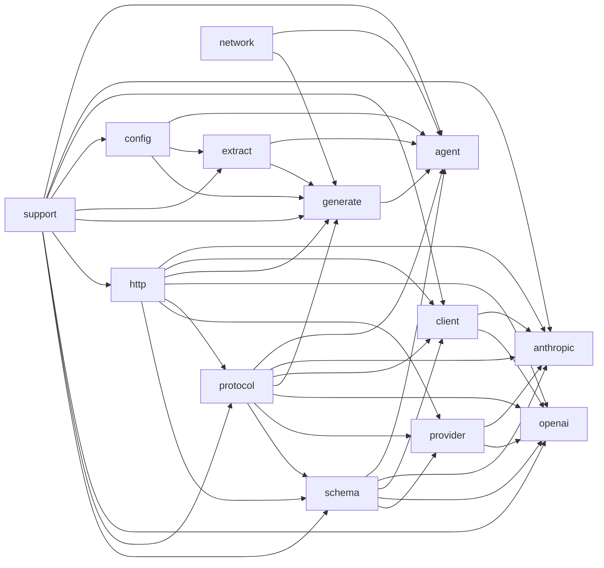

# API Reference

## Overview

clore 项目是一个 C++ 工具集，用于自动化生成代码库的指南文档。它通过一个代理循环（`agent` 模块）驱动整个流程：首先使用 `extract` 模块从源代码中提取结构化信息（如抽象语法树、依赖关系），然后将这些信息通过 `generate` 模块组织为文档页面。整个过程中，项目依赖于 `net` 库（包含 `http`、`client`、`provider`、`anthropic`、`openai`、`protocol`、`schema` 等模块）与 LLM API（`OpenAI` 和 Anthropic）进行异步通信，以获取智能辅助。`config` 模块提供环境配置管理，而 `support` 模块提供文本处理、文件 I/O 等基础设施。

理解该项目时，应将其看作一个分层架构：顶层为业务编排（代理、提取、生成），中层为网络与协议实现（与不同 LLM 提供者的抽象交互），底层为通用工具与 schema 生成。各模块通过 `clore` 命名空间松散耦合，且多数提供同步与异步两种接口。对于希望定制文档生成流程或替换 LLM 提供者的开发者，可以关注 `net` 子库中的协议扩展点以及 `agent` 模块的回调机制。

## Modules

- [`agent`](modules/agent/index.md)
- [`agent:tools`](modules/agent/tools.md)
- [`anthropic`](modules/anthropic/index.md)
- [`client`](modules/client/index.md)
- [`config`](modules/config/index.md)
- [`config:load`](modules/config/load.md)
- [`config:normalize`](modules/config/normalize.md)
- [`config:schema`](modules/config/schema.md)
- [`config:validate`](modules/config/validate.md)
- [`extract`](modules/extract/index.md)
- [`extract:ast`](modules/extract/ast.md)
- [`extract:cache`](modules/extract/cache.md)
- [`extract:compiler`](modules/extract/compiler.md)
- [`extract:filter`](modules/extract/filter.md)
- [`extract:merge`](modules/extract/merge.md)
- [`extract:model`](modules/extract/model.md)
- [`extract:scan`](modules/extract/scan.md)
- [`generate`](modules/generate/index.md)
- [`generate:analysis`](modules/generate/analysis.md)
- [`generate:cache`](modules/generate/cache.md)
- [`generate:common`](modules/generate/common.md)
- [`generate:diagram`](modules/generate/diagram.md)
- [`generate:dryrun`](modules/generate/dryrun.md)
- [`generate:evidence`](modules/generate/evidence.md)
- [`generate:markdown`](modules/generate/markdown.md)
- [`generate:model`](modules/generate/model.md)
- [`generate:page`](modules/generate/page.md)
- [`generate:planner`](modules/generate/planner.md)
- [`generate:scheduler`](modules/generate/scheduler.md)
- [`generate:symbol`](modules/generate/symbol.md)
- [`http`](modules/http/index.md)
- [`network`](modules/network/index.md)
- [`openai`](modules/openai/index.md)
- [`protocol`](modules/protocol/index.md)
- [`provider`](modules/provider/index.md)
- [`schema`](modules/schema/index.md)
- [`support`](modules/support/index.md)

## Namespaces

- [`clore`](namespaces/clore/index.md)
- [`clore::agent`](namespaces/clore/agent/index.md)
- [`clore::config`](namespaces/clore/config/index.md)
- [`clore::extract`](namespaces/clore/extract/index.md)
- [`clore::extract::cache`](namespaces/clore/extract/cache/index.md)
- [`clore::generate`](namespaces/clore/generate/index.md)
- [`clore::generate::cache`](namespaces/clore/generate/cache/index.md)
- [`clore::logging`](namespaces/clore/logging/index.md)
- [`clore::net`](namespaces/clore/net/index.md)
- [`clore::net::anthropic`](namespaces/clore/net/anthropic/index.md)
- [`clore::net::anthropic::detail`](namespaces/clore/net/anthropic/detail/index.md)
- [`clore::net::anthropic::protocol`](namespaces/clore/net/anthropic/protocol/index.md)
- [`clore::net::anthropic::protocol::detail`](namespaces/clore/net/anthropic/protocol/detail/index.md)
- [`clore::net::anthropic::schema`](namespaces/clore/net/anthropic/schema/index.md)
- [`clore::net::detail`](namespaces/clore/net/detail/index.md)
- [`clore::net::openai`](namespaces/clore/net/openai/index.md)
- [`clore::net::openai::detail`](namespaces/clore/net/openai/detail/index.md)
- [`clore::net::openai::protocol`](namespaces/clore/net/openai/protocol/index.md)
- [`clore::net::openai::protocol::detail`](namespaces/clore/net/openai/protocol/detail/index.md)
- [`clore::net::openai::schema`](namespaces/clore/net/openai/schema/index.md)
- [`clore::net::openai::schema::detail`](namespaces/clore/net/openai/schema/detail/index.md)
- [`clore::net::protocol`](namespaces/clore/net/protocol/index.md)
- [`clore::net::schema`](namespaces/clore/net/schema/index.md)
- [`clore::support`](namespaces/clore/support/index.md)

## Module Dependency Diagram

