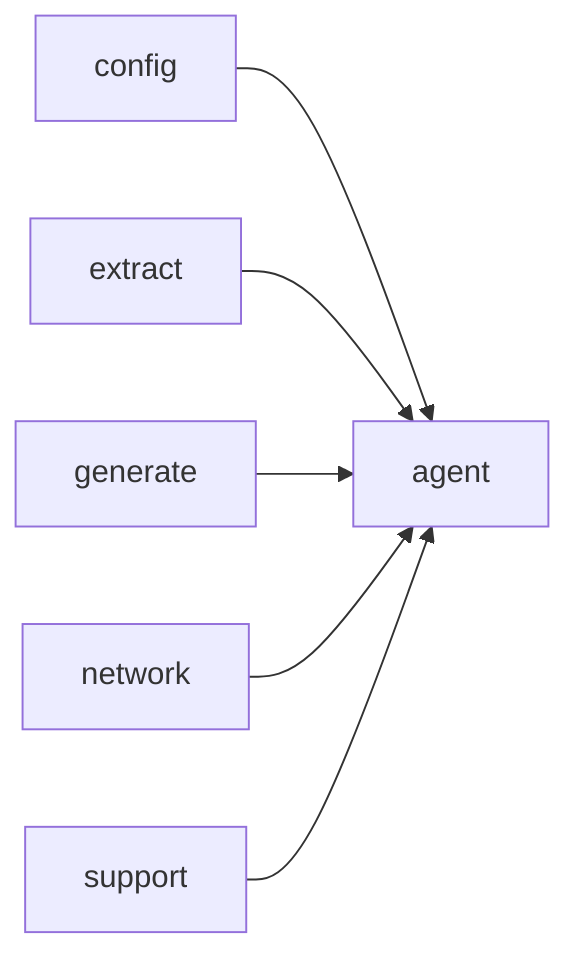

# Module `agent`

## Summary

`agent` 模块负责实现智能代理的核心循环，通过调用 LLM 并执行工具调用来自动探索代码库，最终在指定输出目录下生成指南文档。它对外提供两个主要接口：同步函数 `run_agent` 和异步函数 `run_agent_async`，两者均接受模型配置、输出路径等参数，并返回结果或错误。该模块依赖于 `config`、`extract`、`generate` 和 `network` 等模块，以完成配置读取、符号提取、文档生成与 LLM 通信。

## Imports

- [`config`](../config/index.md)
- [`extract`](../extract/index.md)
- [`generate`](../generate/index.md)
- [`network`](../network/index.md)
- `std`
- [`support`](../support/index.md)

## Dependency Diagram

## Types

### `clore::agent::AgentError`

Declaration: `agent/agent.cppm:21`

Definition: `agent/agent.cppm:21`

Declaration: [`Namespace clore::agent`](../../namespaces/clore/agent/index.md)

`clore::agent::AgentError` 的实现仅包含一个单一的 `std::string message` 字段，用于存储错误描述文本。其内部结构极为精简，不涉及额外的成员函数、继承或多态行为；整个类型本质上是一个字符串的轻量包装器。实例的存活期间，`message` 应始终持有有效的 `std::string` 值（默认构造时为空字符串），并可通过常规的复制、移动和赋值操作进行管理。

#### Invariants

- message should contain a non-empty string describing the error context

#### Key Members

- message

#### Usage Patterns

- returned as an error type from agent operations
- used to propagate error information via exceptions or result types

## Functions

### `clore::agent::run_agent`

Declaration: `agent/agent.cppm:27`

Definition: `agent/agent.cppm:524`

Declaration: [`Namespace clore::agent`](../../namespaces/clore/agent/index.md)

`clore::agent::run_agent` 的实现通过一个同步包装器简化了异步代理循环的调用。它首先创建一个 `kota::event_loop` 实例，然后构造一个由 `run_agent_async` 返回的协程任务，并将该任务调度到事件循环上。在调用 `loop.run()` 之后，该函数通过 `task.result()` 阻塞等待异步操作完成，若结果包含错误则返回 `std::unexpected`，否则返回代理成功创建的指南数量（类型为 `std::size_t`）。整个流程依赖 `kota::event_loop` 作为异步调度器，以及 `run_agent_async` 作为实际的代理循环实现，并利用 `std::expected` 统一处理来自 `AgentError` 的错误状态。

#### Side Effects

- Writes guide documents to the directory specified by `output_root`/guides/
- Executes and synchronizes asynchronous tasks via the event loop

#### Reads From

- `config::TaskConfig` parameter `config`
- `extract::ProjectModel` parameter `model`
- `std::string_view` parameter `llm_model`
- `std::string` parameter `output_root`
- Event loop internal state

#### Writes To

- Guide documents under `${output_root}/guides/`
- Returned `std::size_t` count of documents
- `AgentError` on failure

#### Usage Patterns

- Called to execute the full agent workflow synchronously from user-facing entry points
- Wraps the asynchronous `run_agent_async` in an event loop for blocking invocation

### `clore::agent::run_agent_async`

Declaration: `agent/agent.cppm:34`

Definition: `agent/agent.cppm:507`

Declaration: [`Namespace clore::agent`](../../namespaces/clore/agent/index.md)

`clore::agent::run_agent_async` 的实现以缓存索引加载开始：通过 `clore::generate::cache::load_cache_index` 从配置的工作空间根目录加载持久化的缓存条目，若成功则将结果移动至 `cache_index` 并记录信息日志，否则记录警告。随后通过 `co_await` 将执行委托给 `run_agent_loop`，该函数位于匿名命名空间中，负责实际的多轮代理循环和 LLM 交互。函数依赖于 `clore::generate::cache` 子系统的缓存能力，以及 `kota::event_loop` 提供的异步调度机制。

#### Side Effects

- Loads cache index from filesystem
- Logs cache load result
- Delegates to `run_agent_loop` which may perform I/O, tool calls, and output generation

#### Reads From

- config`.workspace_root`
- model
- `llm_model`
- `output_root`
- loop
- cache file via `load_cache_index`

#### Writes To

- `cache_index` local variable
- logging output
- output files via `run_agent_loop`

#### Usage Patterns

- Launch asynchronous agent with event loop
- Wrap synchronous agent with cache loading

## Internal Structure

`agent` 模块位于 `clore::agent` 命名空间下，对外暴露 `run_agent`（同步）和 `run_agent_async`（异步）两个入口函数，用于执行代码库探索与指南文档生成的核心业务循环。模块内部通过匿名命名空间封装了多个辅助组件：`run_agent_loop` 实现主循环逻辑，`serialize_completion_response` / `deserialize_completion_response` 处理 LLM 响应的序列化与反序列化，`run_tool_call` 封装具体工具调用，`hash_messages` 与 `make_agent_cache_key` 提供消息缓存键生成，`list_existing_guide_filenames` 枚举已有指南文件。这些内部函数与结构（如 `ToolCallResult`、`AgentError`）共同支撑起代理的流程编排与状态管理。

在依赖关系上，`agent` 模块导入 `config`、`extract`、`generate`、`network`、`support` 及 `std`，表明它位于业务编排层：配置加载依赖 `config`，符号提取依赖 `extract`，文档生成依赖 `generate`，LLM 通信依赖 `network`，基础工具（文件读写、哈希、路径处理）依赖 `support`。这种分层使得 `agent` 能够专注于循环调度与逻辑控制，而将具体技术细节交给下层模块处理。

## Related Pages

- [Module config](../config/index.md)
- [Module extract](../extract/index.md)
- [Module generate](../generate/index.md)
- [Module network](../network/index.md)
- [Module support](../support/index.md)

