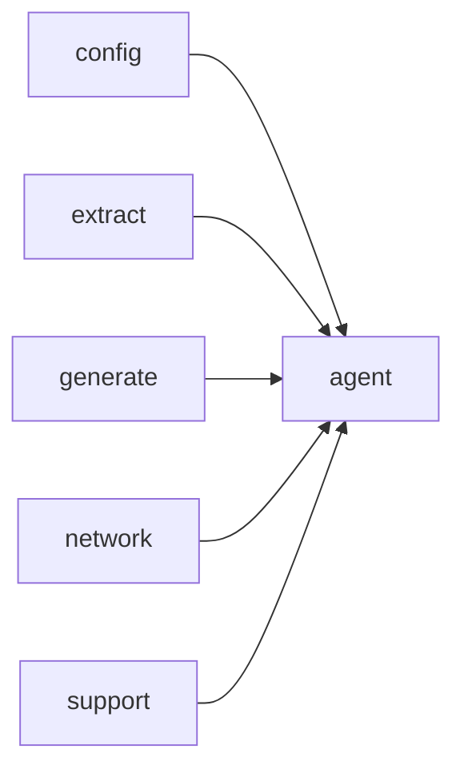

# Module `agent`

## Summary

`agent` 模块实现了驱动代码库探索与指南文档生成的代理循环。它负责编排与 LLM 的交互、解析模型响应、发起工具调用（如代码提取与生成），并将结果持久化到指定输出目录。该模块对外提供同步函数 `run_agent` 与异步函数 `run_agent_async`，两者均接收配置参数（如模型标识与输出根路径）并返回结果或错误。内部实现涵盖请求序列化/反序列化、消息缓存、工具调用分发及错误处理，依赖 `config`、`extract`、`generate`、`network` 和 `support` 模块提供底层能力。

## Imports

- [`config`](../config/index.md)
- [`extract`](../extract/index.md)
- [`generate`](../generate/index.md)
- [`network`](../network/index.md)
- `std`
- [`support`](../support/index.md)

## Dependency Diagram

## Types

### `clore::agent::AgentError`

Declaration: `agent/agent.cppm:21`

Definition: `agent/agent.cppm:21`

Declaration: [`Namespace clore::agent`](../../namespaces/clore/agent/index.md)

结构体 `clore::agent::AgentError` 的实现极为简单，其内部结构仅包含一个 `std::string` 类型的成员字段 `message`，用于存储错误描述文本。该结构体未定义任何自定义构造函数、析构函数或赋值运算符，因此是一个平凡的聚合类型，所有特殊成员函数均由编译器隐式生成。其内部不维护任何额外的不变量或状态，成员 `message` 可直接访问，对象生命周期及内存管理完全遵循默认规则。

#### Invariants

- 错误消息由调用方提供，无预设约束

#### Key Members

- `message`：存储错误描述字符串

#### Usage Patterns

- 作为返回值或异常的一部分传递错误信息

## Functions

### `clore::agent::run_agent`

Declaration: `agent/agent.cppm:27`

Definition: `agent/agent.cppm:524`

Declaration: [`Namespace clore::agent`](../../namespaces/clore/agent/index.md)

`clore::agent::run_agent` 是代理循环的同步入口点，负责协调异步执行并返回结果。其实现创建一个 `kota::event_loop` 实例，然后将输入参数转发给异步函数 `clore::agent::run_agent_async`。通过 `loop.schedule` 安排返回的任务，并调用 `loop.run` 阻塞当前线程直至事件循环完成。完成后，从 `task.result` 提取结果：若包含错误则返回 `std::unexpected`（包装 `clore::agent::AgentError`），否则返回 `std::size_t`（创建的指南数量）。整个函数的核心控制流依赖 `kota::event_loop` 的事件驱动模型，实际逻辑（包含工具调用、缓存检查、消息序列化等）由 `run_agent_async` 及其调用的内部函数（如 `run_agent_loop`、`run_tool_call`、`hash_messages` 等）实现。

#### Side Effects

- Writes guide documents to files under the output root
- Executes tool calls that may perform I/O or network operations
- Spawns and synchronizes asynchronous tasks via the event loop

#### Reads From

- config task configuration
- model project model
- `llm_model` identifier
- `output_root` output directory path

#### Writes To

- guide documents under `output_root`/guides/
- result of agent execution returned as `std::expected<std::size_t, AgentError>`

#### Usage Patterns

- Entry point for synchronous agent execution
- Used to produce guide documents from codebase analysis

### `clore::agent::run_agent_async`

Declaration: `agent/agent.cppm:34`

Definition: `agent/agent.cppm:507`

Declaration: [`Namespace clore::agent`](../../namespaces/clore/agent/index.md)

该函数首先调用 `clore::generate::cache::load_cache_index` 从配置的 workspace 根目录加载缓存索引；若成功则将结果移入局部变量 `cache_index`，否则记录一条警告日志。随后它通过 `co_await` 将控制权转移给 `run_agent_loop`，并以 `config`、`model`、`llm_model`、`output_root`、`cache_index` 以及事件循环 `loop` 作为参数。整个异步流程完全委托给 `run_agent_loop` 执行，后者负责实现主要代理循环、工具调用、缓存检查与消息序列化等核心逻辑。

#### Side Effects

- loads agent cache from disk via `load_cache_index`
- logs cache loading status (info or warn) using `logging::info` and `logging::warn`

#### Reads From

- `config.workspace_root` (from the `config::TaskConfig` parameter)
- the result of `load_cache_index` (cache file on disk)
- parameters: `config`, `model`, `llm_model`, `output_root`, `loop` (all passed to `run_agent_loop`)

#### Usage Patterns

- callers schedule the returned `kota::task` on the provided `kota::event_loop`
- used as the entry point for starting an asynchronous agent execution with cache management

## Internal Structure

`agent` 模块是 `clore` 中负责驱动 LLM 代理循环的核心模块，对外暴露 `run_agent` 和 `run_agent_async` 两个同步/异步入口，内部通过匿名命名空间中的 `run_agent_loop`、`run_tool_call`、`hash_messages`、`serialize_completion_response` 等辅助函数实现完整的“请求‑工具调用‑响应”循环。模块依赖 `config` 读取代理配置，依赖 `network` 与 LLM 后端通信，依赖 `extract` 和 `generate` 执行代码探索与指南生成，并依赖 `support` 提供缓存键计算、文件 I/O 等基础设施。内部层次清晰：公共接口处理参数校验和异步调度，将控制权交给 `run_agent_loop`，后者管理多轮对话状态，通过 `make_agent_cache_key` 和 `hash_messages` 实现缓存命中检测，利用 `list_existing_guide_filenames` 获取已有指南以影响工具调用策略。工具调用结果经 `run_tool_call` 分发，完成响应经 `serialize_completion_response` 序列化后持久化，整体上实现了“探索‑缓存‑生成”的职责分离。

## Related Pages

- [Module config](../config/index.md)
- [Module extract](../extract/index.md)
- [Module generate](../generate/index.md)
- [Module network](../network/index.md)
- [Module support](../support/index.md)

