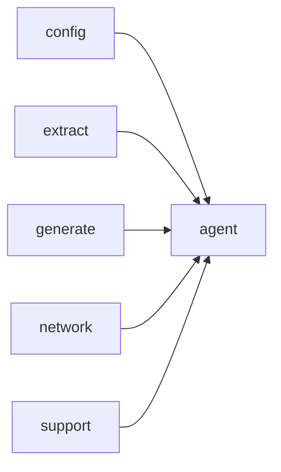

# Module `agent`

## Summary

`agent` 模块负责驱动 AI 代理循环，通过多次工具调用自动探索代码库，并在指定输出根目录下生成指南文档。它提供两个公开入口：同步函数 `run_agent` 返回生成的文档数量或错误信息；异步函数 `run_agent_async` 允许调用者将代理循环调度到给定的事件循环上执行，适用于非阻塞场景。

模块内部管理代理的系统提示、最大轮次、缓存键生成与命中判定、工具调用调度及结果序列化，以减少重复请求并提升循环效率。它依赖 `config`、`extract`、`generate`、`network` 和 `support` 等模块分别完成配置读取、代码提取、文档生成、LLM 网络交互与通用工具支持，从而将探索‑生成流程封装为统一的接口。

## Imports

- [`config`](../config/index.md)
- [`extract`](../extract/index.md)
- [`generate`](../generate/index.md)
- [`network`](../network/index.md)
- [`support`](../support/index.md)

## Dependency Diagram

```mermaid
graph LR
    M0["agent"]
    I0["config"]
    I0 --> M0
    I1["extract"]
    I1 --> M0
    I2["generate"]
    I2 --> M0
    I3["network"]
    I3 --> M0
    I4["support"]
    I4 --> M0
```

## Types

### `clore::agent::AgentError`

Declaration: `src/agent/agent.cppm:35`

Definition: `src/agent/agent.cppm:35`

Declaration: [`Namespace clore::agent`](../../namespaces/clore/agent/index.md)

`clore::agent::AgentError` 的实现极其简单，内部仅包含一个 `std::string` 类型的成员 `message`，用于存储描述性错误文本。该结构没有定义任何自定义构造函数、析构函数或赋值运算符，因此完全依赖编译期生成的默认成员函数来管理字符串的构造、复制、移动和析构。`message` 字段是唯一的状态来源，其有效性完全由调用方在构造或赋值时提供的内容保证，无需维护额外的不变量。这种轻量级设计使其主要作为携带错误信息的值类型使用，与标准库的异常机制或结果类型配合时不会引入额外的开销。

#### Invariants

- The `message` member holds an arbitrary string describing the error.
- The struct is default-constructible and copyable (implicitly).
- No additional error codes or metadata are stored.

#### Key Members

- `message` (`std::string`) – stores the error description.

#### Usage Patterns

- Used to report failures in agent operations, such as during initialization or execution.
- Can be returned or thrown as an error value in function results.
- May be caught or inspected to retrieve the error string.

## Functions

### `clore::agent::run_agent`

Declaration: `src/agent/agent.cppm:41`

Definition: `src/agent/agent.cppm:538`

Declaration: [`Namespace clore::agent`](../../namespaces/clore/agent/index.md)

`clore::agent::run_agent` 的实现是一个同步包装器，内部依赖异步核心 `clore::agent::run_agent_async` 和 `kota::event_loop`。算法上，它首先构造一个 `kota::event_loop` 实例 `loop`，然后调用 `run_agent_async` 并将参数转发（其中 `llm_model` 从 `std::string_view` 转换为 `std::string`，`output_root` 通过 `std::move` 转移所有权）以获得一个异步 `task`。该任务被调度到 `loop` 中，随后通过 `loop.run()` 阻塞当前线程直到事件循环完成。控制流完全由这个同步-异步桥接模式驱动，所有真实的代理循环逻辑（工具调用、消息缓存、引导文件生成等）均在异步路径中执行。

结果处理方面，`task.result()` 返回一个值或错误。若结果包含错误，函数通过 `std::unexpected` 构造 `std::expected<std::size_t, AgentError>` 并返回；否则解引用结果并返回其中的 `std::size_t`（代表生成的引导文档数量）。整个过程不涉及额外的错误恢复或重试逻辑，纯粹委托给异步层。依赖方面，除 `kota::event_loop` 和 `run_agent_async` 外，还隐含使用了 `config::TaskConfig`、`extract::ProjectModel` 以及 `AgentError` 类型。

#### Side Effects

- writes guide documents to directory `${output_root}/guides/`
- executes tool calls to explore the codebase

#### Reads From

- reads `config` parameter
- reads `model` parameter
- reads `llm_model` parameter
- reads `output_root` parameter

#### Writes To

- writes guide documents to the filesystem under `${output_root}/guides/`

#### Usage Patterns

- used as synchronous entry point to run agent loop
- called with a `TaskConfig`, `ProjectModel`, LLM model name, and output root directory

### `clore::agent::run_agent_async`

Declaration: `src/agent/agent.cppm:48`

Definition: `src/agent/agent.cppm:521`

Declaration: [`Namespace clore::agent`](../../namespaces/clore/agent/index.md)

函数 `clore::agent::run_agent_async` 首先尝试通过 `clore::generate::cache::load_cache_index` 从 `config.workspace_root` 加载缓存索引。若加载成功，则将结果移入本地 `cache_index` 变量并记录信息日志；若失败，则记录警告日志，此时 `cache_index` 保持默认构造的空状态（例如空的 `CacheIndex`）。随后，它通过 `co_await` 将控制流委托给 `run_agent_loop`，将 `config`、`model`、`llm_model`、`output_root` 以及构造好的 `cache_index` 一并传入，最终 `co_return` 该异步任务的结果。整个过程依赖于 `kota::event_loop` 的协程调度、缓存模块的序列化/反序列化能力，以及同伴函数 `run_agent_loop` 内的对话循环逻辑。

#### Side Effects

- 读取文件以加载缓存索引
- 记录日志信息（info 或 warn）

#### Reads From

- `config.workspace_root`
- `config` 参数
- `model` 参数
- `llm_model` 参数
- `output_root` 参数
- 缓存索引文件

#### Usage Patterns

- 调度返回的任务在 `kota::event_loop` 上执行
- 作为异步 agent 循环的启动点

## Internal Structure

模块 `agent` 是代理循环的实现，负责通过多轮工具调用探索代码库并生成指南文档。模块暴露两个公共入口：同步函数 `run_agent` 和异步函数 `run_agent_async`（后者接受 `kota::event_loop` 参数），均返回指示成功或错误的类型（`std::expected` 或 opaque 任务句柄）。内部实现按职责分解为多个匿名命名空间辅助函数，包括工具调用处理（`run_tool_call`）、消息哈希与缓存键构造（`hash_messages`、`make_agent_cache_key`）、完成响应的序列化/反序列化（`serialize_completion_response`、`deserialize_completion_response`）、现有指南文件扫描（`list_existing_guide_filenames`）以及核心主循环（`run_agent_loop`）。模块导入五个依赖模块：`config`（配置管理）、`extract`（代码提取与 AST 缓存）、`generate`（文档生成）、`network`（LLM 网络交互）和 `support`（通用工具与日志）。内部层次将 I/O 密集型操作（如 LLM 调用、文件写入）与状态管理（消息队列、缓存索引、代理配置）分离，通过 `kMaxAgentTurns` 等常量控制循环边界，并使用 `AgentError` 枚举统一表达关键错误。

## Related Pages

- [Module config](../config/index.md)
- [Module extract](../extract/index.md)
- [Module generate](../generate/index.md)
- [Module network](../network/index.md)
- [Module support](../support/index.md)

