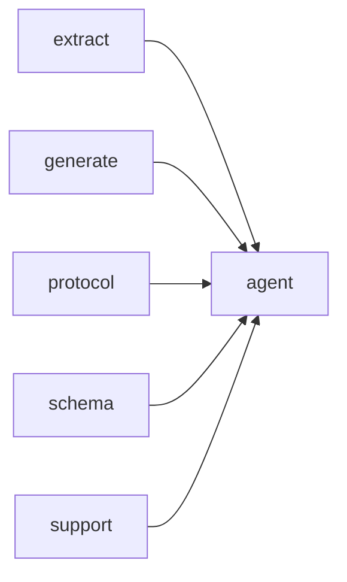

# Module `agent:tools`

## Summary

`agent:tools` 模块负责定义并实现智能体可调用的全部工具，职责涵盖工具注册、调度执行、参数验证与结果缓存。它公开了三个核心函数：`dispatch_tool_call` 根据工具名称和 JSON 参数执行对应工具，`build_tool_definitions` 返回注册的工具规格数量，`extract_string_arg` 安全地从参数对象中提取字符串值。模块内部维护了一个包含十二种工具（如 `ProjectOverviewTool`、`ListFilesTool`、`SearchSymbolsTool`、`ReadGuideTool` 等）的注册表，并通过 `ToolSpec` 描述每个工具的名称、可缓存性及构建/调度逻辑。工具实现依赖 `ToolContext`（提供项目路径、输出路径和模型标识）以及 `ToolResultCache` 以避免重复计算。该模块与 `extract`（代码结构提取）、`generate`（文档生成）等模块协作，共同支撑智能体的代码分析能力。

## Imports

- [`extract`](../extract/index.md)
- [`generate`](../generate/index.md)
- [`protocol`](../protocol/index.md)
- [`schema`](../schema/index.md)
- `std`
- [`support`](../support/index.md)

## Dependency Diagram

## Types

### `clore::agent::ToolError`

Declaration: `agent/tools.cppm:16`

Definition: `agent/tools.cppm:16`

Declaration: [`Namespace clore::agent`](../../namespaces/clore/agent/index.md)

结构体 `clore::agent::ToolError` 仅包含一个公开数据成员 `std::string message`，用于存储错误描述文本。该设计将错误信息直接封装为字符串，不引入额外状态或验证逻辑，其内部不变量可以认为 `message` 接受任意非空或空字符串（由使用者保证语义有效性）。没有自定义构造函数、析构函数或成员函数，完全依赖编译器生成的默认实现，因此不存在特殊构造、复制或移动的额外开销。该结构体的实现简化为一个轻量级错误承载类型，便于在工具调用失败时传递可读的描述信息。

## Variables

### `arguments`

Declaration: `agent/tools.cppm:621`

As a constant reference, `arguments` cannot be mutated through this variable. Its usage is not demonstrated in the provided evidence, so no specific consumption patterns are available.

#### Mutation

No mutation is evident from the extracted code.

### `context`

Declaration: `agent/tools.cppm:621`

作为常量引用，`context` 在其作用域内不可被修改，只能通过 `ToolContext` 的常量接口读取上下文数据。

#### Mutation

No mutation is evident from the extracted code.

## Functions

### `clore::agent::build_tool_definitions`

Declaration: `agent/tools.cppm:23`

Definition: `agent/tools.cppm:887`

Declaration: [`Namespace clore::agent`](../../namespaces/clore/agent/index.md)

函数 `clore::agent::build_tool_definitions` 通过遍历由 `clore::agent::(anonymous namespace)::tool_registry` 返回的常量引用 `std::array<clore::agent::(anonymous namespace)::ToolSpec, 12>` 来组装工具定义列表。它首先预分配一个 `std::vector<clore::net::FunctionToolDefinition>`，然后对数组中的每个 `ToolSpec` 调用其 `build_definition` 方法。若任意一个 `build_definition` 返回一个无值的结果（即 `std::unexpected`），函数会立即停止并将该 `clore::agent::ToolError` 错误向上传播；否则，将成功构造的定义移动到结果向量中。整个过程具有短路语义：只要有一个工具定义构建失败，整个调用就会失败。该函数的内部控制流完全依赖于 `tool_registry` 提供的工具规范集合，并且不涉及其他外部依赖。

#### Side Effects

No observable side effects are evident from the extracted code.

#### Reads From

- `tool_registry()` (static array of `ToolSpec`)
- `ToolSpec::build_definition()` for each tool

#### Usage Patterns

- Called to generate a complete set of tool definitions for network requests
- Used to prepare tool definitions before dispatching agent calls

### `clore::agent::dispatch_tool_call`

Declaration: `agent/tools.cppm:26`

Definition: `agent/tools.cppm:902`

Declaration: [`Namespace clore::agent`](../../namespaces/clore/agent/index.md)

函数 `clore::agent::dispatch_tool_call` 首先将 `arguments` 序列化为字符串以构造缓存键，并检查 `tool_result_cache` 中是否已有结果；若命中则直接返回。否则，它构造一个 `ToolContext`，遍历 `tool_registry` 中的每个 `ToolSpec`，查找与 `tool_name` 匹配的条目，然后调用其 `dispatch` 成员。若该工具标记为 `cacheable` 且调用成功，则结果被存入缓存；之后返回调度结果。若遍历结束后未找到匹配的工具，则返回一个包含未知工具消息的 `ToolError`。

#### Side Effects

- writes to `tool_result_cache` result cache under a unique lock when tool is cacheable and dispatch succeeds

#### Reads From

- `tool_result_cache()` global cache (under shared lock)
- `tool_registry()` global tool registry
- `tool_name`, `arguments`, `model`, `project_root`, `output_root` parameters
- `json::to_string(arguments)` result for cache key

#### Writes To

- `tool_result_cache().result_by_key` (under unique lock for cacheable tools)

#### Usage Patterns

- invoked during agent execution to handle a tool call from an LLM
- used with caching to avoid duplicate tool executions with identical arguments

### `clore::agent::extract_string_arg`

Declaration: `agent/tools.cppm:20`

Definition: `agent/tools.cppm:865`

Declaration: [`Namespace clore::agent`](../../namespaces/clore/agent/index.md)

函数 `clore::agent::extract_string_arg` 实现了一个基于线性扫描的字段查找算法，用于从一个 `json::Value` 对象中提取指定名称的字符串参数。首先验证输入参数 `arguments` 是否为对象（调用 `arguments.is_object()`），若不是则立即返回包含 `ToolError` 的 `std::unexpected`。然后通过 `arguments.get_object()` 获取底层对象指针，若指针为空也返回错误。接着遍历对象的所有条目，将每个条目的 `entry.key` 与目标 `field_name` 进行比较。当匹配成功时，尝试通过 `entry.value.get_string()` 获取值；若得到有效字符串则直接返回，否则返回一个指出该字段类型非字符串的错误（消息通过 `std::format` 构造）。若遍历完所有条目均未找到匹配键，则返回一个指出缺失字段的错误。整个函数依赖 `json::Value` 的接口、`std::expected` 的错误处理机制以及 `std::format` 进行字符串格式化。

#### Side Effects

No observable side effects are evident from the extracted code.

#### Reads From

- `arguments` parameter of type `json::Value`
- `field_name` parameter of type `std::string_view`
- object entries retrieved via `get_object()`

#### Usage Patterns

- extract string field from tool call arguments
- validate and retrieve string-typed JSON field
- used in `dispatch_tool_call` to parse tool arguments

## Internal Structure

该模块实现了供 LLM agent 调用的代码库探查工具集，依赖 `extract`、`generate`、`protocol`、`schema`、`support` 及标准库。内部按职责分为三层：工具实现层（如 `ListFilesTool`、`SearchSymbolsTool` 等，均匿名封装）、注册与调度层（通过 `tool_registry` 静态数组维护 `ToolSpec`，利用模板函数 `dispatch_reflected_tool` 和 `build_reflected_tool_definition` 实现元编程驱动的执行与定义生成）以及缓存层（`ToolResultCache` 使用 `mutex` 保护 `result_by_key` 映射）。对外仅暴露 `dispatch_tool_call`、`build_tool_definitions` 和 `extract_string_arg` 三个接口，所有工具均通过统一签名 `run(const Args&, const ToolContext&)` 运行，`ToolContext` 携带项目根、输出根与模型标识等上下文，确保调度器可按名称精确路由。

## Related Pages

- [Module extract](../extract/index.md)
- [Module generate](../generate/index.md)
- [Module protocol](../protocol/index.md)
- [Module schema](../schema/index.md)
- [Module support](../support/index.md)

