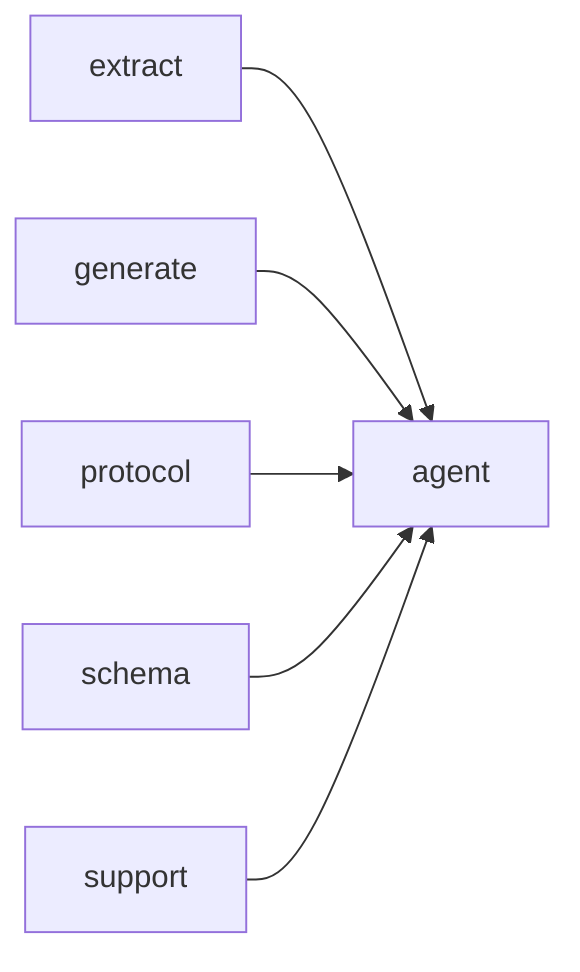

# Module `agent:tools`

## Summary

这个模块实现了 `clore::agent` 中所有可使用的工具，为智能代理提供与代码库交互的标准化能力。它定义了涵盖文件列表、符号搜索、模块浏览、命名空间查看、依赖查询、指南读写等任务的十余种具体工具，每种工具都封装为结构体并公开 `name`、`description`、`cacheable` 等元数据以及 `run` 方法，通过统一的 `ToolSpec` 注册表管理。模块的核心入口 `dispatch_tool_call` 接收工具名称与 JSON 参数，将其分派到对应的工具实现并返回结果；`build_tool_definitions` 用于构建所有工具的 `OpenAI` 兼容定义，供外部协议层使用。错误被统一表示为 `ToolError`，同时提供 `ToolContext`（包含项目根、输出目录、模型等上下文信息）和线程安全的 `ToolResultCache` 来优化重复查询。

在实现层面，模块大量借助 `extract`、`generate`、`support` 等底层模块完成符号提取、文档生成和文件读写，并依赖 `schema` 和 `protocol` 模块进行参数验证与响应格式化。内部通过匿名命名空间封装了辅助函数（如符号格式、文件名规范化、缓存管理）和工具参数类型（如 `NameArgs`、`SymbolQueryArgs`、`GuideArgs`），仅在模块间暴露 `dispatch_tool_call`、`build_tool_definitions` 和 `extract_string_arg` 三个公共函数，形成清晰的职责边界。

## Imports

- [`extract`](../extract/index.md)
- [`generate`](../generate/index.md)
- [`protocol`](../protocol/index.md)
- [`schema`](../schema/index.md)
- `std`
- [`support`](../support/index.md)

## Dependency Diagram

## Types

### `clore::agent::ToolError`

Declaration: `agent/tools.cppm:16`

Definition: `agent/tools.cppm:16`

Declaration: [`Namespace clore::agent`](../../namespaces/clore/agent/index.md)

结构体 `clore::agent::ToolError` 的内部实现仅包含一个 `std::string` 类型的数据成员 `message`。该字段用于存储与工具执行错误相关的描述性文本，是整个类型的唯一状态来源。由于没有自定义的构造函数、析构函数或赋值运算符，编译器会生成默认的特殊成员函数，因此对象复制、移动和销毁均遵循 `std::string` 的对应规则。该类型不维护额外的不变量：`message` 可以为任意字符串（包括空字符串），调用者负责保证其内容在错误上下文中具有语义含义。

## Variables

### `arguments`

Declaration: `agent/tools.cppm:621`

该变量提供了对 JSON 值的只读访问，常用于函数参数，以避免复制并确保数据不被修改。

#### Mutation

No mutation is evident from the extracted code.

### `context`

Declaration: `agent/tools.cppm:621`

As a `const` reference, `context` provides read-only access to the underlying `ToolContext` object, likely used to query tool state or parameters without modifying it.

#### Mutation

No mutation is evident from the extracted code.

## Functions

### `clore::agent::build_tool_definitions`

Declaration: `agent/tools.cppm:23`

Definition: `agent/tools.cppm:887`

Declaration: [`Namespace clore::agent`](../../namespaces/clore/agent/index.md)

函数 `clore::agent::build_tool_definitions` 遍历由 `tool_registry()` 返回的静态工具规范数组，依次调用每个 `ToolSpec` 的 `build_definition` 成员函数。一旦某个工具的定义构建失败，函数立即返回 `std::unexpected`，携带相应的 `ToolError`；只有所有工具都成功生成 `clore::net::FunctionToolDefinition` 后，函数才返回包含完整定义向量的成功结果。该函数依赖 `tool_registry()` 作为唯一的外部数据源，其余逻辑完全由内部循环和错误传播构成。

#### Side Effects

No observable side effects are evident from the extracted code.

#### Reads From

- `tool_registry()`
- `ToolSpec` objects

#### Writes To

- returned `std::vector<FunctionToolDefinition>`

#### Usage Patterns

- called to prepare tool definitions for a chat API request
- used in agent initialization

### `clore::agent::dispatch_tool_call`

Declaration: `agent/tools.cppm:26`

Definition: `agent/tools.cppm:902`

Declaration: [`Namespace clore::agent`](../../namespaces/clore/agent/index.md)

函数 `clore::agent::dispatch_tool_call` 首先将传入的 `arguments` JSON序列化为字符串，并以 `tool_name` 与序列化后的参数拼接生成 `cache_key`。通过 `tool_result_cache()` 获取全局的 `ToolResultCache&`，在共享锁下查询缓存（`cache.result_by_key`）；若命中则直接返回缓存值。若未命中，则构造 `ToolContext`（携带 `model`、`project_root`、`output_root`），然后遍历 `tool_registry()` 返回的 `std::array<ToolSpec, 12>`，逐一比较 `tool.name` 与 `tool_name`。匹配成功后调用 `tool.dispatch` 执行对应的工具实现；若该 `tool.cacheable` 为 `true` 且调用成功，则在唯一锁下将结果存入缓存。若遍历结束未找到匹配工具，则返回包含未知工具名称的 `ToolError`。

#### Side Effects

- Modifies tool result cache
- Acquires shared and unique locks on cache mutex

#### Reads From

- `tool_name`
- `arguments`
- `model`
- `project_root`
- `output_root`
- `tool_registry()`
- `tool_result_cache()`

#### Writes To

- `tool_result_cache().result_by_key`

#### Usage Patterns

- Called to handle tool execution requests
- Used by agent loop to dispatch tool calls

### `clore::agent::extract_string_arg`

Declaration: `agent/tools.cppm:20`

Definition: `agent/tools.cppm:865`

Declaration: [`Namespace clore::agent`](../../namespaces/clore/agent/index.md)

This helper unbox a required string field from a JSON object argument. It first validates that the top‑level value is an object, returning a `ToolError` if not. It then schedules a linear scan of the object’s entries, comparing each entry key to the target `field_name`. On a match, it extracts a string via `entry.value.get_string()`—if that fails, a `ToolError` reports that the field is not a string. If the loop completes without a match, a `ToolError` indicates the field is missing.  

The function relies on `json::Value`’s object inspection and iteration interface, `std::expected` for fallible return, and `std::format` for composing error messages. Its error‑first control flow ensures every exit path carries a descriptive `ToolError::message`.

#### Side Effects

No observable side effects are evident from the extracted code.

#### Reads From

- parameter `arguments` of type `const json::Value &`
- parameter `field_name` of type `std::string_view`

#### Usage Patterns

- Called by `dispatch_tool_call` to extract required string arguments from tool invocation JSON

## Internal Structure

模块 `agent:tools` 定义了一套可复用的工具集合，用于代码库浏览、符号查询和自动化文档生成。它通过内部注册表统一管理所有工具，每个工具由 `ToolSpec` 描述其名称、可缓存性、定义构建函数和调度函数。运行时上下文通过 `ToolContext` 提供项目根路径、输出根路径以及 LLM 模型引用。工具实现分散在 `ListFilesTool`、`SearchSymbolsTool`、`GetModuleTool` 等结构中，每个结构通过 `run` 方法执行具体逻辑，并依赖导入的 `extract`、`generate`、`protocol`、`schema`、`support` 等模块完成符号查询、协议解析和路径处理等底层操作。

从内部结构看，模块使用匿名命名空间将工具注册表（`tool_registry` 返回的 `std::array<ToolSpec, 12>`）、结果缓存（`ToolResultCache`，包含互斥锁和键值映射）以及大量辅助函数（如 `tool_list_modules`、`tool_get_dependencies`、`append_symbol_briefs` 等）封装为内部实现层。公共入口 `dispatch_tool_call` 根据工具名称查找注册表中的 `ToolSpec`，并调用其 `dispatch` 函数分发执行；`build_tool_definitions` 负责构建所有工具的定义集合。每个工具通过模板辅助函数 `dispatch_reflected_tool` 和 `make_tool_spec` 实现参数自动提取与结果格式化，保持了实现的一致性和可扩展性。同时，模块还封装了指南文件的读写（`write_guide`、`read_guide`），确保与 `generate` 模块的输出区域正确交互。

## Related Pages

- [Module extract](../extract/index.md)
- [Module generate](../generate/index.md)
- [Module protocol](../protocol/index.md)
- [Module schema](../schema/index.md)
- [Module support](../support/index.md)

