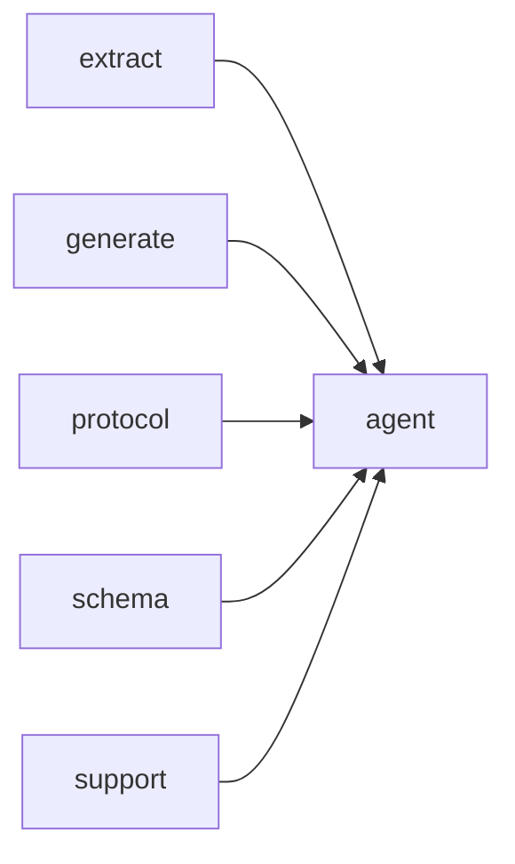

# Module `agent:tools`

## Summary

该模块负责定义并实现一组由 AI 代理调用的工具，用于与 Clore 代码项目进行交互。它提供了统一的工具注册、参数提取、分派执行以及结果缓存机制，将每个具体工具（如列出文件、搜索符号、查询模块或命名空间、读写开发指南等）封装为独立的 `ToolImpl` 结构，每个结构通过其 `run` 方法接收 `Args` 和 `ToolContext`，并返回成功或错误的字符串结果。模块对外暴露 `build_tool_definitions`（生成工具元数据）和 `dispatch_tool_call`（根据工具名称和 JSON 参数分派执行）作为主要入口，同时定义了 `ToolSpec`、`ToolContext`、`ToolError`、`ToolResultCache` 等支撑类型，并与 `extract`、`generate`、`protocol`、`schema`、`support` 模块协作，从而实现从项目提取到工具执行的完整链路。

## Imports

- [`extract`](../extract/index.md)
- [`generate`](../generate/index.md)
- [`protocol`](../protocol/index.md)
- [`schema`](../schema/index.md)
- [`support`](../support/index.md)

## Dependency Diagram

```mermaid
graph LR
    M0["agent"]
    I0["extract"]
    I0 --> M0
    I1["generate"]
    I1 --> M0
    I2["protocol"]
    I2 --> M0
    I3["schema"]
    I3 --> M0
    I4["support"]
    I4 --> M0
```

## Types

### `clore::agent::ToolError`

Declaration: `src/agent/tools.cppm:28`

Definition: `src/agent/tools.cppm:28`

Declaration: [`Namespace clore::agent`](../../namespaces/clore/agent/index.md)

`clore::agent::ToolError` 的内部结构仅包含一个 `std::string` 成员 `message`，用于携带错误描述文本。该成员是整个结构体的唯一数据载体，没有引入额外的标志位或状态域，因此其复制、移动及析构行为完全由 `std::string` 的相应操作隐式完成。由于 `message` 允许为空字符串，从实现角度看，该结构体不存在特殊的内部不变式；但在常规使用中，通过构造函数或赋值操作设置非空 `message` 是构造有效错误对象的预期方式。

#### Invariants

- `message` 不为空时表示发生了具体错误
- 类型仅包含一个字符串成员，无额外状态

#### Key Members

- `clore::agent::ToolError::message` 存储错误描述

#### Usage Patterns

- 作为工具执行失败时的返回类型或异常抛出对象
- 可通过读取 `message` 获取错误详情

## Variables

### `arguments`

Declaration: `src/agent/tools.cppm:633`

作为 `const` 引用，`arguments` 提供对底层 `json::Value` 的只读访问，在函数或代码块中用于读取 JSON 数据而不进行修改。

#### Mutation

No mutation is evident from the extracted code.

#### Usage Patterns

- 通过 `const` 引用读取 JSON 值

### `context`

Declaration: `src/agent/tools.cppm:633`

As a `const` reference, `context` cannot be mutated after initialization. It is intended to be passed to other functions or used within the current scope without the risk of modification. The evidence does not show any specific read operations or surrounding logic.

#### Mutation

No mutation is evident from the extracted code.

#### Usage Patterns

- no explicit usage shown in evidence

## Functions

### `clore::agent::build_tool_definitions`

Declaration: `src/agent/tools.cppm:35`

Definition: `src/agent/tools.cppm:899`

Declaration: [`Namespace clore::agent`](../../namespaces/clore/agent/index.md)

函数 `clore::agent::build_tool_definitions` 的核心算法是通过调用 `tool_registry()` 获取包含 12 个 `ToolSpec` 的预定义工具规范数组，然后对每个 `ToolSpec` 依次执行其 `build_definition` 成员（类型为返回 `std::expected<clore::net::FunctionToolDefinition, ToolError>` 的可调用对象）。如果任何一个 `build_definition` 返回错误，函数会立即将 `ToolError` 包装为 `std::unexpected` 并提前返回；否则将所有成功构建的 `FunctionToolDefinition` 收集到一个 `std::vector` 中。整个过程依赖 `ToolSpec` 中封装的构建逻辑，并利用 `std::expected` 进行错误传播，最终将内部工具定义统一转换为对外可用的格式。

内部控制流是一个简单的 range-for 循环，每次迭代调用 `tool.build_definition()` 并检查其 `has_value()` 以决定继续或终止。该函数不直接处理参数或上下文，其行为完全由 `tool_registry()` 返回的静态数组内容驱动，故调用方可在编译期枚举所有支持的工具定义。

#### Side Effects

- Dynamic memory allocation for the returned `std::vector`

#### Reads From

- `clore::agent::(anonymous namespace)::tool_registry()`

#### Usage Patterns

- Called to obtain tool definitions for an AI agent interaction

### `clore::agent::dispatch_tool_call`

Declaration: `src/agent/tools.cppm:38`

Definition: `src/agent/tools.cppm:914`

Declaration: [`Namespace clore::agent`](../../namespaces/clore/agent/index.md)

函数 `clore::agent::dispatch_tool_call` 首先对传入的 `arguments` 进行 JSON 序列化得到 `encoded_arguments`，然后构造 `cache_key`（格式为 `"{tool_name}:{encoded_arguments}"`）。它使用全局单例 `tool_result_cache` 中的共享锁尝试查找缓存：若命中则直接返回缓存结果，避免重复执行相同工具调用。未命中时，构造 `ToolContext`（包含 `model`、`project_root`、`output_root`）并遍历 `tool_registry()` 返回的 `ToolSpec` 数组，匹配 `tool.name` 与 `tool_name`。匹配成功后调用 `tool.dispatch(arguments, context)` 执行具体工具；若该工具 `cacheable` 为 `true` 且执行成功，则用独享锁将结果存入缓存。若整个遍历未找到匹配的工具，则返回 `ToolError`，错误信息标记为未知工具。整个算法依赖 `tool_result_cache` 和静态的 `tool_registry` 来解耦工具查找与缓存管理。

#### Side Effects

- modifies `tool_result_cache()` by inserting or updating cache entries

#### Reads From

- `tool_name`
- `arguments`
- `model`
- `project_root`
- `output_root`
- `tool_result_cache()`
- `tool_registry()`
- `cache_key` derived from `tool_name` and `arguments`

#### Writes To

- `tool_result_cache()`

#### Usage Patterns

- used by `run_agent` or `run_agent_async` to execute a tool call
- called with tool name and arguments extracted from LLM response
- return result string or error

### `clore::agent::extract_string_arg`

Declaration: `src/agent/tools.cppm:32`

Definition: `src/agent/tools.cppm:877`

Declaration: [`Namespace clore::agent`](../../namespaces/clore/agent/index.md)

该函数首先验证参数是否为 JSON 对象：若 `arguments` 不是对象则直接返回包含 `ToolError` 的 `std::unexpected`，其中错误消息为 `"arguments is not an object"`。通过 `get_object` 获取内部对象指针，若指针为空则返回类似错误。随后遍历对象的每个键值对，对每个 `entry.first` 与目标 `field_name` 进行相等比较。一旦匹配，尝试调用 `entry.second.get_string()` 以提取字符串值；若成功则返回该字符串，否则返回错误指明该字段不是字符串类型。若遍历完所有字段仍未找到匹配项，则返回 `std::unexpected` 报告缺少指定字段。此实现依赖 `json::Value` 的泛型对象迭代接口及 `ToolError` 结构体，并使用 `std::format` 构造描述性错误消息。

#### Side Effects

No observable side effects are evident from the extracted code.

#### Reads From

- 参数 `arguments` 的 JSON 对象内容
- 参数 `field_name` 作为键

#### Usage Patterns

- 在 `dispatch_tool_call` 中用于从工具调用参数中提取字符串字段

## Internal Structure

`agent:tools` 模块为大型语言模型提供一组可调用的工具，用于查询代码库和生成文档。它导入 `extract`、`generate`、`protocol`、`schema` 和 `support` 模块，分别负责代码提取、文档生成、LLM 协议、JSON Schema 映射及通用支持。内部按功能分层：公共入口 `dispatch_tool_call` 根据工具名称从静态注册表（`tool_registry` 中的 `ToolSpec` 数组）分发调用；单个工具实现（如 `SearchSymbolsTool`、`GetNamespaceTool`）位于匿名命名空间，通过模板反射（`dispatch_reflected_tool`、`build_reflected_tool_definition`）统一处理参数解析和结果缓存；`ToolContext` 提供项目根目录、输出目录和模型配置；`ToolResultCache` 管理可缓存工具的结果以减少重复计算。

## Related Pages

- [Module extract](../extract/index.md)
- [Module generate](../generate/index.md)
- [Module protocol](../protocol/index.md)
- [Module schema](../schema/index.md)
- [Module support](../support/index.md)

