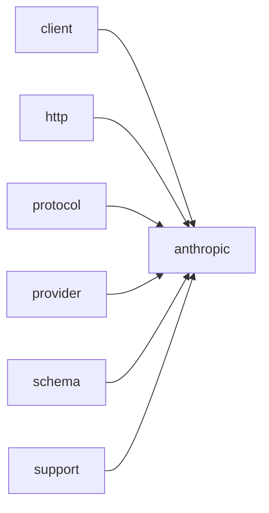

# Module `anthropic`

## Summary

`clore::net::anthropic` 模块是 `clore::net` 库中专用于与 Anthropic Claude API 交互的核心组件。它通过公开的异步调用函数（如 `call_llm_async`、`call_completion_async` 和模板化的 `call_structured_async`）封装了向 Messages API 发送请求并处理响应的完整流程。该模块负责构建符合 Anthropic 协议的消息结构、工具调用和结构化输出，管理 API 密钥及基础 URL 等环境配置，并将原始 HTTP 响应解析为可用的内部表示。

在实现层面，该模块将其职责划分为 `protocol`、`detail` 和 `schema` 等子命名空间。`protocol` 子模块提供了构建请求 URL、生成请求 JSON、解析文本与工具参数等公开辅助函数；`detail` 子模块包含协议实现细节（如 `Protocol` 类、环境变量常量和内部消息构建函数）；`schema` 子模块则负责生成工具和响应格式的 JSON Schema 定义。整体上，模块依赖 `client`、`http`、`provider`、`schema` 和 `support` 等底层基础设施，为上层应用提供简洁的异步 LLM 交互接口。

## Imports

- [`client`](../client/index.md)
- [`http`](../http/index.md)
- [`protocol`](../protocol/index.md)
- [`provider`](../provider/index.md)
- [`schema`](../schema/index.md)
- `std`
- [`support`](../support/index.md)

## Dependency Diagram



## Types

### `clore::net::anthropic::detail::Protocol`

Declaration: `network/anthropic.cppm:654`

Definition: `network/anthropic.cppm:654`

Declaration: [`Namespace clore::net::anthropic::detail`](../../namespaces/clore/net/anthropic/detail/index.md)

`Protocol` 是一个纯静态结构体，作为 Anthropic provider 的协议适配器。所有成员方法均为静态，通过委托至 `clore::net::anthropic::protocol` 命名空间下的底层实现来完成请求构建与响应解析工作。其内部维护一个关键不变式：所有请求的构建依赖于一个由 `read_environment` 从环境变量读取的 `EnvironmentConfig`，其中包含 `api_base` 和 `api_key`；`build_headers` 据此构造包含 `Content-Type`、`x-api-key` 以及 `anthropic-version` 的 HTTP 头部；`build_url` 调用 `build_messages_url` 生成完整的请求 URL。`build_request_json` 与 `parse_response` 分别负责序列化 `CompletionRequest` 和反序列化原始 HTTP 响应。后者的实现中特别处理了空响应体和 HTTP 状态码 >=400 的情况：当响应体为空时直接返回错误；当状态码指示失败时，将状态码与响应摘要（或仅状态码）合并为格式化的 `LLMError`。`capability_probe_key` 通过组合提供者名称、基础 URL 及模型名称生成用于能力探测的键，这依赖于 `EnvironmentConfig` 和 `CompletionRequest` 中的 `model` 字段。整个设计将 Anthropic 特有的协议细节封装在 `detail` 命名空间内，对外暴露统一的 `CompletionRequest`/`CompletionResponse` 接口。

#### Invariants

- All member functions are static and have no side effects beyond their return values
- No mutable state is stored in the struct
- Credentials are obtained exclusively from environment variables specified by `kAnthropicBaseUrlEnv` and `kAnthropicApiKeyEnv`
- API version is fixed via `kAnthropicVersion`
- Delegation to `clore::net::anthropic::protocol` functions is consistent for request building and response parsing

#### Key Members

- `read_environment`
- `build_url`
- `build_headers`
- `build_request_json`
- `parse_response`
- `provider_name`
- `capability_probe_key`

#### Usage Patterns

- Used as a protocol policy in generic LLM networking code that expects static methods for each lifecycle step
- Provides a uniform interface for Anthropic so that higher‑level machinery can be provider‑agnostic
- Expected to be thread‑safe because it holds no state and all methods are stateless

#### Member Functions

##### `clore::net::anthropic::detail::Protocol::build_headers`

Declaration: `network/anthropic.cppm:667`

Definition: `network/anthropic.cppm:667`

Declaration: [`Namespace clore::net::anthropic::detail`](../../namespaces/clore/net/anthropic/detail/index.md)

###### Implementation

```cpp
static auto build_headers(const clore::net::detail::EnvironmentConfig& environment)
        -> std::vector<kota::http::header> {
        return std::vector<kota::http::header>{
            kota::http::header{
                               .name = "Content-Type",
                               .value = "application/json; charset=utf-8",
                               },
            kota::http::header{
                               .name = "x-api-key",
                               .value = environment.api_key,
                               },
            kota::http::header{
                               .name = "anthropic-version",
                               .value = std::string(kAnthropicVersion),
                               },
        };
    }
```

##### `clore::net::anthropic::detail::Protocol::build_request_json`

Declaration: `network/anthropic.cppm:685`

Definition: `network/anthropic.cppm:685`

Declaration: [`Namespace clore::net::anthropic::detail`](../../namespaces/clore/net/anthropic/detail/index.md)

###### Implementation

```cpp
static auto build_request_json(const CompletionRequest& request)
        -> std::expected<std::string, LLMError> {
        return clore::net::anthropic::protocol::build_request_json(request);
    }
```

##### `clore::net::anthropic::detail::Protocol::build_url`

Declaration: `network/anthropic.cppm:663`

Definition: `network/anthropic.cppm:663`

Declaration: [`Namespace clore::net::anthropic::detail`](../../namespaces/clore/net/anthropic/detail/index.md)

###### Implementation

```cpp
static auto build_url(const clore::net::detail::EnvironmentConfig& environment) -> std::string {
        return clore::net::anthropic::protocol::build_messages_url(environment.api_base);
    }
```

##### `clore::net::anthropic::detail::Protocol::capability_probe_key`

Declaration: `network/anthropic.cppm:717`

Definition: `network/anthropic.cppm:717`

Declaration: [`Namespace clore::net::anthropic::detail`](../../namespaces/clore/net/anthropic/detail/index.md)

###### Implementation

```cpp
static auto capability_probe_key(const clore::net::detail::EnvironmentConfig& environment,
                                     const CompletionRequest& request) -> std::string {
        return clore::net::make_capability_probe_key(provider_name(),
                                                     environment.api_base,
                                                     request.model);
    }
```

##### `clore::net::anthropic::detail::Protocol::parse_response`

Declaration: `network/anthropic.cppm:690`

Definition: `network/anthropic.cppm:690`

Declaration: [`Namespace clore::net::anthropic::detail`](../../namespaces/clore/net/anthropic/detail/index.md)

###### Implementation

```cpp
static auto parse_response(const clore::net::detail::RawHttpResponse& raw_response)
        -> std::expected<CompletionResponse, LLMError> {
        if(raw_response.body.empty()) {
            return std::unexpected(LLMError("empty response from Anthropic"));
        }

        auto parsed = clore::net::anthropic::protocol::parse_response(raw_response.body);
        if(!parsed.has_value()) {
            if(raw_response.http_status >= 400) {
                return std::unexpected(
                    LLMError(std::format("Anthropic request failed with HTTP {}: {}",
                                         raw_response.http_status,
                                         clore::net::detail::excerpt_for_error(raw_response.body))));
            }
            return std::unexpected(std::move(parsed.error()));
        }
        if(raw_response.http_status >= 400) {
            return std::unexpected(LLMError(
                std::format("Anthropic request failed with HTTP {}", raw_response.http_status)));
        }
        return std::move(*parsed);
    }
```

##### `clore::net::anthropic::detail::Protocol::provider_name`

Declaration: `network/anthropic.cppm:713`

Definition: `network/anthropic.cppm:713`

Declaration: [`Namespace clore::net::anthropic::detail`](../../namespaces/clore/net/anthropic/detail/index.md)

###### Implementation

```cpp
static auto provider_name() -> std::string_view {
        return "Anthropic";
    }
```

##### `clore::net::anthropic::detail::Protocol::read_environment`

Declaration: `network/anthropic.cppm:655`

Definition: `network/anthropic.cppm:655`

Declaration: [`Namespace clore::net::anthropic::detail`](../../namespaces/clore/net/anthropic/detail/index.md)

###### Implementation

```cpp
static auto read_environment()
        -> std::expected<clore::net::detail::EnvironmentConfig, LLMError> {
        return clore::net::detail::read_credentials(clore::net::detail::CredentialEnv{
            .base_url_env = kAnthropicBaseUrlEnv,
            .api_key_env = kAnthropicApiKeyEnv,
        });
    }
```

## Variables

### `clore::net::anthropic::detail::kAnthropicApiKeyEnv`

Declaration: `network/anthropic.cppm:651`

Declaration: [`Namespace clore::net::anthropic::detail`](../../namespaces/clore/net/anthropic/detail/index.md)

It defines the environment variable name expected to contain the Anthropic API key, used in conjunction with the `environment` variable to retrieve the key at runtime.

#### Mutation

No mutation is evident from the extracted code.

### `clore::net::anthropic::detail::kAnthropicBaseUrlEnv`

Declaration: `network/anthropic.cppm:650`

Declaration: [`Namespace clore::net::anthropic::detail`](../../namespaces/clore/net/anthropic/detail/index.md)

该常量提供一个字符串字面量，表示一个环境变量键。由于其 `constexpr` 性质，值固定不变，程序可能在运行时通过读取同名环境变量来获取自定义的 API 基 URL。当前证据未展示具体的使用代码路径。

#### Mutation

No mutation is evident from the extracted code.

### `clore::net::anthropic::detail::kAnthropicVersion`

Declaration: `network/anthropic.cppm:652`

Declaration: [`Namespace clore::net::anthropic::detail`](../../namespaces/clore/net/anthropic/detail/index.md)

This variable holds the value `"2023-06-01"` and is intended to be used as the version identifier in HTTP requests to the Anthropic API. It is a read-only constant, typically included in request headers or payloads to specify the API version.

#### Mutation

No mutation is evident from the extracted code.

#### Usage Patterns

- Used as API version identifier in HTTP requests

### `clore::net::anthropic::protocol::detail::kDefaultMaxTokens`

Declaration: `network/anthropic.cppm:23`

Declaration: [`Namespace clore::net::anthropic::protocol::detail`](../../namespaces/clore/net/anthropic/protocol/detail/index.md)

This constant is read by `clore::net::anthropic::protocol::build_request_json` to set a fallback value when no explicit maximum token limit is provided. It participates in request construction logic as a default parameter.

#### Mutation

No mutation is evident from the extracted code.

#### Usage Patterns

- Used as default maximum token value in `build_request_json`

## Functions

### `clore::net::anthropic::call_completion_async`

Declaration: `network/anthropic.cppm:729`

Definition: `network/anthropic.cppm:771`

Declaration: [`Namespace clore::net::anthropic`](../../namespaces/clore/net/anthropic/index.md)

该函数是 `clore::net::call_completion_async` 模板的一个特化实例化，使用 `clore::net::anthropic::detail::Protocol` 作为协议策略参数。内部流程上，它通过协程 `co_await` 等待底层实现完成任务，然后调用 `.or_fail()` 方法将潜在的 `LLMError` 传播给调用者。依赖关系集中在 `detail::Protocol` 上，该协议封装了Anthropic API 的特定于端点的逻辑，包括由 `detail::Protocol::build_request_json`、`detail::Protocol::build_url`、`detail::Protocol::build_headers` 和 `detail::Protocol::parse_response` 等方法实现的请求构建与响应解析。所有与 HTTP 通信及结果协调的复杂部分都由 `clore::net` 命名空间中的通用协程基础设施处理。

#### Side Effects

- Initiates an asynchronous network I/O operation to the Anthropic completion endpoint.

#### Reads From

- `CompletionRequest request` (by value, reads from the passed object)
- `kota::event_loop& loop`

#### Usage Patterns

- Used to perform asynchronous completion requests to the Anthropic API
- Typically awaited by callers in a coroutine context

### `clore::net::anthropic::call_llm_async`

Declaration: `network/anthropic.cppm:739`

Definition: `network/anthropic.cppm:789`

Declaration: [`Namespace clore::net::anthropic`](../../namespaces/clore/net/anthropic/index.md)

该函数是 `clore::net::anthropic` 命名空间中面向 Anthropic API 的高层封装，它通过协程委托给模板化的 `clore::net::call_llm_async<detail::Protocol>`，以 `detail::Protocol` 作为策略类处理协议细节。内部实现中，`call_llm_async` 将 `model`、`system_prompt` 及 `prompt` 原样传递给泛型函数，并将 `loop` 的指针传入以绑定事件循环的异步执行环境。返回的 `kota::task` 通过 `.or_fail()` 将内部错误统一转换为 `LLMError` 异常或错误码形式，从而对外提供一致的接口签名。整个流程不涉及自定义重试或流控逻辑，完全依赖底层 `Protocol` 实现中的构建请求、解析响应以及环境变量读取（如 `kAnthropicApiKeyEnv` 与 `kAnthropicBaseUrlEnv`）等行为。

#### Side Effects

- triggers an HTTP request to the Anthropic API
- allocates memory for the coroutine frame and the returned task
- may invoke I/O completion callbacks on the event loop

#### Reads From

- the `model` parameter
- the `system_prompt` parameter
- the `prompt` parameter
- the `loop` parameter (`kota::event_loop` reference)
- the return value of the inner `clore::net::call_llm_async` call

#### Writes To

- the coroutine promise object (indirectly through `co_return`)
- the task result storage (through the returned task)

#### Usage Patterns

- called by higher-level Anthropic wrappers to interact with the model
- used when asynchronous LLM completion with a system prompt is needed

### `clore::net::anthropic::call_llm_async`

Declaration: `network/anthropic.cppm:733`

Definition: `network/anthropic.cppm:778`

Declaration: [`Namespace clore::net::anthropic`](../../namespaces/clore/net/anthropic/index.md)

该函数是一个协程包装器，其核心算法完全委托给模板函数 `clore::net::call_llm_async`，并以 `clore::net::anthropic::detail::Protocol` 作为策略参数。调用者提供的 `model`、`system_prompt`、`PromptRequest` 以及事件循环指针被原样转发；`kota::task` 返回类型通过 `.or_fail()` 将内部错误转换为协程异常，从而对外暴露统一的 `LLMError` 错误类型。整个实现不包含 Anthropic 专有逻辑，而是依赖模板特化来注入协议细节。

内部控制流由 `detail::Protocol` 驱动，该策略类负责从环境变量（如 `clore::net::anthropic::detail::kAnthropicApiKeyEnv` 和 `clore::net::anthropic::detail::kAnthropicBaseUrlEnv`）读取认证凭据与 API 基础 URL，通过 `build_request_json`、`build_url`、`build_headers` 等成员函数构造 HTTP 请求，并在收到响应后调用 `parse_response` 进行 JSON 解析。响应解析会处理 `stop_reason`、`content_value` 以及可选的工具调用输出，并支持通过 `protocol::detail::validate_request` 和 `protocol::detail::format_schema_instruction` 进行结构化输出约束。所有请求构建和响应处理均使用 `int` 类型表示中间 JSON 节点，最终将文本内容提取为 `std::string` 返回。

#### Side Effects

- 执行对 Anthropic API 的异步 HTTP 请求
- 可能触发网络 I/O 和事件循环回调
- 分配协程帧和相关缓冲区

#### Reads From

- 参数 `model` 字符串
- 参数 `system_prompt` 字符串
- 参数 `request` 对象
- 参数 `loop` 事件循环引用
- 模板参数 `detail::Protocol` 定义的协议

#### Usage Patterns

- 作为异步 LLM 调用的入口点
- 被需要非阻塞大语言模型交互的协程或任务驱动代码调用
- 常与 `kota::event_loop` 结合使用实现并发

### `clore::net::anthropic::call_structured_async`

Declaration: `network/anthropic.cppm:746`

Definition: `network/anthropic.cppm:801`

Declaration: [`Namespace clore::net::anthropic`](../../namespaces/clore/net/anthropic/index.md)

该函数是一个轻量级协程包装器，它将所有实参直接转发给泛型函数 `clore::net::call_structured_async`，并特化其模板参数为 `detail::Protocol` 和调用方提供的类型 `T`。调用链通过 `co_await` 进入底层实现，并使用 `.or_fail()` 将潜在的 `LLMError` 转换为协程异常。它依赖 `detail::Protocol` 作为协议适配器来构建请求、解析响应，并隐式地从环境变量（如 `kAnthropicApiKeyEnv` 和 `kAnthropicBaseUrlEnv`）中读取认证与端点配置，但自身不执行任何额外的预处理或后处理逻辑。

#### Side Effects

- invokes asynchronous network I/O via delegation to `clore::net::call_structured_async`

#### Reads From

- `model`
- `system_prompt`
- `prompt`
- `loop`

#### Usage Patterns

- used to make a structured call to the Anthropic API
- called when a typed response is required instead of raw text
- integrated into coroutine-based asynchronous workflows

### `clore::net::anthropic::protocol::append_tool_outputs`

Declaration: `network/anthropic.cppm:209`

Definition: `network/anthropic.cppm:628`

Declaration: [`Namespace clore::net::anthropic::protocol`](../../namespaces/clore/net/anthropic/protocol/index.md)

函数 `clore::net::anthropic::protocol::append_tool_outputs` 的实现将三个参数直接转发给 `clore::net::protocol::append_tool_outputs`。通用函数会遍历 `outputs` 中的每个 `ToolOutput`，调用 `detail::make_tool_result_block` 将其转换为工具结果内容块，然后配合 `detail::make_role_message` 将结果块封装为一条新消息并追加到 `history` 末尾，同时结合 `response` 中的 `stop_reason` 与 `content` 字段来确定消息的角色与位置。该过程依赖 `clore::net::protocol` 命名空间中的通用附加逻辑以及 `make_tool_result_block` 和 `make_role_message` 等底层辅助函数。

#### Side Effects

No observable side effects are evident from the extracted code.

#### Reads From

- `history` (span of `Message`)
- `response` (const reference to `CompletionResponse`)
- `outputs` (span of `ToolOutput`)

#### Writes To

- Return value (`std::expected<std::vector<Message>, LLMError>`)

#### Usage Patterns

- Used to incorporate tool call results into the message history
- Called after parsing a response that contains tool use blocks

### `clore::net::anthropic::protocol::build_messages_url`

Declaration: `network/anthropic.cppm:201`

Definition: `network/anthropic.cppm:224`

Declaration: [`Namespace clore::net::anthropic::protocol`](../../namespaces/clore/net/anthropic/protocol/index.md)

Implementation: [Implementation](functions/build-messages-url.md)

该函数首先将输入的 `api_base` 复制到本地 `url` 字符串中，并通过循环移除尾部可能存在的连续斜杠字符，对基础 URL 进行标准化。接着判断标准化后的 `url` 是否已以 `"/v1"` 结尾：若是，则直接调用 `clore::net::detail::append_url_path` 追加 `"messages"` 路径段；否则追加 `"v1/messages"` 完整路径。整个流程的核心依赖是 `clore::net::detail::append_url_path`，用于安全拼接路径段并处理 `/` 分隔。

#### Side Effects

No observable side effects are evident from the extracted code.

#### Reads From

- 参数 `api_base`

#### Usage Patterns

- 被 `clore::net::anthropic::detail::Protocol::build_url` 调用

### `clore::net::anthropic::protocol::build_request_json`

Declaration: `network/anthropic.cppm:203`

Definition: `network/anthropic.cppm:235`

Declaration: [`Namespace clore::net::anthropic::protocol`](../../namespaces/clore/net/anthropic/protocol/index.md)

该函数首先通过调用 `detail::validate_request` 对传入的 `CompletionRequest` 执行验证，若校验失败则直接返回错误。随后构造一个空的 JSON 对象作为根节点，依次填入 `model` 和 `max_tokens`，并创建一个空的 `messages` 数组。遍历请求中的每条消息时，使用 `std::visit` 按消息类型进行分支处理：对于 `SystemMessage` 类型，通过 `detail::append_text_with_gap` 将内容逐步累加到 `system_text` 字符串中，不生成单独的消息对象；对于 `UserMessage` 和 `AssistantMessage`，分别调用 `detail::make_role_message` 构造角色为 `"user"` 或 `"assistant"` 的 JSON 对象；对于 `AssistantToolCallMessage`，先由 `detail::make_text_block` 和 `detail::make_tool_use_block` 生成多个内容块并组合为数组，再通过 `detail::make_role_message` 封装为角色消息；其余情况（工具结果消息）则利用 `detail::make_tool_result_block` 生成块，同样组合后以 `"user"` 角色包装。这些非系统消息对象在生成后会被逐个推入 `messages` 数组。

若请求携带 `response_format`，则调用 `detail::format_schema_instruction` 生成 schema 指令，并追加到 `system_text` 中。非空的 `system_text` 会被作为 `"system"` 字段插入根对象，随后将 `messages` 数组整体置入。对于非空的工具列表，逐一构造包含 `name`、`description` 和 `input_schema` 的 JSON 对象，组成 `tools` 数组并插入根对象。接着处理 `tool_choice` 字段：根据 `ToolChoiceAuto`、`ToolChoiceRequired`、`ToolChoiceNone` 或具名工具类型，分别设置 `type` 为 `"auto"`、`"any"`、`"none"` 或 `"tool"`（后者还需附加 `name`）；若 `parallel_tool_calls` 显式为 `false`，则额外向 `tool_choice` 对象写入 `disable_parallel_tool_use` 为 `true`。最后通过 `kota::codec::json::to_string` 将构建好的 JSON 根对象序列化为字符串，并作为成功结果返回。

#### Side Effects

- Allocates and populates multiple JSON objects and arrays dynamically
- Moves ownership of JSON values and strings into the returned `std::expected`

#### Reads From

- `request` parameter (fields `model`, `messages`, `response_format`, `tools`, `tool_choice`, `parallel_tool_calls`)
- `detail::kDefaultMaxTokens` constant
- `detail::format_schema_instruction` call
- `detail::validate_request` call
- `clore::net::detail::make_empty_object`, `make_empty_array`, `insert_string_field`, `clone_object` helper functions

#### Writes To

- Local variables `root`, `messages`, `system_text`, `serialized`, `blocks`, `object`, `tools`, `tool_choice`, `encoded`
- Returned string (the serialized JSON)

#### Usage Patterns

- Called by higher‑level network code to prepare the Anthropic request body
- Consumed as the payload for HTTP POST requests to the Anthropic Messages API

### `clore::net::anthropic::protocol::detail::append_text_with_gap`

Declaration: `network/anthropic.cppm:25`

Definition: `network/anthropic.cppm:25`

Declaration: [`Namespace clore::net::anthropic::protocol::detail`](../../namespaces/clore/net/anthropic/protocol/detail/index.md)

Implementation: [Implementation](functions/append-text-with-gap.md)

该函数实现向目标字符串追加文本，并在存在已有内容时插入一个双换行分隔符。算法首先检查输入 `text` 是否为空，若为空则直接返回；否则判断 `target` 是否非空，若非空则在 `target` 末尾追加 `"\n\n"` 作为间隙，最后将 `text` 内容追加到 `target` 中。整个过程仅依赖标准字符串操作，不涉及外部库或复杂依赖。

#### Side Effects

- mutates the `target` string by appending `text` and possibly a separator

#### Reads From

- text parameter
- target parameter (for emptiness check)

#### Writes To

- target parameter

#### Usage Patterns

- called by `build_request_json` to assemble request body
- used for appending text blocks with a separating gap

### `clore::net::anthropic::protocol::detail::format_schema_instruction`

Declaration: `network/anthropic.cppm:176`

Definition: `network/anthropic.cppm:176`

Declaration: [`Namespace clore::net::anthropic::protocol::detail`](../../namespaces/clore/net/anthropic/protocol/detail/index.md)

该函数首先检查 `format.schema` 的可选值状态。若其不存在，直接返回一条固定的默认字符串。若存在，则调用 `json::to_string` 将模式序列化。若序列化失败，函数委托给 `clore::net::detail::unexpected_json_error` 生成并返回 `std::expected` 的错误变体。若成功，则使用 `std::format` 将模式名称 `format.name` 和序列化的 JSON 文本拼接成一条结构化的指令字符串。整个过程不涉及循环或递归，仅依赖 JSON 序列化以及内部错误工厂函数 `clore::net::detail::unexpected_json_error`。

#### Side Effects

No observable side effects are evident from the extracted code.

#### Reads From

- `format.schema`
- `format.name`

#### Usage Patterns

- called to create the system instruction for a structured response from the model
- used when constructing a request with a specified response schema

### `clore::net::anthropic::protocol::detail::make_role_message`

Declaration: `network/anthropic.cppm:154`

Definition: `network/anthropic.cppm:154`

Declaration: [`Namespace clore::net::anthropic::protocol::detail`](../../namespaces/clore/net/anthropic/protocol/detail/index.md)

函数 `clore::net::anthropic::protocol::detail::make_role_message` 构建一个表示角色消息的 JSON 对象。它首先调用 `clore::net::detail::make_empty_object` 分配一个空对象，若失败则提前返回错误。随后使用 `clore::net::detail::insert_string_field` 设置 `"role"` 字段为传入的 `role` 值，同样进行错误检查。最后直接将 `blocks` 数组移动赋值给 `"content"` 字段，完成消息组装并返回该对象。整个过程依赖 `clore::net::detail` 下的两个工具函数进行底层 JSON 构造与错误传播，不涉及复杂的控制流或循环。

#### Side Effects

- Allocates a new `json::Object`
- Transfers ownership of the blocks `json::Array` into the object

#### Reads From

- role parameter of type `std::string_view`
- blocks parameter of type `json::Array`

#### Writes To

- Returned `json::Object`

#### Usage Patterns

- Building request messages for the Anthropic API
- Internal helper for constructing role-based message objects

### `clore::net::anthropic::protocol::detail::make_role_message`

Declaration: `network/anthropic.cppm:130`

Definition: `network/anthropic.cppm:130`

Declaration: [`Namespace clore::net::anthropic::protocol::detail`](../../namespaces/clore/net/anthropic/protocol/detail/index.md)

函数首先委托 `clore::net::detail::make_empty_object` 分配一个空的 JSON 对象，若失败则立即返回包装好的 `LLMError`。接着依次通过 `clore::net::detail::insert_string_field` 插入 `"role"` 和 `"content"` 两个字段，每个插入操作后均检查其返回值；字段的值来源分别是入参 `role` 和经 `clore::net::detail::normalize_utf8` 规范化后的 `text`。任意一步遇到失败都会将错误转换成 `std::unexpected` 并提前退出。成功后返回构造完成的 `json::Object`。

核心控制流是简单的错误传播链，所有依赖集中在 `clore::net::detail` 命名空间下的工具函数上，无循环或分支逻辑。该函数不直接处理业务语义，仅负责安全地组装角色‑消息对所需的底层 JSON 结构。

#### Side Effects

- 分配 JSON 对象内存
- 规范化 UTF-8 字符串可能分配新内存

#### Reads From

- 参数 `role`
- 参数 `text`

#### Writes To

- 返回的 `json::Object` 中的 `role` 字段
- 返回的 `json::Object` 中的 `content` 字段

#### Usage Patterns

- 构造简单文本角色消息
- 被上层消息构建函数调用

### `clore::net::anthropic::protocol::detail::make_text_block`

Declaration: `network/anthropic.cppm:35`

Definition: `network/anthropic.cppm:35`

Declaration: [`Namespace clore::net::anthropic::protocol::detail`](../../namespaces/clore/net/anthropic/protocol/detail/index.md)

该函数的实现遵循构建 JSON 对象的模式，使用 `clore::net::detail::make_empty_object` 创建一个初始的空对象，并立即检查其结果；若失败则提前返回 `std::unexpected`。随后通过 `clore::net::detail::insert_string_field` 依次设置 `"type"` 字段（固定为 `"text"`）和 `"text"` 字段。在插入 `"text"` 值之前，调用 `clore::net::detail::normalize_utf8` 对输入的字符串视图进行 UTF-8 规范化，确保输出合法。每次插入操作均检查返回值，任何失败都会以同样的错误传播机制终止并返回。最后返回构建完成的 `json::Object`。

该函数完全依赖 `clore::net::detail` 命名空间中的三个辅助函数，无其他外部依赖，其控制流为简单的线性顺序操作，每一步的错误处理均通过 `std::expected` 的 `.has_value()` 检查实现，构成了清晰的错误级联路径。

#### Side Effects

- allocates a `json::Object`
- normalizes UTF-8 string (may allocate new memory)
- returns ownership of the block

#### Reads From

- parameter `text`

#### Writes To

- returned `json::Object`

#### Usage Patterns

- called to create a text block in Anthropic message construction

### `clore::net::anthropic::protocol::detail::make_tool_result_block`

Declaration: `network/anthropic.cppm:98`

Definition: `network/anthropic.cppm:98`

Declaration: [`Namespace clore::net::anthropic::protocol::detail`](../../namespaces/clore/net/anthropic/protocol/detail/index.md)

该实现首先调用 `clore::net::detail::make_empty_object` 创建一个空的 `json::Object`，若失败则直接返回 `std::unexpected`。随后依次插入三个字段：类型标记 `"type"` 固定为 `"tool_result"`，工具调用标识从 `message.tool_call_id` 取出，内容字段则先通过 `clore::net::detail::normalize_utf8` 对 `message.content` 做 UTF-8 规范化再写入。每次插入均依赖 `clore::net::detail::insert_string_field`，并在失败时立即返回错误。控制流是线性的，中间任何步骤出错都会提前终止并携带 `LLMError` 信息，成功则返回填充后的 `json::Object`。

#### Side Effects

No observable side effects are evident from the extracted code.

#### Reads From

- 参数 `message` 的 `tool_call_id` 成员
- 参数 `message` 的 `content` 成员

#### Usage Patterns

- 用于构建 Anthropic API 请求中的 `tool_result` 内容块
- 被上层消息组装函数调用以填充 tool 结果

### `clore::net::anthropic::protocol::detail::make_tool_use_block`

Declaration: `network/anthropic.cppm:58`

Definition: `network/anthropic.cppm:58`

Declaration: [`Namespace clore::net::anthropic::protocol::detail`](../../namespaces/clore/net/anthropic/protocol/detail/index.md)

函数 `clore::net::anthropic::protocol::detail::make_tool_use_block` 接收一个 `const ToolCall& call`，其算法按顺序执行一系列带错误传播的构造步骤。首先验证 `call.arguments` 是否为 `json::Object`，若不是则立即返回 `std::unexpected(LLMError{...})`。接着调用 `clore::net::detail::make_empty_object` 创建空 `json::Object` 块，若失败则提前返回。然后分别使用 `clore::net::detail::insert_string_field` 为块填充固定字段 `type`（值为 `"tool_use"`）、`id`（来自 `call.id`）和 `name`（来自 `call.name`），每个写入操作都返回 `std::expected`，并在出错时终止构造。最后通过 `clore::net::detail::clone_value` 深拷贝 `call.arguments` 并插入到块的 `"input"` 键下。所有中间错误均被捕获并以 `std::unexpected` 形式返回，最终成功时返回完整的 `json::Object`。该函数依赖 `clore::net::detail` 命名空间下的 JSON 工具函数和 `LLMError` 类型，不依赖上层协议解析逻辑。

#### Side Effects

No observable side effects are evident from the extracted code.

#### Reads From

- `call.arguments`
- `call.id`
- `call.name`

#### Writes To

- the newly created `json::Object` and its fields: `type`, `id`, `name`, `input`

#### Usage Patterns

- Converting a `ToolCall` into a JSON block for Anthropic request formatting
- Used alongside `make_tool_result_block` and `make_text_block` in request construction

### `clore::net::anthropic::protocol::detail::parse_json_text`

Declaration: `network/anthropic.cppm:171`

Definition: `network/anthropic.cppm:171`

Declaration: [`Namespace clore::net::anthropic::protocol::detail`](../../namespaces/clore/net/anthropic/protocol/detail/index.md)

该函数将解析逻辑完全委托给 `clore::net::detail::parse_json_object`，传入原始的 JSON 文本 `raw` 以及用于错误上下文的 `context` 字符串。这种设计通过一个薄包装，使得解析行为能够统一由内部基础设施维护，同时保持协议层接口的清晰与稳定。

#### Side Effects

No observable side effects are evident from the extracted code.

#### Reads From

- `raw` parameter
- `context` parameter

#### Usage Patterns

- parsing raw JSON text with error context
- used in Anthropic protocol request/response handling

### `clore::net::anthropic::protocol::detail::validate_request`

Declaration: `network/anthropic.cppm:193`

Definition: `network/anthropic.cppm:193`

Declaration: [`Namespace clore::net::anthropic::protocol::detail`](../../namespaces/clore/net/anthropic/protocol/detail/index.md)

该函数将验证工作委托给 `clore::net::detail::validate_completion_request`，并传递两个 `false` 参数以禁用可选的验证特性（例如，可能跳过对工具调用或结构化输出格式的校验）。内部控制流仅包含一次函数调用转发，并直接返回底层函数产生的 `std::expected<void, LLMError>` 结果，因此没有循环或分支逻辑。

#### Side Effects

No observable side effects are evident from the extracted code.

#### Reads From

- 参数 `request`（类型 `const CompletionRequest&`）及其内部字段

#### Usage Patterns

- 在发送请求前调用以验证 `CompletionRequest` 的完整性
- 作为协议层验证的入口点

### `clore::net::anthropic::protocol::parse_response`

Declaration: `network/anthropic.cppm:205`

Definition: `network/anthropic.cppm:460`

Declaration: [`Namespace clore::net::anthropic::protocol`](../../namespaces/clore/net/anthropic/protocol/index.md)

该函数解析 Anthropic API 返回的原始 JSON 响应字符串。首先通过 `detail::parse_json_text` 将输入解析为 JSON 值；若失败则返回转换后的错误。随后检查顶层是否存在 `"error"` 对象，若存在则提取其 `"message"` 字段并包装为 `LLMError`。接着依次提取 `"id"`、`"model"`、`"stop_reason"`（默认 `"end_turn"`）和 `"content"` 数组。若 `"stop_reason"` 为 `"max_tokens"` 则直接返回错误。对 `"content"` 数组中的每个元素按类型分支处理：`"text"` 块根据 `"stop_reason"` 是否为 `"refusal"` 分别拼接至 `refusal` 或 `text` 字段；`"tool_use"` 块则提取 `id`、`name` 和 `input` 对象，将 input 序列化为 JSON 字符串并解析为 `ToolCall` 结构。最后用累积的文本、拒绝文本和工具调用列表构造 `AssistantOutput`，并与 `id`、`model` 及原始 JSON 字符串一起组成 `CompletionResponse` 返回。

内部依赖集中于 `clore::net::detail` 命名空间下的工具函数（`ObjectView`、`expect_object`、`expect_string`、`expect_array`、`clone_object` 等）以及 `kota::codec::json` 序列化与解析接口。错误处理沿用了 `std::expected` 机制，所有字段缺失或类型不匹配均以 `LLMError` 形式提前退出。该函数不直接发起网络请求，仅对已获得的响应执行结构化解构与校验。

#### Side Effects

No observable side effects are evident from the extracted code.

#### Reads From

- `json_text` parameter
- parsed JSON object fields (`id`, `model`, `stop_reason`, `content`)
- `clore::net::detail::ObjectView` and `expect_*` functions

#### Writes To

- Returned `CompletionResponse`
- Returned `LLMError` via `std::unexpected`

#### Usage Patterns

- After receiving an Anthropic API response body
- To convert raw JSON to `CompletionResponse`

### `clore::net::anthropic::protocol::parse_response_text`

Declaration: `network/anthropic.cppm:215`

Definition: `network/anthropic.cppm:636`

Declaration: [`Namespace clore::net::anthropic::protocol`](../../namespaces/clore/net/anthropic/protocol/index.md)

该函数是一个薄转发层，将调用委托给 `clore::net::protocol::parse_response_text<T>`，并原封不动地传递传入的 `response` 参数。它不执行任何额外的处理或验证；所有实际的解析逻辑、错误处理以及类型转换均由底层的通用协议解析器处理。内部控制流仅为一次函数调用并直接返回其结果。这使得 `clore::net::anthropic::protocol::parse_response_text` 能够复用跨供应商的通用解析基础设施，同时对外暴露与 Anthropic 协议命名空间一致的类型安全接口。

#### Side Effects

No observable side effects are evident from the extracted code.

#### Reads From

- the `response` parameter of type `const CompletionResponse&`

#### Usage Patterns

- Used to deserialize the text portion of an Anthropic API response into a specific type.

### `clore::net::anthropic::protocol::parse_tool_arguments`

Declaration: `network/anthropic.cppm:218`

Definition: `network/anthropic.cppm:641`

Declaration: [`Namespace clore::net::anthropic::protocol`](../../namespaces/clore/net/anthropic/protocol/index.md)

函数 `clore::net::anthropic::protocol::parse_tool_arguments` 是一个模板函数，其实现直接委托给 `clore::net::protocol::parse_tool_arguments<T>`，将传入的 `ToolCall` 对象和模板类型参数一并转发。该函数没有自身的算法逻辑或内部控制流，仅作为薄封装层，依赖外部命名空间 `clore::net::protocol` 中的同名通用函数来完成实际的参数解析工作。返回类型 `std::expected<T, LLMError>` 完全由底层实现决定。

#### Side Effects

No observable side effects are evident from the extracted code.

#### Reads From

- `call` parameter of type `ToolCall`

#### Usage Patterns

- Delegates to `clore::net::protocol::parse_tool_arguments`
- Parses tool arguments into type `T`

### `clore::net::anthropic::protocol::text_from_response`

Declaration: `network/anthropic.cppm:207`

Definition: `network/anthropic.cppm:623`

Declaration: [`Namespace clore::net::anthropic::protocol`](../../namespaces/clore/net/anthropic/protocol/index.md)

该函数通过完全转发其 `response` 参数至 `clore::net::protocol::text_from_response` 来实现。该调用将具体协议（Anthropic）的响应类型转换为底层通用协议定义的文本提取流程，后者负责解析 `CompletionResponse` 并从中提取最终的 `std::string` 内容。这个内部委托模式使得 `clore::net::anthropic::protocol` 命名空间能够复用基协议层中的解析逻辑，同时保持自身接口的独立性。

#### Side Effects

No observable side effects are evident from the extracted code.

#### Reads From

- `response` parameter of type `const CompletionResponse&`

#### Usage Patterns

- Called by higher-level Anthropic protocol code when a completion response is received
- Used to obtain the textual content of a response for further processing

### `clore::net::anthropic::schema::function_tool`

Declaration: `network/anthropic.cppm:762`

Definition: `network/anthropic.cppm:762`

Declaration: [`Namespace clore::net::anthropic::schema`](../../namespaces/clore/net/anthropic/schema/index.md)

该函数作为对 `clore::net::schema::function_tool<T>` 的简单转发器，其实现仅将参数通过 `std::move` 转发给该底层函数。内部控制流为直接委托，无分支或循环；依赖关系集中于 `clore::net::schema::function_tool<T>` 模板，该模板负责实际生成 `FunctionToolDefinition` 或返回 `LLMError`。

#### Side Effects

No observable side effects are evident from the extracted code.

#### Reads From

- name
- description

#### Writes To

- return value (`std::expected<FunctionToolDefinition, LLMError>`)

#### Usage Patterns

- convenience wrapper for creating tool definitions
- templated on type T to specify tool schema
- called with a name and description for the tool

### `clore::net::anthropic::schema::response_format`

Declaration: `network/anthropic.cppm:757`

Definition: `network/anthropic.cppm:757`

Declaration: [`Namespace clore::net::anthropic::schema`](../../namespaces/clore/net/anthropic/schema/index.md)

函数 `clore::net::anthropic::schema::response_format` 是一个模板函数，其实现完全委托给 `clore::net::schema::response_format<T>()`。它不包含任何额外的算法或控制流，仅充当命名空间 `clore::net::anthropic::schema` 下的转发包装器。依赖关系仅限于 `clore::net::schema::response_format` 模板的泛型实现。

#### Side Effects

No observable side effects are evident from the extracted code.

#### Usage Patterns

- 在 Anthropic 命名空间下获取响应格式配置

## Internal Structure

该模块是 `clore::net` 网络中针对 Anthropic API 的实现，整体分为三层。顶层 `clore::net::anthropic` 暴露 `call_llm_async`、`call_completion_async` 和 `call_structured_async` 等异步接口，这些函数构建请求并驱动与底层网络的交互。协议层 `clore::net::anthropic::protocol` 及其子命名空间 `detail` 封装了 Anthropic Messages API 的消息构造、请求验证、响应解析和工具调用序列化，包括 `parse_response`、`text_from_response` 等函数。内部实现层 `clore::net::anthropic::detail` 包含 `Protocol` 结构体，该结构体读取环境变量（如 `ANTHROPIC_API_KEY`、`ANTHROPIC_BASE_URL`）、组装 HTTP 头、构建 URL 和 JSON 载荷，并解析回调结果。此外，`clore::net::anthropic::schema` 提供 JSON Schema 生成工具（如 `response_format` 和 `function_tool` 模板），用于结构化输出和工具定义。

模块依赖 `std`、`support` 以及 `clore::net` 内部的 `client`、`http`、`protocol`、`provider`、`schema` 模块。其中 `http` 负责底层网络请求和速率限制，`protocol` 提供通用的消息与响应数据结构，`provider` 负责验证和序列化，`schema` 提供类型到 JSON Schema 的编译期映射。这种分层使得 Anthropic 特定的交互逻辑与通用的网络、协议和模式生成基础设施解耦，每个子命名空间承担清晰的职责，便于维护和扩展。

## Related Pages

- [Module client](../client/index.md)
- [Module http](../http/index.md)
- [Module protocol](../protocol/index.md)
- [Module provider](../provider/index.md)
- [Module schema](../schema/index.md)
- [Module support](../support/index.md)

