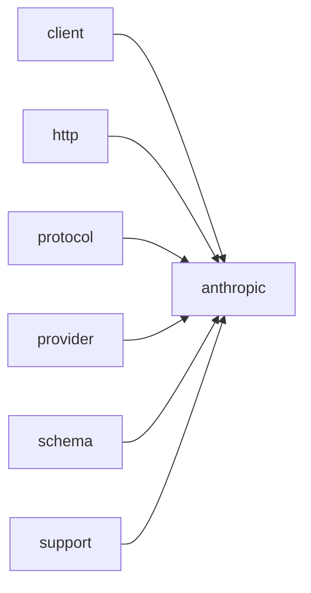

# Module `anthropic`

## Summary

`anthropic` 模块封装了与 Anthropic LLM API 通信的完整协议实现和异步调用接口。它通过 `clore::net::anthropic::detail::Protocol` 结构体管理环境配置（API 密钥、基础 URL、API 版本），并提供请求 JSON 构建、响应解析、头部构建和 URL 拼接等底层工具。`clore::net::anthropic::protocol` 命名空间暴露了消息组装（`make_role_message`、`make_text_block`、`make_tool_use_block`、`make_tool_result_block`）、文本处理（`append_text_with_gap`）、请求验证（`validate_request`）以及响应解析（`parse_response`、`text_from_response`、`parse_response_text`、`parse_tool_arguments`）等函数。此外，`clore::net::anthropic::schema` 提供了 `function_tool` 和 `response_format` 模板，用于定义工具模式和结构化响应格式。

该模块对外提供三个异步调用入口：`call_completion_async`、`call_llm_async` 和 `call_structured_async`，它们接受模型标识、系统提示、用户消息等参数，并返回一个整数句柄，在 `kota::event_loop` 上调度异步操作。这些函数依赖于内部的 `Protocol` 基础设施来构建请求、发送 HTTP 调用并解析响应，构成了从客户端调用到 Anthropic API 响应的完整路径。

## Imports

- [`client`](../client/index.md)
- [`http`](../http/index.md)
- [`protocol`](../protocol/index.md)
- [`provider`](../provider/index.md)
- [`schema`](../schema/index.md)
- `std`
- [`support`](../support/index.md)

## Dependency Diagram



## Types

### `clore::net::anthropic::detail::Protocol`

Declaration: `network/anthropic.cppm:654`

Definition: `network/anthropic.cppm:654`

Declaration: [`Namespace clore::net::anthropic::detail`](../../namespaces/clore/net/anthropic/detail/index.md)

实现上，`clore::net::anthropic::detail::Protocol` 完全由一组静态成员函数构成，不持有实例状态。它通过委托给 `clore::net::anthropic::protocol` 命名空间中的独立函数来完成请求 JSON 构建、URL 拼接和响应解析，从而将 Anthropic API 的协议细节与请求/响应的业务逻辑分离。环境配置的读取由 `clore::net::detail::read_credentials` 处理，并指定了 Anthropic 专属的环境变量名。在 `parse_response` 内部，会首先检查响应体是否为空，然后尝试解析；若解析失败且 HTTP 状态码不低于 400，则优先返回 HTTP 错误信息，否则转发解析错误；若解析成功但状态码指示错误，同样会返回失败。这种双重验证确保了上游 HTTP 错误与协议层错误能被正确区分。

#### Invariants

- All methods are static and stateless.
- `read_environment` requires environment variables `kAnthropicBaseUrlEnv` and `kAnthropicApiKeyEnv` to be set.
- `build_url` expects a valid `base_url` from the environment config.
- `build_headers` always sets the same `Content-Type` and `anthropic-version` headers.
- `parse_response` treats non-empty body and HTTP status < 400 as success; otherwise returns `LLMError`.

#### Key Members

- `read_environment`
- `build_url`
- `build_headers`
- `build_request_json`
- `parse_response`
- `provider_name`

#### Usage Patterns

- Used as a policy class for the Anthropic provider in the networking layer.
- Called by higher-level code to perform each step of an API request lifecycle.

#### Member Functions

##### `clore::net::anthropic::detail::Protocol::build_headers`

Declaration: `network/anthropic.cppm:667`

Definition: `network/anthropic.cppm:667`

Declaration: [`Namespace clore::net::anthropic::detail`](../../namespaces/clore/net/anthropic/detail/index.md)

###### Implementation

```cpp
static auto build_headers(const clore::net::detail::EnvironmentConfig& environment)
        -> std::vector<kota::http::header> {
        return std::vector<kota::http::header>{
            kota::http::header{
                               .name = "Content-Type",
                               .value = "application/json; charset=utf-8",
                               },
            kota::http::header{
                               .name = "x-api-key",
                               .value = environment.api_key,
                               },
            kota::http::header{
                               .name = "anthropic-version",
                               .value = std::string(kAnthropicVersion),
                               },
        };
    }
```

##### `clore::net::anthropic::detail::Protocol::build_request_json`

Declaration: `network/anthropic.cppm:685`

Definition: `network/anthropic.cppm:685`

Declaration: [`Namespace clore::net::anthropic::detail`](../../namespaces/clore/net/anthropic/detail/index.md)

###### Implementation

```cpp
static auto build_request_json(const CompletionRequest& request)
        -> std::expected<std::string, LLMError> {
        return clore::net::anthropic::protocol::build_request_json(request);
    }
```

##### `clore::net::anthropic::detail::Protocol::build_url`

Declaration: `network/anthropic.cppm:663`

Definition: `network/anthropic.cppm:663`

Declaration: [`Namespace clore::net::anthropic::detail`](../../namespaces/clore/net/anthropic/detail/index.md)

###### Implementation

```cpp
static auto build_url(const clore::net::detail::EnvironmentConfig& environment) -> std::string {
        return clore::net::anthropic::protocol::build_messages_url(environment.api_base);
    }
```

##### `clore::net::anthropic::detail::Protocol::parse_response`

Declaration: `network/anthropic.cppm:690`

Definition: `network/anthropic.cppm:690`

Declaration: [`Namespace clore::net::anthropic::detail`](../../namespaces/clore/net/anthropic/detail/index.md)

###### Implementation

```cpp
static auto parse_response(const clore::net::detail::RawHttpResponse& raw_response)
        -> std::expected<CompletionResponse, LLMError> {
        if(raw_response.body.empty()) {
            return std::unexpected(LLMError("empty response from Anthropic"));
        }

        auto parsed = clore::net::anthropic::protocol::parse_response(raw_response.body);
        if(!parsed.has_value()) {
            if(raw_response.http_status >= 400) {
                return std::unexpected(
                    LLMError(std::format("Anthropic request failed with HTTP {}: {}",
                                         raw_response.http_status,
                                         raw_response.body)));
            }
            return std::unexpected(std::move(parsed.error()));
        }
        if(raw_response.http_status >= 400) {
            return std::unexpected(LLMError(
                std::format("Anthropic request failed with HTTP {}", raw_response.http_status)));
        }
        return std::move(*parsed);
    }
```

##### `clore::net::anthropic::detail::Protocol::provider_name`

Declaration: `network/anthropic.cppm:713`

Definition: `network/anthropic.cppm:713`

Declaration: [`Namespace clore::net::anthropic::detail`](../../namespaces/clore/net/anthropic/detail/index.md)

###### Implementation

```cpp
static auto provider_name() -> std::string_view {
        return "Anthropic";
    }
```

##### `clore::net::anthropic::detail::Protocol::read_environment`

Declaration: `network/anthropic.cppm:655`

Definition: `network/anthropic.cppm:655`

Declaration: [`Namespace clore::net::anthropic::detail`](../../namespaces/clore/net/anthropic/detail/index.md)

###### Implementation

```cpp
static auto read_environment()
        -> std::expected<clore::net::detail::EnvironmentConfig, LLMError> {
        return clore::net::detail::read_credentials(clore::net::detail::CredentialEnv{
            .base_url_env = kAnthropicBaseUrlEnv,
            .api_key_env = kAnthropicApiKeyEnv,
        });
    }
```

## Variables

### `clore::net::anthropic::detail::kAnthropicApiKeyEnv`

Declaration: `network/anthropic.cppm:651`

Declaration: [`Namespace clore::net::anthropic::detail`](../../namespaces/clore/net/anthropic/detail/index.md)

该变量用于在运行时读取环境变量 `ANTHROPIC_API_KEY` 的值，通常作为 `clore::net::anthropic` 命名空间下网络请求认证密钥的获取源。它作为常量字符串被引用，不参与修改。

#### Mutation

No mutation is evident from the extracted code.

#### Usage Patterns

- 作为环境变量名称传递给环境变量查询函数

### `clore::net::anthropic::detail::kAnthropicBaseUrlEnv`

Declaration: `network/anthropic.cppm:650`

Declaration: [`Namespace clore::net::anthropic::detail`](../../namespaces/clore/net/anthropic/detail/index.md)

This constant is a `constexpr std::string_view` with value `"ANTHROPIC_BASE_URL"`. It is intended to be used with an environment variable reader to override the default base URL for Anthropic API requests.

#### Mutation

No mutation is evident from the extracted code.

#### Usage Patterns

- Environment variable lookup
- URL configuration

### `clore::net::anthropic::detail::kAnthropicVersion`

Declaration: `network/anthropic.cppm:652`

Declaration: [`Namespace clore::net::anthropic::detail`](../../namespaces/clore/net/anthropic/detail/index.md)

This constant provides the API version string used in HTTP requests to the Anthropic API. It is read when constructing the version header or request parameters, and its value remains fixed as a compile-time constant.

#### Mutation

No mutation is evident from the extracted code.

#### Usage Patterns

- used as API version in request headers
- referenced when creating Anthropic API calls

### `clore::net::anthropic::protocol::detail::kDefaultMaxTokens`

Declaration: `network/anthropic.cppm:23`

Declaration: [`Namespace clore::net::anthropic::protocol::detail`](../../namespaces/clore/net/anthropic/protocol/detail/index.md)

This constant is used as a fallback value in the `build_request_json` function, providing a default limit for the number of tokens in the response when no explicit value is supplied by the caller.

#### Mutation

No mutation is evident from the extracted code.

#### Usage Patterns

- used as default argument in `build_request_json`

## Functions

### `clore::net::anthropic::call_completion_async`

Declaration: `network/anthropic.cppm:722`

Definition: `network/anthropic.cppm:764`

Declaration: [`Namespace clore::net::anthropic`](../../namespaces/clore/net/anthropic/index.md)

该函数是一个轻量转发协程，内部将操作委托给通用的 `clore::net::call_completion_async`，并特化 `clore::net::anthropic::detail::Protocol` 作为协议模板参数。`detail::Protocol` 封装了 Anthropic 客户端的所有实现细节：其 `read_environment` 从环境变量 `kAnthropicBaseUrlEnv` 和 `kAnthropicApiKeyEnv` 中读取基础 URL 与 API 密钥，`build_url` 基于配置的基础 URL 和 `protocol::build_messages_url` 生成消息端点，`build_headers` 注入认证头并设置 `kAnthropicVersion` 版本号，`build_request_json` 则利用 `protocol::detail` 中的工具组合请求体，包括系统提示（通过 `format_schema_instruction` 生成结构化指令）、消息历史（通过 `make_role_message` 构建每条用户/助手消息）以及工具定义（通过 `schema::function_tool` 和 `schema::response_format` 注册）。最终响应解析由 `parse_response` 完成，它使用 `protocol::parse_response` 解析 JSON，并分离文本与工具调用块（通过 `make_text_block`、`make_tool_use_block`、`make_tool_result_block`），处理 `stop_reason` 和工具输出传递。整个流程完全在 `kota` 事件循环之上异步执行，依赖 `clore::net` 的通用请求-响应基础设施和内部的 `protocol`、`schema` 以及 `detail` 命名空间下的所有辅助函数。

#### Side Effects

- Sends an HTTP request to the Anthropic completion endpoint
- Registers a continuation on the event loop

#### Reads From

- `CompletionRequest request` parameter
- `kota::event_loop& loop` parameter

#### Usage Patterns

- Used as a building block for higher-level Anthropic interaction functions in the `clore::net::anthropic` namespace

### `clore::net::anthropic::call_llm_async`

Declaration: `network/anthropic.cppm:732`

Definition: `network/anthropic.cppm:782`

Declaration: [`Namespace clore::net::anthropic`](../../namespaces/clore/net/anthropic/index.md)

`clore::net::anthropic::call_llm_async` 是一个轻量包装函数，它将实际的调用委托给泛型模板 `clore::net::call_llm_async<detail::Protocol>`。它接收 `model`、`system_prompt`、`prompt` 三个字符串参数和一个 `kota::event_loop` 引用，通过协程 `co_await` 等待底层模板的返回，并使用 `.or_fail()` 将结果类型转换为 `kota::task<std::string, LLMError>`。`detail::Protocol` 是专门为 Anthropic API 设计的协议实现，负责处理请求 JSON 构建（如 `Protocol::build_request_json`）、HTTP 头构造（`Protocol::build_headers`）、URL 组装（`Protocol::build_url`）、响应解析（`Protocol::parse_response`）以及环境变量读取（`Protocol::read_environment`，涉及 `kAnthropicApiKeyEnv` 和 `kAnthropicBaseUrlEnv`）。该函数不直接处理内部控制流，而是完全依赖模板函数与协议类的协作来完成 HTTP 请求、重试逻辑和错误处理。

#### Side Effects

- Initiates an asynchronous HTTP request to the Anthropic API
- Allocates a coroutine task object
- May modify internal state of the event loop or connection pool

#### Reads From

- `model` parameter
- `system_prompt` parameter
- `prompt` parameter
- `loop` parameter (the event loop state)

#### Writes To

- Result of the returned `kota::task` (asynchronously populated)
- Internal state of the event loop (e.g., pending operations)

#### Usage Patterns

- Async LLM completion call from coroutine context
- Wrapper that delegates to protocol-specific implementation
- Used in combination with `.or_fail()` to convert errors

### `clore::net::anthropic::call_llm_async`

Declaration: `network/anthropic.cppm:726`

Definition: `network/anthropic.cppm:771`

Declaration: [`Namespace clore::net::anthropic`](../../namespaces/clore/net/anthropic/index.md)

该函数是 `clore::net::anthropic` 命名空间下的高层异步入口点。它通过协程将调用委托给模板化的 `clore::net::call_llm_async<detail::Protocol>` 并将其结果通过 `.or_fail()` 转换为 `kota::task<std::string, LLMError>`。  
内部实现由 `detail::Protocol` 策略类驱动，该策略依次使用 `detail::kAnthropicBaseUrlEnv` 和 `detail::kAnthropicVersion` 等环境常量，通过 `Protocol::build_url` 与 `Protocol::build_headers` 构造 HTTP 请求，并使用 `Protocol::build_request_json` 将模型、系统提示、消息历史及可选工具封装为 JSON 负载。请求发出后，`Protocol::parse_response` 解析原始响应，`protocol::parse_response_text` 与 `protocol::parse_tool_arguments` 处理文本输出及工具调用循环；若响应包含 `stop_reason` 为“`tool_use`”则自动追加工具结果并重新发送，直至获得最终文本或错误。整个流程在 `kota::event_loop` 的协程上下文中执行。

#### Side Effects

- Initiates an asynchronous HTTP request to the Anthropic API via the event loop
- Schedules coroutine continuation on the event loop

#### Reads From

- model
- `system_prompt`
- request
- loop

#### Usage Patterns

- Used to send prompts to Anthropic and await responses asynchronously
- Called from other async functions within the `clore::net::anthropic` namespace

### `clore::net::anthropic::call_structured_async`

Declaration: `network/anthropic.cppm:739`

Definition: `network/anthropic.cppm:794`

Declaration: [`Namespace clore::net::anthropic`](../../namespaces/clore/net/anthropic/index.md)

该函数是一个转发器：它基于 `clore::net::anthropic::detail::Protocol` 将调用委托给泛型函数 `clore::net::call_structured_async`。内部控制流仅仅是将传入的 `model`、`system_prompt`、`prompt` 以及指向 `loop` 的指针打包传递给该泛型函数，然后通过 `.or_fail()` 将协程任务结果转换为一个带有错误类型的 `kota::task<T, LLMError>`。所有实际的协议细节（如请求构造、URL 构建、头部设置、响应解析等）都由 `clore::net::anthropic::detail::Protocol` 提供，并由 `clore::net::call_structured_async` 的通用实现调度。

#### Side Effects

No observable side effects are evident from the extracted code.

#### Reads From

- `model`
- `system_prompt`
- `prompt`
- `loop`

#### Usage Patterns

- Used to make structured asynchronous calls to the Anthropic API
- Called with model identifier, system prompt, user prompt, and an event loop

### `clore::net::anthropic::protocol::append_tool_outputs`

Declaration: `network/anthropic.cppm:209`

Definition: `network/anthropic.cppm:628`

Declaration: [`Namespace clore::net::anthropic::protocol`](../../namespaces/clore/net/anthropic/protocol/index.md)

函数 `clore::net::anthropic::protocol::append_tool_outputs` 的实现是一个薄委托，它将其参数——历史消息列表 `history`、来自前一次调用的完成响应 `response` 以及工具输出列表 `outputs`——直接转发给底层库函数 `clore::net::protocol::append_tool_outputs`。该函数不做任何额外的校验或转换，仅负责调用的路由和结果的转发。

内部控制流极为简单：接收一个 `std::span<const Message>`、一个 `const CompletionResponse &` 和一个 `std::span<const ToolOutput>`，然后立即调用 `clore::net::protocol::append_tool_outputs` 并返回其结果。主要依赖是 `clore::net::protocol::append_tool_outputs`，由它执行实际的工具输出追加逻辑，包括提取响应中的工具调用 ID、构造 `ToolResultBlock` 并插入到消息序列中。

#### Side Effects

No observable side effects are evident from the extracted code.

#### Reads From

- 参数 `history`（类型 `std::span<const Message>`）
- 参数 `response`（类型 `const CompletionResponse&`）
- 参数 `outputs`（类型 `std::span<const ToolOutput>`）

#### Usage Patterns

- 将工具输出合并到消息历史中
- 在 Anthropic 协议处理中作为工具结果处理的封装

### `clore::net::anthropic::protocol::build_messages_url`

Declaration: `network/anthropic.cppm:201`

Definition: `network/anthropic.cppm:224`

Declaration: [`Namespace clore::net::anthropic::protocol`](../../namespaces/clore/net/anthropic/protocol/index.md)

Implementation: [Implementation](functions/build-messages-url.md)

该函数首先将传入的 `api_base` 复制到本地 `url` 字符串，然后通过一个 `while` 循环去除尾部所有连续的斜杠字符，直到 `url` 为空或末尾不是斜杠。随后检查 `url` 是否以 `"/v1"` 结尾，若是则调用 `clore::net::detail::append_url_path` 将 `"messages"` 追加到路径后；否则追加 `"v1/messages"`。实现依赖于 `clore::net::detail::append_url_path` 完成路径拼接，整个流程仅包含一次去除尾部斜杠的循环和一次条件分支。

#### Side Effects

No observable side effects are evident from the extracted code.

#### Reads From

- `api_base` parameter
- string literal `"/v1"`
- `clore::net::detail::append_url_path`

#### Writes To

- local variable `url`
- returned `std::string`

#### Usage Patterns

- Called by `clore::net::anthropic::detail::Protocol::build_url` to produce the messages endpoint URL

### `clore::net::anthropic::protocol::build_request_json`

Declaration: `network/anthropic.cppm:203`

Definition: `network/anthropic.cppm:235`

Declaration: [`Namespace clore::net::anthropic::protocol`](../../namespaces/clore/net/anthropic/protocol/index.md)

The implementation of `clore::net::anthropic::protocol::build_request_json` first validates the incoming `CompletionRequest` via `detail::validate_request` and returns an error on failure. It then constructs the top-level JSON object by inserting the `model` identifier and the constant `detail::kDefaultMaxTokens`. All conversation messages are iterated and dispatched through `std::visit` to generate the appropriate Anthropic message representation. `SystemMessage` content is accumulated into a separate `system_text` string using `detail::append_text_with_gap`; `UserMessage` and `AssistantMessage` are each converted to a role-based JSON object via `detail::make_role_message`. For `AssistantToolCallMessage`, a content array is built containing an optional text block (`detail::make_text_block`) and tool-use blocks (`detail::make_tool_use_block`), then wrapped in a role message. Tool‑result messages are handled as user messages containing a tool‑result block (`detail::make_tool_result_block`). The serialized optional objects are pushed into the `"messages"` array, and accumulated `system_text` is inserted as the root’s `"system"` field when non‑empty.

When a `response_format` is present, `detail::format_schema_instruction` generates a schema instruction that is appended to `system_text`. Tool definitions are serialized into a `"tools"` array, each comprising a `name`, `description`, and a cloned `input_schema` from the tool’s parameters. The `"tool_choice"` field is conditionally built from `request.tool_choice` and `request.parallel_tool_calls`, mapping choice variants to the Anthropic‑recognized type strings (`"auto"`, `"any"`, `"none"`, `"tool"`) and optionally setting `"disable_parallel_tool_use"`. Finally, the complete root object is serialized to a JSON string via `kota::codec::json::to_string`, with any encoding failure propagated as an error.

#### Side Effects

- Allocates and constructs JSON objects and arrays
- Moves ownership of internal data
- Returns a heap-allocated string

#### Reads From

- `request` parameter (a `CompletionRequest`)
- `request.model`
- `request.messages`
- `request.response_format`
- `request.tools`
- `request.tool_choice`
- `request.parallel_tool_calls`
- global constant `detail::kDefaultMaxTokens`

#### Writes To

- Returned `std::string` containing the JSON request
- Internally writes to `std::expected` error objects

#### Usage Patterns

- Called to create the JSON payload for an Anthropic messages API request
- Typically used before sending the HTTP request

### `clore::net::anthropic::protocol::detail::append_text_with_gap`

Declaration: `network/anthropic.cppm:25`

Definition: `network/anthropic.cppm:25`

Declaration: [`Namespace clore::net::anthropic::protocol::detail`](../../namespaces/clore/net/anthropic/protocol/detail/index.md)

Implementation: [Implementation](functions/append-text-with-gap.md)

该函数在目标字符串 `target` 尾部追加给定的 `text`，并在 `target` 已有内容时插入两个换行符 `\n\n` 作为分隔符，以确保不同文本块之间保持视觉间隔。内部控制流首先检查 `text` 是否为空，若为空则直接返回，避免无意义操作；若 `text` 非空，则判断 `target` 是否非空，若非空则在追加前先写入 `"\n\n"`，最后执行实际的字符串拼接。函数没有外部依赖，仅依赖 `std::string` 和 `std::string_view` 的基本操作，实现紧凑的文本块拼接逻辑。

#### Side Effects

- modifies `target` string by appending newlines and text

#### Reads From

- parameter `target` (reads its empty state)
- parameter `text` (reads entire content)

#### Writes To

- parameter `target` (appends to it)

#### Usage Patterns

- called in `build_request_json` to accumulate text blocks with gaps

### `clore::net::anthropic::protocol::detail::format_schema_instruction`

Declaration: `network/anthropic.cppm:176`

Definition: `network/anthropic.cppm:176`

Declaration: [`Namespace clore::net::anthropic::protocol::detail`](../../namespaces/clore/net/anthropic/protocol/detail/index.md)

该函数根据`ResponseFormat`对象的`schema`字段是否存在决定返回的指令文本。如果`schema`无值，直接返回一条固定提示，要求返回纯JSON对象且不含Markdown围栏。若有schema，则尝试通过`json::to_string`将其序列化为字符串；若序列化失败，返回一个包装为`LLMError`的JSON错误。成功时，利用`std::format`构造一条包含schema名称和序列化内容的指令，明确要求输出必须符合该schema。整个流程依赖`json::to_string`的序列化能力及`ResponseFormat`中`name`和`schema`成员。

#### Side Effects

No observable side effects are evident from the extracted code.

#### Reads From

- `format.schema`
- `format.name`

#### Usage Patterns

- Used when constructing system prompts for structured output
- Called by higher-level functions to enforce response format

### `clore::net::anthropic::protocol::detail::make_role_message`

Declaration: `network/anthropic.cppm:154`

Definition: `network/anthropic.cppm:154`

Declaration: [`Namespace clore::net::anthropic::protocol::detail`](../../namespaces/clore/net/anthropic/protocol/detail/index.md)

函数 `clore::net::anthropic::protocol::detail::make_role_message` 实现了一个常规的三步构造流程：首先调用 `clore::net::detail::make_empty_object` 创建一个空的 `json::Object`，若失败则立即返回错误；然后调用 `clore::net::detail::insert_string_field` 向该对象写入由 `role` 参数指定的 "role" 字段，若失败同样提前返回错误；最后将参数 `blocks` 直接移动赋值给对象的 "content" 键，整个函数的返回值即为构造完成的 JSON 对象。

该函数完全依赖 `clore::net::detail` 提供的两个底层工具函数——`make_empty_object` 用于安全创建对象并进行错误包装，`insert_string_field` 用于带校验的字段写入——以及 `json::Object` 自身的键值插入操作。内部控制流是线性的、顺序错误返回模式，无循环或分支；错误类型均统一封装在 `std::expected<json::Object, LLMError>` 中，确保调用方能一致处理。

#### Side Effects

No observable side effects are evident from the extracted code.

#### Reads From

- parameter `role`
- parameter `blocks`

#### Writes To

- local `message` object

#### Usage Patterns

- Called to build a user or assistant role message in API request construction.
- Used by higher-level functions that assemble message lists for chat completions.

### `clore::net::anthropic::protocol::detail::make_role_message`

Declaration: `network/anthropic.cppm:130`

Definition: `network/anthropic.cppm:130`

Declaration: [`Namespace clore::net::anthropic::protocol::detail`](../../namespaces/clore/net/anthropic/protocol/detail/index.md)

该函数的工作流程围绕构建一个表示角色消息的 JSON 对象。首先调用 `clore::net::detail::make_empty_object` 创建一个空的 `json::Object`，任何失败都会立即将错误沿 `std::expected` 路径返回。随后两次调用 `clore::net::detail::insert_string_field` 分别插入 `"role"` 和 `"content"` 字段：前者直接使用传入的 `role`；后者先将 `text` 通过 `clore::net::detail::normalize_utf8` 进行 UTF‑8 规范化，再将规范化后的字符串视图作为值写入。每次字段插入后都会检查返回的 `status`，一旦失败则提前返回 `std::unexpected`。最终，成功构建的 `json::Object` 被作为结果返回。整个执行依赖于 `clore::net::detail` 命名空间下的三个底层工具函数，所有错误均通过 `std::expected` 机制传播。

#### Side Effects

No observable side effects are evident from the extracted code.

#### Reads From

- parameter `role`
- parameter `text`

#### Writes To

- a new `clore::net::json::Object` returned as value

#### Usage Patterns

- used to construct a message object with a role and plain text content
- called by higher-level protocol functions that need to build messages

### `clore::net::anthropic::protocol::detail::make_text_block`

Declaration: `network/anthropic.cppm:35`

Definition: `network/anthropic.cppm:35`

Declaration: [`Namespace clore::net::anthropic::protocol::detail`](../../namespaces/clore/net/anthropic/protocol/detail/index.md)

该函数首先调用 `clore::net::detail::make_empty_object` 创建一个空的 JSON 对象，并在失败时立即返回错误。成功创建后，依次调用 `clore::net::detail::insert_string_field` 写入 `type` 字段（值为 `"text"`）和 `text` 字段（值来自输入参数 `text`，但需先通过 `clore::net::detail::normalize_utf8` 进行 UTF-8 规范化）。每次插入操作都会检查返回值，若任一操作失败则提前返回对应的 `std::unexpected` 错误。整个流程完全依赖 `clore::net::detail` 命名空间下的工具函数完成对象构造和字段插入，不涉及任何循环或分支逻辑，是典型的逐层检查并返回的防守式实现。

#### Side Effects

- allocates memory for a JSON object
- allocates memory for a normalized UTF-8 string

#### Reads From

- input parameter `text`

#### Writes To

- local variable `block`
- returned `json::Object`

#### Usage Patterns

- constructing text content block for Anthropic protocol messages

### `clore::net::anthropic::protocol::detail::make_tool_result_block`

Declaration: `network/anthropic.cppm:98`

Definition: `network/anthropic.cppm:98`

Declaration: [`Namespace clore::net::anthropic::protocol::detail`](../../namespaces/clore/net/anthropic/protocol/detail/index.md)

该函数根据输入的 `const ToolResultMessage&` 构造一个 JSON 对象，表示 Anthropic 协议中的工具结果块。内部控制流首先调用 `clore::net::detail::make_empty_object` 创建一个空对象，若失败则直接返回 `std::unexpected`。随后依次通过 `clore::net::detail::insert_string_field` 插入三个固定字段：`"type"` 设置为 `"tool_result"`、`"tool_use_id"` 设置为 `message.tool_call_id`、`"content"` 设置为经过 `clore::net::detail::normalize_utf8` 规范化后的 `message.content`。每次插入操作均会检查返回值，任何失败都会立即以 `LLMError` 类型提前返回。成功完成所有插入后，函数返回构造完毕的 `json::Object`。该实现依赖内部工具函数处理错误传播和字符串规范化，未引入额外业务逻辑。

#### Side Effects

No observable side effects are evident from the extracted code.

#### Reads From

- const `ToolResultMessage&` parameter `message`
- `message.tool_call_id`
- `message.content`
- error message strings

#### Writes To

- local variable `block` of type `std::expected<json::Object, LLMError>`

#### Usage Patterns

- Convert a `ToolResultMessage` to a JSON block for inclusion in API request content

### `clore::net::anthropic::protocol::detail::make_tool_use_block`

Declaration: `network/anthropic.cppm:58`

Definition: `network/anthropic.cppm:58`

Declaration: [`Namespace clore::net::anthropic::protocol::detail`](../../namespaces/clore/net/anthropic/protocol/detail/index.md)

函数 `clore::net::anthropic::protocol::detail::make_tool_use_block` 将传入的 `ToolCall` 对象转换为一个表示 Anhtropic 工具使用块的 `json::Object`。其算法采用防御性顺序构建：首先校验 `call.arguments` 是否为 JSON 对象，若非则返回 `LLMError`；随后通过 `clore::net::detail::make_empty_object` 创建一个空对象 `block`，若失败则提前返回。接着依次通过 `clore::net::detail::insert_string_field` 插入类型标识 `"type"` 为 `"tool_use"`、工具调用 `"id"` 和 `"name"`，每一步均检查返回值，若插入失败则返回对应的错误。最后使用 `clore::net::detail::clone_value` 深拷贝 `call.arguments` 作为 `"input"` 字段的值，并插入到 `block` 中。所有依赖的工具函数均在命名空间 `clore::net::detail` 中实现。

内部控制流纯粹是线性顺序的故障传播：任何一步失败都会立即以 `std::unexpected` 返回错误，从而保证构建的块在成功时必然包含所有必需字段且输入副本独立。该函数在构建 `tool_use` 类型的 content block 时扮演工厂角色，供上层协议解析逻辑使用。

#### Side Effects

No observable side effects are evident from the extracted code.

#### Reads From

- call`.id`
- call`.name`
- call`.arguments`

#### Writes To

- local block `json::Object`

#### Usage Patterns

- Called to convert a `ToolCall` into a JSON block for Anthropic request messages

### `clore::net::anthropic::protocol::detail::parse_json_text`

Declaration: `network/anthropic.cppm:171`

Definition: `network/anthropic.cppm:171`

Declaration: [`Namespace clore::net::anthropic::protocol::detail`](../../namespaces/clore/net/anthropic/protocol/detail/index.md)

该函数是一个轻量级的转发封装，其全部实现委托给 `clore::net::detail::parse_json_object`。它将传入的 `raw` 字符串（预期包含 JSON 文本）和 `context`（提供解析上下文信息）原样传递给底层函数，并将后者返回的 `std::expected<json::Object, ...>` 直接作为自身结果返回。内部不执行任何额外的解析、校验或错误转换逻辑；底层的 `parse_json_object` 负责实际的 JSON 语法分析、对象构建以及错误处理，并直接产生 `LLMError` 类型的错误表示。

#### Side Effects

No observable side effects are evident from the extracted code.

#### Reads From

- raw
- context

#### Usage Patterns

- Used internally to parse JSON content from API responses or local data.
- Called as a convenience wrapper for unified error handling with `LLMError`.

### `clore::net::anthropic::protocol::detail::validate_request`

Declaration: `network/anthropic.cppm:193`

Definition: `network/anthropic.cppm:193`

Declaration: [`Namespace clore::net::anthropic::protocol::detail`](../../namespaces/clore/net/anthropic/protocol/detail/index.md)

`clore::net::anthropic::protocol::detail::validate_request` 的实现将验证委托给 `clore::net::detail::validate_completion_request`，传入 `request` 以及两个布尔值 `false`。这两个 `false` 参数可能控制是否跳过某些检查（例如，模型或令牌限制），但具体含义由被调用方定义。该函数本身不包含任何自定义验证逻辑或控制流，仅作为类型安全转接层。

在依赖方面，它直接耦合于 `clore::net::detail::validate_completion_request`，该函数负责完整验证与 Anthropic 协议无关的通用请求字段。错误以 `std::expected<void, LLMError>` 形式返回，因此调用者能够统一处理验证失败情况。由于此处未涉及高级验证（如结构化输出或工具调用），该函数适用于最基本的请求有效性检查。

#### Side Effects

No observable side effects are evident from the extracted code.

#### Reads From

- request (`CompletionRequest`)

#### Usage Patterns

- validates a completion request before Anthropic API call
- used as a wrapper around generic validation

### `clore::net::anthropic::protocol::parse_response`

Declaration: `network/anthropic.cppm:205`

Definition: `network/anthropic.cppm:460`

Declaration: [`Namespace clore::net::anthropic::protocol`](../../namespaces/clore/net/anthropic/protocol/index.md)

函数 `clore::net::anthropic::protocol::parse_response` 的实现流程始于对输入 JSON 字符串 `json_text` 的解析，通过调用 `clore::net::anthropic::protocol::detail::parse_json_text` 获得预期的 `json::Value` 对象。随后构造一个 `clore::net::detail::ObjectView` 用于遍历根对象。函数首先检查是否存在 `error` 字段；若有，则提取 `error.message` 并直接返回 `LLMError`。若无错误，则依次提取并验证 `id`、`model`、`stop_reason` 和 `content` 字段。`stop_reason` 使用 `"end_turn"` 作为默认值，若解析结果为 `"max_tokens"` 则立即返回截断错误。`content` 必须是一个数组，遍历其中的每个元素：对于 `type` 为 `"text"` 的块，依据 `stop_reason` 是否为 `"refusal"` 分别累加至本地的 `refusal` 或 `text` 字符串；对于 `type` 为 `"tool_use"` 的块，提取 `id`、`name` 和 `input` 字段，将 `input` 子对象克隆后序列化为 JSON 字符串，再重新解析为 `json::Value` 对象作为 `arguments`，并构造 `ToolCall` 追加至输出。最终将收集到的 `text`、`refusal` 和 `tool_calls` 组装为 `AssistantOutput`，连同 `id`、`model` 和原始 JSON 字符串一起打包为 `CompletionResponse` 返回。该函数大量依赖 `clore::net::detail` 命名空间下的对象视图与类型安全提取函数，以及 `kota::codec::json` 的序列化与解析工具。

#### Side Effects

No observable side effects are evident from the extracted code.

#### Reads From

- `json_text` parameter

#### Usage Patterns

- Parsing raw JSON response from Anthropic API
- Extracting `CompletionResponse` from the JSON payload
- Error handling for malformed or error responses

### `clore::net::anthropic::protocol::parse_response_text`

Declaration: `network/anthropic.cppm:215`

Definition: `network/anthropic.cppm:636`

Declaration: [`Namespace clore::net::anthropic::protocol`](../../namespaces/clore/net/anthropic/protocol/index.md)

`parse_response_text` 是 `clore::net::anthropic::protocol` 命名空间下的模板函数，其实现直接委托给 `clore::net::protocol::parse_response_text<T>`。它接收一个 `CompletionResponse` 常量引用，并将类型参数 `T` 以及响应对象转发至基协议层的同名函数。内部不执行任何额外的解析或转换，仅作为协议适配层，确保 Anthropic 的响应格式能通过通用的 `clore::net::protocol::parse_response_text` 处理。此依赖关系使得该函数无需关心底层 JSON 解析细节，而将文本提取和错误处理交予通用实现。

#### Side Effects

No observable side effects are evident from the extracted code.

#### Reads From

- `response` parameter of type `CompletionResponse`

#### Usage Patterns

- Used by callers needing to parse the text content of an Anthropic API completion response into a specific type.

### `clore::net::anthropic::protocol::parse_tool_arguments`

Declaration: `network/anthropic.cppm:218`

Definition: `network/anthropic.cppm:641`

Declaration: [`Namespace clore::net::anthropic::protocol`](../../namespaces/clore/net/anthropic/protocol/index.md)

该函数是 `clore::net::anthropic::protocol::parse_tool_arguments` 的模板化转发实现，其核心逻辑完全委托给 `clore::net::protocol::parse_tool_arguments<T>`。在实现内部，它直接将传入的 `ToolCall` 对象传递给下层通用解析器，由后者依据目标类型 `T` 执行实际的 JSON 反序列化与错误处理。这种设计使得 Anthropic 协议层可以复用通用的工具参数解析算法，同时通过模板特化支持不同的输出类型。控制流极其简单：没有本地状态或分支，仅执行一次函数调用并返回其结果。

#### Side Effects

No observable side effects are evident from the extracted code.

#### Reads From

- the `call` parameter of type `ToolCall`

#### Usage Patterns

- used to extract typed arguments from an Anthropic tool call

### `clore::net::anthropic::protocol::text_from_response`

Declaration: `network/anthropic.cppm:207`

Definition: `network/anthropic.cppm:623`

Declaration: [`Namespace clore::net::anthropic::protocol`](../../namespaces/clore/net/anthropic/protocol/index.md)

该函数是一个轻量转发适配器。它接收一个 `clore::net::anthropic::protocol::CompletionResponse` 类型的 `response` 参数，并立即将其传递给 `clore::net::protocol::text_from_response`，后者是跨协议共享的通用文本提取实现。内部不包含分支、循环或状态管理，完全依赖底层基础协议函数的控制流来解析响应结构并返回 `std::expected<std::string, LLMError>`。

#### Side Effects

No observable side effects are evident from the extracted code.

#### Reads From

- `response` parameter

#### Usage Patterns

- Extracting text from a `CompletionResponse`

### `clore::net::anthropic::schema::function_tool`

Declaration: `network/anthropic.cppm:755`

Definition: `network/anthropic.cppm:755`

Declaration: [`Namespace clore::net::anthropic::schema`](../../namespaces/clore/net/anthropic/schema/index.md)

该函数是一个薄转发层：它接受两个 `std::string` 参数 `name` 和 `description`，通过 `std::move` 转移其所有权，然后立即委托给 `clore::net::schema::function_tool<T>`。内部控制流仅包含这一单次调用，其返回值（即 `std::expected<FunctionToolDefinition, LLMError>`）被直接返回给调用方。核心依赖是 `clore::net::schema::function_tool<T>`，该底层函数负责构造 `FunctionToolDefinition` 对象，可能包含验证、JSON schema 格式化以及模板参数 `T` 的静态解析逻辑。这种设计将 Anthropic 特定的工具定义入口与通用的 schema 生成逻辑解耦，使得参数传递和错误处理完全由下游实现接管。

#### Side Effects

No observable side effects are evident from the extracted code.

#### Reads From

- `name` parameter
- `description` parameter

#### Usage Patterns

- Constructing a `FunctionToolDefinition` for tool use in Anthropic API calls

### `clore::net::anthropic::schema::response_format`

Declaration: `network/anthropic.cppm:750`

Definition: `network/anthropic.cppm:750`

Declaration: [`Namespace clore::net::anthropic::schema`](../../namespaces/clore/net/anthropic/schema/index.md)

函数 `clore::net::anthropic::schema::response_format` 的实现仅包含一行：它将所有参数转发给 `clore::net::schema::response_format<T>()`，这是一个位于不同命名空间的同名泛型函数。内部没有任何额外的算法或控制流分支，完全依赖下游函数来构建 `std::expected<ResponseFormat, LLMError>` 类型的返回值。此函数的作用是作为当前命名空间中该功能的入口点，屏蔽了底层模式处理细节。

#### Side Effects

No observable side effects are evident from the extracted code.

#### Usage Patterns

- Obtaining Anthropic API response format
- Configuration for API calls

## Internal Structure

`anthropic` 模块以 `clore::net::anthropic` 为顶层命名空间，内部按职责划分为三个主要的子域：`protocol`、`detail` 和 `schema`。该模块直接依赖 `client`（异步 LLM 调用框架）、`http`（HTTP 通信）、`provider`（LLM 提供者抽象）、`schema`（JSON Schema 生成）和 `support`（基础工具），通过清晰的导入边界实现关注点分离。在实现结构上，公开入口函数（如 `call_llm_async`、`call_completion_async`、`call_structured_async`）将具体协议交互委托给 `detail::Protocol` 类，该类负责环境配置、请求 URL/头/体的构建以及响应的解析；而 `protocol::detail` 命名空间则提供了一系列原子化的工具函数（如 `make_text_block`、`make_role_message`、`make_tool_use_block`、`parse_json_text` 等），用于在构造请求和解析响应时组装与分解协议原语。`schema` 命名空间则专注于从 C++ 类型生成 Anthropic 兼容的 JSON Schema 定义，支撑工具调用和结构化输出的声明式配置。这种分层设计使得底层协议实现与高层异步调用逻辑保持独立，同时将可复用的协议原语集中管理，降低了模块内部的耦合度。

## Related Pages

- [Module client](../client/index.md)
- [Module http](../http/index.md)
- [Module protocol](../protocol/index.md)
- [Module provider](../provider/index.md)
- [Module schema](../schema/index.md)
- [Module support](../support/index.md)

