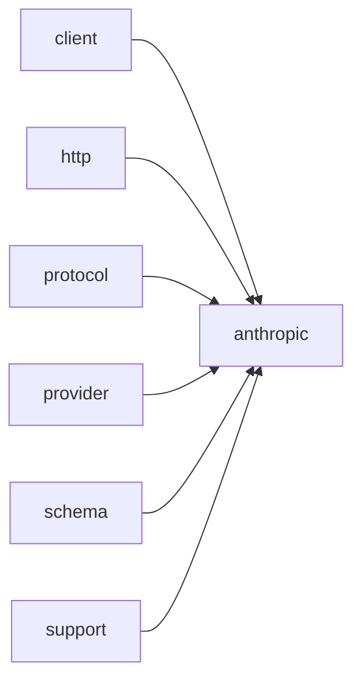

# Module `anthropic`

## Summary

`anthropic` 模块封装了与 Anthropic 大语言模型 API 的完整交互逻辑。它位于 `clore::net` 命名空间，提供三个异步入口函数 `call_completion_async`、`call_llm_async` 和 `call_structured_async`，分别支持通用的文本补全、直接 LLM 调用以及强制结构化输出。模块内部通过 `protocol` 子命名空间管理请求构建（如 `build_request_json`、`build_messages_url`）、响应解析（`parse_response`、`parse_response_text`、`parse_tool_arguments`）以及辅助块构造（`make_text_block`、`make_role_message`、`make_tool_use_block`、`make_tool_result_block`）；`schema` 子命名空间提供 `response_format` 和 `function_tool` 模板函数，用于将 C++ 类型映射为 Anthropic 可识别的工具与 JSON Schema。此外，`detail::Protocol` 类整合了环境变量读取（API 密钥、基础 URL、API 版本）、请求头构建、URL 生成以及响应格式化等底层操作，所有异步请求均通过 `http` 模块发起并由 `kota::event_loop` 驱动。

## Imports

- [`client`](../client/index.md)
- [`http`](../http/index.md)
- [`protocol`](../protocol/index.md)
- [`provider`](../provider/index.md)
- [`schema`](../schema/index.md)
- [`support`](../support/index.md)

## Dependency Diagram


```mermaid
graph LR
    M0["anthropic"]
    I0["client"]
    I0 --> M0
    I1["http"]
    I1 --> M0
    I2["protocol"]
    I2 --> M0
    I3["provider"]
    I3 --> M0
    I4["schema"]
    I4 --> M0
    I5["support"]
    I5 --> M0
```

## Types

### `clore::net::anthropic::detail::Protocol`

Declaration: `src/network/anthropic.cppm:663`

Definition: `src/network/anthropic.cppm:663`

Declaration: [`Namespace clore::net::anthropic::detail`](../../namespaces/clore/net/anthropic/detail/index.md)

`clore::net::anthropic::detail::Protocol` 是一个纯静态方法的结构体，本身不持有任何数据，作为 Anthropic 聊天 API 的无状态协议适配器。其所有成员均为静态，核心职责是将高层 `CompletionRequest` 与原始 HTTP 交互分离，并将具体协议细节（如 URL 构建、请求体序列化、响应解析）委托给 `clore::net::anthropic::protocol` 命名空间中的独立函数。关键的不变量是：环境配置必须通过 `read_environment` 从环境变量获取，且 `build_url`、`build_headers`、`build_request_json` 和 `parse_response` 等步骤均依赖该配置；各个方法之间不共享内部状态，仅通过参数传递数据。

重要成员实现中，`parse_response` 在委托给 `protocol::parse_response` 之前，会先检查原始响应的 `body` 是否为空并返回错误；若 HTTP 状态码 >= 400，则将 `protocol::parse_response` 的解析错误或状态码信息包装为统一的 `LLMError`（优先提取响应体中的错误摘要）。`capability_probe_key` 组合了 `provider_name()`、环境中的 `api_base` 和请求中的 `model` 来生成缓存探针键。`build_headers` 硬编码了三个必要头字段：`Content-Type`、`x-api-key` 和 `anthropic-version`，其中版本号取自常量 `kAnthropicVersion`。这种设计使得协议适配层高度内聚，且易于独立测试每个转换步骤。

#### Invariants

- 所有成员函数都是静态的，不依赖任何实例状态。
- `parse_response` 在 HTTP 状态码 >= 400 时会生成 `LLMError`，即使主体解析成功。
- `read_environment` 使用硬编码的环境变量名（来自常量 `kAnthropicBaseUrlEnv` 和 `kAnthropicApiKeyEnv`）。
- `build_headers` 始终设置 `Content-Type`、`x-api-key` 和 `anthropic-version` 三个标头。

#### Key Members

- `build_request_json`
- `parse_response`
- `build_headers`
- `build_url`
- `read_environment`
- `provider_name`
- `capability_probe_key`

#### Usage Patterns

- 作为协议适配器，直接调用静态方法来执行完整的 API 请求生命周期。
- 在高层抽象（如 `clore::net` 中的通用客户端）中通过模板参数传递，以支持不同的 AI 提供者。
- `capability_probe_key` 用于缓存或探测特定模型的能力，结合提供者名称、API 基地址和模型名。

#### Member Functions

##### `clore::net::anthropic::detail::Protocol::build_headers`

Declaration: `src/network/anthropic.cppm:676`

Definition: `src/network/anthropic.cppm:676`

Declaration: [`Namespace clore::net::anthropic::detail`](../../namespaces/clore/net/anthropic/detail/index.md)

###### Implementation

```cpp
static auto build_headers(const clore::net::detail::EnvironmentConfig& environment)
        -> std::vector<kota::http::header> {
        return std::vector<kota::http::header>{
            kota::http::header{
                               .name = "Content-Type",
                               .value = "application/json; charset=utf-8",
                               },
            kota::http::header{
                               .name = "x-api-key",
                               .value = environment.api_key,
                               },
            kota::http::header{
                               .name = "anthropic-version",
                               .value = std::string(kAnthropicVersion),
                               },
        };
    }
```

##### `clore::net::anthropic::detail::Protocol::build_request_json`

Declaration: `src/network/anthropic.cppm:694`

Definition: `src/network/anthropic.cppm:694`

Declaration: [`Namespace clore::net::anthropic::detail`](../../namespaces/clore/net/anthropic/detail/index.md)

###### Implementation

```cpp
static auto build_request_json(const CompletionRequest& request)
        -> std::expected<std::string, LLMError> {
        return clore::net::anthropic::protocol::build_request_json(request);
    }
```

##### `clore::net::anthropic::detail::Protocol::build_url`

Declaration: `src/network/anthropic.cppm:672`

Definition: `src/network/anthropic.cppm:672`

Declaration: [`Namespace clore::net::anthropic::detail`](../../namespaces/clore/net/anthropic/detail/index.md)

###### Implementation

```cpp
static auto build_url(const clore::net::detail::EnvironmentConfig& environment) -> std::string {
        return clore::net::anthropic::protocol::build_messages_url(environment.api_base);
    }
```

##### `clore::net::anthropic::detail::Protocol::capability_probe_key`

Declaration: `src/network/anthropic.cppm:726`

Definition: `src/network/anthropic.cppm:726`

Declaration: [`Namespace clore::net::anthropic::detail`](../../namespaces/clore/net/anthropic/detail/index.md)

###### Implementation

```cpp
static auto capability_probe_key(const clore::net::detail::EnvironmentConfig& environment,
                                     const CompletionRequest& request) -> std::string {
        return clore::net::make_capability_probe_key(provider_name(),
                                                     environment.api_base,
                                                     request.model);
    }
```

##### `clore::net::anthropic::detail::Protocol::parse_response`

Declaration: `src/network/anthropic.cppm:699`

Definition: `src/network/anthropic.cppm:699`

Declaration: [`Namespace clore::net::anthropic::detail`](../../namespaces/clore/net/anthropic/detail/index.md)

###### Implementation

```cpp
static auto parse_response(const clore::net::detail::RawHttpResponse& raw_response)
        -> std::expected<CompletionResponse, LLMError> {
        if(raw_response.body.empty()) {
            return std::unexpected(LLMError("empty response from Anthropic"));
        }

        auto parsed = clore::net::anthropic::protocol::parse_response(raw_response.body);
        if(!parsed.has_value()) {
            if(raw_response.http_status >= 400) {
                return std::unexpected(
                    LLMError(std::format("Anthropic request failed with HTTP {}: {}",
                                         raw_response.http_status,
                                         clore::net::detail::excerpt_for_error(raw_response.body))));
            }
            return std::unexpected(std::move(parsed.error()));
        }
        if(raw_response.http_status >= 400) {
            return std::unexpected(LLMError(
                std::format("Anthropic request failed with HTTP {}", raw_response.http_status)));
        }
        return std::move(*parsed);
    }
```

##### `clore::net::anthropic::detail::Protocol::provider_name`

Declaration: `src/network/anthropic.cppm:722`

Definition: `src/network/anthropic.cppm:722`

Declaration: [`Namespace clore::net::anthropic::detail`](../../namespaces/clore/net/anthropic/detail/index.md)

###### Implementation

```cpp
static auto provider_name() -> std::string_view {
        return "Anthropic";
    }
```

##### `clore::net::anthropic::detail::Protocol::read_environment`

Declaration: `src/network/anthropic.cppm:664`

Definition: `src/network/anthropic.cppm:664`

Declaration: [`Namespace clore::net::anthropic::detail`](../../namespaces/clore/net/anthropic/detail/index.md)

###### Implementation

```cpp
static auto read_environment()
        -> std::expected<clore::net::detail::EnvironmentConfig, LLMError> {
        return clore::net::detail::read_credentials(clore::net::detail::CredentialEnv{
            .base_url_env = kAnthropicBaseUrlEnv,
            .api_key_env = kAnthropicApiKeyEnv,
        });
    }
```

## Variables

### `clore::net::anthropic::detail::kAnthropicApiKeyEnv`

Declaration: `src/network/anthropic.cppm:660`

Declaration: [`Namespace clore::net::anthropic::detail`](../../namespaces/clore/net/anthropic/detail/index.md)

This variable serves as the key for retrieving the Anthropic API key from the process environment (e.g., via `std::getenv`). It is defined in the `detail` namespace and is expected to be read internally when constructing API requests, though no direct read sites are shown in the evidence.

#### Mutation

No mutation is evident from the extracted code.

#### Usage Patterns

- Used as environment variable name to retrieve the Anthropic API key

### `clore::net::anthropic::detail::kAnthropicBaseUrlEnv`

Declaration: `src/network/anthropic.cppm:659`

Declaration: [`Namespace clore::net::anthropic::detail`](../../namespaces/clore/net/anthropic/detail/index.md)

This variable holds the environment variable name `"ANTHROPIC_BASE_URL"`. The code uses it to look up an optional configuration value from the runtime environment, likely to override a default base URL for the Anthropic API client. It is never reassigned or modified after initialization.

#### Mutation

No mutation is evident from the extracted code.

#### Usage Patterns

- Used as a key to read the `ANTHROPIC_BASE_URL` environment variable at runtime

### `clore::net::anthropic::detail::kAnthropicVersion`

Declaration: `src/network/anthropic.cppm:661`

Declaration: [`Namespace clore::net::anthropic::detail`](../../namespaces/clore/net/anthropic/detail/index.md)

The variable `clore::net::anthropic::detail::kAnthropicVersion` is declared as `constexpr`, meaning it is immutable and its value is fixed at compile time. The evidence does not show direct reads or mutations, but its type and name indicate it is intended to be used as the version string in Anthropic API requests.

#### Mutation

No mutation is evident from the extracted code.

### `clore::net::anthropic::protocol::detail::kDefaultMaxTokens`

Declaration: `src/network/anthropic.cppm:32`

Declaration: [`Namespace clore::net::anthropic::protocol::detail`](../../namespaces/clore/net/anthropic/protocol/detail/index.md)

该常量在构建请求 JSON 的函数 `build_request_json` 中被引用，作为请求中 `max_tokens` 字段的默认值。它是只读的，不参与任何修改操作。

#### Mutation

No mutation is evident from the extracted code.

#### Usage Patterns

- 作为 `build_request_json` 函数中 `max_tokens` 的默认值

## Functions

### `clore::net::anthropic::call_completion_async`

Declaration: `src/network/anthropic.cppm:738`

Definition: `src/network/anthropic.cppm:780`

Declaration: [`Namespace clore::net::anthropic`](../../namespaces/clore/net/anthropic/index.md)

该函数是一个薄包装，它将传入的 `CompletionRequest` 和 `kota::event_loop` 直接转发给 `clore::net::call_completion_async<detail::Protocol>`，并通过 `.or_fail()` 将返回的协程结果转换为 `kota::task<CompletionResponse, LLMError>`。其内部控制流完全由模板函数 `clore::net::call_completion_async` 和协议实现 `detail::Protocol` 驱动，自身不执行任何预处理或后处理。

#### Side Effects

- Moves the `CompletionRequest` argument, transferring ownership of its resources
- Schedules an asynchronous operation on the provided event loop via the returned task

#### Reads From

- request parameter
- loop parameter
- `detail::Protocol` type
- `clore::net::call_completion_async` template

#### Usage Patterns

- Called as a coroutine to perform an asynchronous completion request to the Anthropic API
- Used in conjunction with `kota::event_loop` for async execution
- Serves as a high-level entry point for Anthropic completion interactions

### `clore::net::anthropic::call_llm_async`

Declaration: `src/network/anthropic.cppm:742`

Definition: `src/network/anthropic.cppm:787`

Declaration: [`Namespace clore::net::anthropic`](../../namespaces/clore/net/anthropic/index.md)

该函数是模板 `clore::net::call_llm_async` 的一个特化适配器，将 Anthropic 协议的具体实现绑定到通用调用路径上。实现主体是一个协程，直接委托给 `clore::net::call_llm_async<detail::Protocol>`，并把传入的 `model`、`system_prompt`、`PromptRequest` 对象以及 `kota::event_loop&` 转发给该模板；随后通过 `.or_fail()` 将底层协议返回的错误类型统一包装为 `LLMError`。这一层抽象使得调用者无需了解 `detail::Protocol` 的存在，同时也复用了 `clore::net` 命名空间下针对不同LLM提供商的统一异步接口。

内部流程完全由 `clore::net::call_llm_async` 模板驱动，它会通过 `detail::Protocol` 的元方法（如 `build_request_json`、`build_headers`、`build_url`、`parse_response` 等）构造 HTTP 请求并解析响应。该函数不执行任何额外的数据加工或流控逻辑，仅充当类型转换与协程调度的薄中间层。依赖包括 `detail::Protocol` 中定义的协议常量（如 `kAnthropicApiKeyEnv`、`kAnthropicBaseUrlEnv`、`kAnthropicVersion`）以及 `clore::net::anthropic::protocol` 命名空间中的辅助函数（如 `build_messages_url`、`validate_request`、`format_schema_instruction` 等），这些都在模板的实例化过程中被间接使用。

#### Side Effects

- initiates asynchronous network communication with the Anthropic API
- moves ownership of the `PromptRequest` parameter
- may schedule work on the referenced `kota::event_loop`

#### Reads From

- `model` (`std::string_view`)
- `system_prompt` (`std::string_view`)
- `request` (`PromptRequest`, by rvalue reference)
- `loop` (`kota::event_loop`&)
- implementation details of `detail::Protocol`

#### Writes To

- the returned `kota::task<std::string, LLMError>`
- the referenced `kota::event_loop` (indirectly by adding pending work)

#### Usage Patterns

- called to send a prompt to the Anthropic LLM asynchronously within an event-loop-driven application
- typically awaited by higher-level coroutines

### `clore::net::anthropic::call_llm_async`

Declaration: `src/network/anthropic.cppm:748`

Definition: `src/network/anthropic.cppm:798`

Declaration: [`Namespace clore::net::anthropic`](../../namespaces/clore/net/anthropic/index.md)

该函数是一个轻量级协程转发器，其核心逻辑完全委托给模板化函数 `clore::net::call_llm_async`，以 `clore::net::anthropic::detail::Protocol` 作为策略参数。实现体使用 `co_await` 等待异步调用完成，随后链式调用 `or_fail()` 将 `kota::task` 中可能携带的 `LLMError` 转换为预期结果，从而对外表现为一个直接返回 `std::string` 的协程。

内部不涉及任何业务逻辑或协议细节；所有请求构建、认证头设置、JSON 序列化以及响应解析均由 `detail::Protocol` 类型通过其成员方法（如 `build_request_json`、`build_headers`、`parse_response` 等）在模板化调用链中完成。该函数仅负责将 `model`、`system_prompt`、`prompt` 和 `loop` 指针原样传递，并处理潜在的失败路径。

#### Side Effects

- 发起异步网络 I/O
- 注册事件循环回调
- 分配内存用于 HTTP 请求构造和响应解析

#### Reads From

- model
- `system_prompt`
- prompt
- `kota::event_loop` &loop

#### Writes To

- 返回的 `kota::task` 内部状态（最终产生响应字符串）
- 事件循环的 I/O 等待队列（间接注册回调）

#### Usage Patterns

- 作为高层入口点调用 Anthropic LLM
- 可能被 `call_structured_async` 等函数包装

### `clore::net::anthropic::call_structured_async`

Declaration: `src/network/anthropic.cppm:755`

Definition: `src/network/anthropic.cppm:810`

Declaration: [`Namespace clore::net::anthropic`](../../namespaces/clore/net/anthropic/index.md)

此函数是 `clore::net::anthropic` 命名空间中面向用户的类型安全入口，它完全将工作委托给内部的 `clore::net::call_structured_async`，并硬编码 `clore::net::anthropic::detail::Protocol` 作为协议实现。调用时，它会将模型标识符、系统提示和用户提示转发至下层通用请求构造器，同时把用户提供的 `kota::event_loop` 传递给异步任务。最后通过 `.or_fail()` 将底层错误统一转换为 `LLMError` 类型。整个实现没有额外的逻辑或状态修改，仅充当薄薄的适配层，依赖 `clore::net::call_structured_async` 完成核心的 HTTP 请求、响应解析、结构化输出提取等流程。

#### Side Effects

- 执行异步网络请求

#### Reads From

- model
- `system_prompt`
- prompt
- loop
- T

#### Usage Patterns

- 用于发起异步结构化 LLM 调用并获取类型化结果

### `clore::net::anthropic::protocol::append_tool_outputs`

Declaration: `src/network/anthropic.cppm:218`

Definition: `src/network/anthropic.cppm:637`

Declaration: [`Namespace clore::net::anthropic::protocol`](../../namespaces/clore/net/anthropic/protocol/index.md)

该函数直接转发调用至 `clore::net::protocol::append_tool_outputs`，将接收的 `history`、`response` 和 `outputs` 参数原样传递。内部控制流仅限于简单的委托，不进行任何额外校验、转换或日志记录。其核心依赖是 `clore::net::protocol::append_tool_outputs`，该函数实际执行工具输出追加到对话历史的逻辑。

#### Side Effects

No observable side effects are evident from the extracted code.

#### Reads From

- `history` (span of `Message`)
- `response` (const reference to `CompletionResponse`)
- `outputs` (span of `ToolOutput`)

#### Usage Patterns

- Callers use this to incorporate tool outputs into a message history after receiving a response from the Anthropic API.
- Typically invoked after a completion response that requested tool use, to prepare the next request.

### `clore::net::anthropic::protocol::build_messages_url`

Declaration: `src/network/anthropic.cppm:210`

Definition: `src/network/anthropic.cppm:233`

Declaration: [`Namespace clore::net::anthropic::protocol`](../../namespaces/clore/net/anthropic/protocol/index.md)

Implementation: [Implementation](functions/build-messages-url.md)

该函数首先复制传入的 `api_base` 字符串，然后通过一个循环移除尾部所有斜杠，完成基本规范化。接着，它检查规范化后的 URL 是否以 `/v1` 结尾；如果是，则直接调用 `clore::net::detail::append_url_path` 拼接路径段 `"messages"`；否则，先拼接 `"v1"` 再拼接 `"messages"`。这种分支处理避免了在已有正确版本前缀的 URL 上冗余添加，同时确保生成统一的 `.../v1/messages` 端点路径。唯一的依赖是 `clore::net::detail::append_url_path`，它负责处理路径分隔符的语义。

#### Side Effects

No observable side effects are evident from the extracted code.

#### Reads From

- parameter `api_base` (a `std::string_view`)

#### Writes To

- local variable `url` (a `std::string`) modified in place
- return value (newly allocated `std::string`)

#### Usage Patterns

- used by `clore::net::anthropic::detail::Protocol::build_url` to produce the final messages request URL
- called with various API base `URLs` to generate the appropriate versioned endpoint

### `clore::net::anthropic::protocol::build_request_json`

Declaration: `src/network/anthropic.cppm:212`

Definition: `src/network/anthropic.cppm:244`

Declaration: [`Namespace clore::net::anthropic::protocol`](../../namespaces/clore/net/anthropic/protocol/index.md)

`clore::net::anthropic::protocol::build_request_json` 通过顺序组装一个 JSON 对象来实现对 Anthropic Messages API 请求体的构建。首先调用 `detail::validate_request` 校验输入 `request`，失败则返回错误；随后创建根对象 `root` 并插入 `"model"` 和 `"max_tokens"`。核心逻辑遍历 `request.messages`，通过 `std::visit` 按消息类型分发：`SystemMessage` 使用 `detail::append_text_with_gap` 累加到 `system_text`；`UserMessage` 和 `AssistantMessage` 直接委托 `detail::make_role_message` 生成角色消息对象；`AssistantToolCallMessage` 通过 `detail::make_text_block` 和 `detail::make_tool_use_block` 将文本与工具调用分别构建为数组块，再合并为角色消息；`ToolResultMessage` 则使用 `detail::make_tool_result_block` 创建结果块后包装为 `"user"` 角色消息。所有非空消息对象压入 `messages` 数组。之后，若 `request.response_format` 存在，通过 `detail::format_schema_instruction` 生成架构指令并追加到 `system_text`；非空 `system_text` 作为 `"system"` 字段插入 `root`。接着将 `messages` 挂入根对象。工具声明部分：若 `request.tools` 非空，遍历每个工具，构造包含 `"name"`、`"description"` 及克隆自 `tool.parameters` 的 `"input_schema"` 的对象，加入 `"tools"` 数组。工具选择逻辑：当 `request.tool_choice` 存在或 `parallel_tool_calls` 显式为 `false` 时，创建 `"tool_choice"` 对象；根据 `tool_choice` 的具体类型（`ToolChoiceAuto`→`"auto"`，`ToolChoiceRequired`→`"any"`，`ToolChoiceNone`→`"none"`，具名工具→`"tool"` 并附加 `"name"`）设置 `"type"`，若 `parallel_tool_calls` 为 `false` 则额外插入 `"disable_parallel_tool_use": true` 字段。最终使用 `kota::codec::json::to_string` 将 `root` 序列化为 JSON 字符串返回，序列化失败则包装为 `LLMError` 错误。

#### Side Effects

No observable side effects are evident from the extracted code.

#### Reads From

- `request.model`
- `request.messages`
- `request.response_format`
- `request.tools`
- `request.tool_choice`
- `request.parallel_tool_calls`
- `detail::kDefaultMaxTokens`

#### Usage Patterns

- building HTTP request body for Anthropic API
- serializing a `CompletionRequest` to JSON before sending

### `clore::net::anthropic::protocol::detail::append_text_with_gap`

Declaration: `src/network/anthropic.cppm:34`

Definition: `src/network/anthropic.cppm:34`

Declaration: [`Namespace clore::net::anthropic::protocol::detail`](../../namespaces/clore/net/anthropic/protocol/detail/index.md)

Implementation: [Implementation](functions/append-text-with-gap.md)

函数 `clore::net::anthropic::protocol::detail::append_text_with_gap` 负责在逐步构建协议消息内容时，将一段新文本追加到目标字符串 `target` 中，并在需要时插入一个空行作为分隔。算法首先检查输入 `text` 是否为空，若为空则立即返回，避免无效操作。若 `text` 非空，则检查 `target` 当前是否非空——只有非空时才会在尾部追加两个换行符 `"\n\n"`，从而在已有内容与新增内容之间形成一个显式的间隙。最后将 `text` 直接追加到 `target` 末尾。整个函数仅依赖标准库的字符串拼接操作，无其它外部依赖，其内部控制流为简单的条件判断与字符串连接。

#### Side Effects

- Appends the content of `text` to the string referenced by `target`, potentially reallocating memory.

#### Reads From

- `text` (input `string_view`)
- `target` (string content for checking emptiness)

#### Writes To

- `target` (modified by appending `text` and optional newlines)

#### Usage Patterns

- Called by `clore::net::anthropic::protocol::build_request_json` to add text blocks.

### `clore::net::anthropic::protocol::detail::format_schema_instruction`

Declaration: `src/network/anthropic.cppm:185`

Definition: `src/network/anthropic.cppm:185`

Declaration: [`Namespace clore::net::anthropic::protocol::detail`](../../namespaces/clore/net/anthropic/protocol/detail/index.md)

函数首先检查 `format.schema` 是否为空。如果为空，直接返回一个固定的通用指令字符串，指示模型只返回JSON对象且不包含Markdown围栏。这个捷径避免了不必要的开销。

若模式存在，函数调用 `json::to_string` 尝试将其序列化为JSON字符串。序列化失败时，通过 `clore::net::detail::unexpected_json_error` 构造一个错误结果返回。成功则使用 `std::format` 拼接包含模式名称和序列化模式的指令，要求模型返回匹配该模式的JSON对象。整个流程依赖 `json::to_string` 的序列化能力和 `std::format` 的格式化支持，无其他复杂控制流。

#### Side Effects

No observable side effects are evident from the extracted code.

#### Reads From

- `format.schema`
- `format.name`
- `json::to_string` reading the schema object

#### Usage Patterns

- Called to generate system instruction text for LLM requests
- Used in constructing the final prompt when a response schema is specified
- Provides fallback default instruction when no schema is set

### `clore::net::anthropic::protocol::detail::make_role_message`

Declaration: `src/network/anthropic.cppm:139`

Definition: `src/network/anthropic.cppm:139`

Declaration: [`Namespace clore::net::anthropic::protocol::detail`](../../namespaces/clore/net/anthropic/protocol/detail/index.md)

该函数构造一个 JSON 对象表示角色消息。它首先委托 `clore::net::detail::make_empty_object` 创建一个空的对象容器，若失败则立即以对应的 `LLMError` 向上传播错误。随后顺序调用 `clore::net::detail::insert_string_field` 依次设置 `"role"` 和 `"content"` 字段：在设置 `"content"` 之前会通过 `clore::net::detail::normalize_utf8` 对输入文本执行 UTF‑8 规范化。任何一步插入失败都会终止流程并返回错误。整个控制流遵循即时失败模式，确保要么返回一个结构完整的角色消息对象，要么通过 `std::expected` 机制报告失败原因。其依赖完全集中在 `clore::net::detail` 命名空间下的底层 JSON 构建与字符串处理工具上，无其他外部逻辑分支。

#### Side Effects

No observable side effects are evident from the extracted code.

#### Reads From

- `role` (`std::string_view`)
- `text` (`std::string_view`)

#### Usage Patterns

- Constructing a user or assistant message for Anthropic API requests
- Building message objects with role and plain text content
- Internal call within `clore::net::anthropic::protocol` namespace

### `clore::net::anthropic::protocol::detail::make_role_message`

Declaration: `src/network/anthropic.cppm:163`

Definition: `src/network/anthropic.cppm:163`

Declaration: [`Namespace clore::net::anthropic::protocol::detail`](../../namespaces/clore/net/anthropic/protocol/detail/index.md)

该函数首先调用 `clore::net::detail::make_empty_object` 创建一个空的 JSON 对象，并在失败时返回 `std::unexpected` 包装的错误。随后使用 `clore::net::detail::insert_string_field` 将给定的 `role` 参数写入对象的 `"role"` 字段，若操作失败同样返回错误。最后将 `blocks` 数组直接移入对象的 `"content"` 字段，并返回构造完成的 JSON 对象。

内部控制流遵循“先创建后填充”的顺序，每一步的错误均通过 `std::expected` 机制传递。依赖集中在 `clore::net::detail` 命名空间下的两个底层工具函数，它们分别负责分配空对象和向对象中插入字符串字段。

#### Side Effects

- allocates a new `json::Object`
- moves the blocks array into the object

#### Reads From

- parameter `role` of type `std::string_view`
- parameter `blocks` of type `json::Array`
- result of `clore::net::detail::make_empty_object`
- result of `clore::net::detail::insert_string_field`

#### Writes To

- local variable `message` (`json::Object`)

#### Usage Patterns

- used to build message objects with a role and content blocks
- called when constructing user, assistant, or tool result messages

### `clore::net::anthropic::protocol::detail::make_text_block`

Declaration: `src/network/anthropic.cppm:44`

Definition: `src/network/anthropic.cppm:44`

Declaration: [`Namespace clore::net::anthropic::protocol::detail`](../../namespaces/clore/net/anthropic/protocol/detail/index.md)

该实现首先通过调用 `clore::net::detail::make_empty_object` 构造一个空的 JSON 对象，若创建失败则直接返回 `std::unexpected` 包装的错误。接着使用 `clore::net::detail::insert_string_field` 向对象中注入 `"type"` 字段，值固定为 `"text"`；任何失败同样导致提前返回。最后，输入文本经过 `clore::net::detail::normalize_utf8` 进行规范化处理（例如保证合法的 UTF‑8 序列），再通过同一插入函数设置 `"text"` 字段。三个步骤依次执行，每一步均依赖 `clore::net::detail` 命名空间下的辅助函数，且都采用同样的错误短路模式：若任一插入或创建操作失败，函数立即终止并向上传递错误，成功时则返回构造完成的 JSON 对象。

#### Side Effects

No observable side effects are evident from the extracted code.

#### Reads From

- `text` parameter (type `std::string_view`)

#### Usage Patterns

- Creates a text block object for inclusion in Anthropic API message requests
- Called by higher‑level protocol functions that assemble message content

### `clore::net::anthropic::protocol::detail::make_tool_result_block`

Declaration: `src/network/anthropic.cppm:107`

Definition: `src/network/anthropic.cppm:107`

Declaration: [`Namespace clore::net::anthropic::protocol::detail`](../../namespaces/clore/net/anthropic/protocol/detail/index.md)

该函数首先通过 `clore::net::detail::make_empty_object` 创建一个初始的 JSON 对象，如果创建失败则立即返回 `std::unexpected`。随后依次使用 `clore::net::detail::insert_string_field` 向该对象插入三个字段：`"type"` 固定为 `"tool_result"`、`"tool_use_id"` 取自 `message.tool_call_id`、以及 `"content"`，后者会先经由 `clore::net::detail::normalize_utf8` 进行 UTF-8 规范化后再插入。每一步的插入结果都经过检查，一旦失败则返回对应的 `LLMError`。所有内部依赖均依赖于 `clore::net::detail` 命名空间下的底层工具函数，整体控制流为顺序构建并伴随早期错误传播。

#### Side Effects

No observable side effects are evident from the extracted code.

#### Reads From

- `message.tool_call_id`
- `message.content`
- string literals `"type"`, `"tool_result"`, `"tool_use_id"`, `"content"`

#### Usage Patterns

- Constructing tool result blocks in Anthropic API requests
- Used when assembling a conversation turn that includes tool result data

### `clore::net::anthropic::protocol::detail::make_tool_use_block`

Declaration: `src/network/anthropic.cppm:67`

Definition: `src/network/anthropic.cppm:67`

Declaration: [`Namespace clore::net::anthropic::protocol::detail`](../../namespaces/clore/net/anthropic/protocol/detail/index.md)

该函数首先验证 `call.arguments` 是否为 JSON 对象；若不是，立即返回一个描述性的 `LLMError`。随后依次构造工具使用块：通过 `clore::net::detail::make_empty_object` 创建一个空 JSON 对象 `block`，若失败则向上传播错误；然后利用 `clore::net::detail::insert_string_field` 连续插入 `"type"`、`"id"` 和 `"name"` 字段，分别固定为 `"tool_use"`、`call.id` 和 `call.name`，每次插入均检查返回值，遇错即返回。最后，通过 `clore::net::detail::clone_value` 深拷贝 `call.arguments`，将其移动至 `block` 的 `"input"` 键下，并返回构造完成的块对象。

整个流程严格遵循“先校验后构造”的模式，每个 Json 操作均委托给同命名空间下的底层工具函数，以获得统一的错误处理。依赖的 `llmError` 和 `json::Object` 类型由调用侧提供，保证错误传播路径清晰。

#### Side Effects

- 动态分配 `json::Object` 内存
- 通过 `insert_string_field` 和 `insert` 修改对象内容
- 移动 `clone_value` 返回的临时对象

#### Reads From

- 参数 `call` 的 `id`、`name`、`arguments` 字段

#### Writes To

- 本地变量 `block`（`json::Object`）
- 返回给调用者的 `std::expected` 包含的 `json::Object`

#### Usage Patterns

- 用于构建 Anthropic API 的 `tool_use` 块
- 被更高级别的消息构建函数调用

### `clore::net::anthropic::protocol::detail::parse_json_text`

Declaration: `src/network/anthropic.cppm:180`

Definition: `src/network/anthropic.cppm:180`

Declaration: [`Namespace clore::net::anthropic::protocol::detail`](../../namespaces/clore/net/anthropic/protocol/detail/index.md)

`clore::net::anthropic::protocol::detail::parse_json_text` 是一个薄封装，将解析任务完全委托给 `clore::net::detail::parse_json_object`。它接收两个 `std::string_view` 参数：`raw` 和 `context`，后者通常用于在发生错误时提供描述性上下文。函数内部没有额外的逻辑或控制流；其返回值类型 `std::expected<json::Object, LLMError>` 直接由被调用函数产生。

该实现的设计意图在于通过专用的协议细节命名空间提供一个统一的、类型安全的解析入口，同时将 JSON 解析的实现细节隔离在底层的 `clore::net::detail` 模块中。唯一的依赖是 `clore::net::detail::parse_json_object`，它负责处理 JSON 字符串到 `json::Object` 的转换和错误处理。

#### Side Effects

No observable side effects are evident from the extracted code.

#### Reads From

- `raw` (the raw JSON text as `std::string_view`)
- `context` (contextual information as `std::string_view`, passed to the underlying parser)

#### Usage Patterns

- Called to parse a JSON object string into a structured `json::Object` within the Anthropic protocol implementation

### `clore::net::anthropic::protocol::detail::validate_request`

Declaration: `src/network/anthropic.cppm:202`

Definition: `src/network/anthropic.cppm:202`

Declaration: [`Namespace clore::net::anthropic::protocol::detail`](../../namespaces/clore/net/anthropic/protocol/detail/index.md)

该函数将验证逻辑完全委托给 `clore::net::detail::validate_completion_request`，传入原始请求对象以及两个硬编码的 `false` 布尔值，分别表示禁用工具调用验证和禁用用户消息格式强制检查。因此内部控制流仅为一次直接转发调用，无分支或错误处理。函数依赖 `clore::net::detail` 命名空间中的底层验证实现，后者可能执行诸如消息轮次结构、必需字段存在性等规则检查，并通过返回 `std::expected<void, LLMError>` 来报告验证结果。

#### Side Effects

No observable side effects are evident from the extracted code.

#### Reads From

- `request` parameter of type `const CompletionRequest&`

#### Usage Patterns

- Invoked to check validity of a `CompletionRequest` before further processing
- Typically called internally before sending a request to the Anthropic API

### `clore::net::anthropic::protocol::parse_response`

Declaration: `src/network/anthropic.cppm:214`

Definition: `src/network/anthropic.cppm:469`

Declaration: [`Namespace clore::net::anthropic::protocol`](../../namespaces/clore/net/anthropic/protocol/index.md)

函数 `clore::net::anthropic::protocol::parse_response` 首先调用 `detail::parse_json_text` 解析输入的 JSON 字符串，得到一个 `clore::net::detail::ObjectView` 根视图。若根视图包含 `"error"` 字段，则提取 `error.message` 并返回 `LLMError`；否则依次提取 `"id"`、`"model"`、`"stop_reason"` 以及 `"content"` 数组。对于 `"stop_reason"`，如果缺失或为 `"end_turn"`（默认），不会报错；但若值为 `"max_tokens"`，则直接返回截断错误。接着遍历 `"content"` 数组的每个元素：对类型为 `"text"` 的块，若 `"stop_reason"` 为 `"refusal"` 则将文本追加到 `refusal` 字符串，否则追加到 `text` 字符串；对类型为 `"tool_use"` 的块，提取 `"id"`、`"name"`、`"input"` 对象，并将 `"input"` 序列化为 JSON 字符串后再解析为 `kota::codec::json::Value`，最后构造 `ToolCall` 填入输出的 `tool_calls` 列表。遍历完成后，将 `text`、`refusal` 和 `tool_calls` 组装为 `AssistantOutput`，连同 `"id"`、`"model"` 以及原始 JSON 字符串一起封装为 `CompletionResponse` 返回。

该函数依赖于 `detail::parse_json_text` 完成初始解析，利用 `clore::net::detail::ObjectView` 和一系列 `expect_*` 辅助函数（如 `expect_string`、`expect_array`、`expect_object`）进行类型安全的字段提取，并依赖 `kota::codec::json` 进行 JSON 序列化与反序列化。内部控制流以链式的字段存在性检查为主，所有失败路径均通过 `std::unexpected` 返回 `LLMError`，错误消息尽可能携带具体字段名称以辅助调试。

#### Side Effects

- Allocates heap memory for `std::string` and `std::vector` objects during JSON parsing and result construction
- Moves ownership of locally constructed `AssistantOutput` and `CompletionResponse` objects into the return value

#### Reads From

- `json_text` parameter (input `string_view`)

#### Writes To

- Returned `std::expected<CompletionResponse, LLMError>` object

#### Usage Patterns

- Used to deserialize Anthropic API HTTP response bodies into structured types
- Called by higher-level network or request functions to convert raw JSON to `CompletionResponse`
- Utilized in error handling paths to map API error payloads to `LLMError`

### `clore::net::anthropic::protocol::parse_response_text`

Declaration: `src/network/anthropic.cppm:224`

Definition: `src/network/anthropic.cppm:645`

Declaration: [`Namespace clore::net::anthropic::protocol`](../../namespaces/clore/net/anthropic/protocol/index.md)

`clore::net::anthropic::protocol::parse_response_text` 是一个模板函数，接受一个 `CompletionResponse` 参数并返回 `std::expected<T, LLMError>`。其内部实现直接委托给 `clore::net::protocol::parse_response_text<T>`，将入参 `response` 原样传递。该函数自身不包含任何业务逻辑或状态变化，完全依赖于 `clore::net::protocol` 命名空间下的同形函数执行实际的解析工作。控制流唯一的分支是通过 `std::expected` 实现的错误处理，但此处的转发不进行额外的错误检查或变换。因此，该函数实质上是为 `clore::net::anthropic::protocol` 层提供的类型安全适配，使调用方能以 `T` 模板参数指定的类型获取解析结果。

#### Side Effects

No observable side effects are evident from the extracted code.

#### Reads From

- `response` 参数（类型 `const CompletionResponse&`）

#### Usage Patterns

- 从 Anthropic API 响应中提取结构化文本
- 作为 `protocol` 模块的通用解析入口

### `clore::net::anthropic::protocol::parse_tool_arguments`

Declaration: `src/network/anthropic.cppm:227`

Definition: `src/network/anthropic.cppm:650`

Declaration: [`Namespace clore::net::anthropic::protocol`](../../namespaces/clore/net/anthropic/protocol/index.md)

`clore::net::anthropic::protocol::parse_tool_arguments` 的实现是一个直接转发调用，它通过模板参数 `T` 将控制权完全移交至 `clore::net::protocol::parse_tool_arguments<T>`，并原样传递 `ToolCall` 参数 `call`。该函数本身不执行任何额外逻辑——不进行输入校验、不处理 JSON 解析，也不实施类型映射——其全部行为等同于通用协议层的同名函数，后者负责将工具调用的原始响应反序列化为用户指定的类型 `T`，并通过 `std::expected<T, LLMError>` 返回结果或错误。  

由于该函数仅依赖 `clore::net::protocol::parse_tool_arguments` 的模板实例化，其内部控制流完全由底层解析算法驱动，包括对 JSON 结构遍历、类型匹配与错误生成等步骤。任何对工具参数解析行为的定制（如增加格式验证或默认值填充）都需在通用层修改，此处仅仅是提供与 Anthropic 协议命名空间一致的符号入口。

#### Side Effects

No observable side effects are evident from the extracted code.

#### Reads From

- 参数 `call`（类型 `const ToolCall&`）

#### Usage Patterns

- 从 tool call 中反序列化参数对象
- 作为解析 tool 调用结果的统一接口

### `clore::net::anthropic::protocol::text_from_response`

Declaration: `src/network/anthropic.cppm:216`

Definition: `src/network/anthropic.cppm:632`

Declaration: [`Namespace clore::net::anthropic::protocol`](../../namespaces/clore/net/anthropic/protocol/index.md)

函数 `clore::net::anthropic::protocol::text_from_response` 的实现是一个薄转发层：它接收 `const CompletionResponse&` 参数并立即将调用委托给 `clore::net::protocol::text_from_response`，传递同一个 `response` 对象。该函数自身不包含任何额外算法或分支；所有提取文本的逻辑、错误处理和解析工作均由底层的 `clore::net::protocol::text_from_response` 完成。依赖关系仅限于 `clore::net::protocol` 命名空间中的该同名函数，以及隐式的 `CompletionResponse` 类型。内部控制流仅包含一次函数调用，无数据转换或状态变更。

#### Side Effects

No observable side effects are evident from the extracted code.

#### Reads From

- 参数 `response`（类型 `const CompletionResponse&`）

#### Usage Patterns

- 从 Anthropic 的 `CompletionResponse` 中提取文本
- 作为 `clore::net::protocol::text_from_response` 的 Anthropic 特定封装

### `clore::net::anthropic::schema::function_tool`

Declaration: `src/network/anthropic.cppm:771`

Definition: `src/network/anthropic.cppm:771`

Declaration: [`Namespace clore::net::anthropic::schema`](../../namespaces/clore/net/anthropic/schema/index.md)

该函数是 `clore::net::anthropic::schema::function_tool` 的实现，是一个模板函数，接受两个 `std::string` 参数 `name` 和 `description`。其内部控制流非常直接：它通过 `std::move` 转移两个字符串的所有权，然后将调用完全委托给 `clore::net::schema::function_tool<T>`，后者负责生成具体的工具定义。因此，该函数本质上是一个轻量级的适配器，将 Anthropic 命名空间下的工具创建入口映射到通用的模式定义模块中。

由于没有任何额外的错误处理、分支或循环，该函数的控制流是线性且可预测的。其唯一依赖是 `clore::net::schema::function_tool`，它应当基于提供的名称和描述以及模板参数 `T` 来构建 `FunctionToolDefinition`。如果内部调用失败，其返回的 `std::expected<FunctionToolDefinition, LLMError>` 会将错误原样传播给调用方。

#### Side Effects

No observable side effects are evident from the extracted code.

#### Reads From

- name
- description

#### Usage Patterns

- Create a `FunctionToolDefinition` for Anthropic API schema
- Used to define tool call specifications for the Anthropic model

### `clore::net::anthropic::schema::response_format`

Declaration: `src/network/anthropic.cppm:766`

Definition: `src/network/anthropic.cppm:766`

Declaration: [`Namespace clore::net::anthropic::schema`](../../namespaces/clore/net/anthropic/schema/index.md)

此函数是模板函数 `clore::net::anthropic::schema::response_format<T>` 的一个简单转发实现。其内部控制流仅包含一条委托调用：将任务直接传递给 `clore::net::schema::response_format<T>()`，并将后者的返回值原样返回。因此，该函数本身不包含任何独立的算法逻辑，而是充当命名空间 `clore::net::anthropic::schema` 与 `clore::net::schema` 之间的桥梁，通过类型参数 `T` 复用通用的模式定义。

该实现的主要依赖是 `clore::net::schema::response_format<T>`，它提供了实际的模式构造逻辑。函数返回值类型为 `std::expected<ResponseFormat, LLMError>`，这意味着调用链中的任何错误都会通过此预期类型向上传播，而不会由当前函数处理。其他局部变量或复杂控制流在此函数中均不存在。

#### Side Effects

No observable side effects are evident from the extracted code.

#### Usage Patterns

- 用于获取特定类型 `T` 的响应格式，例如在构建 Anthropic 请求时配置输出格式。
- 作为 `clore::net::anthropic::schema` 命名空间下的便捷包装，隐藏底层 schema 实现细节。

## Internal Structure

该模块位于 `clore::net::anthropic` 命名空间，是实现 LLM 网络交互的高层抽象。它公开三个模板异步入口函数（`call_completion_async`、`call_llm_async`、`call_structured_async`），分别对应通用完成、直接 LLM 调用和结构化输出。内部依赖 `client`、`http`、`protocol`、`provider`、`schema` 和 `support` 模块：`http` 处理网络请求生命周期，`protocol` 提供请求/响应类型和解析逻辑，`schema` 负责 JSON Schema 映射，`provider` 管理凭据与端点构建，`support` 提供通用工具与日志。

模块内部采用清晰的分层结构：顶层 `<protocol::detail>` 命名空间封装了协议构建辅助函数（如 `make_text_block`、`make_role_message`、`make_tool_use_block` 等）和校验函数（`validate_request`），`detail::Protocol` 结构体则集中管理端点 URL 构建、请求头生成、JSON 负载组装及响应解析。`schema` 子命名空间提供 `response_format` 与 `function_tool` 模板，将 C++ 类型映射为 Anthropic 兼容的 JSON Schema。这一分解使得类型映射、协议流程与网络 I/O 职责清晰分离，便于扩展和维护。

## Related Pages

- [Module client](../client/index.md)
- [Module http](../http/index.md)
- [Module protocol](../protocol/index.md)
- [Module provider](../provider/index.md)
- [Module schema](../schema/index.md)
- [Module support](../support/index.md)

