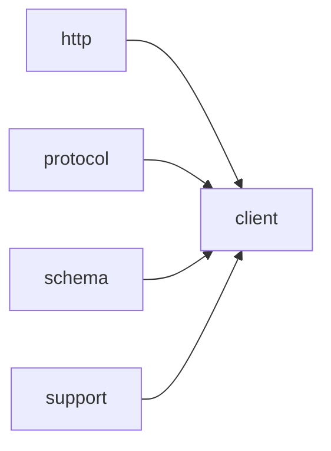

# Module `client`

## Summary

`client` 模块是 `clore::net` 库中负责网络客户端逻辑的核心组件。它封装了与语言模型 API 异步交互的完整流程，包括请求的构建、发送、结果收集与解析，并提供了状态变量存储原始响应、解析结果、请求参数、工具标记等运行时数据。公开接口以一组模板函数（`call_completion_async`、`call_llm_async`、`call_structured_async`）为主，它们将底层协议抽象为模板参数，统一管理事件循环调度，并返回整数句柄用于跟踪异步操作。模块内部通过 `detail::select_event_loop` 等辅助机制确保事件循环的正确绑定，并依赖 `http`、`protocol`、`schema` 和 `support` 等模块完成网络传输、消息结构定义、JSON 模式生成及通用工具支持，构成了一个可扩展的异步调用框架。

## Imports

- [`http`](../http/index.md)
- [`protocol`](../protocol/index.md)
- [`schema`](../schema/index.md)
- `std`
- [`support`](../support/index.md)

## Imported By

- [`anthropic`](../anthropic/index.md)
- [`openai`](../openai/index.md)

## Dependency Diagram

## Functions

### `clore::net::call_completion_async`

Declaration: `network/client.cppm:16`

Definition: `network/client.cppm:57`

Declaration: [`Namespace clore::net`](../../namespaces/clore/net/index.md)

函数 `clore::net::call_completion_async` 实现了一个带重试和自适应能力探测的异步请求循环。算法在最多四次迭代中工作：每次迭代通过 `Protocol::read_environment` 获取环境配置，然后使用 `get_probed_capabilities` 检索当前能力缓存，并调用 `sanitize_request_for_capabilities` 根据缓存能力调整请求。若初始请求包含工具但清理后工具为空（`tools_stripped` 为真），则会在成功获取响应后直接失败。对于每一次迭代，函数通过 `detail::select_event_loop` 确定活动事件循环，并异步调用 `perform_http_request_async` 发送 HTTP 请求。如果收到 4xx 状态码，则检查响应体是否为特征拒绝错误（`is_feature_rejection_error`），若匹配则解析被拒绝的特征（`parse_rejected_feature_from_error`），并相应更新能力缓存中的标志（如 `supports_json_schema`、`supports_tool_choice` 等），然后使用调整后的请求（`sanitized`）继续下一次循环。若状态码非拒绝错误或解析失败，则立即以错误终止。成功收到 2xx 响应后，调用 `Protocol::parse_response` 解析返回数据；如果工具被剥离且请求原本需要工具，则返回工具不支持错误；否则返回解析结果。如果所有重试均耗尽，函数最终返回能力探测耗尽错误。整个流程依赖 `clore::net::detail::select_event_loop` 进行事件循环选择，并利用 `kota::task` 实现协程异步控制。

#### Side Effects

- 发送 HTTP POST 请求到 LLM 提供商的 API
- 通过 `get_probed_capabilities` 返回的引用修改全局能力缓存中的 `supports_json_schema`、`supports_tool_choice`、`supports_parallel_tool_calls`、`supports_tools` 等布尔字段
- 调用 `logging::warn` 记录特性拒绝和重试信息

#### Reads From

- 参数 `request` 的 `tools` 字段及完整内容
- 参数 `loop`（通过 `detail::select_event_loop` 获取事件循环引用）
- `Protocol::read_environment()` 返回的环境变量
- `get_probed_capabilities` 返回的全局能力缓存对象
- HTTP 响应中的 `raw_response.body` 和 `raw_response.http_status`

#### Writes To

- 全局能力缓存（`ProbedCapabilities` 对象）中的 `supports_json_schema`、`supports_tool_choice`、`supports_parallel_tool_calls`、`supports_tools` 字段
- 日志输出（通过 `logging::warn`）

#### Usage Patterns

- 用于构建 LLM 完成请求的异步接口
- 支持能力探测和自动降级功能
- 内部被 `call_llm_async` 或类似函数调用（作为底层实现）

### `clore::net::call_llm_async`

Declaration: `network/client.cppm:20`

Definition: `network/client.cppm:138`

Declaration: [`Namespace clore::net`](../../namespaces/clore/net/index.md)

该函数首先通过 `detail::select_event_loop(loop)` 获取或创建事件循环引用 `active_loop`。然后构造一个封装了 `call_completion_async<Protocol>` 调用的 lambda，并将该 lambda 与 `model`、`system_prompt`、`request` 以及 `active_loop` 一同传递给 `detail::request_text_once_async`。`request_text_once_async` 执行实际的异步请求逻辑，返回一个可取消的 `kota::task`。函数在该任务上调用 `.catch_cancel()` 以处理取消事件，再通过 `detail::unwrap_caught_result` 将结果包装为 `clore::net::LLMError` 形式的错误。最终 `co_await` 整个链条并返回结果字符串或错误。所有异步操作均调度在 `active_loop` 上。

#### Side Effects

- Performs an asynchronous network request to an LLM API
- May produce side effects in the event loop via coroutine suspension
- Handles cancellation and error conversion

#### Reads From

- Parameter `model`
- Parameter `system_prompt`
- Parameter `request` (a `PromptRequest`)
- Parameter `loop` (a `kota::event_loop*`)
- Internal call to `detail::select_event_loop(loop)`
- Internal call to `detail::request_text_once_async` and `call_completion_async<Protocol>`

#### Usage Patterns

- Used to asynchronously call an LLM for a text completion
- Often paired with an event loop for coroutine execution
- Provides error handling through `LLMError` and cancellation support

### `clore::net::call_llm_async`

Declaration: `network/client.cppm:27`

Definition: `network/client.cppm:157`

Declaration: [`Namespace clore::net`](../../namespaces/clore/net/index.md)

该函数通过调用 `detail::select_event_loop` 解析外部的 `kota::event_loop*` 参数，以确定活跃的事件循环引用 `active_loop`。随后，它构造一个 `clore::net::PromptRequest`，其中包含原始 `prompt`、空的响应格式（`std::nullopt`）以及 `clore::net::PromptOutputContract::Markdown` 输出约定，然后将此请求与 `model` 和 `system_prompt` 一并传递给 `detail::request_text_once_async`。这个底层辅助函数接收一个可调用对象，该对象在内部为每次请求调用模板函数 `call_completion_async<Protocol>`，将构造的 `CompletionRequest` 和事件循环引用传递给它。最终，通过 `.or_fail()` 将协程结果展平为 `kota::task<std::string, clore::net::LLMError>` 并返回。整个过程完全异步，依赖 `detail::select_event_loop` 来确保事件循环的正确绑定，而实际的网络交互则交由 `call_completion_async` 完成。

#### Reads From

- 参数 `model`
- 参数 `system_prompt`
- 参数 `prompt`
- 参数 `loop`
- 事件循环状态（通过 `detail::select_event_loop`）

#### Usage Patterns

- 通过事件循环异步发起LLM文本生成请求
- 与 `clore::net::call_structured_async` 配合使用处理结构化输出
- 在协程中 `co_await` 等待结果

### `clore::net::call_structured_async`

Declaration: `network/client.cppm:34`

Definition: `network/client.cppm:178`

Declaration: [`Namespace clore::net`](../../namespaces/clore/net/index.md)

该函数首先通过 `clore::net::schema::response_format<T>()` 尝试获取结构化输出所需的 JSON schema；若获取失败则立即通过 `kota::fail` 终止协程。接着构造一个 `clore::net::CompletionRequest`，其中填充了 `model`、`system_prompt` 和 `prompt`，并将 `response_format` 设为刚获取的 schema，同时清空 `tools` 和 `tool_choice`。随后调用 `clore::net::call_completion_async<Protocol>` 发起实际的 LLM 调用（该调用会依据 `Protocol` 选择具体的网络后端），并在返回结果上调用 `.or_fail()` 以将错误转换为协程异常。得到原始响应后，使用 `clore::net::protocol::parse_response_text<T>` 将响应体中的文本解析为目标类型 `T`；同样地，若解析失败则通过 `kota::fail` 终止。最后 `co_return` 解析成功的值。整个流程将 schema 获取、请求构造、网络调用与结构化反序列化串联为单一的协程调用，依赖 `clore::net::call_completion_async` 完成核心 I/O 和协议处理。

#### Side Effects

- performs asynchronous network I/O via `call_completion_async`
- allocates memory for `CompletionRequest` strings
- potentially triggers side effects in the network layer (e.g., rate limiting, logging)

#### Reads From

- reads `model`, `system_prompt`, `prompt` parameters
- reads response format from `clore::net::schema::response_format<T>()`
- reads response data from network via `call_completion_async`

#### Writes To

- writes result to the returned `kota::task`
- allocates and writes to `CompletionRequest` objects

#### Usage Patterns

- used to call an LLM expecting a structured output of type `T`
- called with a specific protocol and type template arguments

### `clore::net::detail::select_event_loop`

Declaration: `network/client.cppm:45`

Definition: `network/client.cppm:45`

Declaration: [`Namespace clore::net::detail`](../../namespaces/clore/net/detail/index.md)

Implementation: [Implementation](functions/select-event-loop.md)

该函数的行为基于一个简单的三元分支：如果传入的 `loop` 指针非空，则直接解引用并返回该 `kota::event_loop` 对象；否则，调用静态方法 `kota::event_loop::current()` 获取当前线程的活动事件循环引用。其内部依赖 `kota::event_loop` 的 `current()` 实现，该实现必须返回一个有效的事件循环——若当前线程无关联的活跃循环，行为未定义。此函数是 `clore::net::detail` 命名空间下的一个简化的返回引用工具，用于在其他异步调用函数（如 `call_llm_async`）中统一获取事件循环实例，避免重复执行空指针检查或默认回退逻辑。

#### Side Effects

No observable side effects are evident from the extracted code.

#### Reads From

- `loop` 参数
- `kota::event_loop::current()` 返回的当前线程事件循环状态

#### Usage Patterns

- 用于将可选的 `event_loop*` 解析为确定的引用
- 被 `call_completion_async`、`call_llm_async` 等高层函数调用以获取事件循环

## Internal Structure

客户端模块是 `clore::net` 库的网络调用入口，以三个模板函数 `call_completion_async`、`call_llm_async` 和 `call_structured_async` 暴露异步 LLM 交互能力。每个函数均通过模板参数 `Protocol` 支持多种协议实现，并依赖可选的 `kota::event_loop*` 参数来绑定事件循环；内部通过 `detail::select_event_loop` 决策实际使用的事件循环，确保调用方总能获得有效引用。模块内部将请求参数（模型标识、提示、系统提示、请求负载等）与响应暂存变量（原始响应、解析结果、拒绝标志等）集中在函数体作用域内，未引入公开类或复杂状态机，保持扁平的函数式分解。

模块导入 `http` 用于底层网络通信，`protocol` 提供消息结构与请求/响应对象，`schema` 处理输出格式与工具定义，`support` 提供文本处理与缓存键等基础设施，`std` 提供标准库类型。整体结构清晰：外部模板函数负责参数收集与异步发起，`detail` 空间承担事件循环选择等内部决策；所有协议具体实现由模板实例化注入，不直接耦合于该模块。

## Related Pages

- [Module http](../http/index.md)
- [Module protocol](../protocol/index.md)
- [Module schema](../schema/index.md)
- [Module support](../support/index.md)

