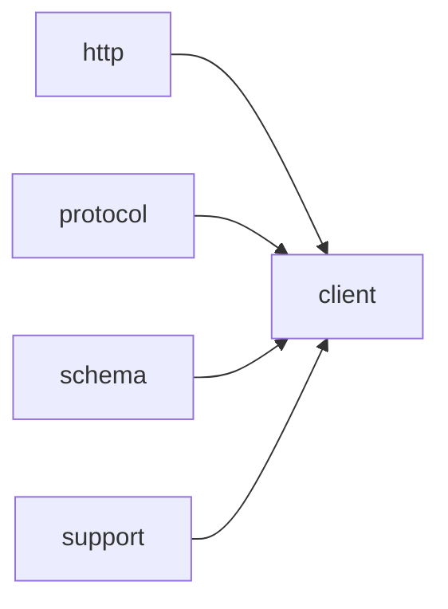

# Module `client`

## Summary

`client` 模块是 LLM（大语言模型）网络通信的异步客户端层。它提供了三项公开的模板函数——`call_completion_async`、`call_llm_async` 和 `call_structured_async`，分别用于发起补全、通用 LLM 调用和结构化输出请求。这些函数通过模板参数 `Protocol` 抽象不同 LLM 提供者的协议细节，并利用 `kota::event_loop` 进行异步回调调度；内部依赖 `clore::net::detail::select_event_loop` 将可选的循环指针解析为确定引用，从而简化调用者的事件循环管理。

该模块的公共实现范围涵盖这些异步入口点及其共用的辅助设施，不对外暴露底层 HTTP 请求细节、协议解析或 schema 处理逻辑。它依赖 `http`、`protocol`、`schema` 与 `support` 模块，共同构成针对 LLM 的通用、可扩展的异步通信能力。

## Imports

- [`http`](../http/index.md)
- [`protocol`](../protocol/index.md)
- [`schema`](../schema/index.md)
- `std`
- [`support`](../support/index.md)

## Imported By

- [`anthropic`](../anthropic/index.md)
- [`openai`](../openai/index.md)

## Dependency Diagram

## Functions

### `clore::net::call_completion_async`

Declaration: `network/client.cppm:16`

Definition: `network/client.cppm:57`

Declaration: [`Namespace clore::net`](../../namespaces/clore/net/index.md)

实现摘要如下：

`clore::net::call_completion_async` 是一个模板化的异步函数，负责向大模型服务发送补全请求并处理响应。其核心算法是一个最多四次迭代的重试循环，内部通过 `Protocol` 模板参数静态派生子类协议。每次迭代首先从 `get_probed_capabilities` 获取当前协议的能力缓存，再调用 `sanitize_request_for_capabilities` 剔除请求中不受支持的功能。随后构造请求 JSON、解析环境变量，并通过 `detail::select_event_loop` 确定活跃事件循环，最后执行 `detail::perform_http_request_async` 发送 HTTP 请求并接收原始响应。

当收到 HTTP 4xx 状态码时，函数会利用 `is_feature_rejection_error` 和 `parse_rejected_feature_from_error` 判断是否为特性拒绝错误（如 `response_format`、`tool_choice`、`parallel_tool_calls`、`tools`）。若是此类错误且重试次数未超过上限，则原子地更新缓存中对应能力位（如 `caps.supports_tools`），使用清理后的请求重新进入循环；若能力降级后仍无法满足原始需求（如工具被剥离），则立即返回 `LLMError`。循环正常退出后解析成功的响应，否则在耗尽重试次数后返回能力探测耗尽错误。整个控制流依赖 `clore::net::detail::select_event_loop` 进行事件循环适配，并使用 `kota::task` 和 `kota::fail` 实现协程化错误传递。

#### Side Effects

- Modifies atomic capability flags in the `ProbedCapabilities` instance returned by `get_probed_capabilities`
- Performs an asynchronous HTTP request to the LLM provider
- Logs warnings via `logging::warn` when a feature is rejected and retrying

#### Reads From

- Parameter `request` (a `CompletionRequest`)
- Global `ProbedCapabilities` cache accessed via `get_probed_capabilities`
- Environment variables read by `Protocol::read_environment`
- `Protocol` static members such as `provider_name`
- `loop` parameter to select the event loop

#### Writes To

- Atomic boolean members of the `ProbedCapabilities` object (e.g., `supports_json_schema`, `supports_tools`)
- Log output via `logging::warn`
- Coroutine promise state (via `co_await` and `co_return`)

#### Usage Patterns

- Called as a coroutine with `co_await`
- Used to perform completion requests with automatic capability probing
- Integrates with `clore::net::detail::perform_http_request_async` for HTTP transport

### `clore::net::call_llm_async`

Declaration: `network/client.cppm:20`

Definition: `network/client.cppm:137`

Declaration: [`Namespace clore::net`](../../namespaces/clore/net/index.md)

该函数是一个协程模板，内部首先通过 `detail::select_event_loop` 将传入的 `loop` 指针解析为活跃的事件循环引用 `active_loop`。随后构造一个由 `clore::net::detail::request_text_once_async` 驱动的异步请求管道：它接受一个 lambda，该 lambda 将 `clore::net::CompletionRequest` 和事件循环引用转发给 `call_completion_async`；同时接收 `model`、`system_prompt` 和 `request` 作为外部参数，并以 `active_loop` 作为执行环境。整个协程的返回值经由 `detail::unwrap_caught_result` 展开，并在取消时通过 `.catch_cancel()` 捕获，以 `"LLM request cancelled"` 字符串格式化错误信息。核心控制流遵循“选择循环 → 构造请求 → 发送 → 展开并处理取消”的顺序，依赖 `detail::select_event_loop` 提供事件循环决策，依赖 `request_text_once_async` 和 `call_completion_async` 完成实际的网络交互与协议编解码。

#### Side Effects

- Calls `call_completion_async` which performs network I/O for the LLM request
- May cancel the coroutine, triggering cancellation-related side effects

#### Reads From

- `model` (`std::string_view`)
- `system_prompt` (`std::string_view`)
- `request` (`clore::net::PromptRequest`)
- `loop` (`kota::event_loop`*)

#### Writes To

- Return value (`kota::task<std::string, clore::net::LLMError>`) containing the LLM response or error

#### Usage Patterns

- Used by callers requiring asynchronous text completion from an LLM
- Often invoked with a custom event loop for non-blocking I/O

### `clore::net::call_llm_async`

Declaration: `network/client.cppm:27`

Definition: `network/client.cppm:156`

Declaration: [`Namespace clore::net`](../../namespaces/clore/net/index.md)

函数 `clore::net::call_llm_async` 的实现是一个协程，它首先通过 `detail::select_event_loop` 获取活动的事件循环引用，然后委托给 `clore::net::detail::request_text_once_async`。该函数接收一个 lambda 闭包，在闭包内构造 `CompletionRequest` 并调用 `call_completion_async<Protocol>` 发起实际的异步请求；同时还传递了模型标识、系统提示和一个 `PromptRequest` 实例（其 `prompt` 字段来自调用参数，`response_format` 为 `std::nullopt`，`output_contract` 设为 `PromptOutputContract::Markdown`）。最终结果通过 `.or_fail()` 将错误转换为 `clore::net::LLMError` 并返回。整个流程的协程依赖 `detail::select_event_loop` 和 `detail::request_text_once_async`，后者内部封装了重试与错误处理逻辑。

#### Side Effects

- 发起网络 I/O 请求以调用语言模型

#### Reads From

- 参数 `model`
- 参数 `system_prompt`
- 参数 `prompt`
- 参数 `loop`

#### Usage Patterns

- 用于异步获取 LLM 生成的文本回复
- 与其他 `call_llm_async` 重载类似，但支持自定义事件循环

### `clore::net::call_structured_async`

Declaration: `network/client.cppm:34`

Definition: `network/client.cppm:177`

Declaration: [`Namespace clore::net`](../../namespaces/clore/net/index.md)

函数 `clore::net::call_structured_async` 首先通过 `clore::net::schema::response_format<T>()` 获取类型 `T` 对应的结构化响应格式，若该操作失败则立即通过 `kota::fail` 返回错误。随后构造一个 `clore::net::CompletionRequest` 实例，将 `model`、`system_prompt`、`prompt` 以及获取到的 `response_format` 填入其中，并将 `tools`、`tool_choice`、`parallel_tool_calls` 置为空值。接着调用 `clore::net::call_completion_async<Protocol>` 发送该请求，通过 `.or_fail()` 等待异步结果并自动处理异常。

得到原始响应后，函数使用 `clore::net::protocol::parse_response_text<T>` 将响应文本解析为目标类型 `T`。若解析失败同样通过 `kota::fail` 返回错误，成功则协程返回解析后的值。整个流程严格依赖 `Protocol` 参数指定的协议实现以及 `kota` 提供的异步原语，核心算法围绕“获取格式 → 构造请求 → 调用完成API → 解析结构化结果”这一线性步骤展开。

#### Side Effects

- Initiates an asynchronous network I/O operation via `call_completion_async`.

#### Reads From

- `model`
- `system_prompt`
- `prompt`
- `loop`
- Global schema configuration via `clore::net::schema::response_format<T>()`

#### Writes To

- The returned `kota::task` object that will eventually resolve to a value of type `T` or an error.

#### Usage Patterns

- Used to make structured asynchronous LLM calls where the response is parsed into a specific C++ type.
- Typically invoked with a concrete `Protocol` and `T` type arguments.
- Often called within other coroutines or event loop contexts.

### `clore::net::detail::select_event_loop`

Declaration: `network/client.cppm:45`

Definition: `network/client.cppm:45`

Declaration: [`Namespace clore::net::detail`](../../namespaces/clore/net/detail/index.md)

Implementation: [Implementation](functions/select-event-loop.md)

该函数首先检查传入的 `loop` 指针是否为空；若非空则直接返回其引用，否则回退到通过 `kota::event_loop::current()` 获取当前线程的默认事件循环。这一选择逻辑依赖于调用方保证当 `loop` 为空时当前线程已关联一个有效的 `kota::event_loop` 实例，否则行为未定义。内部没有循环或异步操作，仅是一个简单的条件转发，将外部提供的循环或线程局部默认循环统一为引用返回。

#### Side Effects

No observable side effects are evident from the extracted code.

#### Reads From

- `loop` parameter
- `kota::event_loop::current()` result

#### Usage Patterns

- Used by `call_completion_async` and `call_llm_async` to obtain a valid event loop reference from an optional pointer
- Invoked with a potentially null `kota::event_loop*` to default to the current loop

## Internal Structure

client 模块是网络层中面向 LLM 客户端操作的核心入口，它通过一组模板异步函数（如 `call_completion_async`、`call_llm_async`、`call_structured_async`）对外暴露统一的异步调用接口。这些函数均接受一个可选的 `kota::event_loop*` 参数，允许调用者将异步回调绑定到指定的事件循环上；若为空则使用 `detail::select_event_loop` 选择的默认循环。模块内部解耦为公共调用桩与底层实现：`detail` 子命名空间封装了事件循环选择等辅助逻辑，而协议处理、HTTP 通信、JSON 模式生成等功能则分别委托给所依赖的 `protocol`、`http`、`schema` 模块，基础文本与文件操作依赖 `support` 模块。

实现结构上，client 模块以强类型接口隔离了调用者与异步细节。每个公开函数都是轻量模板，负责解析参数、通过 `detail` 获取可靠的事件循环引用，再将请求参数组合并转发给下层协议与 HTTP 模块。关键的异步状态（如 `loop`、`request`、`system_prompt`、`model`）在模块内部以局部变量或公开成员（如 `parsed`、`request_json`、`raw_response`）的形式存在，支撑着回调上下文的管理。这种分层设计使得客户端代码只需关心模型、提示和事件循环，而将协议适配、请求编排和响应解析隐藏在下层。

## Related Pages

- [Module http](../http/index.md)
- [Module protocol](../protocol/index.md)
- [Module schema](../schema/index.md)
- [Module support](../support/index.md)

