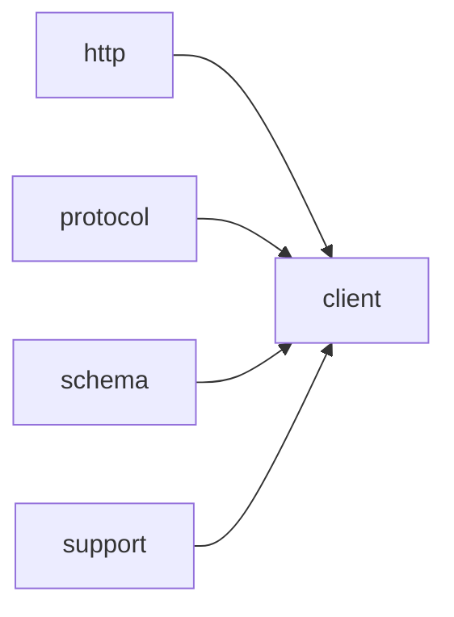

# Module `client`

## Summary

该模块是面向 LLM 网络通信的高层抽象，主要负责发起异步 LLM 调用并管理请求/响应的完整生命周期。它公开了三个模板函数作为主要入口：`call_completion_async`、`call_llm_async` 和 `call_structured_async`，分别对应不同类型的异步交互（通用完成、直接 LLM 调用、结构化输出）。调用者通过模板参数指定协议，并传入标识符、模型、提示、事件循环等参数；函数返回整数表示提交状态或句柄。模块内部依赖 `http` 模块执行网络请求，并利用 `protocol`、`schema` 和 `support` 模块处理协议适配、数据格式化和日志/工具支持。

模块同时公开了多个中间变量（如 `request_json`、`raw_response`、`sanitized`、`parsed` 等），这些变量反映了请求构造、能力探测、响应解析等阶段的状态，为上层调试或扩展提供了可见性。此外，`detail` 子命名空间内的 `select_event_loop` 函数为异步操作提供了统一的事件循环选择逻辑，确保调用方可以灵活传入 `nullptr` 或显式循环实例。

## Imports

- [`http`](../http/index.md)
- [`protocol`](../protocol/index.md)
- [`schema`](../schema/index.md)
- [`support`](../support/index.md)

## Imported By

- [`anthropic`](../anthropic/index.md)
- [`openai`](../openai/index.md)

## Dependency Diagram

```mermaid
graph LR
    M0["client"]
    I0["http"]
    I0 --> M0
    I1["protocol"]
    I1 --> M0
    I2["schema"]
    I2 --> M0
    I3["support"]
    I3 --> M0
```

## Functions

### `clore::net::call_completion_async`

Declaration: `src/network/client.cppm:24`

Definition: `src/network/client.cppm:65`

Declaration: [`Namespace clore::net`](../../namespaces/clore/net/index.md)

`clore::net::call_completion_async` 是一个模板函数，其核心算法围绕**能力探测与自动降级重试**展开。函数在最多 4 次迭代的循环内工作：每次迭代首先通过 `Protocol::read_environment` 读取运行时环境，然后利用 `get_probed_capabilities` 获取缓存的服务端能力（由 `Protocol::capability_probe_key` 生成键），再调用 `sanitize_request_for_capabilities` 根据当前能力裁剪请求（例如移除不支持的工具或格式）。接着构造请求 JSON，通过 `clore::net::detail::perform_http_request_async` 执行异步 HTTP 调用，并检查响应状态码。若收到 4xx 且错误体指示某特性被拒绝（如 `response_format`、`tool_choice`、`parallel_tool_calls` 或 `tools`），则更新对应能力标志（使用 `std::memory_order_relaxed`）并重新使用已裁剪的请求进行下一轮重试；若连续重试达 3 次仍未成功，或非拒绝类错误，则直接失败。成功响应会经由 `Protocol::parse_response` 解析返回。工具被剥离但原始请求需要工具时，函数会提前失败。所有异步操作均依赖于 `kota::event_loop`，并通过 `clore::net::detail::select_event_loop` 来解析实际的事件循环对象。

#### Side Effects

- Performs HTTP requests via `perform_http_request_async`
- Atomically updates probed capability flags in `ProbedCapabilities`
- Logs warnings via `logging::warn`
- Fails the coroutine with `LLMError`
- Reads environment variables via `Protocol::read_environment`

#### Reads From

- `request` parameter
- `loop` parameter
- `Protocol::read_environment()` result
- `get_probed_capabilities()` return value
- `Protocol::build_url()` and `Protocol::build_headers()`
- HTTP response body

#### Writes To

- Probed capabilities atomics: `supports_json_schema`, `supports_tool_choice`, `supports_parallel_tool_calls`, `supports_tools`
- Logging output
- Network I/O
- Returned `CompletionResponse` via `co_return`

#### Usage Patterns

- Used by higher-level completion functions to handle feature probing transparently
- Called with an event loop to schedule async work

### `clore::net::call_llm_async`

Declaration: `src/network/client.cppm:35`

Definition: `src/network/client.cppm:165`

Declaration: [`Namespace clore::net`](../../namespaces/clore/net/index.md)

函数 `clore::net::call_llm_async` 的实现首先通过 `detail::select_event_loop` 将可选的 `loop` 解析为有效的 `kota::event_loop` 引用 `active_loop`。接着它委托给 `detail::request_text_once_async`，传入一个内部 lambda 以及 `model`、`system_prompt`、一个 `PromptRequest` 对象和 `active_loop`。该 lambda 接收 `clore::net::CompletionRequest` 和请求所在的事件循环引用，并调用模板化的 `call_completion_async<Protocol>` 执行实际的完成请求。`PromptRequest` 的结构中，`prompt` 被转化为 `std::string`，`response_format` 设为 `std::nullopt`，`output_contract` 指定为 `PromptOutputContract::Markdown`。最终通过 `.or_fail()` 将协程的结果类型转换为 `std::string` 或 `LLMError` 并返回。

内部控制流完全围绕协程展开：`co_await` 等待 `request_text_once_async` 完成，该函数内部会处理重试、错误处理等逻辑（未在此处体现）。核心依赖包括 `detail::select_event_loop` 用于获取活动事件循环，以及 `call_completion_async` 作为底层 LLM 完成调用的入口，后者需要由调用者通过 `Protocol` 模板参数特化。整个过程不涉及显式的 JSON 解析或结构提取，只请求纯文本的 Markdown 格式响应。

#### Side Effects

- performs asynchronous network I/O to call the LLM API
- may trigger rate limiting and capability probing
- interacts with internal completion request system

#### Reads From

- parameters: `model`, `system_prompt`, `prompt`, `loop`
- global state: rate limiters
- global state: probed capabilities via `get_probed_capabilities`

#### Writes To

- updates internal rate limiting state
- may update probed capabilities cache
- sends network requests and receives responses (I/O)

#### Usage Patterns

- used to asynchronously generate text from an LLM
- called with a model identifier, system prompt, and user prompt
- used within event-loop-driven applications

### `clore::net::call_llm_async`

Declaration: `src/network/client.cppm:28`

Definition: `src/network/client.cppm:146`

Declaration: [`Namespace clore::net`](../../namespaces/clore/net/index.md)

`clore::net::call_llm_async` 的实现首先通过调用 `detail::select_event_loop` 确定活跃的事件循环引用（无论传入的指针是否为空），然后委托给 `detail::request_text_once_async`，后者接受一个回调 lambda 以及 `model`、`system_prompt` 和 `request`。该 lambda 内部调用 `call_completion_async<Protocol>` 将序列化的文本请求提交到指定的事件循环。整个协程链被包裹在 `detail::unwrap_caught_result` 中，它会将取消异常转换为 `LLMError`（附带消息 "LLM request cancelled"）。最终返回一个带有结果字符串或错误状态的 `kota::task`。

核心控制流是异步的：协程等待 `request_text_once_async` 完成，后者内部等待 `call_completion_async` 发起的网络操作。错误和取消都在 `unwrap_caught_result` 层统一处理，而 `select_event_loop` 则保证了事件循环的可用性——若传入 `nullptr` 则回退到全局默认循环。整个函数依赖 `detail` 命名空间中的内部辅助函数和 `kota::event_loop` 的异步机制。

#### Side Effects

- 执行异步网络 I/O 操作以调用 LLM 服务
- 可能触发内部的速率限制检查与状态更新（基于 `clore::net::detail` 相关组件）
- 通过协程返回结果字符串，修改调用方的执行流

#### Reads From

- 参数 `model`（`std::string_view`）
- 参数 `system_prompt`（`std::string_view`）
- 参数 `request`（`clore::net::PromptRequest`）
- 参数 `loop`（`kota::event_loop*`）
- 通过 `detail::select_event_loop` 读取全局或传入的事件循环状态

#### Writes To

- 输出协程结果（`std::string`）
- 可能写入速率限制相关状态（间接通过 `detail::request_text_once_async` 的内部实现）

#### Usage Patterns

- 作为网络层公共接口，用于发起需要异步等待的 LLM 调用
- 通常被更上层的封装函数或业务逻辑直接 `co_await` 使用
- 配合错误处理、取消捕获等协程机制
- 重载版本接受 `int` 类型的请求，但证据中提供的实现使用 `PromptRequest`

### `clore::net::call_structured_async`

Declaration: `src/network/client.cppm:42`

Definition: `src/network/client.cppm:186`

Declaration: [`Namespace clore::net`](../../namespaces/clore/net/index.md)

实现首先通过 `clore::net::schema::response_format<T>()` 推导目标类型 `T` 的期望 JSON 模式，若生成失败则使用 `kota::fail` 提前终止协程。随后构造一个 `clore::net::CompletionRequest`，将传入的 `model`、`system_prompt` 和 `prompt` 分别填入 `model` 字段及 `messages` 数组中的 `SystemMessage` 与 `UserMessage`，并将上一步获得的格式赋值给 `response_format`，同时将 `tools`、`tool_choice` 和 `parallel_tool_calls` 置为空或 `nullopt`。接着将该请求连同 `loop` 委托给模板函数 `clore::net::call_completion_async<Protocol>` 执行，并通过 `.or_fail()` 获得原始响应。最后调用 `clore::net::protocol::parse_response_text<T>(response)` 将响应文本解析为类型 `T`，若解析失败则同样通过 `kota::fail` 终止，否则返回解析结果。该函数依赖 `clore::net::schema::response_format`、`clore::net::call_completion_async` 和 `clore::net::protocol::parse_response_text` 三个核心组件，并使用 `kota::task` 与 `kota::fail` 实现异步错误传播。

#### Side Effects

- Initiates an asynchronous network request to an LLM provider via `call_completion_async`
- May access and update internal rate‑limiting or capability‑probing state indirectly through callees

#### Reads From

- `model` parameter (`std::string_view`)
- `system_prompt` parameter (`std::string_view`)
- `prompt` parameter (`std::string_view`)
- `loop` parameter (`kota::event_loop` *)
- `clore::net::schema::response_format<T>()` (depends on type `T`)

#### Usage Patterns

- Calling an LLM with a structured output schema enforced by `response_format`
- Chaining `call_completion_async` followed by response parsing to obtain a typed result
- Using `kota::task` coroutine to await the external I/O operation

### `clore::net::detail::select_event_loop`

Declaration: `src/network/client.cppm:53`

Definition: `src/network/client.cppm:53`

Declaration: [`Namespace clore::net::detail`](../../namespaces/clore/net/detail/index.md)

Implementation: [Implementation](functions/select-event-loop.md)

`clore::net::detail::select_event_loop` 的实现遵循一个简单的分支策略。它首先检查 `loop` 参数是否为非空指针；若不为空，则立即返回通过解引用该指针获得的 `kota::event_loop` 引用。否则，它将依赖项委托给静态成员函数 `kota::event_loop::current()`，该函数按约定返回一个与调用线程关联的事件循环引用。如果当前线程上没有已注册的事件循环，此回退路径的行为是未定义的。

该函数的核心控制流仅有两条路径，没有循环或递归。其正确性依赖于调用方要么提供一个有效的 `loop` 指针，要么确保 `kota::event_loop::current()` 在当前线程上下文中有可返回的合法对象。它没有额外的错误检查或日志记录，因此性能开销极低。

#### Side Effects

No observable side effects are evident from the extracted code.

#### Reads From

- parameter `loop` (pointer to `kota::event_loop`)
- current event loop via `kota::event_loop::current()`

#### Usage Patterns

- callers like `clore::net::call_llm_async` and `clore::net::call_completion_async` pass an optional `kota::event_loop*` to obtain a guaranteed valid reference for async operations

## Internal Structure

模块 `client` 作为 LLM 调用的公共入口，将异步网络请求、协议交互、结构化输出与事件循环管理组织为清晰的层次。它通过 `http`、`protocol`、`schema` 和 `support` 模块的导入，实现了请求构建、能力探测、响应解析以及 JSON Schema 映射的解耦。内部通过 `detail::select_event_loop` 统一处理事件循环的生命周期，公共模板 `call_completion_async`、`call_llm_async` 和 `call_structured_async` 分别对应完成式、通用 LLM 调用和结构化输出场景，它们接受 `Protocol` 与可选的 `kota::event_loop` 指针，返回整数句柄以支持异步监控。模块内部变量（如 `active_loop`、`request`、`model`、`system_prompt`）和公共变量（如 `request_json`、`raw_response`、`sanitized`、`parsed`）明确了请求构造到响应处理的完整内部流程，体现了 “调用 → 构建 → 发送 → 解析” 的实现架构。

## Related Pages

- [Module http](../http/index.md)
- [Module protocol](../protocol/index.md)
- [Module schema](../schema/index.md)
- [Module support](../support/index.md)

