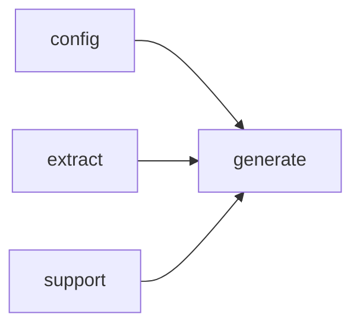

# Module `generate:analysis`

## Summary

`generate::analysis` 模块负责将原始模型输出解析、规范化并合并为结构化的符号分析结果，构成文档生成管线中分析处理的核心层。它公开了从提示构建、响应解析、回退分析存储到分析结果应用的全套实现，包括 `parse_structured_response`、`normalize_markdown_fragment`、`parse_markdown_prompt_output`、`build_symbol_analysis_prompt`、`apply_symbol_analysis_response` 以及针对函数、类型、变量的专用解析与合并函数。该模块还提供提示种类判定函数（如 `is_declaration_summary_prompt`、`is_base_symbol_analysis_prompt`）和规范化工具，确保所有分析数据在进入后续生成步骤前保持一致、可用的格式。

## Imports

- [`config`](../config/index.md)
- [`extract`](../extract/index.md)
- [`generate:evidence`](evidence.md)
- [`generate:markdown`](markdown.md)
- [`generate:model`](model.md)
- `std`
- [`support`](../support/index.md)

## Imported By

- [`generate:dryrun`](dryrun.md)
- [`generate:scheduler`](scheduler.md)

## Dependency Diagram

## Functions

### `clore::generate::analysis_prompt_kind_for_symbol`

Declaration: `generate/analysis.cppm:27`

Definition: `generate/analysis.cppm:286`

Declaration: [`Namespace clore::generate`](../../namespaces/clore/generate/index.md)

该函数根据符号种类确定分析提示类型。它依次调用 `is_function_kind`、`is_type_kind` 和 `is_variable_kind` 检测 `sym.kind`，若匹配则分别返回 `PromptKind::FunctionAnalysis`、`PromptKind::TypeAnalysis` 或 `PromptKind::VariableAnalysis`；若均不匹配则返回 `std::nullopt`。控制流为简单的分支顺序判断，依赖 `PromptKind` 枚举及三个种类谓词函数。

#### Side Effects

No observable side effects are evident from the extracted code.

#### Reads From

- `sym` parameter
- `sym.kind`

#### Usage Patterns

- Used to map a `SymbolInfo` to a `PromptKind` for analysis
- Called during analysis prompt generation to determine which prompt to use for a symbol

### `clore::generate::apply_symbol_analysis_response`

Declaration: `generate/analysis.cppm:39`

Definition: `generate/analysis.cppm:348`

Declaration: [`Namespace clore::generate`](../../namespaces/clore/generate/index.md)

函数 `clore::generate::apply_symbol_analysis_response` 通过一个 `PromptKind` 驱动的 `switch` 分支来编排符号分析结果的存储与合并。对于每种分析类型（函数、类型、变量），它首先调用相应的 `parse_*_lenient` 或 `parse_markdown_prompt_output` 对原始响应字符串进行宽松解析，若解析失败则立即返回 `std::unexpected` 包装的 `GenerateError`。函数和类型分析分支进一步利用已知的 `fallback_*_analysis` 生成回退数据，再通过 `merge_*_analysis` 将解析出的结构化分析合并到 `SymbolAnalysisStore` 中对应条目（例如 `analyses.functions[target_key]` 或 `analyses.types[target_key]`）。声明与实现摘要分支直接根据 `PromptKind` 将解析得到的 Markdown 片段存入 `analysis.overview_markdown` 或 `analysis.details_markdown`。变量分析分支则简单地将解析结果赋值给 `analyses.variables[target_key]`。未预期的 `PromptKind` 会导致返回错误。该函数依赖 `make_symbol_target_key` 生成存储键，以及多个位于匿名命名空间中的解析、回退与合并辅助函数。

#### Side Effects

- Mutates the `SymbolAnalysisStore` reference by inserting or updating entries in `functions`, `types`, or `variables` maps.

#### Reads From

- `analyses` (to access existing analyses)
- `sym`
- `model`
- `kind`
- `raw_response`

#### Writes To

- `analyses.functions[target_key]`
- `analyses.types[target_key]`
- `analyses.variables[target_key]`

#### Usage Patterns

- Called after receiving a prompt response to persist parsed analysis data
- Used in the generation pipeline to update symbol analysis results

### `clore::generate::build_symbol_analysis_prompt`

Declaration: `generate/analysis.cppm:46`

Definition: `generate/analysis.cppm:429`

Declaration: [`Namespace clore::generate`](../../namespaces/clore/generate/index.md)

该函数根据传入的 `PromptKind` 选择对应的证据构建函数，通过 `switch` 语句分发到 `build_evidence_for_function_analysis`、`build_evidence_for_function_declaration_summary` 等七个专门化的证据收集器。每个收集器均基于 `sym`、`model`、`analyses` 和 `config.project_root` 生成一个 `EvidencePack` 实例。若 `kind` 不匹配任何已知类型，则直接返回 `std::unexpected` 错误。之后，将 `page_id`、`prompt_kind` 和 `subject_name` 填入证据包，并调用 `build_prompt` 将证据渲染为字符串。成功时通过移动语义返回字符串，否则返回构造的错误信息。

内部流程完全由 `kind` 驱动，依赖 `extract` 命名空间下的符号信息与模型访问、`build_prompt` 的模板化拼装逻辑，以及 `prompt_kind_name` 与 `make_symbol_target_key` 等辅助函数。错误处理集中体现在两个 `std::unexpected` 分支：分别对应未知的 prompt 种类和证据构建失败。

#### Side Effects

No observable side effects are evident from the extracted code.

#### Reads From

- `sym`
- `kind`
- `model`
- `config`
- `config.project_root`
- `analyses`
- `sym.qualified_name`
- return values of `build_evidence_for_*` functions

#### Writes To

- local `evidence` object (fields `page_id`, `prompt_kind`, `subject_name`)
- return value (the prompt string or error)

#### Usage Patterns

- used to generate analysis prompts for symbols
- called by prompt generation pipeline
- dispatches based on prompt kind

### `clore::generate::is_base_symbol_analysis_prompt`

Declaration: `generate/analysis.cppm:31`

Definition: `generate/analysis.cppm:325`

Declaration: [`Namespace clore::generate`](../../namespaces/clore/generate/index.md)

该函数通过单一返回语句实现，将传入的 `kind` 与 `PromptKind` 中的三个基础分析类别逐个比较：`PromptKind::FunctionAnalysis`、`PromptKind::TypeAnalysis` 和 `PromptKind::VariableAnalysis`。内部流程仅包含一个逻辑或表达式，无分支或循环。唯一的外部依赖是 `PromptKind` 枚举类型及其预定义的枚举值，这些值用于判断当前提示种类是否属于“基础符号分析”范畴。

#### Side Effects

No observable side effects are evident from the extracted code.

#### Reads From

- `kind` parameter

#### Usage Patterns

- used to filter prompt kinds for base symbol analysis
- called by other analysis functions to categorize prompts

### `clore::generate::is_declaration_summary_prompt`

Declaration: `generate/analysis.cppm:33`

Definition: `generate/analysis.cppm:330`

Declaration: [`Namespace clore::generate`](../../namespaces/clore/generate/index.md)

函数 `clore::generate::is_declaration_summary_prompt` 的核心逻辑是一个简单的分类判断：它接收一个 `PromptKind` 值（通过底层 `int` 参数传递），并依次将其与 `PromptKind::FunctionDeclarationSummary` 和 `PromptKind::TypeDeclarationSummary` 进行相等性比较，若匹配任一枚举值则返回 `true`，否则返回 `false`。该函数不涉及循环、分支嵌套或依赖外部可变状态，其内部控制流仅由两个短路求值的 `||` 运算符串联而成。

该函数的唯一依赖是 `PromptKind` 枚举类型的定义（包含 `FunctionDeclarationSummary` 和 `TypeDeclarationSummary` 两个成员），以及 `int` 到 `PromptKind` 的隐式转换（或底层类型一致性）。在符号分析流程中，它充当快速筛选器：用于从已知的 prompt kind 集合中识别出那些对应“函数声明摘要”或“类型声明摘要”的项，从而决定后续是否执行特定的 prompt 构造或响应解析分支。

#### Side Effects

No observable side effects are evident from the extracted code.

#### Reads From

- the `kind` parameter

#### Usage Patterns

- Used in conditional logic to branch based on whether a prompt kind is a declaration summary
- May be called during prompt construction or evidence building

### `clore::generate::normalize_markdown_fragment`

Declaration: `generate/analysis.cppm:21`

Definition: `generate/analysis.cppm:267`

Declaration: [`Namespace clore::generate`](../../namespaces/clore/generate/index.md)

函数 `clore::generate::normalize_markdown_fragment` 接收原始字符串 `raw` 和上下文描述 `context`，返回规范化后的 Markdown 片段或错误。算法首先通过 `clore::support::ensure_utf8` 保证输入为合法的 UTF-8 编码，随后调用 `clore::support::strip_utf8_bom` 移除可能存在的 BOM 头。接着调用 `trim_trailing_ascii_whitespace` 去除尾部空白字符，然后由 `contains_non_whitespace` 检查是否仅剩空白；若结果为空白，则返回携带格式化错误信息的 `std::unexpected`。最后调用 `normalize_analysis_markdown` 进行额外的 Markdown 内容规范化（如清理或格式化），并将最终结果返回。

该函数的控制流依赖于一系列内部辅助函数：`trim_trailing_ascii_whitespace`、`contains_non_whitespace` 和 `normalize_analysis_markdown`，其中 `normalize_analysis_markdown` 是负责具体 Markdown 规则的后处理步骤。返回值类型 `std::expected<std::string, GenerateError>` 提供了错误处理机制，错误信息通过 `std::format` 生成，包含触发空片段的 `context` 标识。

#### Side Effects

No observable side effects are evident from the extracted code.

#### Reads From

- parameter `raw`
- parameter `context`
- call to `clore::support::ensure_utf8`
- call to `clore::support::strip_utf8_bom`
- local variable `normalized`

#### Writes To

- local variable `normalized`
- return value (moved `normalized`)

#### Usage Patterns

- normalize AI-generated markdown fragments before rendering
- validate and clean markdown snippets for documentation pages

### `clore::generate::parse_markdown_prompt_output`

Declaration: `generate/analysis.cppm:24`

Definition: `generate/analysis.cppm:281`

Declaration: [`Namespace clore::generate`](../../namespaces/clore/generate/index.md)

The function `clore::generate::parse_markdown_prompt_output` serves as a thin wrapper around `clore::generate::normalize_markdown_fragment`. It receives the raw model output (`raw`) and a context string (`context`), then directly delegates the entire processing to `normalize_markdown_fragment`, which handles the actual normalization of the Markdown fragment. The return type is `std::expected<std::string, GenerateError>`, meaning any parsing or validation errors are propagated from the inner function without additional transformation. The function itself contains no conditional branches, loops, or state management beyond the delegation call.

#### Side Effects

No observable side effects are evident from the extracted code.

#### Reads From

- raw
- context

#### Usage Patterns

- used in the generation pipeline to normalize markdown responses from prompt outputs

### `clore::generate::parse_structured_response`

Declaration: `generate/analysis.cppm:18`

Definition: `generate/analysis.cppm:252`

Declaration: [`Namespace clore::generate`](../../namespaces/clore/generate/index.md)

函数 `clore::generate::parse_structured_response` 首先尝试通过 `json::from_json<T>` 将传入的 `raw` 字符串解析为类型 `T`。若解析失败，立即构造一个 `std::unexpected<GenerateError>` 返回，错误信息中包含 `context` 参数与底层解析错误详情。若解析成功，则将结果值转移至局部变量后再调用 `normalize_analysis` 进行一次后处理规范化，最终返回成功值。该函数的核心依赖是外部的 JSON 解析能力以及内部定义的规范化操作 `normalize_analysis`。

#### Side Effects

- calls `normalize_analysis` on the deserialized value, which may modify the object's fields

#### Reads From

- the `raw` input string
- the `context` input string
- parsed JSON data from `raw`

#### Writes To

- the returned `std::expected<T, GenerateError>` value
- the deserialized object of type `T` via `normalize_analysis`

#### Usage Patterns

- called to parse a structured JSON response from an AI prompt into an analysis object

### `clore::generate::store_fallback_analysis`

Declaration: `generate/analysis.cppm:35`

Definition: `generate/analysis.cppm:335`

Declaration: [`Namespace clore::generate`](../../namespaces/clore/generate/index.md)

函数 `clore::generate::store_fallback_analysis` 充当一个调度器，根据符号的种类将回退分析结果写入 `SymbolAnalysisStore`。内部通过检查 `sym.kind` 并依次调用 `is_function_kind`、`is_type_kind` 和 `is_variable_kind` 来判断符号类型：对于函数类型调用 `fallback_function_analysis`，对于类型类型调用 `fallback_type_analysis`（额外接收 `model` 参数），对于变量类型调用 `fallback_variable_analysis`。每个回退函数均在匿名命名空间中定义，负责生成对应符号的默认分析数据。该函数依赖 `make_symbol_target_key` 构造存储键，并直接按种类索引 `analyses` 的 `functions`、`types` 或 `variables` 子映射进行赋值，从而在无模型响应或解析失败时提供备选的分析内容。

#### Side Effects

- Writes to `analyses.functions`, `analyses.types`, or `analyses.variables` depending on the symbol kind

#### Reads From

- `sym` (specifically `sym.kind`)
- `model` (passed to `fallback_type_analysis`)
- `make_symbol_target_key(sym)`

#### Writes To

- `analyses.functions` (if function kind)
- `analyses.types` (if type kind)
- `analyses.variables` (if variable kind)

#### Usage Patterns

- Used to insert fallback analysis entries into a `SymbolAnalysisStore`
- Called when primary analysis is unavailable or incomplete

### `clore::generate::symbol_prompt_kinds_for_symbol`

Declaration: `generate/analysis.cppm:29`

Definition: `generate/analysis.cppm:299`

Declaration: [`Namespace clore::generate`](../../namespaces/clore/generate/index.md)

该函数首先调用 `clore::generate::analysis_prompt_kind_for_symbol` 以获取与给定符号对应的基础提示类型 `base_kind`。如果 `base_kind` 没有值，则直接返回空向量。否则，根据 `base_kind` 的具体值分支：当为 `PromptKind::FunctionAnalysis` 时，返回包含 `*base_kind`、`PromptKind::FunctionDeclarationSummary` 和 `PromptKind::FunctionImplementationSummary` 的向量；当为 `PromptKind::TypeAnalysis` 时，返回包含 `*base_kind`、`PromptKind::TypeDeclarationSummary` 和 `PromptKind::TypeImplementationSummary` 的向量；当为 `PromptKind::VariableAnalysis` 时，仅返回包含 `*base_kind` 的向量；其他情况返回空向量。函数不直接处理符号本身，其逻辑完全依赖于上游函数 `analysis_prompt_kind_for_symbol` 的返回值，并通过简单的条件分支映射到预定义的提示类型集合。

#### Side Effects

No observable side effects are evident from the extracted code.

#### Reads From

- `sym` parameter of type `const extract::SymbolInfo&`
- `analysis_prompt_kind_for_symbol(sym)` result

#### Usage Patterns

- Used to obtain the list of prompts to generate for a symbol
- Called by prompt-building logic to decide which summary prompts to include

## Internal Structure

`generate:analysis` 模块是文档生成管线中专门处理符号分析结果的核心环节。它从 `generate:model` 和 `generate:evidence` 导入数据模型与证据结构，并利用 `generate:markdown` 和 `support` 实现文本规范化与格式处理。模块内部采用分层设计：公共接口（如 `build_symbol_analysis_prompt`、`apply_symbol_analysis_response`、`store_fallback_analysis`、`parse_structured_response`）对外提供提示构建、响应解析和回退写入能力；匿名命名空间内则封装了针对函数、类型、变量的专用解析函数（例如 `parse_function_analysis_lenient`、`parse_type_analysis_lenient`）以及合并与规范化的辅助函数（如 `normalize_analysis`、`merge_function_analysis`），从而将结构化的原始响应转换为可供下游使用的分析对象，并在解析失败时依赖回退逻辑保证流程的健壮性。

## Related Pages

- [Module config](../config/index.md)
- [Module extract](../extract/index.md)
- [Module generate:evidence](evidence.md)
- [Module generate:markdown](markdown.md)
- [Module generate:model](model.md)
- [Module support](../support/index.md)

