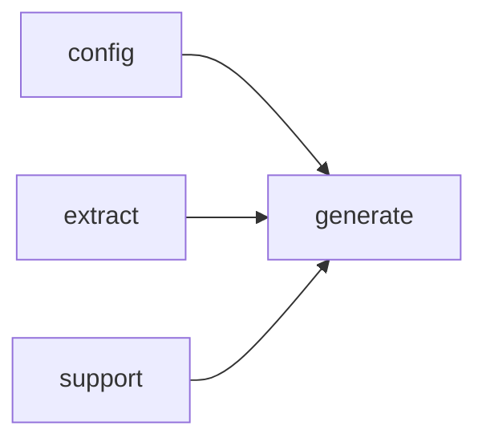

# Module `generate:analysis`

## Summary

该模块负责处理代码生成管线中从大语言模型获取的分析响应。它将原始输出（通常为 Markdown 格式）解析为结构化的符号分析数据，并提供规范化、回退降级和合并机制。核心职责包括：构建用于符号分析的 LLM 提示、判定提示种类（如声明摘要或基础符号分析）、解析结构化响应和 Markdown 输出，以及存储和应用分析结果。模块同时管理分析过程中的中间状态（如原始响应、解析后的数据、回退标记），确保在主要分析失败时能够平滑降级。

公开接口涵盖多个关键入口点：`parse_structured_response` 和 `parse_markdown_prompt_output` 分别处理结构化与非结构化的 LLM 输出；`normalize_markdown_fragment` 对获取的 Markdown 片段进行格式化统一；`store_fallback_analysis` 和 `apply_symbol_analysis_response` 用于持久化或应用分析状态；而 `build_symbol_analysis_prompt`、`symbol_prompt_kinds_for_symbol`、`analysis_prompt_kind_for_symbol` 等函数则支撑提示的构建与类型查询。此外，`is_declaration_summary_prompt` 和 `is_base_symbol_analysis_prompt` 为调用方提供了提示种类的快速判断能力。这些接口共同构成了模块对下游生成流程的完整服务边界。

## Imports

- [`config`](../config/index.md)
- [`extract`](../extract/index.md)
- [`generate:evidence`](evidence.md)
- [`generate:markdown`](markdown.md)
- [`generate:model`](model.md)
- `std`
- [`support`](../support/index.md)

## Imported By

- [`generate:dryrun`](dryrun.md)
- [`generate:scheduler`](scheduler.md)

## Dependency Diagram

## Functions

### `clore::generate::analysis_prompt_kind_for_symbol`

Declaration: `generate/analysis.cppm:27`

Definition: `generate/analysis.cppm:286`

Declaration: [`Namespace clore::generate`](../../namespaces/clore/generate/index.md)

函数 `clore::generate::analysis_prompt_kind_for_symbol` 将符号种类的判定直接映射到分析提示词的种类。它接收一个 `const extract::SymbolInfo&` 参数 `sym`，并依次检查 `is_function_kind`、`is_type_kind` 和 `is_variable_kind` 这三个谓词对 `sym.kind` 的计算结果。当某个谓词成立时，立即返回对应的 `PromptKind` 枚举值（`PromptKind::FunctionAnalysis`、`PromptKind::TypeAnalysis` 或 `PromptKind::VariableAnalysis`）；若均不匹配，则返回 `std::nullopt`。该函数不依赖其他模块的复杂算法，仅以 `extract::SymbolInfo::kind` 为唯一输入，通过链式条件分支完成决策。

#### Side Effects

No observable side effects are evident from the extracted code.

#### Reads From

- `sym.kind`

#### Usage Patterns

- Called to select the analysis prompt kind for a symbol during prompt construction
- Used in `build_symbol_analysis_prompt` to determine which analysis to perform
- Central dispatch for mapping symbol kinds to analysis prompt types

### `clore::generate::apply_symbol_analysis_response`

Declaration: `generate/analysis.cppm:39`

Definition: `generate/analysis.cppm:348`

Declaration: [`Namespace clore::generate`](../../namespaces/clore/generate/index.md)

函数 `clore::generate::apply_symbol_analysis_response` 根据 `PromptKind` 对原始响应进行分派处理。首先通过 `make_symbol_target_key` 生成目标键，然后按分支解析：对于 `FunctionAnalysis`、`TypeAnalysis`、`VariableAnalysis`，它调用对应的长度宽松解析函数（如 `parse_function_analysis_lenient`），解析失败则立即返回错误；成功后再调用后备分析函数（如 `fallback_function_analysis`），并调用对应的合并函数（如 `merge_function_analysis`）将后备与解析结果合并到 `analyses` 的对应映射中。对于 `FunctionDeclarationSummary`、`FunctionImplementationSummary`、`TypeDeclarationSummary`、`TypeImplementationSummary` 等摘要类种类，则调用 `parse_markdown_prompt_output` 解析出纯文本，并直接赋值给对应分析的 `overview_markdown` 或 `details_markdown` 字段。未知种类返回 `std::unexpected`。

关键依赖包括 `prompt_request_key`、`make_symbol_target_key`，以及各命名空间内的解析、后备、合并辅助函数（如 `parse_function_analysis_lenient`、`fallback_function_analysis`、`merge_function_analysis`、`parse_type_analysis_lenient`、`fallback_type_analysis`、`merge_type_analysis`、`parse_variable_analysis_lenient`）。这些函数各自负责解析 LLM 返回的结构化文本、生成默认后备分析以及将结果合并到已有的分析结构中，实现了对分析结果的统一处理流程。

#### Side Effects

- mutates the passed `SymbolAnalysisStore& analyses` by writing to its `functions`, `types`, or `variables` map entries

#### Reads From

- `analyses` (symbol analysis store)
- `sym` (symbol info)
- `model` (project model)
- `kind` (prompt kind)
- `raw_response` (input string)
- internally generated `target_key` via `make_symbol_target_key`

#### Writes To

- `analyses.functions[target_key]`
- `analyses.types[target_key]`
- `analyses.variables[target_key]`

#### Usage Patterns

- called after receiving an LLM response for a symbol analysis prompt
- used in the generation pipeline to update the symbol analysis cache
- dispatches based on `PromptKind` to the appropriate analysis type

### `clore::generate::build_symbol_analysis_prompt`

Declaration: `generate/analysis.cppm:46`

Definition: `generate/analysis.cppm:429`

Declaration: [`Namespace clore::generate`](../../namespaces/clore/generate/index.md)

函数 `clore::generate::build_symbol_analysis_prompt` 根据传入的 `sym`、`kind`、`model`、`config` 和 `analyses` 构建用于符号分析的提示词。内部控制流首先通过 `switch` 语句，依据 `kind` 的枚举值（如 `FunctionAnalysis`、`TypeDeclarationSummary`、`VariableAnalysis` 等）调用对应的 `build_evidence_for_*` 函数，获得一个 `EvidencePack` 实例。随后配置该证据包的 `page_id`、`prompt_kind`（通过 `prompt_kind_name` 转换）和 `subject_name`。最后委托给 `build_prompt(kind, evidence)` 生成最终的提示字符串；若构造失败则返回 `std::unexpected(GenerateError)`。该函数依赖于 `extract::SymbolInfo`、`extract::ProjectModel`、`config::TaskConfig`、`SymbolAnalysisStore` 以及多个专门的证据构建函数和 `build_prompt` 等基础设施。

#### Side Effects

No observable side effects are evident from the extracted code.

#### Reads From

- `sym` (const `extract::SymbolInfo&`)
- `kind` (`PromptKind`)
- `model` (const `extract::ProjectModel&`)
- `config` (const `config::TaskConfig&`)
- `analyses` (const `SymbolAnalysisStore&`)
- `prompt_kind_name(kind)`
- `sym.qualified_name`
- `make_symbol_target_key(sym)`

#### Usage Patterns

- Called during symbol analysis prompt generation
- Used to create prompts for different analysis kinds such as function, type, or variable analysis

### `clore::generate::is_base_symbol_analysis_prompt`

Declaration: `generate/analysis.cppm:31`

Definition: `generate/analysis.cppm:325`

Declaration: [`Namespace clore::generate`](../../namespaces/clore/generate/index.md)

该函数通过简单的相等性检查实现：将传入的 `PromptKind` 枚举值逐一与三个已知的基符号分析类型（`FunctionAnalysis`、`TypeAnalysis` 和 `VariableAnalysis`）进行比较，若匹配任一则返回 `true`，否则返回 `false`。控制流是直接的短路逻辑序列，没有任何分支嵌套或副作用。依赖仅限于 `PromptKind` 枚举类型的定义，无需调用任何其他函数或访问外部状态。

#### Side Effects

No observable side effects are evident from the extracted code.

#### Reads From

- parameter `kind` of type `PromptKind`

#### Usage Patterns

- used to classify a `PromptKind` as a base symbol analysis prompt
- likely used in control flow to branch on analysis type

### `clore::generate::is_declaration_summary_prompt`

Declaration: `generate/analysis.cppm:33`

Definition: `generate/analysis.cppm:330`

Declaration: [`Namespace clore::generate`](../../namespaces/clore/generate/index.md)

该函数作为简短的谓词，将传入的 `kind`（`PromptKind` 枚举）与两个已知值匹配。内部仅包含一条返回表达式，通过逻辑或运算符检查 `kind` 是否等于 `PromptKind::FunctionDeclarationSummary` 或 `PromptKind::TypeDeclarationSummary`，结果是 `true` 或 `false`。  

不依赖其他内部函数或复杂分支；唯一的外部依赖是 `PromptKind` 类型的定义及其枚举成员。该实现直接封装了声明摘要类的 prompt 种类判据，用于后续的 prompt 路由或条件逻辑。

#### Side Effects

No observable side effects are evident from the extracted code.

#### Reads From

- parameter `kind`

#### Usage Patterns

- classification of prompt kinds
- guarding generation of declaration summary prompts
- filtering in prompt dispatch logic

### `clore::generate::normalize_markdown_fragment`

Declaration: `generate/analysis.cppm:21`

Definition: `generate/analysis.cppm:267`

Declaration: [`Namespace clore::generate`](../../namespaces/clore/generate/index.md)

函数 `clore::generate::normalize_markdown_fragment` 实现了一个多步规范化流水线，用于处理 LLM 返回的原始 Markdown 片段。它首先通过 `clore::support::ensure_utf8` 确保输入是合法的 UTF-8，接着调用 `clore::support::strip_utf8_bom` 剥离 BOM 标记，然后使用匿名命名空间的 `trim_trailing_ascii_whitespace` 去除尾部 ASCII 空白。若结果字符串不包含任何非空白字符（通过 `contains_non_whitespace` 检测），函数立即返回 `std::unexpected`，携带一个消息中嵌入 `context` 参数的 `GenerateError`；否则，将字符串传递给 `normalize_analysis_markdown` 进行进一步的格式修复（如调整空白、统一换行风格），最后返回规范化后的 `std::string`。

在依赖方面，本函数依赖于 `clore::support` 模块的 UTF-8 处理工具（`ensure_utf8` 与 `strip_utf8_bom`），以及同翻译单元内定义的三个匿名命名空间辅助函数：`trim_trailing_ascii_whitespace`、`contains_non_whitespace` 和 `normalize_analysis_markdown`。这些辅助函数均被置于内部链接域，避免与外部符号冲突。整个控制流呈线性顺序，仅在空白检测处分支到错误路径，确保规范化后片段非空且格式一致。

#### Side Effects

No observable side effects are evident from the extracted code.

#### Reads From

- `raw`
- `context`

#### Usage Patterns

- Called as a preprocessing step before embedding markdown into generated documentation
- Used in rendering pipelines to ensure fragments are valid and consistently formatted

### `clore::generate::parse_markdown_prompt_output`

Declaration: `generate/analysis.cppm:24`

Definition: `generate/analysis.cppm:281`

Declaration: [`Namespace clore::generate`](../../namespaces/clore/generate/index.md)

函数 `clore::generate::parse_markdown_prompt_output` 的实现极为精简：它将所有工作委托给 `clore::generate::normalize_markdown_fragment`，后者负责实际的解析与规范化逻辑。传入的 `raw` 和 `context` 参数被原样转发，最终返回一个 `std::expected<std::string, GenerateError>` 类型的值。整个控制流仅包含一次调用，没有分支或循环。该函数的主要依赖是 `normalize_markdown_fragment`，它处理了 Markdown 内容的修整、格式调整和错误转换。

#### Side Effects

No observable side effects are evident from the extracted code.

#### Reads From

- the `raw` parameter (a `std::string_view`)
- the `context` parameter (a `std::string_view`)

#### Usage Patterns

- Called to normalize the raw markdown output of a prompt request before further analysis or rendering.

### `clore::generate::parse_structured_response`

Declaration: `generate/analysis.cppm:18`

Definition: `generate/analysis.cppm:252`

Declaration: [`Namespace clore::generate`](../../namespaces/clore/generate/index.md)

该函数首先尝试使用 `json::from_json<T>` 将原始字符串 `raw` 反序列化为模板参数 `T` 的实例。如果解析失败，则立即返回一个包含格式化错误消息的 `GenerateError`，其中引用 `context` 说明解析的用途。解析成功后，将结果值移动给局部变量 `value`，然后调用 `normalize_analysis(value)` 对解析后的分析对象进行后处理（例如合并、修剪或规范化字段）。最后返回正常的 `std::expected<T, GenerateError>` 值。内部控制流仅包含一条失败分支和两步骤的顺利路径；关键外部依赖是 JSON 解析组件 `json::from_json` 和内部符号级规范化函数 `normalize_analysis`。

#### Side Effects

No observable side effects are evident from the extracted code.

#### Reads From

- `raw` parameter (the JSON string)
- `context` parameter (used in error message)
- `json::from_json<T>()` (reads from `raw`)

#### Writes To

- returned value of type `T` (allocated and normalized)

#### Usage Patterns

- parsing structured JSON responses from AI models
- handling deserialization errors gracefully
- normalizing parsed data before use

### `clore::generate::store_fallback_analysis`

Declaration: `generate/analysis.cppm:35`

Definition: `generate/analysis.cppm:335`

Declaration: [`Namespace clore::generate`](../../namespaces/clore/generate/index.md)

该函数根据符号类别选择对应的回退分析生成器：对于函数符号调用 `fallback_function_analysis`，对于类型符号调用 `fallback_type_analysis`（额外传入 `model` 参数以利用项目模型），对于变量符号调用 `fallback_variable_analysis`。生成的回退分析对象通过 `make_symbol_target_key` 生成的键存入 `analyses` 的相应映射（`functions`、`types` 或 `variables`）。该函数不处理其他符号类别，调用者需确保只传入已识别的符号。依赖 `extract::SymbolInfo` 的种类检查函数（`is_function_kind`、`is_type_kind`、`is_variable_kind`）以及三个匿名命名空间中的回退分析实现，这些实现各自负责构造特定种类的默认分析内容。

#### Side Effects

- Modifies `SymbolAnalysisStore` by inserting fallback analysis objects into `functions`, `types`, or `variables` maps.

#### Reads From

- `sym.kind` to determine symbol category
- `sym` for constructing the target key
- `model` for `fallback_type_analysis`

#### Writes To

- `analyses.functions` map (via `fallback_function_analysis`)
- `analyses.types` map (via `fallback_type_analysis`)
- `analyses.variables` map (via `fallback_variable_analysis`)

#### Usage Patterns

- Used to populate a `SymbolAnalysisStore` with fallback analyses when detailed analysis is missing
- Invoked during generation pipeline to ensure every symbol has at least a default analysis

### `clore::generate::symbol_prompt_kinds_for_symbol`

Declaration: `generate/analysis.cppm:29`

Definition: `generate/analysis.cppm:299`

Declaration: [`Namespace clore::generate`](../../namespaces/clore/generate/index.md)

函数 `clore::generate::symbol_prompt_kinds_for_symbol` 接受一个 `extract::SymbolInfo` 引用 `sym`，通过调用 `analysis_prompt_kind_for_symbol` 获取基础提示种类 `base_kind`。如果 `base_kind` 无值，立即返回空向量。否则，根据 `base_kind` 的值分支选择不同的 `PromptKind` 集合。

对于 `PromptKind::FunctionAnalysis`，返回包含 `FunctionAnalysis`、`FunctionDeclarationSummary` 和 `FunctionImplementationSummary` 的三个元素向量；对于 `PromptKind::TypeAnalysis`，类似地返回 `TypeAnalysis`、`TypeDeclarationSummary` 和 `TypeImplementationSummary`；对于 `PromptKind::VariableAnalysis`，仅返回 `VariableAnalysis` 本身。若 `base_kind` 不属于以上三种，则返回空向量。该函数实际是 `analysis_prompt_kind_for_symbol` 的扩展，用于确定应对给定符号发起哪些分析/摘要提示，依赖 `PromptKind` 枚举和符号分析种类判定。

#### Side Effects

No observable side effects are evident from the extracted code.

#### Reads From

- `analysis_prompt_kind_for_symbol` function result
- `sym` parameter

#### Usage Patterns

- Called to decide which prompt kinds to generate for a symbol during documentation page creation

## Internal Structure

该模块位于 `clore::generate` 命名空间，负责将 LLM 生成的原始分析响应转化为结构化、可合并的内部表示，并驱动后续的文档生成流程。它导入 `config`、`extract`、`generate:evidence`、`generate:markdown`、`generate:model` 和 `support`，形成清晰的分层依赖：下层提供配置、源码提取、证据收集、Markdown 渲染和通用工具，上层则在本模块集中处理分析数据的解析、验证、回退和合并。

内部实现按责任划分为三个层次：底层是一组匿名命名空间中的辅助函数（如 `trim_trailing_ascii_whitespace`、`contains_non_whitespace` 和 `normalize_analysis_markdown`），用于文本清理与格式统一；中间层是针对不同分析类型（函数、类型、变量）专有解析器（`parse_*_analysis_lenient`）和合并函数（`merge_*_analysis`），将原始字符串解析为强类型分析记录并合并到已有结果；上层是公共接口，包括提示构建（`build_symbol_analysis_prompt`）、响应应用（`apply_symbol_analysis_response`）和回退存储（`store_fallback_analysis`），它们通过组合中间层函数实现端到端流程，并依赖 `generate:model` 中的数据结构（如 `SymbolAnalysisStore`、`FunctionAnalysis` 等）来承载最终结果。

## Related Pages

- [Module config](../config/index.md)
- [Module extract](../extract/index.md)
- [Module generate:evidence](evidence.md)
- [Module generate:markdown](markdown.md)
- [Module generate:model](model.md)
- [Module support](../support/index.md)

