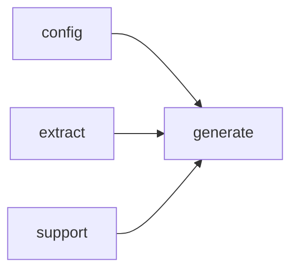

# Module `generate:analysis`

## Summary

该模块负责符号分析提示的构建、LLM 响应的解析与归一化，以及回退分析的管理。它提供了构建符号分析提示、解析 Markdown 和结构化响应、判断提示类型（如基础符号分析、声明摘要）等公共函数，并封装了多种针对函数、变量、类型的回退与合并逻辑，确保生成管线能够从分析结果中提取一致的文档内容。

## Imports

- [`config`](../config/index.md)
- [`extract`](../extract/index.md)
- [`generate:evidence`](evidence.md)
- [`generate:markdown`](markdown.md)
- [`generate:model`](model.md)
- [`support`](../support/index.md)

## Imported By

- [`generate:dryrun`](dryrun.md)
- [`generate:scheduler`](scheduler.md)

## Dependency Diagram

```mermaid
graph LR
    M0["generate"]
    I0["config"]
    I0 --> M0
    I1["extract"]
    I1 --> M0
    I2["support"]
    I2 --> M0
```

## Functions

### `clore::generate::analysis_prompt_kind_for_symbol`

Declaration: `src/generate/analysis.cppm:43`

Definition: `src/generate/analysis.cppm:302`

Declaration: [`Namespace clore::generate`](../../namespaces/clore/generate/index.md)

该函数通过简单的条件分支将符号类型映射到对应的分析提示类型。它依次检查 `is_function_kind`、`is_type_kind` 和 `is_variable_kind` 三个谓词，分别返回 `PromptKind::FunctionAnalysis`、`PromptKind::TypeAnalysis` 或 `PromptKind::VariableAnalysis`。若符号不属于任何已知种类，则返回 `std::nullopt`。控制流清晰且无循环，整个实现仅依赖符号的 `kind` 成员和对应的 kind 判定函数。

该函数内部没有调用任何命名空间内的辅助函数，只有对 `extract` 命名空间中谓词函数的直接调用。其输出直接作为后续生成流程中提示类型的依据，在分析阶段被 `clore::generate::symbol_prompt_kinds_for_symbol` 等更高级函数引用。

#### Side Effects

No observable side effects are evident from the extracted code.

#### Reads From

- sym`.kind`

#### Usage Patterns

- used to select the analysis prompt kind for a symbol
- called during symbol documentation generation to determine the prompt type

### `clore::generate::apply_symbol_analysis_response`

Declaration: `src/generate/analysis.cppm:55`

Definition: `src/generate/analysis.cppm:364`

Declaration: [`Namespace clore::generate`](../../namespaces/clore/generate/index.md)

该函数根据 `kind` 进行分发，对每种 `PromptKind` 采用不同的解析与合并策略。对于 `FunctionAnalysis`、`TypeAnalysis` 和 `VariableAnalysis` 三类，先调用对应的 `parse_*_lenient` 解析原始响应 `raw_response`；若解析失败则返回错误，否则生成一个 fallback 值（通过 `fallback_*` 系列函数）并与解析结果合并后存入 `analyses` 中对应的容器（`functions`、`types` 或 `variables`），合并操作用于新数据更新。对于 `FunctionDeclarationSummary`、`FunctionImplementationSummary`、`TypeDeclarationSummary` 和 `TypeImplementationSummary` 这四类，则使用 `parse_markdown_prompt_output` 解析，成功后将解析结果直接赋给 `overview_markdown` 或 `details_markdown` 字段。默认分支返回一个描述错误的 `std::unexpected`。整个流程依赖 `make_symbol_target_key` 生成目标键，并利用 `prompt_request_key` 构造请求标识传递给解析器，各解析器、 fallback 生成器及合并器均在匿名命名空间中定义。

#### Side Effects

- 修改传入的 `SymbolAnalysisStore` 对象中的符号分析数据

#### Reads From

- analyses
- sym
- model
- kind
- `raw_response`
- `prompt_request_key`
- `make_symbol_target_key`

#### Writes To

- analyses (通过引用参数写入其 functions、types、variables 映射)

#### Usage Patterns

- 处理 AI 分析响应并更新符号分析存储
- 作为生成管线的一部分被调用

### `clore::generate::build_symbol_analysis_prompt`

Declaration: `src/generate/analysis.cppm:62`

Definition: `src/generate/analysis.cppm:445`

Declaration: [`Namespace clore::generate`](../../namespaces/clore/generate/index.md)

函数首先声明一个本地 `EvidencePack` 对象，然后基于传入的 `PromptKind` 枚举值通过 `switch` 语句分派到不同的证据收集过程，例如 `build_evidence_for_function_analysis`、`build_evidence_for_type_analysis` 或 `build_evidence_for_variable_analysis` 等。每个分支使用 `sym`、`model`、`analyses` 以及 `config.project_root` 来填充 `EvidencePack` 结构。遇到未知的 `PromptKind` 时，函数立即返回一个包含错误信息的 `std::unexpected<GenerateError>`。成功收集证据后，函数设置 `evidence` 的 `page_id`、`prompt_kind` 和 `subject_name` 字段，然后委托给 `build_prompt` 基于 `kind` 和 `evidence` 生成最终的提示字符串。如果 `build_prompt` 失败，错误会转换为 `std::unexpected<GenerateError>` 返回；否则返回移动后的 `*prompt`。

#### Side Effects

No observable side effects are evident from the extracted code.

#### Reads From

- parameter `sym` of type `const extract::SymbolInfo&`
- parameter `kind` of type `PromptKind`
- parameter `model` of type `const extract::ProjectModel&`
- parameter `config` of type `const config::TaskConfig&`
- parameter `analyses` of type `const SymbolAnalysisStore&`
- field `config.project_root`
- field `sym.qualified_name`
- return value of `prompt_kind_name(kind)`

#### Usage Patterns

- called from documentation generation pipeline to create prompts for symbol analysis
- used where a prompt string for a specific symbol and analysis kind is needed

### `clore::generate::is_base_symbol_analysis_prompt`

Declaration: `src/generate/analysis.cppm:47`

Definition: `src/generate/analysis.cppm:341`

Declaration: [`Namespace clore::generate`](../../namespaces/clore/generate/index.md)

该函数通过单一的逻辑测试实现：将传入的 `PromptKind` 枚举值 `kind` 与三个预定义的符号级别分析提示类型（`FunctionAnalysis`、`TypeAnalysis` 和 `VariableAnalysis`）逐一比较，如果匹配其中任何一个则返回 `true`，否则返回 `false`。整个控制流仅包含一条 `return` 语句，内部依赖 `PromptKind` 枚举定义以及 `clore::generate` 命名空间下的常量枚举值。该函数作为谓词，用于上游调用方筛选出仅针对基础符号分析类别的提示类型，不涉及任何状态变更或副作用。

#### Side Effects

No observable side effects are evident from the extracted code.

#### Reads From

- parameter `kind` of type `PromptKind`

#### Usage Patterns

- classifying prompt kinds in generation logic
- branching on symbol analysis prompt type

### `clore::generate::is_declaration_summary_prompt`

Declaration: `src/generate/analysis.cppm:49`

Definition: `src/generate/analysis.cppm:346`

Declaration: [`Namespace clore::generate`](../../namespaces/clore/generate/index.md)

该函数的核心逻辑是一个简单的枚举比较：它接收一个 `PromptKind` 类型的参数 `kind`，然后依次判断该值是否等于 `PromptKind::FunctionDeclarationSummary` 或 `PromptKind::TypeDeclarationSummary`，并将两个判断结果通过逻辑或合并后直接作为 `bool` 返回值。整个实现不依赖任何辅助函数或外部状态，唯一的依赖项是 `PromptKind` 枚举类型及其定义的两个成员常量。

#### Side Effects

No observable side effects are evident from the extracted code.

#### Reads From

- parameter `kind` of type `PromptKind`

#### Usage Patterns

- used to classify prompt kinds for routing or conditional logic
- called when building evidence sections for declaration summaries

### `clore::generate::normalize_markdown_fragment`

Declaration: `src/generate/analysis.cppm:37`

Definition: `src/generate/analysis.cppm:283`

Declaration: [`Namespace clore::generate`](../../namespaces/clore/generate/index.md)

函数首先通过 `clore::support::ensure_utf8` 将原始片段转换为有效的 UTF-8 编码，随后由 `clore::support::strip_utf8_bom` 移除可能存在的字节顺序标记。接着调用 `trim_trailing_ascii_whitespace` 去除尾部空白字符，并通过 `contains_non_whitespace` 检查剩余内容是否仅为空白；若完全空白，则立即返回一个包含 `GenerateError` 的意外值。最后，对经初步处理后的字符串调用 `normalize_analysis_markdown` 执行进一步的 Markdown 规范化（如统一换行符、压缩多余空格等），并将结果作为预期的成功值返回。

#### Side Effects

No observable side effects are evident from the extracted code.

#### Reads From

- parameter `raw`
- parameter `context`

#### Usage Patterns

- Used by other generation functions to clean and validate markdown fragments before embedding them in larger documents
- Called with a raw fragment and a descriptive context string for error reporting

### `clore::generate::parse_markdown_prompt_output`

Declaration: `src/generate/analysis.cppm:40`

Definition: `src/generate/analysis.cppm:297`

Declaration: [`Namespace clore::generate`](../../namespaces/clore/generate/index.md)

函数 `clore::generate::parse_markdown_prompt_output` 是 `normalize_markdown_fragment` 的一个轻量包装。它接受两个 `std::string_view` 参数——原始模型输出 `raw` 和上下文字符串 `context`，并将调用直接转发给 `normalize_markdown_fragment`。该调用返回 `std::expected<std::string, GenerateError>`，表示规范化后的 Markdown 文本，或一个错误状态。该函数自身不执行任何额外的验证、分支或状态修改；其全部逻辑由 `normalize_markdown_fragment` 提供，因此整个实现的正确性依赖于该下层函数。

#### Side Effects

No observable side effects are evident from the extracted code.

#### Reads From

- the `raw` string view parameter
- the `context` string view parameter

#### Usage Patterns

- processing raw LLM prompt responses
- normalizing markdown output from analysis generation
- converting unformatted prompt results into structured markdown fragments

### `clore::generate::parse_structured_response`

Declaration: `src/generate/analysis.cppm:34`

Definition: `src/generate/analysis.cppm:268`

Declaration: [`Namespace clore::generate`](../../namespaces/clore/generate/index.md)

函数 `clore::generate::parse_structured_response` 首先调用 `json::parse<T>` 将原始字符串 `raw` 解析为目标类型 `T`，若解析失败则返回包含格式化错误信息的 `std::unexpected`，其中 `context` 参数用于标识解析场景。成功时，移动解析得到的值并对其执行 `normalize_analysis` 进行内部规范化，最后返回该值。该函数依赖于外部的 `json::parse` 模板以及匿名命名空间中的 `normalize_analysis`，后者进一步调用 `normalize_analysis_list`、`normalize_markdown_fragment` 等辅助函数完成数据结构清洗。

#### Side Effects

- Parses a JSON string into an object of type T
- Modifies the parsed object via `normalize_analysis`
- May allocate error strings

#### Reads From

- parameter `raw`
- parameter `context`

#### Writes To

- the parsed object of type T after normalization

#### Usage Patterns

- Parsing JSON responses from language model outputs
- Deserializing structured data and normalizing it for further analysis in the generation pipeline

### `clore::generate::store_fallback_analysis`

Declaration: `src/generate/analysis.cppm:51`

Definition: `src/generate/analysis.cppm:351`

Declaration: [`Namespace clore::generate`](../../namespaces/clore/generate/index.md)

函数 `clore::generate::store_fallback_analysis` 根据符号 `sym` 的种类将对应的回退分析结果存储到 `analyses` 中。内部流程首先调用 `make_symbol_target_key(sym)` 生成目标键，随后基于 `is_function_kind`、`is_type_kind` 或 `is_variable_kind` 的检查，分别委托给匿名命名空间内的 `fallback_function_analysis`、`fallback_type_analysis` 或 `fallback_variable_analysis`。其中 `fallback_type_analysis` 额外依赖于 `model` 参数。该函数是分析降级链的最后一步，确保在生成失败或缺少输入时仍能为每个符号提供合理的默认分析条目。

#### Side Effects

- Modifies the `analyses` reference by inserting a fallback analysis into one of its maps (`analyses.functions`, `analyses.types`, or `analyses.variables`)

#### Reads From

- `analyses` (the store to be modified, its maps are read for key existence? Not sure; minimal read)
- `sym` (for kind and target key generation)
- `model` (used in `fallback_type_analysis`)
- Internal functions: `make_symbol_target_key`, `is_function_kind`, `is_type_kind`, `is_variable_kind`

#### Writes To

- `analyses.functions` (if symbol kind is a function)
- `analyses.types` (if symbol kind is a type)
- `analyses.variables` (if symbol kind is a variable)

#### Usage Patterns

- Called when a symbol lacks a previously computed analysis, to populate a fallback default analysis
- Used during generation of analysis for symbols without explicit analysis

### `clore::generate::symbol_prompt_kinds_for_symbol`

Declaration: `src/generate/analysis.cppm:45`

Definition: `src/generate/analysis.cppm:315`

Declaration: [`Namespace clore::generate`](../../namespaces/clore/generate/index.md)

函数 `clore::generate::symbol_prompt_kinds_for_symbol` 首先委托给 `analysis_prompt_kind_for_symbol`，以获取给定符号的基础提示种类。若该调用返回 `std::nullopt`，则立即返回空 `std::vector<PromptKind>`。否则，根据 `base_kind` 的值，通过简单的分支构造结果向量：当基础种类为 `PromptKind::FunctionAnalysis` 时，生成包含该基础种类、`PromptKind::FunctionDeclarationSummary` 和 `PromptKind::FunctionImplementationSummary` 的三元素向量；当为 `PromptKind::TypeAnalysis` 时，类似地生成包含 `PromptKind::TypeDeclarationSummary` 和 `PromptKind::TypeImplementationSummary` 的向量；当为 `PromptKind::VariableAnalysis` 时，直接返回仅含该基础种类本身的单元素向量；其余情形均返回空向量。该函数不处理任何格式解析或回退，其控制流完全取决于 `analysis_prompt_kind_for_symbol` 的返回值，且仅依赖于 `PromptKind` 枚举的特定值。

#### Side Effects

No observable side effects are evident from the extracted code.

#### Reads From

- the parameter `sym` of type `const extract::SymbolInfo&`
- the return value of `analysis_prompt_kind_for_symbol(sym)`
- enumerators `FunctionAnalysis`, `TypeAnalysis`, `VariableAnalysis`, `FunctionDeclarationSummary`, `FunctionImplementationSummary`, `TypeDeclarationSummary`, `TypeImplementationSummary`

#### Usage Patterns

- called to determine which prompts to generate for a given symbol during page building
- used within the generation pipeline to select appropriate prompt kinds for analysis

## Internal Structure

模块 `generate:analysis` 是文档生成管线中负责符号分析的核心模块，对 `generate:model` 和 `generate:evidence` 提供分析结果的解析与整合。它依赖于 `config`、`extract`、`generate:evidence`、`generate:markdown`、`generate:model` 和 `support` 六个模块，分别用于配置读取、符号提取、证据收集、Markdown 渲染、数据模型定义和通用工具支持。内部按功能划分为多层：解析层（如 `parse_type_analysis_lenient`、`parse_function_analysis_lenient`）将 LLM 输出的原始文本转换为结构化分析；规范化层（如 `normalize_analysis_markdown`、`normalize_analysis`）统一格式；合并层（如 `merge_type_analysis`、`merge_function_analysis`）将多次分析结果融合；回退层（如 `fallback_type_analysis`、`fallback_function_analysis`）在分析失败时提供默认值。公开接口如 `build_symbol_analysis_prompt`、`apply_symbol_analysis_response` 和 `parse_markdown_prompt_output` 将这些内部层组合成完整的工作流，外部调用者通过 `context`（`ToolContext` 引用）传递工具执行上下文，以获取符号信息、配置参数等依赖。

## Related Pages

- [Module config](../config/index.md)
- [Module extract](../extract/index.md)
- [Module generate:evidence](evidence.md)
- [Module generate:markdown](markdown.md)
- [Module generate:model](model.md)
- [Module support](../support/index.md)

