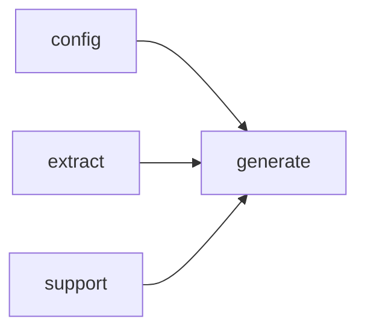

# Module `generate:diagram`

## Summary

`generate:diagram` 模块负责为文档生成系统提供各种图表（如 Mermaid 格式）的文本渲染能力。它通过一系列公开的 `render_*_diagram_code` 函数实现文件依赖图、导入图、命名空间图和模块依赖图的生成，并配套提供 `escape_mermaid_label` 用于标签转义、`should_emit_mermaid` 用于决策是否生成图表。模块内部使用匿名命名空间封装了辅助逻辑（如符号收集、名称缩短、缓存渲染），并以 `node_count`、`edge_count` 等变量追踪图表结构，确保生成的 Mermaid 代码可直接集成到页面内容中。

## Imports

- [`config`](../config/index.md)
- [`extract`](../extract/index.md)
- [`generate:model`](model.md)
- `std`
- [`support`](../support/index.md)

## Imported By

- [`generate:scheduler`](scheduler.md)
- [`generate:symbol`](symbol.md)

## Dependency Diagram

## Functions

### `clore::generate::escape_mermaid_label`

Declaration: `generate/render/diagram.cppm:13`

Definition: `generate/render/diagram.cppm:109`

Declaration: [`Namespace clore::generate`](../../namespaces/clore/generate/index.md)

该函数通过一次遍历输入字符串 `text` 来实现转义。它首先创建一个名为 `escaped` 的 `std::string`，并调用 `reserve` 预分配 `text.size()` 的容量，以减少多次内存重分配。随后使用基于范围的 `for` 循环依次检查每个字符，并借助 `switch` 语句处理四种情况：遇到反斜杠字符时追加 `\\`（两个反斜杠字符），遇到双引号时追加 `\"`，遇到换行符或回车符时替换为单个空格字符，其余字符则原样追加。函数最终返回构造好的 `escaped` 字符串。其内部流程完全依赖标准库的 `std::string_view` 输入和 `std::string` 输出，不涉及其他外部依赖。

#### Side Effects

No observable side effects are evident from the extracted code.

#### Reads From

- the input parameter `text` of type `std::string_view`

#### Writes To

- the local variable `escaped` which is returned as a `std::string`

#### Usage Patterns

- used to escape labels when constructing Mermaid diagrams

### `clore::generate::render_file_dependency_diagram_code`

Declaration: `generate/render/diagram.cppm:20`

Definition: `generate/render/diagram.cppm:222`

Declaration: [`Namespace clore::generate`](../../namespaces/clore/generate/index.md)

该函数首会检查 `plan.owner_keys` 是否为空，若为空则立即返回空字符串。随后通过 `render_cached_diagram` 封装实际生成逻辑，该包装可能提供针对已渲染结果的缓存机制。在内部 lambda 中，从 `model.files` 查找第一个 owner 键对应的文件记录，若未找到则直接返回空。从 `file_it->second.includes` 中收集包含路径列表，依次调用 `make_source_relative` 转换为相对路径，并对结果排序去重。接着使用 `collect_implementation_symbols_for_diagram` 并传入一个谓词（筛选类型、局部变量和函数三种符号种类）来收集当前文件实现的符号集合。基于包含路径数量和符号数量计算出 `edge_count` 和 `node_count`（节点数为 `1 + edge_count`），并交由 `should_emit_mermaid` 依据 `kMermaidMinNodes` 和 `kMermaidMinEdges` 决定是否实际生成图表；若不应生成则返回空字符串。

若需要生成，则先通过 `make_source_relative` 得到文件标签，然后用 `escape_mermaid_label` 转义后写入 Mermaid 的 `graph LR` 开头。为文件自身创建节点 `F`，为每个包含路径创建节点 `I<index>` 并从该节点指向 `F`（表示文件包含了这些头文件）。为每个符号创建节点 `S<index>`，符号标签优先使用 `short_name_of_local` 提取的结果，若为空则回退至 `qualified_name` 或 `name`；边方向为从 `F` 指向符号节点。最终返回拼接的 Mermaid 代码字符串。整个流程依赖多个内部辅助函数：`collect_implementation_symbols_for_diagram` 负责符号收集，`make_source_relative` 处理路径相对化，`escape_mermaid_label` 和 `short_name_of_local` 分别处理标签转义与符号名称简化，`is_type_kind`、`is_variable_kind_local`、`is_function_kind` 提供种类判断，`should_emit_mermaid` 依据阈值控制输出与否，而 `render_cached_diagram` 提供可缓存的执行环境。

#### Side Effects

No observable side effects are evident from the extracted code.

#### Reads From

- `plan`
- `config`
- `model`
- `plan.owner_keys`
- `config.project_root`
- `model.files`
- file includes
- symbol info (`kind`, `qualified_name`, `name`)

#### Usage Patterns

- Used in documentation generation to produce Mermaid file dependency diagrams
- Called as part of page rendering pipeline for file-level overviews

### `clore::generate::render_import_diagram_code`

Declaration: `generate/render/diagram.cppm:15`

Definition: `generate/render/diagram.cppm:124`

Declaration: [`Namespace clore::generate`](../../namespaces/clore/generate/index.md)

该函数生成描述模块导入关系的 Mermaid 图代码。它首先检查 `mod_unit.imports` 是否为空，若是则返回空字符串。接着通过 `top_module` 从当前模块名中提取顶层模块作为 `module_label`，若其被 `is_std_name` 判定为标准库名称，则提前返回。随后遍历 `mod_unit.imports`，对每个导入应用 `top_module` 得到标签，过滤掉与当前模块相同、为标准库或已通过 `seen` 集合去重的项，收集到 `imports` 向量中。计算 `edge_count` 和 `node_count`，若 `should_emit_mermaid` 返回 `false` 则返回空字符串。最后对 `imports` 排序，构建 Mermaid 的 `graph LR` 格式字符串：当前模块作为 `M0`，每个导入分配一个 `I` 编号节点，每个导入节点指向 `M0`。生成过程整体包裹在 `render_cached_diagram` 中以避免重复计算。依赖的辅助函数包括匿名命名空间内的 `is_std_name`、`should_emit_mermaid`、`escape_mermaid_label` 以及 `render_cached_diagram` 本身。

#### Side Effects

No observable side effects are evident from the extracted code.

#### Reads From

- `mod_unit` parameter: reads `mod_unit.name` and `mod_unit.imports`
- calls `is_std_name` on module label and import labels
- calls `should_emit_mermaid` with node and edge counts
- calls `escape_mermaid_label` for node labels

#### Usage Patterns

- Called during generation of module documentation pages to create a Mermaid import diagram
- Part of a set of diagram rendering functions (`render_file_dependency_diagram_code`, `render_module_dependency_diagram_code`, `render_namespace_diagram_code`)
- Likely used in `build_page_plan_set` or similar page building functions

### `clore::generate::render_module_dependency_diagram_code`

Declaration: `generate/render/diagram.cppm:24`

Definition: `generate/render/diagram.cppm:289`

Declaration: [`Namespace clore::generate`](../../namespaces/clore/generate/index.md)

该函数通过 `render_cached_diagram` 包裹一个 lambda 来生成 Mermaid 格式的模块依赖关系图。在 lambda 内部，首先定义一个 `top_module` 局部函数，用于从完整模块名中提取顶层模块名（第一个冒号之前的部分）。然后遍历 `model.modules`，仅处理 `is_interface` 为 true 的模块单元，并跳过 `is_std_name` 返回 true 的模块。对于每个接口模块，收集其所有导入，再次使用 `top_module` 提取依赖的顶层模块名，并排除自依赖和标准库模块，从而构建出从源模块到目标模块集合的映射 `deps`，同时维护所有涉及的顶层模块集合 `modules`。如果 `modules` 中元素数量少于 2，则直接返回空字符串。否则计算所有边的总数 `edge_count`，并调用 `should_emit_mermaid` 根据节点数和边数判断是否满足生成图表的最小阈值；若不满足，也返回空字符串。通过后，对 `modules` 排序得到 `sorted` 列表，然后构造一个形如 `"M0", "M1", ...` 的节点 ID 映射。首先循环遍历 `sorted`，为每个模块添加节点定义（使用 `escape_mermaid_label` 对标签进行转义），再遍历 `sorted` 从 `deps` 中取出每个模块的目标依赖列表，排序后为每个依赖添加边，方向为被依赖模块指向依赖模块（即 `"M{目标} --> M{源}"`）。最终将构建的 Mermaid 代码字符串返回给 `render_cached_diagram` 进行缓存处理。

#### Side Effects

No observable side effects are evident from the extracted code.

#### Reads From

- `model.modules`
- `mod_unit.name`
- `mod_unit.is_interface`
- `mod_unit.imports`
- `is_std_name`
- `should_emit_mermaid`
- `escape_mermaid_label`
- `std::format`

#### Usage Patterns

- called during documentation generation to produce module dependency diagrams
- used in page rendering of module overviews

### `clore::generate::render_namespace_diagram_code`

Declaration: `generate/render/diagram.cppm:17`

Definition: `generate/render/diagram.cppm:168`

Declaration: [`Namespace clore::generate`](../../namespaces/clore/generate/index.md)

函数 `clore::generate::render_namespace_diagram_code` 通过 `render_cached_diagram` 包裹生成逻辑以实现结果缓存。内部首先在 `model.namespaces` 中查找目标命名空间，若不存在则直接返回空字符串；随后遍历该命名空间的符号列表，利用 `is_type_kind` 过滤并去重得到类型符号集合，并按 `qualified_name` 排序；同时收集子命名空间的短名称（排除匿名命名空间和通过 `is_std_name` 识别的标准库名称），去重排序。接着根据类型数量与子命名空间数量计算总节点数（1 个根节点加二者数量之和）和总边数（二者数量之和），并调用 `should_emit_mermaid` 判断是否满足最小节点/边阈值，若不满足则返回空字符串。在满足条件时，构建 Mermaid `graph TD` 字符串：以根节点 `NS` 表示当前命名空间（标签经 `short_name_of_local` 和 `escape_mermaid_label` 处理），对每个类型生成节点 `T<i>` 并添加从 `NS` 指向该节点的边，对每个子命名空间生成节点 `NSC<j>` 并同样添加边。所依赖的关键内部函数包括 `extract::lookup_symbol`、`is_type_kind`、`short_name_of_local`、`is_std_name`、`should_emit_mermaid` 和 `escape_mermaid_label`。

#### Side Effects

No observable side effects are evident from the extracted code.

#### Reads From

- `const extract::ProjectModel& model`
- `std::string_view namespace_name`
- `model.namespaces`
- `extract::lookup_symbol(model, sym_id)`
- `sym->kind`, `sym->id`, `sym->qualified_name`
- `should_emit_mermaid(node_count, edge_count)`
- `short_name_of_local`
- `escape_mermaid_label`

#### Writes To

- local `std::string result` (return value)

#### Usage Patterns

- Called when rendering documentation for a namespace page
- Used to generate the Mermaid diagram code embedded in markdown output
- Typically invoked within a larger page generation function like `render_page_markdown`

### `clore::generate::should_emit_mermaid`

Declaration: `generate/render/diagram.cppm:11`

Definition: `generate/render/diagram.cppm:105`

Declaration: [`Namespace clore::generate`](../../namespaces/clore/generate/index.md)

函数 `clore::generate::should_emit_mermaid` 通过比较给定的 `node_count` 和 `edge_count` 与两个内部常量 `kMermaidMinNodes` 和 `kMermaidMinEdges` 来决定是否应该生成 Mermaid 图。它返回 `node_count >= kMermaidMinNodes || edge_count >= kMermaidMinEdges`，即当节点数或边数至少有一个达到对应阈值时返回 `true`，否则返回 `false`。该函数没有额外的控制流，直接依赖这两个匿名命名空间中的常量来执行阈值检查。

#### Side Effects

No observable side effects are evident from the extracted code.

#### Reads From

- parameter `node_count`
- parameter `edge_count`
- global constant `kMermaidMinNodes`
- global constant `kMermaidMinEdges`

#### Usage Patterns

- Check if Mermaid diagram should be emitted
- Used in diagram generation functions

## Internal Structure

模块 `generate:diagram` 是一个独立的 C++20 模块单元（位于 `generate/render/diagram.cppm`），专注于为文档生成 Mermaid 格式的各种关系图。它导入了四个核心模块：`config`（配置）、`extract`（结构化数据提取）、`generate:model`（页面模型和查询）以及 `support`（文本处理和 I/O 基础设施），并将标准库作为全局依赖引入。这种导入关系使其能够利用上游模块的符号、页面计划和配置阈值，是文档生成管道中负责可视化输出的关键环节。

在内部，模块被分解为按图表类型划分的公共渲染函数（如 `render_file_dependency_diagram_code`、`render_import_diagram_code`、`render_namespace_diagram_code` 和 `render_module_dependency_diagram_code`），以及一组匿名命名空间中的辅助函数和常量。辅助层包括标签转义 (`escape_mermaid_label`)、名称和符号提取 (`short_name_of_local`, `collect_implementation_symbols_for_diagram`<Predicate>) 以及基于节点/边数的阈值判断 (`should_emit_mermaid`, 常量 `kMermaidMinNodes`/`kMermaidMinEdges`)。这些辅助工具通过模板 `render_cached_diagram` 与缓存逻辑结合，实现了“先判断是否生成、再收集数据、最后输出代码”的分层处理模式。整个模块没有暴露内部数据结构，所有状态均在函数调用时通过参数传递，保持了良好的封装性和可测试性。

## Related Pages

- [Module config](../config/index.md)
- [Module extract](../extract/index.md)
- [Module generate:model](model.md)
- [Module support](../support/index.md)

