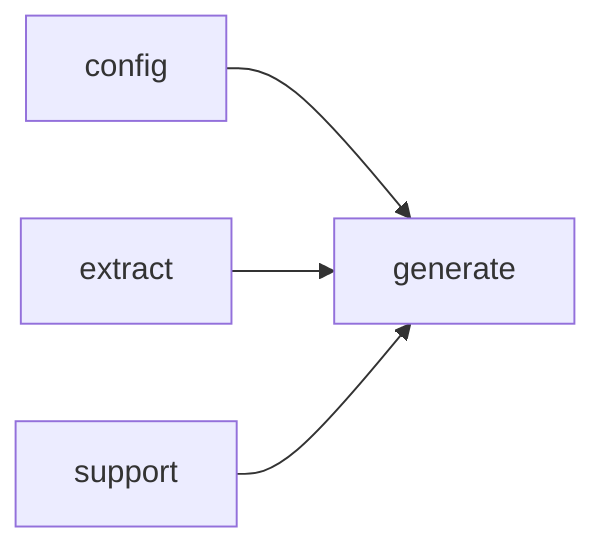

# Module `generate:diagram`

## Summary

模块 `generate:diagram` 负责将符号分析结果（模块、命名空间、文件依赖关系等）渲染为可视化的 Mermaid 图表代码。它提供一组面向外部的渲染函数（如 `render_import_diagram_code`、`render_module_dependency_diagram_code`、`render_namespace_diagram_code`、`render_file_dependency_diagram_code`），以及 `should_emit_mermaid` 和 `escape_mermaid_label` 等辅助工具，用于控制图表的启用条件与标签转义。这些函数接受符号或上下文的整数标识符，返回图表文本或状态码，调用者无需了解内部渲染细节。

该模块的实现完全封装在 `generate/render/diagram.cppm` 中，依赖 `config`、`extract`、`generate:model` 和 `support` 模块提供的配置、提取和模型数据。内部通过匿名命名空间中的辅助函数（如 `collect_implementation_symbols_for_diagram`、`render_cached_diagram`）组织图表构建逻辑，并利用 `node_id`、`edge_count`、`node_count`、`result` 等局部变量存储中间状态，最终输出可供嵌入文档的 Mermaid 代码。

## Imports

- [`config`](../config/index.md)
- [`extract`](../extract/index.md)
- [`generate:model`](model.md)
- `std`
- [`support`](../support/index.md)

## Imported By

- [`generate:scheduler`](scheduler.md)
- [`generate:symbol`](symbol.md)

## Dependency Diagram

## Functions

### `clore::generate::escape_mermaid_label`

Declaration: `generate/render/diagram.cppm:13`

Definition: `generate/render/diagram.cppm:109`

Declaration: [`Namespace clore::generate`](../../namespaces/clore/generate/index.md)

该函数遍历输入字符串中的每个字符，通过一个 `switch` 语句处理三种转义情况：反斜杠 `\\` 和双引号 `"` 分别被替换为转义序列 `\\\\` 和 `\\"`，换行符与回车符统一替换为空格字符，其余字符原样保留。所有转义结果依次追加到预先分配好容量的 `std::string` 对象中，最终返回转义后的字符串。整个实现不依赖任何外部库或模块，仅使用标准库的字符串操作。

#### Side Effects

No observable side effects are evident from the extracted code.

#### Reads From

- `text` parameter (the input string)

#### Writes To

- returns a new `std::string`

#### Usage Patterns

- Used when rendering Mermaid diagram code to ensure labels do not break the diagram syntax.

### `clore::generate::render_file_dependency_diagram_code`

Declaration: `generate/render/diagram.cppm:20`

Definition: `generate/render/diagram.cppm:222`

Declaration: [`Namespace clore::generate`](../../namespaces/clore/generate/index.md)

函数首先检查 `plan.owner_keys` 是否为空，若为空则直接返回空字符串。随后调用 `render_cached_diagram` 并传入一个 lambda 作为渲染逻辑。在 lambda 内部，通过 `model.files` 查找当前文件对应的记录，若不存在则返回空字符串。接着从文件记录的 `includes` 列表构造包含文件标签（使用 `make_source_relative` 将路径转换为相对于项目根目录的短名，缺失时保留原路径），并经过排序和去重。随后调用 `collect_implementation_symbols_for_diagram` 收集满足谓词（`is_type_kind`、`is_variable_kind_local` 或 `is_function_kind`）的符号。结合包含文件数量和符号数量计算出总边数 `edge_count`，再计算总节点数 `node_count`，并调用 `should_emit_mermaid` 决定是否实际生成图表；若不应发射则返回空字符串。最后构造 Mermaid 源码：以文件自身作为主节点 `F`，为每个包含文件创建 `I` 前缀的节点并添加指向 `F` 的边，为每个符号创建 `S` 前缀的节点并添加从 `F` 指向它们的边，所有标签均经过 `escape_mermaid_label` 转义，符号名称则通过 `short_name_of_local` 简化。生成的字符串由 `render_cached_diagram` 返回。该函数依赖 `collect_implementation_symbols_for_diagram` 完成符号收集，并通过 `render_cached_diagram` 提供可能的缓存支持。

#### Side Effects

No observable side effects are evident from the extracted code.

#### Reads From

- `plan.owner_keys`
- `model.files`
- `config.project_root`
- `file_it->second.includes`
- `symbols` (result of `collect_implementation_symbols_for_diagram`)

#### Writes To

- local string `result` (returned)

#### Usage Patterns

- Called by page rendering functions to generate file dependency diagrams
- Used in documentation generation to produce Mermaid diagram markup

### `clore::generate::render_import_diagram_code`

Declaration: `generate/render/diagram.cppm:15`

Definition: `generate/render/diagram.cppm:124`

Declaration: [`Namespace clore::generate`](../../namespaces/clore/generate/index.md)

函数 `clore::generate::render_import_diagram_code` 首先通过 `render_cached_diagram` 包装其核心逻辑以实现结果缓存。内部流程始于对 `mod_unit.imports` 的判空检查，若为空则直接返回空字符串。随后使用 `top_module` lambda 从模块全名中提取顶层模块标签（取冒号之前的部分），并调用 `is_std_name` 判断该标签是否为标准库命名空间，若是则同样提前返回。接着遍历所有导入，对每个导入也提取顶层标签，并利用 `seen` 集合进行去重、过滤掉与自身模块相同以及标准库标签，将剩余导入存入本地 `imports` 向量。在得到有效导入列表后，计算 `edge_count` 和 `node_count`，通过 `should_emit_mermaid` 决定是否生成图表；若决定不生成则返回空字符串。最后对 `imports` 排序，构造 Mermaid 格式的 `graph LR` 图：根节点 `M0` 代表当前模块，每个导入作为独立节点（依次命名为 `I0`、`I1`……），并向 `M0` 添加有向边。所有标签均经过 `escape_mermaid_label` 转义。

控制流的核心是三元分支：空导入、标准库模块、不满足 `should_emit_mermaid` 阈值时均提前终止；否则通过去重、排序、构建字符串完成输出。该函数依赖多个辅助工具：`render_cached_diagram` 提供缓存层，`is_std_name` 过滤标准库，`should_emit_mermaid` 控制图表规模（基于节点数和边数），以及 `escape_mermaid_label` 确保标签安全。所有内部处理均在 lambda 中完成，并由缓存函数统一管理生命周期。

#### Side Effects

No observable side effects are evident from the extracted code.

#### Reads From

- `mod_unit`'s `name` field
- `mod_unit`'s `imports` vector

#### Writes To

- the returned `std::string` containing Mermaid diagram code

#### Usage Patterns

- Called during documentation generation to produce import dependency diagrams
- Used in page rendering pipelines for module pages

### `clore::generate::render_module_dependency_diagram_code`

Declaration: `generate/render/diagram.cppm:24`

Definition: `generate/render/diagram.cppm:289`

Declaration: [`Namespace clore::generate`](../../namespaces/clore/generate/index.md)

该函数将实际图生成逻辑委托给 `render_cached_diagram`，由内部闭包实现 Mermaid 代码的构造。闭包首先遍历 `model.modules`，筛选出 `mod_unit.is_interface` 为真的模块接口单元，并利用辅助 lambda `top_module` 从每个模块全名中提取顶级模块名（即首个冒号之前的部分）。仅处理非标准库（通过 `is_std_name` 过滤）的模块，将其插入 `modules` 集合；同时遍历每个接口单元的 `imports`，对每个非自身、非标准库的导入也提取顶级模块名，并将依赖关系记录在 `deps` 映射中。若最终 `modules` 大小不足 2，则直接返回空字符串。随后计算总边数 `edge_count`，调用 `should_emit_mermaid` 检查是否值得生成图；若否，同样返回空字符串。

若需生成，则将模块名排序并分配形如 `M0`、`M1` 的节点 ID，使用 `escape_mermaid_label` 对标签进行转义。构建 `graph LR` 格式的 Mermaid 代码：先为每个模块添加节点，再按排序顺序遍历 `deps`，为每个依赖对添加从目标节点指向源节点的边（`to --> from`）。最终返回完整字符串。该函数依赖 `render_cached_diagram` 提供缓存机制，并依赖 `is_std_name`、`escape_mermaid_label`、`should_emit_mermaid` 等内部辅助函数。

#### Side Effects

No observable side effects are evident from the extracted code.

#### Reads From

- `const extract::ProjectModel& model`
- `model.modules`

#### Writes To

- returned `std::string` (diagram code)

#### Usage Patterns

- called during documentation generation to produce module dependency diagram
- result embedded into Mermaid code blocks

### `clore::generate::render_namespace_diagram_code`

Declaration: `generate/render/diagram.cppm:17`

Definition: `generate/render/diagram.cppm:168`

Declaration: [`Namespace clore::generate`](../../namespaces/clore/generate/index.md)

函数 `clore::generate::render_namespace_diagram_code` 使用缓存机制 `render_cached_diagram` 生成表示命名空间结构的 Mermaid 图表代码。它首先通过 `extract::ProjectModel` 中的 `namespaces` 映射查找指定的 `namespace_name`；若不存在则返回空字符串。接着收集该命名空间内的类型符号（通过 `is_type_kind` 过滤、去重并按照 `qualified_name` 排序）以及子命名空间列表（过滤掉包含 `"(anonymous namespace)"` 或满足 `is_std_name` 的项，并使用 `short_name_of_local` 提取短名称后去重排序）。然后根据节点数（1 + 类型数量 + 子命名空间数量）和边数（类型与子命名空间的总数）调用 `should_emit_mermaid` 决定是否输出图表；若否，返回空字符串。最后构建 Mermaid `graph TD` 格式的字符串：根节点为当前命名空间的短名称（经 `escape_mermaid_label` 转义），每个类型和子命名空间作为独立节点，并从根节点引出箭头连接。生成的字符串由 `render_cached_diagram` 包装后返回。

#### Side Effects

- Caches the generated diagram string, potentially modifying an internal cache.

#### Reads From

- `extract::ProjectModel`
- `namespace_name` (`string_view`)
- `model.namespaces`
- namespace symbols
- children
- `should_emit_mermaid`
- `is_type_kind`
- `lookup_symbol`
- `short_name_of_local`
- `escape_mermaid_label`

#### Writes To

- Returned string
- Internal cache via `render_cached_diagram`

#### Usage Patterns

- Called during documentation generation to produce namespace diagram markdown.

### `clore::generate::should_emit_mermaid`

Declaration: `generate/render/diagram.cppm:11`

Definition: `generate/render/diagram.cppm:105`

Declaration: [`Namespace clore::generate`](../../namespaces/clore/generate/index.md)

该函数根据给定的节点数和边数决定是否应该生成Mermaid图表。它通过将 `node_count` 与 `kMermaidMinNodes` 进行不小于比较，以及将 `edge_count` 与 `kMermaidMinEdges` 进行不小于比较，若任一条件成立则返回 `true`。整个控制流仅包含一条返回语句，逻辑直接且无分支或循环。

`kMermaidMinNodes` 和 `kMermaidMinEdges` 是内部定义的常量，用于控制图表生成的阈值。该函数被多个上游渲染函数（如 `render_module_dependency_diagram_code`、`render_import_diagram_code` 等）作为判定依据，确保仅在图表具有足够信息量时才触发 `render_cached_diagram` 等渲染操作，从而避免生成规模过小的无意义图表。

#### Side Effects

No observable side effects are evident from the extracted code.

#### Reads From

- `node_count`
- `edge_count`
- `kMermaidMinNodes`
- `kMermaidMinEdges`

#### Usage Patterns

- called before rendering mermaid diagrams such as dependency graphs
- used to decide diagram inclusion in documentation pages

## Internal Structure

模块 `generate:diagram` 是文档生成管线中的图表渲染单元，负责将符号分析结果转换为 Mermaid 格式的结构化图代码。它通过导入 `extract` 模块获取符号依赖数据，依赖 `generate:model` 提供的页面计划和模块模型，并借助 `config` 与 `support` 模块处理配置与基础文本操作。内部实现沿用了清晰的层级划分：匿名命名空间内封装了 `is_std_name`、`short_name_of_local`、`is_variable_kind_local` 等类型/名称判断工具，以及 `collect_implementation_symbols_for_diagram` 和 `render_cached_diagram` 这类通用渲染辅助函数；公开接口则按图类型分离为多个独立的渲染函数（如 `render_import_diagram_code`、`render_file_dependency_diagram_code`、`render_namespace_diagram_code`、`render_module_dependency_diagram_code`），它们均依赖同一套节点/边计数（`kMermaidMinNodes`、`kMermaidMinEdges`）和转义工具（`escape_mermaid_label`），并通过 `should_emit_mermaid` 控制输出开关。这种正交分解使得不同种类的图表可独立开发与测试，同时复用底层的标签处理与 Mermaid 生成逻辑。

## Related Pages

- [Module config](../config/index.md)
- [Module extract](../extract/index.md)
- [Module generate:model](model.md)
- [Module support](../support/index.md)

