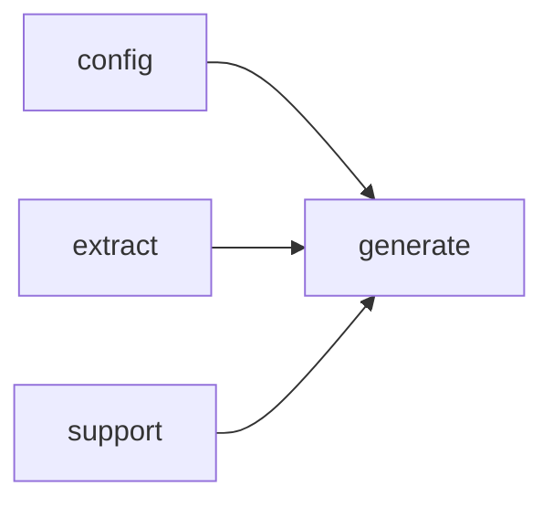

# Module `generate:diagram`

## Summary

该模块负责为文档页面生成 Mermaid 图代码，以可视化表示代码库中的各类依赖关系。它公开了四个主要的图生成函数——`render_namespace_diagram_code`、`render_file_dependency_diagram_code`、`render_import_diagram_code` 和 `render_module_dependency_diagram_code`，分别处理命名空间内部符号关系、文件级依赖、导入关系以及模块间依赖的图形化输出。此外，模块还提供了 `escape_mermaid_label` 用于安全地转义标签文本，以及 `should_emit_mermaid` 用于根据节点或边数决定是否实际生成图。这些接口直接服务于文档渲染管线，调用者只需传入有效的实体标识符即可获得可直接嵌入页面的 Mermaid 代码。内部实现依托于 `extract` 模块的分析结果，并借助 `generate:model` 的页面计划与符号数据，同时集成了最小节点/边数的阈值判断与缓存机制，以确保生成的图简洁有效且避免资源浪费。

## Imports

- [`config`](../config/index.md)
- [`extract`](../extract/index.md)
- [`generate:model`](model.md)
- [`support`](../support/index.md)

## Imported By

- [`generate:scheduler`](scheduler.md)
- [`generate:symbol`](symbol.md)

## Dependency Diagram

```mermaid
graph LR
    M0["generate"]
    I0["config"]
    I0 --> M0
    I1["extract"]
    I1 --> M0
    I2["support"]
    I2 --> M0
```

## Functions

### `clore::generate::escape_mermaid_label`

Declaration: `src/generate/render/diagram.cppm:27`

Definition: `src/generate/render/diagram.cppm:123`

Declaration: [`Namespace clore::generate`](../../namespaces/clore/generate/index.md)

Implementation: [Implementation](functions/escape-mermaid-label.md)

函数 `clore::generate::escape_mermaid_label` 的实现在一个简单的字符遍历循环中完成。它预先为 `escaped` 字符串分配与输入 `text` 相同大小的容量（通过 `reserve`），然后对每个字符 `ch` 执行 `switch` 语句，将反斜杠 `\\` 替换为 `"\\\\"`，双引号 `"` 替换为 `"\\\""`，换行符 `\n` 和回车符 `\r` 统一替换为空格 `' '`，其余字符直接添加。这种逐字处理的策略避免了任何正则表达式或状态机，使转义逻辑保持线性且可预测。

该函数的核心依赖仅限于 C++ 标准库的 `std::string` 和 `std::string_view`，不涉及项目内部的其他函数或外部库。控制流完全由 `for` 循环和 `switch`-`case` 分支构成，没有嵌套或回退分支，因此实现本身既是算法也是最终形式，没有隐藏的间接调用或中间数据结构。

#### Side Effects

No observable side effects are evident from the extracted code.

#### Reads From

- `text` parameter of type `std::string_view`

#### Writes To

- Allocates and writes to a local `std::string escaped`, which is returned

#### Usage Patterns

- Called by `clore::generate::render_namespace_diagram_code` to escape Mermaid node labels

### `clore::generate::render_file_dependency_diagram_code`

Declaration: `src/generate/render/diagram.cppm:34`

Definition: `src/generate/render/diagram.cppm:236`

Declaration: [`Namespace clore::generate`](../../namespaces/clore/generate/index.md)

函数 `clore::generate::render_file_dependency_diagram_code` 生成一个描述源文件与其包含的头文件及其内部定义的符号之间依赖关系的 Mermaid 图。算法首先检查 `plan.owner_keys` 是否为空，若为空则直接返回空字符串；否则通过 `render_cached_diagram` 包裹核心逻辑以支持缓存。在 lambda 内部，它从 `model.files` 中查找目标文件，如果不存在则返回空；随后提取该文件的 `includes` 列表，每个路径经 `make_source_relative` 转换为项目相对标签，排序去重后存入 `include_labels`；接着调用 `collect_implementation_symbols_for_diagram` 筛选符号（类型、局部变量和函数）并收集至 `symbols`。

根据 `include_labels` 和 `symbols` 的大小计算节点数（1 个文件节点 + 标签数 + 符号数）和边数（标签数 + 符号数），并通过 `should_emit_mermaid` 判断是否满足输出阈值；若不满足则返回空。最后构建 Mermaid `graph LR` 图字符串：创建文件节点 `F`，为每个包含标签创建 `I{i}` 节点并添加指向 `F` 的有向边，为每个符号创建 `S{i}` 节点并添加从 `F` 指向该节点的有向边，所有标签均经 `escape_mermaid_label` 转义，符号标签则通过 `short_name_of_local` 缩写。整个流程依赖于 `render_cached_diagram` 的缓存机制，并在构建图中使用了 `collect_implementation_symbols_for_diagram`、`make_source_relative`、`escape_mermaid_label` 和 `should_emit_mermaid` 等辅助函数。

#### Side Effects

No observable side effects are evident from the extracted code.

#### Reads From

- `plan.owner_keys`
- `model.files`
- `file_it->second.includes`
- `config.project_root`
- result of `collect_implementation_symbols_for_diagram`
- `should_emit_mermaid`

#### Usage Patterns

- Called to generate Mermaid code for file dependency diagrams in page rendering.
- Likely used in rendering pipelines to produce diagram content for documentation pages.

### `clore::generate::render_import_diagram_code`

Declaration: `src/generate/render/diagram.cppm:29`

Definition: `src/generate/render/diagram.cppm:138`

Declaration: [`Namespace clore::generate`](../../namespaces/clore/generate/index.md)

函数 `clore::generate::render_import_diagram_code` 首先检查 `mod_unit.imports` 是否为空，若空则直接返回空字符串。接着通过内部 lambda `top_module` 从 `mod_unit.name` 中提取顶级模块标签（取首个冒号前的部分）得到 `module_label`；若该标签被 `is_std_name` 判定为标准模块名，也返回空字符串。随后遍历 `mod_unit.imports`，对每个导入调用 `top_module` 获取其标签，跳过与 `module_label` 相同、被 `is_std_name` 识别或已出现在 `seen` 集合中的项，将剩余标签存入 `imports` 容器。收集完毕后对 `imports` 排序，计算 `node_count`（自身加导入数）和 `edge_count`（导入数），并通过 `should_emit_mermaid` 判断是否满足生成条件。满足条件时，构造 Mermaid 格式的 `graph LR` 字符串：为当前模块创建节点 `M0`，为每个导入创建节点 `I0`、`I1`...，每个导入节点添加指向 `M0` 的有向边，节点标签经 `escape_mermaid_label` 转义。最终将该字符串传入 `render_cached_diagram` 进行缓存后返回。该函数依赖 `is_std_name`、`escape_mermaid_label`、`should_emit_mermaid` 和 `render_cached_diagram` 等辅助函数。

#### Side Effects

- caches the generated diagram string via `render_cached_diagram`

#### Reads From

- `mod_unit.name`
- `mod_unit.imports`
- `is_std_name`
- `should_emit_mermaid`
- `escape_mermaid_label`

#### Writes To

- cache managed by `render_cached_diagram`

#### Usage Patterns

- used when generating Mermaid diagrams for module import dependencies in documentation pages

### `clore::generate::render_module_dependency_diagram_code`

Declaration: `src/generate/render/diagram.cppm:38`

Definition: `src/generate/render/diagram.cppm:303`

Declaration: [`Namespace clore::generate`](../../namespaces/clore/generate/index.md)

该函数首先通过 `render_cached_diagram` 包装一个内部 lambda，lambda 内部遍历 `model.modules`，针对每个接口模块单元提取其顶层模块名（使用内联 lambda `top_module` 截取第一个冒号前的部分），并过滤掉标准库模块名（调用 `is_std_name`）。对于每个模块的导入，同样提取目标顶层模块名，排除自依赖后，将关系存入 `deps` 映射，同时将源和目标模块名加入 `modules` 集合。若模块总数不足 2 个，则返回空字符串。接着统计总边数，调用 `should_emit_mermaid` 判断是否应生成图；若不应生成，也返回空字符串。否则，对 `modules` 排序，为每个模块分配形如 `M0` 的节点 ID，将节点定义和转义后的标签写入 `result` 字符串的前缀部分。然后遍历排序后的模块，对每个模块的目标依赖列表排序，生成从目标节点指向源节点的有向边（` --> `），所有边追加到 `result` 后，最终将该字符串返回。该函数依赖 `escape_mermaid_label` 进行标签转义，依赖 `should_emit_mermaid` 进行大小阈值检查，并依赖 `render_cached_diagram` 提供缓存机制。

#### Side Effects

No observable side effects are evident from the extracted code.

#### Reads From

- `model.modules` (the map of module units)
- each module's `name`, `imports`, and `is_interface` flag
- calls to `is_std_name`, `should_emit_mermaid`, `escape_mermaid_label`

#### Usage Patterns

- Called during documentation generation to produce a Mermaid dependency diagram for page content
- Likely invoked from rendering functions such as `render_page_markdown` or page bundle builders
- Used when a module dependency overview is required

### `clore::generate::render_namespace_diagram_code`

Declaration: `src/generate/render/diagram.cppm:31`

Definition: `src/generate/render/diagram.cppm:182`

Declaration: [`Namespace clore::generate`](../../namespaces/clore/generate/index.md)

函数 `clore::generate::render_namespace_diagram_code` 通过 lambda 调用 `render_cached_diagram` 来实现缓存。lambda 首先从 `model.namespaces` 查找给定的 `namespace_name`，若不存在则返回空字符串。之后，它从命名空间的符号集合中筛选出 `is_type_kind` 为真的类型（已通过 `seen_types` 去重），按 `qualified_name` 排序；再收集子命名空间，排除包含 `"(anonymous namespace)"` 或 `is_std_name` 为真的条目，通过 `short_name_of_local` 提取短名称并排序去重。根据类型和子命名空间的总数计算 `node_count` 与 `edge_count`，若 `should_emit_mermaid` 返回 `false` 则提前返回空字符串；否则构造 Mermaid 的 `graph TD` 文本，首行声明根节点（使用 `escape_mermaid_label` 处理标签），然后对每个类型和子命名空间分别生成子节点及指向根节点的边。

该函数的实现依赖 `render_cached_diagram` 提供的缓存（避免重复渲染），以及 `short_name_of_local`、`escape_mermaid_label`、`should_emit_mermaid`、`is_type_kind` 和 `is_std_name` 等辅助函数完成名称简化、标签转义和是否渲染的判断。

#### Side Effects

- Caching the generated diagram result via `render_cached_diagram`

#### Reads From

- `model.namespaces` map
- `model` symbol store via `extract::lookup_symbol`
- Type and child namespace data within the namespace entry
- `short_name_of_local` and `escape_mermaid_label` functions

#### Writes To

- Cache storage through `render_cached_diagram`

#### Usage Patterns

- Called when rendering a namespace page to include a visual diagram of contained types and sub-namespaces
- Used in documentation generation pipeline to produce Mermaid code for namespace overviews

### `clore::generate::should_emit_mermaid`

Declaration: `src/generate/render/diagram.cppm:25`

Definition: `src/generate/render/diagram.cppm:119`

Declaration: [`Namespace clore::generate`](../../namespaces/clore/generate/index.md)

函数 `clore::generate::should_emit_mermaid` 通过比较传入的节点数和边数与两个匿名命名空间中的阈值常量来决定是否输出 Mermaid 图。它分别将 `node_count` 与 `kMermaidMinNodes`、`edge_count` 与 `kMermaidMinEdges` 进行大于等于比较，只要任意一个条件成立便返回 `true`，否则返回 `false`。整个实现不涉及分支嵌套或外部调用，完全依赖于这两个硬编码的阈值常量。

#### Side Effects

No observable side effects are evident from the extracted code.

#### Reads From

- parameter `node_count`
- parameter `edge_count`
- constant `kMermaidMinNodes`
- constant `kMermaidMinEdges`

#### Usage Patterns

- Called by diagram rendering functions to decide if a Mermaid diagram should be included
- Used to suppress small or negligible diagrams in output
- Evaluated before calling functions like `render_namespace_diagram_code` or `render_file_dependency_diagram_code`

## Internal Structure

模块 `generate:diagram` 将图表渲染职责分解为多个面向场景的公开函数（如 `render_namespace_diagram_code`、`render_file_dependency_diagram_code`、`render_import_diagram_code`、`render_module_dependency_diagram_code`），每个函数针对不同实体类型生成 Mermaid 图代码。这些函数共享同一组内部辅助工具——定义在匿名命名空间中的 `collect_implementation_symbols_for_diagram`、`render_cached_diagram`、`escape_mermaid_label` 以及阈值常量 `kMermaidMinNodes`/`kMermaidMinEdges`——以此保障图表生成的逻辑一致性并避免重复实现。模块内部通过 `should_emit_mermaid` 统一判断基于节点和边数的输出可行性，而 `render_cached_diagram` 则提供通用的缓存与重入控制，使得各渲染函数专注自身遍历逻辑即可。

在依赖关系上，该模块位于渲染层，其下层依赖 `generate:model`（提供已解析的代码模型）、`extract`（提供提取后的项目数据）以及 `config`（提供渲染选项）；`support` 模块提供必要的字符串与路径工具。这种分层使得图表渲染与代码分析和配置分离，内部辅助函数的抽象进一步隔离了 Mermaid 语法细节，降低各渲染函数的耦合度。

## Related Pages

- [Module config](../config/index.md)
- [Module extract](../extract/index.md)
- [Module generate:model](model.md)
- [Module support](../support/index.md)

