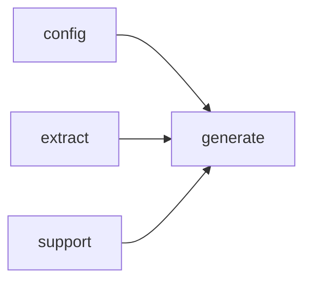

# Module `generate:page`

## Summary

模块 `generate:page` 承担文档生成管线中页面构建与渲染的核心职责。它接收来自分析阶段的结构化数据（符号分析、页面计划、配置等），为索引、文件、模块、命名空间及符号等不同页面类型构造顶层结构（根节点），并将这些结构化的页面内容生成为 Markdown 格式的文档。随后通过写入操作持久化到目标文件中。

其公开接口覆盖页面生成的全流程：包括 `build_index_page_root`、`build_file_page_root`、`build_module_page_root`、`build_namespace_page_root` 及通用的 `build_page_root` 用于构建各类页面的根节点；`render_page_markdown` 用于将页面内容渲染为 Markdown 文本；`render_page_bundle` 用于协调一组逻辑相关联的页面（如同一模块下的所有页面）的渲染；以及 `write_page` 负责将构建完毕的页面写入文件系统。模块内部依赖 `generate:model`、`generate:symbol`、`generate:markdown` 等子模块完成数据表示与格式转换。

## Imports

- [`config`](../config/index.md)
- [`extract`](../extract/index.md)
- [`generate:common`](common.md)
- [`generate:markdown`](markdown.md)
- [`generate:model`](model.md)
- [`generate:symbol`](symbol.md)
- `std`
- [`support`](../support/index.md)

## Imported By

- [`generate:scheduler`](scheduler.md)

## Dependency Diagram

## Functions

### `clore::generate::build_file_page_root`

Declaration: `generate/render/page.cppm:345`

Definition: `generate/render/page.cppm:345`

Declaration: [`Namespace clore::generate`](../../namespaces/clore/generate/index.md)

该函数通过依次组装一系列子章节来构造文件页面的根语义区域。它首先调用 `make_section` 创建一个 `SemanticKind::File` 类型的根节点，然后根据 `PagePlan` 中提供的文件信息在 `ProjectModel` 中查找该文件。若找到，则先后调用内部辅助函数 `append_file_item` 和 `build_list_section` 生成“Includes”与“Included By”两个 bullet 列表，其中路径排序和相对化依赖于 `config.project_root` 与 `make_source_relative`。接着通过 `render_file_dependency_diagram_code` 尝试渲染 Mermaid 格式的依赖关系图，若结果非空则包装为一个“Dependency Diagram”子章节。

随后调用 `append_standard_symbol_sections`（来自匿名命名空间）注入标准符号章节，该函数接收配置、模型、分析存储、链接解析器以及两个回调：一个用于筛选实现符号（`collect_implementation_symbols`），另一个用于为每个符号添加声明链接段落。之后使用 `find_module_for_file` 查找文件所属模块，若存在则创建“Module Information”子章节，通过 `links.resolve_module` 决定是否将模块名渲染为超链接。最后调用 `build_related_page_targets` 构造“Related Pages”列表，并将所有子节点依次挂接到根节点后返回。

#### Side Effects

No observable side effects are evident from the extracted code.

#### Reads From

- plan
- config
- model
- analyses
- links

#### Usage Patterns

- Called during page root construction for file pages
- Used to assemble includes, included-by, dependency diagram, symbol sections, module info, and related pages

### `clore::generate::build_index_page_root`

Declaration: `generate/render/page.cppm:447`

Definition: `generate/render/page.cppm:447`

Declaration: [`Namespace clore::generate`](../../namespaces/clore/generate/index.md)

函数 `clore::generate::build_index_page_root` 负责构造索引页的语义树根节点。它首先创建一个 `SemanticKind::Index` 根节，并根据 `plan.title` 设置标题。随后依次插入多个子节：一个基于 `PromptKind::IndexOverview` 的概述提示节；当 `model.uses_modules` 为真时，遍历 `model.modules` 收集所有可链接的接口模块名称，排序后生成为项目链接列表；接着遍历 `model.files` 生成按源相对路径排序的文件列表；再遍历 `model.namespaces`，过滤掉匿名命名空间后生成命名空间列表；最后遍历 `model.symbols`，筛选出类型符号（`is_type_kind`）且非匿名命名空间内的符号，经排序后通过 `build_symbol_link_list` 生成符号链接列表。如果 `render_module_dependency_diagram_code` 返回非空字符串，额外添加一个包含 Mermaid 代码的节。所有列表均通过 `build_list_section` 生成，其中链接目标通过 `make_relative_link_target` 拼接相对路径。

#### Side Effects

- Allocates and returns a new `SemanticSection` hierarchy with multiple child nodes

#### Reads From

- `plan.title`
- `plan.relative_path`
- `config.project_root`
- `model.uses_modules`
- `model.modules`
- `model.files`
- `model.namespaces`
- `model.symbols`
- `outputs` (keyed by `PromptKind::IndexOverview`)
- `links` via `resolve_module`, `resolve`, `resolve` (for files and namespaces)

#### Writes To

- Returned `SemanticSection` root and its child nodes

#### Usage Patterns

- Called when building the root section of a top-level index page
- Part of a family of page builders (`build_page_root`, `build_namespace_page_root`, `build_file_page_root`, `build_module_page_root`)

### `clore::generate::build_module_page_root`

Declaration: `generate/render/page.cppm:255`

Definition: `generate/render/page.cppm:255`

Declaration: [`Namespace clore::generate`](../../namespaces/clore/generate/index.md)

该函数首先构造一个以 `SemanticKind::Module` 为类型的根节点，并通过 `build_prompt_section` 嵌入由 `PromptKind::ModuleSummary` 生成的摘要提示。随后，若能在模型中通过 `extract::find_module_by_name` 定位到当前模块，则分别构建 `Imports` 与 `Imported By` 两个列表章节：前者直接遍历模块的 `imports` 集合，后者遍历所有模块，筛选出那些导入了当前模块的候选，经去重排序后通过 `append_module_item` 填充。同时，若有有效的 `import_diagram`，则创建一个 `SemanticKind::Section` 类型的 `Dependency Diagram` 章节，并用 `make_mermaid` 嵌入图内容。

在模块相关的静态信息之后，调用 `append_standard_symbol_sections` 统一添加标准符号章节，该函数接收多个回调以控制符号收集（基于 `collect_implementation_symbols`）、声明页链接（通过 `find_declaration_page`）以及文档链接（通过 `symbol_doc_view_for`）。最后，函数追加 `Internal Structure` 提示章节和 `Related Pages` 列表，后者由 `build_related_page_targets` 动态生成链接条目。整个流程依赖 `PagePlan`、`config::TaskConfig`、`extract::ProjectModel`、`SymbolAnalysisStore`、`LinkResolver` 及 `PageDocLayout` 等外部对象，并通过一系列匿名命名空间中的辅助函数完成章节构建与内容填充。

#### Side Effects

- Allocates heap memory for the constructed `SemanticSectionPtr` and its children
- Reads from the `outputs` map via calls to `prompt_output_of`
- Reads the `model` to iterate over modules and imports

#### Reads From

- `plan`
- `config`
- `model`
- `outputs`
- `analyses`
- `links`
- `layout`

#### Writes To

- Returned `SemanticSectionPtr` (root) and its `children` sequence

#### Usage Patterns

- Called during page generation for module documentation
- Used to assemble the top-level structure of a module page in the renderer

### `clore::generate::build_namespace_page_root`

Declaration: `generate/render/page.cppm:165`

Definition: `generate/render/page.cppm:165`

Declaration: [`Namespace clore::generate`](../../namespaces/clore/generate/index.md)

`clore::generate::build_namespace_page_root` 通过构造一个以 `SemanticKind::Namespace` 为类型的 `SemanticSectionPtr` 根节点来编排命名空间页面的布局。该根节点的标题和所有者键从 `plan` 中提取。函数依次向根节点追加多个子部分：一个由 `build_prompt_section` 生成的摘要提示部分（从 `outputs` 中按 `PromptKind::NamespaceSummary` 提取内容）；一个可选的名字空间图部分，该部分仅在 `render_namespace_diagram_code` 返回非空字符串时才插入，图内容通过 `make_mermaid` 包装为 Markdown 节点；一个由 `build_list_section` 构造的子命名空间列表，该列表从 `model.namespaces` 中获取当前命名空间的所有子命名空间，过滤掉包含 `“(anonymous namespace)”` 的条目，并按字典序排序，每个条目通过 `links.resolve` 解析为目标路径并生成 `make_link`；随后调用 `append_standard_symbol_sections` 添加标准符号部分，该调用通过 `collect_namespace_symbols` 收集当前命名空间下的符号，并利用两个 lambda 分别为每个符号添加实现页面链接（通过 `find_implementation_pages`）和文档关联链接（通过 `add_symbol_doc_links`）；最后，追加一个由 `build_related_page_targets` 生成的“相关页面”列表，该列表基于 `plan`、`links` 和相对路径构建链接。整体流程依赖 `config`、`model`、`analyses`、`layout` 等参数，并通过多个内部辅助函数（如 `make_section`、`build_prompt_section`、`render_namespace_diagram_code`、`build_list_section`、`append_standard_symbol_sections`、`collect_namespace_symbols`、`find_implementation_pages`、`add_symbol_doc_links`、`build_related_page_targets`）完成模块化组装。

#### Side Effects

No observable side effects are evident from the extracted code.

#### Reads From

- `plan`
- `config`
- `model`
- `outputs`
- `analyses`
- `links`
- `layout`
- `plan.owner_keys`
- `plan.title`
- `plan.relative_path`
- `model.namespaces`
- `links.resolve`

#### Usage Patterns

- Called from higher-level page generation functions such as `render_page_markdown` or `build_module_page_root`.
- Used as the primary builder for namespace page root sections in the documentation generation pipeline.

### `clore::generate::build_page_root`

Declaration: `generate/render/page.cppm:546`

Definition: `generate/render/page.cppm:546`

Declaration: [`Namespace clore::generate`](../../namespaces/clore/generate/index.md)

函数 `clore::generate::build_page_root` 充当一个中央调度器，根据 `plan.page_type` 枚举值将页面树的构建委托给四个专用函数。内部控制流仅包含一个 `switch` 语句：对于 `PageType::Index`，它调用 `build_index_page_root`；对于 `PageType::Namespace`，调用 `build_namespace_page_root`；对于 `PageType::Module`，调用 `build_module_page_root`；对于 `PageType::File`，调用 `build_file_page_root`。每种情况都从相同的参数集中传递必要的依赖项——包括 `plan`、`config`、`model`、`outputs`、`analyses`、`links` 和 `layout`——但每个专门函数只接收它所需的子集。如果页面类型不匹配任何已知情况，则回退到通过 `make_section` 创建一个默认的 `SemanticSection`。该函数不执行任何自有的渲染逻辑；它完全依赖下游构建器来生成小节结构，这些构建器又进一步调用 `render_page_markdown`、`render_page_bundle` 及匿名命名空间中的辅助函数（如 `append_module_item`、`append_file_item`、`prompt_output_of_local_page` 和 `build_frontmatter_page`）。

#### Side Effects

No observable side effects are evident from the extracted code.

#### Reads From

- `plan.page_type`
- `plan.title`
- `plan`
- `config`
- `model`
- `outputs`
- `analyses`
- `links`
- `layout`

#### Usage Patterns

- Used as a top-level dispatcher to generate the root `SemanticSectionPtr` for a documentation page based on its type
- Called by page generation infrastructure after preparing `PagePlan`, `TaskConfig`, `ProjectModel`, outputs, analyses, link resolver, and layout

### `clore::generate::render_page_bundle`

Declaration: `generate/render/page.cppm:565`

Declaration: [`Namespace clore::generate`](../../namespaces/clore/generate/index.md)

函数 `clore::generate::render_page_bundle` 将接收的 `PagePlan`、`config::TaskConfig`、`extract::ProjectModel`、`prompt_outputs` 映射、`SymbolAnalysisStore` 以及 `LinkResolver` 作为输入，协调生成某一组页面的完整渲染结果。其内部实现首先解析 `PagePlan` 中的页面条目，依据 `config::TaskConfig` 指定的输出格式与优化选项，逐个对计划中的页面调用底层的渲染引擎。在渲染每个页面时，函数会利用 `extract::ProjectModel` 获取结构化模型数据，借助 `SymbolAnalysisStore` 提供的符号分析结果以及 `LinkResolver` 实现的跨实体链接解析，并将 `prompt_outputs` 中的用户提示输出作为增强上下文注入。渲染过程中遇到任何错误或缺失的依赖都会通过返回的 `std::expected` 封装为错误状态，从而允许调用方在整体流程中集中处理失败情况。

#### Side Effects

No observable side effects are evident from the extracted code.

#### Reads From

- `const PagePlan& plan`
- `const config::TaskConfig& config`
- `const extract::ProjectModel& model`
- `const std::unordered_map<std::string, std::string>& prompt_outputs`
- `const SymbolAnalysisStore& analyses`
- `const LinkResolver& links`

#### Writes To

- the returned `std::expected` object

#### Usage Patterns

- called by page generation entry points
- orchestrates page bundle rendering

### `clore::generate::render_page_bundle`

Declaration: `generate/render/page.cppm:573`

Declaration: [`Namespace clore::generate`](../../namespaces/clore/generate/index.md)

函数 `clore::generate::render_page_bundle` 接收五个 `const int&` 参数并返回 `int`。由于实现源码未在证据部分提供，其内部算法与控制流无法具体分析。依据函数命名推测，该函数可能用于根据一组整数参数生成页面捆绑（page bundle）的渲染结果，但具体依赖关系及设计意图不明。

#### Side Effects

No observable side effects are evident from the extracted code.

#### Reads From

- `plan` parameter
- `config` parameter
- `model` parameter
- `prompt_outputs` parameter
- `links` parameter

#### Usage Patterns

- Called by higher-level page generation functions like `generate_pages` and `generate_pages_async`
- Used to render a single page bundle after planning and prompt resolution

### `clore::generate::render_page_markdown`

Declaration: `generate/render/page.cppm:602`

Definition: `generate/render/page.cppm:602`

Declaration: [`Namespace clore::generate`](../../namespaces/clore/generate/index.md)

该函数是六参数重载的薄包装：接收 `PagePlan`、`TaskConfig`、`ProjectModel`、prompt 输出映射以及 `LinkResolver`，然后将空 `SymbolAnalysisStore` 转发给实际实现。六参数版本是生成 Markdown 的核心，它协调多个构建步骤：首先调用 `clore::generate::build_page_root`（根据页面类型选择 `clore::generate::build_namespace_page_root`、`clore::generate::build_module_page_root`、`clore::generate::build_file_page_root` 或 `clore::generate::build_index_page_root`）构造页面根节点，随后依次调用 `clore::generate::(anonymous namespace)::append_standard_symbol_sections`、`clore::generate::(anonymous namespace)::append_module_item` 和 `clore::generate::(anonymous namespace)::append_file_item` 填充符号列表、模块成员和文件条目。过程中还会集成 `from_prompt` 内容，通过 `select_primary_description_source_page` 选取主描述源，并利用 `prompt_output_of_local_page` 获取本地 prompt 输出。

整个渲染流程依赖 `text` 构建器逐步拼接 Markdown 片段，并处理 `kind`、`section`、`layout` 等属性来生成附加图表（如命名空间图、依赖图、模块图）。最终结果通过 `clore::generate::write_page` 写出，若任一构建步骤失败则返回 `RenderError`。该实现紧密耦合于项目模型、配置和链接解析器，通过精心设计的匿名命名空间中的辅助函数将页面计划转化为结构化文档。

#### Side Effects

No observable side effects are evident from the extracted code.

#### Reads From

- `plan`（`const PagePlan&`）
- `config`（`const config::TaskConfig&`）
- `model`（`const extract::ProjectModel&`）
- `prompt_outputs`（`const std::unordered_map<std::string, std::string>&`）
- `links`（`const LinkResolver&`）

#### Writes To

- 返回的字符串（生成的 Markdown 内容）

#### Usage Patterns

- 作为页面生成管道的入口点
- 由其他渲染函数如 `render_page_bundle` 调用
- 用于生成单个页面的完整 Markdown 输出

### `clore::generate::render_page_markdown`

Declaration: `generate/render/page.cppm:582`

Definition: `generate/render/page.cppm:582`

Declaration: [`Namespace clore::generate`](../../namespaces/clore/generate/index.md)

该函数首先生成完整的页面包（bundle），委托给 `clore::generate::render_page_bundle`，将传入的 `plan`、`config`、`model`、`prompt_outputs`、`analyses` 和 `links` 转发给它。若 bundle 生成失败，则直接向上传播错误。成功获取 bundle 后，函数在返回的页面集合中执行线性查找，依据 `plan` 的 `relative_path` 字段，使用 `std::ranges::find_if` 找出匹配的 `GeneratedPage` 对象。如果未找到（即 bundle 中缺少计划页），则构造一个 `RenderError` 并返回 `std::unexpected`。否则，直接提取并返回该页面的 `content` 字段。整个流程依赖 `render_page_bundle` 完成实际的多页渲染逻辑，自身仅承担索引与提取的职责。

#### Side Effects

No observable side effects are evident from the extracted code.

#### Reads From

- `plan`
- `config`
- `model`
- `prompt_outputs`
- `analyses`
- `links`
- `plan.relative_path`
- `bundle` elements

#### Usage Patterns

- Used in page generation to produce markdown for a specific page plan.

### `clore::generate::write_page`

Declaration: `generate/render/page.cppm:666`

Definition: `generate/render/page.cppm:666`

Declaration: [`Namespace clore::generate`](../../namespaces/clore/generate/index.md)

函数 `clore::generate::write_page` 接收一个 `GeneratedPage` 和输出根目录，负责将页面的内容落地到文件系统。内部先校验 `page.relative_path` 的合法性：若为绝对路径或包含 `.` 或 `..` 片段，立即返回 `std::unexpected<RenderError>`。通过校验后，将输出根目录与相对路径拼接并进行词法规范化得到目标路径，再创建其父目录（若不存在），最后调用 `clore::support::write_utf8_text_file` 写入文件内容，任何写入失败也会包装为 `RenderError` 返回。

该函数依赖 `std::filesystem` 进行路径操作与目录创建，以及 `clore::support::write_utf8_text_file` 完成实际写入。错误传播完全通过 `std::expected<void, RenderError>` 实现，所有异常路径均被显式处理，保证了写入操作的原子性（目录创建与文件写入之间无状态残留风险）。

#### Side Effects

- creates directories on the filesystem
- writes file content to disk

#### Reads From

- `page.relative_path`
- `page.content`
- `output_root`

#### Writes To

- filesystem at the derived output path

#### Usage Patterns

- Called after generating page content to persist the page to disk
- Used in batch document generation pipeline

## Internal Structure

模块 `generate:page` 是文档生成管线中负责组织、构建并输出最终 Markdown 页面的核心单元。在分解上，它按页面类型（索引、命名空间、模块、文件、符号）显式拆分为多个 `build_*_root` 函数，每个函数接收一组标识该页面上下文（如计划、分析、布局）的句柄，并返回页面树的根节点。随后由 `render_page_markdown` 或 `render_page_bundle` 将这些结构化内容转化为 Markdown 文本并交由 `write_page` 持久化。引入的辅助函数（如 `append_module_item`、`build_frontmatter_page`、`prompt_output_of_local_page`）封装了特定子任务，且多数位于匿名命名空间内以实现内部隐藏。

在依赖关系上，该模块导入了 `generate:model`（获取页面计划与符号分析）、`generate:common`（共享字符串、链接工具）、`generate:markdown`（工厂函数和渲染入口）、`generate:symbol`（符号文档布局）以及底层支持模块（`support`）和 `extract`。内部采用清晰的三层结构：上层入口函数（如 `build_*_root`）协调数据获取与节点创建，中层为匿名命名空间中的辅助函数承担具体的列表生成、描述来源选择等子逻辑，底层则直接调用 `generate:markdown` 中的文本构建原语。这种分层隔离了职责，使页面构建与渲染格式解耦，便于维护和扩展。

## Related Pages

- [Module config](../config/index.md)
- [Module extract](../extract/index.md)
- [Module generate:common](common.md)
- [Module generate:markdown](markdown.md)
- [Module generate:model](model.md)
- [Module generate:symbol](symbol.md)
- [Module support](../support/index.md)

