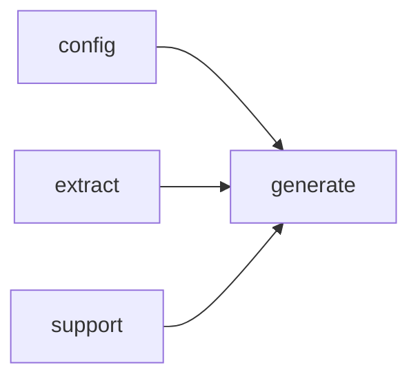

# Module `generate:page`

## Summary

该模块是文档生成管线中负责页面渲染的核心模块，归属 `generate/render/page.cppm`。它提供了一组公共函数，用于构建各种类型页面（如文件页、模块页、命名空间页、索引页）的根结构（`build_file_page_root`、`build_module_page_root`、`build_namespace_page_root`、`build_index_page_root`），并将这些根结构渲染为 Markdown（`render_page_markdown`）或页面捆绑包（`render_page_bundle`），最终通过 `write_page` 持久化到输出目标。模块内部依赖 `generate:model`、`generate:symbol`、`generate:markdown` 等下层模块提供的数据结构和渲染工具，同时依赖 `config` 获取配置、`extract` 获取符号提取结果、`support` 获取基础文件和文本处理能力。其公开范围涵盖了从页面计划构建到渲染输出的完整流程，调用者只需提供符合内部约定的资源标识符即可驱动页面生成。

## Imports

- [`config`](../config/index.md)
- [`extract`](../extract/index.md)
- [`generate:common`](common.md)
- [`generate:markdown`](markdown.md)
- [`generate:model`](model.md)
- [`generate:symbol`](symbol.md)
- `std`
- [`support`](../support/index.md)

## Imported By

- [`generate:scheduler`](scheduler.md)

## Dependency Diagram

## Functions

### `clore::generate::build_file_page_root`

Declaration: `generate/render/page.cppm:345`

Definition: `generate/render/page.cppm:345`

Declaration: [`Namespace clore::generate`](../../namespaces/clore/generate/index.md)

该函数按结构组装一个 `SemanticSection` 节点树，其根节点使用 `make_section` 以 `SemanticKind::File` 创建，以表示文件页面的顶层内容。控制流首先检查 `plan.owner_keys.front()` 是否存在于 `model.files` 中，若存在则依次生成“Includes”和“Included By”两个列表节：前者遍历当前文件的所有 `include` 项并通过 `append_file_item` 构建条目，后者遍历 `model.files` 中所有其他文件，筛选出包含当前文件的候选路径，经 `std::sort` 排序后再用 `append_file_item` 填充列表。随后，若 `render_file_dependency_diagram_code` 返回非空字符串，则嵌入一个“Dependency Diagram”节并插入 Mermaid 代码块。核心符号部分由 `append_standard_symbol_sections` 完成，它通过 `collect_implementation_symbols` 谓词收集符号，并利用两个回调处理声明链接和附加内容。接着，如果 `find_module_for_file` 成功找到模块名称，则创建一个“Module Information”节，根据 `links.resolve_module` 的结果选择纯文本或超链接形式显示模块名。最后，通过 `build_related_page_targets` 填充“Related Pages”列表节。`root` 的最终结构反映了自上而下的文件信息组织顺序，依赖于 `model`、`analyses`、`links` 及 `config` 中的项目根路径等数据，并广泛调用匿名命名空间中的辅助函数。
该函数按结构组装一个 `SemanticSection` 节点树，其根节点使用 `make_section` 以 `SemanticKind::File` 创建，以表示文件页面的顶层内容。控制流首先检查 `plan.owner_keys.front()` 是否存在于 `model.files` 中，若存在则依次生成“Includes”和“Included By”两个列表节：前者遍历当前文件的所有 `include` 项并通过 `append_file_item` 构建条目，后者遍历 `model.files` 中所有其他文件，筛选出包含当前文件的候选路径，经 `std::sort` 排序后再用 `append_file_item` 填充列表。随后，若 `render_file_dependency_diagram_code` 返回非空字符串，则嵌入一个“Dependency Diagram”节并插入 Mermaid 代码块。核心符号部分由 `append_standard_symbol_sections` 完成，它通过 `collect_implementation_symbols` 谓词收集符号，并利用两个回调处理声明链接和附加内容。接着，如果 `find_module_for_file` 成功找到模块名称，则创建一个“Module Information”节，根据 `links.resolve_module` 的结果选择纯文本或超链接形式显示模块名。最后，通过 `build_related_page_targets` 填充“Related Pages”列表节。`root` 的最终结构反映了自上而下的文件信息组织顺序，依赖于 `model`、`analyses`、`links` 及 `config` 中的项目根路径等数据，并广泛调用匿名命名空间中的辅助函数。

#### Side Effects

No observable side effects are evident from the extracted code.

#### Reads From

- `plan` (`PagePlan`)
- `config` (`config::TaskConfig`)
- `model` (`extract::ProjectModel`)
- `analyses` (`SymbolAnalysisStore`)
- `links` (`LinkResolver`)
- `model.files`
- `plan.owner_keys`
- `plan.title`
- `plan.relative_path`
- `config.project_root`

#### Writes To

- Constructed `SemanticSectionPtr` (return value)
- Intermediate `make_section`, `make_mermaid`, `make_link`, etc. objects

#### Usage Patterns

- Called during file page generation to create the root section.
- Used as part of the page building pipeline for file documentation.

### `clore::generate::build_index_page_root`

Declaration: `generate/render/page.cppm:447`

Definition: `generate/render/page.cppm:447`

Declaration: [`Namespace clore::generate`](../../namespaces/clore/generate/index.md)

`clore::generate::build_index_page_root` 构造索引页面的语义根节。它首先调用 `make_section` 创建 `SemanticKind::Index` 类型的根节点，然后依次追加子节：一个从 `prompt_output_of` 提取 `PromptKind::IndexOverview` 输出的概述区；若 `model.uses_modules` 为真，则构建“Modules”列表，过滤出接口模块且可通过 `links` 解析的名称，排序后生成链接项；接着构造“Files”列表，按相对路径排序并检查 `links.resolve` 的有效性；随后是“Namespaces”列表，排除匿名命名空间；再后是“Types”列表，筛选 `is_type_kind` 为真的符号并排序，调用 `build_symbol_link_list` 生成链接。最后，若 `render_module_dependency_diagram_code` 返回非空字符串，则追加一个包含 Mermaid 图的“Module Dependency Diagram”子节。整个函数依赖于 `plan.relative_path`、`config` 以及 `links` 解析器来生成正确的相对链接，控制流完全由条件判断和排序后的迭代驱动。

#### Side Effects

- allocates and populates `SemanticSection` and `MarkdownNode` objects via `make_section`, `build_list_section`, `build_symbol_link_list`, `make_mermaid`, and `make_link`

#### Reads From

- `plan`
- `config`
- `model`
- `outputs`
- `links`
- `plan.relative_path`
- `plan.title`
- `model.uses_modules`
- `model.modules`
- `model.files`
- `model.namespaces`
- `model.symbols`
- `config.project_root`

#### Writes To

- the returned `SemanticSectionPtr` root
- `root->children` (via `push_back`)
- `section->children` for module diagram

#### Usage Patterns

- called to generate the top-level index page of a documentation site
- produces the root `SemanticSection` for index page rendering

### `clore::generate::build_module_page_root`

Declaration: `generate/render/page.cppm:255`

Definition: `generate/render/page.cppm:255`

Declaration: [`Namespace clore::generate`](../../namespaces/clore/generate/index.md)

函数 `clore::generate::build_module_page_root` 首先创建一个 `SemanticKind::Module` 类型的 `root` 部分，其标题由 `plan.title` 确定，并从 `plan.owner_keys.front()` 获取模块标识。接着，它立即添加一个由 `build_prompt_section` 生成的 "Summary" 提示节。通过 `find_module_by_name` 在 `model` 中查找该模块；若存在，则依次添加 "Imports" 和 "Imported By" 列表节，其中 “Imported By” 列表通过遍历所有模块收集引用当前模块的名称，并去重排序后使用 `append_module_item` 生成链接。随后，基于 `render_import_diagram_code` 产生的非空 mermaid 代码，插入一个 "Dependency Diagram" 小节，其中包含一个 mermaid 节点。

接下来，调用 `append_standard_symbol_sections` 向 `root->children` 追加标准符号部分。该调用依赖三个回调：一个通过 `collect_implementation_symbols` 在 `plan` 和 `model` 中收集符号；一个利用 `find_declaration_page` 与 `push_optional_link_paragraph` 为每个符号添加声明链接；另一个使用 `add_symbol_doc_links` 根据 `symbol_doc_view_for` 添加文档链接。随后添加 "Internal Structure" 提示节。最后，通过 `build_related_page_targets` 生成 "Related Pages" 列表节，使用 `make_link` 创建每个目标链接。整体流程依赖于 `build_prompt_section`、`build_list_section`、`append_module_item`、`append_standard_symbol_sections`、`render_import_diagram_code`、`collect_implementation_symbols`、`find_declaration_page`、`add_symbol_doc_links`、`symbol_doc_view_for` 以及 `build_related_page_targets` 等辅助函数，并依赖 `plan`、`config`、`model`、`analyses`、`links` 和 `layout` 参数完成上下文组装。

#### Side Effects

No observable side effects are evident from the extracted code.

#### Reads From

- Reads from the `plan`, `config`, `model`, `outputs`, `analyses`, `links`, and `layout` parameters
- Reads module data from `model.modules` and `module->imports`
- Reads from `find_declaration_page` and `build_related_page_targets`

#### Writes To

- Constructs and returns a `SemanticSectionPtr` representing the root section of a module page
- Writes to the `children` vector of the root section

#### Usage Patterns

- Called during documentation generation to produce the page content for a module
- Used by higher-level page rendering functions

### `clore::generate::build_namespace_page_root`

Declaration: `generate/render/page.cppm:165`

Definition: `generate/render/page.cppm:165`

Declaration: [`Namespace clore::generate`](../../namespaces/clore/generate/index.md)

该函数首先通过 `make_section` 构造一个语义类型为 `SemanticKind::Namespace` 的根节点，并将其深度设为一级标题。接着调用 `build_prompt_section` 生成一个名为“Summary”的二级提示输出节，从 `outputs` 中选取 `PromptKind::NamespaceSummary` 对应的内容。然后尝试通过 `render_namespace_diagram_code` 渲染命名空间内类型的继承关系图（Mermaid 格式），若结果非空则创建一个名为“Diagram”的二级节并插入。随后通过 `build_list_section` 构建“Subnamespaces”列表，遍历模型的 `namespaces` 字典，排除匿名命名空间，利用 `links.resolve` 解析每个子命名空间的相对链接，生成带链接的列表项。核心部分调用 `append_standard_symbol_sections`，该函数接受两个回调：一个用 `collect_namespace_symbols` 收集该命名空间下的所有符号（函数、类、变量等）；另一个回调分别通过 `find_implementation_pages` 和 `add_symbol_doc_links` 为每个符号添加实现链接和文档链接。最后，调用 `build_related_page_targets` 收集相关页面（如父命名空间、模块等），生成“Related Pages”列表作为节点的最后一个子元素，整体返回构造好的 `SemanticSectionPtr`。

#### Side Effects

No observable side effects are evident from the extracted code.

#### Reads From

- `plan` (`PagePlan`)
- `config` (`config::TaskConfig`)
- `model` (`extract::ProjectModel`)
- `outputs` (`std::unordered_map<std::string, std::string>`)
- `analyses` (`SymbolAnalysisStore`)
- `links` (`LinkResolver`)
- `layout` (`PageDocLayout`)

#### Usage Patterns

- Used as the entry point for building the namespace page root.
- Called from higher-level page generation logic to compose the namespace documentation tree.

### `clore::generate::build_page_root`

Declaration: `generate/render/page.cppm:546`

Definition: `generate/render/page.cppm:546`

Declaration: [`Namespace clore::generate`](../../namespaces/clore/generate/index.md)

函数 `clore::generate::build_page_root` 充当页面类型分发的中心调度器。它接收 `PagePlan`、`config::TaskConfig`、`extract::ProjectModel`、输出映射、`SymbolAnalysisStore`、`LinkResolver` 和 `PageDocLayout` 共七个参数，通过检查 `plan.page_type` 的枚举值将调用转发至四个具体的构建函数：`build_index_page_root`、`build_namespace_page_root`、`build_module_page_root` 或 `build_file_page_root`。每个分支仅传递该函数所需的相关参数子集，并依赖这些函数完成不同页面根节点的生成。如果页面类型无法识别，则回退到调用 `make_section` 创建一个通用的 `SemanticSection`。该函数本身不执行数据计算或格式化，其全部逻辑是围绕页面类型的 switch 分派，外部依赖就是这四个构建函数以及默认的段创建函数。

#### Side Effects

No observable side effects are evident from the extracted code.

#### Reads From

- `plan`
- `config`
- `model`
- `outputs`
- `analyses`
- `links`
- `layout`

#### Usage Patterns

- Called by page generation routines to obtain the root `SemanticSectionPtr` for a given page plan.
- Used in the rendering pipeline to construct the top-level section of a page.

### `clore::generate::render_page_bundle`

Declaration: `generate/render/page.cppm:565`

Declaration: [`Namespace clore::generate`](../../namespaces/clore/generate/index.md)

该函数首先通过 `PagePlan` 遍历所有待渲染的页面条目，按计划顺序依次处理。对于每个页面，它调用内部渲染器，该渲染器将 `TaskConfig` 中的模板与 `ProjectModel` 提供的源代码实体合并，并利用 `prompt_outputs` 映射中的 AI 生成文本进行内容填充。随后通过 `SymbolAnalysisStore` 执行跨文件符号的依赖分析，确保所有内联链接（由 `LinkResolver` 处理）被正确解析为目标 URL。渲染过程中遇到任何错误（如模板缺失、符号未解析）会立即短路，返回 `std::expected` 的错误状态。所有成功渲染的页面最后被打包为 `render::PageBundle`，该过程依赖外部配置 `config` 控制输出文件的总数和布局顺序。

#### Side Effects

No observable side effects are evident from the extracted code.

#### Reads From

- `PagePlan` `plan`
- `config::TaskConfig` `config`
- `extract::ProjectModel` `model`
- `std::unordered_map<std::string, std::string>` `prompt_outputs`
- `SymbolAnalysisStore` `analyses`
- `LinkResolver` `links`

#### Usage Patterns

- Called from page generation pipeline (e.g., `generate_pages` or `generate_pages_async`) to produce a single page bundle.
- Used as the main rendering step after all analysis and link resolution is available.

### `clore::generate::render_page_bundle`

Declaration: `generate/render/page.cppm:573`

Declaration: [`Namespace clore::generate`](../../namespaces/clore/generate/index.md)

该函数通过依次遍历 `PagePlan` 中的页面定义，从 `ProjectModel` 中提取对应的模型数据，并根据 `TaskConfig` 中的模板与渲染参数生成每个页面的内容。内部依赖 `prompt_outputs` 映射提供动态提示结果的替换，并借助 `LinkResolver` 解析跨页面链接和锚点，从而保证生成文档中引用的正确性。所有页面的渲染结果被组合为一个完整的页面捆绑包，最终以 `std::expected` 的形式返回，错误路径由内部校验和异常捕获机制统一处理。

#### Side Effects

- Writes rendered pages to the filesystem
- May create directories for output

#### Reads From

- const `PagePlan`& plan
- const `config::TaskConfig`& config
- const `extract::ProjectModel`& model
- const `std::unordered_map<std::string, std::string>`& `prompt_outputs`
- const `LinkResolver`& links

#### Writes To

- Filesystem (output pages)

#### Usage Patterns

- Called by higher-level page generation functions like `generate_pages`
- Used to render a single page bundle as part of a larger documentation generation pipeline

### `clore::generate::render_page_markdown`

Declaration: `generate/render/page.cppm:602`

Definition: `generate/render/page.cppm:602`

Declaration: [`Namespace clore::generate`](../../namespaces/clore/generate/index.md)

该函数通过对 `plan`、`config`、`model` 和 `prompt_outputs` 的组合解析，将页面内容逐步构建为最终的 Markdown 字符串。内部控制流围绕 `plan` 中的结构进行迭代：首先调用 `build_page_root` 生成页面根节点，接着根据 `plan` 的组件类型（如模块项、文件项或命名空间分支）分发到 `append_module_item`、`append_file_item` 或 `build_*_page_root` 系列函数。每个分支会利用 `select_primary_description_source_page` 选取主描述源，再通过 `render_page_bundle` 或 `prompt_output_of_local_page` 组装子章节。所有生成的片段经由 `write_page` 函数写入最终的布局输出。依赖包括 `LinkResolver` 和 `SymbolAnalysisStore`，后者用于在部分重载中提供符号分析数据；若未提供，则默认传入空存储。

#### Side Effects

No observable side effects are evident from the extracted code.

#### Reads From

- `plan`
- `config`
- `model`
- `prompt_outputs`
- `links`

#### Usage Patterns

- Used when no precomputed symbol analysis data is available

### `clore::generate::render_page_markdown`

Declaration: `generate/render/page.cppm:582`

Definition: `generate/render/page.cppm:582`

Declaration: [`Namespace clore::generate`](../../namespaces/clore/generate/index.md)

该函数的核心实现围绕两步：调用 `clore::generate::render_page_bundle` 生成完整的页面集合（bundle），然后根据调用方传入的 `plan.relative_path` 在 bundle 中定位当前页面的内容。若 bundle 生成失败（`std::unexpected`），或 bundle 中不存在与 `plan.relative_path` 匹配的 `GeneratedPage` 对象，函数都会立即返回一个 `RenderError` 错误。成功时则直接返回匹配页面的 `content` 字段。这一设计使得 `render_page_markdown` 复用 `render_page_bundle` 的整页生成逻辑，同时仅提取调用者所需的那一页内容。

#### Side Effects

No observable side effects are evident from the extracted code.

#### Reads From

- plan
- config
- model
- `prompt_outputs`
- analyses
- links

#### Usage Patterns

- Used in page generation pipeline to retrieve the final Markdown string for a specific page

### `clore::generate::write_page`

Declaration: `generate/render/page.cppm:666`

Definition: `generate/render/page.cppm:666`

Declaration: [`Namespace clore::generate`](../../namespaces/clore/generate/index.md)

函数 `clore::generate::write_page` 实现将渲染后的页面持久化到文件系统的核心逻辑。它首先对输入参数进行严格的路径安全性校验：验证 `page.relative_path` 为相对路径且不包含 `"."` 或 `".."` 片段，若无效则立即返回 `RenderError`。通过校验后，将输出根路径 `output_root` 与相对路径拼接并归一化得到目标文件路径，然后调用 `std::filesystem::create_directories` 创建父目录（忽略已存在目录，失败时返回错误）。最后委托 `clore::support::write_utf8_text_file` 将 `page.content` 写入目标文件，并透传该函数的错误信息。

该函数无复杂分支，依赖标准库文件系统操作和内部工具函数，其设计将路径验证、目录创建与文件写入分离，确保输出文件的路径安全性与目标目录的自动创建。

#### Side Effects

- creates directories on the filesystem
- writes a UTF-8 text file to disk

#### Reads From

- the `page.relative_path` field
- the `page.content` field
- the `output_root` parameter
- the filesystem to check for existing directories

#### Writes To

- the filesystem (directories and file)
- the `RenderError` value via `std::unexpected` on failure

#### Usage Patterns

- called to output a single generated page file
- used in the page generation pipeline after building the page content

## Internal Structure

`generate:page` 模块是文档生成管线中页面渲染的核心实现，它通过导入 `config`、`extract`、`generate:model` 等模块获取页面计划、符号分析与配置数据，并依赖 `generate:markdown` 和 `generate:common` 提供的结构化文档节点与链接工具来构建最终输出。模块内部采用清晰的分层结构：一组公共构建函数（ `build_namespace_page_root`、`build_module_page_root`、`build_file_page_root`、`build_index_page_root` 以及通用的 `build_page_root`）分别负责不同页面类型根节点的装配；在此之上，`render_page_markdown` 和 `render_page_bundle` 将页面根转换为完整的 Markdown 内容，而 `write_page` 则负责将结果持久化。这些公共接口通过匿名命名空间中封装的辅助例程（如 `append_module_item`、`append_file_item`、`build_frontmatter_page`、`select_primary_description_source_page` 以及模板化的 `append_standard_symbol_sections`）实现逻辑复用，从而在保持内聚性的同时，将页面组装与输出细节与底层模型和符号处理分离。

## Related Pages

- [Module config](../config/index.md)
- [Module extract](../extract/index.md)
- [Module generate:common](common.md)
- [Module generate:markdown](markdown.md)
- [Module generate:model](model.md)
- [Module generate:symbol](symbol.md)
- [Module support](../support/index.md)

