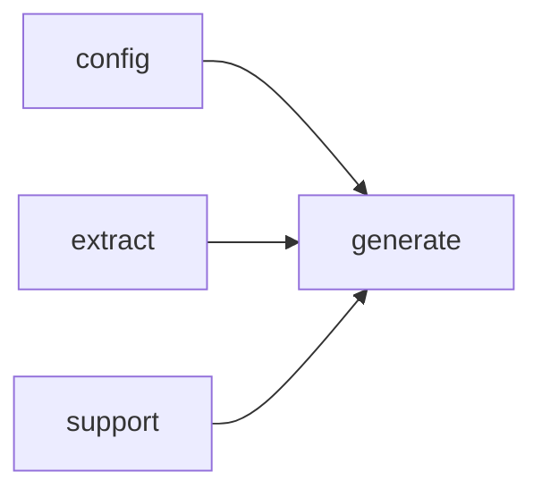

# Module `generate:page`

## Summary

模块 `generate:page` 是文档生成管线中的页面组装与输出层，负责将模型和分析数据转换为最终发布的文档页面。它定义并实现了多种页面类型的生成入口，包括基础文档页面（`render_page_markdown`）、文件页面（`build_file_page_root`）、模块页面（`build_module_page_root`）、命名空间页面（`build_namespace_page_root`）以及索引页面（`build_index_page_root`），并提供了 `build_page_root` 作为通用根结构构建函数、`render_page_bundle` 用于聚合输出、以及 `write_page` 完成页面的持久化写入。这些公开函数共同组成了从页面计划到最终 Markdown 文件的完整流程，内部通过匿名命名空间中的辅助函数（如 `append_file_item`、`append_module_item`、`append_standard_symbol_sections`）实现章节拼接、符号收集、链接构建等公共逻辑。

## Imports

- [`config`](../config/index.md)
- [`extract`](../extract/index.md)
- [`generate:common`](common.md)
- [`generate:markdown`](markdown.md)
- [`generate:model`](model.md)
- [`generate:symbol`](symbol.md)
- [`support`](../support/index.md)

## Imported By

- [`generate:scheduler`](scheduler.md)

## Dependency Diagram

```mermaid
graph LR
    M0["generate"]
    I0["config"]
    I0 --> M0
    I1["extract"]
    I1 --> M0
    I2["support"]
    I2 --> M0
```

## Functions

### `clore::generate::build_file_page_root`

Declaration: `src/generate/render/page.cppm:364`

Definition: `src/generate/render/page.cppm:364`

Declaration: [`Namespace clore::generate`](../../namespaces/clore/generate/index.md)

`clore::generate::build_file_page_root` 构造一个表示文件实体的语义树根节点。函数首先创建一个 `SemanticKind::File` 类型的节，然后检查 `plan.owner_keys` 是否在 `model.files` 中存在对应文件；若存在，则依次构建“Includes”和“Included By”两个无序列表，每个列表借助 `append_file_item` 根据 `plan.relative_path` 和 `links` 生成链接项。之后，若 `render_file_dependency_diagram_code` 产生非空字符串，则插入一个“Dependency Diagram”子节，并添加 Mermaid 代码块。接着调用 `append_standard_symbol_sections`，通过 `collect_implementation_symbols` 收集当前文件中的实现符号，并注入声明链接与文档链接（此处文档链接回调为空）。随后，若通过 `find_module_for_file` 找到所属模块，则添加“Module Information”子节，将模块名渲染为链接（如果 `links.resolve_module` 成功）或代码文字。最后，使用 `build_related_page_targets` 生成“Related Pages”列表。

算法以线性顺序检查条件并填充子节点，依赖 `PagePlan` 的 `owner_keys`、`relative_path`、`title` 等字段，以及 `config::TaskConfig` 的项目根路径、`extract::ProjectModel` 的文件与符号映射、`SymbolAnalysisStore` 与 `LinkResolver` 提供的分析结果与链接解析。所有子节的构建均通过内联 lambda 延迟求值，确保只在必要时执行字符串操作与遍历。

#### Side Effects

No observable side effects are evident from the extracted code.

#### Reads From

- `plan` (specifically `plan.owner_keys`, `plan.title`, `plan.relative_path`)
- `config` (specifically `config.project_root`)
- `model` (specifically `model.files` and file include lists)
- `analyses` (passed to `append_standard_symbol_sections` and others)
- `links` (used for resolving module and page targets)
- `render_file_dependency_diagram_code`, `find_module_for_file`, `build_related_page_targets`, `collect_implementation_symbols`, `find_declaration_page`

#### Usage Patterns

- Called to generate the root semantic section for a file documentation page
- Used in the file page rendering pipeline
- Invoked after page plan and analysis data are prepared

### `clore::generate::build_index_page_root`

Declaration: `src/generate/render/page.cppm:466`

Definition: `src/generate/render/page.cppm:466`

Declaration: [`Namespace clore::generate`](../../namespaces/clore/generate/index.md)

The function constructs a *root* `SemanticSection` with `SemanticKind::Index` as the index page’s top‑level container. It first appends a prompt‑driven overview section via `build_prompt_section`, then conditionally inserts a module list when `model.uses_modules` is true. For modules, it collects interface units whose names are unique and resolvable through `links`, sorts them, and builds a `BulletList` of links. The function always adds three more sorted lists: files (using `config.project_root` for relative source paths), namespaces (excluding anonymous namespaces), and types (those satisfying `is_type_kind` and not belonging to an anonymous namespace, resolved via `links`). Each list is assembled by `build_list_section` with a lambda that populates a `BulletList` of link items. Finally, if `render_module_dependency_diagram_code` produces non‑empty output, a Mermaid diagram section is appended to the same *root* node. The entire structure relies heavily on `plan.relative_path` for link targets and on `links` for resolving entity paths.

#### Side Effects

No observable side effects are evident from the extracted code.

#### Reads From

- `plan.title`
- `plan.relative_path`
- `outputs` via `prompt_output_of`
- `model.uses_modules`
- `model.modules`
- `model.files`
- `model.namespaces`
- `model.symbols`
- `config.project_root`
- `links.resolve`
- `links.resolve_module`

#### Usage Patterns

- Constructing the top-level index page structure in documentation generation
- Called from page building pipeline to create index root section

### `clore::generate::build_module_page_root`

Declaration: `src/generate/render/page.cppm:274`

Definition: `src/generate/render/page.cppm:274`

Declaration: [`Namespace clore::generate`](../../namespaces/clore/generate/index.md)

函数 `clore::generate::build_module_page_root` 构建模块页面的语义根节点。内部首先创建一个 `SemanticKind::Module` 根节，然后插入由 `build_prompt_section` 生成的摘要提示节。若 `plan.owner_keys` 指定的模块在 `model` 中存在，则分别构造“Imports”和“Imported By”两个列表节，列表项通过 `append_module_item` 填充并排序去重；随后利用 `render_import_diagram_code` 生成 mermaid 依赖图，若非空则创建 `SemanticKind::Section` 并添加为 `make_mermaid` 节点。接着调用 `append_standard_symbol_sections`，传入收集符号的回调 `collect_implementation_symbols`、声明链接回调 `push_optional_link_paragraph` 以及文档链接回调 `add_symbol_doc_links`，以填充符号相关子节。最后添加“Internal Structure”提示节和“Related Pages”列表节（通过 `build_related_page_targets` 生成链接列表），返回完整的根节点。依赖的关键组件包括 `build_prompt_section`、`build_list_section`、`append_module_item`、`render_import_diagram_code`、`make_mermaid`、`append_standard_symbol_sections` 及其回调，以及链接解析器 `links` 和布局 `layout`。

#### Side Effects

No observable side effects are evident from the extracted code.

#### Reads From

- `plan` (`owner_keys`, title, `relative_path`)
- `config`
- `model` (modules, module names, imports)
- `outputs` (prompt outputs for `ModuleSummary` and `ModuleArchitecture`)
- `analyses`
- `links` (link resolver for module resolution and page title resolution)
- `layout`

#### Usage Patterns

- Used to build the root content for a module page in documentation generation
- Called by higher-level page rendering functions to assemble the page structure

### `clore::generate::build_namespace_page_root`

Declaration: `src/generate/render/page.cppm:184`

Definition: `src/generate/render/page.cppm:184`

Declaration: [`Namespace clore::generate`](../../namespaces/clore/generate/index.md)

`clore::generate::build_namespace_page_root` 构造命名空间页面的语义根节点头部（`SemanticKind::Namespace`），并采用自顶向下的线性控制流逐步填充子节点。它首先创建一个`Summary`提示段落（通过`prompt_output_of`从`outputs`提取），然后检查`render_namespace_diagram_code`的输出，若不为空则插入一个包含Mermaid图表的`Diagram`章节。接着调用`build_list_section`生成`Subnamespaces`列表，遍历`model.namespaces`中的子命名空间，过滤匿名命名空间，并通过`links.resolve`将每个子命名空间转换为相对链接。之后`append_standard_symbol_sections`被调用，使用lambda闭包分别提供符号收集器（`collect_namespace_symbols`）、实现页面链接生成器（`find_implementation_pages`）和文档链接生成器（`add_symbol_doc_links`），以填充标准符号组和关联链接。最后通过`build_related_page_targets`生成`Related Pages`列表并附加到根节点。该函数完全依赖`PagePlan`、`config::TaskConfig`、`extract::ProjectModel`、`SymbolAnalysisStore`、`LinkResolver`和`PageDocLayout`等输入参数，以及匿名命名空间内定义的辅助构建函数。

#### Side Effects

No observable side effects are evident from the extracted code.

#### Reads From

- `plan.owner_keys`
- `plan.title`
- `plan.relative_path`
- `model.namespaces`
- `outputs` (via `prompt_output_of`)
- `links` (via `resolve` and `make_relative_link_target`)
- `config.project_root`
- `analyses` (via `symbol_doc_view_for` in lambda)
- `layout`

#### Usage Patterns

- Used during page generation to construct the top-level section of a namespace page.

### `clore::generate::build_page_root`

Declaration: `src/generate/render/page.cppm:565`

Definition: `src/generate/render/page.cppm:565`

Declaration: [`Namespace clore::generate`](../../namespaces/clore/generate/index.md)

`clore::generate::build_page_root` 是一个分派函数，根据 `plan.page_type` 的值选择具体的页面根构建实现。它接受 `PagePlan`、`config::TaskConfig`、`extract::ProjectModel`、输出映射、`SymbolAnalysisStore`、`LinkResolver` 和 `PageDocLayout` 作为输入。控制流是一个 `switch` 语句：当类型为 `PageType::Index` 时调用 `build_index_page_root`；`PageType::Namespace` 时调用 `build_namespace_page_root`；`PageType::Module` 时调用 `build_module_page_root`；`PageType::File` 时调用 `build_file_page_root`。每个被调用的函数都使用传入的相同参数来构造对应页面类型的 `SemanticSectionPtr` 根节点。默认情况下（无匹配类型），函数返回一个仅包含标题的空节。该函数依赖下层各 `build_*_page_root` 函数以及 `SemanticSection` 构造逻辑，本身只负责路由，不包含特定页面的生成算法。

#### Side Effects

No observable side effects are evident from the extracted code.

#### Reads From

- `plan`
- `config`
- `model`
- `outputs`
- `analyses`
- `links`
- `layout`

#### Usage Patterns

- Called as the entry point for building the root of a page's semantic structure.
- Used in conjunction with `build_index_page_root`, `build_namespace_page_root`, `build_module_page_root`, and `build_file_page_root` for specific page types.

### `clore::generate::render_page_bundle`

Declaration: `src/generate/render/page.cppm:584`

Definition: `src/generate/render/page.cppm:629`

Declaration: [`Namespace clore::generate`](../../namespaces/clore/generate/index.md)

`clore::generate::render_page_bundle` 首先通过 `build_page_doc_layout` 为给定的 `PagePlan` 构造文档布局结构，然后调用 `build_page_root` 生成页面的根节点。主文档的 Markdown 内容由 `render_markdown` 渲染，若结果为空则返回 `RenderError`；否则借助 `build_frontmatter_page` 构建页面元数据（包括标题），并将主页面封装为 `GeneratedPage` 存入初始结果向量。对于支持符号子页面的页面类型（由 `page_supports_symbol_subpages` 判断），函数通过 `for_each_symbol_doc_group` 遍历布局中的符号文档组，并调用 `append_symbol_doc_pages` 将生成的子页面追加至结果向量；若该过程失败则直接返回错误。最终返回包含所有页面的向量。

#### Side Effects

No observable side effects are evident from the extracted code.

#### Reads From

- `plan` (const `PagePlan&`)
- `config` (const `config::TaskConfig&`)
- `model` (const `extract::ProjectModel&`)
- `prompt_outputs` (const `std::unordered_map<std::string, std::string>&`)
- `analyses` (const `SymbolAnalysisStore&`)
- `links` (const `LinkResolver&`)

#### Writes To

- The returned `std::expected<std::vector<GeneratedPage>, RenderError>`

#### Usage Patterns

- Called to generate the set of pages for a given page plan, including the main document and any symbol subpages.

### `clore::generate::render_page_bundle`

Declaration: `src/generate/render/page.cppm:592`

Definition: `src/generate/render/page.cppm:592`

Declaration: [`Namespace clore::generate`](../../namespaces/clore/generate/index.md)

函数 `clore::generate::render_page_bundle` 根据给定的 `PagePlan`、`config::TaskConfig`、`extract::ProjectModel`、`prompt_outputs` 映射和 `LinkResolver` 生成一组 `GeneratedPage`。内部先构造一个空的 `SymbolAnalysisStore`，然后委托给接受该参数的六参数重载。这个核心重载遍历 `plan` 中的每个页面，根据页面类型（如索引页、命名空间页、模块页、文件页等）调用对应的构建函数（例如 `build_index_page_root`、`build_namespace_page_root`、`build_page_root`、`build_file_page_root`），生成一个由 `model` 对象构成的文档内容树。之后通过 `clore::generate::render_page_markdown` 将该内容树转换为 Markdown 文本，再通过 `write_page` 将其与元数据（如标题、布局、链接等）组合成完整的 `GeneratedPage` 结构。整个过程中，依赖 `append_standard_symbol_sections` 等辅助函数填充符号文档，并利用 `prompt_outputs` 集成来自大语言模型的补全内容。

控制流围绕 `plan` 中的页面类型进行分支，将构建任务分派给专门的根构建函数，这些函数内部使用 `append_file_item`、`append_module_item` 等细节函数来组装文档树。生成的 Markdown 正文经由 `build_frontmatter_page` 打包，最终汇总到输出向量。若任一步骤失败，则返回 `std::expected` 中的错误，确保错误向上传播。

#### Side Effects

No observable side effects are evident from the extracted code.

#### Reads From

- `plan` (const `PagePlan&`)
- `config` (const `config::TaskConfig&`)
- `model` (const `extract::ProjectModel&`)
- `prompt_outputs` (const `std::unordered_map<std::string, std::string>&`)
- `links` (const `LinkResolver&`)

#### Usage Patterns

- Convenient entry point when no symbol analysis store is needed
- Replaces explicit construction of an empty `SymbolAnalysisStore` by callers

### `clore::generate::render_page_markdown`

Declaration: `src/generate/render/page.cppm:621`

Definition: `src/generate/render/page.cppm:621`

Declaration: [`Namespace clore::generate`](../../namespaces/clore/generate/index.md)

函数 `clore::generate::render_page_markdown` 根据传入的页面计划 `plan`、任务配置 `config`、项目模型 `model`、预生成的提示输出 `prompt_outputs` 以及链接解析器 `links`，构造并输出页面的 Markdown 表示。其实现首先通过 `build_page_root`、`build_file_page_root`、`build_module_page_root`、`build_namespace_page_root` 或 `build_index_page_root`（根据 `plan` 指定的页面种类）构建页面的初始元素树 `root`，随后遍历该树中的节点 `nodes`，对每个符号 `sym` 使用 `append_standard_symbol_sections` 收集符号详细信息、文档链接和关联链接，并通过 `append_doc_links` 等回调整合来自提示输出的描述文本。接着，`render_page_bundle` 将布局 `layout` 应用到符号列表 `list`，生成最终的页面正文 `text`。最后，`write_page` 将整合了前端数据 `frontmatter` 和正文的文档写入输出路径。整个过程依赖于 `LinkResolver` 解析引用关系，并利用 `prompt_output_of_local_page` 从缓存中获取本页面所需的提示生成内容。

#### Side Effects

No observable side effects are evident from the extracted code.

#### Reads From

- plan
- config
- model
- `prompt_outputs`
- links

#### Usage Patterns

- Convenience overload when no symbol analysis store is needed
- Delegates to the primary implementation

### `clore::generate::render_page_markdown`

Declaration: `src/generate/render/page.cppm:601`

Definition: `src/generate/render/page.cppm:601`

Declaration: [`Namespace clore::generate`](../../namespaces/clore/generate/index.md)

该函数的核心逻辑是委托给 `clore::generate::render_page_bundle` 生成完整页面集合，然后从中筛选出与当前 `plan` 匹配的页面。它首先调用 `clore::generate::render_page_bundle`，若返回错误则直接向上传播；否则遍历 `bundle` 中的每个 `GeneratedPage`，查找其 `relative_path` 等于 `plan.relative_path` 的条目。如果找到，则返回该页面的 `content`；若未找到，则构造一个 `RenderError` 并返回。

内部控制流清晰且线性：一次外部调用加一个线性搜索。主要依赖包括 `clore::generate::render_page_bundle`（负责多页面的整体渲染）以及 `PagePlan`、`GeneratedPage`、`LinkResolver` 等类型。错误路径覆盖了底层渲染失败和计划页面缺失两种情形，返回类型为 `std::expected`，便于调用方通过模式匹配处理成功或错误。

#### Side Effects

No observable side effects are evident from the extracted code.

#### Reads From

- `plan` (specifically `plan.relative_path`)
- `config`
- `model`
- `prompt_outputs`
- `analyses`
- `links`
- the `GeneratedPage` objects in the bundle returned by `render_page_bundle`

#### Usage Patterns

- Callers that need the markdown content of a single page from a rendered bundle, typically after planning or during final output generation.

### `clore::generate::write_page`

Declaration: `src/generate/render/page.cppm:685`

Definition: `src/generate/render/page.cppm:685`

Declaration: [`Namespace clore::generate`](../../namespaces/clore/generate/index.md)

该函数首先对 `page.relative_path` 进行合法性校验：若路径为绝对路径或包含 `.` 或 `..` 段，则立即返回 `std::unexpected` 错误。校验通过后，将 `output_root` 与相对路径拼接并归一化为 `target`，随后通过 `parent_path` 提取父目录。若父目录非空，则调用 `fs::create_directories` 创建目录，若失败则封装错误返回。最后委托 `clore::support::write_utf8_text_file` 将 `page.content` 写入 `target` 文件，并传递其返回结果。

内部控制流以错误校验命令式路径构造顺序执行，依赖 `std::filesystem` 的路径操作和目录创建，以及文件写入的辅助函数。整个流程未涉及并行或分支重试，确保原子性错误报告。

#### Side Effects

- Writes page content to a file on disk
- Creates parent directories if they do not exist

#### Reads From

- `page.relative_path` (string contained in `GeneratedPage`)
- `page.content` (string contained in `GeneratedPage`)
- `output_root` (`string_view` parameter)
- Filesystem state for directory existence check

#### Writes To

- Filesystem file at the constructed output path
- Parent directories (if created)

#### Usage Patterns

- Called during page generation to persist rendered pages
- Used by higher-level generation functions like `write_pages`

## Internal Structure

`generate:page` 模块是文档渲染管线中的页面合成与输出层，负责将符号分析、布局计划和配置信息转化为最终的 Markdown 页面。它在内部按页面类型分解为多个构建函数——`build_page_root`、`build_file_page_root`、`build_module_page_root`、`build_namespace_page_root`、`build_index_page_root`——这些函数各自组装对应类型的根内容结构，然后由 `render_page_markdown` 或 `render_page_bundle` 将其渲染为完整的 Markdown 文本，最终通过 `write_page` 写入持久化存储。模块的导入关系体现了清晰的分层：它依赖 `generate:model` 和 `generate:symbol` 获取页面计划与符号数据，依赖 `generate:common` 和 `generate:markdown` 获得通用渲染工具与 Markdown 节点构造能力，并借助 `extract` 和 `config` 获得代码提取结果与用户配置，从而实现从原始分析到文档页面的完整转换。

## Related Pages

- [Module config](../config/index.md)
- [Module extract](../extract/index.md)
- [Module generate:common](common.md)
- [Module generate:markdown](markdown.md)
- [Module generate:model](model.md)
- [Module generate:symbol](symbol.md)
- [Module support](../support/index.md)

