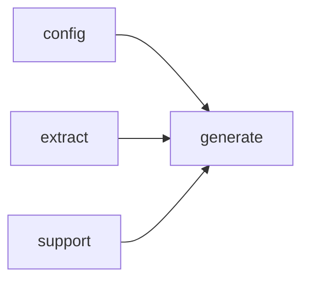

# Module `generate:planner`

## Summary

模块 `generate:planner` 负责根据提取的源代码模型和配置，构建文档生成的页面计划集。它管理页面计划的创建、枚举与排序过程：通过内部的 `PlanBuilder` 依次枚举模块页、文件页、命名空间页和索引页，使用拓扑排序确保依赖关系正确，并最终对外提供唯一的公开入口函数 `build_page_plan_set`。该模块还公开了 `PlanError` 类型，用于报告计划阶段的错误。其实现依赖于 `extract`、`config`、`generate:model` 和 `support` 模块，没有对外暴露内部构造细节。

## Imports

- [`config`](../config/index.md)
- [`extract`](../extract/index.md)
- [`generate:model`](model.md)
- `std`
- [`support`](../support/index.md)

## Imported By

- [`generate:scheduler`](scheduler.md)

## Dependency Diagram

## Types

### `clore::generate::PlanError`

Declaration: `generate/planner.cppm:11`

Definition: `generate/planner.cppm:11`

Declaration: [`Namespace clore::generate`](../../namespaces/clore/generate/index.md)

结构体 `clore::generate::PlanError` 的核心内部结构仅包含一个 `std::string` 类型的 `message` 字段，用于存储任意错误描述。该结构体完全依赖编译器生成的默认构造函数、析构函数和拷贝/移动操作，未定义任何用户提供的成员函数或特殊成员。设计上，`message` 的持有是唯一的内部不变量——该字符串在构造后应保持对计划失败原因的文本描述。由于不存在额外的逻辑或约束校验，`message` 内容完全由使用者负责，结构体本身不施加任何格式或非空要求。这一简单设计将错误信息的表示与生成、传递分离开来，使 `PlanError` 仅作为轻量的错误容器，在计划生成流程中充当诊断信息载体。

#### Invariants

- The `message` field can contain any string, including an empty string.
- The struct is trivially constructible and assignable when `std::string` is.

#### Key Members

- `message` – a `std::string` storing the error description.

#### Usage Patterns

- Returned or thrown as an error indicator from plan‑generation functions.
- May be held in a result type like `std::expected<Plan, PlanError>` to convey failure details.
- Often examined by callers to extract the error text for logging or user notification.

## Functions

### `clore::generate::build_page_plan_set`

Declaration: `generate/planner.cppm:15`

Definition: `generate/planner.cppm:369`

Declaration: [`Namespace clore::generate`](../../namespaces/clore/generate/index.md)

该函数是页面计划集构建的入口点。内部流程首先构造一个 `PlanBuilder` 实例，并根据 `model.uses_modules` 决定调用 `enumerate_module_pages` 还是 `enumerate_file_pages` 来枚举内容页面（互斥）。随后依次调用 `enumerate_namespace_pages` 和 `enumerate_index_page` 添加命名空间页面与索引页面。之后通过 `validate_no_path_conflicts` 校验路径冲突，最后使用 `topological_sort` 对页面计划进行拓扑排序以确定生成顺序，并返回包含 `plans` 与 `generation_order` 的 `PagePlanSet`。该函数依赖 `PlanBuilder` 积累页面计划，并在出现错误时通过 `PlanError` 返回预期失败。

#### Side Effects

- 通过 `logging::info` 记录页面计数信息

#### Reads From

- `config::TaskConfig` 参数 `config`
- `extract::ProjectModel` 参数 `model`
- `model.uses_modules` 标志
- `builder.plans` 内部集合（读取用于计数和调整）
- `builder.path_entries` 内部集合（读取用于验证）

#### Writes To

- 返回值 `PagePlanSet` 对象（包含 `plans` 和 `generation_order`）
- 日志输出流

#### Usage Patterns

- 作为页面生成管道的初始化步骤被调用
- 由高级生成函数 `generate_pages` 或 `generate_pages_async` 使用
- 用于将所有页面计划整合为有序集合

## Internal Structure

模块 `generate::planner` 的核心职责是通过内部匿名命名空间隐藏实现细节，对外仅暴露单个入口函数 `build_page_plan_set`。该模块依赖 `config`、`extract`、`generate::model`、`std` 和 `support` 五个模块，其中 `generate::model` 提供页面计划和符号分析的数据结构，`extract` 提供项目信息的原始提取结果。内部主要采用构造器模式：`PlanBuilder` 类持有配置 (`config`)、模型 (`model`)、计划列表 (`plans`) 和标识符到索引的映射 (`id_to_index`)，并通过 `add_plan`、`make_page_prompt`、`make_symbol_prompt` 等方法来累积和查询页面计划。多个 `enumerate_*_pages` 函数（如 `enumerate_file_pages`、`enumerate_namespace_pages`、`enumerate_module_pages`、`enumerate_index_page`）分别处理不同粒度的页面生成，而拓扑排序 (`topological_sort`) 和辅助函数（如 `namespace_of`、`is_renderable_namespace_name`、`has_reserved_identifier_prefix`）则负责确定页面的生成顺序与过滤规则。这种分层结构使得页面计划的构建过程清晰独立，同时通过匿名命名空间隔离实现细节，仅通过 `build_page_plan_set` 向调用方交付一个表示计划集句柄的整数。

## Related Pages

- [Module config](../config/index.md)
- [Module extract](../extract/index.md)
- [Module generate:model](model.md)
- [Module support](../support/index.md)

