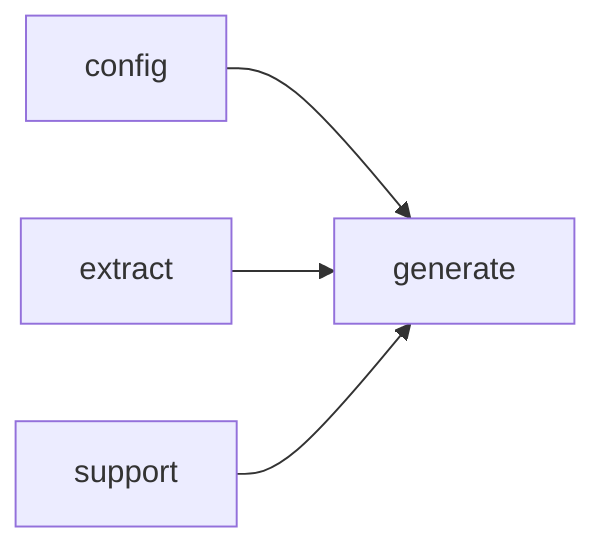

# Module `generate:planner`

## Summary

模块 `generate:planner` 负责根据提取的代码模型和配置，生成文档页面计划集（page plan set）。它公开了唯一的入口函数 `build_page_plan_set`，供生成管线初始化阶段调用，返回一个表示成功或错误的状态码。内部借助 `PlanBuilder` 类枚举模块、文件、命名空间、索引等各类页面，并执行拓扑排序以确定页面生成顺序。此外，模块定义了 `PlanError` 错误类型用于报告生成过程中的问题。该模块依赖 `extract`、`config`、`generate:model` 等基础模块。

## Imports

- [`config`](../config/index.md)
- [`extract`](../extract/index.md)
- [`generate:model`](model.md)
- `std`
- [`support`](../support/index.md)

## Imported By

- [`generate:scheduler`](scheduler.md)

## Dependency Diagram

## Types

### `clore::generate::PlanError`

Declaration: `generate/planner.cppm:11`

Definition: `generate/planner.cppm:11`

Declaration: [`Namespace clore::generate`](../../namespaces/clore/generate/index.md)

`clore::generate::PlanError` 内部仅包含一个 `std::string` 类型的成员 `message`，用于存储错误描述文本。该结构体未定义任何自定义构造函数、析构函数或赋值运算符，完全依赖编译器生成的默认实现。`message` 成员的默认构造使其初始为空字符串，结构体未施加额外的不变式约束，其行为完全由 `std::string` 的语义保证。

#### Invariants

- `message` should contain a non-empty, meaningful error description when an error occurs

#### Key Members

- `message`

#### Usage Patterns

- Returned as an error type from planning functions
- Inspected by callers to extract error details

## Functions

### `clore::generate::build_page_plan_set`

Declaration: `generate/planner.cppm:15`

Definition: `generate/planner.cppm:369`

Declaration: [`Namespace clore::generate`](../../namespaces/clore/generate/index.md)

函数 `clore::generate::build_page_plan_set` 通过一个 `PlanBuilder` 实例协调四个枚举阶段来构建完整的 `PagePlanSet`。根据 `model.uses_modules` 选择 `enumerate_module_pages` 或 `enumerate_file_pages` 生成内容页面，随后无条件调用 `enumerate_namespace_pages` 和 `enumerate_index_page` 分别生成命名空间页面和索引页面。在路径冲突检查（`validate_no_path_conflicts`）通过后，利用 `topological_sort` 对 `builder.plans` 进行拓扑排序，确保生成顺序正确。任何阶段的失败都会以 `PlanError` 形式通过 `std::expected` 向上传播。该函数依赖 `PlanBuilder` 内部的 `id_to_index` 映射、`make_page_prompt` 和 `make_symbol_prompt` 等辅助方法，以及各枚举函数和排序工具。

#### Side Effects

- Logs planner progress information via `logging::info`

#### Reads From

- `config::TaskConfig config`
- `extract::ProjectModel model`
- `PlanBuilder::plans`
- `PlanBuilder::path_entries`

#### Writes To

- `builder.plans` vector
- `builder.id_to_index` map
- Returned `PagePlanSet` object

#### Usage Patterns

- Called by page generation entry points
- Used to create page plan before rendering
- Part of documentation generation pipeline

## Internal Structure

该模块将页面计划生成分解为一系列专门的枚举函数（`enumerate_module_pages`、`enumerate_index_page`、`enumerate_file_pages`、`enumerate_namespace_pages`），这些函数均通过匿名命名空间内的局部结构 `PlanBuilder` 统一协调。`PlanBuilder` 持有来自 `config`、`extract` 和 `generate:model` 的上下文（配置、原始模型数据、已提取的符号），并聚合所有计划条目及标识符到索引的映射。每个枚举函数仅负责将自己关心的页面类型转换为计划，最终由顶层的 `build_page_plan_set` 公共入口点调用它们，并利用 `topological_sort` 对计划进行拓扑排序，确保依赖顺序正确。

内部实现严格遵循分层封装：辅助函数（如 `namespace_of`、`is_renderable_namespace_name`、`has_reserved_identifier_prefix`）被限定在匿名命名空间内，不对外暴露。模块仅通过 `clore::generate::build_page_plan_set` 和 `PlanError` 与外部交互，并依赖 `support` 和 `std` 提供日志、文本处理及数据结构支持。这种设计使得页面类型的添加或排序逻辑的调整被限制在模块内部，外部只需关心计划集的构建结果。

## Related Pages

- [Module config](../config/index.md)
- [Module extract](../extract/index.md)
- [Module generate:model](model.md)
- [Module support](../support/index.md)

