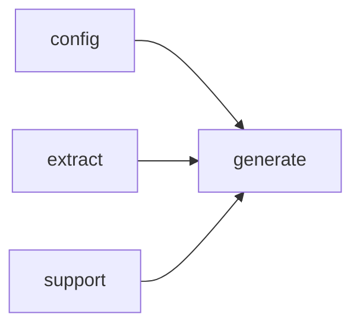

# Module `generate:planner`

## Summary

该模块负责将代码提取分析结果（来自 `extract` 模块）转换为文档生成的页面计划集。它使用 `PlanBuilder` 内部结构遍历模块、命名空间、文件、索引等实体，通过拓扑排序确定页面生成的顺序，并为每个页面生成对应的提示（prompt）元数据。同时处理路径解析、页面标识符映射以及依赖关系，确保页面计划能够正确地驱动后续的页面生成与链接解析步骤。

公开实现范围由函数 `clore::generate::build_page_plan_set` 和错误类型 `clore::generate::PlanError` 组成。`build_page_plan_set` 接受两个整数标识符（通常代表页面或符号的上下文），返回一个不透明的整数句柄，该句柄封装了由这两个输入确定的页面计划集，供下游管线使用。`PlanError` 则用于报告页面构建过程中出现的错误信息。

## Imports

- [`config`](../config/index.md)
- [`extract`](../extract/index.md)
- [`generate:model`](model.md)
- [`support`](../support/index.md)

## Imported By

- [`generate:scheduler`](scheduler.md)

## Dependency Diagram

```mermaid
graph LR
    M0["generate"]
    I0["config"]
    I0 --> M0
    I1["extract"]
    I1 --> M0
    I2["support"]
    I2 --> M0
```

## Types

### `clore::generate::PlanError`

Declaration: `src/generate/planner.cppm:28`

Definition: `src/generate/planner.cppm:28`

Declaration: [`Namespace clore::generate`](../../namespaces/clore/generate/index.md)

结构体 `clore::generate::PlanError` 内部仅包含一个 `std::string` 类型的成员 `message`，用于存储描述计划错误的文本。该结构体没有用户声明的构造函数、析构函数或赋值运算符，因此依赖编译器生成的默认特殊成员函数，并支持聚合初始化。不变性在于 `message` 始终包含一个有效的字符串（可能为空），用于传递错误信息，而无需额外的错误码或状态标记。作为实现细节，它被设计为简单的错误携带体，由调用方通过直接设置 `message` 来记录错误原因。

#### Invariants

- `message` 成员始终包含有效的字符串内容（可空）。

#### Key Members

- `std::string message`：错误描述信息。

#### Usage Patterns

- 可能由 `clore::generate` 命名空间中的其他函数作为错误结果返回或设置。
- 在需要报告计划阶段错误时作为错误类型使用。

## Functions

### `clore::generate::build_page_plan_set`

Declaration: `src/generate/planner.cppm:32`

Definition: `src/generate/planner.cppm:386`

Declaration: [`Namespace clore::generate`](../../namespaces/clore/generate/index.md)

`clore::generate::build_page_plan_set` 是生成页面计划集的核心编排函数。它接收 `config::TaskConfig` 和 `extract::ProjectModel`，通过 `PlanBuilder` 内部状态逐步组装页面计划：首先根据 `model.uses_modules` 选择调用 `enumerate_module_pages` 或 `enumerate_file_pages` 来生成主体内容页；接着添加命名空间页（`enumerate_namespace_pages`）和索引页（`enumerate_index_page`）。整个过程通过 `PlanBuilder::add_plan` 将计划存入 `plans` 列表，并同时更新 `path_entries` 用于后续验证。如果任一枚举步骤失败，函数立即返回 `std::unexpected<PlanError>`。

在所有页面枚举完成后，函数依次执行路径冲突检查（依赖 `validate_no_path_conflicts` 检测 `path_entries` 中的重复项）和拓扑排序（依赖 `topological_sort` 基于 `id_to_index` 和页面间的反向边 `reverse_edges` 计算生成顺序 `order`）。最终将移动后的 `plans` 和排序结果 `generation_order` 封装为 `PagePlanSet` 返回。错误传播统一使用 `PlanError` 结构体，其 `message` 字段携带描述信息。

#### Side Effects

- logs informational messages
- mutates internal `PlanBuilder` state
- returns a `std::expected` that either contains a `PagePlanSet` or an error

#### Reads From

- `config::TaskConfig& config`
- `extract::ProjectModel& model`
- `model.uses_modules`
- `builder.plans`
- `builder.id_to_index`
- `builder.path_entries`

#### Writes To

- `builder.plans`
- `builder.path_entries`
- the returned `PagePlanSet` (via move)
- log output

#### Usage Patterns

- Called during documentation generation pipeline
- Used to plan generation order
- Called before page generation begins

## Internal Structure

模块 `generate:planner` 是生成管线中的规划阶段，负责将代码提取结果（来自 `extract` 模块）与模型配置（来自 `generate:model`）转化为有序的页面计划。它导入了 `config`、`extract`、`generate:model` 和 `support` 四个模块，其中 `config` 提供生成配置，`generate:model` 定义页面计划核心数据结构，`support` 提供通用工具，`extract` 提供已提取的代码信息。模块内部采用匿名命名空间分解实现细节：核心构建器 `PlanBuilder` 封装了 `model`、`config`、`id_to_index` 映射及计划列表，并提供 `add_plan`、`make_page_prompt` 和 `make_symbol_prompt` 等方法；多个 `enumerate_*_pages` 函数（如 `enumerate_namespace_pages`、`enumerate_file_pages`、`enumerate_module_pages` 和 `enumerate_index_page`）分别处理不同范围的页面生成；`topological_sort` 基于图的拓扑顺序（`in_degree`、`reverse_edges` 等）对计划进行排序。公开入口 `build_page_plan_set` 接受两个整数标识符，返回一个 `int` 句柄，该句柄封装了由这两个标识符确定的页面计划集，供下游生成与链接使用。模块还定义了 `PlanError` 结构体用于返回错误信息，整个实现遵循将规划逻辑与模型数据分离、通过值句柄传递计划集的设计。

## Related Pages

- [Module config](../config/index.md)
- [Module extract](../extract/index.md)
- [Module generate:model](model.md)
- [Module support](../support/index.md)

