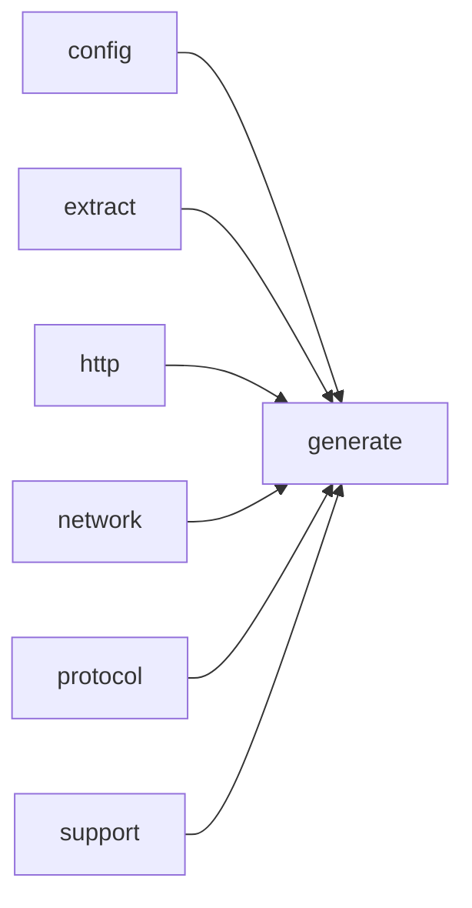

# Module `generate:scheduler`

## Summary

`generate:scheduler` 模块是整个文档生成管线的编排核心。它负责将代码分析、LLM 请求、页面渲染等步骤集成为一个可扩展的异步工作流，涵盖任务调度、依赖跟踪、缓存命中/缺失处理、失败重试与限流，并支持干运行模式。模块通过 `PageGenerationScheduler` 类对外暴露主要控制接口，内部则使用 `WorkQueue`、`DependencyTracker`、`PageRenderer` 等组件管理并发任务和状态演化，确保页面按计划顺序完成并输出最终文档。

## Imports

- [`config`](../config/index.md)
- [`extract`](../extract/index.md)
- [`generate:analysis`](analysis.md)
- [`generate:cache`](cache.md)
- [`generate:diagram`](diagram.md)
- [`generate:dryrun`](dryrun.md)
- [`generate:evidence`](evidence.md)
- [`generate:markdown`](markdown.md)
- [`generate:model`](model.md)
- [`generate:page`](page.md)
- [`generate:planner`](planner.md)
- [`generate:symbol`](symbol.md)
- [`http`](../http/index.md)
- [`network`](../network/index.md)
- [`protocol`](../protocol/index.md)
- `std`
- [`support`](../support/index.md)

## Dependency Diagram

## Internal Structure

`generate:scheduler` 模块是文档生成管线的核心调度与编排层，负责统筹符号分析、页面提示生成、缓存、渲染等阶段的有序执行。它从 `generate:planner`、`generate:model`、`generate:cache` 等上游模块导入页面计划、模型定义与缓存设施，并依赖 `generate:analysis`、`generate:markdown`、`generate:evidence` 等模块实现分析结果的应用与页面构建。模块内部按职责分解为多个匿名命名空间中的实体：`WorkQueue` 管理并发任务的分发与速率控制；`DependencyTracker` 追踪页面间依赖关系，维护每个页面的符号分析、提示提交与写入状态；`PageGenerationScheduler` 是顶层调度器，持有配置、模型实例、渲染器以及统计计数器，驱动 `worker_task` 循环处理工作项，并通过 `run_queued_worker_call` 等模板方法统一处理 LLM 请求的异步结果与缓存命中。`PageRenderer` 封装了实际的文件输出与干运行模式。整个模块通过 `PreparedGenerationContext` 等结构传递已解析的页面计划与提示请求，形成层次清晰的状态管理与任务调度体系。

## Related Pages

- [Module config](../config/index.md)
- [Module extract](../extract/index.md)
- [Module generate:analysis](analysis.md)
- [Module generate:cache](cache.md)
- [Module generate:diagram](diagram.md)
- [Module generate:dryrun](dryrun.md)
- [Module generate:evidence](evidence.md)
- [Module generate:markdown](markdown.md)
- [Module generate:model](model.md)
- [Module generate:page](page.md)
- [Module generate:planner](planner.md)
- [Module generate:symbol](symbol.md)
- [Module http](../http/index.md)
- [Module network](../network/index.md)
- [Module protocol](../protocol/index.md)
- [Module support](../support/index.md)

