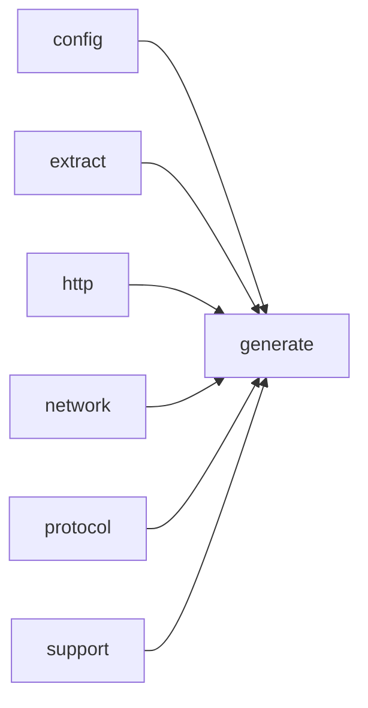

# Module `generate:scheduler`

## Summary

`generate:scheduler` 模块是文档生成管线的核心编排器，负责将预先分析的符号与页面计划转化为实际的 LLM 请求、缓存查找和页面渲染任务。它管理一个异步工作队列，通过依赖跟踪器协调符号分析、页面提示生成与页面输出的顺序，确保在满足所有依赖（例如符号分析完成）后才提交页面提示任务，并在适当时候触发最终页面渲染。模块还负责LLM请求的并发控制、缓存命中/未命中统计、连续失败监控与重试限制，以及生成本地目录索引页面。

该模块对外暴露的核心实现包括：`PageGenerationScheduler` 类（构造、`run`、`run_page_prompt_task`、`run_symbol_analysis_task`、`submit_after_symbol_analysis`、`finish_page_prompt_work`、`render_ready_page` 等）、`WorkQueue` 和 `DependencyTracker` 类、`PageRenderer` 类，以及 `prepare_generation_context`、`render_generated_pages`、`build_directory_index_pages`、`build_evidence_for_request` 等自由函数。它通过 `config`、`model`、`generate:analysis`、`generate:cache`、`generate:page` 等子模块协同完成文档生成的全部调度工作。

## Imports

- [`config`](../config/index.md)
- [`extract`](../extract/index.md)
- [`generate:analysis`](analysis.md)
- [`generate:cache`](cache.md)
- [`generate:diagram`](diagram.md)
- [`generate:dryrun`](dryrun.md)
- [`generate:evidence`](evidence.md)
- [`generate:markdown`](markdown.md)
- [`generate:model`](model.md)
- [`generate:page`](page.md)
- [`generate:planner`](planner.md)
- [`generate:symbol`](symbol.md)
- [`http`](../http/index.md)
- [`network`](../network/index.md)
- [`protocol`](../protocol/index.md)
- `std`
- [`support`](../support/index.md)

## Dependency Diagram

## Internal Structure

`generate::scheduler` 是文档生成管线的核心调度模块，负责编排从符号分析、页面生成、LLM 请求到最终渲染的完整工作流。模块内部采用分层结构：`PageGenerationScheduler` 作为顶层协调器，依赖 `WorkQueue`（管理任务队列与并行度）、`DependencyTracker`（追踪页面与符号分析的依赖关系）以及 `PageRenderer`（负责最终的页面输出与汇总）。辅助类型如 `PreparedPrompt`、`PageState` 和 `SymbolAnalysisWork` 封装了各阶段的状态与数据，通过 `WorkerActivity` 实现对事件循环的集成。模块广泛导入 `generate:analysis`、`generate:cache`、`generate:model`、`generate:page` 等子模块，并依赖 `network` 与 `protocol` 完成异步 LLM 请求，从而实现高内聚、低耦合的调度逻辑。

## Related Pages

- [Module config](../config/index.md)
- [Module extract](../extract/index.md)
- [Module generate:analysis](analysis.md)
- [Module generate:cache](cache.md)
- [Module generate:diagram](diagram.md)
- [Module generate:dryrun](dryrun.md)
- [Module generate:evidence](evidence.md)
- [Module generate:markdown](markdown.md)
- [Module generate:model](model.md)
- [Module generate:page](page.md)
- [Module generate:planner](planner.md)
- [Module generate:symbol](symbol.md)
- [Module http](../http/index.md)
- [Module network](../network/index.md)
- [Module protocol](../protocol/index.md)
- [Module support](../support/index.md)

