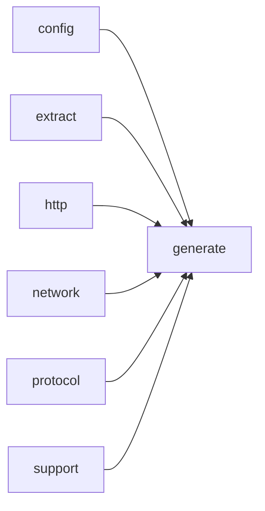

# Module `generate:scheduler`

## Summary

该模块是文档生成管线的核心调度层，负责编排从代码分析输出到最终文档页面的完整异步工作流。它定义并实现了 `PageGenerationScheduler`、`DependencyTracker`、`WorkQueue`、`PageRenderer` 等关键组件，并对外提供 `prepare_generation_context`、`render_generated_pages`、`build_directory_index_pages` 等入口函数。调度器管理符号分析与页面提示的依赖关系、追踪各阶段进度（包括缓存命中、LLM 请求发出与完成、页面写入状态），并通过工作队列与事件循环驱动并发任务执行，确保页面生成按拓扑顺序推进。

在公共实现范围内，模块拥有生成上下文的准备与解构、符号分析的提交与调度、页面提示的发起与结果回写、缓存的检查与记录、失败重试与限流控制、干运行（dry‑run）支持，以及目录索引页的构建等职责。它借助 `config`、`extract`、`generate:planner`、`generate:cache`、`generate:model` 等依赖模块提供的分析、规划与缓存能力，将页面计划转化为可执行的工作单元，最终由 `PageRenderer` 完成 Markdown 页面的渲染与写入。

## Imports

- [`config`](../config/index.md)
- [`extract`](../extract/index.md)
- [`generate:analysis`](analysis.md)
- [`generate:cache`](cache.md)
- [`generate:diagram`](diagram.md)
- [`generate:dryrun`](dryrun.md)
- [`generate:evidence`](evidence.md)
- [`generate:markdown`](markdown.md)
- [`generate:model`](model.md)
- [`generate:page`](page.md)
- [`generate:planner`](planner.md)
- [`generate:symbol`](symbol.md)
- [`http`](../http/index.md)
- [`network`](../network/index.md)
- [`protocol`](../protocol/index.md)
- [`support`](../support/index.md)

## Dependency Diagram

```mermaid
graph LR
    M0["generate"]
    I0["config"]
    I0 --> M0
    I1["extract"]
    I1 --> M0
    I2["http"]
    I2 --> M0
    I3["network"]
    I3 --> M0
    I4["protocol"]
    I4 --> M0
    I5["support"]
    I5 --> M0
```

## Internal Structure

`generate:scheduler` 模块是文档生成管线的核心调度与执行引擎，通过协调多个内部组件实现页面生成的全生命周期管理。它大量导入了 `config`、`extract`、`generate:model`、`generate:planner`、`generate:page` 等周边模块，依赖这些模块提供的配置、代码提取结果、数据结构定义以及页面模板来驱动工作流。模块内部采用分层设计：顶层是 `PageGenerationScheduler` 类，它持有私有成员 `WorkQueue`（任务队列）、`DependencyTracker`（依赖跟踪）、`PageRenderer`（输出渲染）以及分析缓存、计数器等状态，并通过 `WorkerActivity` 的 RAII 机制在事件循环中调度异步工作线程。匿名命名空间中的辅助结构体（如 `PreparedPrompt`、`PreparedGenerationContext`、`SymbolAnalysisWork`）封装了生成过程中所需的数据集和中间状态，确保各组件之间以清晰的数据结构传递信息。模块暴露给外部的函数（如 `render_generated_pages`、`prepare_generation_context`）作为入口点，内部则通过 `run`、`worker_task` 等私有方法循环从队列中取出工作项，经过符号分析、提示请求、缓存命中判断、页面渲染等多个阶段，最终生成文档输出。这种分解使得调度逻辑、依赖控制和页面构建职责分离，便于维护和扩展。

## Related Pages

- [Module config](../config/index.md)
- [Module extract](../extract/index.md)
- [Module generate:analysis](analysis.md)
- [Module generate:cache](cache.md)
- [Module generate:diagram](diagram.md)
- [Module generate:dryrun](dryrun.md)
- [Module generate:evidence](evidence.md)
- [Module generate:markdown](markdown.md)
- [Module generate:model](model.md)
- [Module generate:page](page.md)
- [Module generate:planner](planner.md)
- [Module generate:symbol](symbol.md)
- [Module http](../http/index.md)
- [Module network](../network/index.md)
- [Module protocol](../protocol/index.md)
- [Module support](../support/index.md)

