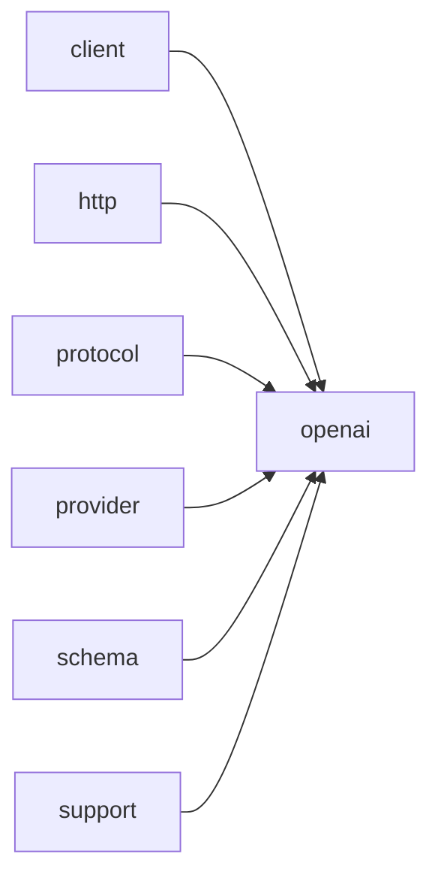

# Module `openai`

## Summary

模块 `openai` 实现了与 `OpenAI` 兼容的 LLM API 交互的完整协议，涵盖请求构建、响应解析、工具调用序列化、结构化输出支持及环境配置管理等核心能力。其公开接口包括三个顶层异步调用函数 `call_completion_async`、`call_llm_async` 和 `call_structured_async`，以及协议层的 `protocol::build_request_json` 和 `protocol::parse_response` 等函数。内部通过 `detail::Protocol` 结构体封装 API 密钥读取、URL 拼接和请求头生成，并由 `protocol::detail` 子命名空间提供 `serialize_message`、`serialize_tool_choice`、`serialize_tool_definition`、`parse_content_parts` 和 `parse_tool_calls` 等具体的序列化与解析工具，以及 `validate_request` 进行请求合规性检查。该模块还声明了 `clore::net::protocol` 命名空间下的若干独立函数，作为协议层的基础设施。

## Imports

- [`client`](../client/index.md)
- [`http`](../http/index.md)
- [`protocol`](../protocol/index.md)
- [`provider`](../provider/index.md)
- [`schema`](../schema/index.md)
- `std`
- [`support`](../support/index.md)

## Dependency Diagram



## Types

### `clore::net::openai::detail::Protocol`

Declaration: `network/openai.cppm:692`

Definition: `network/openai.cppm:692`

Declaration: [`Namespace clore::net::openai::detail`](../../namespaces/clore/net/openai/detail/index.md)

该结构体作为 `OpenAI` API 的协议策略实现，通过一系列静态方法封装了与 `https://api.openai.com` 交互的特定细节。`read_environment` 使用硬编码的环境变量名 `OPENAI_BASE_URL` 和 `OPENAI_API_KEY` 读取凭证，返回 `clore::net::detail::EnvironmentConfig`。`build_url` 在 API 基址后附加路径 `chat/completions`；`build_headers` 构造包含 `Content-Type: application/json` 和 `Bearer {api_key}` 的请求头。`build_request_json` 和 `parse_response` 分别委托给 `clore::net::protocol` 命名空间中的通用实现，其中 `parse_response` 额外检查响应体是否为空以及 HTTP 状态码是否大于等于 400，并构造对应的 `LLMError`。`provider_name` 返回固定字符串 `"LLM"`。由于所有成员均为静态且无状态，该结构体不维护任何运行时不变量，纯粹作为逻辑分组使用。

#### Invariants

- No mutable state
- All methods are static
- Configuration is read from environment variables
- Return types use `std::expected` for error handling

#### Key Members

- static `read_environment`
- static `build_url`
- static `build_headers`
- static `build_request_json`
- static `parse_response`
- static `provider_name`

#### Usage Patterns

- Called by higher-level `OpenAI` API functions to prepare requests and handle responses
- Used to encapsulate API-specific details like endpoint path and header format
- Provides a common interface for different LLM providers

#### Member Functions

##### `clore::net::openai::detail::Protocol::build_headers`

Declaration: `network/openai.cppm:705`

Definition: `network/openai.cppm:705`

Declaration: [`Namespace clore::net::openai::detail`](../../namespaces/clore/net/openai/detail/index.md)

###### Implementation

```cpp
static auto build_headers(const clore::net::detail::EnvironmentConfig& environment)
        -> std::vector<kota::http::header> {
        return std::vector<kota::http::header>{
            kota::http::header{
                               .name = "Content-Type",
                               .value = "application/json; charset=utf-8",
                               },
            kota::http::header{
                               .name = "Authorization",
                               .value = std::format("Bearer {}", environment.api_key),
                               },
        };
    }
```

##### `clore::net::openai::detail::Protocol::build_request_json`

Declaration: `network/openai.cppm:719`

Definition: `network/openai.cppm:719`

Declaration: [`Namespace clore::net::openai::detail`](../../namespaces/clore/net/openai/detail/index.md)

###### Implementation

```cpp
static auto build_request_json(const CompletionRequest& request)
        -> std::expected<std::string, LLMError> {
        return clore::net::protocol::build_request_json(request);
    }
```

##### `clore::net::openai::detail::Protocol::build_url`

Declaration: `network/openai.cppm:701`

Definition: `network/openai.cppm:701`

Declaration: [`Namespace clore::net::openai::detail`](../../namespaces/clore/net/openai/detail/index.md)

###### Implementation

```cpp
static auto build_url(const clore::net::detail::EnvironmentConfig& environment) -> std::string {
        return clore::net::detail::append_url_path(environment.api_base, "chat/completions");
    }
```

##### `clore::net::openai::detail::Protocol::parse_response`

Declaration: `network/openai.cppm:724`

Definition: `network/openai.cppm:724`

Declaration: [`Namespace clore::net::openai::detail`](../../namespaces/clore/net/openai/detail/index.md)

###### Implementation

```cpp
static auto parse_response(const clore::net::detail::RawHttpResponse& raw_response)
        -> std::expected<CompletionResponse, LLMError> {
        if(raw_response.body.empty()) {
            return std::unexpected(LLMError("empty response from LLM"));
        }
        if(raw_response.http_status >= 400) {
            return std::unexpected(
                LLMError(std::format("LLM request failed with HTTP {}: {}",
                                     raw_response.http_status,
                                     clore::net::detail::excerpt_for_error(raw_response.body))));
        }

        return clore::net::protocol::parse_response(raw_response.body);
    }
```

##### `clore::net::openai::detail::Protocol::provider_name`

Declaration: `network/openai.cppm:739`

Definition: `network/openai.cppm:739`

Declaration: [`Namespace clore::net::openai::detail`](../../namespaces/clore/net/openai/detail/index.md)

###### Implementation

```cpp
static auto provider_name() -> std::string_view {
        return "LLM";
    }
```

##### `clore::net::openai::detail::Protocol::read_environment`

Declaration: `network/openai.cppm:693`

Definition: `network/openai.cppm:693`

Declaration: [`Namespace clore::net::openai::detail`](../../namespaces/clore/net/openai/detail/index.md)

###### Implementation

```cpp
static auto read_environment()
        -> std::expected<clore::net::detail::EnvironmentConfig, LLMError> {
        return clore::net::detail::read_credentials(clore::net::detail::CredentialEnv{
            .base_url_env = "OPENAI_BASE_URL",
            .api_key_env = "OPENAI_API_KEY",
        });
    }
```

## Functions

### `clore::net::openai::call_completion_async`

Declaration: `network/openai.cppm:748`

Definition: `network/openai.cppm:775`

Declaration: [`Namespace clore::net::openai`](../../namespaces/clore/net/openai/index.md)

`clore::net::openai::call_completion_async` 的实现是一个轻量包装，它将传入的 `CompletionRequest` 和 `kota::event_loop` 直接转发给 `clore::net::call_completion_async<clore::net::openai::detail::Protocol>`。该泛型调用函数负责处理完整的异步工作流，其返回的协程结果通过 `or_fail()` 转换为 `kota::task<CompletionResponse, LLMError>`。

内部的控制流程由泛型函数调度，它依赖 `clore::net::openai::detail::Protocol` 结构体提供 `OpenAI` API 特定的行为。该协议类实现了 `build_url`、`build_request_json`、`build_headers`、`parse_response`、`read_environment` 和 `provider_name` 等挂接方法，分别用于构造请求 URL、序列化请求体的 JSON、设置 HTTP 头部、解析响应、读取环境配置以及返回提供商字符串。底层的 HTTP 调用与 JSON 序列化/反序列化（通过 `clore::net::openai::protocol::detail` 命名空间下的工具函数，如 `serialize_message`、`serialize_tool_choice`、`parse_tool_calls`、`parse_content_parts` 等）共同构成了完整的请求-响应循环。

#### Side Effects

No observable side effects are evident from the extracted code.

#### Reads From

- `request` (by move)
- `loop` reference
- `detail::Protocol`

#### Usage Patterns

- called to initiate an async completion request to `OpenAI`
- used with an event loop for lightweight concurrency

### `clore::net::openai::call_llm_async`

Declaration: `network/openai.cppm:752`

Definition: `network/openai.cppm:782`

Declaration: [`Namespace clore::net::openai`](../../namespaces/clore/net/openai/index.md)

该函数是 `clore::net::openai::call_llm_async` 的协程包装器，接收模型标识符、系统提示、`PromptRequest` 对象以及 `kota::event_loop` 引用。其核心实现直接委托给泛型模板 `clore::net::call_llm_async<clore::net::openai::detail::Protocol>`，并调用 `.or_fail()` 将 `kota::task` 的失败结果转换为异常抛出（或按框架约定处理）。这种设计将 `OpenAI` 特定的协议细节（如 URL 构建、请求序列化、响应解析）封装在 `detail::Protocol` 特质中，使顶层调用逻辑与具体的 LLM 提供商解耦；控制流仅涉及协程挂起与恢复，依赖的底层组件包括 `clore::net::protocol::build_request_json`、`detail::Protocol::parse_response` 以及 `call_completion_async` 等函数，但本函数本身不直接操作这些细节。

#### Side Effects

- Initiates an asynchronous LLM completion request via the network.
- Moves the `request` object, transferring ownership.
- Potentially modifies internal state in the event loop.

#### Reads From

- `model` parameter
- `system_prompt` parameter
- `request` parameter
- `loop` parameter
- `detail::Protocol` type

#### Writes To

- Coroutine return value (a `kota::task`)
- Potentially network buffers and I/O state

#### Usage Patterns

- Called by higher-level `OpenAI` API functions
- Used to perform LLM calls asynchronously in an event-driven context

### `clore::net::openai::call_llm_async`

Declaration: `network/openai.cppm:758`

Definition: `network/openai.cppm:793`

Declaration: [`Namespace clore::net::openai`](../../namespaces/clore/net/openai/index.md)

该函数充当 `clore::net::openai` 命名空间的便捷包装器，将调用直接转发给模板化的 `clore::net::call_llm_async`，并明确绑定协议实现为 `clore::net::openai::detail::Protocol`。它接收 `model`、`system_prompt` 和 `prompt` 三个字符串视图，以及一个 `kota::event_loop` 引用，然后通过 `co_await` 等待模板调用返回的 `kota::task<std::string, LLMError>`，并立即调用其 `.or_fail()` 方法，将潜在的 `kota::result` 错误转化为异常或终止流程。

算法上，该函数不直接参与 JSON 构造、HTTP 请求或响应解析；这些细节完全由 `detail::Protocol` 中的 `build_request_json`、`build_url`、`build_headers`、`read_environment`、`parse_response` 等成员方法处理。依赖关系集中于 `clore::net::openai::detail::Protocol` 这一协议层，而本函数仅作为协程入口点，确保调用者获得一个类型安全的字符串结果或失败传播。

#### Side Effects

- 发起网络 I/O 请求
- 分配协程状态和任务对象

#### Reads From

- `model`
- `system_prompt`
- `prompt`
- `loop`

#### Usage Patterns

- 使用异步协程进行 LLM 调用
- 与 `kota::event_loop` 集成

### `clore::net::openai::call_structured_async`

Declaration: `network/openai.cppm:765`

Definition: `network/openai.cppm:805`

Declaration: [`Namespace clore::net::openai`](../../namespaces/clore/net/openai/index.md)

该函数是 `clore::net::openai` 命名空间中针对 `OpenAI` 协议的协程入口，它接收 `model`、`system_prompt`、`prompt` 和一个 `kota::event_loop`，并将这些参数直接转发给通用的 `clore::net::call_structured_async<detail::Protocol, T>`。内部实现使用 `co_return co_await` 等待该通用函数的结果，并通过 `.or_fail()` 将错误转换为 `LLMError` 类型。通用函数负责实际的 HTTP 通信流程：它利用 `detail::Protocol` 提供的 `build_url`、`build_headers`、`build_request_json` 方法构造请求，调用 `clore::net::openai::call_llm_async` 发送并接收原始响应，再通过 `detail::Protocol::parse_response` 解析 JSON 响应，提取并验证工具调用与结构化内容（如通过 `parse_tool_calls` 和 `parse_content_parts`），最终反序列化为模板参数 `T`。整个流程在 `kota::event_loop` 的异步上下文中执行，并依赖 `clore::net::protocol::build_request_json` 和 `clore::net::protocol::parse_response` 等底层函数处理 JSON 的序列化与解析。

#### Side Effects

- 发起网络 I/O 请求
- 可能修改传入的 `kota::event_loop` 状态
- 通过协程机制实现异步控制流

#### Reads From

- `model`
- `system_prompt`
- `prompt`
- `loop`

#### Writes To

- 返回的 `kota::task<T, LLMError>` 对象

#### Usage Patterns

- 用于需要结构化响应的 `OpenAI` LLM 调用
- 与事件循环配合使用以支持异步等待

### `clore::net::openai::protocol::detail::parse_content_parts`

Declaration: `network/openai.cppm:288`

Definition: `network/openai.cppm:288`

Declaration: [`Namespace clore::net::openai::protocol::detail`](../../namespaces/clore/net/openai/protocol/detail/index.md)

该函数遍历 `clore::net::openai::protocol::detail::parse_content_parts` 接收的 `json::Array` 中的每个元素，首先将每个元素通过 `clore::net::detail::expect_object` 解析为一个 JSON 对象。接着从对象中获取 `"type"` 字段（若不存在则默认为 `"text"`）并经由 `clore::net::detail::expect_string` 验证其类型。根据类型值分流：若为 `"refusal"`，则提取对象的 `"refusal"` 字段字符串并累加到本地 `refusal` 变量，设置 `saw_refusal` 标记；若为 `"text"` 或 `"output_text"`，则尝试获取 `"text"` 字段：该字段可能直接是一个字符串（通过 `get_string` 直接获取），也可能是一个包含 `"value"` 子字段的对象，此时需递归使用 `clore::net::detail::expect_object` 和 `expect_string` 提取 `"value"` 字符串，最后将得到的文本累加到本地 `text` 变量并设置 `saw_text` 标记。对于其他类型（如 `"image_url"`）则直接跳过。任何字段缺失或类型不匹配都会导致立即返回 `std::unexpected` 错误。循环结束后，根据 `saw_text` 和 `saw_refusal` 标记决定是否将累积的字符串移动到输出结构 `AssistantOutput` 的对应成员中，最终返回该结构。该函数完全依赖 `clore::net::detail` 命名空间下的类型安全 JSON 提取工具进行错误处理，并假定输入数组是合法的 `OpenAI` 消息内容部分格式。

#### Side Effects

No observable side effects are evident from the extracted code.

#### Reads From

- const `json::Array`& parts
- JSON value fields: "type", "refusal", "text", "value"

#### Writes To

- returned `AssistantOutput` object

#### Usage Patterns

- Called when parsing chat completion response content from `OpenAI` API

### `clore::net::openai::protocol::detail::parse_tool_calls`

Declaration: `network/openai.cppm:369`

Definition: `network/openai.cppm:369`

Declaration: [`Namespace clore::net::openai::protocol::detail`](../../namespaces/clore/net/openai/protocol/detail/index.md)

该函数遍历 `calls` 数组中的每个 JSON 值，将其解析为 `ToolCall` 对象。对于每个元素，先通过 `clore::net::detail::expect_object` 提取工具调用对象，然后依次提取 `id`、`type`、`function`（包括 `name` 和 `arguments`）字段，每个字段都调用 `clore::net::detail::expect_string` 进行类型检查。`id` 被收集到 `ids` 集合中以检测重复；`type` 必须等于 `"function"`，否则返回 `LLMError`。`arguments` 字段是 JSON 字符串，通过 `json::parse` 解析为 `json::Value` 对象。所有字段验证通过后，将 `id`、`name`、原始 `arguments_json` 及其解析结果 `arguments` 组合为 `ToolCall` 并加入返回向量。任何字段缺失、类型错误、重复 id 或 JSON 解析失败都会立即以 `std::unexpected` 返回错误。最后返回整个 `parsed_calls` 向量。

#### Side Effects

No observable side effects are evident from the extracted code.

#### Reads From

- `const json::Array& calls`
- nested JSON objects and string values within each array element

#### Writes To

- returned `std::vector<ToolCall>` (constructed locally, moved out)

#### Usage Patterns

- called to parse `tool_calls` from an `OpenAI` API response
- used in response deserialization pipeline

### `clore::net::openai::protocol::detail::serialize_message`

Declaration: `network/openai.cppm:27`

Definition: `network/openai.cppm:27`

Declaration: [`Namespace clore::net::openai::protocol::detail`](../../namespaces/clore/net/openai/protocol/detail/index.md)

该函数通过 `std::visit` 模式匹配实现了对 `Message` 变体的序列化。它首先调用 `clore::net::detail::make_empty_object` 创建一个初始的 JSON 对象，接着在访问器中根据消息的具体类型填充 `role` 字段，并利用 `clore::net::detail::normalize_utf8` 和 `clore::net::detail::insert_string_field` 处理 `content` 字符串。对于 `AssistantToolCallMessage`，该函数会遍历其中的 `tool_calls` 列表，为每个调用创建嵌套的 JSON 对象，依次插入 `id`、`type`（固定为 `"function"`）以及由 `function` 子对象包含的 `name` 和 `arguments_json`（同样经过规范化处理）。最后将构建完成的 JSON 对象推入传入的 `out` 数组。整个流程依赖 `clore::net::detail` 命名空间下的辅助函数来管理内存分配和错误传播，所有错误路径均通过返回 `std::unexpected` 提前退出。

#### Side Effects

- 修改输出参数 `out` 数组的内容
- 动态分配 JSON 对象、数组及字符串的内存
- 调用 `normalize_utf8` 和 `insert_string_field` 等辅助函数可能分配或转换字符串

#### Reads From

- 参数 `message` 的变体内容（包括 `content`, `tool_call_id`, `tool_calls` 及其子字段）

#### Writes To

- 输出参数 `out` 数组（通过 `push_back` 追加 JSON 对象）
- 函数返回值中的错误状态（通过 `std::expected`）

#### Usage Patterns

- 作为 `OpenAI` 协议消息序列化的一部分，用于将消息列表转换为 JSON 请求体

### `clore::net::openai::protocol::detail::serialize_response_format`

Declaration: `network/openai.cppm:209`

Definition: `network/openai.cppm:209`

Declaration: [`Namespace clore::net::openai::protocol::detail`](../../namespaces/clore/net/openai/protocol/detail/index.md)

该函数首先调用 `clore::net::detail::make_empty_object` 创建两个临时的 JSON 对象 —— `object` 与 `schema_object`，每一步都会检查返回值，若任一创建失败则立即传播错误。接着根据 `format.schema` 是否为空选择分支：若无 schema，则直接将 `"json_object"` 写入 `object` 的 `type` 字段；若有 schema，则设置 `type` 为 `"json_schema"`，并通过 `clore::net::detail::insert_string_field` 写入 `name`、直接设置 `strict` 布尔值，再调用 `clore::net::detail::clone_object` 复制原始 schema 后嵌套为子对象。最后将组装好的 `object` 作为 `"response_format"` 的值插入到 `root` 中，成功时返回空 `expected`。所有 JSON 操作均使用 `json::Object` 的插入方法，错误处理依赖 `std::expected` 链。

#### Side Effects

- Mutates root JSON object by inserting `response_format` key
- Allocates temporary JSON objects for response format and schema sub-objects
- May log errors via helper functions if allocation fails

#### Reads From

- format parameter: format`.schema` (`has_value`, and clone of its content), format`.name`, format`.strict`

#### Writes To

- root JSON object: inserts `response_format` key with the constructed JSON value
- Temporary JSON objects for response format and schema that are moved into root

#### Usage Patterns

- Called during serialization of `OpenAI` API request body
- Used to set the response format for chat completions requests

### `clore::net::openai::protocol::detail::serialize_tool_choice`

Declaration: `network/openai.cppm:167`

Definition: `network/openai.cppm:167`

Declaration: [`Namespace clore::net::openai::protocol::detail`](../../namespaces/clore/net/openai/protocol/detail/index.md)

该函数接受一个 `json::Object& root` 和一个 `ToolChoice& choice`，通过 `std::visit` 对 `choice` 中的每个变体类型进行分发。对于 `ToolChoiceAuto`、`ToolChoiceRequired` 和 `ToolChoiceNone`，它分别向 `root` 中插入字符串常量 `"auto"`、`"required"` 或 `"none"`，然后直接返回成功。对于其余情况（强制工具选择），算法首先调用 `clore::net::detail::make_empty_object` 创建两个临时 `json::Object`，分别用于表示工具选择对象和其内部的函数对象；若任一创建失败，立即返回对应的 `LLMError`。接着，设置工具选择对象的 `"type"` 为 `"function"`，并借助 `clore::net::detail::insert_string_field` 将当前工具的名称（`current.name`）插入函数对象的 `"name"` 字段，插入过程同样会处理错误。最后，将组装好的函数对象移入工具选择对象，再将工具选择对象移入 `root` 的 `"tool_choice"` 字段。该分支依赖 `clore::net::detail` 提供的内存分配与字段插入辅助函数，保证了在失败时返回清晰的错误信息。

#### Side Effects

- Modifies `root` by inserting `"tool_choice"` field
- Allocates temporary JSON objects via `make_empty_object` and `insert_string_field`
- Moves ownership of nested objects into `root`

#### Reads From

- `choice` parameter (a `ToolChoice` variant)
- In fallback case: `current.name` (a string)

#### Writes To

- `root` parameter (a `json::Object&`)

#### Usage Patterns

- Called during serialization of `OpenAI` API request bodies
- Used to set the `tool_choice` field in a JSON object

### `clore::net::openai::protocol::detail::serialize_tool_definition`

Declaration: `network/openai.cppm:248`

Definition: `network/openai.cppm:248`

Declaration: [`Namespace clore::net::openai::protocol::detail`](../../namespaces/clore/net/openai/protocol/detail/index.md)

该函数的核心流程是构造一个 `OpenAI` 兼容的工具定义 JSON 对象并将其追加到 `tools` 数组中。首先创建两个空的 JSON 对象 `object` 和 `function_object`，均通过 `clore::net::detail::make_empty_object` 完成，若失败则直接返回 `std::unexpected`。接着在 `object` 中设置 `"type": "function"`，然后依次将 `FunctionToolDefinition` 中的 `name`、`description` 字段通过 `clore::net::detail::insert_string_field` 写入 `function_object`，将 `parameters` 字段通过 `clore::net::detail::clone_object` 深拷贝后写入，最后写入 `strict` 布尔字段。组装完成后，将 `function_object` 作为 `"function"` 字段并入 `object`，再将 `object` 压入 `tools` 数组。整个过程中每一步都检查返回值，任何错误都会提前返回 `std::unexpected` 并携带 `LLMError` 错误信息。该函数仅依赖于 `clore::net::detail` 命名空间下的辅助函数和 `std::expected` 错误处理机制。

#### Side Effects

- Modifies the `tools` array by appending a new tool definition object.
- Allocates and constructs JSON objects internally.

#### Reads From

- `tool` parameter fields: `name`, `description`, `parameters`, `strict`

#### Writes To

- `tools` array (appended object)

#### Usage Patterns

- Called when constructing tool definitions for `OpenAI` API requests during serialization.

### `clore::net::openai::protocol::detail::validate_request`

Declaration: `network/openai.cppm:23`

Definition: `network/openai.cppm:23`

Declaration: [`Namespace clore::net::openai::protocol::detail`](../../namespaces/clore/net/openai/protocol/detail/index.md)

该函数将验证工作直接委托给 `clore::net::detail::validate_completion_request`，传递原始请求对象 `request` 以及两个硬编码的 `true` 值。这两个布尔参数通常分别控制是否检查模型是否存在以及是否检查工具定义的有效性，具体取决于通用验证函数的内部实现。整个控制流是单次转发调用，不包含分支或循环，返回值直接作为函数的返回结果。

#### Side Effects

No observable side effects are evident from the extracted code.

#### Reads From

- `request` parameter

#### Usage Patterns

- Validation of `CompletionRequest` before further processing
- Called by `OpenAI` protocol layer

### `clore::net::protocol::build_request_json`

Declaration: `network/openai.cppm:457`

Definition: `network/openai.cppm:465`

Declaration: [`Namespace clore::net::protocol`](../../namespaces/clore/net/protocol/index.md)

该函数首先调用 `openai::protocol::detail::validate_request` 对 `request` 进行验证，若验证失败则直接返回 `std::unexpected`。验证通过后依次构造根 JSON 对象 `root` 和消息数组 `messages`，插入 `model` 字段，然后遍历 `request.messages`，对每条消息委托 `openai::protocol::detail::serialize_message` 完成序列化并将结果追加至 `messages`。后续处理可选的 `response_format`、`tools`（通过 `serialize_tool_definition` 逐一序列化）、`tool_choice`（通过 `serialize_tool_choice`）以及 `parallel_tool_calls`。所有子步骤均采用 `std::expected` 返回式错误处理，一旦某步失败即向上传播。最终调用 `kota::codec::json::to_string` 将构建好的 `root` 对象序列化为 JSON 字符串并返回。

依赖方面，函数重度依赖于 `clore::net::detail` 的辅助函数（如 `make_empty_object`、`make_empty_array`）以及 `openai::protocol::detail` 子命名空间下的多个序列化与验证组件，底层序列化由 `kota::codec::json` 模块完成。

#### Side Effects

- allocates JSON nodes and strings
- may propagate errors as `LLMError`

#### Reads From

- `request.model`
- `request.messages`
- `request.response_format`
- `request.tools`
- `request.tool_choice`
- `request.parallel_tool_calls`
- `openai::protocol::detail::validate_request` reads the request
- `kota::codec::json::to_string` reads the JSON root

#### Writes To

- returns a new `std::string` containing JSON
- creates and populates internal JSON `root` and `messages` objects
- inserts fields into JSON objects

#### Usage Patterns

- used to generate `OpenAI`-compatible request JSON
- called before sending HTTP request to LLM API

### `clore::net::protocol::parse_response`

Declaration: `network/openai.cppm:459`

Definition: `network/openai.cppm:532`

Declaration: [`Namespace clore::net::protocol`](../../namespaces/clore/net/protocol/index.md)

`clore::net::protocol::parse_response` 解析以 `std::string_view` 传入的 LLM 响应 JSON。首先使用 `kota::codec::json::parse` 解析为 `json::Object`，若失败则返回 `LLMError`。接着利用 `clore::net::detail::ObjectView` 访问根对象：若有 `error` 字段则提取 `message` 并返回错误；否则依次提取 `id`、`model`、`choices` 数组，校验存在性与类型，并取出 `choices[0]` 中的 `finish_reason`，对其值（`stop`、`tool_calls`、`length`、`content_filter` 等）进行分支处理，拒绝被截断或被过滤的响应。随后提取 `choices[0].message` 对象，从中解析 `refusal`（如果存在且非 null）、`content`（可能为字符串、数组或 null，数组时调用 `openai::protocol::detail::parse_content_parts` 处理）、以及 `tool_calls`（数组时调用 `clore::net::openai::protocol::detail::parse_tool_calls` 解析）。最后验证 `finish_reason` 与 `tool_calls` 的一致性（若 `finish_reason` 为 `tool_calls` 但无工具调用则报错；反之亦然），并确保消息中至少包含文本、拒绝或工具调用之一，然后构造 `CompletionResponse` 返回。此函数依赖 `kota::codec::json` 解析库和 `clore::net::detail` 中的期望值提取辅助函数。

#### Side Effects

No observable side effects are evident from the extracted code.

#### Reads From

- `json_text` parameter
- parsed JSON object via `kota::codec::json::parse`

#### Usage Patterns

- Parse LLM API response JSON
- Deserialize completion response

## Internal Structure

`openai` 模块实现了与 `OpenAI` 兼容 API 的异步交互，其结构分为三个层次：顶层公开异步调用函数（`call_completion_async`、`call_llm_async`、`call_structured_async`），它们通过模板参数 `Protocol` 接入具体的协议实现；中间层是 `clore::net::openai::detail::Protocol` 结构体，封装了与环境配置（API 密钥、基础 URL）、HTTP 请求构建（`build_url`、`build_headers`、`build_request_json`）以及响应解析相关的内部方法；底层位于 `clore::net::openai::protocol::detail` 命名空间，提供 JSON 序列化与解析工具（如 `serialize_message`、`serialize_tool_choice`、`parse_content_parts`、`parse_tool_calls` 等），并依赖 `client`、`http`、`provider`、`schema`、`support` 等模块完成网络通信、 Schema 生成和基础工具支持。这种分层将协议细节、客户端抽象和业务逻辑解耦，使得上层调用函数仅需关注异步调度与结果获取，而序列化与验证逻辑集中在协议细节层，便于维护和扩展。

## Related Pages

- [Module client](../client/index.md)
- [Module http](../http/index.md)
- [Module protocol](../protocol/index.md)
- [Module provider](../provider/index.md)
- [Module schema](../schema/index.md)
- [Module support](../support/index.md)

