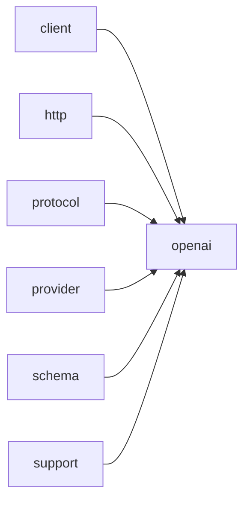

# Module `openai`

## Summary

模块 `openai` 封装了与 `OpenAI` API 进行交互的完整协议实现和异步调用接口。它公开了高层异步函数 `call_llm_async`、`call_completion_async` 和模板函数 `call_structured_async`，用于触发非阻塞的语言模型请求，同时提供了 `detail::Protocol` 类及其下的环境读取、请求构建、URL 拼接和响应解析等内部细节。在协议层，模块通过 `protocol` 子命名空间及 `protocol::detail` 子命名空间暴露了消息序列化（`serialize_message`、`serialize_response_format`、`serialize_tool_choice` 等）、请求验证（`validate_request`）以及响应解析（`parse_response`、`parse_tool_calls`、`parse_content_parts`）等底层工具，这些工具共同构成了与 `OpenAI` API 交换 JSON 数据的核心契约。

该模块依赖于 `client`、`http`、`protocol`、`provider`、`schema` 和 `support` 等模块，共同构建了从凭据管理、请求构造、网络传送到结构化输出解析的完整链路。它的公开实现范围涵盖了从顶层异步调用到底层 JSON 序列化/反序列化的所有环节，旨在为调用者提供统一、可靠的 `OpenAI` 集成能力。

## Imports

- [`client`](../client/index.md)
- [`http`](../http/index.md)
- [`protocol`](../protocol/index.md)
- [`provider`](../provider/index.md)
- [`schema`](../schema/index.md)
- `std`
- [`support`](../support/index.md)

## Dependency Diagram



## Types

### `clore::net::openai::detail::Protocol`

Declaration: `network/openai.cppm:692`

Definition: `network/openai.cppm:692`

Declaration: [`Namespace clore::net::openai::detail`](../../namespaces/clore/net/openai/detail/index.md)

`clore::net::openai::detail::Protocol` 是一个纯静态方法的集合，内部无任何数据成员，充当 `OpenAI` 协议的具体策略实现。其每个静态方法均负责协议生命周期中的一个独立阶段，组合起来构成从环境配置读取到响应解析的完整流水线。由于所有方法均为静态，该结构体本身不持有状态，调用方只需传入必要的上下文参数（如 `EnvironmentConfig` 或 `CompletionRequest`）即可驱动协议逻辑，这使其易于测试和替换。

关键实现中，`parse_response` 首先对空响应和 HTTP 状态码进行防御性检查，仅在通过后才将解析工作委托给通用的 `clore::net::protocol::parse_response`；`build_headers` 直接构造 `Content-Type` 与 `Authorization` 头，其中 API 密钥来自传入的 `environment`；`read_environment` 封装了环境变量名 `OPENAI_BASE_URL` 和 `OPENAI_API_KEY`，调用通用凭据读取函数；`build_url` 通过追加固定路径 `chat/completions` 生成终端地址；`capability_probe_key` 则组合供应商名、API 基址和模型名生成唯一探针键，其中供应商名固定为 `"LLM"`。

#### Invariants

- All members are static; no instance state exists.
- Environment variables `OPENAI_BASE_URL` and `OPENAI_API_KEY` are required for credential configuration.
- `build_url` always appends `/chat/completions` path.
- `build_headers` always includes `Content-Type: application/json; charset=utf-8` and `Authorization: Bearer <key>`.
- `parse_response` expects a JSON response body compatible with the completion response schema.

#### Key Members

- `read_environment`
- `build_url`
- `build_headers`
- `build_request_json`
- `parse_response`
- `provider_name`
- `capability_probe_key`

#### Usage Patterns

- Used as a template argument to generic HTTP client code that calls the static methods sequentially.
- Other `Protocol` specializations (e.g., for other providers) follow the same static interface pattern.
- Callers obtain credentials via `read_environment`, build the request with `build_*` methods, then parse the response with `parse_response`.

#### Member Functions

##### `clore::net::openai::detail::Protocol::build_headers`

Declaration: `network/openai.cppm:705`

Definition: `network/openai.cppm:705`

Declaration: [`Namespace clore::net::openai::detail`](../../namespaces/clore/net/openai/detail/index.md)

###### Implementation

```cpp
static auto build_headers(const clore::net::detail::EnvironmentConfig& environment)
        -> std::vector<kota::http::header> {
        return std::vector<kota::http::header>{
            kota::http::header{
                               .name = "Content-Type",
                               .value = "application/json; charset=utf-8",
                               },
            kota::http::header{
                               .name = "Authorization",
                               .value = std::format("Bearer {}", environment.api_key),
                               },
        };
    }
```

##### `clore::net::openai::detail::Protocol::build_request_json`

Declaration: `network/openai.cppm:719`

Definition: `network/openai.cppm:719`

Declaration: [`Namespace clore::net::openai::detail`](../../namespaces/clore/net/openai/detail/index.md)

###### Implementation

```cpp
static auto build_request_json(const CompletionRequest& request)
        -> std::expected<std::string, LLMError> {
        return clore::net::protocol::build_request_json(request);
    }
```

##### `clore::net::openai::detail::Protocol::build_url`

Declaration: `network/openai.cppm:701`

Definition: `network/openai.cppm:701`

Declaration: [`Namespace clore::net::openai::detail`](../../namespaces/clore/net/openai/detail/index.md)

###### Implementation

```cpp
static auto build_url(const clore::net::detail::EnvironmentConfig& environment) -> std::string {
        return clore::net::detail::append_url_path(environment.api_base, "chat/completions");
    }
```

##### `clore::net::openai::detail::Protocol::capability_probe_key`

Declaration: `network/openai.cppm:743`

Definition: `network/openai.cppm:743`

Declaration: [`Namespace clore::net::openai::detail`](../../namespaces/clore/net/openai/detail/index.md)

###### Implementation

```cpp
static auto capability_probe_key(const clore::net::detail::EnvironmentConfig& environment,
                                     const CompletionRequest& request) -> std::string {
        return clore::net::make_capability_probe_key(provider_name(),
                                                     environment.api_base,
                                                     request.model);
    }
```

##### `clore::net::openai::detail::Protocol::parse_response`

Declaration: `network/openai.cppm:724`

Definition: `network/openai.cppm:724`

Declaration: [`Namespace clore::net::openai::detail`](../../namespaces/clore/net/openai/detail/index.md)

###### Implementation

```cpp
static auto parse_response(const clore::net::detail::RawHttpResponse& raw_response)
        -> std::expected<CompletionResponse, LLMError> {
        if(raw_response.body.empty()) {
            return std::unexpected(LLMError("empty response from LLM"));
        }
        if(raw_response.http_status >= 400) {
            return std::unexpected(
                LLMError(std::format("LLM request failed with HTTP {}: {}",
                                     raw_response.http_status,
                                     clore::net::detail::excerpt_for_error(raw_response.body))));
        }

        return clore::net::protocol::parse_response(raw_response.body);
    }
```

##### `clore::net::openai::detail::Protocol::provider_name`

Declaration: `network/openai.cppm:739`

Definition: `network/openai.cppm:739`

Declaration: [`Namespace clore::net::openai::detail`](../../namespaces/clore/net/openai/detail/index.md)

###### Implementation

```cpp
static auto provider_name() -> std::string_view {
        return "LLM";
    }
```

##### `clore::net::openai::detail::Protocol::read_environment`

Declaration: `network/openai.cppm:693`

Definition: `network/openai.cppm:693`

Declaration: [`Namespace clore::net::openai::detail`](../../namespaces/clore/net/openai/detail/index.md)

###### Implementation

```cpp
static auto read_environment()
        -> std::expected<clore::net::detail::EnvironmentConfig, LLMError> {
        return clore::net::detail::read_credentials(clore::net::detail::CredentialEnv{
            .base_url_env = "OPENAI_BASE_URL",
            .api_key_env = "OPENAI_API_KEY",
        });
    }
```

## Functions

### `clore::net::openai::call_completion_async`

Declaration: `network/openai.cppm:755`

Definition: `network/openai.cppm:782`

Declaration: [`Namespace clore::net::openai`](../../namespaces/clore/net/openai/index.md)

该函数是一个轻量包装器，其核心逻辑完全委托给模板函数 `clore::net::call_completion_async<detail::Protocol>`。具体来说，它接收一个 `CompletionRequest` 和一个指向 `kota::event_loop` 的指针，将其转发给通用实现，然后通过 `.or_fail()` 将底层的 `expected` 结果转换为协程任务返回值。

在内部，所有与 `OpenAI` 特有的交互细节均由 `detail::Protocol` 封装：它通过 `build_url`、`build_headers` 和 `build_request_json` 构造 HTTP 请求，并且依赖 `detail::Protocol::parse_response` 和协议细节命名空间内的序列化/解析函数（如 `serialize_message`、`serialize_tool_definition`、`serialize_tool_choice`、`serialize_response_format`、`parse_tool_calls`、`parse_content_parts` 以及 `validate_request`）来处理请求体组装与响应中工具调用、内容分片等复杂结构的解析。这些模块的协作形成了完整的控制流，而包装器本身仅负责类型擦除和错误转换。

#### Side Effects

- 发起网络 I/O 请求到 `OpenAI` 服务
- 异步等待响应并可能触发事件循环调度
- 通过 `or_fail()` 处理 `LLMError` 错误状态

#### Reads From

- 参数 `request`（`CompletionRequest`）
- 参数 `loop`（`kota::event_loop&`）
- 底层协议 `detail::Protocol` 的配置

#### Writes To

- 协程返回值 `CompletionResponse`（通过 `co_return` 写入）

#### Usage Patterns

- 用于异步获取 `OpenAI` 补全结果
- 与事件循环集成以避免阻塞
- 通过错误处理机制应对 LLM 请求失败

### `clore::net::openai::call_llm_async`

Declaration: `network/openai.cppm:759`

Definition: `network/openai.cppm:789`

Declaration: [`Namespace clore::net::openai`](../../namespaces/clore/net/openai/index.md)

函数 `clore::net::openai::call_llm_async` 是一个基于协程的轻量级包装器，其核心逻辑完全委托给泛型模板 `clore::net::call_llm_async<detail::Protocol>`。调用时，它直接将接收到的 `model`、`system_prompt`、`request` 以及 `loop` 的指针转发给该模板，并随后调用 `.or_fail()` 将返回的 `kota::task` 转换为 `kota::task<std::string, LLMError>`。由此，算法和内部控制流均由模板通过 `detail::Protocol` 完成，该协议实现了具体的请求构建、HTTP 通信及响应解析，包括调用 `detail::Protocol::build_url`、`build_headers`、`build_request_json` 以及 `parse_response` 等方法。函数本身不包含独立的请求构造或解析逻辑，仅作为接口适配层，将 `OpenAPI` 参数形式映射到通用异步 LLM 调用框架中。

#### Side Effects

- 启动异步网络 I/O 操作（通过委托的 `call_llm_async` 实现）
- 可能修改 `kota::event_loop` 内部状态以调度协程

#### Reads From

- 参数 `model`（类型 `std::string_view`）
- 参数 `system_prompt`（类型 `std::string_view`）
- 参数 `request`（类型 `PromptRequest`）
- 参数 `loop`（类型 `kota::event_loop&`）

#### Writes To

- 调用方返回的 `kota::task<std::string, LLMError>` 对象（包含最终结果）

#### Usage Patterns

- 在需要异步执行 LLM 生成的地方调用，配合 `co_await`
- 与其他异步操作组合，如 `call_completion_async` 或 `call_structured_async`
- 用于事件循环驱动的高层 LLM 客户端

### `clore::net::openai::call_llm_async`

Declaration: `network/openai.cppm:765`

Definition: `network/openai.cppm:800`

Declaration: [`Namespace clore::net::openai`](../../namespaces/clore/net/openai/index.md)

该函数使用协程封装底层异步请求，将调用委托给泛型实现 `clore::net::call_llm_async<detail::Protocol>`，并传入模型标识符、系统提示、用户提示以及事件循环指针。它依赖 `detail::Protocol` 结构体提供的协议方法（如 `build_json`、`build_url`、`build_headers`、`parse_response`）来构造和解析 `OpenAI` API 请求，并通过 `.or_fail()` 将内部错误转换为公开的 `LLMError` 类型。返回值是一个 `kota::task<std::string, LLMError>`，调用方可在事件循环中 `co_await` 获取最终文本结果。

#### Side Effects

- Initiates an asynchronous HTTP request to a remote LLM service
- Schedules callbacks on the provided `kota::event_loop`

#### Reads From

- `model` parameter
- `system_prompt` parameter
- `prompt` parameter
- `loop` parameter (event loop reference)

#### Usage Patterns

- Primary async interface for LLM calls within the `clore::net::openai` namespace
- Called by code that requires non-blocking interaction with an LLM backend
- Wrapped or extended by higher-level functions such as `call_completion_async` and `call_structured_async`

### `clore::net::openai::call_structured_async`

Declaration: `network/openai.cppm:772`

Definition: `network/openai.cppm:812`

Declaration: [`Namespace clore::net::openai`](../../namespaces/clore/net/openai/index.md)

函数 `clore::net::openai::call_structured_async` 的核心逻辑是委托给通用 `clore::net::call_structured_async`，特化为 `clore::net::openai::detail::Protocol`。该协议首先通过 `read_environment` 加载配置，随后调用 `build_url`、`build_headers` 和 `build_request_json` 构造 HTTP 请求。`build_request_json` 内部利用 `serialize_message` 构建消息数组，并根据模板类型通过 `serialize_response_format`、`serialize_tool_definition` 和 `serialize_tool_choice` 嵌入结构化输出约束。请求发送后，`parse_response` 解析返回的 JSON，遍历 `choices` 并提取 `message` 中的 `content` 或 `tool_calls`，依赖 `parse_content_parts` 和 `parse_tool_calls` 进行反序列化。整体控制流涉及 `validate_request` 的校验，并依赖于 `clore::net::protocol` 命名空间的通用函数以及 `clore::net::openai::protocol::detail` 中的序列化与解析工具。

#### Side Effects

- 发起异步 HTTP 网络请求到 `OpenAI` 服务
- 等待网络响应并可能解析 JSON 为类型 `T`
- 通过传递的 `&loop` 向事件循环注册回调或任务

#### Reads From

- 参数 `model`（字符串视图）
- 参数 `system_prompt`（字符串视图）
- 参数 `prompt`（字符串视图）
- 参数 `loop`（事件循环引用）
- 底层 `clore::net::call_structured_async` 的执行结果

#### Writes To

- 通过 `.or_fail()` 可能设置 `kota::task<T, LLMError>` 中的错误状态
- 事件循环 `loop` 可能包含在异步操作期间修改的内部状态（如待处理回调队列）

#### Usage Patterns

- `co_await clore::net::openai::call_structured_async<MyStruct>("gpt-4", "system", "prompt", loop)`
- 作为 `clore::net::openai::call_completion_async` 或 `call_llm_async` 的结构化版本，直接返回解析后的类型 `T`

### `clore::net::openai::protocol::detail::parse_content_parts`

Declaration: `network/openai.cppm:288`

Definition: `network/openai.cppm:288`

Declaration: [`Namespace clore::net::openai::protocol::detail`](../../namespaces/clore/net/openai/protocol/detail/index.md)

该函数遍历 `parts` 数组中的每一个元素，将其解析为 JSON 对象并提取 `type` 字段，以此决定如何处理内容。对于类型为 `"refusal"` 的元素，它从 `refusal` 字段读取字符串并追加到局部变量 `refusal` 中，同时设置 `saw_refusal` 标志。对于类型为 `"text"` 或 `"output_text"` 的元素，它尝试直接从 `text` 字段获取字符串值；若该字段本身是一个对象，则进一步提取其 `value` 子字段。所有有效的文本内容被累积到 `text` 变量中，并设置 `saw_text` 标志。其他类型的元素则被静默跳过。遍历结束后，根据 `saw_text` 和 `saw_refusal` 标志，将累积的 `text` 和 `refusal` 分别填入返回的 `AssistantOutput` 结构体。整个过程中，所有 JSON 字段的提取都依赖 `clore::net::detail::expect_object` 和 `clore::net::detail::expect_string` 进行类型验证，任何验证失败都会立即返回 `LLMError` 错误。

#### Side Effects

No observable side effects are evident from the extracted code.

#### Reads From

- parameter `parts` of type `const json::Array&`
- JSON object fields accessed via `clore::net::detail::expect_object` and `get` methods, specifically `type`, `refusal`, `text`, and `value`

#### Writes To

- local variables `output`, `text`, `refusal`, `saw_text`, `saw_refusal`
- return value of type `std::expected<AssistantOutput, LLMError>`

#### Usage Patterns

- Used to parse the `content` array of a chat completion response into an `AssistantOutput` object
- Called during response deserialization in the `OpenAI` protocol layer

### `clore::net::openai::protocol::detail::parse_tool_calls`

Declaration: `network/openai.cppm:369`

Definition: `network/openai.cppm:369`

Declaration: [`Namespace clore::net::openai::protocol::detail`](../../namespaces/clore/net/openai/protocol/detail/index.md)

该函数遍历输入数组 `calls`，对每个元素通过 `clore::net::detail::expect_object` 提取为对象，并依次提取和验证 `id`、`type`、`function`、`name` 及 `arguments` 字段。`id` 使用 `std::unordered_set` 去重；`type` 必须为 `"function"`；`arguments` 字段被解析为 JSON 值。任何缺失或格式错误的字段都会立即返回 `std::unexpected` 错误。验证通过后，构造 `ToolCall` 实例并添加到结果向量中，最终返回完整的调用列表。核心依赖为 `clore::net::detail::expect_object`、`expect_string` 以及 `json::parse`，分别用于类型检查和 JSON 反序列化。

#### Side Effects

No observable side effects are evident from the extracted code.

#### Reads From

- const `json::Array`& calls

#### Writes To

- local variable `parsed_calls`

#### Usage Patterns

- Used by `OpenAI` protocol message parsing logic
- Called during response deserialization to extract tool calls

### `clore::net::openai::protocol::detail::serialize_message`

Declaration: `network/openai.cppm:27`

Definition: `network/openai.cppm:27`

Declaration: [`Namespace clore::net::openai::protocol::detail`](../../namespaces/clore/net/openai/protocol/detail/index.md)

函数 `clore::net::openai::protocol::detail::serialize_message` 将一条 `Message` 变体序列化为一个 JSON 对象并追加至输出数组。它使用 `std::visit` 按消息类型分发：`SystemMessage`、`UserMessage` 和 `AssistantMessage` 均设置 `role` 与 `content` 字段，其中 `content` 经 `clore::net::detail::normalize_utf8` 归一化后通过 `clore::net::detail::insert_string_field` 写入。`AssistantToolCallMessage` 除可选 `content` 外，还会遍历 `tool_calls` 列表，为每个调用构建包含 `id`、`type`（固定为 `"function"`）以及嵌套 `function` 对象（含 `name` 与 `arguments`）的子 JSON 对象，最终将所有调用汇聚为一个 `tool_calls` 数组。`ToolResultMessage` 则填充 `role`、`tool_call_id` 和 `content`。每个字段插入失败均会以 `std::unexpected` 终止序列化并传播底层错误；成功后将构造的 JSON 对象推入 `out` 数组。该函数依赖 `clore::net::detail` 命名空间下的 JSON 构建工具函数，并直接接受 `Message` 变体，无需外部上下文。

#### Side Effects

- mutates the output `json::Array` by appending a new JSON object
- allocates memory for temporary JSON objects and strings via helper functions
- modifies local JSON objects (`object`, `tool_calls`, `call_object`, `function_object`)

#### Reads From

- the `out` parameter (reference to `json::Array`)
- the `message` parameter (const `Message&`)
- fields of the visited message variants (e.g., `content`, `tool_calls`, `tool_call_id`, `id`, `name`, `arguments_json`)

#### Writes To

- the `out` array (append)
- temporary `json::Object` instances created via `clore::net::detail::make_empty_object`
- temporary `json::Array` for tool calls
- fields inserted into those objects via `insert` and `clore::net::detail::insert_string_field`

#### Usage Patterns

- called by higher-level request serialization functions
- used to convert a `Message` variant (e.g., from a chat history) into JSON for the `OpenAI` API
- part of the protocol detail layer for building request bodies

### `clore::net::openai::protocol::detail::serialize_response_format`

Declaration: `network/openai.cppm:209`

Definition: `network/openai.cppm:209`

Declaration: [`Namespace clore::net::openai::protocol::detail`](../../namespaces/clore/net/openai/protocol/detail/index.md)

函数 `clore::net::openai::protocol::detail::serialize_response_format` 将 `ResponseFormat` 结构序列化为 JSON 对象并注入给定 `root` 的 `"response_format"` 字段。内部首先创建两个空 JSON 对象 `object` 和 `schema_object`，若任一创建失败则立即返回 `std::unexpected`。控制流根据 `format.schema` 是否有值分支：若无值，直接向 `object` 插入 `"type"` 为 `"json_object"`；若有值，则先后插入 `"type"` 为 `"json_schema"`，并通过 `clore::net::detail::insert_string_field` 写入 `"name"`，手动插入 `"strict"` 布尔字段，再克隆 `format.schema` 的内容作为 `"schema"` 子对象，最后将 `schema_object` 整体作为 `"json_schema"` 放入 `object`。最终将 `object` 移动至 `root`。该函数依赖于 `clore::net::detail::make_empty_object`、`clore::net::detail::insert_string_field` 和 `clore::net::detail::clone_object` 等内部辅助，并统一使用 `std::expected` 传播错误。

#### Side Effects

- Modifies the provided `root` JSON object by inserting a `response_format` object
- Allocates memory for intermediate JSON objects through helper functions

#### Reads From

- `root` parameter (existing JSON object)
- `format` parameter fields: `format.name`, `format.schema`, `format.strict`
- Helper functions: `clore::net::detail::make_empty_object`, `clore::net::detail::insert_string_field`, `clore::net::detail::clone_object`

#### Writes To

- `root` JSON object (inserts `"response_format"` key)
- Temporary `object` and `schema_object` JSON objects that are moved into `root`
- Error state via `std::expected` when any sub-operation fails

#### Usage Patterns

- Called during serialization of `OpenAI` API requests
- Used to convert a `ResponseFormat` into a JSON representation nested within a larger request object
- Likely invoked from higher-level serialization routines such as `serialize_message` or `validate_request`

### `clore::net::openai::protocol::detail::serialize_tool_choice`

Declaration: `network/openai.cppm:167`

Definition: `network/openai.cppm:167`

Declaration: [`Namespace clore::net::openai::protocol::detail`](../../namespaces/clore/net/openai/protocol/detail/index.md)

该函数通过 `std::visit` 对 `ToolChoice` 变体进行模式匹配，根据具体类型决定序列化方式。对于 `ToolChoiceAuto`、`ToolChoiceRequired` 和 `ToolChoiceNone`，它直接将对应的字符串（`"auto"`、`"required"` 或 `"none"`）插入到输出对象 `root` 的 `"tool_choice"` 键中。对于其余变体（预期为强制选择特定工具的情况），它构建一个嵌套的 JSON 对象：先依赖 `clore::net::detail::make_empty_object` 创建外层对象和函数对象，然后设置 `"type": "function"`，再使用 `clore::net::detail::insert_string_field` 将 `current.name` 写入函数对象的 `"name"` 字段，最后将该函数对象作为 `"function"` 的值插入外层对象，并将整个对象赋值给 `root` 的 `"tool_choice"`。整个处理通过 `std::expected` 传播错误，任何中间失败都会导致立即返回 `std::unexpected`。

#### Side Effects

- 修改 `root` 对象，插入或替换 `"tool_choice"` 键的值
- 可能通过 `clore::net::detail::make_empty_object` 和 `clore::net::detail::insert_string_field` 进行内存分配

#### Reads From

- 参数 `root`（作为写入目标）
- 参数 `choice`（其变体类型及可能包含的 `name` 字段）

#### Writes To

- 参数 `root`（修改其内容）

#### Usage Patterns

- 用于将 `ToolChoice` 配置序列化为 JSON 对象，作为 `OpenAI` API 请求的一部分
- 在序列化对话请求时被调用，类似 `serialize_response_format` 或 `serialize_tool_definition`

### `clore::net::openai::protocol::detail::serialize_tool_definition`

Declaration: `network/openai.cppm:248`

Definition: `network/openai.cppm:248`

Declaration: [`Namespace clore::net::openai::protocol::detail`](../../namespaces/clore/net/openai/protocol/detail/index.md)

该函数首先通过两次调用 `clore::net::detail::make_empty_object` 创建两个独立的空 JSON 对象——一个用于顶层工具条目，另一个用于内嵌的函数定义。接着，它在这两个对象中逐步填充字段：顶层对象插入固定的 `"type"` 值 `"function"`，然后向函数对象依次插入 `"name"`、`"description"`（均通过 `clore::net::detail::insert_string_field` 写入）、`"parameters"`（通过 `clore::net::detail::clone_object` 深拷贝传入的 `tool.parameters` 参数），以及布尔字段 `"strict"`。每一步写入后均检查返回的 `std::expected` 是否包含错误，若某一步失败则立即将错误携带的 `LLMError` 原样向上传播。所有字段成功写入后，将组装好的顶层对象推入输出数组 `tools` 的末尾，并返回一个空的 `std::expected<void>` 表示成功。

该实现完全依赖于 `clore::net::detail` 命名空间下的底层 JSON 工具函数（`make_empty_object`、`insert_string_field`、`clone_object`）来保障字段正确插入并提供统一的错误报告路径，自身不涉及任何额外的 JSON 操作或业务逻辑校验。其控制流清晰为“创建对象 → 顺序填充 → 逐级错误传播”，仅当所有步骤成功时才修改输出数组。

#### Side Effects

- 修改传入的 `tools` 数组（追加元素）
- 创建临时 JSON 对象并移动插入
- 分配 JSON 内存（通过 `make_empty_object` 和 `clone_object`）

#### Reads From

- `tool.name`
- `tool.description`
- `tool.parameters`
- `tool.strict`

#### Writes To

- `tools` 数组（通过 `push_back`）
- 内部临时 `object` 和 `function_object` 对象

#### Usage Patterns

- 用于构造 `OpenAI` 工具定义请求
- 被更高层序列化函数调用
- 在构建工具列表时逐个处理工具定义

### `clore::net::openai::protocol::detail::validate_request`

Declaration: `network/openai.cppm:23`

Definition: `network/openai.cppm:23`

Declaration: [`Namespace clore::net::openai::protocol::detail`](../../namespaces/clore/net/openai/protocol/detail/index.md)

`clore::net::openai::protocol::detail::validate_request` 的实现是一个薄转发层。它立即将调用委托给 `clore::net::detail::validate_completion_request`，并传递两个硬编码的布尔值参数（均为 `true`）。这些布尔值分别控制验证过程中是否检查工具调用的一致性以及是否强制要求系统提示（system prompt）的存在。该函数本身不包含任何独立的校验逻辑或控制流，所有实际验证行为完全依赖于 `clore::net::detail::validate_completion_request` 的实现。依赖链因此集中在 `clore::net::detail` 命名空间下的同一个验证器，而 `validate_request` 仅作为适配点，为 `OpenAI` 协议层提供一个统一且与具体验证策略解耦的调用入口。

#### Side Effects

No observable side effects are evident from the extracted code.

#### Reads From

- request (`CompletionRequest` parameter)

#### Usage Patterns

- Called internally before sending a request to the `OpenAI` API to ensure the request is well-formed.
- Used as a precondition check for other protocol serialization functions.

### `clore::net::protocol::build_request_json`

Declaration: `network/openai.cppm:457`

Definition: `network/openai.cppm:465`

Declaration: [`Namespace clore::net::protocol`](../../namespaces/clore/net/protocol/index.md)

该函数将传入的 `CompletionRequest` 参数转换为 `OpenAI` 兼容的 JSON 请求字符串。首先调用 `openai::protocol::detail::validate_request` 进行校验，若失败则直接返回错误。随后通过 `clore::net::detail::make_empty_object` 创建根 JSON 对象，并依次填充 `model` 字段及由 `openai::protocol::detail::serialize_message` 序列化的 `messages` 数组。若请求包含 `response_format`、`tools`、`tool_choice` 或 `parallel_tool_calls`，则分别调用对应的序列化函数（`serialize_response_format`、`serialize_tool_definition`、`serialize_tool_choice`）或直接插入值。每一步操作若产生错误（如内存分配失败或字段格式无效），均立即返回 `std::unexpected` 错误。最后通过 `kota::codec::json::to_string` 将构建好的 JSON 对象序列化为字符串并返回。依赖关系集中在 `openai::protocol::detail` 命名空间内的校验与序列化组件，以及底层 JSON 构造工具 `clore::net::detail`。

#### Side Effects

No observable side effects are evident from the extracted code.

#### Reads From

- 参数 `request` 及其字段：`request.model`、`request.messages`、`request.response_format`、`request.tools`、`request.tool_choice`、`request.parallel_tool_calls`

#### Writes To

- 返回的 `std::expected<std::string, LLMError>` 中的 `std::string`（成功时）或 `LLMError`（失败时）

#### Usage Patterns

- 通过 `build_request_json(request)` 将业务请求对象序列化为 JSON 字符串
- 用于构造发送给 LLM 的 HTTP 请求体

### `clore::net::protocol::parse_response`

Declaration: `network/openai.cppm:459`

Definition: `network/openai.cppm:532`

Declaration: [`Namespace clore::net::protocol`](../../namespaces/clore/net/protocol/index.md)

函数首先通过 `kota::codec::json::parse` 将输入的 JSON 文本解析为顶层对象 `root`，若解析失败则立即返回包含错误描述的 `LLMError`。接着检查响应中是否存在 `"error"` 字段，若有则提取其 `"message"` 子字段并返回 API 错误。确认无误后，顺序提取并验证必需的顶层字段 `"id"`、`"model"` 和 `"choices"`，要求 `"choices"` 数组非空，并从第一个 choice 中取得 `"finish_reason"` 进行语义校验：仅接受 `"stop"` 或 `"tool_calls"`，其他值（包括 `"length"` 和 `"content_filter"`）直接以错误终止。

从 choice 的 `"message"` 对象中逐步组装 `AssistantOutput`：处理可选的 `"refusal"`、`"content"`（支持纯文本字符串或由 `openai::protocol::detail::parse_content_parts` 解析的部件数组）以及 `"tool_calls"`（通过 `openai::protocol::detail::parse_tool_calls` 解析）。工具调用与 `finish_reason` 之间的一致性经过双重校验，确保内容、拒绝或工具调用至少存在一项。最后将提取的 `id`、`model`、构造的 `output` 以及原始 JSON 文本打包为 `CompletionResponse` 返回。整个流程依赖 `clore::net::detail::ObjectView` 和相关的类型安全取值函数来访问并验证 JSON 结构。

#### Side Effects

No observable side effects are evident from the extracted code.

#### Reads From

- `json_text` parameter (`std::string_view`)
- parsed JSON object via `kota::codec::json::parse` and `clore::net::detail::ObjectView`

#### Usage Patterns

- parse LLM API JSON response into `CompletionResponse`
- validate and convert raw response text from an AI provider

## Internal Structure

模块 `openai` 采用三层分解：协议层、内部实现层和对外接口层。协议层包含 `protocol` 与 `protocol::detail` 命名空间，前者提供 `validate_request`、`build_request_json`、`parse_response` 等公开的请求验证与序列化/反序列化函数，后者封装了 `serialize_message`、`serialize_tool_definition`、`parse_content_parts` 等仅限内部使用的辅助函数，专注于与 `OpenAI` 消息格式间的转换。内部实现层由 `detail::Protocol` 结构体构成，它通过导入 `http` 和 `support` 模块，封装了环境变量读取、URL 拼接、请求头部构建、请求 JSON 构造以及响应解析等完整的网络交互流程。对外接口层提供 `call_completion_async`、`call_llm_async` 和 `call_structured_async` 等异步入口，这些函数接收模型标识、提示文本和事件循环，通过组合 `Protocol` 中的方法驱动请求并返回句柄。整体上，模块依赖 `client`、`http`、`protocol`、`provider`、`schema` 和 `std` 模块，其中 `schema` 用于生成结构化输出所需的 JSON Schema，`provider` 提供凭据与端点配置，`http` 负责实际的网络请求调度。

## Related Pages

- [Module client](../client/index.md)
- [Module http](../http/index.md)
- [Module protocol](../protocol/index.md)
- [Module provider](../provider/index.md)
- [Module schema](../schema/index.md)
- [Module support](../support/index.md)

