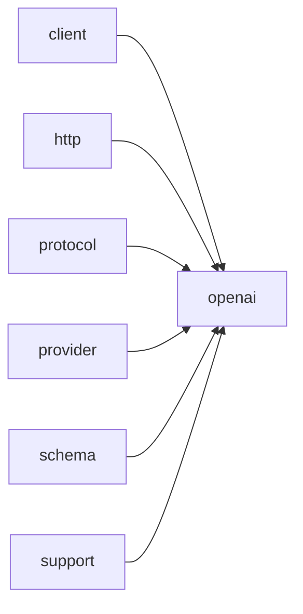

# Module `openai`

## Summary

`openai` 模块是对 LLM 网络通信的高层抽象，封装了与 `OpenAI` 兼容 API 交互的完整生命周期。它公开了三个模板异步调用函数（`call_completion_async`、`call_llm_async`、`call_structured_async`），分别对应通用补全、直接 LLM 调用和结构化输出场景，调用者通过参数指定模型、提示与事件循环，函数返回操作句柄。模块内部依赖 `protocol`、`schema` 等子模块处理 JSON 序列化、工具调用解析和响应验证，并通过 `http` 与 `provider` 模块管理实际的网络请求与凭据读取，从而提供从请求构建到结果返回的全流程支持。

## Imports

- [`client`](../client/index.md)
- [`http`](../http/index.md)
- [`protocol`](../protocol/index.md)
- [`provider`](../provider/index.md)
- [`schema`](../schema/index.md)
- [`support`](../support/index.md)

## Dependency Diagram


```mermaid
graph LR
    M0["openai"]
    I0["client"]
    I0 --> M0
    I1["http"]
    I1 --> M0
    I2["protocol"]
    I2 --> M0
    I3["provider"]
    I3 --> M0
    I4["schema"]
    I4 --> M0
    I5["support"]
    I5 --> M0
```

## Types

### `clore::net::openai::detail::Protocol`

Declaration: `src/network/openai.cppm:702`

Definition: `src/network/openai.cppm:702`

Declaration: [`Namespace clore::net::openai::detail`](../../namespaces/clore/net/openai/detail/index.md)

该结构体是一个仅含静态方法的协议实现，充当 `OpenAI` API 的通信适配器。它不持有任何状态，所有操作均通过静态函数完成，依赖外部传入的 `clore::net::detail::EnvironmentConfig` 和 `CompletionRequest` 等参数。其核心不变量包括：环境配置必须通过 `read_environment` 从预设的环境变量（`OPENAI_BASE_URL` 和 `OPENAI_API_KEY`）中读取；`build_url` 始终将 `api_base` 路径拼接 `chat/completions`；`build_headers` 固定设置 `Content-Type` 为 `application/json; charset=utf-8` 并使用 Bearer 令牌认证。在响应解析中，`parse_response` 强制要求 HTTP 状态码小于 400 且响应体非空，否则直接返回错误；成功时则委托给 `clore::net::protocol::parse_response` 进行 JSON 反序列化。此外，`capability_probe_key` 组合了固定的 `provider_name`（返回字符串 `LLM`）、请求中的 `model` 以及 `api_base`，以生成能力探测的唯一键。

#### Invariants

- All methods are static; no instance state required.
- Environment variable names are fixed to `OPENAI_BASE_URL` and `OPENAI_API_KEY`.
- Uses `clore::net::detail` utilities for credential reading and URL construction.
- Delegates core JSON and response parsing to `clore::net::protocol`.
- Provider name is always `"LLM"`.

#### Key Members

- `read_environment`
- `build_url`
- `build_headers`
- `build_request_json`
- `parse_response`
- `provider_name`
- `capability_probe_key`

#### Usage Patterns

- Used by network layer code to configure and make HTTP requests to an `OpenAI`-style LLM endpoint.
- Provides standardized request building and response parsing for `CompletionRequest` and `CompletionResponse`.
- `capability_probe_key` combines provider name, API base, and model for caching or deduplication.

#### Member Functions

##### `clore::net::openai::detail::Protocol::build_headers`

Declaration: `src/network/openai.cppm:715`

Definition: `src/network/openai.cppm:715`

Declaration: [`Namespace clore::net::openai::detail`](../../namespaces/clore/net/openai/detail/index.md)

###### Implementation

```cpp
static auto build_headers(const clore::net::detail::EnvironmentConfig& environment)
        -> std::vector<kota::http::header> {
        return std::vector<kota::http::header>{
            kota::http::header{
                               .name = "Content-Type",
                               .value = "application/json; charset=utf-8",
                               },
            kota::http::header{
                               .name = "Authorization",
                               .value = std::format("Bearer {}", environment.api_key),
                               },
        };
    }
```

##### `clore::net::openai::detail::Protocol::build_request_json`

Declaration: `src/network/openai.cppm:729`

Definition: `src/network/openai.cppm:729`

Declaration: [`Namespace clore::net::openai::detail`](../../namespaces/clore/net/openai/detail/index.md)

###### Implementation

```cpp
static auto build_request_json(const CompletionRequest& request)
        -> std::expected<std::string, LLMError> {
        return clore::net::protocol::build_request_json(request);
    }
```

##### `clore::net::openai::detail::Protocol::build_url`

Declaration: `src/network/openai.cppm:711`

Definition: `src/network/openai.cppm:711`

Declaration: [`Namespace clore::net::openai::detail`](../../namespaces/clore/net/openai/detail/index.md)

###### Implementation

```cpp
static auto build_url(const clore::net::detail::EnvironmentConfig& environment) -> std::string {
        return clore::net::detail::append_url_path(environment.api_base, "chat/completions");
    }
```

##### `clore::net::openai::detail::Protocol::capability_probe_key`

Declaration: `src/network/openai.cppm:753`

Definition: `src/network/openai.cppm:753`

Declaration: [`Namespace clore::net::openai::detail`](../../namespaces/clore/net/openai/detail/index.md)

###### Implementation

```cpp
static auto capability_probe_key(const clore::net::detail::EnvironmentConfig& environment,
                                     const CompletionRequest& request) -> std::string {
        return clore::net::make_capability_probe_key(provider_name(),
                                                     environment.api_base,
                                                     request.model);
    }
```

##### `clore::net::openai::detail::Protocol::parse_response`

Declaration: `src/network/openai.cppm:734`

Definition: `src/network/openai.cppm:734`

Declaration: [`Namespace clore::net::openai::detail`](../../namespaces/clore/net/openai/detail/index.md)

###### Implementation

```cpp
static auto parse_response(const clore::net::detail::RawHttpResponse& raw_response)
        -> std::expected<CompletionResponse, LLMError> {
        if(raw_response.body.empty()) {
            return std::unexpected(LLMError("empty response from LLM"));
        }
        if(raw_response.http_status >= 400) {
            return std::unexpected(
                LLMError(std::format("LLM request failed with HTTP {}: {}",
                                     raw_response.http_status,
                                     clore::net::detail::excerpt_for_error(raw_response.body))));
        }

        return clore::net::protocol::parse_response(raw_response.body);
    }
```

##### `clore::net::openai::detail::Protocol::provider_name`

Declaration: `src/network/openai.cppm:749`

Definition: `src/network/openai.cppm:749`

Declaration: [`Namespace clore::net::openai::detail`](../../namespaces/clore/net/openai/detail/index.md)

###### Implementation

```cpp
static auto provider_name() -> std::string_view {
        return "LLM";
    }
```

##### `clore::net::openai::detail::Protocol::read_environment`

Declaration: `src/network/openai.cppm:703`

Definition: `src/network/openai.cppm:703`

Declaration: [`Namespace clore::net::openai::detail`](../../namespaces/clore/net/openai/detail/index.md)

###### Implementation

```cpp
static auto read_environment()
        -> std::expected<clore::net::detail::EnvironmentConfig, LLMError> {
        return clore::net::detail::read_credentials(clore::net::detail::CredentialEnv{
            .base_url_env = "OPENAI_BASE_URL",
            .api_key_env = "OPENAI_API_KEY",
        });
    }
```

## Functions

### `clore::net::openai::call_completion_async`

Declaration: `src/network/openai.cppm:765`

Definition: `src/network/openai.cppm:792`

Declaration: [`Namespace clore::net::openai`](../../namespaces/clore/net/openai/index.md)

该函数是一个协程适配器，实现了对通用 `clore::net::call_completion_async<detail::Protocol>` 的直接委托。内部控制流极其简洁：它立即 `co_await` 模板函数的调用，并将结果通过 `.or_fail()` 转换为 `kota::task` 所需的错误类型。依赖方面，它完全依赖 `detail::Protocol` 作为策略类型，该类型封装了与 `OpenAI` API 交互的全部细节，包括请求构造（如 `build_request_json`、`build_headers`、`build_url`）和响应解析（如 `parse_response`）。`detail::Protocol` 的静态多态行为由 `clore::net::call_completion_async` 模板函数在运行时驱动，而此处只是将对 `CompletionRequest` 的调用转发到泛型实现，未引入额外逻辑。

#### Side Effects

- Initiates an asynchronous HTTP request to the `OpenAI` API
- May mutate the event loop's internal state to schedule the asynchronous operation
- Calls `.or_fail()` which may throw or abort on failure

#### Reads From

- `CompletionRequest request`
- `kota::event_loop& loop`

#### Writes To

- Result of the coroutine: `kota::task<CompletionResponse, LLMError>`

#### Usage Patterns

- Used to perform an `OpenAI` completion call asynchronously
- Wraps the generic completion function with the `OpenAI` protocol

### `clore::net::openai::call_llm_async`

Declaration: `src/network/openai.cppm:769`

Definition: `src/network/openai.cppm:799`

Declaration: [`Namespace clore::net::openai`](../../namespaces/clore/net/openai/index.md)

`clore::net::openai::call_llm_async` 的 `PromptRequest` 重载将请求委托给 `clore::net::call_llm_async<clore::net::openai::detail::Protocol>`，该模板利用 `clore::net::openai::detail::Protocol` 的方法（`build_url`、`build_headers`、`build_request_json`、`parse_response`）构造并发送 `OpenAI` API 请求。在构建 JSON 时，协议实现调用 `clore::net::openai::protocol::detail` 命名空间下的序列化函数（如 `serialize_message`、`serialize_tool_definition`、`serialize_tool_choice`、`serialize_response_format`）来组合消息、工具定义、工具选择和响应格式。解析阶段则依赖 `clore::net::openai::protocol::detail` 中的解析函数（`parse_tool_calls`、`parse_content_parts`、`validate_request`）提取工具调用、内容部分和错误对象。最终通过 `or_fail()` 将错误转换为协程异常，并返回生成的文本或结构化输出。此外，`Protocol` 还通过 `read_environment` 和 `provider_name` 管理环境配置和供应商特性，确保请求适配特定端点。

#### Side Effects

- Initiates an asynchronous network request to an LLM API
- Handles HTTP response and propagates errors through `.or_fail()`

#### Reads From

- `model` parameter
- `system_prompt` parameter
- `request` parameter
- `loop` parameter (event loop for async operations)

#### Usage Patterns

- Awaited in coroutine contexts to obtain LLM response strings
- Used with `kota::event_loop` to perform non-blocking LLM calls

### `clore::net::openai::call_llm_async`

Declaration: `src/network/openai.cppm:775`

Definition: `src/network/openai.cppm:810`

Declaration: [`Namespace clore::net::openai`](../../namespaces/clore/net/openai/index.md)

`clore::net::openai::call_llm_async` 是围绕底层模板 `clore::net::call_llm_async<detail::Protocol>` 的轻量封装，核心控制流委托给 `detail::Protocol` 完成。该函数接受模型标识符、系统提示和用户提示，通过传入的 `kota::event_loop` 驱动异步 I/O，并在内部调用 `.or_fail()` 将协议层的异步结果转换为正确的错误类型。`detail::Protocol` 负责整个请求生命周期，包括构建 URL、序列化请求 JSON（利用 `clore::net::protocol::build_request_json` 以及 `serialize_message`、`serialize_tool_choice` 等辅助函数）、发送网络请求并解析结构化响应（通过 `parse_response` 和 `parse_tool_calls`），最终提取出文本内容并返回。

#### Side Effects

- makes an asynchronous network request to an `OpenAI`‑compatible API
- allocates memory for coroutine frame and task state
- schedules the coroutine on the provided `kota::event_loop`
- mutates internal event loop state

#### Reads From

- parameter `model`
- parameter `system_prompt`
- parameter `prompt`
- parameter `loop`
- indirectly reads global or config‑based API endpoint/keys via the underlying call

#### Writes To

- event loop `loop` (by scheduling the coroutine)
- returns a `kota::task` that will eventually hold the result string

#### Usage Patterns

- called with `co_await` in a coroutine context
- standard pattern for streaming or single‑turn LLM completions
- often combined with error handling via the returned `task`

### `clore::net::openai::call_structured_async`

Declaration: `src/network/openai.cppm:782`

Definition: `src/network/openai.cppm:822`

Declaration: [`Namespace clore::net::openai`](../../namespaces/clore/net/openai/index.md)

该函数是 `clore::net::call_structured_async` 针对 `OpenAI` 提供者的适配器特化。它接受模型标识符、系统提示、用户提示及一个 `kota::event_loop` 引用，通过 `co_await` 将控制权转交给通用模板实现，该模板以 `clore::net::openai::detail::Protocol` 作为协议参数。在执行过程中，通用实现会调用 Protocol 提供的 `build_url`、`build_headers`、`build_request_json` 与 `parse_response` 等方法完成请求构建与响应解析；内部流程依次包括验证请求、序列化工具定义与工具选择、设置 `response_format`（使用模板类型 T 对应的 JSON schema）、通过 `call_llm_async` 发送 HTTP 请求，最后解析返回的 JSON 以提取工具调用和内容部分，并将结果映射为类型 T。如果发生错误，`or_fail()` 会将 `LLMError` 转换为异常或对应结果。

#### Side Effects

No observable side effects are evident from the extracted code.

#### Reads From

- model parameter
- `system_prompt` parameter
- prompt parameter
- loop parameter

#### Usage Patterns

- Used to call `OpenAI` structured output `APIs` asynchronously
- Instantiated with different types for typed responses

### `clore::net::openai::protocol::detail::parse_content_parts`

Declaration: `src/network/openai.cppm:298`

Definition: `src/network/openai.cppm:298`

Declaration: [`Namespace clore::net::openai::protocol::detail`](../../namespaces/clore/net/openai/protocol/detail/index.md)

函数遍历 `parts` 数组中的每个 JSON 对象元素。对于每个元素，它提取类型字段（默认为 `"text"`），并根据类型分支处理。若类型为 `"refusal"`，则读取 `"refusal"` 字符串值并累积到局部变量 `refusal` 中，标记 `saw_refusal`；若类型为 `"text"` 或 `"output_text"`，则读取 `"text"` 字段：如果该字段是字符串则直接追加，如果是对象则提取其内部的 `"value"` 字符串，都将内容累积到局部变量 `text` 中并标记 `saw_text`；其他类型被忽略。所有 JSON 字段访问均通过 `clore::net::detail::expect_object` 和 `clore::net::detail::expect_string` 进行校验，校验失败立即返回 `std::unexpected` 包装的 `LLMError`。循环结束后，根据 `saw_text` 和 `saw_refusal` 标志将累积的文本和拒绝内容分别移入 `AssistantOutput` 的相应字段并返回。

#### Side Effects

No observable side effects are evident from the extracted code.

#### Reads From

- parameter `parts` (`const json::Array&`)
- internal parsed fields via `clore::net::detail::expect_object` and `clore::net::detail::expect_string`

#### Writes To

- local variables `text`, `refusal`, `output`
- return value `std::expected<AssistantOutput, LLMError>`

#### Usage Patterns

- called to parse `content` arrays from `OpenAI` API response messages
- used in the deserialization path for assistant messages

### `clore::net::openai::protocol::detail::parse_tool_calls`

Declaration: `src/network/openai.cppm:379`

Definition: `src/network/openai.cppm:379`

Declaration: [`Namespace clore::net::openai::protocol::detail`](../../namespaces/clore/net/openai/protocol/detail/index.md)

函数 `clore::net::openai::protocol::detail::parse_tool_calls` 以 `const json::Array&` 形式接收工具调用数组，将其解析为 `std::vector<ToolCall>`。内部实现先预分配 `parsed_calls` 容量，并维护一个 `ids` 无序集合用于去重。遍历输入的每个元素：首先通过 `clore::net::detail::expect_object` 验证元素是 JSON 对象，然后依次提取并验证 `id`、`type`、`function` 子字段。`id` 必须存在、为字符串且不重复；`type` 必须等于 `"function"`，否则直接返回 `std::unexpected` 错误。接着从 `function` 对象中提取 `name` 和 `arguments`（均为字符串），其中 `arguments` 还需通过 `json::parse` 解析为 `json::Value` 以完成深层验证。若任何步骤失败，立即返回包含 `LLMError` 的 `std::unexpected`。

所有验证通过后，将 `id`、`name`、原始 `arguments_json` 及解析后的 `arguments` 组成 `ToolCall` 并推入 `parsed_calls`。整个流程依赖 `clore::net::detail::expect_object` 和 `clore::net::detail::expect_string` 进行类型安全的字段提取与错误包装，依赖 `json::parse` 处理参数 JSON 解析，并依赖 `LLMError` 与 `ToolCall` 类型。该函数只负责格式验证与转换，不涉及网络或协议交互，是 `OpenAI` 协议响应中 `tool_calls` 字段的反序列化核心步骤。

#### Side Effects

- Allocates memory for the returned `std::vector<ToolCall>` and its elements
- Allocates `std::string` objects for `id`, `name`, and `arguments_json`
- Allocates and parses JSON value for `arguments`

#### Reads From

- Input parameter `calls` of type `const json::Array&`
- Extracted JSON values `id`, `type`, `name`, and `arguments_json`

#### Writes To

- Return value of type `std::expected<std::vector<ToolCall>, LLMError>`

#### Usage Patterns

- Parsing tool calls from an `OpenAI` API response
- Validating structure of tool call JSON array
- Converting raw JSON tool calls into structured `ToolCall` objects

### `clore::net::openai::protocol::detail::serialize_message`

Declaration: `src/network/openai.cppm:37`

Definition: `src/network/openai.cppm:37`

Declaration: [`Namespace clore::net::openai::protocol::detail`](../../namespaces/clore/net/openai/protocol/detail/index.md)

函数 `clore::net::openai::protocol::detail::serialize_message` 通过 `std::visit` 对 `Message` 变体进行模式分派，为每条消息构造一个 JSON 对象并追加到输出数组 `out`。处理五种消息类型：`SystemMessage`、`UserMessage`、`AssistantMessage`、`AssistantToolCallMessage` 和 `ToolResultMessage`。对于前三者，直接设置 `"role"` 和 `"content"` 字段，其中内容通过 `clore::net::detail::normalize_utf8` 规范化后利用 `insert_string_field` 插入；若插入失败则返回 `std::unexpected`。`AssistantToolCallMessage` 额外处理可选的 `content` 和 `tool_calls` 数组：每个工具调用对象包含 `"id"`、`"type"` 固定为 `"function"` 以及一个 `"function"` 子对象（内含 `"name"` 和 `"arguments"`，参数同样经过规范化）。`ToolResultMessage` 则设置 `"role"` 为 `"tool"`，并写入 `"tool_call_id"` 和 `"content"`。所有子对象和数组均通过 `clore::net::detail::make_empty_object` / `make_empty_array` 创建，并对每一步操作进行错误检查。最终将构建好的对象 `push_back` 到 `out` 中，若整个访问过程无错误则返回 `std::expected<void, LLMError>`。该函数依赖同一命名空间下的其他序列化工具（如 `serialize_tool_choice`、`serialize_tool_definition`）来构建请求中的其他部分，但自身专注于单条消息的 JSON 化。

#### Side Effects

- Appends a newly created JSON object to the output `json::Array` reference `out`
- Allocates temporary `json::Object` and `json::Array` instances via `make_empty_object` and `make_empty_array`
- Performs string normalization and insertion that may allocate memory

#### Reads From

- The `message` parameter (a variant containing `SystemMessage`, `UserMessage`, `AssistantMessage`, `AssistantToolCallMessage`, or `ToolResultMessage`)
- The `content`, `tool_call_id`, `tool_calls` fields of the respective message types
- Static string literals such as `"role"`, `"system"`, `"content"`, etc.

#### Writes To

- The `out` parameter (a `json::Array` reference) – receives the serialized message object
- Temporary `json::Object` and `json::Array` instances that are eventually moved into `out`

#### Usage Patterns

- Called during construction of a chat completion request to serialize all messages
- Used in a loop over a collection of `Message` variants
- Part of the `OpenAI` protocol serialization pipeline in `clore::net::openai`

### `clore::net::openai::protocol::detail::serialize_response_format`

Declaration: `src/network/openai.cppm:219`

Definition: `src/network/openai.cppm:219`

Declaration: [`Namespace clore::net::openai::protocol::detail`](../../namespaces/clore/net/openai/protocol/detail/index.md)

函数 `clore::net::openai::protocol::detail::serialize_response_format` 通过判断 `format.schema` 是否为空来决定响应的 `type` 字段。若为空，则在内部 `object` 中填入 `"type": "json_object"`；否则填入 `"type": "json_schema"`，并依次向 `schema_object` 插入 `"name"`（来自 `format.name`）、`"strict"`（来自 `format.strict`），以及经 `clone_object` 深拷贝后的 `*format.schema` 作为 `"schema"`，最后将 `schema_object` 以键 `"json_schema"` 写入 `object`。所有中间对象的创建（通过 `make_empty_object`）和字段插入（如 `insert_string_field`）均使用 `std::expected<void, LLMError>` 进行错误传递，任一失败步骤都会提前返回对应的错误值。最终，构建完成的 `object` 以 `"response_format"` 键写入传入的 `root` 对象。该函数仅依赖 `clore::net::detail` 命名空间下的 JSON 工具函数，无其他外部 IO 或协议交互。

#### Side Effects

- Modifies the `root` JSON object by inserting the `response_format` field
- Allocates memory for temporary JSON objects via `make_empty_object` and `clone_object`
- May return an error result that propagates failure information

#### Reads From

- The `format` parameter: `format.schema`, `format.name`, `format.strict`

#### Writes To

- The `root` parameter (`json::Object`): inserts the `response_format` key with the serialized object

#### Usage Patterns

- Called during serialization of an `OpenAI` API request to construct the `response_format` field
- Used by higher-level serialization functions that assemble the full request JSON

### `clore::net::openai::protocol::detail::serialize_tool_choice`

Declaration: `src/network/openai.cppm:177`

Definition: `src/network/openai.cppm:177`

Declaration: [`Namespace clore::net::openai::protocol::detail`](../../namespaces/clore/net/openai/protocol/detail/index.md)

该函数通过 `std::visit` 对 `ToolChoice` 变体进行模式匹配，根据当前持有的分支类型决定序列化方式。对于 `ToolChoiceAuto`、`ToolChoiceRequired` 和 `ToolChoiceNone`，直接在输出 `json::Object` 的 `"tool_choice"` 字段插入对应的字符串字面量。对于表示强制调用特定工具的变体，则构造一个嵌套的 JSON 对象：首先创建空对象并设置 `"type": "function"`，然后借助 `clore::net::detail::insert_string_field` 将 `current.name` 写入内部 `function` 对象的 `"name"` 字段，最后将该 `function` 对象挂载到外层对象的 `"function"` 键下，并将整个对象赋给 `"tool_choice"`。所有中间对象的分配和字段插入均使用 `clore::net::detail::make_empty_object` 和 `clore::net::detail::insert_string_field` 等底层工具，并在任何步骤失败时通过 `std::unexpected` 传播错误。

#### Side Effects

- 修改 `json::Object& root` 参数，向其插入字段
- 可能通过 `make_empty_object` 和 `insert_string_field` 分配动态内存

#### Reads From

- `choice` 变体参数的值及其内部 `name` 字段（对于强制工具选择）

#### Writes To

- `root` 参数（`json::Object` 引用）

#### Usage Patterns

- 在 `OpenAI` 协议序列化过程中调用，用于将工具选择设置写入 JSON 请求体

### `clore::net::openai::protocol::detail::serialize_tool_definition`

Declaration: `src/network/openai.cppm:258`

Definition: `src/network/openai.cppm:258`

Declaration: [`Namespace clore::net::openai::protocol::detail`](../../namespaces/clore/net/openai/protocol/detail/index.md)

该函数将单个 `FunctionToolDefinition` 序列化为符合 `OpenAI` 工具格式的 JSON 对象，并将其追加到输出的 `json::Array` 中。算法先通过 `clore::net::detail::make_empty_object` 创建顶层对象和嵌套的函数对象，若任一创建失败则立即返回 `std::unexpected`。随后依次插入 `"type": "function"` 固定字符串，再通过 `clore::net::detail::insert_string_field` 写入工具的 `name` 和 `description` 字段，每次写入均检查返回值并短路传播错误。接着使用 `clore::net::detail::clone_object` 深度复制工具定义的 `parameters`（通常为 JSON Schema 对象），将其插入函数对象，最后设置布尔字段 `strict`。完成后将完整函数对象作为 `"function"` 键的值放入顶层对象，并将此顶层对象 `push_back` 到 `tools` 数组末端。整个流程依赖 `clore::net::detail` 下的辅助函数处理底层的 JSON 创建、字段插入与克隆操作，所有可能失败的点均返回 `std::expected` 风格的结果，保证调用方能通过链式错误处理感知任意中间步骤的失败。

#### Side Effects

- Modifies the input `json::Array` by appending a new tool definition object.
- Allocates and clones JSON objects internally via `make_empty_object` and `clone_object`.

#### Reads From

- The input `json::Array` reference `tools`
- The `FunctionToolDefinition` parameter `tool`
- Fields of `tool`: `name`, `description`, `parameters`, `strict`
- Error message strings passed to helper functions

#### Writes To

- The `json::Array` referenced by `tools` (appends a new element)

#### Usage Patterns

- Called during request serialization in `OpenAI` protocol to construct the tools array.
- Used to build the list of tool definitions for function calling in chat completions.

### `clore::net::openai::protocol::detail::validate_request`

Declaration: `src/network/openai.cppm:33`

Definition: `src/network/openai.cppm:33`

Declaration: [`Namespace clore::net::openai::protocol::detail`](../../namespaces/clore/net/openai/protocol/detail/index.md)

该函数是 `OpenAI` 协议实现内部的轻量验证入口。其实现直接委托给 `clore::net::detail::validate_completion_request`，传递 `request` 以及两个硬编码的 `true` 标志。这两个标志可能分别控制对必需字段（如 `model`）和可选扩展字段（如 `tool_choice` 或 `response_format`）的严格性检查。函数本身不执行任何额外的解析或状态修改，而是通过返回值（`std::expected<void, LLMError>`）向上层调用者反馈验证结果。整个逻辑完全依赖于 `clore::net::detail` 命名空间中的通用验证算法，后者会遍历请求中的消息列表、工具定义、响应格式等字段，并按照协议约束累计错误。

#### Side Effects

No observable side effects are evident from the extracted code.

#### Reads From

- 参数 `request`

#### Usage Patterns

- 在构造或发送请求前用于验证 `CompletionRequest` 对象的有效性

### `clore::net::protocol::build_request_json`

Declaration: `src/network/openai.cppm:467`

Definition: `src/network/openai.cppm:475`

Declaration: [`Namespace clore::net::protocol`](../../namespaces/clore/net/protocol/index.md)

该函数首先调用 `openai::protocol::detail::validate_request` 对传入的请求参数进行校验，若校验失败则立即返回错误。通过后，依次创建根对象 `root` 和消息数组 `messages`，并在根对象中直接插入 `model` 字段。接着遍历请求中的每条消息，由 `openai::protocol::detail::serialize_message` 将其序列化注入消息数组，完成后将消息数组挂载至根对象。之后按条件处理可选的 `response_format`、`tools`、`tool_choice` 和 `parallel_tool_calls` 字段：对于工具数组和单个工具选择，分别依赖 `serialize_tool_definition` 和 `serialize_tool_choice` 进行序列化；响应格式则由 `serialize_response_format` 处理。最终使用 `kota::codec::json::to_string` 将构建好的 JSON 对象编码为字符串返回，若编码失败则构造 `LLMError` 错误返回。执行过程中所有中间步骤均采用 `std::expected` 实现错误传播，任何子操作失败都会提前返回。

#### Side Effects

No observable side effects are evident from the extracted code.

#### Reads From

- `request` 参数及其成员 `model`, `messages`, `response_format`, `tools`, `tool_choice`, `parallel_tool_calls`
- 间接依赖 `validate_request`、`serialize_message`、`serialize_response_format`、`serialize_tool_definition`、`serialize_tool_choice` 内的读取操作
- `kota::codec::json::to_string` 内部对 JSON 对象的读取

#### Writes To

- 局部 JSON 根对象 `root`
- 局部 JSON 数组 `messages` 和 `tools`
- 返回的 `std::expected` 中的字符串（成功时）

#### Usage Patterns

- 作为构造 API 请求 JSON 的核心函数被 `clore::net::protocol` 中的请求发送逻辑调用
- 调用方通常先构建 `CompletionRequest`，然后调用此函数获取 JSON 负载

### `clore::net::protocol::parse_response`

Declaration: `src/network/openai.cppm:469`

Definition: `src/network/openai.cppm:542`

Declaration: [`Namespace clore::net::protocol`](../../namespaces/clore/net/protocol/index.md)

函数 `clore::net::protocol::parse_response` 实现了一个严格的响应解析管道，将原始 LLM JSON 字符串转换为 `CompletionResponse`。它首先通过 `kota::codec::json::parse` 解析输入，若失败则返回 `LLMError`。随后利用 `clore::net::detail::ObjectView` 和一系列校验助手（如 `expect_object`、`expect_string`、`expect_array`）逐字段提取 `id`、`model`、`choices[0]` 及其内部的 `finish_reason`、`message`。`finish_reason` 的 `length` 或 `content_filter` 值会被直接拒绝，仅接受 `stop` 或 `tool_calls`。在 `message` 对象内，函数处理可选的 `refusal`、多样化的 `content`（字符串、内容部分数组或 null），并通过 `openai::protocol::detail::parse_content_parts` 解析数组形式的 `content`。如果存在 `tool_calls`，则委托 `openai::protocol::detail::parse_tool_calls` 解析。最终，函数验证 `finish_reason` 与 `tool_calls` 的一致性，确保至少有一项输出（文本、拒绝或工具调用），然后组装 `CompletionResponse` 并返回。该函数不直接处理 I/O，完全依赖 JSON 解析、基于 `std::expected` 的错误传播以及内联的类型检查逻辑。

#### Side Effects

- 分配内存用于构造 `std::string` 和 `CompletionResponse` 对象
- 可能抛出 `std::bad_alloc` 异常（内存不足时）

#### Reads From

- `json_text` 参数（`std::string_view`）

#### Usage Patterns

- 用于解析 LLM API 返回的 JSON 响应
- 通常由上层通信或协议处理模块调用

## Internal Structure

模块 `openai` 位于 `clore::net::openai` 命名空间，对外提供三个模板异步调用入口：`call_completion_async`、`call_llm_async` 和 `call_structured_async`。它们通过 `kota::event_loop` 驱动，分别对应通用完成、直接 LLM 调用和结构化输出场景。模块的导入依赖清晰可循：`http` 负责网络请求生命周期，`protocol` 提供请求/响应类型和协议适配逻辑，`provider` 封装凭证读取与端点路径构建，`schema` 用于将 C++ 类型映射为 JSON Schema，`support` 提供缓存、日志等通用工具。这种分层使得网络细节、协议数据、提供者差异和序列化能力彼此解耦。

内部实现进一步分解为三个层次。顶层 `clore::net::openai::detail::Protocol` 结构体封装了环境读取、URL 构造、请求构建和响应解析等核心方法，是模块的心脏。下层 `clore::net::openai::protocol` 和 `clore::net::openai::protocol::detail` 命名空间专门处理协议数据序列化与验证，包括 `validate_request`、`serialize_message`、`serialize_tool_choice`、`serialize_tool_definition`、`serialize_response_format`，以及解析函数 `parse_response`、`parse_tool_calls`、`parse_content_parts`。这些函数聚焦于单个职责，被 `Protocol` 组合使用。所有公开的异步调用都依赖 `Protocol` 实例来协调环境、构建请求、发起 HTTP 调用并解析结果，从而保持外部接口的简洁与内部职责的清晰分离。

## Related Pages

- [Module client](../client/index.md)
- [Module http](../http/index.md)
- [Module protocol](../protocol/index.md)
- [Module provider](../provider/index.md)
- [Module schema](../schema/index.md)
- [Module support](../support/index.md)

