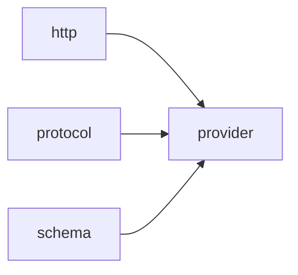

# Module `provider`

## Summary

该模块提供了与 LLM 提供者进行网络通信的核心基础设施，主要负责管理环境配置（如 API 密钥和基础 URL）、构建并验证 HTTP 请求路径、序列化工具调用参数以及解析原始响应。它隐藏了底层的凭证读取、URL 拼接和请求合规性检查等细节，为上层协议模块提供可靠且可复用的底层工具。

在公开实现层面，`provider` 以 `detail` 命名空间形式暴露一组内部函数与类型，包括 `CredentialEnv` 结构体（封装 `base_url_env` 与 `api_key_env` 环境变量名）、`read_credentials`（从环境读取凭证）、`append_url_path`（规范化拼接路径段）、`parse_json_object`（安全解析 JSON 对象）、`serialize_tool_arguments`（将工具参数序列化为字符串）以及 `validate_completion_request`（校验 completion 请求的结构与语义）。这些元素共同构成了与 LLM 提供者交互的通用工具集，被协议与 schema 模块间接使用。

## Imports

- [`http`](../http/index.md)
- [`protocol`](../protocol/index.md)
- [`schema`](../schema/index.md)
- `std`

## Imported By

- [`anthropic`](../anthropic/index.md)
- [`openai`](../openai/index.md)

## Dependency Diagram

## Types

### `clore::net::detail::CredentialEnv`

Declaration: `network/provider.cppm:14`

Definition: `network/provider.cppm:14`

Declaration: [`Namespace clore::net::detail`](../../namespaces/clore/net/detail/index.md)

结构体 `clore::net::detail::CredentialEnv` 提供一对 `std::string_view` 字段：`base_url_env` 和 `api_key_env`，分别保存待查找的环境变量名称，用于在运行时获取服务的基础 URL 和 API 密钥。该结构体仅作为纯数据聚合，不包含任何构造函数或成员函数，其不变性由调用方保证——两个字段指向的字符串视图必须引用具有静态存储期的字符串字面量或由调用方管理的持久缓冲区。

#### Invariants

- `base_url_env` and `api_key_env` should point to valid, immutable string views
- No invariants are enforced by the struct; callers are responsible for ensuring the string views remain valid

#### Key Members

- `base_url_env`
- `api_key_env`

#### Usage Patterns

- Used to pass environment variable names to credential retrieval logic
- Likely instantiated in higher-level credential handling code

## Functions

### `clore::net::detail::append_url_path`

Declaration: `network/provider.cppm:21`

Definition: `network/provider.cppm:43`

Declaration: [`Namespace clore::net::detail`](../../namespaces/clore/net/detail/index.md)

该函数通过去除尾部斜杠和头部斜杠来安全拼接 URL 基路径与路径片段。它先将 `base_url` 拷贝到 `url` 中，并用一个 `while` 循环移除末尾连续的 `/` 字符；再将 `path` 拷贝到 `suffix` 中，用另一个 `while` 循环移除开头的连续 `/`。若 `suffix` 非空，则在 `url` 末尾添加一个 `/` 后追加 `suffix`，最终返回拼接后的 `std::string`。整个实现仅依赖 `std::string` 与 `std::string_view` 的基本操作，无外部函数调用或复杂依赖。

#### Side Effects

No observable side effects are evident from the extracted code.

#### Reads From

- `base_url`
- `path`

#### Usage Patterns

- building HTTP request `URLs`
- URL path normalization

### `clore::net::detail::parse_json_object`

Declaration: `network/provider.cppm:27`

Definition: `network/provider.cppm:148`

Declaration: [`Namespace clore::net::detail`](../../namespaces/clore/net/detail/index.md)

函数 `clore::net::detail::parse_json_object` 封装了 JSON 解析与错误处理的核心流程。它首先调用 `json::parse<json::Object>` 对输入 `raw` 进行结构化解析；若返回的 `std::expected` 不含值，则使用 `std::format` 将传入的 `context` 字符串与解析错误信息拼接，构建一个 `LLMError` 对象并包装为 `std::unexpected` 返回。该函数直接依赖 `json::parse<json::Object>` 提供的 JSON 解析能力，并通过 `std::format` 与 `LLMError` 实现友好错误报告。

解析成功时，函数返回经过移动的 `json::Object` 值；整个过程不涉及任何外部状态或复杂分支，仅聚焦于将 `raw` 转换为强类型对象的同时保留错误上下文。`context` 参数通常由调用者传入，用于标识解析场景（如环境变量名或请求路径），以便在失败时定位问题。

#### Side Effects

No observable side effects are evident from the extracted code.

#### Reads From

- `raw` parameter
- `context` parameter

#### Usage Patterns

- parsing JSON objects from raw strings with error context

### `clore::net::detail::read_credentials`

Declaration: `network/provider.cppm:19`

Definition: `network/provider.cppm:39`

Declaration: [`Namespace clore::net::detail`](../../namespaces/clore/net/detail/index.md)

函数 `clore::net::detail::read_credentials` 作为一个轻量代理，将凭据读取工作委托给 `read_environment`。它接受一个 `clore::net::detail::CredentialEnv` 实例，从中提取 `base_url_env` 和 `api_key_env` 两个字段作为参数直接转发。该函数不执行任何其他逻辑或校验；其内置的控制流即单次函数调用。依赖方面，它直接依赖于 `read_environment` 的签名和返回类型 `std::expected<EnvironmentConfig, LLMError>`，以及 `clore::net::detail::CredentialEnv` 结构体的定义。整个实现仅作为接口适配层，隔离了环境变量读取的具体细节。

#### Side Effects

- Reads environment variables as performed by the called function `read_environment`.

#### Reads From

- `env.base_url_env` (environment variable name for base URL)
- `env.api_key_env` (environment variable name for API key)
- Environment variable storage (indirectly via `read_environment`)

#### Usage Patterns

- Used to obtain base URL and API key from environment variables for network requests.
- Called by higher-level functions that require `EnvironmentConfig` initialization.

### `clore::net::detail::serialize_tool_arguments`

Declaration: `network/provider.cppm:30`

Definition: `network/provider.cppm:158`

Declaration: [`Namespace clore::net::detail`](../../namespaces/clore/net/detail/index.md)

该函数首先将输入的 `arguments` 通过 `json::to_string` 序列化为字符串。若序列化失败，它会立即用 `unexpected_json_error` 构造一个包含 `context` 与序列化错误信息的 `LLMError` 并返回。若成功，则对得到的字符串执行 `json::parse` 将其重新解析为 `json::Value`。解析一旦失败，函数返回一个 `std::unexpected` 包装的错误，其消息由 `std::format` 组合出 `context` 与解析错误描述。当两个步骤均顺利通过后，它返回一个 `std::pair`，其中包含原始序列化字符串与解析后的 JSON 值，二者均为移动语义。

整个过程唯一的依赖是 `json::to_string` 与 `json::parse` 的健全性，以及 `LLMError` 和 `unexpected_json_error` 的错误包装机制。函数本身不参与任何外部状态修改或异步操作，严格遵循先序列化再反序列化的冗余校验模式。

#### Side Effects

No observable side effects are evident from the extracted code.

#### Reads From

- `arguments` (parameter)
- `context` (parameter)

#### Writes To

- return value via `std::expected` containing a pair of `std::string` and `json::Value`

#### Usage Patterns

- Used to normalize a JSON value by ensuring it can be serialized and deserialized without loss
- Provides both string and structured representations for downstream processing
- Called when preparing tool arguments for serialization in network requests

### `clore::net::detail::validate_completion_request`

Declaration: `network/provider.cppm:23`

Definition: `network/provider.cppm:61`

Declaration: [`Namespace clore::net::detail`](../../namespaces/clore/net/detail/index.md)

函数 `clore::net::detail::validate_completion_request` 对输入的 `CompletionRequest` 执行分层验证。首先检查 `request.model` 和 `request.messages` 是否非空，若为空则立即返回 `std::unexpected(LLMError(...))`。随后根据参数 `validate_response_format_schema` 决定是否调用 `validate_response_format` 验证 `request.response_format`，并根据 `validate_tool_schemas` 决定是否遍历 `request.tools` 并对每一项调用 `validate_tool_definition`。在工具相关字段上，若 `request.tool_choice` 或 `request.parallel_tool_calls` 存在但 `request.tools` 为空，则报错；若 `tool_choice` 为 `ForcedFunctionToolChoice`，还需检查强制调用的工具名是否存在于 `request.tools` 中。最后遍历 `request.messages`，通过 `std::visit` 分派消息类型：对 `AssistantToolCallMessage` 要求 `content` 或 `tool_calls` 非空，且每条 `tool_calls` 的 `id` 和 `name` 非空且 `id` 无重复；对 `ToolResultMessage` 要求 `tool_call_id` 非空。所有检查通过后返回一个空 `std::expected<void, LLMError>`。该函数依赖内部函数 `validate_response_format`、`validate_tool_definition` 及类型 `ForcedFunctionToolChoice`、`AssistantToolCallMessage`、`ToolResultMessage` 和 `std::visit`、`std::get_if` 的分发机制。

#### Side Effects

No observable side effects are evident from the extracted code.

#### Reads From

- request`.model`
- request`.messages`
- request`.response_format`
- request`.tools`
- request`.tool_choice`
- request`.parallel_tool_calls`
- message content
- `tool_calls` entries
- `tool_call_id`

#### Usage Patterns

- Called before sending a completion request to ensure validity
- Used in request preparation pipeline

## Internal Structure

该模块封装了与特定 LLM 提供者进行网络通信的核心逻辑，内部通过 `detail` 子命名空间将凭据读取、URL 拼接、请求验证和工具参数序列化等底层操作与对外接口解耦。模块依赖关系严格：`http` 模块提供实际收发能力，`protocol` 模块定义请求/响应数据结构，`schema` 模块负责 JSON Schema 生成和校验，通过这种分层隔离了网络层、协议层和元数据层的职责。实现结构上，所有内部函数均通过 `int` 返回值指示成功或错误（零值表示成功），避免了异常传播，便于上层模块以统一的错误码方式集成和诊断问题。

## Related Pages

- [Module http](../http/index.md)
- [Module protocol](../protocol/index.md)
- [Module schema](../schema/index.md)

